# Galerie des captures d'écran (références UI)

Captures de **référence** des écrans de VigieChiro PR Companion, à comparer aux
maquettes du brief SAÉ 2.01. Chaque image est rendue **hors-écran** et de façon
**déterministe** via la *Headless Platform* de JavaFX 26 (`glass.platform=Headless`,
rendu logiciel) : aucune fenêtre ni serveur d'affichage requis (utilisable en CI,
conteneur ou session Wayland).

- **Régénérer** : `./.github/assets/capture-screenshots.sh` (lancer avec un **JDK 25
  standard** ; le rendu est déterministe, deux exécutions produisent des PNG
  identiques au bit près).
- **Complétude garantie** : [`captures.manifest`](captures.manifest) liste chaque vue
  `**/view/*.fxml` avec au moins une capture, et [`check-captures.sh`](check-captures.sh)
  vérifie en CI qu'aucune vue n'est livrée sans capture de référence.
- **Outil enseignant** (présent sur la branche `solution`). Les écrans sont seedés
  puis pilotés par les classes `fr.univ_amu.iut.<feature>.outils.Capture*`.

> Chaque vue est présentée avec ses **états pertinents côte à côte** (vide/peuplé,
> initial/avancé, verrouillé/déverrouillé...). Cliquer sur une vignette ouvre le PNG
> en pleine résolution.

---

## Accueil

Bandeau applicatif et cartes d'activités donnant accès aux features.

`commun/view/MainView.fxml`

---

## Mes sites

### Liste des sites (`sites/view/MesSites.fxml`)

<table>
<tr>
<th>Peuplée : cartes des sites</th>
<th>État initial : onboarding « premier site »</th>
</tr>
<tr>
<td></td>
<td><a href="apercu-sites-mes-sites-vide.png">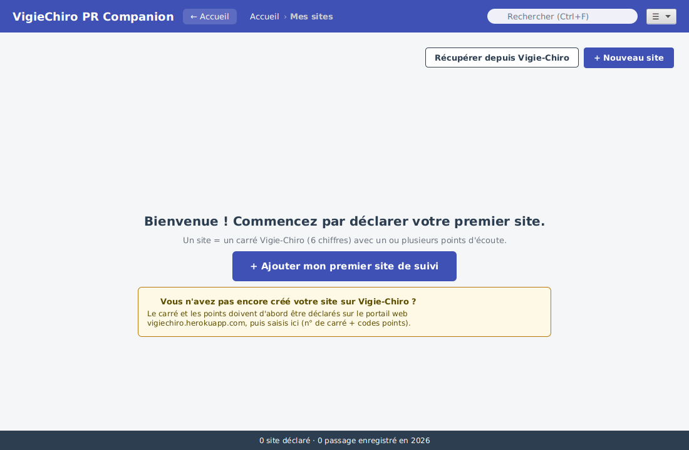</a></td>
</tr>
</table>

### Détail d'un site (`sites/view/SiteDetail.fxml`)

<table>
<tr>
<th>Avec passages : fiche + points + tableau</th>
<th>Sans passage : tableau vide</th>
</tr>
<tr>
<td><a href="apercu-sites-detail.png">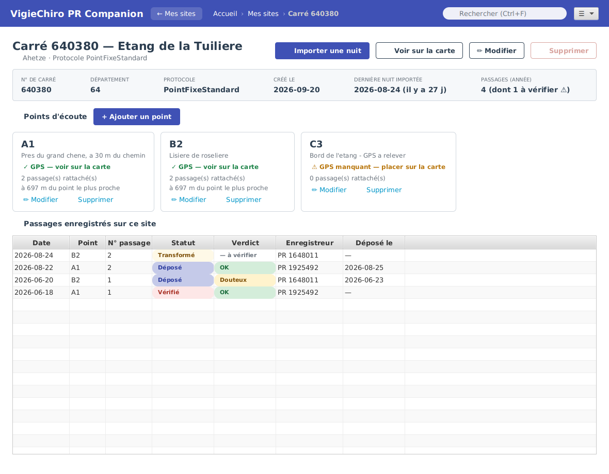</a></td>
<td><a href="apercu-sites-detail-sans-passage.png">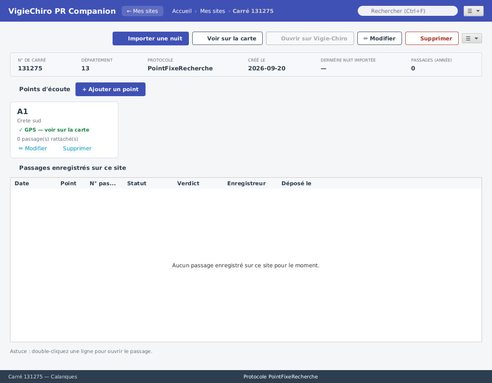</a></td>
</tr>
</table>

### Modale point d'écoute (`sites/view/ModalePoint.fxml`)

<table>
<tr>
<th>Édition : champs pré-remplis</th>
<th>Création : formulaire vierge</th>
</tr>
<tr>
<td><a href="apercu-sites-modale-point.png">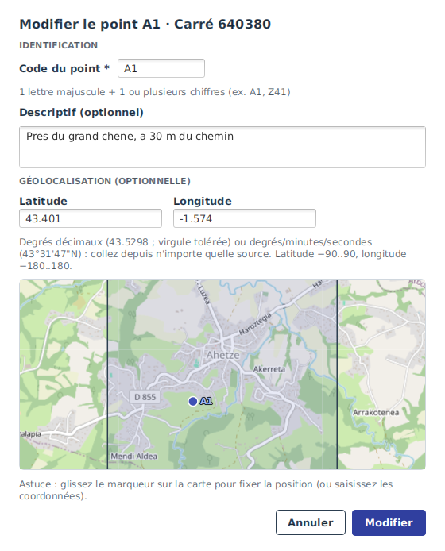</a></td>
<td><a href="apercu-sites-modale-point-creation.png">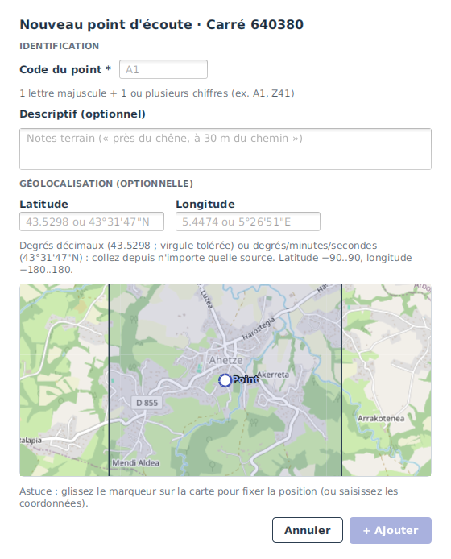</a></td>
</tr>
</table>

---

## Importer une nuit

Assistant d'import d'une nuit de Passive Recorder (`importation/view/Importation.fxml`).

<table>
<tr>
<th>Assistant : cas standard</th>
<th>Import en cours : progression déterministe, formulaire gelé</th>
</tr>
<tr>
<td></td>
<td><a href="apercu-import-en-cours.png">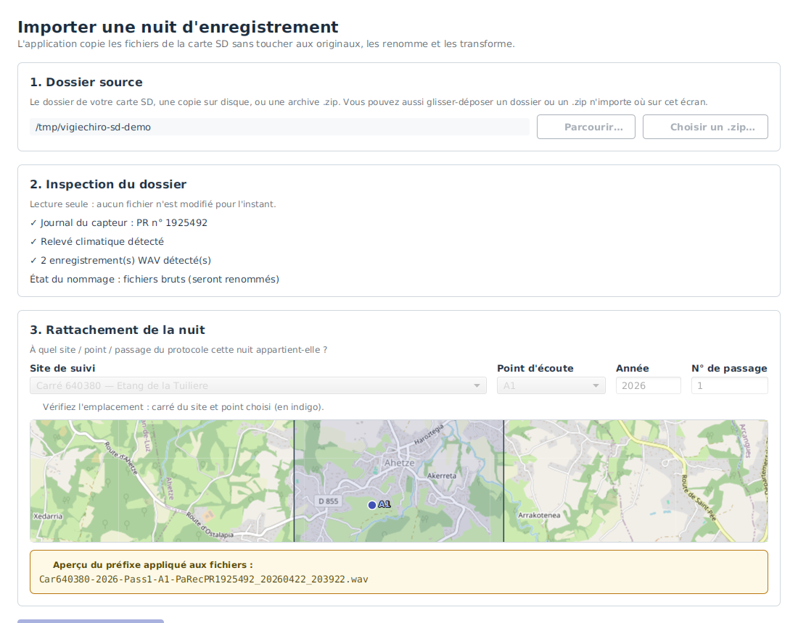</a></td>
</tr>
<tr>
<th>Cas « mélange » : 2 enregistreurs, avertissement non bloquant</th>
<th>Cas « incohérence » : journal/relevé en désaccord avec les WAV</th>
</tr>
<tr>
<td><a href="apercu-import-melange.png">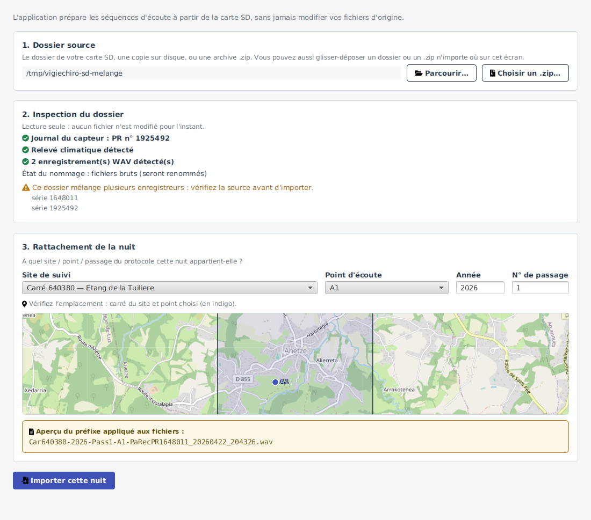</a></td>
<td><a href="apercu-import-incoherence.png">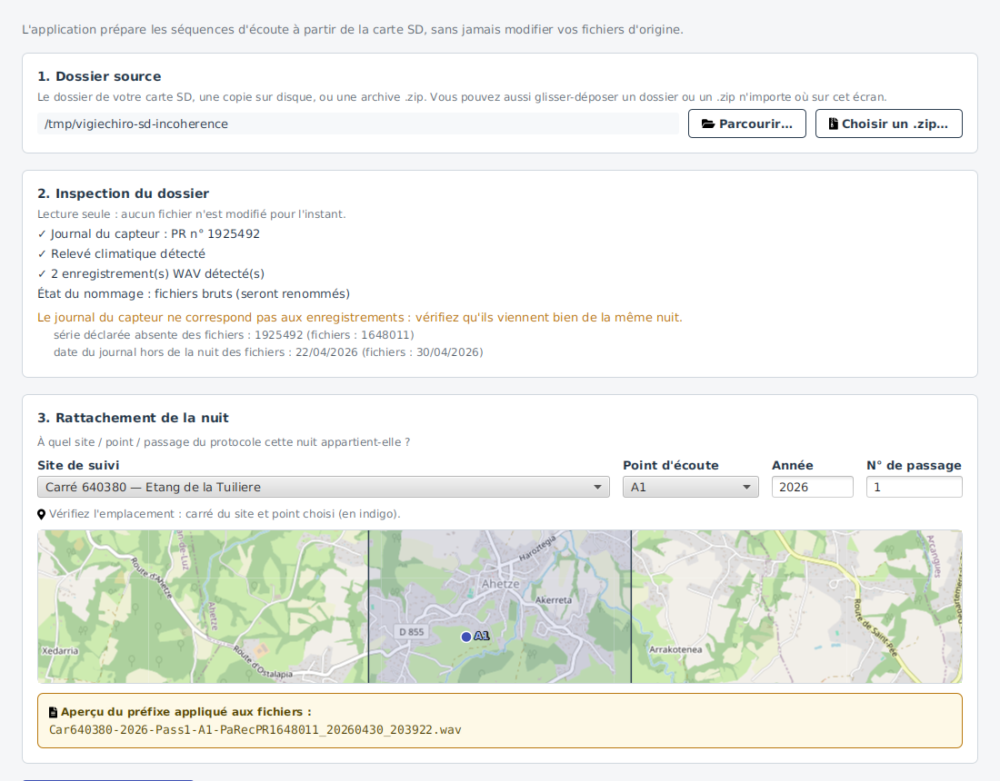</a></td>
</tr>
<tr>
<th>Source « .zip » : décompression avec progression</th>
<th>Rapport d'import : fichiers rejetés listés (import résilient)</th>
</tr>
<tr>
<td><a href="apercu-import-decompression.png">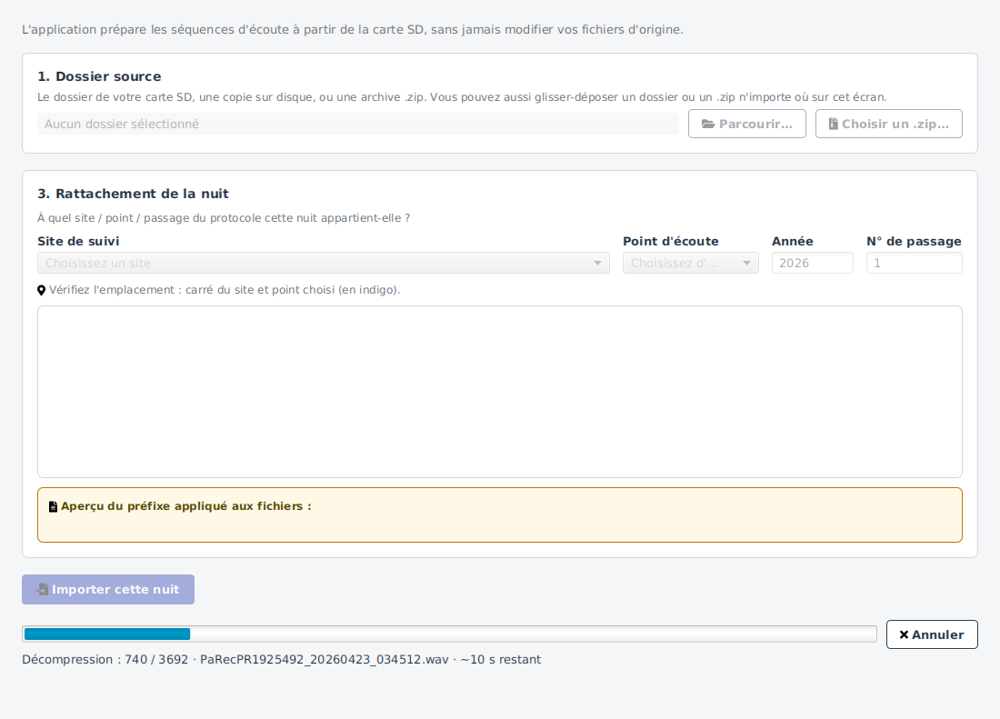</a></td>
<td></td>
</tr>
</table>

---

## Qualification

Sélection et écoute des séquences, pose du verdict (`qualification/view/Qualification.fxml`).

<table>
<tr>
<th>État initial : sélection générée, rien d'écouté, sans verdict</th>
<th>Avancé : séquences écoutées, verdict OK posé</th>
</tr>
<tr>
<td><a href="apercu-qualification-initial.png">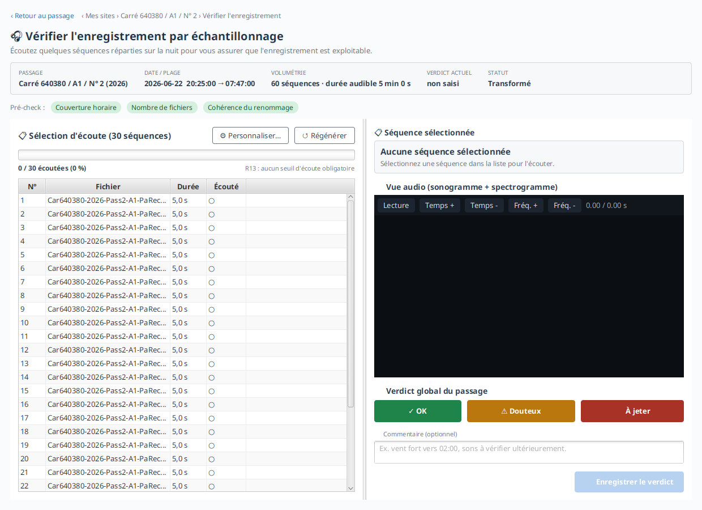</a></td>
<td></td>
</tr>
</table>

---

## Passage

### Pivot du workflow (`passage/view/Passage.fxml`)

<table>
<tr>
<th>Statut Vérifié : préparer le dépôt actif, validation verrouillée</th>
<th>Statut Déposé : dépôt fait, validation déverrouillée</th>
</tr>
<tr>
<td></td>
<td><a href="apercu-passage-depose.png">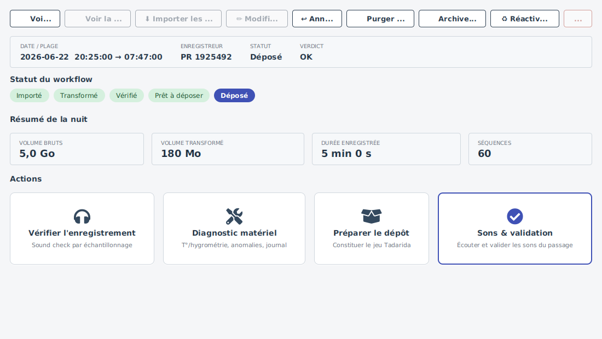</a></td>
</tr>
</table>

### Modale rattachement (`passage/view/RattachementModale.fxml`)

Modifier le rattachement d'un passage : année + n° de passage.

<a href="apercu-passage-rattachement.png">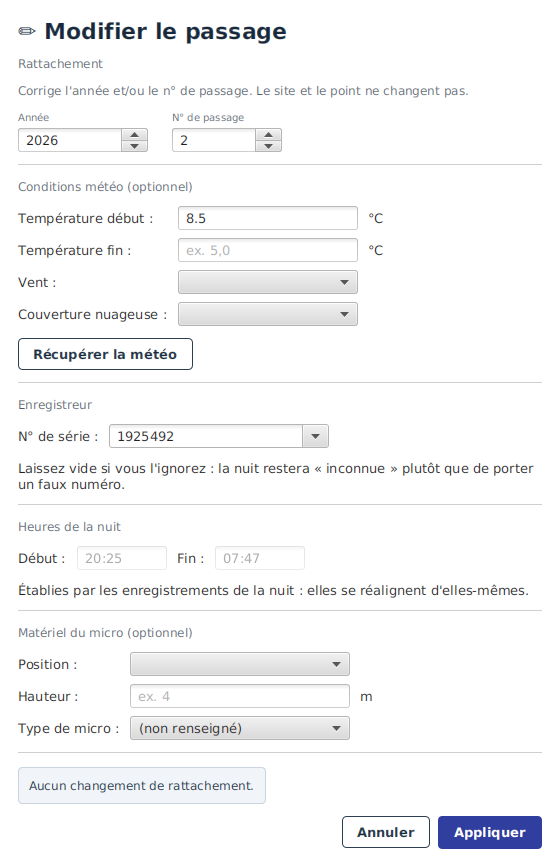</a>

---

## Diagnostic

Conditions de la nuit et anomalies (`diagnostic/view/Diagnostic.fxml`).

<table>
<tr>
<th>Relevé présent : courbe climat + anomalies + GPS</th>
<th>Relevé absent : absence signalée, anomalies seules</th>
</tr>
<tr>
<td></td>
<td><a href="apercu-diagnostic-sans-releve.png">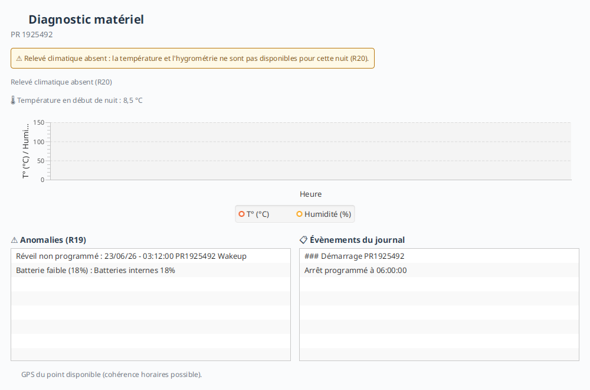</a></td>
</tr>
</table>

---

## Sons & validation

Vue audio unifiée (`audio/view/SonsValidation.fxml`) : écoute, validation / correction et corpus de
sons de référence, alimentée par le passage, l'analyse, le multisite et l'accueil.

<table>
<tr>
<th>Sur le corpus de référence : table, écoute pleine largeur, actions</th>
</tr>
<tr>
<td></td>
</tr>
</table>

---

## Lot

Préparation et dépôt du lot vers la plateforme (`lot/view/Lot.fxml`).

Workflow du dépôt étape par étape : ① préparer · ② générer les archives · ③ téléverser · ④ marquer
déposé (+ cas bloquant).

<table>
<tr>
<th>① Vérifié : « Vérifier et préparer le lot »</th>
<th>② Prêt à déposer : « Générer les archives » actif</th>
<th>② Génération en cours : indicateur, actions gelées</th>
</tr>
<tr>
<td></td>
<td><a href="apercu-lot-deposer.png">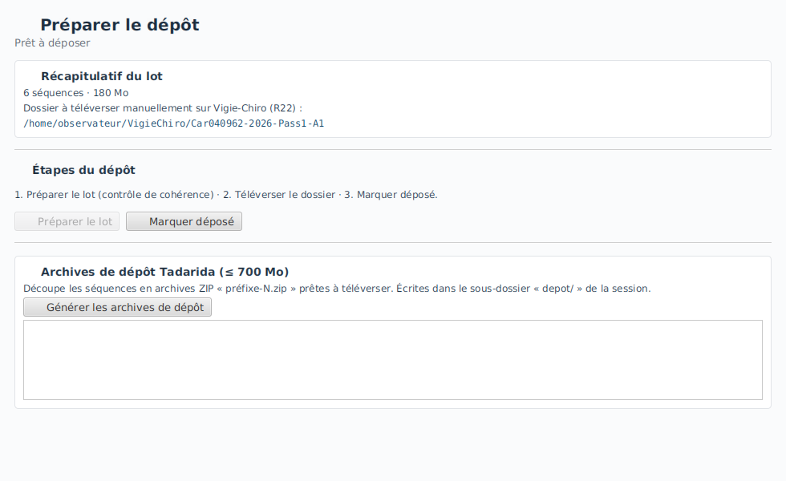</a></td>
<td><a href="apercu-lot-generation.png">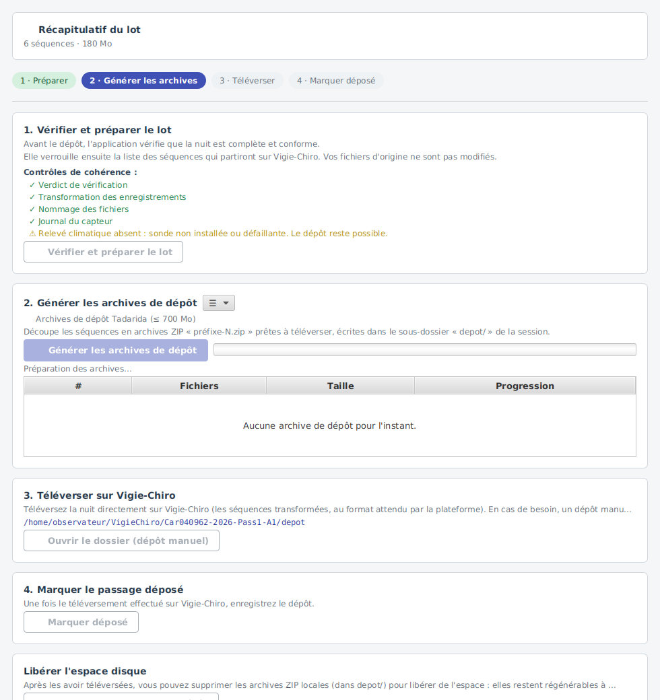</a></td>
</tr>
<tr>
<th>③ Archives générées : liste ZIP, « Ouvrir le dossier »</th>
<th>④ Déposé : toutes les étapes franchies</th>
<th>Vérifié incohérent : alertes de cohérence R14</th>
</tr>
<tr>
<td><a href="apercu-lot-archives.png">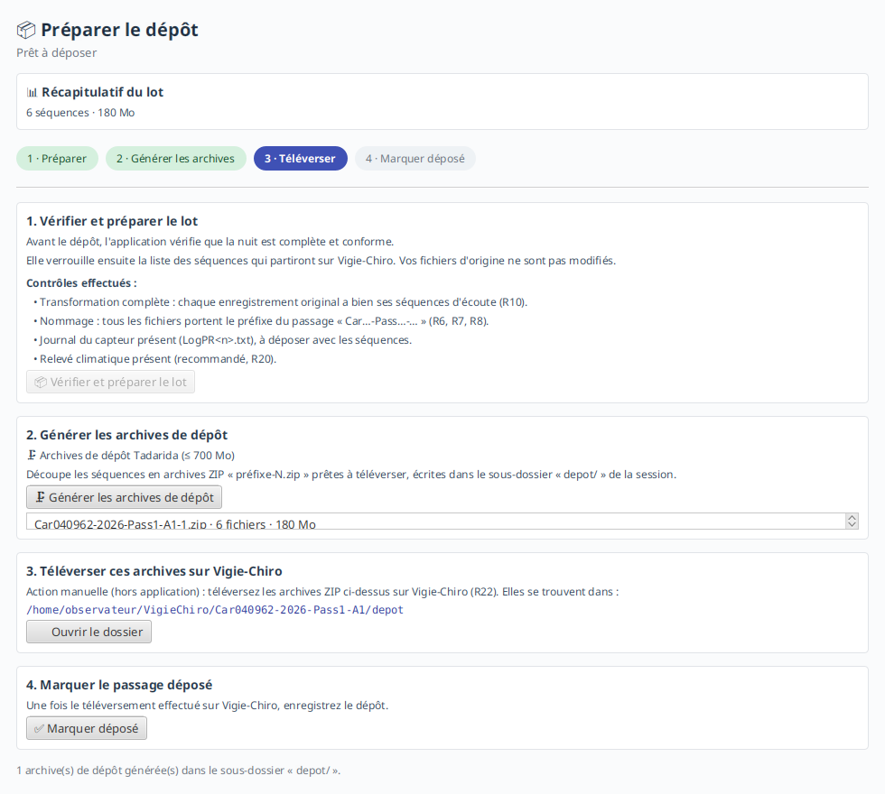</a></td>
<td><a href="apercu-lot-depose.png">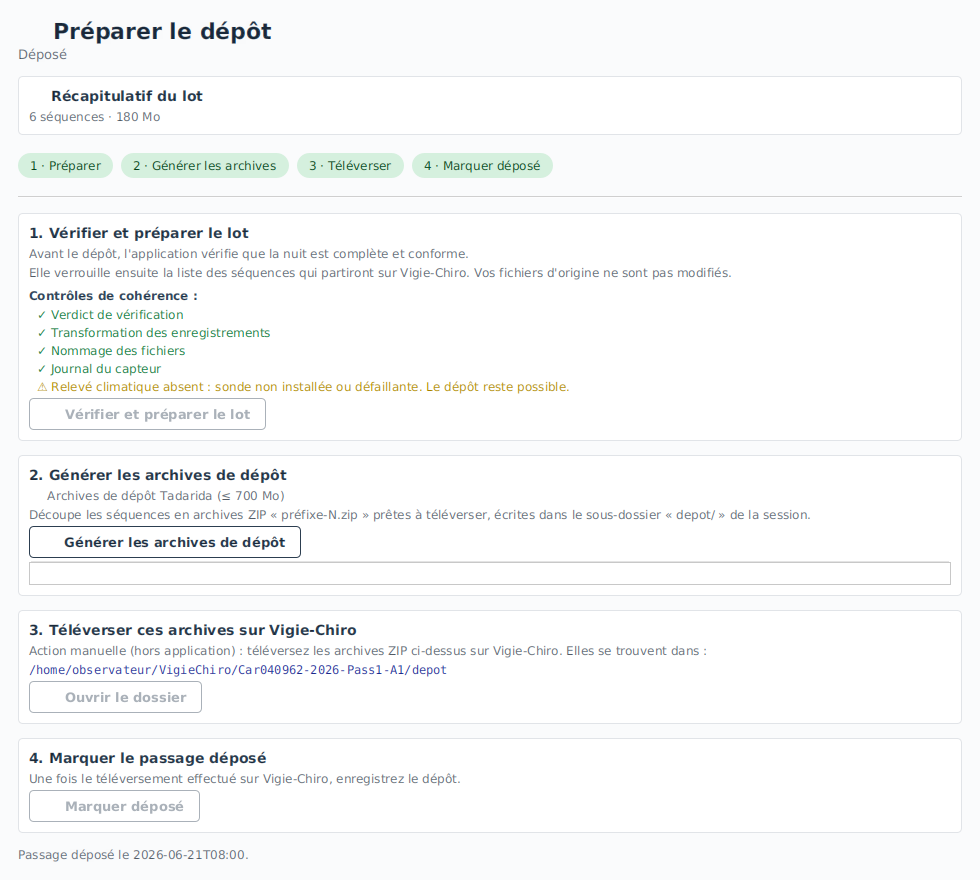</a></td>
<td><a href="apercu-lot-alertes.png">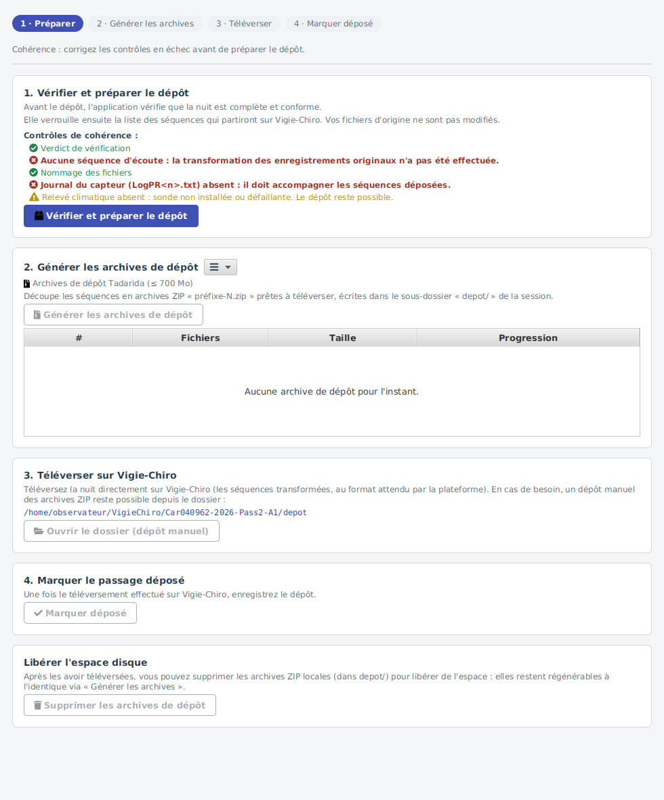</a></td>
</tr>
</table>

---

## Vue multi-sites

### Tableau agrégé (`multisite/view/Multisite.fxml`)

<table>
<tr>
<th>Vue agrégée : tableau complet, filtres, tri, export</th>
<th>Filtré par verdict OK : résumé recalculé</th>
</tr>
<tr>
<td></td>
<td><a href="apercu-multisite-filtre.png">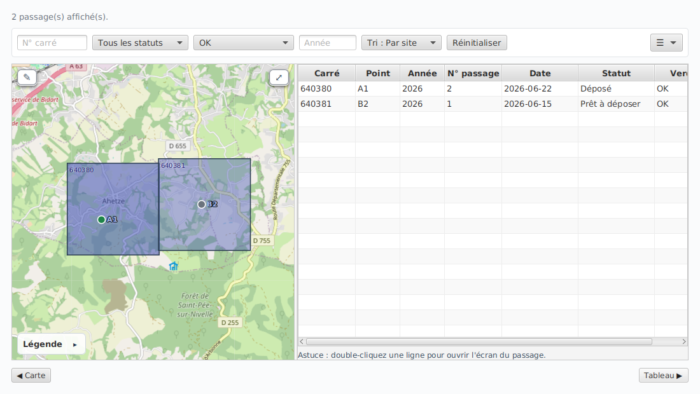</a></td>
</tr>
</table>

---

## Espèces & observations

### Inventaire (`analyse/view/Analyse.fxml`)

Inventaire transverse des espèces détectées (prisme biodiversité), regroupable **par espèce** ou
**par carré** (richesse spécifique) et filtrable par statut.

<table>
<tr>
<th>Par espèce : détections, passages, carrés, période</th>
<th>Par carré : richesse spécifique</th>
</tr>
<tr>
<td></td>
<td><a href="apercu-analyse-carre.png">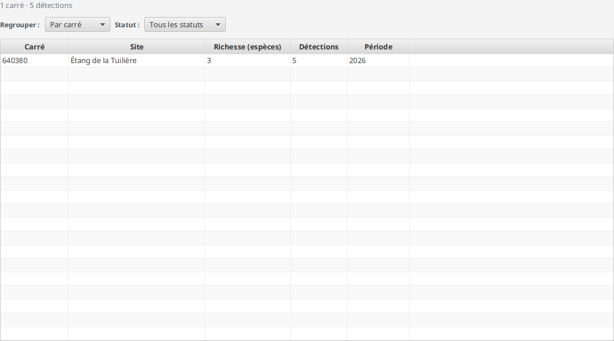</a></td>
</tr>
</table>

### Carte de répartition

Bascule cartographique : richesse par carré sur la carte (espèce sélectionnée surlignée).

---

## Recherche globale

Recherche transverse (sites, points, passages) accessible au clavier (Ctrl+F).

---

## Autres ressources de ce dossier

Ce dossier contient aussi des illustrations hors galerie UI :

- `logo.png` : logo du projet.
- `create_codespace_on_main.png`, `codespace_vscode.png`,
  `codespace_vscode_nouveau_terminal.png` : captures du parcours d'ouverture d'un
  Codespace (référencées par la documentation d'installation).
