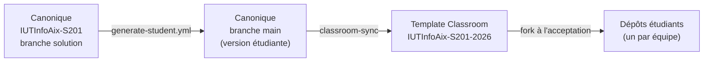

# Contribuer à VigieChiro PR Companion

Ce document s'adresse à l'**équipe pédagogique** qui maintient le dépôt **canonique**
(`IUTInfoAix-S201/vigiechiro-pr-companion`) : ajouter une feature, écrire un test d'acceptation,
faire évoluer le socle ou l'outillage. Il décrit le fonctionnement **interne** du dépôt.

> Vous êtes étudiant·e et cherchez comment rendre une feature ? Ce n'est pas ici : votre point
> d'entrée est le [README](README.md) (parcours métier, architecture, workflow issue → PR).

Le détail des tests est dans [TESTING.md](TESTING.md) ; la politique de sécurité et de données dans
[SECURITY.md](SECURITY.md).

---

## 1. Le rôle du dépôt

Ce dépôt est le **code de référence** de la SAÉ 2.01. Il sert deux publics :

- l'**équipe pédagogique**, qui y construit la correction complète (le « tout vert ») ;
- les **étudiant·es**, qui en reçoivent une **version dérivée** (sans les solutions) via
  GitHub Classroom.



On ne travaille **jamais** directement dans les forks étudiants depuis ce dépôt : tout part de la
branche `solution`.

---

## 2. Le modèle à deux branches

| Branche | Rôle | On y commit ? |
|---|---|---|
| `solution` | **Branche par défaut.** Implémentations complètes, tests d'acceptation **actifs** (sans `@Disabled`), `solution` doit rester **toute verte**. | **Oui** : c'est la seule branche de travail. |
| `main` | **Version étudiante.** Artefact **dérivé** et **orphelin** (un seul commit, sans historique) : stubs, tests `@Disabled`, blocs solution retirés. | **Non, jamais.** Régénérée automatiquement. |

`main` est reconstruite à **chaque push sur `solution`** par le workflow
[`.github/workflows/generate-student.yml`](.github/workflows/generate-student.yml), qui :

1. lance `scripts/generate-student.sh --apply .` (produit l'arbre étudiant) ;
2. crée un commit **orphelin** et **force-push** sur `main` ;
3. déclenche la synchronisation Classroom (template + forks déjà créés).

Un commit manuel sur `main` serait **écrasé** au prochain push sur `solution`. Le hook pre-commit le
bloque d'ailleurs dans le dépôt enseignant (détection : la branche `solution` existe localement).

---

## 3. Mettre en place l'environnement

Tout passe par le **Maven Wrapper** `./mvnw` (aucune installation de Maven). Le JDK doit être un
**JDK 25 standard** (Temurin / `25.0.2-open`), **pas** un JDK packagé avec JavaFX : JavaFX 26 vient
des dépendances Maven, et la *Headless Platform* est purement logicielle (cf. [TESTING.md](TESTING.md)).

```bash
git clone git@github.com:IUTInfoAix-S201/vigiechiro-pr-companion.git
cd vigiechiro-pr-companion
git checkout solution
./mvnw verify        # premier appel : télécharge Maven + dépendances, puis tout est en cache
```

Au **premier `./mvnw`**, le plugin `git-build-hook` configure silencieusement
`core.hooksPath=.githooks`, ce qui active le hook **pre-commit** ([.githooks/pre-commit](.githooks/pre-commit)).
Ce hook, sur la branche `solution` :

- formate les `.java` stagés avec **Spotless** (Palantir Java Format) ;
- lance `scripts/lint-doc-coherence.sh` (cohérence doc) et `./mvnw -Pquality-gate pmd:check`
  (code smells) ; le commit est **bloqué** en cas de problème.

Bypass d'urgence : `SKIP_LINT=1 git commit ...` (à éviter, c'est le filet du portail qualité).

> Avant tout commit, vérifiez l'identité git : `git config user.email` doit être l'adresse
> institutionnelle (`prenom.nom@univ-amu.fr`).

---

## 4. Le système de marqueurs pédagogiques

C'est le cœur de la mécanique solution → étudiant. Sur la branche `solution`, des **marqueurs** en
commentaire délimitent ce qui doit disparaître (ou apparaître) côté étudiant. La référence
d'implémentation est [`scripts/lib/student-transforms.sh`](scripts/lib/student-transforms.sh).

| Marqueur | Fichiers | Effet côté étudiant |
|---|---|---|
| `// --solution--` … `// --end-solution--` | `.java` | Le bloc encadré est **supprimé**. |
| `/* --student--` … `--end-student-- */` | `.java` | Le bloc (commentaire inerte côté solution) est **décommenté** (le stub s'active). |
| `// --solution-only--` | `.java` (dans les **20 premières lignes**) | Le **fichier entier** est supprimé. |
| `<!-- @@solution@@ -->` … `<!-- @@end-solution@@ -->` et `<!-- @@student@@` … `@@end-student@@ -->` | `.fxml` | Bloc solution supprimé / bloc étudiant décommenté (jetons XML-safe : un commentaire XML ne peut pas contenir `--`). |
| `// --masquer-etudiant--` … `// --fin-masquer-etudiant--` | `.java` | Le code actif côté solution est **mis en commentaire** côté étudiant (pour un test qui ne compilerait plus une fois l'IHM retirée). |

Exemple (Java, bloc supprimé côté étudiant) :

```java
// TODO : afficher la liste des sites
// --solution--
sitesListView.setItems(viewModel.getSites());
// --end-solution--
```

Exemple (Java, stub activé côté étudiant) :

```java
/* --student--
return FXCollections.observableArrayList(); // à remplacer par la vraie liste
--end-student-- */
// --solution--
return service.tousLesSites();
// --end-solution--
```

**Règles d'hygiène** :

- chaque marqueur d'ouverture a **exactement** son marqueur de fermeture (le linter le vérifie,
  cf. §10) ;
- les fichiers **sans** marqueur passent inchangés côté étudiant ;
- après stripping, les tests neutralisés reçoivent `@Disabled("Retire cette annotation pour activer le test")`.

---

## 5. Le pipeline de génération étudiante

| Élément | Rôle |
|---|---|
| [`scripts/generate-student.sh`](scripts/generate-student.sh) | Orchestration (extrait `solution`, applique les transforms, ajoute `@Disabled`, lance Spotless, **vérifie la compilation**). |
| [`scripts/lib/student-transforms.sh`](scripts/lib/student-transforms.sh) | Transformations **pures** (aucune dépendance git/maven), partagées avec les tests. |
| [`scripts/test/student-transforms.bats`](scripts/test/student-transforms.bats) | Tests Bats des transforms (exécutés en CI par `lint.yml`). |
| [`.github/workflows/generate-student.yml`](.github/workflows/generate-student.yml) | Applique le pipeline en CI et force-push `main`. |

Pour tester la version étudiante **localement avant de pousser** :

```bash
./scripts/generate-student.sh .            # dry-run : montre les différences
./scripts/generate-student.sh --apply .    # applique (sur une copie/working tree dédiée)
```

---

## 6. Ajouter ou modifier une feature

L'architecture est **package-by-feature + MVVM** (cf. [README §2.1](README.md)). Chaque feature vit
dans `src/main/java/fr/univ_amu/iut/<feature>/` et se découpe en `model/`, `viewmodel/`, `view/`,
`di/`.

Points d'attention pour un·e mainteneur·euse :

- **Emplacement des `.fxml` / `.css`** : **à côté** de leur controller, dans
  `src/main/java/.../view/` (et non dans `src/main/resources`). Le `pom.xml` copie les fichiers
  non-Java de `src/main/java` dans `target/classes` au même chemin de paquetage. Les ressources
  **partagées** (migrations `db/migration`, thème) restent, elles, dans `src/main/resources`.
- **Câblage Guice** : la feature publie ses services / ViewModels via son module dans `di/` ;
  les controllers FXML sont injectés via la `controllerFactory`.
- **Respect des frontières MVVM** : elles sont **vérifiées par ArchUnit** (model sans JavaFX,
  viewmodel sans `javafx.scene/fxml/stage`, view sans JDBC, pas de dépendance vers le `view` /
  `viewmodel` d'une autre feature). Voir la liste complète dans [TESTING.md](TESTING.md).
- **`sites` est la feature de référence** : c'est le modèle à reproduire (ViewModel pur lié à une
  vue FXML).

Chaque feature « à construire » doit être livrée avec un **test d'acceptation actif** sur `solution`
(de bout en bout : IHM → ViewModel → service → base) qui deviendra `@Disabled` côté étudiant.

---

## 7. Issues, epics et jalons

Les tâches distribuées aux étudiant·es sont **générées** à partir du dépôt, pas saisies à la main :

- les gabarits vivent dans [`.github/classroom/issues/`](.github/classroom/issues/) (un epic + ses
  sous-tâches viewmodel / fxml / controleur par feature) ;
- [`.github/workflows/bootstrap-issues.yml`](.github/workflows/bootstrap-issues.yml) les crée dans
  chaque fork, puis `link-sub-issues.py` les lie en **sous-issues natives** et `set-milestones.py`
  pose les **jalons MoSCoW**.

> **Ne jamais modifier le _titre_ d'une issue bootstrap** : la déduplication se fait par **titre
> exact**. Changer un titre recrée des doublons au push suivant. Le **corps** est, lui, modifiable.

---

## 8. Conventions de code et de commit

**Code** :

- formatage **Spotless / Palantir Java Format** (le hook s'en charge ; sinon `./mvnw spotless:apply`) ;
- doc-comments **Markdown** `///` (JEP 467), pas de `/** */` HTML ;
- **noms de classes en français**, sans accents dans les identifiants (`Navigateur`, `Passage`,
  `EtapeNavigation`...) ;
- **pas de tiret cadratin** dans la doc et les commentaires : tiret simple ou deux-points.

**Commits** : [Conventional Commits](https://www.conventionalcommits.org/fr/) **en français**, le
scope étant le nom de la feature ou du domaine :

```
feat(passage): écran pivot d'une nuit (statut + navigation)
fix(importation): import hors fil JavaFX gelait l'écran
test(qualification): test d'acceptation du verdict de qualité
docs(readme): renvois vers CONTRIBUTING/TESTING/SECURITY
chore(deps): bump assertj 3.27.7
```

- **petits commits** logiques (un par préoccupation), message axé sur le **pourquoi** ;
- toujours **créer** un nouveau commit plutôt qu'amender.

---

## 9. Workflow de contribution

```bash
git checkout solution && git pull
git checkout -b feat/<feature>
# ... code + test d'acceptation actif ...
./mvnw verify                      # 0 échec, 0 skip indésirable
git commit ...                     # le hook formate + vérifie
git push -u origin feat/<feature>
gh pr create --base solution --fill
```

- La PR cible **`solution`** (et non `main`). `@nedseb` est ajouté en reviewer automatiquement
  ([CODEOWNERS](.github/CODEOWNERS)).
- Privilégier des **PR petites et séquentielles** (par exemple : ViewModel + tests, puis vue
  principale, puis vue secondaire) plutôt qu'une feature entière en un seul gros diff.
- Merger quand la CI est verte ; le push sur `solution` déclenche la régénération de `main` et la
  synchronisation Classroom.

---

## 10. Intégration continue et portails qualité

Deux workflows se déclenchent à chaque push :

| Workflow | Rôle | Bloquant ? |
|---|---|---|
| [`maven.yml`](.github/workflows/maven.yml) | Build + tests headless (`verify -DexcludedGroups=conformite`) + résumé pour le tableau de bord. | **Oui** (tests équipe + garde d'intégrité). Conformité et Spotless mesurés sans bloquer. |
| [`lint.yml`](.github/workflows/lint.yml) (`solution` uniquement) | Cohérence doc, complétude des captures, tests Bats des transforms, **`-Pquality-gate verify`** (PMD + seuils JaCoCo bloquants). | **Oui**, sur `solution` et les PR vers `solution`. |

Les autres workflows : `capture-vues.yml` (captures de référence), `gestion-projet-board.yml`
(kanban par équipe), `devcontainer-image.yml` (image GHCR pré-buildée).

Reproduire le portail qualité **en local** :

```bash
./mvnw -Pquality-gate verify       # PMD + couverture bloquants
./scripts/lint-doc-coherence.sh    # cohérence documentaire
bats scripts/test/student-transforms.bats
```

---

## 11. Publier une version

Les **releases sont automatiques**, pilotées par les Conventional Commits (cf. §8). Sur la branche
`main`, à chaque ensemble de commits mergé :

- `feat:` déclenche une version **mineure**, `fix:` un **patch**, un `BREAKING CHANGE` une **majeure** ;
- **semantic-release** ([.releaserc.json](.releaserc.json)) calcule la version, crée le tag `vX.Y.Z`,
  la Release GitHub et met à jour le [CHANGELOG.md](CHANGELOG.md) ;
- le workflow [`release.yml`](.github/workflows/release.yml) construit alors les **installeurs natifs**
  (Linux `.deb`, macOS `.dmg` arm64 et Intel, Windows `.msi`) via le profil `-Pinstaller`, et les
  attache à la Release (rendue publique seulement une fois **tous** les installeurs téléversés).

Vous n'avez donc **rien à taguer ni à versionner à la main** : merger des commits conventionnels suffit.

> **Activation.** Le workflow est **dormant** tant que la variable de dépôt `ENABLE_RELEASE` n'est pas
> à `true` : à activer quand le dépôt est public et la branche `main` consolidée. Première version : `v1.0.0`.

Construire un installeur **en local** (pour tester le packaging) :

```bash
./mvnw -Pinstaller -Djpackage.type=deb -DskipTests verify   # produit target/dist/
```

---

## 12. Dépendances

Les mises à jour sont gérées par **Dependabot** ([.github/dependabot.yml](.github/dependabot.yml)),
mensuellement, pour `maven` et `github-actions`. **JavaFX (`org.openjfx:*`) est volontairement
exclu** de l'automatisation : ses bumps ont un impact fort (rendu, Headless Platform, plugin
communautaire) et se décident à la main.

---

## 13. En cas de doute

- Un comportement du dépôt vous surprend ? Consultez d'abord les commentaires des fichiers cités
  ci-dessus : ils documentent les décisions (souvent le « pourquoi »).
- Une question pédagogique ou d'organisation : [sebastien.nedjar@univ-amu.fr](mailto:sebastien.nedjar@univ-amu.fr).
