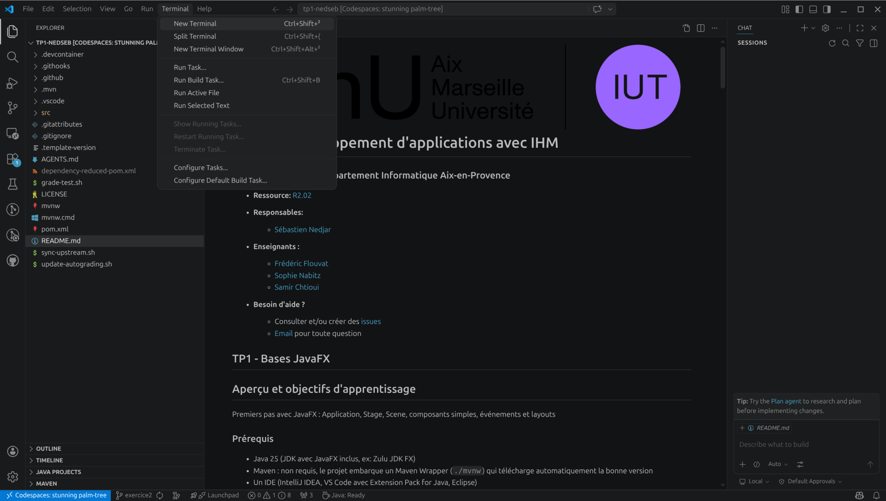

#  SAÉ 2.01 - VigieChiro PR Companion

### IUT d'Aix-Marseille - Département Informatique Aix-en-Provence

- **Ressource:** [SAÉ 2.01](https://cache.media.enseignementsup-recherche.gouv.fr/file/SPE4-MESRI-17-6-2021/35/5/Annexe_17_INFO_BUT_annee_1_1411355.pdf) <!-- TODO enseignant·e : remplacer le PDF par le lien PN propre au module -->

- **Responsable :** [Sébastien Nedjar](mailto:sebastien.nedjar@univ-amu.fr)

- **Enseignantes :**

  - [Sophie Nabitz](mailto:sophie.nabitz@univ-avignon.fr)
  - [Leïla Sakli Miled](mailto:leila.SAKLI@univ-amu.fr)

- **Besoin d'aide ?**
    - Consulter et/ou créer des [issues](https://github.com/IUTInfoAix-S201/vigiechiro/issues)
    - [Email](mailto:sebastien.nedjar@univ-amu.fr) pour toute question


## SAÉ 2.01 - VigieChiro PR Companion

## Objectifs de la séance

### Ce que vous saurez faire à la fin de cette séance

Les exercices de ce TP sont organisés en progression. Cette progression suit la **taxonomie de Bloom**, un modèle pédagogique qui décrit les niveaux de maîtrise d'un savoir-faire -du plus simple (comprendre un concept) au plus complexe (créer une application complète).

| Niveau Bloom | Exercices | Vous serez capable de... | Compétence BUT |
|---|---|---|---|
| **Comprendre** | <!-- ex: 1-2 --> | <!-- TODO : objectif de compréhension --> | <!-- ex: AC11.03 --> |
| **Appliquer** | <!-- ex: 3-4 --> | <!-- TODO : objectif d'application --> | <!-- ex: AC11.03 --> |
| **Analyser / Créer** | <!-- ex: 5-6 --> | <!-- TODO : objectif de création --> | <!-- ex: AC11.02 --> |

**Tout au long du TP**, vous pratiquez les **outils de gestion de projet** (**AC15.02**) : workflow branche → Pull Request → review, Conventional Commits, CI GitHub Actions. <!-- TODO enseignant·e : lister les AC officiels du module -->

### Pourquoi cette démarche ?

Ce TP utilise le **TDD (Test-Driven Development) en baby steps** : les tests sont livrés désactivés (`@Disabled`) et vous les activez un par un, comme un cahier des charges dont on implémente les exigences une à une. Ce n'est pas un artifice pédagogique -c'est une **méthode de développement professionnel** (formalisée par Kent Beck dans l'Extreme Programming) utilisée dans l'industrie logicielle.

Le workflow Git que vous pratiquerez -créer une branche par exercice, pousser, ouvrir une Pull Request, recevoir une review automatique de Copilot, puis merger -reproduit le **cycle de travail en entreprise**. L'objectif est d'apprendre à collaborer avec des outils, pas seulement à écrire du code.

Copilot Chat est configuré dans ce projet comme un **tuteur** : il ne donnera pas la solution d'emblée. Il commence par expliquer le concept, puis oriente vers la documentation, et ne propose du code qu'en dernier recours. L'objectif est que vous compreniez chaque ligne de code que vous écrivez.

### Lien avec la SAE

<!-- TODO : adapter le paragraphe au TP. Expliquer quelles compétences
     de CE TP seront réutilisées dans la SAE du semestre. -->

Code de départ de la SAÉ 2.01 : application JavaFX de traitement des nuits de capture de chauves-souris (Passive Recorder), couplée R2.02 (IHM) et R2.03 (qualité).

### Prérequis

#### Connaissances attendues

<!-- TODO : adapter au TP. Pour le TP2 TDD : bases POO Java (R2.01), Git (TP1 de ce module).
     Pour TP3 Kata / TP4 Refactoring : ajouter TP2 TDD comme prérequis. -->

- **Bases de la programmation** : variables, types, structures de contrôle, tableaux -acquis en C++ dans la ressource R1.01
- **Programmation orientée objet en Java** : classes, objets, héritage, interfaces, polymorphisme -acquis dans la ressource R2.01
- **Bases de Git** : clone, commit, push, pull, branche -vus dans le TP1 de ce module

#### Environnement technique

L'ensemble du TP se fait sur **GitHub Codespaces** -aucune installation locale n'est nécessaire. L'environnement (Java 25, Maven, Git, Copilot Chat) est pré-configuré et prêt à l'emploi dès l'ouverture du Codespace.

> Pour une installation locale (facultative), voir la section [Dépannage](#dépannage) en fin de document.

### Documentation de référence

- [Java 25 API Documentation](https://docs.oracle.com/en/java/javase/25/docs/api/)
- [JUnit 5 User Guide](https://junit.org/junit5/docs/current/user-guide/)
- [AssertJ Core Documentation](https://assertj.github.io/doc/)
- [ApprovalTests Java](https://github.com/approvals/ApprovalTests.Java)

---

## Mise en place

La mise en place se fait en deux étapes : accepter le devoir sur GitHub Classroom (qui crée votre dépôt personnel), puis ouvrir ce dépôt dans un Codespace (votre environnement de développement dans le navigateur).

### Étape 1 - Accepter le devoir sur GitHub Classroom

1. Cliquez sur le lien suivant :

   👉 **https://classroom.github.com/a/XXXXXX**

2. Si c'est votre première utilisation de GitHub Classroom, autorisez l'accès à votre compte GitHub.
3. Sélectionnez votre nom dans la liste des étudiants (si elle apparaît) pour associer votre compte GitHub à votre identité dans le cours.
4. Cliquez sur **"Accept this assignment"**.
5. Attendez quelques secondes - GitHub crée automatiquement un dépôt à votre nom : `IUTInfoAix-S201-2026/vigiechiro-votreLogin`.
6. Cliquez sur le lien du dépôt créé pour y accéder.

### Étape 2 - Ouvrir le projet dans GitHub Codespaces

Une fois sur la page de votre dépôt :

1. Cliquez sur le bouton vert **"Code"** (en haut à droite du listing de fichiers).
2. Sélectionnez l'onglet **"Codespaces"**.
3. Cliquez sur **"Create codespace on main"**.

 Codespaces -> Create codespace on main" width="400"/>

4. Attendez que l'environnement se construise (de 1 à 5 minutes la première fois).
5. VS Code s'ouvre **dans votre navigateur** avec tout l'environnement pré-configuré :
   - Java 25
   - Maven (via le wrapper `./mvnw`)
   - Git
   - Copilot Chat (votre assistant IA pédagogique)
   - Toutes les extensions nécessaires


> [!IMPORTANT]
> Le Codespace est **personnel et persistant**. Quand vous fermez l'onglet, votre travail est sauvegardé. Pour reprendre, retournez sur votre dépôt GitHub -> **"Code"** -> **"Codespaces"** -> cliquez sur le Codespace existant (ne créez pas un nouveau à chaque fois).

### Vérification rapide

Une fois le Codespace ouvert, ouvrez un terminal via le menu **Terminal -> New Terminal** :



Puis lancez :

```bash
./mvnw test
```

Vous devriez voir un résultat du type :
```
Tests run: X, Failures: 0, Errors: 0, Skipped: X
BUILD SUCCESS
```

Si c'est le cas, tout est prêt. Le seul test actif (`AppTest`) passe, et les tests d'exercices sont en attente (`Skipped`) - c'est normal, ils seront activés au fil de votre progression.

---

## Rendu du travail et évaluation

### Comment vous êtes évalués

L'évaluation de ce TP est **entièrement automatique** : à chaque fois que vous poussez (`push`) votre code sur GitHub, un système d'autograding exécute tous vos tests et calcule un score sur **1000 points**. Ce score est affiché tel quel par le reporter Classroom ; pour le ramener à la note sur 20, divisez par 50 (ex : 850/1000 = 17/20).

- **100 points** sont attribués si le projet **compile** correctement
- **900 points** sont répartis entre les différents **tests des exercices**, chaque test valant au moins 1 point
- Un test `@Disabled` (non encore activé) rapporte **0 point** - c'est normal
- Un test activé et **qui passe** rapporte ses points
- Un test activé et **qui échoue** rapporte 0 point

Votre score augmente progressivement au fil de votre avancement. Il n'y a pas de date limite brutale : chaque push met à jour votre score.

### Consulter votre note actuelle

Après chaque `push`, rendez-vous sur la page de votre dépôt GitHub -> onglet **"Actions"** -> dernier run du workflow **"GitHub Classroom Workflow"**. Le score apparaît dans le résumé :

```
Points 250/1000
```

Vous pouvez aussi voir le détail test par test pour savoir exactement quels exercices sont validés et lesquels restent à faire.

---

## Commandes essentielles

**Maven** est un outil de construction de projets Java utilisé dans la majorité des projets professionnels. Il gère automatiquement la compilation du code, le téléchargement des bibliothèques nécessaires (JUnit, AssertJ, Mockito, ApprovalTests...), l'exécution des tests et le packaging de l'application. Plutôt que de lancer `javac` et `java` à la main avec des dizaines d'options, une seule commande Maven suffit.

Dans ce projet, Maven est embarqué via un **Maven Wrapper** (`./mvnw`) : un script qui télécharge et utilise automatiquement la bonne version de Maven. Aucune installation n'est nécessaire : la première exécution prend quelques secondes de plus (téléchargement), puis tout est instantané.

| Commande | Effet |
|----------|-------|
| `./mvnw compile exec:java` | Lance le menu console de l'application (choisit un exercice) |
| `./mvnw test` | Exécute les tests unitaires |
| `./mvnw verify` | Tests + rapport PMD (warnings sur les code smells) |
| `./mvnw pmd:check` | Rapport PMD seul, rapide (sans relancer les tests) |
| `./mvnw pmd:pmd` | Rapport PMD HTML navigable (`target/site/pmd.html`) |
| `./mvnw clean test` | Rebuild propre (supprime `target/` puis relance les tests) |
| `./mvnw clean` | Supprime les artefacts (`target/`) |
| `./mvnw spotless:apply` | Formate le code Java (Google Java Style) |

> [!NOTE]
> Le code est aussi formaté **automatiquement** avant chaque commit via un hook pre-commit invisible. Il n'est pas nécessaire de lancer `spotless:apply` à la main, sauf pour vérifier visuellement le formatage avant un commit.

### Utiliser PMD comme checklist de refactoring

**PMD** est un linter Java qui détecte des *code smells* (défauts de conception). Ce projet en embarque une configuration pédagogique : chaque warning PMD correspond à un refactoring que vous apprendrez à appliquer.

| Warning PMD | Smell détecté | Refactoring à appliquer |
|---|---|---|
| `ExcessiveParameterList` | Long Parameter List | **Introduce Parameter Object** |
| `NcssCount` / `CyclomaticComplexity` | Long Method / méthode trop ramifiée | **Extract Method** / polymorphisme |
| `AvoidDeeplyNestedIfStmts` | If imbriqués (arrow code) | **Early return** / Extract Method |
| `GodClass` | Classe qui fait trop de choses | **Extract Class** |
| `AvoidDuplicateLiterals` | Chaîne de caractères répétée | **Replace with Symbolic Constant** |

**Conseil pédagogique : lancez `./mvnw pmd:check` AVANT de commencer chaque exercice de refactoring.** Les warnings affichés sont la liste des smells que le code smelly contient. Ils servent de checklist : votre refactoring est terminé quand il n'y a plus aucun warning sur l'exercice.

> [!TIP]
> PMD ne détecte pas **tous** les smells : certains (Extract Class, Feature Envy, code mort) restent à identifier à la lecture. Considérez PMD comme un compagnon de lecture, pas comme une autorité exhaustive.

### Aide visuelle : SonarLint dans VS Code

Le Codespace installe aussi l'extension **SonarLint** pour VS Code. Elle souligne en jaune / rouge les smells directement dans l'éditeur, pendant que vous tapez. Son ruleset est différent de PMD : il ne se recoupe pas totalement.

**Positionnement** : PMD reste la référence officielle (c'est ce qui décide du score). SonarLint est un assistant visuel qui aide à voir les smells sans lancer une commande. Si SonarLint souligne quelque chose mais que `./mvnw pmd:check` dit OK, faites confiance à PMD : c'est lui qui décide.

---

## Workflow de développement

Chaque exercice suit le même cycle. Cette démarche structurée vous aide à travailler de manière **méthodique et professionnelle** : c'est exactement le workflow que vous utiliserez en entreprise.

**1. Créer une branche pour l'exercice**

```bash
git checkout -b exerciceN
```

**2. Activer le premier test** - ouvrez le fichier de test correspondant et retirez l'annotation `@Disabled` du premier test.

**3. Vérifier que le test est rouge**

```bash
./mvnw test
```

Le test doit échouer - c'est normal et attendu. Le message d'erreur vous indique ce que le test attend.

**4. Implémenter le minimum** pour faire passer ce test au vert. Pas plus que nécessaire.

**5. Vérifier que le test passe**

```bash
./mvnw test
```

**6. Lancer l'application** pour voir le résultat depuis le menu :

```bash
./mvnw compile exec:java
```

Ou via `Ctrl+Shift+B` dans VS Code.

**7. Recommencer** - activez le test suivant (étapes 2 à 6) jusqu'à ce que tous les tests de l'exercice soient verts.

**8. Finaliser l'exercice** - quand tous les tests passent :

```bash
git add .
git commit -m "feat(exerciceN): termine l'exercice"
git push -u origin exerciceN
```

**9. Créer une Pull Request** pour voir votre travail et recevoir une review automatique :

```bash
gh pr create --title "feat(exerciceN): termine l'exercice" --body "Tous les tests passent."
```

Ouvrez la PR dans le navigateur (`gh pr view --web`) pour consulter le diff, les checks CI, le score autograding et les commentaires de la review Copilot.

**10. Merger et passer à la suite** :

```bash
gh pr merge --rebase --delete-branch
```

Cette commande merge la PR, bascule votre HEAD local sur `main`, `pull` les derniers commits et supprime la branche de feature (locale + distante). Vous êtes directement sur `main` à jour.

Votre score sur GitHub Actions augmente à chaque exercice terminé. Vous pouvez maintenant passer à l'exercice suivant en reprenant à l'étape 1.

> [!TIP]
> **Copilot Chat** est là pour vous accompagner à chaque étape. N'hésitez pas à lui poser des questions - il vous guidera sans donner la solution directement.

---

## Assistance IA

Vous avez le droit d'utiliser **Copilot Chat** (panneau latéral dans VS Code) quand vous bloquez sur un exercice. Il est configuré spécifiquement pour ce TP : il ne donnera pas la solution directement, mais vous guidera par étapes : d'abord une explication du concept, puis un pointeur vers la documentation, et seulement en dernier recours un minimum de code.

**Copilot Chat n'est pas un raccourci, c'est un tuteur.** Il vous aide à comprendre, pas à copier-coller. L'objectif est que vous soyez capable d'écrire ce code **seul(e)** à la fin de la séance.

**Pourquoi c'est important** : l'évaluation de ce module se fera **sur papier, sans aucun outil d'assistance**. Il est donc essentiel que vous construisiez vos automatismes en écrivant le code vous-même. Copilot Chat est un filet de sécurité pour débloquer, pas un substitut à la réflexion.

**Conseil pratique** : sur les premiers exercices, n'hésitez pas à demander de l'aide pour vous familiariser avec les concepts et le workflow. Sur les exercices avancés, essayez d'aller le plus loin possible par vous-même avant de solliciter l'assistant. C'est cette progression vers l'autonomie qui vous préparera le mieux aux évaluations.

Le TP est découpé en plusieurs **exercices** à faire dans l'ordre. Chaque exercice vit dans son propre sous-paquet (code et tests en miroir). L'exercice 1 est très guidé pas à pas pour vous familiariser avec l'environnement. À partir de l'exercice 2, une boucle de travail systématique est introduite que vous appliquerez pour tous les exercices suivants.

---

<!-- TODO : ajouter ici les sections "### Exercice N" -->

### Exercice 1

À compléter par l'enseignant·e.

---

## Ressources complémentaires

- [JUnit 5 User Guide](https://junit.org/junit5/docs/current/user-guide/)
- [AssertJ Core Documentation](https://assertj.github.io/doc/)
- [ApprovalTests Java](https://github.com/approvals/ApprovalTests.Java)
- [Mockito Documentation](https://site.mockito.org)
- [Refactoring (Martin Fowler)](https://refactoring.com)

---

## Dépannage

**Le premier `./mvnw` prend plusieurs minutes** -c'est normal. Le wrapper télécharge Maven 3.9.14 puis toutes les dépendances (JUnit, AssertJ, Mockito, ApprovalTests). Les exécutions suivantes utilisent le cache local et sont quasi instantanées.

**`./mvnw: Permission denied`** -après certains clones, le bit exécutable peut être perdu. Corrigez avec :
```bash
chmod +x mvnw
```

**`java: command not found` ou version < 25** -ce problème ne devrait pas se produire dans un Codespace. En cas d'installation locale, voir ci-dessous.

**Sous Windows, `./mvnw ...` ne fonctionne pas** - utilisez `mvnw.cmd` à la place :
```powershell
.\mvnw.cmd test
```

**`Cannot resolve symbol` ou imports manquants** - votre IDE signale des erreurs en rouge sur des classes JUnit ou AssertJ. Cela arrive quand le projet n'a pas encore été indexé. Lancez :
```bash
./mvnw compile
```
Cette commande force le téléchargement des dépendances et la recompilation. L'IDE se resynchronise ensuite automatiquement (peut nécessiter quelques secondes).

**Branche créée depuis le mauvais point de départ** - vous avez créé votre branche `exerciceN` alors que vous étiez déjà sur une branche d'exercice précédent. Pour corriger sans perdre votre travail :
```bash
# Sauvegardez votre travail en cours (optionnel si déjà commité)
git stash
# Retournez sur main
git checkout main
git pull
# Recréez la branche depuis main
git checkout -b exerciceN
# Récupérez votre travail si nécessaire
git stash pop
```

**Conflits Git au merge** - si GitHub vous signale des conflits lors de la fusion d'une PR, c'est souvent que `main` a avancé depuis la création de votre branche. Résolvez en local :
```bash
git checkout main
git pull
git checkout exerciceN
git rebase main
# Résolvez les conflits dans les fichiers signalés, puis :
git rebase --continue
git push --force-with-lease origin exerciceN
```

---

<details>
<summary>📦 Installation locale (facultative) -pour travailler en dehors du Codespace</summary>

**Sur les machines de l'IUT** (Linux, SDKMAN pré-installé) :

```bash
sdk install java 25-zulu
```

**Chez vous sous Linux / macOS** -installez d'abord SDKMAN depuis [sdkman.io](https://sdkman.io), puis la commande ci-dessus.

**Windows** -via [Scoop](https://scoop.sh) :

```powershell
scoop bucket add java
scoop install java/zulu25-jdk
```

Alternative Windows : installateur GUI sur [azul.com/downloads](https://www.azul.com/downloads/?package=jdk&version=25).

**Vérifier l'installation** :

```bash
java -version
# doit afficher "openjdk version \"25.0.x\"" ou similaire
```

</details>

---

*IUT d'Aix-Marseille - Département Informatique*
