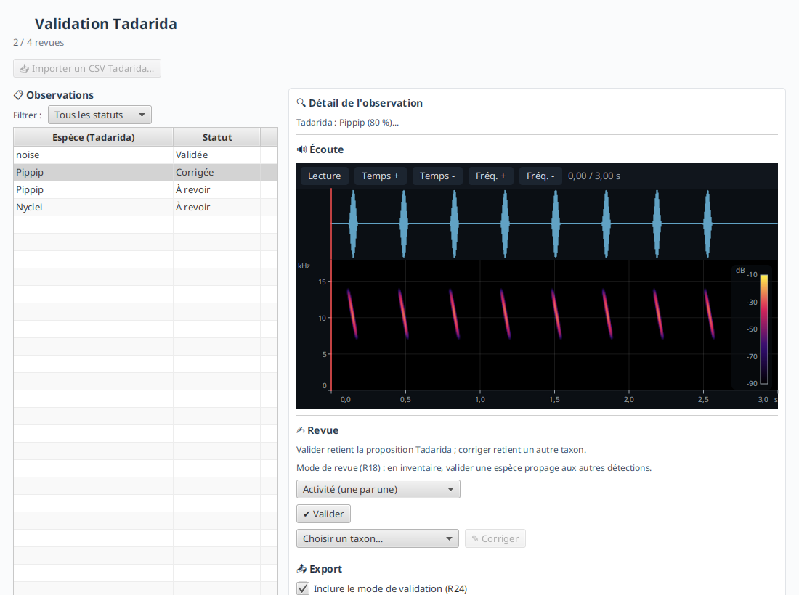

<p align="center">
  
</p>

#  VigieChiro PR Companion

**Application JavaFX d'aide au traitement des nuits de capture acoustique de chauves-souris.**

Des enregistreurs autonomes (*Passive Recorder*, « PR ») posés sur le terrain captent les ultrasons
d'une nuit entière. VigieChiro PR Companion accompagne l'observateur de la **carte SD** jusqu'au
**dépôt** des données sur la plateforme nationale **Vigie-Chiro**.

<p align="center">
  
</p>

> **Télécharger et lancer.** Des **installeurs** prêts à l'emploi (Windows `.msi`, macOS `.dmg`
> Apple Silicon, Linux `.deb`, sans Java à installer) sont publiés sur la page
> [Releases](https://github.com/IUTInfoAix-S201/vigiechiro-pr-companion/releases). Guide
> d'utilisation : [documentation utilisateur](https://iutinfoaix-s201.github.io/vigiechiro-pr-companion/prise-en-main/).

---

## 1. Le projet

Le parcours métier complet, de la carte mémoire à la validation des espèces :

```
Carte SD  →  Importer  →  Transformer  →  Vérifier  →  Déposer  →  Valider (Tadarida)
 (WAV)      (copie R9)   (ultrason→audible)  (qualité)    (ZIP plateforme)   (espèces)
```

<table>
  <tr>
    <td align="center" width="25%"><a href=".github/assets/apercu-import-assistant.png"></a></td>
    <td align="center" width="25%"><a href=".github/assets/apercu-qualification.png"></a></td>
    <td align="center" width="25%"><a href=".github/assets/apercu-lot-preparer.png"></a></td>
    <td align="center" width="25%"><a href=".github/assets/apercu-validation-revue.png"></a></td>
  </tr>
  <tr>
    <td align="center"><sub><b>Importer</b> la carte SD</sub></td>
    <td align="center"><sub><b>Vérifier</b> par écoute</sub></td>
    <td align="center"><sub><b>Déposer</b> un lot</sub></td>
    <td align="center"><sub><b>Valider</b> (Tadarida)</sub></td>
  </tr>
</table>

<sub>👉 Galerie complète des écrans (tous états) : <a href=".github/assets/README.md">.github/assets/README.md</a></sub>

L'application est née d'une **commande réelle** (Samuel Busson, CEREMA), dans le cadre de la
SAÉ 2.01 du BUT Informatique de l'IUT d'Aix-Marseille. C'est une application **locale** (base SQLite
fichier) : elle ne s'expose sur aucun port et ne stocke aucun identifiant.

---

## 2. Installation et lancement

### Installer l'application

Téléchargez l'installeur de votre système sur la page
[Releases](https://github.com/IUTInfoAix-S201/vigiechiro-pr-companion/releases), avec son propre
*runtime* embarqué (aucun Java à installer) :

| Système | Fichier | Java requis ? |
|---|---|---|
| Windows | `.msi` | Non (embarqué) |
| macOS (Apple Silicon) | `.dmg` | Non (embarqué) |
| Linux (Debian/Ubuntu) | `.deb` | Non (embarqué) |

La prise en main pas à pas est dans la [documentation utilisateur](https://iutinfoaix-s201.github.io/vigiechiro-pr-companion/prise-en-main/).

### Lancer depuis les sources

Pour développer ou exécuter la dernière version du code. Prérequis : un **JDK 25 standard**
(Temurin / `25.0.2-open`). Tout le reste passe par le **Maven Wrapper** `./mvnw` (aucune installation
de Maven). JavaFX 26 vient des dépendances Maven.

```bash
git clone https://github.com/IUTInfoAix-S201/vigiechiro-pr-companion.git
cd vigiechiro-pr-companion
./mvnw verify      # compile + lance la suite de tests + contrôles qualité
./mvnw javafx:run  # lance l'application (la fenêtre VigieChiro)
```

`./mvnw verify` doit afficher `BUILD SUCCESS`.

---

## 3. Architecture : *package-by-feature* + MVVM

Le code est organisé **par fonctionnalité** (et non par couche technique) : chaque écran/parcours
métier vit dans **son propre paquet**, qui contient lui-même les couches **MVVM**. Cette organisation
est vérifiée automatiquement par des tests d'architecture (ArchUnit).

```
src/main/java/fr/univ_amu/iut/
├── App.java                     ← point d'entrée JavaFX (amorçage Guice + chrome)
├── module-info.java             ← module JPMS « vigiechiro » (open module)
│
├── commun/                      ← LE SOCLE partagé par toutes les features
│   ├── persistence/             ·   infrastructure DAO (SQLite, transactions, migrations)
│   ├── model/                   ·   domaine transverse (Horloge, Prefixe, Verdict, Statut...)
│   ├── viewmodel/               ·   état observable du chrome (NavigationViewModel...)
│   ├── view/                    ·   chrome de l'appli (MainView, Navigateur, contrats Ouvrir*)
│   ├── di/                      ·   modules Guice du socle (Persistence, Commun)
│   └── outils/                  ·   outils de capture d'écran
│
├── sites/        passage/       importation/   qualification/   lot/
├── validation/   multisite/     diagnostic/    bibliotheque/                ← les 9 features
│
├── cli/                         ← interface en ligne de commande (import/export scriptables)
└── perf/outils/                 ← bancs de mesure (benchmark)
```

Chaque **feature** (ex. `sites/`) suit le même découpage en **4 couches MVVM** :

| Sous-paquet | Rôle | Règle clé |
|---|---|---|
| `model/` | **Modèle métier** : entités (records), services, et `model/dao/` (accès SQLite) | Aucune dépendance JavaFX (réutilisable, testable seul) |
| `viewmodel/` | **ViewModel** : état observable + logique de présentation, exposé en propriétés | Importe **`javafx.beans`** uniquement, **jamais** `javafx.scene/fxml/stage` |
| `view/` | **Vue** : `Controller` + `*.fxml` + `*.css` (l'interface visible) | Se **lie** (binding) aux propriétés du ViewModel ; ne parle jamais à la base |
| `di/` | **Injection** : le module Guice qui assemble la feature | Publie ses services/VM au conteneur |

> **Le sens MVVM :** le `model` ne connaît pas l'IHM ; le `viewmodel` porte l'état sous forme de
> **propriétés observables** (`IntegerProperty`, `ObservableList`...) sans toucher aux composants
> graphiques ; la `view` **observe** le viewmodel via le *data binding* JavaFX.

### Le domaine métier

Le cœur du modèle est l'**agrégat « nuit de capture »**, possédé par la feature `passage`. Un
**passage** (une nuit, sur un point d'écoute, une année) regroupe : la session d'enregistrement, les
fichiers originaux, les séquences découpées, le journal du capteur, le relevé climatique, les
observations Tadarida.

Une nuit avance dans un **workflow à états** :

```
IMPORTE → TRANSFORME → VERIFIE → PRET_A_DEPOSER → DEPOSE
```

La persistance utilise **SQLite** (fichier `vigiechiro.db`) via des **DAO** écrits en
`PreparedStatement` (pas d'ORM), avec des **migrations** versionnées
(`src/main/resources/db/migration/V0x__*.sql`, 19 tables). L'injection de dépendances est faite avec
**Guice 7** (les `Controller` FXML sont eux aussi injectés via une `controllerFactory`).

### Les 9 fonctionnalités (+ outillage)

Chaque fonctionnalité est un **paquet** autonome. Cette table fait le **pont entre les deux ressources
complémentaires** : le **nom du paquet** renvoie à la
**[documentation de l'écran](https://iutinfoaix-s201.github.io/vigiechiro-pr-companion/ecrans/)**
(comment l'application se comporte), et son **parcours** au
**[brief](https://iutinfoaix-s201.github.io/brief/)** (l'énoncé d'origine : le besoin et les scénarios
utilisateur).

| Fonctionnalité | Parcours (brief) | Rôle |
|---|---|---|
| [`sites`](https://iutinfoaix-s201.github.io/vigiechiro-pr-companion/ecrans/sites/) | [P1](https://iutinfoaix-s201.github.io/brief/Analyse%20et%20conception/Parcours%20utilisateurs/P1%20-%20D%C3%A9clarer%20un%20site%20de%20suivi/) | Gérer les sites de suivi et leurs points d'écoute |
| [`passage`](https://iutinfoaix-s201.github.io/vigiechiro-pr-companion/ecrans/passage/) | [P2](https://iutinfoaix-s201.github.io/brief/Analyse%20et%20conception/Parcours%20utilisateurs/P2%20-%20Importer%20une%20nuit%20d%27enregistrement/) | Écran pivot d'une nuit (fiche, statut, navigation, suppression) |
| [`importation`](https://iutinfoaix-s201.github.io/vigiechiro-pr-companion/ecrans/importation/) | [P2](https://iutinfoaix-s201.github.io/brief/Analyse%20et%20conception/Parcours%20utilisateurs/P2%20-%20Importer%20une%20nuit%20d%27enregistrement/) | Importer une nuit depuis la carte SD (copie, renommage, transformation) |
| [`qualification`](https://iutinfoaix-s201.github.io/vigiechiro-pr-companion/ecrans/qualification/) | [P3](https://iutinfoaix-s201.github.io/brief/Analyse%20et%20conception/Parcours%20utilisateurs/P3%20-%20V%C3%A9rifier%20l%27enregistrement%20par%20%C3%A9chantillonnage/) | Écouter les séquences et poser un verdict de qualité |
| [`lot`](https://iutinfoaix-s201.github.io/vigiechiro-pr-companion/ecrans/lot/) | [P4](https://iutinfoaix-s201.github.io/brief/Analyse%20et%20conception/Parcours%20utilisateurs/P4%20-%20Pr%C3%A9parer%20un%20lot%20pr%C3%AAt%20%C3%A0%20d%C3%A9poser/) | Préparer et déposer un lot vérifié |
| [`validation`](https://iutinfoaix-s201.github.io/vigiechiro-pr-companion/ecrans/validation/) | [P7](https://iutinfoaix-s201.github.io/brief/Analyse%20et%20conception/Parcours%20utilisateurs/P7%20-%20Valider%20les%20r%C3%A9sultats%20Tadarida/) | Revue des observations Tadarida (espèces), import/export CSV `_Vu` |
| [`multisite`](https://iutinfoaix-s201.github.io/vigiechiro-pr-companion/ecrans/multisite/) | [P5](https://iutinfoaix-s201.github.io/brief/Analyse%20et%20conception/Parcours%20utilisateurs/P5%20-%20Naviguer%20dans%20plusieurs%20sites%20et%20passages/) | Vue agrégée des passages (tri, filtres, vues sauvegardées) |
| [`diagnostic`](https://iutinfoaix-s201.github.io/vigiechiro-pr-companion/ecrans/diagnostic/) | [P6](https://iutinfoaix-s201.github.io/brief/Analyse%20et%20conception/Parcours%20utilisateurs/P6%20-%20Diagnostiquer%20le%20mat%C3%A9riel/) | Diagnostic d'une nuit (courbe climat, anomalies) |
| [`bibliotheque`](https://iutinfoaix-s201.github.io/vigiechiro-pr-companion/ecrans/bibliotheque/) | [P10](https://iutinfoaix-s201.github.io/brief/Analyse%20et%20conception/Parcours%20utilisateurs/P10%20-%20Exporter%20une%20biblioth%C3%A8que%20de%20sons%20de%20r%C3%A9f%C3%A9rence/) | Bibliothèque de sons de référence + export |

S'ajoutent la fonctionnalité transverse **`cli`** (import/export en ligne de commande) et le paquet
**`perf/`** (outils de **mesure de performance**, cf. [`docs/benchmarks/`](docs/benchmarks/README.md)).

### Le composant `audio-view`

L'écoute (sonogramme + spectrogramme d'un WAV) est fournie par un **composant externe**,
[`audio-view`](https://github.com/IUTInfoAix-S201/audio-view), publié sur Maven Central et consommé
comme dépendance.

---

## 4. Développement et qualité

Le projet embarque une chaîne qualité **professionnelle**. Tout passe par le **Maven Wrapper**
`./mvnw` (aucune installation) :

| Commande | Effet |
|---|---|
| `./mvnw javafx:run` | Lance l'application (fenêtre JavaFX) |
| `./mvnw test` | Lance les tests unitaires et d'intégration |
| `./mvnw verify` | Tests + couverture + contrôles (build complet) |
| `./mvnw -Pquality-gate verify` | Build + **PMD bloquant** + seuils de couverture (le « portail qualité ») |
| `./mvnw spotless:apply` | Formate le code (Palantir Java Format) |

Les outils en jeu :

- **Tests** : JUnit 5, AssertJ, Mockito, **TestFX** (tests d'IHM headless, sans serveur d'affichage),
  **ApprovalTests** (CSV Tadarida).
- **PMD** : linter de *code smells* ; **Spotless** formate automatiquement (hook pre-commit invisible).
- **ArchUnit** : vérifie l'**architecture** (model sans JavaFX, viewmodel sans `javafx.scene`, slices
  sans cycle) : ces tests **échouent** si la frontière MVVM est cassée.
- **JaCoCo** : mesure la **couverture** des tests.
- **CI GitHub Actions** : à chaque push, le build, les tests et le portail qualité s'exécutent.

Le détail (exécution headless, taxonomie des tests, ce qui bloque la CI) est dans
[TESTING.md](TESTING.md) ; le guide du contributeur dans [CONTRIBUTING.md](CONTRIBUTING.md).

---

## 5. Documentation de référence

- **Documentation utilisateur** : [site de documentation](https://iutinfoaix-s201.github.io/vigiechiro-pr-companion/) (prise en main, écrans, parcours, raccourcis,
  glossaire, FAQ).
- **Galerie des écrans** : [.github/assets/README.md](.github/assets/README.md) (chaque vue, états pertinents côte à côte).
- [Java 25 API](https://docs.oracle.com/en/java/javase/25/docs/api/) · [JavaFX 26 API](https://openjfx.io/javadoc/26/) · [Tutoriel FXML](https://openjfx.io/openjfx-docs/)
- [JUnit 5](https://junit.org/junit5/docs/current/user-guide/) · [AssertJ](https://assertj.github.io/doc/) · [TestFX](https://github.com/TestFX/TestFX) · [Mockito](https://site.mockito.org)
- [Guice (DI)](https://github.com/google/guice/wiki) · [Refactoring (Martin Fowler)](https://refactoring.com)

---

## Dépannage

**Le premier `./mvnw` prend plusieurs minutes** : normal, le wrapper télécharge Maven puis les
dépendances. Ensuite tout est en cache.

**`./mvnw: Permission denied`** : `chmod +x mvnw`.

**Sous Windows** : utilisez `.\mvnw.cmd ...` à la place de `./mvnw ...`.

**`Cannot resolve symbol` / imports en rouge dans l'IDE** : le projet n'est pas encore indexé. Lancez
`./mvnw compile`, l'IDE se resynchronise.

**Headless qui échoue (`NPE PlatformFactory`)** : vous utilisez un JDK packagé avec JavaFX (type
`fx-zulu`). Utilisez un **JDK 25 standard** (cf. [TESTING.md](TESTING.md)).

<details>
<summary>📦 Installer un JDK 25 localement</summary>

**Linux / macOS** (via [SDKMAN](https://sdkman.io)) :
```bash
sdk install java 25-tem
```

**Windows** (via [Scoop](https://scoop.sh)) :
```powershell
scoop bucket add java && scoop install java/temurin25-jdk
```

Vérifier : `java -version` doit afficher `openjdk version "25.0.x"`.

</details>

---

Contribuer : [CONTRIBUTING.md](CONTRIBUTING.md) · Tester : [TESTING.md](TESTING.md) ·
Sécurité et données sensibles : [SECURITY.md](SECURITY.md).
