<p align="center">
  
</p>

<h1 align="center">
  
  VigieChiro Companion
</h1>

<p align="center">
  <b>De la carte SD au dépôt national : l'atelier de l'observateur pour traiter une nuit de capture
  acoustique de chauves-souris.</b>
</p>

<p align="center">
  <a href="https://companion.echonuit.fr/"></a>
  <a href="https://github.com/echonuit/vigiechiro-pr-companion/releases"></a>
  <a href="https://github.com/echonuit/vigiechiro-pr-companion/actions/workflows/maven.yml"></a>
  <a href="https://github.com/echonuit/vigiechiro-pr-companion/actions/workflows/lint.yml"></a>
  <a href="LICENSE"></a>
  <a href="https://doi.org/10.5281/zenodo.20492247"></a>
</p>

<p align="center">
  <a href="https://companion.echonuit.fr/"><b>📖 Lire la documentation</b></a>
  &nbsp;·&nbsp;
  <a href="https://github.com/echonuit/vigiechiro-pr-companion/releases"><b>⬇️ Télécharger l'application</b></a>
  &nbsp;·&nbsp;
  <a href="#-lécosystème-vigie-chiro"><b>🌐 L'écosystème</b></a>
</p>

---

Des enregistreurs autonomes (*Passive Recorder*) posés en forêt captent les ultrasons des
chauves-souris pendant une nuit entière. **VigieChiro Companion** accompagne l'observateur depuis
la **carte SD** de l'enregistreur jusqu'au **dépôt** des données sur la plateforme nationale
**Vigie-Chiro**, puis la **validation** des espèces identifiées : le tout dans un **outil local** unique, à installer sans serveur. Le dépôt et la synchronisation passent par votre **compte Vigie-Chiro** (connexion par jeton, sans mot de passe stocké).

> Né d'une **commande réelle** (Samuel Busson, CEREMA), construit dans le cadre de la SAÉ 2.01 du BUT
> Informatique de l'IUT d'Aix-Marseille.

<p align="center">
  
</p>

## 🦇 Le parcours d'une nuit

Le traitement d'une nuit suit toujours le même fil, de la carte SD au dépôt, puis à la validation des
espèces quelques jours plus tard.

<p align="center">
  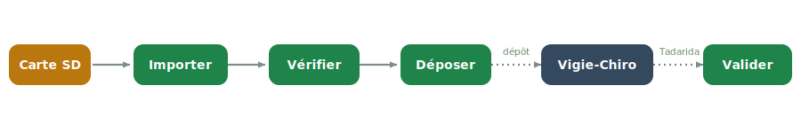
</p>

| Étape | Ce que vous faites | Écran |
|---|---|---|
| **Importer** | Copier la carte SD, renommer et transformer les enregistrements (ultrason vers audible) | [Importation](https://companion.echonuit.fr/ecrans/importation/) |
| **Vérifier** | Contrôler la qualité (pré-check + écoute) et poser un verdict | [Qualification](https://companion.echonuit.fr/ecrans/qualification/) |
| **Déposer** | Préparer le lot, le téléverser sur Vigie-Chiro, le marquer déposé | [Lot](https://companion.echonuit.fr/ecrans/lot/) |
| **Valider** | Relire et corriger les espèces identifiées par Tadarida | [Validation](https://companion.echonuit.fr/ecrans/validation/) |

## 📖 Découvrir les écrans

L'application compte treize écrans, documentés un par un. **Cliquez sur une vignette pour
ouvrir sa page de documentation** (rôle, captures commentées, astuces).

<table>
  <tr>
    <td align="center" width="33%"><a href="https://companion.echonuit.fr/ecrans/sites/">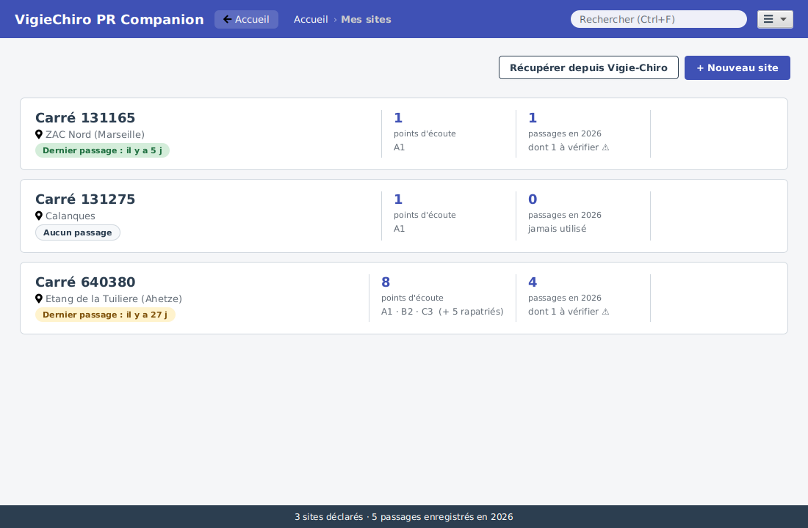</a><br><b>Sites</b><br><sub>Carrés de suivi et points d'écoute</sub></td>
    <td align="center" width="33%"><a href="https://companion.echonuit.fr/ecrans/importation/">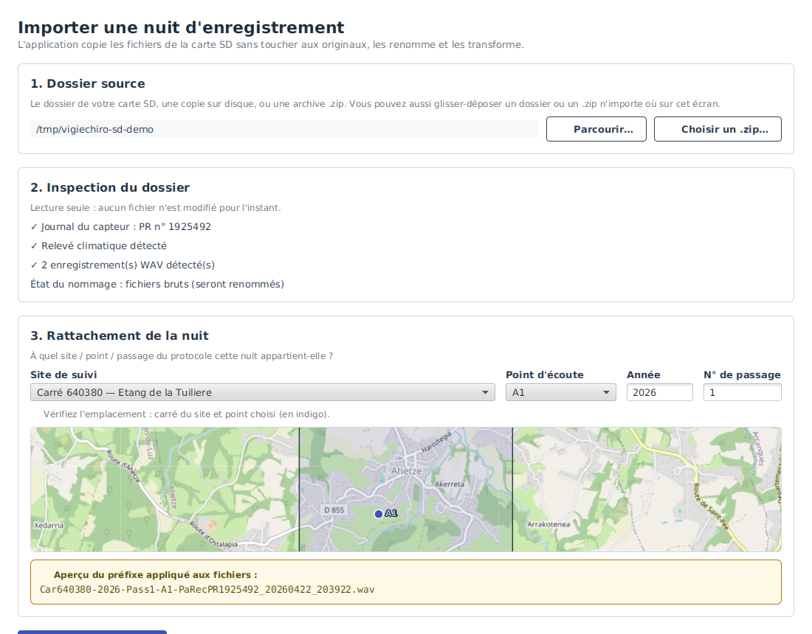</a><br><b>Importation</b><br><sub>Carte SD, renommage, transformation</sub></td>
    <td align="center" width="33%"><a href="https://companion.echonuit.fr/ecrans/passage/">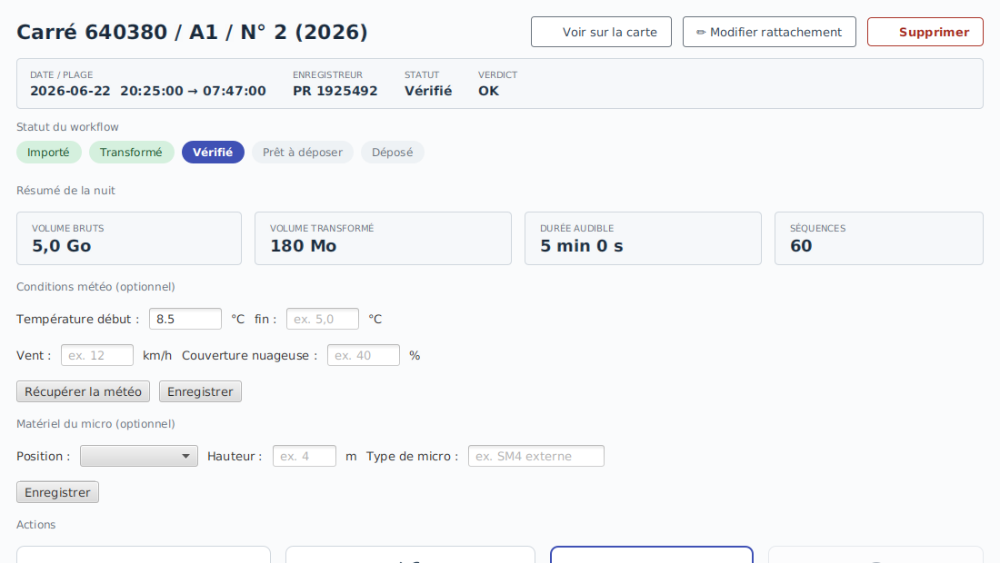</a><br><b>Passage</b><br><sub>Le pivot d'une nuit (statut, actions)</sub></td>
  </tr>
  <tr>
    <td align="center" width="33%"><a href="https://companion.echonuit.fr/ecrans/qualification/">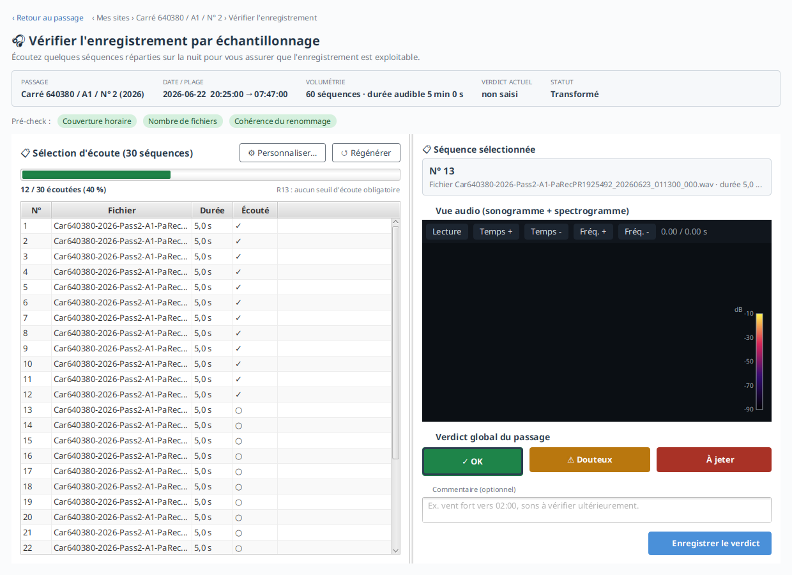</a><br><b>Qualification</b><br><sub>Écoute (sono + spectrogramme) et verdict</sub></td>
    <td align="center" width="33%"><a href="https://companion.echonuit.fr/ecrans/lot/">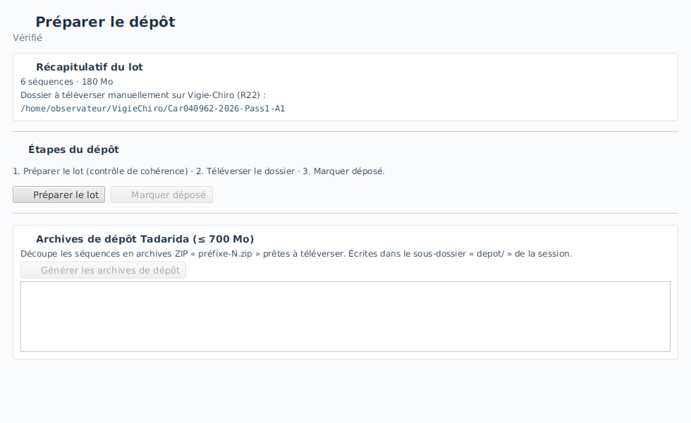</a><br><b>Lot</b><br><sub>Préparer et déposer un lot vérifié</sub></td>
    <td align="center" width="33%"><a href="https://companion.echonuit.fr/ecrans/validation/">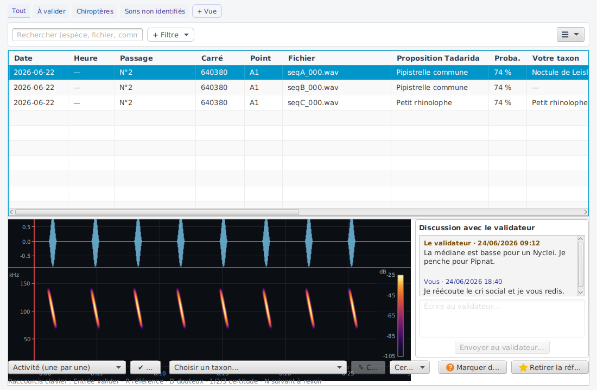</a><br><b>Sons &amp; validation</b><br><sub>Écoute, validation, sons de référence</sub></td>
  </tr>
  <tr>
    <td align="center" width="33%"><a href="https://companion.echonuit.fr/ecrans/multisite/">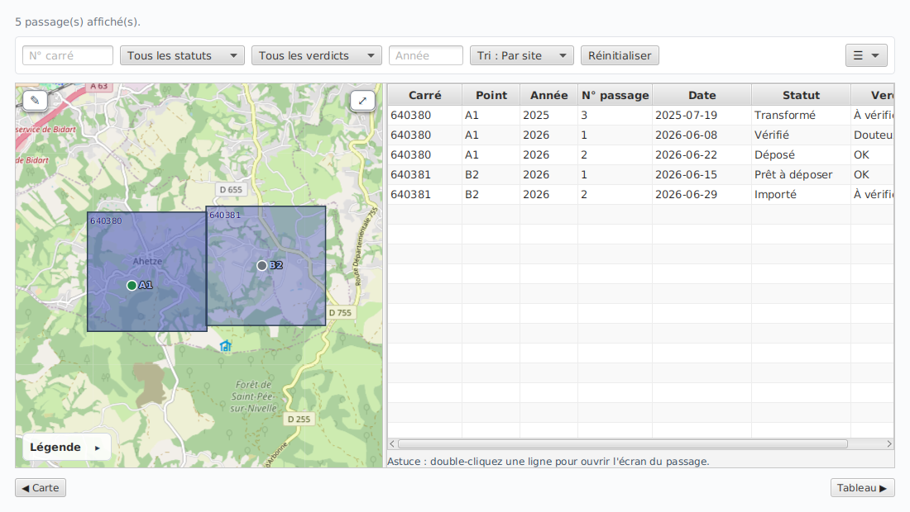</a><br><b>Multisite</b><br><sub>Vue agrégée (tri, filtres, vues)</sub></td>
    <td align="center" width="33%"><a href="https://companion.echonuit.fr/ecrans/diagnostic/">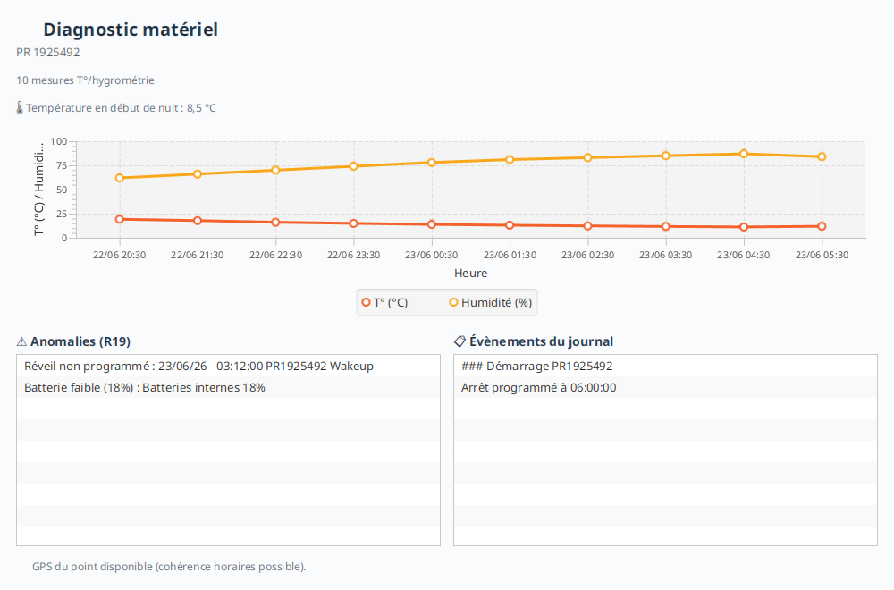</a><br><b>Diagnostic</b><br><sub>Climat, anomalies du capteur</sub></td>
    <td align="center" width="33%"><a href="https://companion.echonuit.fr/ecrans/recherche/"></a><br><b>Recherche</b><br><sub>Sites, points, passages (Ctrl+F)</sub></td>
  </tr>
  <tr>
    <td align="center" width="33%"><a href="https://companion.echonuit.fr/ecrans/analyse/">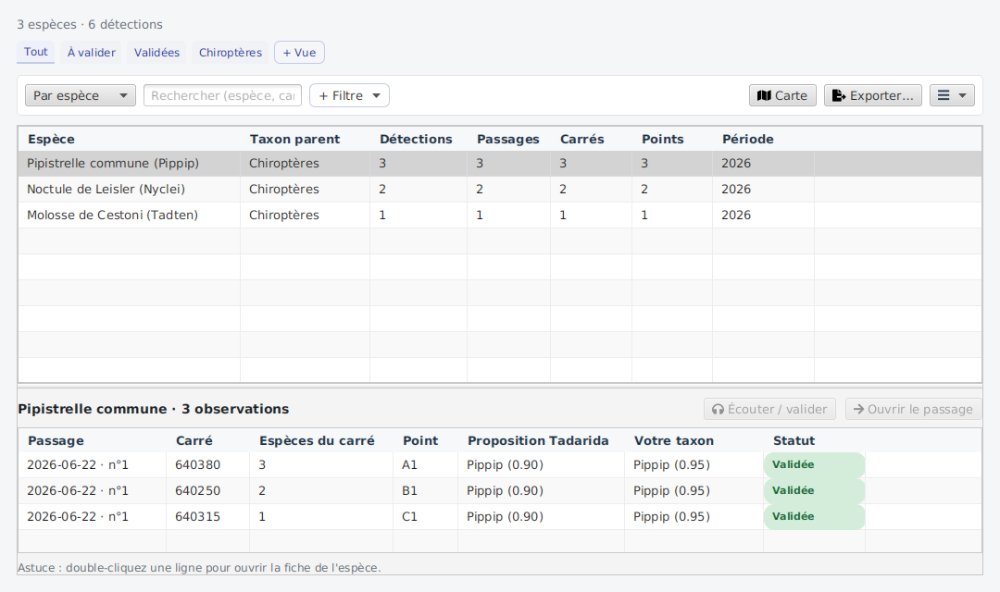</a><br><b>Espèces &amp; observations</b><br><sub>Inventaire par espèce / par carré</sub></td>
    <td align="center" width="33%"><a href="https://companion.echonuit.fr/ecrans/analyse/">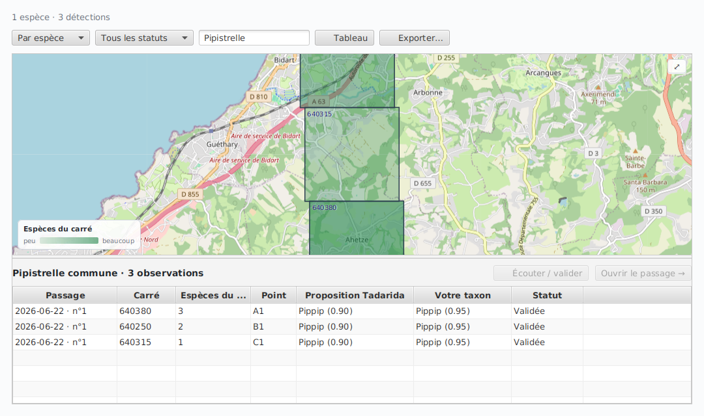</a><br><b>Carte de répartition</b><br><sub>Richesse par carré sur la carte</sub></td>
    <td width="33%"></td>
  </tr>
</table>

<p align="center"><a href="https://companion.echonuit.fr/"><b>→ Ouvrir la documentation complète</b></a> &nbsp;|&nbsp; <a href=".github/assets/README.md">galerie de tous les états</a></p>

## ⬇️ Installer et lancer

### Installer l'application

Téléchargez l'installeur de votre système sur la page
[Releases](https://github.com/echonuit/vigiechiro-pr-companion/releases) : il embarque son
propre *runtime* (**aucun Java à installer**).

| Système | Fichier | Java requis ? |
|---|---|---|
| Windows | `.msi` | Non (embarqué) |
| macOS (Apple Silicon) | `.dmg` | Non (embarqué) |
| Linux (Debian/Ubuntu) | `.deb` | Non (embarqué) |

La prise en main pas à pas est dans la
[documentation utilisateur](https://companion.echonuit.fr/prise-en-main/).

### Lancer depuis les sources

Prérequis : un **JDK 25 standard** (Temurin / `25.0.2-open`). Tout le reste passe par le **Maven
Wrapper** `./mvnw` (aucune installation de Maven) ; JavaFX 26 vient des dépendances Maven.

```bash
git clone https://github.com/echonuit/vigiechiro-pr-companion.git
cd vigiechiro-pr-companion
./mvnw verify      # compile + tests + controles qualite (doit afficher BUILD SUCCESS)
./mvnw javafx:run  # lance l'application
```

## 🌐 L'écosystème Vigie-Chiro

VigieChiro Companion est le **chaînon logiciel** entre un capteur de terrain et une base
scientifique nationale. Il s'appuie sur, et complète, plusieurs projets ouverts :

| Projet | Rôle dans la chaîne | Lien |
|---|---|---|
| **Vigie-Chiro** | Programme national de suivi des chauves-souris (Vigie-Nature, MNHN) et plateforme de dépôt + analyse automatique **Tadarida** | [Programme](https://www.vigienature.fr/fr/chauves-souris) · [Plateforme](https://vigiechiro.herokuapp.com) |
| **Passive Recorder (Teensy)** | L'**enregistreur open-hardware** posé sur le terrain : firmware open-source qui capte les ultrasons toute la nuit | [framagit · PassiveRecorder](https://framagit.org/PiBatRecorderProjects/TeensyRecorders/-/tree/master/PassiveRecorder) |
| **audio-view** | Le **composant JavaFX** (sonogramme + spectrogramme) utilisé pour l'écoute, publié sur Maven Central | [github.com/echonuit/audio-view](https://github.com/echonuit/audio-view) |
| **Jeu de données exemple** | Une **nuit complète** de capture (échantillon audio + observations), pour tester sans matériel | [Dépôt](https://github.com/echonuit/vigiechiro-pr-companion-exemple-nuit) · [DOI Zenodo](https://doi.org/10.5281/zenodo.20492247) |
| **Le brief** | Le **brief projet** : contexte, besoin, parcours utilisateurs, *story mapping* (document de conception vivant) | [brief.echonuit.fr](https://brief.echonuit.fr/) |

<a id="architecture"></a>

## 🛠️ Sous le capot (pour les développeuses et développeurs)

Application **JavaFX 26 / Java 25**, **locale** (base **SQLite** fichier, sans serveur), injectée par
**Guice 7**. L'architecture est en **paquet-par-fonctionnalité** : chaque écran/parcours vit dans son
propre paquet, qui contient ses **4 couches MVVM** (`model` / `viewmodel` / `view` / `di`). La
frontière MVVM et l'absence de cycles sont **vérifiées automatiquement** (ArchUnit) : les tests
échouent si un `viewmodel` touche `javafx.scene`, ou si un `model` parle JavaFX.

> 📖 **Documentation développeur** (architecture détaillée, « ajouter une fonctionnalité », tests et
> qualité) : **<https://companion-dev.echonuit.fr/>**

<details>
<summary><b>Détail de l'architecture et des fonctionnalités</b></summary>

```
src/main/java/fr/univ_amu/iut/
├── App.java                     ← point d'entrée JavaFX (amorçage Guice + chrome)
├── module-info.java             ← module JPMS « vigiechiro » (open module)
│
├── commun/                      ← LE SOCLE partagé par toutes les fonctionnalités
│   ├── persistence/             ·   infrastructure DAO (SQLite, transactions, migrations)
│   ├── model/                   ·   domaine transverse (Horloge, Prefixe, Verdict, Statut...)
│   ├── viewmodel/               ·   état observable du chrome (NavigationViewModel...)
│   ├── view/                    ·   chrome de l'appli (MainView, Navigateur, contrats Ouvrir*)
│   ├── di/                      ·   modules Guice du socle (Persistence, Commun)
│   └── outils/                  ·   outils de capture d'écran
│
├── sites/        passage/       importation/   qualification/   lot/
├── validation/   multisite/     diagnostic/    bibliotheque/    analyse/
├── recherche/    audio/         audit/         connexion/       maj/          ← les features métier
│
├── cli/                         ← interface en ligne de commande (import/export scriptables)
└── perf/outils/                 ← bancs de mesure de performance
```

Chaque **couche** a une règle stricte :

| Sous-paquet | Rôle | Règle clé |
|---|---|---|
| `model/` | **Modèle métier** : entités (records), services, `model/dao/` (accès SQLite) | Aucune dépendance JavaFX (réutilisable, testable seul) |
| `viewmodel/` | **ViewModel** : état observable + logique de présentation | Importe **`javafx.beans`** uniquement, jamais `javafx.scene/fxml/stage` |
| `view/` | **Vue** : `Controller` + `*.fxml` + `*.css` | Se **lie** aux propriétés du ViewModel ; ne parle jamais à la base |
| `di/` | **Injection** : le module Guice qui assemble la fonctionnalité | Publie ses services/VM au conteneur |

Le cœur du modèle est l'**agrégat « nuit de capture »** (fonctionnalité `passage`), qui avance dans un
workflow à états : `IMPORTE → TRANSFORME → VERIFIE → PRET_A_DEPOSER → DEPOT_EN_COURS → DEPOSE` (<!--inv:etats-workflow-->6<!--/inv--> états). La persistance est en
**SQLite** via des **DAO** en `PreparedStatement` (pas d'ORM) avec des **migrations** versionnées.

Chacune des **<!--inv:features-->15<!--/inv--> fonctionnalités** est un **paquet** autonome ; son nom
renvoie à la **documentation de l'écran**, son **parcours** au
**[brief](https://brief.echonuit.fr/)** (l'énoncé d'origine).

| Fonctionnalité | Parcours (brief) | Rôle |
|---|---|---|
| [`sites`](https://companion.echonuit.fr/ecrans/sites/) | [P1](https://brief.echonuit.fr/Analyse%20et%20conception/Parcours%20utilisateurs/P1%20-%20D%C3%A9clarer%20un%20site%20de%20suivi/) | Gérer les sites de suivi et leurs points d'écoute |
| [`passage`](https://companion.echonuit.fr/ecrans/passage/) | [P2](https://brief.echonuit.fr/Analyse%20et%20conception/Parcours%20utilisateurs/P2%20-%20Importer%20une%20nuit%20d%27enregistrement/) | Écran pivot d'une nuit (fiche, statut, navigation, suppression) |
| [`importation`](https://companion.echonuit.fr/ecrans/importation/) | [P2](https://brief.echonuit.fr/Analyse%20et%20conception/Parcours%20utilisateurs/P2%20-%20Importer%20une%20nuit%20d%27enregistrement/) | Importer une nuit depuis la carte SD (copie, renommage, transformation) |
| [`qualification`](https://companion.echonuit.fr/ecrans/qualification/) | [P3](https://brief.echonuit.fr/Analyse%20et%20conception/Parcours%20utilisateurs/P3%20-%20V%C3%A9rifier%20l%27enregistrement%20par%20%C3%A9chantillonnage/) | Écouter les séquences et poser un verdict de qualité |
| [`lot`](https://companion.echonuit.fr/ecrans/lot/) | [P4](https://brief.echonuit.fr/Analyse%20et%20conception/Parcours%20utilisateurs/P4%20-%20Pr%C3%A9parer%20un%20lot%20pr%C3%AAt%20%C3%A0%20d%C3%A9poser/) | Préparer et déposer un lot vérifié |
| [`validation`](https://companion.echonuit.fr/ecrans/validation/) | [P7](https://brief.echonuit.fr/Analyse%20et%20conception/Parcours%20utilisateurs/P7%20-%20Valider%20les%20r%C3%A9sultats%20Tadarida/) | Revue des observations Tadarida (espèces), import/export CSV `_Vu` |
| [`multisite`](https://companion.echonuit.fr/ecrans/multisite/) | [P5](https://brief.echonuit.fr/Analyse%20et%20conception/Parcours%20utilisateurs/P5%20-%20Naviguer%20dans%20plusieurs%20sites%20et%20passages/) | Vue agrégée des passages (tri, filtres, vues sauvegardées) |
| [`diagnostic`](https://companion.echonuit.fr/ecrans/diagnostic/) | [P6](https://brief.echonuit.fr/Analyse%20et%20conception/Parcours%20utilisateurs/P6%20-%20Diagnostiquer%20le%20mat%C3%A9riel/) | Diagnostic d'une nuit (courbe climat, anomalies) |
| `bibliotheque` (modèle) | [P10](https://brief.echonuit.fr/Analyse%20et%20conception/Parcours%20utilisateurs/P10%20-%20Exporter%20une%20biblioth%C3%A8que%20de%20sons%20de%20r%C3%A9f%C3%A9rence/) | Corpus de sons de référence + export, désormais servis par la vue audio unifiée (source References) |
| [`analyse`](https://companion.echonuit.fr/ecrans/analyse/) | transverse | Inventaire des espèces détectées (prisme biodiversité), regroupé par espèce ou par carré et filtrable par statut |
| [`recherche`](https://companion.echonuit.fr/ecrans/recherche/) | transverse | Recherche globale du chrome (Ctrl+F) : sauter à un site, un point ou un passage, résultats groupés |

S'ajoutent la fonctionnalité transverse **`cli`** (import/export en ligne de commande) et le paquet
**`perf/`** (mesures de performance, cf. [`docs/benchmarks/`](docs/benchmarks/README.md)).

</details>

<a id="dev-qualite"></a>

## 🤝 Contribuer, tester, sécurité

Le projet embarque une chaîne qualité **professionnelle**, exécutée à chaque push par la CI : tests
**JUnit 5 / AssertJ / Mockito / TestFX** (IHM *headless*) + **ApprovalTests**, linter **PMD**, format
**Spotless** (hook pre-commit), garde-fou d'**architecture ArchUnit**, couverture **JaCoCo**.

| Commande | Effet |
|---|---|
| `./mvnw javafx:run` | Lance l'application |
| `./mvnw test` | Tests unitaires et d'intégration |
| `./mvnw verify` | Build complet (tests + couverture + contrôles) |
| `./mvnw -Pquality-gate verify` | Build + **PMD bloquant** + seuils de couverture |
| `./mvnw spotless:apply` | Formate le code (Palantir Java Format) |

- 🤝 **[CONTRIBUTING.md](CONTRIBUTING.md)** : comment proposer une contribution (fork puis branche puis PR).
- 🧪 **[TESTING.md](TESTING.md)** : exécution *headless*, taxonomie des tests, ce qui bloque la CI.
- 🔒 **[SECURITY.md](SECURITY.md)** : signalement de vulnérabilités et données sensibles.

## 🆘 Besoin d'aide ?

La **[FAQ](https://companion.echonuit.fr/faq/)** répond aux questions les
plus courantes (où sont mes données, comment écouter une séquence...). Quelques pièges côté
développement :

- **Le premier `./mvnw` prend plusieurs minutes** : normal, le wrapper télécharge Maven puis les
  dépendances ; ensuite tout est en cache.
- **`./mvnw: Permission denied`** : `chmod +x mvnw` (sous Windows, utilisez `.\mvnw.cmd`).
- **Headless qui échoue (`NPE PlatformFactory`)** : vous utilisez un JDK packagé avec JavaFX (type
  `fx-zulu`) ; prenez un **JDK 25 standard** (cf. [TESTING.md](TESTING.md)).

<details>
<summary>📦 Installer un JDK 25 localement</summary>

**Linux / macOS** (via [SDKMAN](https://sdkman.io)) : `sdk install java 25-tem`

**Windows** (via [Scoop](https://scoop.sh)) : `scoop bucket add java && scoop install java/temurin25-jdk`

Vérifier : `java -version` doit afficher `openjdk version "25.0.x"`.

</details>

## 🙌 Remerciements

Ce projet a été construit par les **21 équipes** d'étudiantes et étudiants de la promo 2026 du
**BUT Informatique** (IUT d'Aix-Marseille), dans le cadre de la **SAÉ 2.01**. Leurs dépôts de
travail vivent dans l'organisation [IUTInfoAix-S201-2026](https://github.com/IUTInfoAix-S201-2026).

👉 La liste complète des contributrices et contributeurs est dans **[REMERCIEMENTS.md](REMERCIEMENTS.md)**.

---

<p align="center"><sub>
  © 2024-2026 Sébastien Nedjar, sous licence <a href="LICENSE">GPLv3</a>.
</sub></p>
