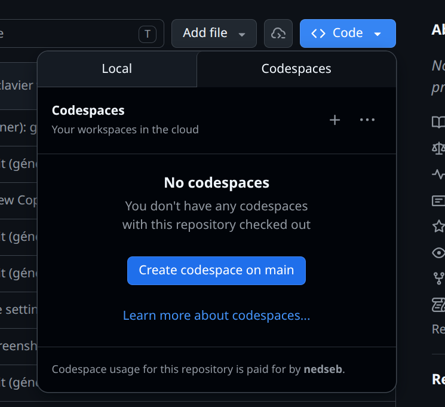

#  SAÉ 2.01 - VigieChiro PR Companion

### IUT d'Aix-Marseille - Département Informatique Aix-en-Provence

- **Ressource :** [SAÉ 2.01](https://cache.media.enseignementsup-recherche.gouv.fr/file/SPE4-MESRI-17-6-2021/35/5/Annexe_17_INFO_BUT_annee_1_1411355.pdf) <!-- TODO enseignant·e : remplacer par le lien PN propre au module -->
- **Responsable :** [Sébastien Nedjar](mailto:sebastien.nedjar@univ-amu.fr)
- **Équipe pédagogique** (ressources R2.02 et R2.03) :
  - [Frédéric Flouvat](mailto:frederic.flouvat@univ-amu.fr)
  - [Sophie Nabitz](mailto:sophie.nabitz@univ-avignon.fr)
  - [Leïla Sakli Miled](mailto:leila.SAKLI@univ-amu.fr)
  - [Olivier Gérard](mailto:olivier.GERARD@univ-amu.fr) (ergonomie / préparation SAÉ 2.01)
- **Besoin d'aide ?** Les [issues](https://github.com/IUTInfoAix-S201/vigiechiro-pr-companion/issues) de votre dépôt (une par tâche) ou un [email](mailto:sebastien.nedjar@univ-amu.fr).

---

## 1. Le projet

**VigieChiro PR Companion** est une application **JavaFX** d'aide au traitement des **nuits de capture acoustique de chauves-souris**. Des enregistreurs autonomes (*Passive Recorder*, « PR ») posés sur le terrain enregistrent les ultrasons d'une nuit entière. L'application accompagne l'observateur de la **carte SD** jusqu'au **dépôt** des données sur la plateforme nationale **Vigie-Chiro**.

C'est une **vraie commande** d'un client réel (Samuel Busson, CEREMA). Le parcours métier complet :

```
Carte SD  →  Importer  →  Transformer  →  Vérifier  →  Valider (Tadarida)  →  Déposer
 (WAV)      (copie R9)   (ultrason→audible)  (qualité)    (espèces)          (ZIP plateforme)
```

La SAÉ 2.01 est **couplée à deux modules** : **R2.02** (Développement d'applications avec IHM : JavaFX, MVVM, événements) et **R2.03** (Qualité de développement : tests, refactoring, outils). Ce dépôt est le **code de départ** : un socle applicatif complet et testé, sur lequel **vous construisez les interfaces**.

> **Ce que vous allez apprendre :** concevoir des IHM JavaFX en architecture **MVVM** (propriétés observables, *data binding*, FXML), par-dessus une couche métier fournie, en pratiquant le **workflow professionnel** (issue → branche → Pull Request → revue → merge) et l'**outillage qualité** (tests, PMD, ArchUnit, CI).

---

## 2. Comprendre le contenu du dépôt

### 2.1. Architecture : *package-by-feature* + MVVM

Le code est organisé **par fonctionnalité** (et non par couche technique) : chaque écran/parcours métier vit dans **son propre paquet**, qui contient lui-même les couches **MVVM**. Cette organisation est imposée (cf. CM4) et vérifiée automatiquement par des tests d'architecture (ArchUnit).

```
src/main/java/fr/univ_amu/iut/
├── App.java                     ← point d'entrée JavaFX (amorçage Guice + chrome)
├── module-info.java             ← module JPMS « vigiechiro » (open module)
│
├── commun/                      ← LE SOCLE partagé par toutes les features
│   ├── persistence/             ·   infrastructure DAO (SQLite, transactions, migrations)
│   ├── model/                   ·   domaine transverse (Horloge, Prefixe, Verdict, Statut...)
│   ├── viewmodel/               ·   état observable du chrome (NavigationViewModel...)
│   ├── view/                    ·   chrome de l'appli (MainView, Navigateur, contrats Ouvrir*)
│   ├── di/                      ·   modules Guice du socle (Persistence, Commun)
│   └── outils/                  ·   outils de capture d'écran (fournis, conservés côté étudiant)
│
├── sites/        passage/       importation/   qualification/   lot/
├── validation/   multisite/     diagnostic/    bibliotheque/                ← les 9 features
│
├── cli/                         ← interface en ligne de commande (import/export scriptables)
└── perf/outils/                 ← bancs de mesure (benchmark, fournis)
```

Chaque **feature** (ex. `sites/`) suit le même découpage en **4 couches MVVM** :

| Sous-paquet | Rôle | Règle clé |
|---|---|---|
| `model/` | **Modèle métier** : entités (records), services, et `model/dao/` (accès SQLite) | Aucune dépendance JavaFX (réutilisable, testable seul) |
| `viewmodel/` | **ViewModel** : état observable + logique de présentation, exposé en propriétés | Importe **`javafx.beans`** uniquement, **jamais** `javafx.scene/fxml/stage` |
| `view/` | **Vue** : `Controller` + `*.fxml` + `*.css` (l'interface visible) | Se **lie** (binding) aux propriétés du ViewModel ; ne parle jamais à la base |
| `di/` | **Injection** : le module Guice qui assemble la feature | Publie ses services/VM au conteneur |

> **Le sens MVVM :** le `model` ne connaît pas l'IHM ; le `viewmodel` porte l'état sous forme de **propriétés observables** (`IntegerProperty`, `ObservableList`...) sans toucher aux composants graphiques ; la `view` **observe** le viewmodel via le *data binding* JavaFX. C'est cette frontière que vous travaillez.

### 2.2. Le domaine métier

Le cœur du modèle est l'**agrégat « nuit de capture »**, possédé par la feature `passage`. Un **passage** (une nuit, sur un point d'écoute, une année) regroupe : la session d'enregistrement, les fichiers originaux, les séquences découpées, le journal du capteur, le relevé climatique, les observations Tadarida.

Une nuit avance dans un **workflow à états** :

```
IMPORTE → TRANSFORME → VERIFIE → PRET_A_DEPOSER → DEPOSE
```

La persistance utilise **SQLite** (fichier `vigiechiro.db`) via des **DAO** écrits en `PreparedStatement` (pas d'ORM), avec des **migrations** versionnées (`src/main/resources/db/migration/V0x__*.sql`, 19 tables). L'injection de dépendances est faite avec **Guice 7** (les `Controller` FXML sont eux aussi injectés via une `controllerFactory`).

### 2.3. Les 9 features (+ outillage)

| Feature | Parcours | Rôle | Priorité |
|---|---|---|---|
| `sites` | P1 | Gérer les sites de suivi et leurs points d'écoute | MUST · **référence** |
| `passage` | P2 | Écran pivot d'une nuit (fiche, statut, navigation, suppression) | MUST · cœur |
| `importation` | P2 | Importer une nuit depuis la carte SD (copie, renommage, transformation) | MUST |
| `qualification` | P3 | Écouter les séquences et poser un verdict de qualité | MUST |
| `lot` | P4 | Préparer et déposer un lot vérifié | MUST |
| `validation` | P7 | Revue des observations Tadarida (espèces), import/export CSV `_Vu` | SHOULD |
| `multisite` | P5 | Vue agrégée des passages (tri, filtres, vues sauvegardées) | SHOULD |
| `diagnostic` | P8 | Diagnostic d'une nuit (courbe climat, anomalies) | SHOULD |
| `bibliotheque` | P10 | Bibliothèque de sons de référence + export | COULD |

S'ajoutent la feature transverse **`cli`** (import/export en ligne de commande) et le paquet **`perf/`** (outils de benchmark, cf. [`docs/benchmarks/`](docs/benchmarks/README.md)).

### 2.4. Le composant `audio-view`

L'écoute (sonogramme + spectrogramme d'un WAV) est fournie par un **composant externe**, `audio-view` (publié sur Maven Central). **Vous le consommez, vous ne le réimplémentez pas.**

---

## 3. Ce qui est fourni, ce que vous construisez

| Fourni **clé en main** (testé) | À **construire** (votre travail) |
|---|---|
| Tout le **socle** `commun/` (persistance, chrome, navigation, DI) | L'**IHM (MVVM)** des features qui n'en ont pas encore |
| **Toute la couche métier** : entités, services, DAO de **toutes** les features | ... en suivant le modèle de la feature de référence |
| La feature **`sites` complète** (model + viewmodel + view) : votre **modèle de référence** | |
| Le composant `audio-view`, l'outillage qualité, la CI | |

Autrement dit : **les données et la logique métier existent et sont testées** ; il vous reste à leur donner une **interface graphique**. La feature `sites` montre exactement comment faire (un ViewModel pur lié à une vue FXML) : **inspirez-vous-en**.

---

## 4. Votre travail : les tâches

Votre dépôt contient une **issue par feature à construire**. Chaque issue décrit l'écran attendu et est accompagnée d'un **test d'acceptation** (de bout en bout, IHM → ViewModel → service → base) livré **désactivé** (`@Disabled`). Votre objectif, feature par feature : **rendre ce test vert**, en construisant l'IHM par-dessus le service fourni.

C'est la méthode **TDD** (*Test-Driven Development*) : le test est le cahier des charges exécutable. Vous l'activez, vous le voyez échouer (rouge), vous construisez le minimum pour le faire passer (vert), vous nettoyez.

---

## 5. Prise en main

La mise en place se fait en deux temps : accepter le devoir sur **GitHub Classroom** (qui crée votre dépôt personnel), puis l'ouvrir dans un **Codespace** (votre environnement de développement dans le navigateur, **rien à installer**).

### Étape 1 - Accepter le devoir sur GitHub Classroom

1. Cliquez sur le lien : 👉 **https://classroom.github.com/a/XXXXXX** <!-- TODO enseignant·e : lien Classroom -->
2. Autorisez l'accès et sélectionnez votre nom dans la liste.
3. Cliquez sur **« Accept this assignment »**, puis ouvrez le dépôt créé à votre nom.

### Étape 2 - Ouvrir le projet dans un Codespace

Sur la page de votre dépôt : bouton vert **« Code »** → onglet **« Codespaces »** → **« Create codespace on main »**.

 Codespaces -> Create codespace on main" width="400"/>

VS Code s'ouvre **dans votre navigateur** avec tout pré-configuré (Java 25, Maven via `./mvnw`, Git, Copilot Chat, extensions).

> [!IMPORTANT]
> Le Codespace est **personnel et persistant** : fermez l'onglet, votre travail est sauvegardé. Pour reprendre, **rouvrez le Codespace existant** (n'en créez pas un nouveau à chaque fois).

### Vérification rapide

Dans un terminal (**Terminal → New Terminal**) :

```bash
./mvnw verify      # compile + lance toute la suite de tests + contrôles qualité
./mvnw javafx:run  # lance l'application (la fenêtre VigieChiro)
```

`./mvnw verify` doit afficher `BUILD SUCCESS`. C'est votre point de départ : le socle et la feature de référence `sites` fonctionnent déjà.

---

## 6. Workflow de développement (une feature = une tâche)

Pour **chaque** tâche (issue), le même cycle, qui reproduit le travail en entreprise :

> Vous **maintenez** ce dépôt (équipe pédagogique) ? Le fonctionnement interne (modèle de branches `solution`/`main`, marqueurs, génération de la version étudiante, conventions) est décrit dans [CONTRIBUTING.md](CONTRIBUTING.md).

1. **Créer une branche** depuis `main` :
   ```bash
   git checkout main && git pull
   git checkout -b feat/<nom-de-la-feature>
   ```
2. **Activer le test d'acceptation** : ouvrez le test de la feature, retirez l'annotation `@Disabled`.
3. **Le voir rouge** (`./mvnw test`) : le message d'erreur décrit ce qu'attend l'IHM.
4. **Construire l'IHM** (ViewModel + FXML + Controller), en vous inspirant de `sites`, jusqu'à le faire **passer au vert**.
5. **Lancer l'appli** (`./mvnw javafx:run`) pour voir l'écran et le comparer à la maquette de l'issue.
6. **Committer et pousser** (commits courts, [Conventional Commits](https://www.conventionalcommits.org/fr/)) :
   ```bash
   git add . && git commit -m "feat(<feature>): écran de ..."
   git push -u origin feat/<nom-de-la-feature>
   ```
7. **Ouvrir une Pull Request** vers `main` :
   ```bash
   gh pr create --fill
   ```
   Consultez les **checks CI** et la **revue automatique** (Copilot) sur la PR.
8. **Traiter la revue**, puis **merger** quand tout est vert :
   ```bash
   gh pr merge --rebase --delete-branch
   ```

> [!TIP]
> **Copilot Chat** est configuré en **tuteur** (cf. §9) : il explique et oriente avant de proposer du code.

---

## 7. Qualité et outillage

Le projet embarque une chaîne qualité **professionnelle** (cœur de R2.03). Tout passe par le **Maven Wrapper** `./mvnw` (aucune installation) :

> Mainteneur·euse ? Le détail de la suite de tests (exécution headless, taxonomie, ce qui bloque la CI) est dans [TESTING.md](TESTING.md).

| Commande | Effet |
|---|---|
| `./mvnw javafx:run` | Lance l'application (fenêtre JavaFX) |
| `./mvnw test` | Lance les tests unitaires et d'intégration |
| `./mvnw verify` | Tests + couverture + contrôles (build complet) |
| `./mvnw -Pquality-gate verify` | Build + **PMD bloquant** (le « portail qualité » de la CI) |
| `./mvnw pmd:check` | Rapport PMD seul (rapide) |
| `./mvnw spotless:apply` | Formate le code (Palantir Java Format) |

Les outils en jeu :

- **Tests** : JUnit 5, AssertJ, Mockito, **TestFX** (tests d'IHM headless), **ApprovalTests** (CSV Tadarida).
- **PMD** : linter de *code smells* (défauts de conception) ; **Spotless** formate automatiquement (hook pre-commit invisible).
- **ArchUnit** : vérifie l'**architecture** (model sans JavaFX, viewmodel sans `javafx.scene`, slices sans cycle) : ces tests **échouent** si vous cassez le MVVM.
- **JaCoCo** : mesure la **couverture** des tests.
- **CI GitHub Actions** : à chaque push, **3 portails** s'exécutent (build/tests, *quality gate* PMD, génération de la version étudiante). Une PR ne se merge **que** si la CI est verte.

---

## 8. Évaluation

Il n'y a **pas de notation automatique** sur ce projet : la SAÉ est évaluée par l'**équipe pédagogique**. <!-- TODO enseignant·e : préciser les modalités exactes (livrables, soutenance, pondération R2.02/R2.03). -->

Ce qui est regardé : les **features livrées** (et leurs tests d'acceptation au vert), la **qualité** du code et des tests (le portail qualité de la CI doit rester vert), et la **rigueur du processus** (commits clairs, branches, Pull Requests, prise en compte des revues). La CI et la suite de tests sont là pour **vous** donner un retour immédiat sur votre avancement, pas pour vous attribuer un score.

> [!IMPORTANT]
> Construisez vos automatismes en écrivant le code **vous-même** : l'assistant IA est un filet de sécurité pour débloquer, pas un substitut à la réflexion.

---

## 9. Assistance IA

**Copilot Chat** (panneau latéral de VS Code) est autorisé et configuré comme un **tuteur** : il explique d'abord le concept, pointe la documentation, et ne propose du code **qu'en dernier recours**. Sur les premières features, sollicitez-le pour vous familiariser ; sur les suivantes, cherchez à aller le plus loin possible **seul(e)** avant de demander de l'aide. C'est cette montée en autonomie qui vous prépare à l'évaluation.

### Documenter votre usage des assistants IA (obligatoire)

L'usage d'assistants IA (Copilot, ChatGPT, Claude...) est **autorisé**, mais doit être **documenté scrupuleusement ci-dessous** : c'est une **condition d'évaluation** (cf. [Consignes générales du brief](https://iutinfoaix-s201.github.io/brief/Consignes%20g%C3%A9n%C3%A9rales/)). Remplissez et tenez ce tableau à jour au fil du projet :

| Outil | Pour quoi (génération de code, explication, débogage, FXML, tests...) | Dans quelle mesure |
|---|---|---|
| _ex. GitHub Copilot_ | _complétion ponctuelle dans les controleurs_ | _ponctuel_ |
|  |  |  |
|  |  |  |

> Rien à déclarer ? Écrivez-le explicitement (« Aucun assistant IA utilisé »). Dans tous les cas,
> vous restez responsables de **tout** le code livré : vous devez le comprendre et savoir le défendre
> en soutenance.

---

## 10. Documentation de référence

- [Java 25 API](https://docs.oracle.com/en/java/javase/25/docs/api/) · [JavaFX 26 API](https://openjfx.io/javadoc/26/) · [Tutoriel FXML](https://openjfx.io/openjfx-docs/)
- [JUnit 5](https://junit.org/junit5/docs/current/user-guide/) · [AssertJ](https://assertj.github.io/doc/) · [TestFX](https://github.com/TestFX/TestFX) · [Mockito](https://site.mockito.org)
- [Guice (DI)](https://github.com/google/guice/wiki) · [Refactoring (Martin Fowler)](https://refactoring.com)

---

## Dépannage

**Le premier `./mvnw` prend plusieurs minutes** : normal, le wrapper télécharge Maven puis les dépendances. Ensuite tout est en cache.

**`./mvnw: Permission denied`** : `chmod +x mvnw`.

**Sous Windows** : utilisez `.\mvnw.cmd ...` à la place de `./mvnw ...`.

**`Cannot resolve symbol` / imports en rouge dans l'IDE** : le projet n'est pas encore indexé. Lancez `./mvnw compile`, l'IDE se resynchronise.

**Vous avez créé votre branche depuis le mauvais endroit** :
```bash
git stash            # met de côté le travail en cours (si non commité)
git checkout main && git pull
git checkout -b feat/<feature>
git stash pop        # récupère le travail
```

**Conflits Git au merge** : `main` a avancé depuis votre branche. Rebasez :
```bash
git checkout main && git pull
git checkout feat/<feature> && git rebase main
# résolvez les conflits signalés, puis :
git rebase --continue && git push --force-with-lease
```

<details>
<summary>📦 Installation locale (facultative) - pour travailler hors Codespace</summary>

**Machines de l'IUT / Linux / macOS** (via [SDKMAN](https://sdkman.io)) :
```bash
sdk install java 25-zulu
```

**Windows** (via [Scoop](https://scoop.sh)) :
```powershell
scoop bucket add java && scoop install java/zulu25-jdk
```

Vérifier : `java -version` doit afficher `openjdk version "25.0.x"`.

</details>

---

Sécurité et données sensibles (signalement, localisations d'espèces protégées) : [SECURITY.md](SECURITY.md).
Contribuer au dépôt (équipe pédagogique) : [CONTRIBUTING.md](CONTRIBUTING.md) · [TESTING.md](TESTING.md).

---

*IUT d'Aix-Marseille - Département Informatique*
