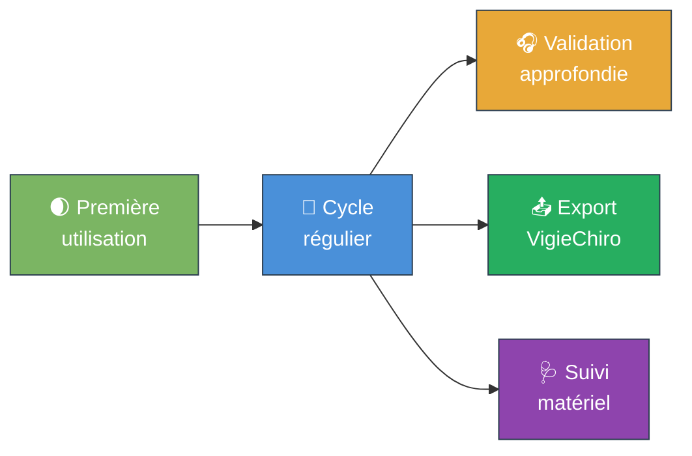

# Parcours utilisateurs

Cinq parcours principaux résument l'usage cible de l'application. Ils servent de guide pour le découpage en [épopées et stories](Story%20mapping.md).

---

## P1 - Première utilisation 🌒

> **Persona principal** : Marie. **Objectifs qualité visés** : [O2](../Objectifs%20qualités/Objectifs%20qualités/O2.md), [SC1](../Objectifs%20qualités/Scénario/SC1.md).

Marie vient de récupérer son PR du terrain, et n'a jamais ouvert l'application. Le but est qu'elle réussisse son premier import et sa première validation **sans aide**, en moins de 30 minutes.

1. Marie démarre l'application (raccourci sur le bureau ou menu démarrer).
2. Un **écran d'accueil** lui propose une seule action mise en avant : « **Importer une nuit** ».
3. Marie clique, sélectionne le dossier qu'elle a recopié de la SD, valide.
4. L'application **affiche une barre de progression** détaillée (lecture du log, copie des WAV, indexation), puis un **récapitulatif** : nombre de fichiers, durée totale, plage horaire couverte, paramètres d'acquisition détectés.
5. Marie est ensuite **invitée à charger les résultats Tadarida** : l'écran lui dit où télécharger le CSV depuis VigieChiro et lui propose un bouton « Importer le CSV d'observations ».
6. Une fois le CSV chargé, l'écran principal s'ouvre : la **liste des observations** à gauche, le **détail de l'observation sélectionnée** à droite (taxon proposé, probabilité, fréquence médiane, lecture audio).
7. Marie écoute quelques évènements, valide ceux qu'elle reconnaît, met de côté les douteux.
8. Elle ferme l'application sans paniquer, sachant que tout est sauvegardé.

---

## P2 - Cycle régulier 🔁

> **Persona principal** : Marie ou Karim. **Objectifs qualité visés** : [O3](../Objectifs%20qualités/Objectifs%20qualités/O3.md), [O5](../Objectifs%20qualités/Objectifs%20qualités/O5.md).

Le matin du surlendemain, l'utilisateur a déjà 5 nuits dans l'application. Il ajoute la sixième et la traite.

1. L'utilisateur ouvre l'application.
2. La page d'accueil affiche le **journal des sessions** : 5 sessions listées avec leur date, leur statut, le nombre d'observations restant à valider.
3. Il clique sur « Importer une nuit », sélectionne son nouveau dossier. Import en quelques minutes.
4. Une fois le CSV Tadarida chargé pour la nouvelle session, il **filtre** les observations : on cache les `noise` et les `piaf` pour ne garder que les chiroptères. Reste 200 observations.
5. Il **trie** par probabilité décroissante : il valide en lot les évènements à haute probabilité sans même les écouter, et ne ralentit que sur les douteux.
6. Il termine la session en **cochant « Validation terminée »** dans le journal des sessions.

---

## P3 - Validation approfondie 🎧

> **Persona principal** : Marie ou Léa. **Objectifs qualité visés** : [O4](../Objectifs%20qualités/Objectifs%20qualités/O4.md), [O7](../Objectifs%20qualités/Objectifs%20qualités/O7.md).

L'utilisateur tombe sur un évènement étiqueté `Pippip` à seulement 0.45 de probabilité. Il veut creuser.

1. L'utilisateur sélectionne l'observation. Le panneau de droite affiche le détail.
2. Il clique sur ▶ pour écouter l'évènement, **ralenti ×10**. La forme d'onde s'affiche, le curseur défile.
3. Il met en pause, change la vitesse à ×20, réécoute.
4. Il lit l'évènement précédent et l'évènement suivant pour avoir le contexte.
5. Il décide que c'est en fait un *Pipistrellus kuhlii* (`Pipkuh`). Il **modifie le taxon observateur** dans le panneau de détail.
6. Il **ajoute un commentaire libre** sur l'observation (« morphologie de pulse atypique, pic 39 kHz »).
7. Il poursuit avec l'observation suivante, sans avoir à confirmer la sauvegarde - tout est persistant immédiatement.

---

## P4 - Export VigieChiro 📤

> **Persona principal** : Marie. **Objectifs qualité visés** : [O4](../Objectifs%20qualités/Objectifs%20qualités/O4.md), [O8](../Objectifs%20qualités/Objectifs%20qualités/O8.md).

L'utilisateur a fini de valider une session, il veut renvoyer le résultat à VigieChiro.

1. Depuis le journal des sessions, l'utilisateur sélectionne une session marquée « Validation terminée ».
2. Il clique sur « **Exporter pour VigieChiro** ».
3. L'application **vérifie** : toutes les observations ont-elles bien été passées en revue ? S'il en reste sans validation, message d'avertissement avec proposition de continuer ou d'annuler.
4. L'utilisateur confirme. L'application produit un fichier `<session>_Vu.csv` au format attendu, dans un dossier choisi par l'utilisateur, et **affiche un récapitulatif** : combien d'observations exportées, combien validées, combien laissées au taxon Tadarida.
5. L'utilisateur peut **ouvrir le dossier d'export** d'un clic pour aller téléverser le fichier sur VigieChiro.
6. La session passe au statut « Exportée ». Date et heure d'export tracées.

---

## P5 - Suivi du matériel 🩺

> **Persona principal** : Karim. **Objectifs qualité visés** : aucun direct, mais c'est un usage fréquent.

L'utilisateur soupçonne que son PR a un souci (batterie qui faiblit, sonde T°/H qui dérive, mises en veille intempestives).

1. Depuis le journal des sessions, l'utilisateur ouvre la **vue diagnostic** d'une session.
2. Il y voit : **graphe de température** sur la nuit, **graphe d'hygrométrie**, **niveau de batterie** au début et à la fin, **liste des évènements anormaux** extraits du `LogPR*.txt` (réveils non programmés, erreurs SD, redémarrages).
3. Il **compare** avec une session précédente du même PR pour voir si la batterie tient moins bien qu'avant.
4. Il **exporte** le diagnostic en CSV ou PDF pour son rapport ou pour échange avec le fabricant.
