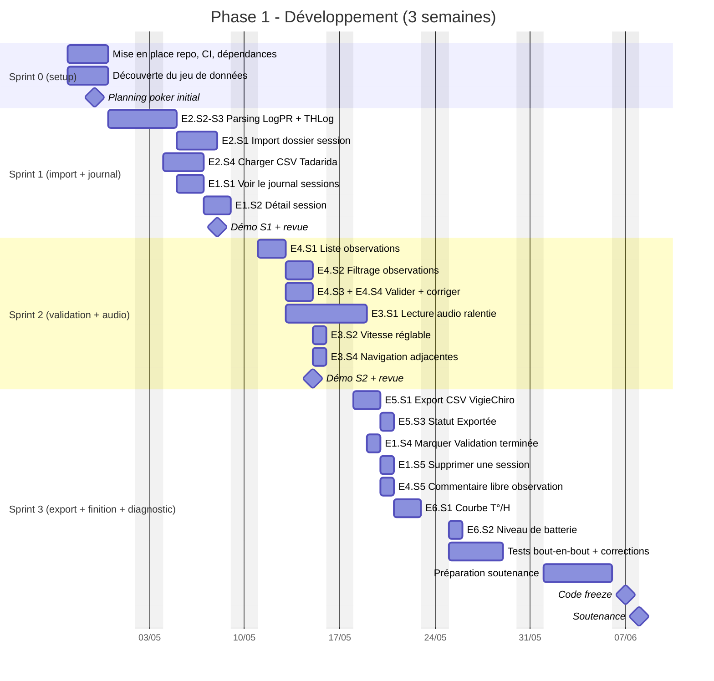

# Planification

Le développement est découpé en **3 sprints d'une semaine**, alignés sur la stratégie définie dans le [périmètre MVP](Périmètre%20MVP.md).

> ⚠️ Cette planification est **prospective**. Vous la révisez en équipe au début de chaque sprint en fonction de votre vélocité réelle et des aléas. Le Gantt n'est pas une promesse de livraison à la journée près - c'est un cadre pour piloter votre progression et détecter les dérives.

## Vue Gantt

## Détail par sprint

### Sprint 0 - Mise en place (27/04 → 29/04, 3 jours)

| Activité | Responsable | Sortie attendue |
|---|---|---|
| Cloner le repo Classroom, vérifier que le squelette compile | Toute l'équipe | Une PR pilote fusionnée pour valider le workflow |
| Lancer le jeu de données fourni | Toute l'équipe | Tour d'horizon des fichiers, premier feeling sur les volumes |
| Planning poker des stories MUST | Toute l'équipe | Estimations partagées (révision possible des chiffres du dossier) |
| Conception haute-niveau de l'architecture | Tech leads volontaires | Schéma de paquets (model / data / ui / parsing) |

**Livrable du sprint 0** : repo opérationnel, CI verte sur `main`, première PR mergée, accord d'équipe sur les estimations.

### Sprint 1 - Import et journal (30/04 → 08/05, 1 semaine)

**Objectif** : importer une session et voir la liste de ses sessions importées.

**Stories** : E2.S2 (3), E2.S3 (2), E2.S1 (8), E2.S4 (5), E1.S1 (3), E1.S2 (3) = **24 points**.

**Démo de fin de sprint** : importer le dossier `data/`, voir la session apparaître dans le journal, ouvrir sa fiche détail. Pas de validation encore.

### Sprint 2 - Validation et audio (11/05 → 15/05, 1 semaine)

**Objectif** : permettre la validation des observations avec écoute audio fluide.

**Stories MUST** : E4.S1 (3), E4.S2 (5), E4.S3 (3), E4.S4 (3), E3.S1 (8) = **22 points**.
**SHOULD ajoutés** (cible MVP étendu) : E3.S2 (3), E3.S4 (2) = **+5 points**.
**Total cible** : 27 points.

**Démo de fin de sprint** : sur la session importée, parcourir les 4031 observations, filtrer pour ne garder que les chiroptères à probabilité > 0.7, écouter quelques évènements en ralenti à vitesse réglable, naviguer rapidement d'une observation à l'autre, valider une dizaine d'observations.

### Sprint 3 - Export, diagnostic et finition (18/05 → 06/06, 3 semaines)

**Objectif** : compléter le MVP étendu, stabiliser, préparer la soutenance.

**Stories MUST** : E5.S1 (3), E5.S3 (3), E1.S4 (2), E1.S5 (3) = **11 points**.
**SHOULD ajoutés** (cible MVP étendu) : E4.S5 (2), E6.S1 (5), E6.S2 (2) = **+9 points**.
**Total cible** : 20 points + stabilisation + préparation soutenance.

**Marge** : ce sprint est volontairement plus long car il intègre la stabilisation, la correction des bugs identifiés en sprints 1-2, et la préparation de la soutenance. Si vous terminez le MVP étendu en avance, piochez dans la cible étirée (E1.S3 commentaire session, E2.S5 reprise import, E1.S6 tag chantier, E5.S2 récap export - cf. [Périmètre MVP](Périmètre%20MVP.md)).

**Code freeze** : 07/06 21h. **Soutenance** : 08/06.

## Indicateurs de pilotage

À surveiller chaque fin de sprint :

| Indicateur | Cible MVP | Alerte | Action si alerte |
|---|---|---|---|
| Story points livrés / planifiés | ≥ 80 % | < 60 % | Réduire la portée du sprint suivant, ou demander une revue d'arbitrage MoSCoW à l'équipe pédagogique. |
| Couverture de tests sur le code métier | ≥ 70 % | < 50 % | Sprint suivant à orientation tests. |
| CI verte sur `main` | 100 % | < 95 % | Refus de merge tant que CI rouge. |
| Stories en cours non finies | ≤ 1 | ≥ 3 | Stop the line : on finit avant de commencer. |

## Et si on n'y arrive pas ?

C'est un **scénario à anticiper** plutôt qu'un échec. Si à la fin du sprint 2 vous n'avez livré que 30 points sur 46 prévus, vous **ne tiendrez pas le MUST** au rythme actuel. Trois leviers :

1. **Réduire la portée** : signaler à l'équipe pédagogique les stories que vous proposez de basculer en COULD.
2. **Revoir la qualité** : si vous avez sacrifié les tests, vous payerez les bugs en sprint 3. Maintenez la couverture - ralentir maintenant fait gagner du temps plus tard.
3. **Demander une revue de spec** : si une story coûte beaucoup plus cher que prévu, c'est peut-être qu'elle est mal spécifiée. Discutez-en.

Le plus important : **communiquez tôt**. Une dérive signalée en début de sprint 2 se rattrape ; une dérive révélée le 06/06 ne se rattrape plus.
