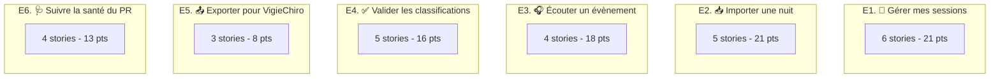

# Story mapping

Le travail des [parcours utilisateurs](Parcours%20utilisateurs.md) est décomposé en **6 épopées**, chacune contenant **3 à 6 stories** [INVEST](https://fr.wikipedia.org/wiki/INVEST_(g%C3%A9nie_logiciel)) (Independent, Negotiable, Valuable, Estimable, Small, Testable).

Chaque story est :
- identifiée par un code (`E1.S2` = épopée 1, story 2),
- rattachée à un ou plusieurs parcours,
- assortie de **critères d'acceptation** explicites,
- **estimée** en story points sur la suite de Fibonacci (1, 2, 3, 5, 8, 13). Les estimations sont indicatives - vous les réviserez en équipe au début de la phase de développement.

## Vue d'ensemble

**Total** : 27 stories, **97 story points**.

---

## E1 - 📒 Gérer mes sessions

> Couvre principalement le parcours **P2 - Cycle régulier**. Sans cette épopée, l'utilisateur ne peut même pas se repérer dans son travail.

### E1.S1 - Voir le journal de mes sessions (3 pts)

**En tant que** possesseur de PR
**Je veux** voir la liste de mes sessions importées sous forme tabulaire
**Afin de** retrouver rapidement celle sur laquelle je travaille

**Critères d'acceptation** :
- [ ] Toutes les sessions importées apparaissent.
- [ ] Pour chaque session : date de capture, n° de PR, durée, nombre de WAV, statut (Importée / CSV chargé / Validation en cours / Validation terminée / Exportée).
- [ ] Tri possible par chaque colonne.
- [ ] Sélectionner une ligne ouvre le détail de la session.

### E1.S2 - Voir le détail d'une session (3 pts)

**En tant que** utilisateur
**Je veux** consulter la fiche détaillée d'une session
**Afin de** vérifier ses paramètres avant de la traiter

**Critères d'acceptation** :
- [ ] Affiche : numéro de PR, date+heure début/fin, paramètres d'acquisition (Fe, bande de fréquence, gain), nombre de WAV bruts, nombre d'observations Tadarida si CSV chargé, nombre d'observations validées.
- [ ] Affiche le chemin du dossier source.
- [ ] Bouton « Ouvrir le dossier source » dans l'explorateur OS.

### E1.S3 - Annoter une session avec un commentaire libre (2 pts)

**En tant que** utilisateur
**Je veux** ajouter une note textuelle sur une session
**Afin de** mémoriser un contexte (météo, intervention humaine, anomalie matérielle)

**Critères d'acceptation** :
- [ ] Champ texte multi-lignes, accepte 2000 caractères.
- [ ] Sauvegarde immédiate, sans bouton « Enregistrer ».
- [ ] Le commentaire apparaît dans la fiche détaillée.

### E1.S4 - Marquer une session comme « Validation terminée » (2 pts)

**En tant que** utilisateur
**Je veux** déclarer une session comme validée
**Afin de** la rendre éligible à l'export

**Critères d'acceptation** :
- [ ] Bouton dans la fiche détaillée.
- [ ] Avertissement si toutes les observations n'ont pas été passées en revue (proposition de continuer ou d'annuler).
- [ ] Statut visible dans le journal des sessions.
- [ ] Réversible (on peut repasser en « Validation en cours »).

### E1.S5 - Supprimer une session (3 pts)

**En tant que** utilisateur
**Je veux** supprimer une session de l'application
**Afin de** nettoyer les imports erronés

**Critères d'acceptation** :
- [ ] Confirmation à 2 clics (modale).
- [ ] Choix : supprimer seulement les métadonnées (garder les WAV) ou tout effacer (libère le disque).
- [ ] Action irréversible une fois confirmée, signalée comme telle.

### E1.S6 - Tagger une session par chantier / projet (8 pts)

**En tant que** Karim (chargé d'études)
**Je veux** associer un libellé arbitraire à mes sessions (`Chantier_PARC42`, `Etude_LPO_2026`...)
**Afin de** regrouper et filtrer mes sessions par projet

**Critères d'acceptation** :
- [ ] Champ tag dans la fiche session.
- [ ] Auto-complétion à partir des tags déjà utilisés.
- [ ] Filtrage du journal par tag.
- [ ] Plusieurs tags par session possibles.

---

## E2 - 📥 Importer une nuit

> Couvre les parcours **P1 - Première utilisation** et **P2 - Cycle régulier**. Sans cette épopée, l'application est vide.

### E2.S1 - Importer un dossier de session (8 pts)

**En tant que** utilisateur
**Je veux** sélectionner un dossier contenant une nuit de capture (WAV bruts + LogPR + THLog)
**Afin de** créer une nouvelle session dans l'application

**Critères d'acceptation** :
- [ ] Dialogue de sélection de dossier (ou drag-and-drop sur la fenêtre).
- [ ] Détection automatique du `LogPR*.txt` et du `*_THLog.csv`.
- [ ] Détection automatique du sous-dossier `wav/` (ou des WAV à la racine si pas de sous-dossier).
- [ ] Métadonnées extraites du `LogPR` : numéro de série du PR, date début/fin, paramètres d'acquisition.
- [ ] Métadonnées extraites du nom des WAV : code carrée, année, n° de passage, zone.
- [ ] Barre de progression pendant l'import.
- [ ] Erreur explicite si le dossier ne contient pas de session reconnaissable.

### E2.S2 - Parser le LogPR (3 pts)

**En tant que** application
**Je veux** lire et structurer le contenu du `LogPR*.txt`
**Afin de** disposer des paramètres d'acquisition et des évènements

**Critères d'acceptation** :
- [ ] Une ligne du log est parsée vers un objet `EvenementLog{date, type, message}`.
- [ ] Reconnaissance des types : démarrage, paramètres, batterie, mise en veille, réveil, anomalie.
- [ ] Extraction des paramètres d'acquisition de la ligne `Paramètres : ...`.
- [ ] Tolérant aux lignes inattendues (passe en `INCONNU` plutôt que d'échouer).

### E2.S3 - Parser le log T°/Hygro (2 pts)

**En tant que** application
**Je veux** lire le `*_THLog.csv`
**Afin de** afficher les courbes T°/H

**Critères d'acceptation** :
- [ ] Format `Date;Hour;Temperature;Humidity` reconnu.
- [ ] Date+Hour fusionnés en un `LocalDateTime`.
- [ ] Erreur explicite si le format est incorrect.

### E2.S4 - Charger un CSV d'observations Tadarida (5 pts)

**En tant que** utilisateur
**Je veux** importer le CSV d'observations Tadarida correspondant à une session
**Afin de** disposer des classifications à valider

**Critères d'acceptation** :
- [ ] Sélection du fichier CSV via dialogue.
- [ ] Parsing du format point-virgule + guillemets.
- [ ] Association automatique des observations aux WAV de la session par le nom de fichier.
- [ ] Avertissement si certaines observations ne correspondent à aucun WAV de la session.
- [ ] Refus si le CSV ne contient pas les colonnes attendues.

### E2.S5 - Reprendre un import interrompu (3 pts)

**En tant que** utilisateur
**Je veux** que l'application reprenne proprement après une interruption d'import
**Afin de** ne pas perdre l'état partiel ni corrompre la base

**Critères d'acceptation** :
- [ ] Si l'application redémarre alors qu'un import était en cours, la session partielle est marquée « Import incomplet ».
- [ ] Action « Réessayer l'import » disponible sur cette session.
- [ ] Aucune corruption de la base.

---

## E3 - 🎧 Écouter un évènement

> Couvre le parcours **P3 - Validation approfondie**. Sans cette épopée, on ne peut pas qualifier les observations douteuses.

### E3.S1 - Lecture audio ralentie d'un WAV (8 pts)

**En tant que** utilisateur
**Je veux** écouter un évènement sonore en mode ralenti
**Afin de** percevoir les ultrasons dans la bande audible

**Critères d'acceptation** :
- [ ] Bouton ▶ sur la fiche détail d'une observation.
- [ ] Lecture du WAV concerné, ralenti par défaut ×10.
- [ ] Pas de clipping audible.
- [ ] La lecture peut être mise en pause / reprise / arrêtée.

### E3.S2 - Régler la vitesse de lecture (3 pts)

**En tant que** utilisateur
**Je veux** changer le facteur de ralentissement (×5, ×10, ×20)
**Afin de** adapter à la fréquence du signal

**Critères d'acceptation** :
- [ ] Sélecteur visible (boutons ou menu).
- [ ] Changement effectif sans avoir à arrêter la lecture en cours.
- [ ] La vitesse choisie est mémorisée pour la prochaine lecture.

### E3.S3 - Afficher la forme d'onde (5 pts)

**En tant que** utilisateur
**Je veux** voir la forme d'onde du WAV en cours d'écoute
**Afin de** repérer visuellement les pulses

**Critères d'acceptation** :
- [ ] Forme d'onde affichée à côté du contrôle audio.
- [ ] Curseur de lecture mobile sur la forme d'onde.
- [ ] Cliquer sur la forme d'onde repositionne la lecture.

### E3.S4 - Lecture des observations adjacentes (2 pts)

**En tant que** utilisateur
**Je veux** naviguer rapidement à l'observation précédente / suivante
**Afin de** comparer le contexte sonore

**Critères d'acceptation** :
- [ ] Boutons ⏮ / ⏭ ou raccourcis clavier (flèche haut / bas).
- [ ] Sélection mise à jour automatiquement dans la liste.

---

## E4 - ✅ Valider les classifications

> Couvre les parcours **P2 - Cycle régulier** et **P3 - Validation approfondie**. C'est la valeur métier pure de l'application.

### E4.S1 - Voir la liste des observations d'une session (3 pts)

**En tant que** utilisateur
**Je veux** parcourir les observations Tadarida d'une session sous forme tabulaire
**Afin de** les passer en revue une à une

**Critères d'acceptation** :
- [ ] Colonnes : nom du WAV, début, fin, fréquence médiane, taxon Tadarida, probabilité, taxon observateur, statut (à valider / validé / corrigé).
- [ ] Tri par chaque colonne.
- [ ] Sélection d'une ligne ouvre le détail.
- [ ] Performance : tri/sélection en <100 ms sur 4000 lignes.

### E4.S2 - Filtrer les observations (5 pts)

**En tant que** utilisateur
**Je veux** filtrer les observations par taxon, par probabilité minimale, par statut
**Afin de** me concentrer sur ce qui mérite mon attention

**Critères d'acceptation** :
- [ ] Filtre par taxon (multi-sélection).
- [ ] Filtre par probabilité minimale (curseur 0-1).
- [ ] Filtre par statut (à valider / validé / corrigé).
- [ ] Filtres cumulables.
- [ ] Compteur visible : `42 observations affichées sur 4031`.

### E4.S3 - Valider une observation (Tadarida est correct) (3 pts)

**En tant que** utilisateur
**Je veux** confirmer la classification Tadarida d'une observation
**Afin de** acter mon accord

**Critères d'acceptation** :
- [ ] Bouton « Valider » dans le panneau détail.
- [ ] Renseigne automatiquement `observateur_taxon` = `tadarida_taxon` et `observateur_probabilite` = 1.0.
- [ ] Persistance immédiate.
- [ ] Indicateur visuel dans la liste (statut « validé »).

### E4.S4 - Corriger une observation (proposer un autre taxon) (3 pts)

**En tant que** utilisateur
**Je veux** changer le taxon de l'observation
**Afin de** corriger une classification erronée

**Critères d'acceptation** :
- [ ] Sélecteur de taxon dans le panneau détail (auto-complétion sur la liste des taxons connus).
- [ ] Saisie de la probabilité observateur (entre 0 et 1).
- [ ] Persistance immédiate.
- [ ] Indicateur visuel dans la liste (statut « corrigé »).

### E4.S5 - Annoter une observation avec un commentaire libre (2 pts)

**En tant que** utilisateur
**Je veux** ajouter un commentaire textuel sur une observation
**Afin de** mémoriser un raisonnement (`pic 39 kHz, morphologie atypique`)

**Critères d'acceptation** :
- [ ] Champ texte dans le panneau détail.
- [ ] Persistance immédiate.
- [ ] Inclus dans l'export.

---

## E5 - 📤 Exporter pour VigieChiro

> Couvre le parcours **P4 - Export VigieChiro**. C'est ce qui boucle la boucle.

### E5.S1 - Exporter le CSV de validation (3 pts)

**En tant que** utilisateur
**Je veux** produire le CSV `<session>_Vu.csv` au format VigieChiro
**Afin de** le téléverser sur la plateforme

**Critères d'acceptation** :
- [ ] Format identique à l'exemple `…observations_Vu.csv` fourni.
- [ ] Encodage UTF-8, séparateur `;`.
- [ ] Champs `observateur_taxon` et `observateur_probabilite` remplis avec ce que l'utilisateur a saisi.
- [ ] Si l'utilisateur n'a rien saisi pour une observation, le taxon Tadarida est repris.
- [ ] Sélection du dossier de destination via dialogue.
- [ ] Bouton « Ouvrir le dossier d'export » à la fin.

### E5.S2 - Récapitulatif d'export (2 pts)

**En tant que** utilisateur
**Je veux** voir un résumé après chaque export
**Afin de** vérifier ce que je viens de produire

**Critères d'acceptation** :
- [ ] Modale ou panneau affichant : nombre d'observations exportées, nombre validées, nombre corrigées, nombre laissées au taxon Tadarida.
- [ ] Bouton de fermeture.

### E5.S3 - Marquer la session comme « Exportée » (3 pts)

**En tant que** utilisateur
**Je veux** que l'application trace mes exports
**Afin de** savoir ce qui a déjà été envoyé à VigieChiro

**Critères d'acceptation** :
- [ ] Statut « Exportée » dans le journal des sessions après un export réussi.
- [ ] Date et heure de l'export tracées dans la fiche session.
- [ ] Si l'utilisateur modifie une validation après export, signalement « modifications non exportées » dans la fiche.

---

## E6 - 🩺 Suivre la santé du PR

> Couvre le parcours **P5 - Suivi du matériel**. Important pour Karim et Léa, plaisant pour Marie.

### E6.S1 - Visualiser la courbe T°/H d'une session (5 pts)

**En tant que** utilisateur
**Je veux** voir un graphe température + hygrométrie de la nuit
**Afin de** vérifier les conditions de capture

**Critères d'acceptation** :
- [ ] Graphe dans la fiche détaillée de la session (onglet « Diagnostic »).
- [ ] Axe X : temps. Axes Y : T° (°C) et H (%) sur deux axes.
- [ ] Survol affiche valeur précise.
- [ ] Pas affiché si le `THLog.csv` est vide ou inexistant (message « Pas de données »).

### E6.S2 - Voir le niveau de batterie début/fin (2 pts)

**En tant que** utilisateur
**Je veux** voir l'évolution de la tension batterie sur la nuit
**Afin de** détecter une batterie qui faiblit

**Critères d'acceptation** :
- [ ] Lecture des lignes `Bat. Interne X.XV (Y%)` du LogPR.
- [ ] Affichage : valeur début, valeur fin, variation.
- [ ] Indicateur visuel (vert/orange/rouge) selon seuils paramétrables.

### E6.S3 - Lister les évènements anormaux du LogPR (3 pts)

**En tant que** utilisateur
**Je veux** voir une liste des anomalies détectées dans le LogPR (réveils non programmés, erreurs SD, redémarrages)
**Afin de** savoir si la nuit s'est bien passée

**Critères d'acceptation** :
- [ ] Onglet « Diagnostic » de la fiche session.
- [ ] Liste avec date+heure et description.
- [ ] Vide si aucune anomalie (message « Nuit normale »).

### E6.S4 - Comparer 2 sessions du même PR (3 pts)

**En tant que** Karim
**Je veux** comparer les courbes T°/H et batterie de deux sessions
**Afin de** détecter une dérive du matériel

**Critères d'acceptation** :
- [ ] Sélection de 2 sessions dans le journal (Ctrl+click).
- [ ] Bouton « Comparer ».
- [ ] Affichage des deux courbes superposées avec légende.
