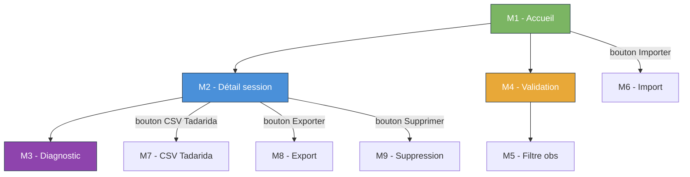

# Maquettes

Cette section regroupe les **wireframes basse fidélité** de l'application *VigieChiro PR Companion*. Chaque écran est décrit par :

- un **wireframe ASCII** présentant le layout grossier ;
- la liste des **composants** affichés et leurs **données** ;
- les **interactions** disponibles ;
- les **états** notables (vide, chargement, erreur, sélection…) ;
- les **stories** et **parcours** rattachés.

!!! warning "Wireframes basse fidélité, pas spec figée"
    Ces maquettes posent l'**organisation** des écrans et la **hiérarchie** des informations à afficher. Elles n'imposent pas le style visuel final (couleurs, typographies, icônes, espacements précis) - ce travail vous revient et fait partie de l'évaluation R2.02 / R2.03.

    Vous pouvez **proposer une variante** d'un écran si vous identifiez une meilleure organisation - dans ce cas, justifiez le choix dans votre soutenance.

## Cartographie des écrans

| # | Écran | Type | Parcours | Stories |
|---|---|---|---|---|
| [M1](M1-accueil.md) | Accueil / Journal des sessions | Vue principale | P2 | E1.S1, E1.S6 |
| [M2](M2-detail-session.md) | Fiche détail d'une session | Vue secondaire | P1, P2 | E1.S2, E1.S3, E1.S4 |
| [M3](M3-diagnostic-session.md) | Diagnostic de session | Onglet | P5 | E6.S1, E6.S2, E6.S3 |
| [M4](M4-validation.md) | Vue principale de validation | Vue principale | P2, P3 | E4.S1/S3/S4, E3.S1/S2/S4 |
| [M5](M5-filtre-observations.md) | Panneau de filtre des observations | Panneau | P2 | E4.S2 |
| [M6](M6-modale-import.md) | Modale d'import d'une session | Modale | P1, P2 | E2.S1, E2.S5 |
| [M7](M7-modale-csv-tadarida.md) | Modale de chargement du CSV Tadarida | Modale | P1, P2 | E2.S4 |
| [M8](M8-modale-export.md) | Modale d'export VigieChiro | Modale | P4 | E5.S1, E5.S2, E5.S3 |
| [M9](M9-modale-suppression.md) | Modale de suppression d'une session | Modale | — | E1.S5 |

## Topologie

## Conventions des wireframes ASCII

- `┌─┐ │ └─┘` : conteneurs / panneaux
- `[Bouton]` : bouton actionnable
- `( )` / `(o)` : radio button (vide / coché)
- `[ ]` / `[X]` : case à cocher (vide / cochée)
- `▼` : menu déroulant
- `█▓▒░` : graphique / forme d'onde / spectrogramme (simulé)
- `…` : contenu tronqué / variable
- `⟶` : flèche d'interaction / navigation
