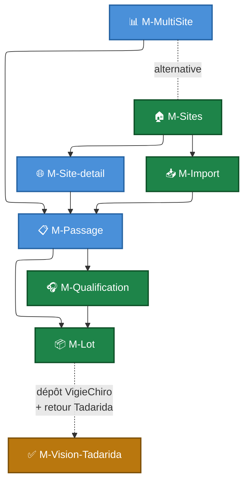

# Maquettes

Cette section regroupe les **wireframes basse fidélité** de l'application *VigieChiro PR Companion*. Chaque maquette est décrite par :

- un **wireframe SVG** présentant le layout final attendu (cadre fenêtre, top nav, contenu, footer) ;
- la liste des **composants** affichés et leurs **données** d'exemple ;
- les **interactions clés** entre éléments ;
- les **variantes** (état vide, modales, panneaux dépliés, écrans intermédiaires) regroupées dans le même fichier ;
- les **parcours** et **stories** rattachés ;
- des **notes d'implémentation** ciblées (composants JavaFX recommandés, points d'attention performance ou UX, raccourcis claviers).

!!! warning "Wireframes basse fidélité, pas spec figée"
    Ces maquettes posent l'**organisation** des écrans et la **hiérarchie** des informations à afficher. Elles n'imposent pas le style visuel final (couleurs, typographies, icônes, espacements précis) — ce travail vous revient et fait partie de l'évaluation R2.02 / R2.03.

    Vous pouvez **proposer une variante** d'un écran si vous identifiez une meilleure organisation — dans ce cas, justifiez le choix dans votre soutenance.

## Cartographie des écrans

| # | Écran | Type | Parcours principal | Épopées couvertes |
|---|---|---|---|---|
| [M-Sites](M-Sites.md) | Vue de mes sites de suivi | Vue principale (accueil) | [P1](../Parcours%20utilisateurs/P1%20-%20Déclarer%20un%20site%20de%20suivi.md) | [E1.S1](../Story%20mapping/E1%20-%20Gérer%20ses%20sites%20et%20points%20de%20suivi.md#e1s1), [E1.S4](../Story%20mapping/E1%20-%20Gérer%20ses%20sites%20et%20points%20de%20suivi.md#e1s4) |
| [M-Site-detail](M-Site-detail.md) | Fiche détail d'un site | Vue secondaire | [P1](../Parcours%20utilisateurs/P1%20-%20Déclarer%20un%20site%20de%20suivi.md) | [E1.S2](../Story%20mapping/E1%20-%20Gérer%20ses%20sites%20et%20points%20de%20suivi.md#e1s2), [E1.S3](../Story%20mapping/E1%20-%20Gérer%20ses%20sites%20et%20points%20de%20suivi.md#e1s3) |
| [M-Import](M-Import.md) | Assistant d'import d'une nuit | Vue principale | [P2](../Parcours%20utilisateurs/P2%20-%20Importer%20une%20nuit%20d%27enregistrement.md) | [E2.S1](../Story%20mapping/E2%20-%20Importer%20et%20transformer%20une%20nuit.md#e2s1) à [E2.S7](../Story%20mapping/E2%20-%20Importer%20et%20transformer%20une%20nuit.md#e2s7) |
| [M-Passage](M-Passage.md) | Détail d'un passage (4 onglets) | Vue pivot | transverse | [E0.S3](../Story%20mapping/E0%20-%20Fondations%20de%20persistance.md#e0s3), [E4.S4](../Story%20mapping/E4%20-%20Préparer%20et%20tracer%20le%20dépôt%20VigieChiro.md#e4s4), [E6](../Story%20mapping/E6%20-%20Diagnostiquer%20le%20matériel.md) |
| [M-Qualification](M-Qualification.md) | Vérification d'enregistrement par échantillonnage | Vue plein écran | [P3](../Parcours%20utilisateurs/P3%20-%20Vérifier%20l%27enregistrement%20par%20échantillonnage.md) | [E3](../Story%20mapping/E3%20-%20Vérifier%20la%20qualité%20d%27enregistrement.md) |
| [M-Lot](M-Lot.md) | Préparation du lot à déposer | Vue plein écran | [P4](../Parcours%20utilisateurs/P4%20-%20Préparer%20un%20lot%20prêt%20à%20déposer.md) | [E4.S1](../Story%20mapping/E4%20-%20Préparer%20et%20tracer%20le%20dépôt%20VigieChiro.md#e4s1) à [E4.S3](../Story%20mapping/E4%20-%20Préparer%20et%20tracer%20le%20dépôt%20VigieChiro.md#e4s3) |
| [M-MultiSite](M-MultiSite.md) | Vue tabulaire multi-sites (Karim / Samuel) | Vue de production | [P5](../Parcours%20utilisateurs/P5%20-%20Naviguer%20dans%20plusieurs%20sites%20et%20passages.md) | [E5](../Story%20mapping/E5%20-%20Naviguer%20dans%20le%20volume%20multi-sites.md) |
| [M-Diagnostic](M-Diagnostic.md) | Diagnostic matériel d'un passage | Vue secondaire (depuis M-Passage) | [P6](../Parcours%20utilisateurs/P6%20-%20Diagnostiquer%20le%20matériel.md) | [E6](../Story%20mapping/E6%20-%20Diagnostiquer%20le%20matériel.md) |
| [M-Vision-Tadarida](M-Vision-Tadarida.md) | Validation taxonomique post-Tadarida | Vue plein écran (cible étirée) | [P7](../Parcours%20utilisateurs/P7%20-%20Valider%20les%20résultats%20Tadarida.md) | [E7](../Story%20mapping/E7%20-%20Valider%20les%20résultats%20Tadarida.md), [E8](../Story%20mapping/E8%20-%20Productivité%20avancée%20Tadarida.md) |
| [M-Bibliotheque](M-Bibliotheque.md) | Bibliothèque de sons de référence | Vue plein écran (cible étirée) | [P10](../Parcours%20utilisateurs/P10%20-%20Exporter%20une%20bibliothèque%20de%20sons%20de%20référence.md) | [E8.S2](../Story%20mapping/E8%20-%20Productivité%20avancée%20Tadarida.md#e8s2) |
| [M-Analyse](M-Analyse.md) | Espèces & observations (inventaire transverse) | Vue plein écran | [P11](../Parcours%20utilisateurs/P11%20-%20Inventaire%20des%20espèces%20détectées.md) | prisme biodiversité |

## Comment lire une maquette

Chaque fichier `.md` suit la même structure :

1. **En-tête** avec type, persona principal, parcours et stories couvertes.
2. **Wireframe principal** : un SVG inline qui représente l'écran cible avec des données d'exemple cohérentes (n° de carré 640380, PR 1925492…).
3. **Annotations** : explication de chaque zone du wireframe (header, sections numérotées, badges, etc.).
4. **Interactions clés** : tableau des actions disponibles sur chaque élément cliquable.
5. **Variantes** (quand pertinent) : wireframes secondaires dans le même fichier — état vide, modales, écrans intermédiaires (ex. progression d'un import), bascule de mode (vue tableau vs arborescence).
6. **Notes pour l'implémentation** : composants JavaFX recommandés, points de performance, raccourcis claviers, dépendances entre maquettes.

## Convention de navigation entre écrans

- 🟩 **Vert** : maquettes de la chaîne fil rouge (MUST).
- 🟦 **Bleu** : maquettes de soutien (détails, navigation multi-sites).
- 🟧 **Orange** : maquette de cible étirée hors MVP strict.

## Pattern visuel partagé

Toutes les maquettes utilisent un cadre fenêtre commun :

- **Title bar** sombre (`#2c3e50`) avec logo 🦇 + nom de l'application.
- **Top nav** un cran plus clair (`#34495e`) avec 4 entrées principales (Mes sites, Importer, Vue tabulaire, Paramètres).
- **Breadcrumb** quand l'écran est en profondeur dans la navigation.
- **Page header** avec titre principal et sous-titre éventuel.
- **Sections numérotées** pour les écrans assistant (M-Import, M-Lot) ou panneau de détail (M-Qualification, M-Vision-Tadarida).
- **Footer** avec astuces clavier et indicateurs d'état.

**Palette de couleurs** (cohérente avec le reste du dossier) :

| Usage | Couleur | Exemple |
|---|---|---|
| Primary actions / liens | `#4a90d9` (bleu) | Boutons « Importer », liens breadcrumb |
| Success / verdict OK | `#1e8449` (vert) | Badges Déposé OK, statut Vérifié |
| Warning / verdict Douteux | `#b9770e` (orange) | Statut Transformé, cible étirée |
| Danger / verdict À jeter | `#a93226` (rouge) | Bouton Supprimer, verdict À jeter |
| Neutral / inactif | `#6a737d` (gris) | Texte secondaire, états désactivés |
| Background subtil | `#f6f8fa` (gris très clair) | Bandeaux d'info, rows alternées |

**Cohérence entre écrans similaires** :

- [M-Qualification](M-Qualification.md) et [M-Vision-Tadarida](M-Vision-Tadarida.md) partagent le **même squelette « liste + détail »** (2 colonnes, panneau de détail avec info en haut + visualisation au milieu + boutons d'action colorés en bas). Les étudiants n'implémentent qu'un seul pattern de « lieu d'écoute » qui se décline pour les deux cas.
- [M-Sites](M-Sites.md) et [M-Site-detail](M-Site-detail.md) utilisent le **même style de cards** pour les sites et les points d'écoute.

## Cas non maquettés (documentés textuellement)

Certains écrans secondaires ne font pas l'objet d'un wireframe complet mais sont décrits dans les fiches correspondantes :

- **Formulaire de création d'un site** : décrit dans la variante de [M-Site-detail](M-Site-detail.md) et invocable depuis [M-Sites](M-Sites.md).
- **Modal de re-rattachement d'un passage** ([E2.S8](../Story%20mapping/E2%20-%20Importer%20et%20transformer%20une%20nuit.md#e2s8)) : action accessible depuis [M-Passage](M-Passage.md).
- **Modal de suppression de masse** ([E5.S4](../Story%20mapping/E5%20-%20Naviguer%20dans%20le%20volume%20multi-sites.md#e5s4)) : confirmation forte avec saisie « SUPPRIMER ». Décrite dans [M-MultiSite](M-MultiSite.md).
- **Sélecteur de taxon de correction** ([E7.S4](../Story%20mapping/E7%20-%20Valider%20les%20résultats%20Tadarida.md#e7s4)) : autocomplete sur code à 6 lettres. Décrit dans [M-Vision-Tadarida](M-Vision-Tadarida.md).
- **Modal de confirmation « J'ai déposé »** ([E4.S3](../Story%20mapping/E4%20-%20Préparer%20et%20tracer%20le%20dépôt%20VigieChiro.md#e4s3)) : avant transition vers le statut Déposé. Décrite dans [M-Lot](M-Lot.md).
