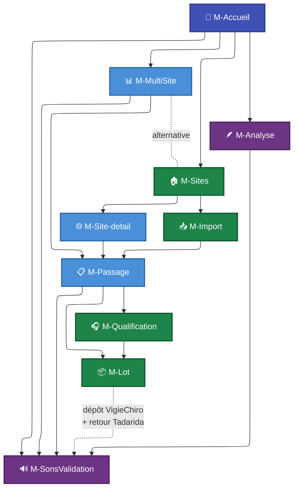

# Maquettes

Cette section regroupe les **maquettes basse fidélité** de l'application *VigieChiro Companion*. Chaque maquette est décrite par :

- une **maquette SVG** présentant l’agencement final attendu (cadre fenêtre, barre de navigation, contenu, pied de page) ;
- la liste des **composants** affichés et leurs **données** d'exemple ;
- les **interactions clés** entre éléments ;
- les **variantes** (état vide, modales, panneaux dépliés, écrans intermédiaires) regroupées dans le même fichier ;
- les **parcours** et **stories** rattachés ;
- des **notes d'implémentation** ciblées (composants JavaFX recommandés, points d'attention performance ou UX, raccourcis claviers).

!!! warning "Maquettes basse fidélité, pas spécification figée"
    Ces maquettes posent l'**organisation** des écrans et la **hiérarchie** des informations à afficher. Elles n'imposent pas le style visuel final (couleurs, typographies, icônes, espacements précis) : ce niveau relève de l'implémentation.

    Une **variante** d'un écran est envisageable si elle améliore l'organisation ; le choix se justifie alors dans la documentation.

## Cartographie des écrans

| # | Écran | Type | Parcours principal | Épopées couvertes |
|---|---|---|---|---|
| [M-Accueil](M-Accueil.md) | Lanceur (bandeau nocturne + deux prismes) | Écran d'accueil (point d'entrée) | transverse (tous) | toutes (lanceur) |
| [M-Sites](M-Sites.md) | Vue de mes sites de suivi | Vue principale | [P1](../Parcours%20utilisateurs/P1%20-%20Déclarer%20un%20site%20de%20suivi.md) | [E1.S1](../Story%20mapping/E1%20-%20Gérer%20ses%20sites%20et%20points%20de%20suivi.md#e1s1), [E1.S4](../Story%20mapping/E1%20-%20Gérer%20ses%20sites%20et%20points%20de%20suivi.md#e1s4) |
| [M-Site-detail](M-Site-detail.md) | Fiche détail d'un site | Vue secondaire | [P1](../Parcours%20utilisateurs/P1%20-%20Déclarer%20un%20site%20de%20suivi.md) | [E1.S2](../Story%20mapping/E1%20-%20Gérer%20ses%20sites%20et%20points%20de%20suivi.md#e1s2), [E1.S3](../Story%20mapping/E1%20-%20Gérer%20ses%20sites%20et%20points%20de%20suivi.md#e1s3) |
| [M-Import](M-Import.md) | Assistant d'import d'une nuit | Vue principale | [P2](../Parcours%20utilisateurs/P2%20-%20Importer%20une%20nuit%20d%27enregistrement.md) | [E2.S1](../Story%20mapping/E2%20-%20Importer%20et%20transformer%20une%20nuit.md#e2s1) à [E2.S7](../Story%20mapping/E2%20-%20Importer%20et%20transformer%20une%20nuit.md#e2s7) |
| [M-Passage](M-Passage.md) | Détail d'un passage (4 onglets) | Vue pivot | transverse | [E0.S3](../Story%20mapping/E0%20-%20Fondations%20de%20persistance.md#e0s3), [E4.S4](../Story%20mapping/E4%20-%20Préparer%20et%20tracer%20le%20dépôt%20VigieChiro.md#e4s4), [E6](../Story%20mapping/E6%20-%20Diagnostiquer%20le%20matériel.md) |
| [M-Qualification](M-Qualification.md) | Vérification d'enregistrement par échantillonnage | Vue plein écran | [P3](../Parcours%20utilisateurs/P3%20-%20Vérifier%20l%27enregistrement%20par%20échantillonnage.md) | [E3](../Story%20mapping/E3%20-%20Vérifier%20la%20qualité%20d%27enregistrement.md) |
| [M-SonsValidation](M-SonsValidation.md) | Sons & validation (écoute, validation taxonomique, références) | Vue plein écran (4 sources) | [P7](../Parcours%20utilisateurs/P7%20-%20Valider%20les%20résultats%20Tadarida.md), [P10](../Parcours%20utilisateurs/P10%20-%20Exporter%20une%20bibliothèque%20de%20sons%20de%20référence.md) | prisme biodiversité |
| [M-Lot](M-Lot.md) | Préparation du dépôt | Vue plein écran | [P4](../Parcours%20utilisateurs/P4%20-%20Préparer%20un%20lot%20prêt%20à%20déposer.md) | [E4.S1](../Story%20mapping/E4%20-%20Préparer%20et%20tracer%20le%20dépôt%20VigieChiro.md#e4s1) à [E4.S3](../Story%20mapping/E4%20-%20Préparer%20et%20tracer%20le%20dépôt%20VigieChiro.md#e4s3) |
| [M-MultiSite](M-MultiSite.md) | Carte & passages (carte au carroyage + tableau) | Vue plein écran | [P5](../Parcours%20utilisateurs/P5%20-%20Naviguer%20dans%20plusieurs%20sites%20et%20passages.md) | [E5](../Story%20mapping/E5%20-%20Naviguer%20dans%20le%20volume%20multi-sites.md) |
| [M-Diagnostic](M-Diagnostic.md) | Diagnostic matériel d'un passage | Vue secondaire (depuis M-Passage) | [P6](../Parcours%20utilisateurs/P6%20-%20Diagnostiquer%20le%20matériel.md) | [E6](../Story%20mapping/E6%20-%20Diagnostiquer%20le%20matériel.md) |
| [M-Analyse](M-Analyse.md) | Espèces & observations (inventaire transverse) | Vue plein écran | [P11](../Parcours%20utilisateurs/P11%20-%20Inventaire%20des%20espèces%20détectées.md) | prisme biodiversité |
| [M-Recherche](M-Recherche.md) | Recherche globale (liste déroulante du chrome) | Transverse (tous écrans) | [P8](../Parcours%20utilisateurs/P8%20-%20Rechercher%20globalement.md) | recherche transverse |

## Comment lire une maquette

Chaque fichier `.md` suit la même structure :

1. **En-tête** avec type, persona principal, parcours et stories couvertes.
2. **Maquette principale** : un SVG inline qui représente l'écran cible avec des données d'exemple cohérentes (n° de carré 640380, PR 1925492…).
3. **Annotations** : explication de chaque zone de la maquette (en-tête, sections numérotées, badges, etc.).
4. **Interactions clés** : tableau des actions disponibles sur chaque élément cliquable.
5. **Variantes** (quand pertinent) : maquettes secondaires dans le même fichier : état vide, modales, écrans intermédiaires (ex. progression d'un import), bascule de mode (vue tableau vs arborescence).
6. **Notes pour l'implémentation** : composants JavaFX recommandés, points de performance, raccourcis claviers, dépendances entre maquettes.

## Convention de navigation entre écrans

- 🟦 **Indigo** : écran d'accueil (lanceur à deux prismes).
- 🟩 **Vert** : maquettes de la chaîne fil rouge (MUST).
- 🟦 **Bleu** : maquettes de soutien (détails, navigation multi-sites).
- 🟪 **Violet** : prisme espèces & biodiversité (inventaire, sons & validation).

## Pattern visuel partagé

Toutes les maquettes reprennent le **cadre fenêtre** du chrome (`MainView.fxml`) :

- **Bandeau de navigation** indigo (`#3f51b5`) : nom de l'application « VigieChiro Companion », bouton **« ← Retour »** (historique de navigation), **fil d'Ariane** partant toujours d'`Accueil`, et le champ de **recherche globale** (`Ctrl+F`) aligné à droite.
- **En-tête de page** avec titre principal et sous-titre éventuel, juste sous le bandeau.
- **Sections numérotées** pour les écrans assistant (M-Import, M-Lot) ou **panneau de détail** « liste + détail » (M-Qualification, M-SonsValidation).
- **Pied de page** discret (`VigieChiro Companion`).

L'[accueil](M-Accueil.md) ajoute, sous le bandeau, un **bandeau nocturne** (titre, invite, tableau de bord de compteurs) puis deux **sections-prismes** de cartes d'activité.

**Palette de couleurs** (cohérente avec le reste du dossier) :

| Usage | Couleur | Exemple |
|---|---|---|
| Primary actions / liens | `#4a90d9` (bleu) | Boutons primaires, liens d'action |
| Success / verdict OK | `#1e8449` (vert) | Badges Déposé OK, statut Vérifié |
| Warning / verdict Utilisable | `#b9770e` (orange) | Statut Transformé, cible étirée |
| Danger / verdict Inexploitable | `#a93226` (rouge) | Bouton Supprimer, verdict Inexploitable |
| Neutral / inactif | `#6a737d` (gris) | Texte secondaire, états désactivés |
| Background subtil | `#f6f8fa` (gris très clair) | Bandeaux d'info, rows alternées |

**Cohérence entre écrans similaires** :

- [M-Qualification](M-Qualification.md) et [M-SonsValidation](M-SonsValidation.md) partagent le **même squelette « liste + écoute »** (une liste pilote un panneau d'écoute `AudioView` commun). Il n’y a qu’un seul patron de « lieu d’écoute » à implémenter, qui se décline pour les deux modes : **vérification** par échantillonnage d'une part, **validation** taxonomique d'autre part.
- [M-Sites](M-Sites.md) et [M-Site-detail](M-Site-detail.md) utilisent le **même style de cards** pour les sites et les points d'écoute.

## Cas non maquettés (documentés textuellement)

Certains écrans secondaires ne font pas l'objet d'une maquette complète mais sont décrits dans les fiches correspondantes :

- **Formulaire de création d'un site** : décrit dans la variante de [M-Site-detail](M-Site-detail.md) et invocable depuis [M-Sites](M-Sites.md).
- **Fenêtre modale de re-rattachement d'un passage** : action accessible depuis [M-Passage](M-Passage.md).
- **Sélecteur de taxon de correction** : autocomplete sur code à 6 lettres. Décrit dans [M-SonsValidation](M-SonsValidation.md).
- **Fenêtre modale de confirmation « J'ai déposé »** : avant transition vers le statut Déposé. Décrite dans [M-Lot](M-Lot.md).
