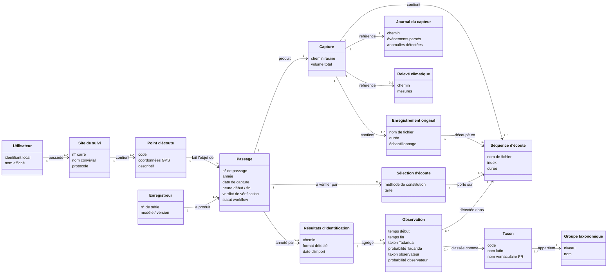

# Modèle conceptuel

Ce document pose le **vocabulaire**, le **modèle de données** et les **règles métier** sur lesquels s'aligne tout le reste du dossier d'analyse et de conception. Toute évolution du brief qui touche ces concepts doit être répercutée ici **avant** de s'attaquer aux parcours, aux stories ou aux maquettes.

> Convention de nommage : les noms d'entités, d'attributs et de statuts adoptés ici sont **les noms qui doivent apparaître dans l'IHM**. On évite à dessein le jargon technique (formats de fichiers, sigles, anglicismes) pour ne pas rendre l'application illisible aux utilisateurs cibles ([O2 - Facilité d'apprentissage](../Objectifs%20qualités/Objectifs%20qualités/O2.md), [SC1 - Onboarding](../Objectifs%20qualités/Scénario/SC1.md)).

> 🛈 **Statut** : la **structure** des entités et de leurs associations est validée. Les **attributs** détaillés (types précis, contraintes, valeurs énumérées) restent à affiner au fil des étapes suivantes (parcours, stories, maquettes) en fonction des besoins concrets qui émergeront.

---

## 1. Vue d'ensemble

L'application *VigieChiro PR Companion* organise les données autour d'un utilisateur unique (mono-utilisateur, hors-ligne). Cet utilisateur déclare un ou plusieurs **sites de suivi**, chaque site contenant un ou plusieurs **points d'écoute**. Sur chaque point, il réalise des **passages** (= une nuit complète d'enregistrement). Chaque passage produit une **capture** : les enregistrements originaux copiés depuis la SD, les séquences d'écoute (ralenties ×10 et découpées en 5 s) prêtes à être déposées sur Vigie-Chiro, ainsi que le journal du capteur et le relevé climatique de l'enregistreur utilisé.

Une fois les séquences d'écoute produites, l'utilisateur **vérifie l'enregistrement** par échantillonnage (sound check global). S'il est satisfait, il prépare le lot prêt à déposer et téléverse manuellement sur le portail Vigie-Chiro. Le retour de **Tadarida** (résultats d'identification) arrive ensuite, et le passage entre alors en **validation taxonomique** (espèce par espèce).

🔍 [Ouvrir le diagramme dans une vue plein écran](Modèle%20conceptuel%20-%20Diagramme.md){target=_blank rel=noopener} (utile pour zoomer sur les associations).

Ce diagramme reste **conceptuel** (proche d'un MCD) plutôt qu'un diagramme de classes d'implémentation : pas de visibilité (`+`/`-`), pas de méthodes, pas de types Java. C'est le **vocabulaire métier** et la **topologie des associations** qui comptent. Vous re-spécifierez les classes Java de votre implémentation séparément, en y ajoutant typage, méthodes et héritages selon vos choix d'architecture.

Le diagramme rend visible la **séparation entre deux moments du workflow** : la chaîne `Passage → Capture → Séquence d'écoute → Sélection d'écoute` (avant le dépôt VigieChiro, MUST du MVP), puis la chaîne `Résultats d'identification → Observation → Taxon` (après le retour Tadarida, SHOULD/cible étirable).

---

## 2. Cardinalités

| De | Association | Vers | Cardinalité | Sens métier |
|---|---|---|---|---|
| Utilisateur | possède | Site de suivi | 1..* | Marie en a 1, Karim 2-3, Samuel 36+ |
| Site de suivi | contient | Point d'écoute | 1..* | un site sans point n'a pas de sens |
| Point d'écoute | fait l'objet de | Passage | 0..* | un point peut n'avoir aucun passage encore |
| Enregistreur | a produit | Passage | 1..* | un même enregistreur peut faire plusieurs nuits |
| Passage | produit | Capture | 1..1 | un passage donne exactement une capture |
| Capture | contient | Enregistrement original | 1..* | typiquement plusieurs centaines à plusieurs milliers |
| Capture | contient | Séquence d'écoute | 1..* | typiquement 1,3 × le nombre d'enregistrements originaux |
| Enregistrement original | découpé en | Séquence d'écoute | 1..* | un enregistrement original donne 1 à N séquences de 5 s ralenties ×10 |
| Capture | référence | Journal du capteur | 1..1 | un seul journal par passage |
| Capture | référence | Relevé climatique | 0..1 | absent si la sonde T°/H est défaillante |
| Passage | à vérifier par | Sélection d'écoute | 0..1 | créée au moment de la vérification utilisateur |
| Sélection d'écoute | porte sur | Séquence d'écoute | 1..* | typiquement 10-30 séquences |
| Passage | annoté par | Résultats d'identification | 0..1 | rempli après retour Tadarida (SHOULD) |
| Résultats d'identification | agrège | Observation | 1..* | plusieurs milliers par fichier de résultats |
| Observation | détectée dans | Séquence d'écoute | 1..1 | chaque observation référence une séquence précise |
| Observation | classée comme | Taxon | 1..1 | au moment de l'import du fichier de résultats |
| Taxon | appartient | Groupe taxonomique | 1..1 | exemple : Pippip → Pipistrellus → Vespertilionidae |

---

## 3. Entités

### 3.1 Utilisateur

L'utilisateur unique de l'application. Mono-utilisateur, hors-ligne, pas de compte ni de mot de passe.

| Attribut | Type | Contraintes | Notes |
|---|---|---|---|
| identifiant local | UUID | unique, généré à l'install | Sert uniquement à associer les sites en base, jamais affiché |
| nom affiché | texte | optionnel, ≤ 60 car. | Cosmétique, repris dans la barre de titre |

### 3.2 Site de suivi

Un site est créé hors application sur <https://vigiechiro.herokuapp.com/>. Il fournit le numéro de **carré** et la liste des **codes points** que l'utilisateur déclare ensuite dans l'app.

| Attribut | Type | Contraintes | Notes |
|---|---|---|---|
| n° carré | texte | exactement 6 chiffres | Les 2 premiers chiffres = département. Ex. `040962` (département 04 = Alpes-de-Haute-Provence). **Leading zero obligatoire** pour les départements 1 à 9. |
| nom convivial | texte | optionnel, ≤ 100 car. | Pour aider Marie à reconnaître son site (ex. « Étang de la Tuilière »). |
| protocole | énum | `PointFixe` (seul supporté MVP) | Architecture extensible (Pédestre, Routier… plus tard). |
| commentaire libre | texte | optionnel | Contexte écologique, descriptif paysager. |
| date de création | date | obligatoire | Date locale (importante pour les anniversaires de passage). |

### 3.3 Point d'écoute

Un point dans un site, identifié par un code court fourni par Vigie-Chiro.

| Attribut | Type | Contraintes | Notes |
|---|---|---|---|
| code | texte | exactement 2 caractères : 1 lettre + 1 chiffre | Ex. `A1`, `C2`, `Z4`. |
| coordonnées GPS | décimal × 2 | optionnel | Utile pour le calcul astronomique (lever/coucher soleil) en COULD. |
| descriptif | texte | optionnel, ≤ 500 car. | « En lisière de bois, au-dessus du chemin », etc. |

### 3.4 Enregistreur

Le matériel utilisé pour la nuit (Passive Recorder). L'application en mémorise l'identité pour suivre la santé du matériel dans le temps.

| Attribut | Type | Contraintes | Notes |
|---|---|---|---|
| n° de série | texte | unique, format libre | Lu dans le journal du capteur (`LogPR<n>.txt`). Ex. `1925492`. |
| modèle / version | texte | optionnel | Ex. `V1.01, T4.1` extrait du journal du capteur. |
| commentaire libre | texte | optionnel | Anomalies récurrentes, dates de remise en état, etc. |

### 3.5 Passage

L'unité métier centrale : une nuit complète d'enregistrement sur un point d'un site, avec un enregistreur, lors d'un n° de passage donné dans une année.

| Attribut | Type | Contraintes | Notes |
|---|---|---|---|
| n° de passage | entier | typiquement 1 ou 2 | Le protocole impose deux passages annuels (cf. règle métier R3). |
| année | entier | 4 chiffres | Ex. 2026. |
| date de capture | date | obligatoire | Date du **soir** où l'enregistrement démarre. |
| heure de début | heure | obligatoire | Lue du journal du capteur. |
| heure de fin | heure | obligatoire | Lue du journal du capteur. |
| paramètres d'acquisition | structure | extraits du journal du capteur | Fe, FL, FPH, S.R., gain, bande de fréquence, durée enregistrement, seuil SD. Sérialisés tels quels. |
| statut workflow | énum | `Importé` / `Transformé` / `Vérifié` / `Prêt à déposer` / `Déposé` | Progression de la chaîne pré-VigieChiro. |
| verdict de vérification | énum | `À vérifier` / `OK` / `Douteux` / `À jeter` | Saisi par l'utilisateur après écoute de la sélection d'écoute. |
| commentaire de session | texte | optionnel, ≤ 2000 car. | Météo, intervention humaine, anomalie matérielle, etc. |
| données météo structurées | structure | optionnelles | T° début/fin nuit, couverture nuageuse, vent. À aligner sur les champs Vigie-Chiro pour faciliter le dépôt. |
| date de dépôt sur Vigie-Chiro | datetime | optionnelle | Tracée à l'export du lot. |

> **Note importante** : ce que les anciennes maquettes appelaient « session » est désormais nommé **passage** pour rester cohérent avec le vocabulaire Vigie-Chiro.

### 3.6 Capture

L'agrégat de données produit par un passage : tous les enregistrements originaux, toutes les séquences d'écoute dérivées, le journal du capteur et (si présent) le relevé climatique. Le mot « capture » désigne dans l'IHM ce que l'utilisateur a ramené du terrain pour une nuit donnée.

| Attribut | Type | Contraintes | Notes |
|---|---|---|---|
| chemin racine | texte | obligatoire | Dossier sur le disque local de l'utilisateur. |
| volume total enregistrements originaux | entier (octets) | calculé | Indicatif (peut atteindre ~40 Go pour une grosse nuit). |
| volume total séquences d'écoute | entier (octets) | calculé | Typiquement légèrement supérieur aux enregistrements originaux (×10 en durée mais re-échantillonné). |

### 3.7 Enregistrement original

Un fichier audio sortant directement de l'enregistreur, après **copie protégée** et **renommage** par l'application avec le préfixe `CarXXXXXX-AAAA-PassN-YY-`. Ces fichiers sont conservés intacts et servent de référence ultime, mais ne sont jamais écoutés directement (ils sont en ultrason donc inaudibles).

| Attribut | Type | Contraintes | Notes |
|---|---|---|---|
| nom de fichier | texte | format `Car<carre>-<annee>-<passage>-<point>-PaRecPR<sn>_<AAAAMMJJ>_<HHMMSS>.wav` | Ex. `Car640380-2026-Pass2-Z1-PaRecPR1925492_20260422_202623.wav`. |
| chemin sur disque | texte | obligatoire | Dans le sous-dossier `bruts/` de la capture. |
| durée | décimal (s) | typiquement 2-30 s | Déclenchée par seuil sur l'enregistreur. |
| échantillonnage | entier (Hz) | 384 000 | Mono 16 bits. |
| empreinte SHA-256 | hex | optionnelle | Si l'on veut garantir l'intégrité bit-à-bit dans le temps. |

### 3.8 Séquence d'écoute

Un fichier audio dérivé d'un enregistrement original par **expansion de temps ×10** suivie d'un **découpage régulier en séquences de 5 s**. C'est ce fichier qui est **audible par l'oreille humaine** (les ultrasons étant ramenés dans la bande audible) et c'est ce que l'utilisateur écoute dans l'application. C'est également ce fichier qui est déposé sur Vigie-Chiro et que Tadarida analysera.

| Attribut | Type | Contraintes | Notes |
|---|---|---|---|
| nom de fichier | texte | suffixe `_000`, `_001`… ajouté au nom de l'enregistrement original | Ex. `Car…_20260422_202623_000.wav`. |
| enregistrement original source | référence | obligatoire | Pour la traçabilité. |
| index dans le source | entier | ≥ 0 | Ordre de la séquence dans l'enregistrement original. |
| offset temporel dans le source | décimal (s) | calculé | Position de la séquence dans l'enregistrement original (avant ×10). |
| durée | décimal (s) | typiquement 5 s | La dernière séquence d'un enregistrement peut être plus courte. |
| chemin sur disque | texte | obligatoire | Dans le sous-dossier `transformes/` de la capture. |
| inclus dans la sélection d'écoute | booléen | par défaut `false` | Mis à `true` si la séquence est sélectionnée pour la vérification d'enregistrement. |

### 3.9 Journal du capteur

Le journal technique de l'enregistreur pour la nuit, lu et structuré par l'application. Stocké physiquement sous le nom de fichier `LogPR<n>.txt` que produit le firmware Teensy.

| Attribut | Type | Contraintes | Notes |
|---|---|---|---|
| chemin sur disque | texte | obligatoire | Fichier `LogPR<n>.txt` à la racine de la capture. |
| évènements parsés | liste | structurée | Démarrage, paramètres, batterie, mises en veille, alarmes, anomalies. |
| anomalies détectées | liste | dérivée | Réveils non programmés, erreurs SD, redémarrages, batterie critique. |

> **À noter** : ce journal est circulaire (place limitée sur l'enregistreur), il efface de l'information au fur et à mesure quand la SD sature. L'ordre exact d'éviction reste à confirmer auprès du concepteur du firmware.

### 3.10 Relevé climatique

Le journal de température et d'hygrométrie produit par la sonde embarquée de l'enregistreur. Optionnel : la sonde peut être absente ou défaillante. Stocké physiquement sous le nom de fichier `*_THLog.csv` que produit le firmware Teensy.

| Attribut | Type | Contraintes | Notes |
|---|---|---|---|
| chemin sur disque | texte | obligatoire si présent | Fichier `PaRec<sn>_THLog.csv`. |
| mesures | série temporelle | une mesure toutes les 600 s (10 min) | Date, heure, température (°C), humidité (%). |

### 3.11 Sélection d'écoute

Sous-ensemble de séquences d'écoute sélectionné pour permettre à l'utilisateur de **vérifier que l'enregistrement de la nuit est exploitable** (sound check global). Créée au moment où l'utilisateur ouvre la vue de vérification.

| Attribut | Type | Contraintes | Notes |
|---|---|---|---|
| méthode de constitution | énum | `RéparTemporel` (par défaut) / `Aléatoire` / `Manuel` | RéparTemporel = N séquences réparties uniformément sur la nuit. |
| taille | entier | par défaut 10-30 séquences | Configurable. |
| séquences rattachées | référence × N | obligatoire | Ordonnées par horodatage de l'enregistrement original source. |
| séquences écoutées | référence × M | dérivé | Mis à jour à chaque play de l'utilisateur. |

### 3.12 Résultats d'identification (post-Tadarida)

Le fichier produit par Tadarida côté serveur Vigie-Chiro et téléchargé manuellement par l'utilisateur après le dépôt. Importé dans l'application pour la **validation taxonomique** (SHOULD / cible étirable). Stocké physiquement sous le nom de fichier `<uuid>-participation-<uuid>-observations.csv`.

| Attribut | Type | Contraintes | Notes |
|---|---|---|---|
| chemin sur disque | texte | obligatoire | Fichier `*-observations.csv` ou `*-observations_Vu.csv`. |
| format détecté | énum | `Brut` (avec guillemets) / `Vu` (réinjectable, sans guillemets) | Reconnu à l'import. |
| date d'import | datetime | obligatoire | Tracée pour la cohérence. |

### 3.13 Observation

Une ligne du fichier de résultats. Une **séquence d'écoute peut générer plusieurs observations** : Tadarida produit 1 ligne par espèce distincte identifiée dans la séquence, avec son timing début/fin précis dans la séquence.

| Attribut | Type | Contraintes | Notes |
|---|---|---|---|
| séquence d'écoute source | référence | obligatoire | Lien vers la `Séquence d'écoute` correspondante. |
| temps début | décimal (s) | dans `[0, 5]` | Position dans la séquence. |
| temps fin | décimal (s) | dans `[0, 5]`, ≥ temps début | Position dans la séquence. |
| fréquence médiane | entier (Hz) | obligatoire | Métrique Tadarida. |
| taxon Tadarida | référence | obligatoire | Code 6 lettres (source : Tadarida). |
| probabilité Tadarida | décimal | dans `[0, 1]` | **Pas une garantie** : un 99 % peut être faux, un 20 % peut être juste. |
| taxon autre Tadarida | référence | optionnel | 2e proposition Tadarida. |
| taxon observateur | référence | optionnel | Saisi par l'utilisateur en validation. |
| probabilité observateur | décimal | dans `[0, 1]`, optionnel | Niveau de confiance utilisateur. |
| commentaire utilisateur | texte | optionnel, ≤ 500 car. | « pic 39 kHz, morphologie atypique », etc. |
| marqué comme référence | booléen | par défaut `false` | Sélection bonus pour la bibliothèque de sons exportable (COULD). |

### 3.14 Taxon

Un code 6 lettres (3 + 3 : trois premières lettres du genre + trois premières lettres de l'espèce) selon la nomenclature Tadarida.

| Attribut | Type | Contraintes | Notes |
|---|---|---|---|
| code | texte | exactement 6 caractères | Ex. `Pippip`, `Nyclei`, `Tadten`. Aussi : `noise`, `piaf` (pseudo-taxons). |
| nom latin | texte | optionnel | Ex. `Pipistrellus pipistrellus`. |
| nom vernaculaire FR | texte | optionnel | Ex. `Pipistrelle commune`. |
| groupe taxonomique | référence | obligatoire | Voir 3.15. |

### 3.15 Groupe taxonomique

Niveau hiérarchique au-dessus du taxon, utile pour les filtres groupés (« tous les murins », « toutes les pipistrelles »).

| Attribut | Type | Contraintes | Notes |
|---|---|---|---|
| niveau | énum | `Genre` / `Famille` / `Ordre` | Plusieurs niveaux possibles, on en choisit un par groupe. |
| nom | texte | obligatoire | Ex. `Myotis`, `Pipistrellus`, `Vespertilionidae`, `Chiroptera`. |
| taxons membres | référence × N | dérivée | Mise à jour à chaque ajout de taxon. |

---

## 4. Règles métier

### 4.1 Site, point, passage

- **R1**{ #r1 } : un n° de carré est obligatoirement composé de **6 chiffres**, dont les 2 premiers correspondent au numéro de département (avec leading zero pour les départements 1 à 9).
- **R2**{ #r2 } : un code de point est exactement de la forme **lettre + chiffre** (ex. `A1`, `Z4`). Validation à la saisie.
- **R3**{ #r3 } : sur le **protocole Point Fixe**, deux passages sont attendus par site et par année :
    - **passage 1** : entre le 15 juin et le 31 juillet,
    - **passage 2** : entre le 15 août et le 31 septembre.
    L'application **alerte sans bloquer** si l'utilisateur déclare un passage hors fenêtre.
- **R4**{ #r4 } : intervalle conseillé entre les deux passages d'un même site : **≥ 1 mois**. Idéalement, dates « anniversaires » (±10 j) d'une année à l'autre.
- **R5**{ #r5 } : le triplet `(Site, Point, Année, n° de passage)` est **unique** : un même point ne peut pas avoir deux passages avec le même n° dans la même année.

### 4.2 Convention de nommage des fichiers

- **R6**{ #r6 } : tout enregistrement original doit être renommé selon le préfixe `CarXXXXXX-AAAA-PassN-YY-` avant tout dépôt. Les **tirets sont des « tirets du 6 »** (`-`, U+002D HYPHEN-MINUS), pas des cadratins ni des demi-cadratins. À n'oublier sous aucun.
- **R7**{ #r7 } : le suffixe original de l'enregistreur (`PaRecPR<sn>_<AAAAMMJJ>_<HHMMSS>.wav`) est **conservé tel quel** après le préfixe.
- **R8**{ #r8 } : toute séquence d'écoute reprend le nom de son enregistrement original source en **insérant un suffixe `_000`, `_001`, …** entre le nom de base et l'extension.

### 4.3 Copie protégée

- **R9**{ #r9 } : à l'import, l'application **copie systématiquement** les fichiers depuis la carte SD vers son espace de travail. **Aucune écriture sur les originaux** sur la SD. C'est une contrainte explicite du protocole Vigie-Chiro pour éviter toute perte de données.

### 4.4 Transformation

- **R10**{ #r10 } : la transformation d'un enregistrement original produit des **séquences d'écoute de 5 s ralenties ×10** (expansion de temps). Pour un enregistrement original de durée `D`, on obtient `ceil(D × 10 / 5) = ceil(2 × D)` séquences. La dernière séquence peut être plus courte que 5 s.
- **R11**{ #r11 } : la transformation est **deterministe** : relancer la transformation sur les mêmes enregistrements originaux produit les mêmes séquences d'écoute au bit près.

### 4.5 Vérification d'enregistrement

- **R12**{ #r12 } : une sélection d'écoute est constituée automatiquement à l'ouverture de la vue, avec la méthode `RéparTemporel` par défaut (séquences réparties uniformément sur la nuit).
- **R13**{ #r13 } : le verdict global est saisi par l'utilisateur après écoute de **tout ou partie** de la sélection. Aucun seuil obligatoire d'écoute (l'utilisateur reste responsable).
- **R14**{ #r14 } : un passage avec verdict `À jeter` ne peut pas être inclus dans un lot prêt à déposer (alerte bloquante).

### 4.6 Validation taxonomique (SHOULD)

- **R15**{ #r15 } : une observation est qualifiée de **validée** quand `taxon observateur = taxon Tadarida` et `probabilité observateur` renseignée.
- **R16**{ #r16 } : une observation est qualifiée de **corrigée** quand `taxon observateur ≠ taxon Tadarida`.
- **R17**{ #r17 } : une observation **non touchée** par l'utilisateur conserve uniquement les colonnes `tadarida_*`, et l'export `_Vu.csv` reprend ces valeurs (l'utilisateur conserve ainsi la classification automatique par défaut).
- **R18**{ #r18 } : deux **modes de validation** coexistent (au choix de l'utilisateur) :
    - **Mode inventaire** : dès qu'une espèce est validée avec confiance sur une nuit, on ne valide plus les autres détections de la même espèce sur la même nuit.
    - **Mode activité** : toutes les observations doivent être passées en revue (utile pour les études d'activité quantitative).

### 4.7 Données

- **R19**{ #r19 } : le journal du capteur est un **journal circulaire** sur l'enregistreur (place limitée). En cas de saturation de la SD, des entrées plus anciennes peuvent être effacées. L'application n'a pas à reconstituer les pertes - elle exploite ce qui est présent.
- **R20**{ #r20 } : le relevé climatique peut être **absent** (sonde défaillante ou non installée). Dans ce cas, l'onglet diagnostic du passage le signale clairement plutôt que de masquer la section.

---

## 5. Glossaire métier

| Terme | Définition courte | Exemple / précision |
|---|---|---|
| **Site de suivi** | Unité géographique déclarée par l'utilisateur sur Vigie-Chiro web. Donne accès à un n° de carré et à un ensemble de points. | « Étang de la Tuilière », carré `040962`, points `A1`, `B2`, `C3`. |
| **Carré** | Code à 6 chiffres identifiant un site Vigie-Chiro. Les 2 premiers chiffres = département. | `040962` (carré 0962 du département 04). |
| **Point** | Code à 2 caractères (lettre + chiffre) identifiant un point d'écoute dans un site. | `A1`, `C2`, `Z4`. |
| **Passage** | Une nuit complète d'enregistrement sur un point d'un site, lors d'un n° de passage donné dans une année. | « Passage 2 du carré `640380` au point `Z1` en 2026 ». Anciennement appelé « session » dans les maquettes V1. |
| **Enregistreur** | Le matériel utilisé sur le terrain (Passive Recorder Teensy). Chaque enregistreur a un n° de série propre. | Enregistreur n° 1925492. |
| **Capture** | L'agrégat de données produit par un passage : enregistrements originaux, séquences d'écoute, journal du capteur, relevé climatique. | « La capture du 22/04/2026 sur le point Z1 ». |
| **Enregistrement original** | Fichier audio mono 16 bits 384 kHz produit par l'enregistreur, après copie protégée et renommage avec le préfixe `Car…-AAAA-PassN-YY-`. **Inaudible** sans transformation (signal ultrason). | `Car640380-2026-Pass2-Z1-PaRecPR1925492_20260422_202623.wav`. |
| **Séquence d'écoute** | Fichier audio dérivé d'un enregistrement original, ralenti ×10 et découpé en séquence de 5 s. **Audible** par l'oreille humaine. C'est ce qui est déposé sur Vigie-Chiro et écouté dans l'application. | `Car…_20260422_202623_000.wav`, `…_001.wav`, etc. |
| **Vérification d'enregistrement** | Sound check global permettant à l'utilisateur de confirmer que la nuit est exploitable, avant le dépôt. Distinct de la validation taxonomique. | Marie écoute 15 séquences d'écoute réparties sur la nuit, ne détecte rien d'anormal, marque le passage `OK`. |
| **Verdict** | Statut métier d'un passage après vérification : `À vérifier`, `OK`, `Douteux`, `À jeter`. | Un passage `À jeter` ne peut pas être déposé. |
| **Sélection d'écoute** | Sous-ensemble de séquences d'écoute sélectionné automatiquement pour la vérification (méthode `RéparTemporel` par défaut). | 20 séquences prises uniformément entre l'heure de début et l'heure de fin de la nuit. |
| **Lot prêt à déposer** | Dossier contenant toutes les séquences d'écoute d'une capture, formaté selon les attentes du portail Vigie-Chiro. | Sous-dossier `transformes/` de la capture, à téléverser tel quel sur vigiechiro.herokuapp.com. |
| **Préfixe** | Chaîne `CarXXXXXX-AAAA-PassN-YY-` ajoutée en début de nom de fichier lors du renommage. | `Car640380-2026-Pass2-Z1-`. |
| **Tirets du 6** | Caractère `-` (U+002D HYPHEN-MINUS), à utiliser obligatoirement dans le préfixe (ni cadratin `—` ni demi-cadratin `–`). | Validation à la saisie. |
| **Expansion de temps** | Ralentissement temporel d'un facteur ×10, qui transpose les ultrasons (8-120 kHz) dans la bande audible (0,8-12 kHz) tout en allongeant leur durée. | 1 seconde d'enregistrement original devient 10 secondes de séquence d'écoute. |
| **Validation taxonomique** | Activité postérieure au retour Tadarida : revue espèce par espèce des observations classifiées, validation ou correction. | SHOULD du MVP. Cible étirable. |
| **Mode inventaire** | Variante de validation : on cherche la liste des espèces présentes, donc on arrête de valider une espèce une fois confirmée sur la nuit. | Karim sur un suivi rapide. |
| **Mode activité** | Variante de validation : on quantifie toutes les détections, donc toutes les observations doivent être passées en revue. | Samuel sur son protocole BACIP. |
| **Groupe taxonomique** | Niveau hiérarchique au-dessus du taxon (genre, famille, ordre) servant de filtre groupé. | `Myotis`, `Pipistrellus`, `Vespertilionidae`. |

---

## 6. Glossaire des outils & ressources externes

| Outil / ressource | Rôle | Statut dans le MVP |
|---|---|---|
| [Lupas Rename](https://www.lupinho.net/lupas-rename.html) | Outil tiers de renommage en lot, utilisé manuellement aujourd'hui pour appliquer le préfixe `Car…-AAAA-PassN-YY-` aux enregistrements originaux. | **À remplacer par l'app** (chaîne d'import). |
| [Kaléidoscope 4.3.1](https://www.wildlifeacoustics.com/products/kaleidoscope-pro) | Logiciel commercial Wildlife Acoustics, utilisé manuellement aujourd'hui pour produire les séquences d'écoute (découpage 5 s + expansion temps ×10). | **À remplacer par l'app** (chaîne d'import). |
| Tadarida (Bas et al., 2017) | Logiciel scientifique de classification automatique des taxons à partir des séquences d'écoute. Tourne **côté serveur Vigie-Chiro**. | Hors MVP côté code. **L'app produit ce que Tadarida attend** et **consomme ce que Tadarida restitue** (résultats d'identification). |
| [Chirosurf 4.1](https://vigie-chiro.forumactif.com/t108-chirosurf-4-1-telechargement-audible-ultrasons-basses-frequences-11-05-26) | Logiciel communautaire de validation taxonomique. | Référence d'**inspiration ergonomique** pour la validation taxonomique (SHOULD / cible étirable). |
| [vigiechiro.herokuapp.com](https://vigiechiro.herokuapp.com/) | Portail web officiel Vigie-Chiro. Création des sites de suivi, dépôt des séquences d'écoute, restitution des résultats d'identification. | Hors MVP côté API : tous les échanges restent **manuels via navigateur**. L'app prépare des dossiers prêts à déposer. |
| [vigienature.fr](https://www.vigienature.fr/fr/le-protocole-en-detail) | Documentation officielle du protocole Point Fixe. | Référence de cadrage pour toutes les règles métier ci-dessus. |
| [PiBatRecorderProjects/TeensyRecorders](https://framagit.org/PiBatRecorderProjects/TeensyRecorders) | Projet open-source du firmware de l'enregistreur Teensy. | Référence technique pour comprendre le format du journal du capteur et des enregistrements originaux. Hors MVP côté code. |
