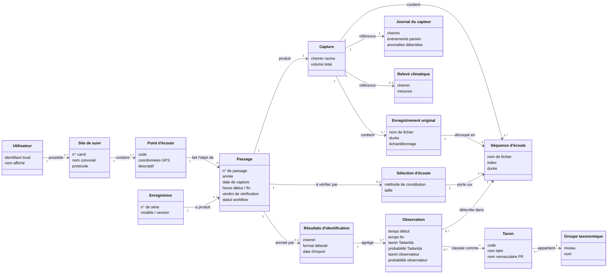

---
hide:
  - navigation
  - toc
---

# Diagramme de classes - vue plein écran

[← Retour au modèle conceptuel](index.md)

```mermaid
classDiagram
    direction LR

    class Utilisateur {
      identifiant local
      nom affiché
    }
    class SiteDeSuivi["Site de suivi"] {
      n° carré
      nom convivial
      protocole
    }
    class PointDEcoute["Point d'écoute"] {
      code
      coordonnées GPS
      descriptif
    }
    class Enregistreur {
      n° de série
      modèle / version
    }
    class Passage {
      n° de passage
      année
      date de capture
      heure début / fin
      verdict de vérification
      statut workflow
    }
    class Capture {
      chemin racine
      volume total
    }
    class EnregistrementOriginal["Enregistrement original"] {
      nom de fichier
      durée
      échantillonnage
    }
    class SequenceDEcoute["Séquence d'écoute"] {
      nom de fichier
      index
      durée
    }
    class JournalDuCapteur["Journal du capteur"] {
      chemin
      évènements parsés
      anomalies détectées
    }
    class ReleveClimatique["Relevé climatique"] {
      chemin
      mesures
    }
    class SelectionDEcoute["Sélection d'écoute"] {
      méthode de constitution
      taille
    }
    class ResultatsIdentification["Résultats d'identification"] {
      chemin
      format détecté
      date d'import
    }
    class Observation {
      temps début
      temps fin
      taxon Tadarida
      probabilité Tadarida
      taxon observateur
      probabilité observateur
    }
    class Taxon {
      code
      nom latin
      nom vernaculaire FR
    }
    class GroupeTaxonomique["Groupe taxonomique"] {
      niveau
      nom
    }

    Utilisateur "1" --> "1..*" SiteDeSuivi : possède
    SiteDeSuivi "1" --> "1..*" PointDEcoute : contient
    PointDEcoute "1" --> "0..*" Passage : fait l'objet de
    Enregistreur "1" --> "1..*" Passage : a produit
    Passage "1" --> "1" Capture : produit
    Capture "1" --> "1..*" EnregistrementOriginal : contient
    Capture "1" --> "1..*" SequenceDEcoute : contient
    Capture "1" --> "1" JournalDuCapteur : référence
    Capture "1" --> "0..1" ReleveClimatique : référence
    EnregistrementOriginal "1" --> "1..*" SequenceDEcoute : découpé en
    Passage "1" --> "0..1" SelectionDEcoute : à vérifier par
    SelectionDEcoute "1" --> "1..*" SequenceDEcoute : porte sur
    Passage "1" --> "0..1" ResultatsIdentification : annoté par
    ResultatsIdentification "1" --> "1..*" Observation : agrège
    Observation "0..*" --> "1" SequenceDEcoute : détectée dans
    Observation "0..*" --> "1" Taxon : classée comme
    Taxon "1..*" --> "1" GroupeTaxonomique : appartient
```

[← Retour au modèle conceptuel](index.md)
