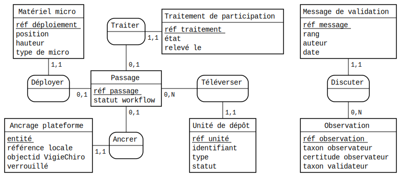

# Modèle conceptuel

Ce document pose le **vocabulaire**, le **modèle de données** et les **règles métier** sur lesquels s'aligne tout le reste du dossier d'analyse et de conception. Toute évolution du brief qui touche ces concepts doit être répercutée ici **avant** de s'attaquer aux parcours, aux stories ou aux maquettes.

> Convention de nommage : les noms d'entités, d'attributs et de statuts adoptés ici sont **les noms qui doivent apparaître dans l'IHM**. On évite à dessein le jargon technique (formats de fichiers, sigles, anglicismes) pour ne pas rendre l'application illisible aux utilisateurs cibles ([O2 - Facilité d'apprentissage](../../Objectifs%20qualités/Objectifs%20qualités/O2.md), [SC1 - Onboarding](../../Objectifs%20qualités/Scénario/SC1.md)).

> 🛈 **Statut** : la **structure** des entités métier est stabilisée. Le schéma physique a depuis gagné des tables d'**intégration plateforme** (ancrage, dépôt reprenable, traitement, discussion avec le validateur), listées en fin de sommaire et rattachées aux fiches par leurs *voisins*.

## Vue d'ensemble

L'application *VigieChiro Companion* organise les données autour d'un utilisateur unique (mono-utilisateur, hors-ligne). Cet utilisateur déclare un ou plusieurs **sites de suivi**, chaque site contenant un ou plusieurs **points d'écoute**. Sur chaque point, il réalise des **passages** (= une nuit complète d'enregistrement). Chaque passage produit une **session d'enregistrement** : les enregistrements originaux copiés depuis la SD, les séquences d'écoute (découpées en tranches de 5 s réelles, puis ralenties ×10) prêtes à être déposées sur Vigie-Chiro, ainsi que le journal du capteur et le relevé climatique de l'enregistreur utilisé.

Une fois les séquences d'écoute produites, l'utilisateur **vérifie l'enregistrement** par échantillonnage (sound check global). S'il est satisfait, il prépare le dépôt et **téléverse directement sur Vigie-Chiro depuis l'application** (repli navigateur possible). Le retour de **Tadarida** (résultats d'identification) arrive ensuite, et le passage entre alors en **validation taxonomique** (espèce par espèce).

<figure markdown="span">
  { width="100%" }
  <figcaption>MCD (méthode Merise) : entités à identifiant souligné, associations porteuses d'un verbe, cardinalités (min,max). Source <a href="../../assets/diagrammes/modele-conceptuel.mcd"><code>modele-conceptuel.mcd</code></a>, rendu avec <a href="https://www.mocodo.net/">Mocodo</a>.</figcaption>
</figure>

[🖼️ Ouvrir le diagramme dans une vue plein écran ↗](Diagramme%20-%20plein%20écran.md){ .md-button }

Ce diagramme est un **MCD** (modèle conceptuel de données, méthode **Merise**) : il fixe le **vocabulaire métier** et la **topologie des associations**, sans préjuger de l'implémentation. Les clés étrangères n'y figurent pas : elles sont *portées par les associations*, et les cardinalités se lisent en **(minimum, maximum)** sur chaque patte. Vous re-spécifierez les classes Java de votre implémentation séparément (typage, méthodes, héritages selon vos choix d'architecture), et sa traduction relationnelle ajoutera les clés primaires et étrangères.

Le diagramme rend visible la **séparation entre deux moments du cycle** : la chaîne `Passage → Session d'enregistrement → Séquence d'écoute → Sélection d'écoute` (avant le dépôt VigieChiro, MUST du MVP), puis la chaîne `Résultats d'identification → Observation → Taxon` (après le retour Tadarida), **livrée**, avec la validation par l'observateur, l'avis du validateur MNHN et l'ancrage plateforme.

## Sommaire des fiches

Le modèle conceptuel est éclaté en plusieurs fiches pour rester lisible. Chaque fiche est accessible depuis la barre latérale ; les liens ci-dessous servent de table des matières.

### Entités

| # | Entité | Rôle métier |
|---|---|---|
| C1 | [Utilisateur](C1%20-%20Utilisateur.md) | L'unique utilisateur de l'app (mono-poste, connecté à Vigie-Chiro par jeton). |
| C2 | [Site de suivi](C2%20-%20Site%20de%20suivi.md) | Unité géographique déclarée sur Vigie-Chiro web. |
| C3 | [Point d'écoute](C3%20-%20Point%20d%27écoute.md) | Code 2 caractères dans un site. |
| C4 | [Enregistreur](C4%20-%20Enregistreur.md) | Matériel terrain (Passive Recorder Teensy). |
| C4bis | [Micro](C4bis%20-%20Micro.md) | Micro monté sur le PR (plusieurs modèles aux caractéristiques différentes). |
| C5 | [Passage](C5%20-%20Passage.md) | Une nuit complète sur un point. **Entité centrale**. |
| C6 | [Session d'enregistrement](C6%20-%20Session%20d%27enregistrement.md) | Agrégat de données produit par un passage. |
| C7 | [Enregistrement original](C7%20-%20Enregistrement%20original.md) | Fichier audio brut, ultrason, inaudible. |
| C8 | [Séquence d'écoute](C8%20-%20Séquence%20d%27écoute.md) | Fichier audible déposé sur Vigie-Chiro : 5 s réelles ralenties ×10 (50 s à l'écoute). |
| C9 | [Journal du capteur](C9%20-%20Journal%20du%20capteur.md) | `LogPR<n>.txt` du firmware Teensy. |
| C10 | [Relevé climatique](C10%20-%20Relevé%20climatique.md) | `*_THLog.csv` (optionnel). |
| C11 | [Sélection d'écoute](C11%20-%20Sélection%20d%27écoute.md) | Sous-ensemble de séquences pour la vérification. |
| C12 | [Résultats d'identification](C12%20-%20Résultats%20d%27identification.md) | Résultats Tadarida (post-dépôt), importés par l'API ou par CSV. |
| C13 | [Observation](C13%20-%20Observation.md) | Une ligne de résultats Tadarida. |
| C14 | [Taxon](C14%20-%20Taxon.md) | Code 6 lettres (genre + espèce). |
| C15 | [Groupe taxonomique](C15%20-%20Groupe%20taxonomique.md) | Niveau hiérarchique au-dessus du taxon. |

### Tables du schéma non modélisées comme entités

Le diagramme ci-dessus est **conceptuel** : il ne porte que les entités métier. Le schéma physique (migrations `V01` → `V30`) contient en plus des tables **d'intégration plateforme** et **techniques**, décrites dans les *voisins* des fiches concernées :

| Table | Rôle | Où elle apparaît |
|---|---|---|
| `vigiechiro_link` | correspondance objet local ↔ `_id` plateforme (`site` / `taxon` / `passage`) + verrou du site | voisins de [C2](C2%20-%20Site%20de%20suivi.md), [C5](C5%20-%20Passage.md) |
| `passage_equipment` | matériel micro **du déploiement d'une nuit** (1:1 passage) | voisin de [C5](C5%20-%20Passage.md) |
| `depot_unite`, `depot_plan` | dépôt **reprenable**, unité par unité, + empreinte de la liste source | voisins de [C5](C5%20-%20Passage.md) |
| `participation_traitement` | **état relevé** du calcul Tadarida serveur (cache d'observation) | voisin de [C5](C5%20-%20Passage.md) |
| `observation_message` | **fil de discussion** avec le validateur MNHN | voisin de [C13](C13%20-%20Observation.md) |
| `saved_filter_view`, `column_layout`, `app_setting` | **tables techniques** : vues de filtres, disposition des colonnes, réglages | persistance d'IHM et de préférences, hors modèle métier |
| `saved_view` | **table morte** : créée en `V01`, remplacée par `saved_filter_view` (`V11`), plus référencée par le code | à retirer |

Les tables **métier** d'intégration se lisent dans ce **diagramme complémentaire**, centré sur le [Passage](C5%20-%20Passage.md) et l'[Observation](C13%20-%20Observation.md) :

<figure markdown="span">
  { width="100%" }
  <figcaption>Entités d'intégration plateforme, greffées sur le Passage et l'Observation du MCD principal. L'<strong>ancrage plateforme</strong> (<code>vigiechiro_link</code>) est polymorphe : il relie de la même façon un site, un taxon ou un passage à son <code>_id</code> distant. Source <a href="../../assets/diagrammes/modele-integration-plateforme.mcd"><code>modele-integration-plateforme.mcd</code></a>, rendu avec <a href="https://www.mocodo.net/">Mocodo</a>.</figcaption>
</figure>

### Autres fiches

- [Cardinalités](Cardinalités.md) - tableau récapitulatif des cardinalités d'association.
- [Règles métier](Règles%20métier.md) - les règles **R1** à **R32** (validations, conventions, cycle de vie).
- [Glossaire métier](Glossaire%20métier.md) - vocabulaire utilisateur (site, carré, passage, session d'enregistrement, séquence d'écoute, verdict…).
- [Glossaire des outils & ressources externes](Glossaire%20outils.md) - Lupas Rename, Kaléidoscope, Tadarida, Chirosurf, vigiechiro.herokuapp.com, etc.
