# P0 - Première nuit de Marie ⭐

[← Retour au sommaire des parcours](index.md) · **Section A - Fil rouge**

> **Persona** : Marie. **Préconditions** : enregistreur reçu, site choisi, première nuit d'enregistrement effectuée.

!!! info "Le fil rouge en une page"
    Ce parcours raconte l'usage cible **vu par Marie**, persona débutante mono-site. Il donne en une page la chaîne complète de bout-en-bout. Chaque étape pointe vers le parcours détaillé `Pn` correspondant pour les règles métier précises.

[🖼️ Voir le diagramme en plein écran ↗](P0%20-%20plein%20écran.md){ .md-button }

```mermaid
%%{init: {"themeCSS": ".nodeLabel, .nodeLabel p, .nodeLabel span { color: #fff !important; fill: #fff !important; }"}}%%
flowchart LR
    subgraph init[ ]
        direction TB
        Marie(["👩‍🔬 Marie"])
        S1["🌐 <b>Étape 1</b><br/>Déclarer le site"]
        Marie --> S1
    end

    subgraph terrain[🦇 Sur le terrain]
        direction TB
        S2["<b>Étape 2</b><br/>Programmer le PR<br/>déployer · récupérer"]
        SD[("💾 Carte SD<br/>pleine")]
        S2 --> SD
    end

    subgraph app[💻 Dans l'application]
        direction TB
        S3["📥 <b>Étape 3</b><br/>Importer<br/>la nuit"]
        S4["🎧 <b>Étape 4</b><br/>Vérifier<br/>l'enregistrement"]
        S5["📦 <b>Étape 5</b><br/>Préparer<br/>le dépôt"]
        S3 --> S4 --> S5
    end

    subgraph livraison[📤 Dépôt manuel]
        direction TB
        Lot[("📦 Dépôt")]
        VC(["🌐 vigiechiro<br/>.herokuapp.com"])
        Lot -.téléversement<br/>navigateur.-> VC
    end

    S1 --> S2
    SD --> S3
    S5 --> Lot

    classDef step fill:#1e8449,stroke:#0e5128,color:#fff,stroke-width:2px
    classDef offapp fill:#935116,stroke:#5b3009,color:#fff,stroke-width:2px
    classDef artifact fill:#7d6608,stroke:#4d3f00,color:#fff,stroke-width:2px
    classDef ext fill:#34495e,stroke:#17202a,color:#fff,stroke-width:2px
    classDef actor fill:#2874a6,stroke:#154360,color:#fff,stroke-width:2px
    class S1,S3,S4,S5 step
    class S2 offapp
    class SD,Lot artifact
    class VC ext
    class Marie actor
```

Marie a participé à un atelier d'initiation Vigie-Chiro le mois dernier, fabriquée son enregistreur passif (PR) il y a deux semaines, et choisi un carré de suivi sur la plateforme Vigie-Chiro (un point d'eau au sud d'Aix-en-Provence). Ce soir, elle a réalisé sa première nuit d'enregistrement sur son point `A1`. Au matin, elle récupère la carte SD et démarre l'application pour la première fois.

## Étape 1 - Déclarer le site

Marie note son n° de carré (6 chiffres, leading zero si département 1-9) et le code de son point (lettre + chiffre, ex. `A1`). Elle ouvre l'application, clique sur « Ajouter mon premier site » et remplit le formulaire.

→ **Détail complet** : [P1 - Déclarer un site de suivi](P1%20-%20Déclarer%20un%20site%20de%20suivi.md).

## Étape 2 - Préparer la nuit (hors application)

Marie programme l'enregistreur via les boutons physiques (allumage 30 min avant le coucher du soleil, extinction 30 min après le lever). Elle déploie l'enregistreur sur le terrain, récupère la SD au matin.

→ **Hors périmètre application** - étape rappelée pour situer le contexte du parcours global.

## Étape 3 - Importer la nuit

Marie branche la SD sur son ordinateur, clique sur « Importer une nuit », choisit son site et son point. L'application copie les fichiers (sans toucher à la SD), les renomme avec le préfixe `CarXXXXXX-AAAA-PassN-YY-`, puis les transforme automatiquement en séquences d'écoute de 5 s ralenties ×10.

→ **Détail complet** : [P2 - Importer une nuit d'enregistrement](P2%20-%20Importer%20une%20nuit%20d%27enregistrement.md).

## Étape 4 - Vérifier l'enregistrement

L'application affiche d'abord un **pré-check synthétique** (trois feux 🟢/🟠/🔴 : couverture horaire vs plage astronomique, nombre de fichiers, cohérence du renommage) - c'est la vérification minimale, suffisante pour Samuel qui passe directement au dépôt. Marie complète par un **sound check par écoute** sur une sélection automatique de 10 à 30 séquences réparties sur la nuit, pour confirmer qu'aucun défaut acoustique global (saturation, parasite continu, micro HS) ne s'est produit. Elle saisit ensuite son **verdict global** : `OK`, `Utilisable`, ou `Inexploitable`.

→ **Détail complet** : [P3 - Vérifier l'enregistrement par échantillonnage](P3%20-%20Vérifier%20l%27enregistrement%20par%20échantillonnage.md).

## Étape 5 - Préparer le dépôt pour Vigie-Chiro

Marie clique sur « Vérifier et préparer le dépôt ». L'application vérifie la cohérence du passage (préfixes, complétude des fichiers) et lui ouvre le dossier prêt à déposer dans son explorateur. Elle téléverse manuellement les fichiers sur <https://vigiechiro.herokuapp.com/> via son navigateur, puis revient dans l'application pour cliquer « J'ai déposé ».

→ **Détail complet** : [P4 - Préparer le dépôt](P4%20-%20Préparer%20un%20lot%20prêt%20à%20déposer.md).

## Critères de réussite globaux

- Le passage apparaît dans la base avec le statut `Déposé`.
- Le préfixe `CarXXXXXX-AAAA-PassN-YY-` est correct sur tous les fichiers (R6, R7, R8).
- Les fichiers originaux de la SD n'ont pas été modifiés (R9).
- La durée totale entre l'insertion de la SD et le clic « J'ai déposé » reste **acceptable pour une nuit standard de quelques Go** (cf. [O3](../../Objectifs%20qualités/Objectifs%20qualités/O3.md)).
- Marie n'a jamais eu à manipuler manuellement le préfixe ni à passer par un outil externe (LupasRename, Kaléidoscope) - l'application a remplacé entièrement la chaîne d'outils manuels.

## Et après ?

24-48 h après le dépôt, Marie recevra un fichier de résultats Tadarida sur le portail Vigie-Chiro. La validation de ces résultats est documentée comme **cible étirable** - voir [P7 - Valider les résultats Tadarida](P7%20-%20Valider%20les%20résultats%20Tadarida.md).

## Enrichissements prévus

> Ces évolutions sont **décidées et maquettées, pas encore livrées**. Elles prolongent ce parcours sans en modifier les étapes actuelles.

- **La nuit de Marie gagne une conclusion.** Le fil rouge s'arrête aujourd'hui au dépôt, puis renvoie à la validation. Il lui manque la réponse à la question que Marie se pose vraiment une fois ses résultats revenus : *et alors, qu'est-ce que ma nuit contient ?* La [synthèse de la nuit](../Maquettes/M-Synthese.md) et la [courbe d'activité](../Maquettes/M-Activite.md) ferment cette boucle (#2351, #2352).
