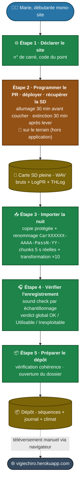

---
hide:
  - navigation
  - toc
---

# P0 - Première nuit de Marie - vue plein écran

[← Retour à la fiche P0](P0%20-%20Première%20nuit%20de%20Marie.md)

## Légende

| Couleur | Signification |
|---|---|
| 🟦 Bleu | Actrice (Marie) |
| 🟩 Vert | Étape réalisée **dans l'application** |
| 🟫 Marron | Étape réalisée **hors application** (terrain) |
| 🟨 Crème (cylindre) | Artefact produit ou consommé (carte SD, dépôt) |
| ⬛ Gris foncé | Système externe (portail Vigie-Chiro) |

## Lecture du parcours

1. **Marie** déclare son site dans l'application (étape 1).
2. Elle se rend **sur le terrain** : programme l'enregistreur, le déploie, le récupère au matin (étape 2). Elle revient avec une **carte SD pleine** de WAV bruts.
3. Elle revient **dans l'application** pour importer la nuit (étape 3 : copie protégée, renommage `CarXXXXXX-AAAA-PassN-YY-`, découpage en tranches de 5 s réelles, expansion temps ×10), vérifier l'enregistrement par échantillonnage (étape 4) et préparer le dépôt (étape 5).
4. Elle obtient un **dépôt** sur disque, qu'elle téléverse **manuellement** via son navigateur sur le portail Vigie-Chiro.

L'application **remplace entièrement** la chaîne d'outils manuels (LupasRename + Kaléidoscope 4.3.1) historiquement utilisée.

[← Retour à la fiche P0](P0%20-%20Première%20nuit%20de%20Marie.md)
