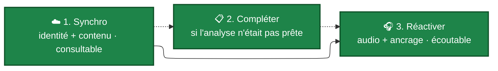

# P12 - Récupérer une nuit déposée sur VigieChiro ☁️

[← Retour au sommaire des parcours](index.md) · **Section B - Chaîne de production**

> **Persona principal** : Karim / Samuel (poste réinstallé, second poste, ou nuits déposées depuis un autre ordinateur). **Objectifs qualité visés** : [O6 Modularité](../../Objectifs%20qualités/Objectifs%20qualités/O6.md), [O5 Capacité d'affichage](../../Objectifs%20qualités/Objectifs%20qualités/O5.md).

Samuel a changé d'ordinateur en cours de saison. Ses nuits sont **déposées sur Vigie-Chiro**, mais sa nouvelle installation ne les connaît pas : elles n'apparaissent dans aucune liste, alors qu'elles existent bel et bien sur la plateforme. Il veut les **récupérer** sans devoir tout ré-importer depuis ses cartes SD.

Récupérer une nuit se décompose en **trois coutures** naturelles, activées dans l'ordre selon le besoin : chacune ajoute une strate à la précédente.

1. **La structure, l'identité et le contenu** - *se connecter et synchroniser « mes sites »*. La synchronisation rapatrie les sites et leurs points, l'**historique des nuits** de la plateforme avec leur **identité** (point, date, numéro, enregistreur, météo, micro), et enfin leur **contenu** : les observations et la liste des fichiers de chaque nuit. Une nuit récupérée est donc **consultable d'emblée** ; il ne lui manque que ses sons.
2. **Le rattrapage du contenu** - *compléter une nuit récupérée*. Deux cas échappent à la couture 1 : Vigie-Chiro n'a pas fini d'analyser la nuit, ou la liaison a manqué au moment de la lire. Depuis la vue multi-sites (menu ☰ « Compléter une nuit récupérée »), Samuel reprend ces nuits-là, une par une ou **toutes en une passe**, avec une **double barre de progression** : la nuit en cours, et le lot « Nuit X / N ». La synchro suivante les reprendrait d'elle-même ; cette couture permet de ne pas attendre.
3. **L'audio et l'ancrage** - *réactiver*. Quand Samuel **retrouve ses fichiers d'origine** (une sauvegarde, une carte SD), il ouvre le passage et lance « **Réactiver ce passage** » en désignant le dossier. L'application régénère les séquences depuis les bruts, les **vérifie une à une** (jamais de rebranchement en silence), et - pour un passage reconstruit - **rapatrie l'ancrage** des observations, leur lien à la plateforme nécessaire pour publier des corrections. Le passage redevient **écoutable**. C'est la couture la plus complète : *observations + audio + ancrage*. Comme la reconstruction en lot, elle **dit où elle en est** : une barre par phase mesurable (la régénération des séquences, puis l'ancrage réseau), et un **libellé nommé** pour les étapes intermédiaires - inscrire les fichiers retrouvés, recompter l'audio disponible. Sur une nuit de plusieurs milliers de séquences, l'opération dure : **aucun de ses moments ne doit rester muet**, sans quoi l'utilisateur ne peut pas la distinguer d'un blocage.

```mermaid
%%{init: {"flowchart": {"defaultRenderer": "elk"}, "themeCSS": ".nodeLabel, .nodeLabel p, .nodeLabel span { color: #fff !important; fill: #fff !important; }"}}%%
flowchart LR
    S[☁️ 1. Synchro<br/>identité + contenu · consultable] --> A[🎧 3. Réactiver<br/>audio + ancrage · écoutable]
    S -.-> R[📋 2. Compléter<br/>si l'analyse n'était pas prête]
    R -.-> A
    classDef c fill:#1e8449,stroke:#0e5128,color:#fff,stroke-width:2px
    class S,R,A c
```

## Pourquoi trois coutures, et pas un seul geste

Chaque strate a un **coût** et une **utilité** distincts, et l'utilisateur ne veut pas toujours tout ([O6](../../Objectifs%20qualités/Objectifs%20qualités/O6.md)) :

- rapatrier l'**audio** à la synchro reste **impossible** : le dépôt par ZIP ne le restitue pas, il n'est nulle part sur la plateforme ;
- **consulter** une nuit ne suppose pas d'avoir ses fichiers : les observations suffisent à revoir les résultats, et elles arrivent désormais dès la synchro ;
- **écouter et corriger** (couture 3) suppose d'avoir retrouvé les fichiers, ce qui n'arrive pas toujours, et pas tout de suite.

Découper permet donc de n'activer **que** la strate utile, quand elle le devient. Un passage reconstruit est **honnête** sur ce qui lui manque : il annonce « consultable, pas écoutable » et invite à réactiver plutôt que de laisser croire à une équivalence avec un import complet.

La frontière entre les coutures 1 et 2 s'est **déplacée deux fois**, et toujours pour la même raison : elle
se place au **coût réel**, et le coût réel change.

La première version arrêtait la synchro au point et à la date, pour qu'elle ne coûte que la liste. À
l'usage, l'historique remontait en colonnes d'« enregistreur inconnu » - **présent mais illisible**.
L'identité (enregistreur, météo, micro) a donc rejoint la couture 1, au prix d'un appel par nuit nouvelle.

Le **contenu** est resté derrière la couture 2 tant qu'il « se comptait en fichiers et non en champs » :
le rapatrier demandait alors de parcourir les observations page par page, une cinquantaine de pages par
nuit. Depuis que la plateforme expose un **CSV** téléchargeable d'un coup, ce coût est tombé à **deux
requêtes par nuit** - et l'argument qui tenait la frontière est tombé avec lui. Le contenu a donc rejoint
la couture 1 à son tour.

Ce que cette histoire dit du découpage : les coutures ne sont pas des étapes qu'on impose à l'utilisateur,
ce sont des **paliers de coût**. Quand un coût s'effondre, le palier disparaît - et ce qui reste de la
couture 2 n'est plus une étape du parcours nominal, mais un **rattrapage** pour les nuits que la plateforme
n'avait pas encore analysées.

## L'échange va dans les deux sens

Récupérer suppose que la plateforme sache. Ce n'est pas toujours le cas : une nuit importée depuis une carte SD peut arriver **sans enregistreur identifié**, et une météo se saisit souvent après coup. La fenêtre de modification d'un passage porte donc les **deux gestes**, nommés par leur sens : **Récupérer depuis Vigie-Chiro** (la plateforme fait foi) et **Envoyer vers Vigie-Chiro** (le poste fait foi). L'utilisateur choisit lequel des deux côtés détient la vérité, plutôt que de subir un « synchroniser » qui déciderait à sa place.

Une règle encadre le sens montant : l'application **ne publie jamais ce qu'elle ignore** (un « inconnu » local ne devient pas une donnée sur la plateforme) et **n'efface jamais** ce qu'elle ne modélise pas (les champs saisis sur le formulaire web survivent à un envoi).

### Les heures de la nuit sont un cas à part

Le reste de l'identité se recopie d'un côté à l'autre. Les **heures**, non : l'application détient
souvent mieux que ce qui est déclaré. Les noms de fichiers portent l'horodatage de capture, les
séquences le leur ; une nuit qui a des enregistrements **prouve** ses bornes, là où les champs
`début` / `fin` ne portent qu'une déclaration, susceptible d'avoir dérivé.

L'envoi part donc de la **preuve** quand elle existe, et le dit à l'utilisateur (il vient de voir ses
données corrigées, il doit pouvoir contester). Une nuit **squelette**, elle, n'a par construction
aucun enregistrement : rien ne l'atteste, et ses heures se **saisissent** - c'est le seul cas où
l'utilisateur en décide. La règle générale s'écrit donc : *les heures viennent des preuves quand il y
en a, de l'utilisateur quand il n'y en a pas*.

Ce n'est pas un raffinement théorique. Un cliquet de conversion de fuseau a fait dériver des nuits
réelles de 21 h à 15 h en quatre allers-retours, entraînant la météo avec elle - une nuit affichait
35 °C à 6 h du matin. Faire porter l'autorité par la preuve rend la cohérence **structurelle** au lieu
de la faire reposer sur l'absence de bug.

### Réactiver, c'est refaire l'import à l'identique

La couture 3 ne se contente pas de **retrouver** des fichiers. Quand l'utilisateur n'a gardé que ses
**enregistrements bruts** - la copie de sa carte, ce qu'il garde le plus volontiers - l'application
**régénère** les séquences d'écoute à partir d'eux.

Ce que cela suppose n'est pas anodin. Une séquence d'écoute porte les observations : c'est son **nom**
qui les y rattache, puisque c'est lui que porte l'`observations.csv` de la plateforme. Deux fichiers
aux octets identiques mais aux noms différents ne sont donc **pas** interchangeables. La garantie du
produit s'écrit ainsi : *la réactivation reproduit exactement ce que l'import avait écrit, noms
compris*.

Elle ne va pas de soi, parce que le nom d'une séquence ne se déduit pas d'un enregistrement isolé.
Deux enregistrements consécutifs se **chevauchent** volontiers sur la grille de découpe : la fin de
l'un porte l'heure de début du suivant, et les deux réclament le même nom. Il faut alors arbitrer, et
arbitrer suppose de voir la nuit **entière** - ce qu'un traitement fichier par fichier ne peut pas
faire.

Ce n'est pas une subtilité d'implémentation. Une nuit réelle a rendu **163 séquences de moins** que
son import, emportant **417 observations** devenues muettes alors que leur audio était sur la carte :
les tranches ayant perdu un arbitrage étaient régénérées sous un nom que personne n'attendait, puis
jetées. Le produit doit donc dire, et tenir, que **réactiver n'est pas approximer**.

Corollaire pour l'utilisateur : ce qui manque encore lui est **nommé**, avec sa raison. Un
enregistrement absent du dossier qu'il a désigné l'appelle à chercher ailleurs ; une tranche que
l'application n'a pas su reproduire est un défaut de notre côté, à signaler. Les deux se ressemblaient
autrefois sous un même décompte muet, qui ne disait à personne quoi faire.

### Copier, ou laisser les fichiers où ils sont

Refaire l'import à l'identique ne veut plus dire **recopier**. L'application **observe** désormais les
fichiers de l'utilisateur au lieu de les **posséder** : elle ne les archive plus, ne les purge plus, ne
les déplace plus. La réactivation demande donc **ce qu'il faut faire du dossier désigné** :

- s'il est **hors** de l'espace de travail - un serveur de fichiers, un disque externe, l'arborescence
  habituelle de l'utilisateur -, ces fichiers sont **les siens** ; l'application propose de **les laisser
  où ils sont** et de s'y référer, plutôt que d'en faire un doublon qu'il n'a pas demandé ;
- sinon, elle en garde sa propre copie, comme avant.

La conséquence est **dite avant** le choix : une nuit **référencée** devient muette si son support n'est
pas joignable (disque débranché, dossier réseau hors ligne), et le redevient d'elle-même dès qu'il
revient - son identité étant revérifiée à chaque retour, jamais rebranchée sur la foi du seul chemin.
Les tranches que l'application **régénère** depuis les bruts restent, elles, toujours copiées : elles
sont produites par le produit, pas par l'utilisateur.

## Ne pas noyer les vues site

La synchro rapatrie **tous** les points du carré Vigie-Chiro (la grille STOC peut en compter des dizaines), pas seulement ceux que l'utilisateur exploite. Pour ne pas noyer les points **réellement utilisés** sous cette grille ([O5](../../Objectifs%20qualités/Objectifs%20qualités/O5.md)), les vues site distinguent l'origine d'un point : [M-Site-detail](../Maquettes/M-Site-detail.md) masque par défaut les points rapatriés **sans passage** (repliés derrière un « + N rapatrié(s) »), et [M-Sites](../Maquettes/M-Sites.md) résume de même le bandeau des points. Un point rapatrié réapparaît dès qu'on s'en sert (un passage l'y rattache).

## Lien avec les autres parcours

- La **synchronisation** (couture 1) prolonge [P1 - Déclarer un site](P1%20-%20Déclarer%20un%20site%20de%20suivi.md) : le même geste qui rafraîchit les sites ramène désormais leur historique de nuits.
- La **reconstruction** (couture 2) est un import **allégé** - observations seules - complémentaire de [P2 - Importer une nuit](P2%20-%20Importer%20une%20nuit%20d%27enregistrement.md), qui part, lui, des fichiers bruts.
- La **réactivation** (couture 3) est la variante **audio** de l'import : elle rebranche les fichiers retrouvés sur un passage archivé - et les **régénère** depuis les bruts quand ce sont les seuls que l'utilisateur a gardés, à l'identique de l'import. Elle se prête au traitement de volume de [P5 - Naviguer multi-sites](P5%20-%20Naviguer%20dans%20plusieurs%20sites%20et%20passages.md).

## Enrichissements prévus

> Ces évolutions sont **décidées et maquettées, pas encore livrées**. Elles prolongent ce parcours sans en modifier les étapes actuelles.

- **La réactivation rend des comptes en chiffres.** Une réactivation porte un enjeu de confiance particulier, puisqu'elle rebranche des fichiers retrouvés sur un passage archivé : ce qui a été rebranché, ce qui a été régénéré et ce qui manque encore, avec son motif, se lit mieux en proportions qu'en liste. Voir [M-CompteRendu](../Maquettes/M-CompteRendu.md) (#2358).
