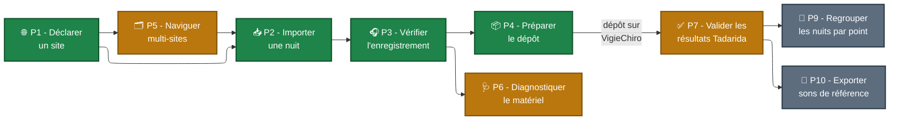

---
hide:
  - navigation
  - toc
---

# Topologie des parcours - vue plein écran

[← Retour au sommaire des parcours](index.md)

## Légende

| Couleur | Signification | Parcours |
|---|---|---|
| 🟩 Vert (MUST) | Chaîne minimale livrable - le fil rouge [P0](P0%20-%20Première%20nuit%20de%20Marie.md) en est la concaténation | P1, P2, P3, P4 |
| 🟧 Orange (SHOULD) | Approfondissements qui montent en charge ou ouvrent la cible étirable | P5, P6, P7 |
| ⬜ Gris (COULD) | Cibles étirées et idées long terme issues des retours Samuel | P9, P10 |

> Ce coloriage est la **priorité de conception** (MoSCoW), fixée au cadrage initial. Il ne dit **pas** le statut de livraison : la plupart de ces parcours sont **livrés** aujourd'hui (cf. le [sommaire des parcours](index.md)), à l'exception de **P9** (regroupement de nuits), qui reste une cible non livrée.

## Comment lire le diagramme

- Les **flèches pleines** sont les enchaînements directs entre parcours.
- La **flèche pointillée** entre P4 et P7 matérialise le **dépôt sur Vigie-Chiro** (par l'application, repli navigateur possible) + l'attente du retour Tadarida (24-48 h hors application).
- Une **boucle** P5 → P2 indique que le parcours multi-sites alimente plusieurs imports successifs.
- Les parcours P9 et P10 sont des **branches optionnelles** qui ne bloquent pas le fil principal.

[← Retour au sommaire des parcours](index.md)
