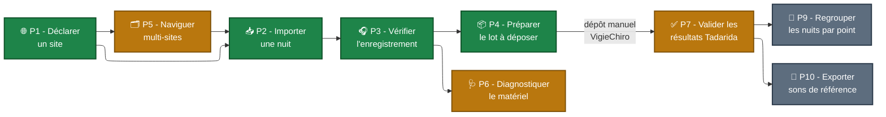

# Parcours utilisateurs

Cette section présente les **parcours principaux** de l'application, organisés en trois groupes. Chaque parcours a sa propre fiche dans la sidebar - utilisez ce hub comme point d'entrée et table des matières.

- **Section A — Fil rouge** : un seul parcours, **P0**, qui raconte l'usage cible de bout-en-bout vu par Marie. C'est le **scénario démo** que vous présenterez en soutenance.
- **Section B — Approfondissements** : les six parcours **P1 à P6** qui détaillent ou enrichissent le fil rouge. P1 à P4 composent la chaîne minimale livrable (MUST). P5 et P6 absorbent la montée en charge multi-site et le diagnostic matériel.
- **Section C — Cibles étirées** : les trois parcours **P7, P9 et P10** qui dépassent le périmètre MVP strict. P7 (validation Tadarida) est le **filet de sécurité MUST** si la SAE déborde du périmètre fil rouge. P9 et P10 sont des idées remontées par Samuel à arbitrer.

Tous les parcours reposent sur le vocabulaire posé dans le [Modèle conceptuel](../Modèle%20conceptuel/index.md).

## Topologie des parcours

[🖼️ Voir le diagramme en plein écran ↗](Topologie%20-%20plein%20écran.md){ .md-button }

Le fil rouge **P0** est la concaténation P1 → P2 → P3 → P4 (les nœuds verts).

| Section | Parcours | Persona principal | Statut |
|---|---|---|---|
| **A. Fil rouge** | [P0 - Première nuit de Marie](P0%20-%20Première%20nuit%20de%20Marie.md) | Marie | ⭐ scénario démo |
| **B. Approfondissements** | [P1 - Déclarer un site de suivi](P1%20-%20Déclarer%20un%20site%20de%20suivi.md) | Marie | ✅ MUST |
| | [P2 - Importer une nuit de capture](P2%20-%20Importer%20une%20nuit%20de%20capture.md) | tous | ✅ MUST |
| | [P3 - Vérifier l'enregistrement par échantillonnage](P3%20-%20Vérifier%20l%27enregistrement%20par%20échantillonnage.md) | tous | ✅ MUST |
| | [P4 - Préparer un lot prêt à déposer](P4%20-%20Préparer%20un%20lot%20prêt%20à%20déposer.md) | tous | ✅ MUST |
| | [P5 - Naviguer dans plusieurs sites et passages](P5%20-%20Naviguer%20dans%20plusieurs%20sites%20et%20passages.md) | Karim / Samuel | 🟠 SHOULD (MUST pour Karim/Samuel) |
| | [P6 - Diagnostiquer le matériel](P6%20-%20Diagnostiquer%20le%20matériel.md) | Karim / Samuel | 🟠 SHOULD |
| **C. Cibles étirées** | [P7 - Valider les résultats Tadarida](P7%20-%20Valider%20les%20résultats%20Tadarida.md) | Marie / Samuel | 🟠 SHOULD (cible étirable) |
| | [P9 - Regrouper les nuits successives par point](P9%20-%20Regrouper%20les%20nuits%20successives%20par%20point.md) | Karim / Samuel | ⚪ COULD (à arbitrer, voir note interne) |
| | [P10 - Exporter une bibliothèque de sons de référence](P10%20-%20Exporter%20une%20bibliothèque%20de%20sons%20de%20référence.md) | Samuel | ⚪ COULD |

## Couverture par persona

| Parcours | Marie | Karim | Samuel |
|---|:---:|:---:|:---:|
| [P0 - Première nuit (fil rouge)](P0%20-%20Première%20nuit%20de%20Marie.md) | ⭐ | (variante multi-site) | (variante volume) |
| [P1 - Déclarer un site](P1%20-%20Déclarer%20un%20site%20de%20suivi.md) | ✅ ⭐ | ✅ | ✅ |
| [P2 - Importer une nuit](P2%20-%20Importer%20une%20nuit%20de%20capture.md) | ✅ ⭐ | ✅ ⭐ | ✅ ⭐ |
| [P3 - Vérifier l'enregistrement](P3%20-%20Vérifier%20l%27enregistrement%20par%20échantillonnage.md) | ✅ ⭐ | ✅ | ✅ |
| [P4 - Préparer le lot](P4%20-%20Préparer%20un%20lot%20prêt%20à%20déposer.md) | ✅ ⭐ | ✅ | ✅ |
| [P5 - Multi-sites](P5%20-%20Naviguer%20dans%20plusieurs%20sites%20et%20passages.md) | (1 site) | ✅ ⭐ | ✅ ⭐ |
| [P6 - Diagnostic matériel (incl. cohérence horaires)](P6%20-%20Diagnostiquer%20le%20matériel.md) | ✓ | ✅ ⭐ | ✅ |
| [P7 - Validation Tadarida](P7%20-%20Valider%20les%20résultats%20Tadarida.md) | ✅ ⭐ | ✓ | ✅ ⭐ |
| [P9 - Regroupement nuits](P9%20-%20Regrouper%20les%20nuits%20successives%20par%20point.md) | (rare) | ✅ | ✅ ⭐ |
| [P10 - Sons de référence](P10%20-%20Exporter%20une%20bibliothèque%20de%20sons%20de%20référence.md) | (non) | (non) | ✅ |

⭐ = parcours central pour la persona, ✅ = parcours fréquent, ✓ = parcours occasionnel.
