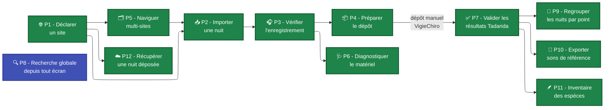

# Parcours utilisateurs

Cette section présente les **parcours d'usage** de l'application, organisés en trois groupes. Chaque parcours a sa propre fiche dans la barre latérale - utilisez ce sommaire comme point d'entrée et table des matières. **Tous ces parcours sont supportés par l'application livrée.**

- **Section A - Fil rouge** : un seul parcours, **P0**, qui raconte l'usage de bout-en-bout vu par Marie, de la carte SD au dépôt.
- **Section B - Chaîne de production** : les parcours **P1 à P6** qui composent et enrichissent le fil rouge - déclaration de site, import, vérification, préparation du dépôt, navigation multi-sites et diagnostic matériel -, plus **P12** (récupérer une nuit déjà déposée sur la plateforme, en trois coutures : synchro, reconstruire, réactiver).
- **Section C - Après le dépôt & exploitation** : **P7** (validation des résultats Tadarida) et son prolongement **biodiversité** - regroupement (**P9**), bibliothèque de sons (**P10**) et inventaire des espèces (**P11**).
- **Transverse** : **P8** (recherche globale) est accessible depuis **n'importe quel écran**.

Tous les parcours reposent sur le vocabulaire posé dans le [Modèle conceptuel](../Modèle%20conceptuel/index.md).

!!! info "Enrichissements décidés, pas encore livrés"
    Neuf parcours portent en fin de fiche une section **« Enrichissements prévus »**, qui les
    prolonge sans modifier leurs étapes actuelles. Ils viennent des chantiers #2348 (lire ce que la
    nuit contient), #2349 (du passage à la saison) et #2350 (les opérations longues), et sont
    maquettés dans [M-Synthese](../Maquettes/M-Synthese.md),
    [M-Activite](../Maquettes/M-Activite.md), [M-Saison](../Maquettes/M-Saison.md) et
    [M-CompteRendu](../Maquettes/M-CompteRendu.md).

    | Parcours enrichi | Ce qui s'y ajoute |
    |---|---|
    | [P0](P0%20-%20Première%20nuit%20de%20Marie.md) | une conclusion au fil rouge : ce que la nuit contient |
    | [P2](P2%20-%20Importer%20une%20nuit%20d%27enregistrement.md) | un compte rendu d'import chiffré |
    | [P4](P4%20-%20Préparer%20un%20lot%20prêt%20à%20déposer.md) | un téléversement qui encaisse une coupure, et un compte rendu de dépôt |
    | [P5](P5%20-%20Naviguer%20dans%20plusieurs%20sites%20et%20passages.md) | le solde de saison, la campagne, les actions groupées |
    | [P6](P6%20-%20Diagnostiquer%20le%20matériel.md) | l'activité horaire comme signal de dispositif |
    | [P7](P7%20-%20Valider%20les%20résultats%20Tadarida.md) | les espèces à enjeu, et un mode activité enfin mesurable |
    | [P9](P9%20-%20Regrouper%20les%20nuits%20successives%20par%20point.md) | le point comme ligne de solde annuel |
    | [P11](P11%20-%20Inventaire%20des%20espèces%20détectées.md) | ce que l'activité vaut, et la forme de la nuit |
    | [P12](P12%20-%20Récupérer%20une%20nuit%20déposée%20sur%20VigieChiro.md) | un compte rendu de réactivation |

## Topologie des parcours

[🖼️ Voir le diagramme en plein écran ↗](Topologie%20-%20plein%20écran.md){ .md-button }

Le fil rouge **P0** est la concaténation P1 → P2 → P3 → P4. Tous les nœuds verts sont des parcours **livrés** ; **P8** (bleu) est la recherche **transverse**, atteignable depuis tout écran.

| Section | Parcours | Persona principal | Rôle |
|---|---|---|---|
| **A. Fil rouge** | [P0 - Première nuit de Marie](P0%20-%20Première%20nuit%20de%20Marie.md) | Marie | scénario de bout en bout |
| **B. Chaîne de production** | [P1 - Déclarer un site de suivi](P1%20-%20Déclarer%20un%20site%20de%20suivi.md) | Marie | gérer ses sites et points |
| | [P2 - Importer une nuit d'enregistrement](P2%20-%20Importer%20une%20nuit%20d%27enregistrement.md) | tous | copier, renommer, transformer |
| | [P3 - Vérifier l'enregistrement par échantillonnage](P3%20-%20Vérifier%20l%27enregistrement%20par%20échantillonnage.md) | tous | sound check + verdict |
| | [P4 - Préparer le dépôt](P4%20-%20Préparer%20un%20lot%20prêt%20à%20déposer.md) | tous | cohérence + dépôt manuel |
| | [P5 - Naviguer dans plusieurs sites et passages](P5%20-%20Naviguer%20dans%20plusieurs%20sites%20et%20passages.md) | Karim / Samuel | vue agrégée (carte + tableau) |
| | [P6 - Diagnostiquer le matériel](P6%20-%20Diagnostiquer%20le%20matériel.md) | Karim / Samuel | climat, anomalies du capteur |
| | [P12 - Récupérer une nuit déposée sur VigieChiro](P12%20-%20Récupérer%20une%20nuit%20déposée%20sur%20VigieChiro.md) | Karim / Samuel | 3 coutures : synchro, reconstruire, réactiver |
| **C. Après le dépôt & exploitation** | [P7 - Valider les résultats Tadarida](P7%20-%20Valider%20les%20résultats%20Tadarida.md) | Marie / Samuel | revue des observations |
| | [P9 - Regrouper les nuits successives par point](P9%20-%20Regrouper%20les%20nuits%20successives%20par%20point.md) | Karim / Samuel | validation conjointe |
| | [P10 - Exporter une bibliothèque de sons de référence](P10%20-%20Exporter%20une%20bibliothèque%20de%20sons%20de%20référence.md) | Samuel | sons de référence par espèce |
| | [P11 - Inventaire des espèces détectées](P11%20-%20Inventaire%20des%20espèces%20détectées.md) | Karim / Samuel | « Espèces & observations » (par espèce / par carré) |
| **Transverse** | [P8 - Rechercher globalement](P8%20-%20Rechercher%20globalement.md) | tous | sauter à un site, un point, un passage |

## Couverture par persona

| Parcours | Marie | Karim | Samuel |
|---|:---:|:---:|:---:|
| [P0 - Première nuit (fil rouge)](P0%20-%20Première%20nuit%20de%20Marie.md) | ⭐ | (variante multi-site) | (variante volume) |
| [P1 - Déclarer un site](P1%20-%20Déclarer%20un%20site%20de%20suivi.md) | ✅ ⭐ | ✅ | ✅ |
| [P2 - Importer une nuit](P2%20-%20Importer%20une%20nuit%20d%27enregistrement.md) | ✅ ⭐ | ✅ ⭐ | ✅ ⭐ |
| [P3 - Vérifier l'enregistrement](P3%20-%20Vérifier%20l%27enregistrement%20par%20échantillonnage.md) | ✅ ⭐ | ✅ | ✅ |
| [P4 - Préparer le dépôt](P4%20-%20Préparer%20un%20lot%20prêt%20à%20déposer.md) | ✅ ⭐ | ✅ | ✅ |
| [P5 - Multi-sites](P5%20-%20Naviguer%20dans%20plusieurs%20sites%20et%20passages.md) | (1 site) | ✅ ⭐ | ✅ ⭐ |
| [P6 - Diagnostic matériel (incl. cohérence horaires)](P6%20-%20Diagnostiquer%20le%20matériel.md) | ✓ | ✅ ⭐ | ✅ |
| [P12 - Récupérer une nuit déposée](P12%20-%20Récupérer%20une%20nuit%20déposée%20sur%20VigieChiro.md) | (réinstall) | ✅ | ✅ ⭐ |
| [P7 - Validation Tadarida](P7%20-%20Valider%20les%20résultats%20Tadarida.md) | ✅ ⭐ | ✓ | ✅ ⭐ |
| [P9 - Regroupement nuits](P9%20-%20Regrouper%20les%20nuits%20successives%20par%20point.md) | (rare) | ✅ | ✅ ⭐ |
| [P10 - Sons de référence](P10%20-%20Exporter%20une%20bibliothèque%20de%20sons%20de%20référence.md) | (non) | (non) | ✅ |
| [P11 - Inventaire des espèces](P11%20-%20Inventaire%20des%20espèces%20détectées.md) | ✓ | ✅ | ✅ ⭐ |
| [P8 - Recherche globale (transverse)](P8%20-%20Rechercher%20globalement.md) | ✅ | ✅ ⭐ | ✅ ⭐ |

⭐ = parcours central pour la persona, ✅ = parcours fréquent, ✓ = parcours occasionnel.
