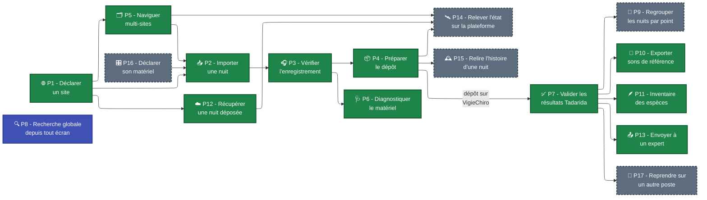

# Parcours utilisateurs

Cette section présente les **parcours d'usage** de l'application, organisés en trois groupes. Chaque parcours a sa propre fiche dans la barre latérale - utilisez ce sommaire comme point d'entrée et table des matières.

**Les parcours P0 à P13 sont supportés par l'application livrée**, à l'exception de [P9](P9%20-%20Regrouper%20les%20nuits%20successives%20par%20point.md) (regrouper les nuits d'un point pour une validation conjointe) : ni service ni vue de regroupement n'existent (cf. [E8.S1](../Story%20mapping/E8%20-%20Productivité%20avancée%20Tadarida.md#e8s1)).

**P14 à P17 sont des cibles**, ouvertes en août 2026 et pas encore construites. Chacune porte en tête l'issue qui la suit : c'est là que se lit son état, et non dans une phrase de ce sommaire.

- **Section A - Fil rouge** : un seul parcours, **P0**, qui raconte l'usage de bout-en-bout vu par Marie, de la carte SD au dépôt.
- **Section B - Chaîne de production** : les parcours **P1 à P6** qui composent et enrichissent le fil rouge - déclaration de site, import, vérification, préparation du dépôt, navigation multi-sites et diagnostic matériel -, plus **P12** (récupérer une nuit déjà déposée sur la plateforme, en trois coutures : synchro, reconstruire, réactiver). Trois cibles s'y rattachent : **P14** (relever l'état d'une nuit sur la plateforme), **P15** (relire son histoire) et **P16** (déclarer son matériel une fois).
- **Section C - Après le dépôt & exploitation** : **P7** (validation des résultats Tadarida) et son prolongement **biodiversité** - regroupement (**P9**), bibliothèque de sons (**P10**), inventaire des espèces (**P11**) et envoi d'un sous-ensemble à un expert (**P13**), plus la cible **P17** (reprendre une nuit sur un autre poste).
- **Transverse** : **P8** (recherche globale) est accessible depuis **n'importe quel écran**.

Tous les parcours reposent sur le vocabulaire posé dans le [Modèle conceptuel](../Modèle%20conceptuel/index.md).

!!! success "Ce que les chantiers de l'été ont ajouté aux parcours"
    Neuf parcours portent en fin de fiche une section qui les prolonge sans modifier leurs étapes.
    Elle vient des chantiers #2348 (lire ce que la nuit contient), #2349 (du passage à la saison) et
    #2350 (les opérations longues), **clos le 29 juillet 2026**. Les quatre écrans correspondants
    existent : [M-Synthese](../Maquettes/M-Synthese.md),
    [M-Activite](../Maquettes/M-Activite.md), [M-Saison](../Maquettes/M-Saison.md) et
    [M-CompteRendu](../Maquettes/M-CompteRendu.md).

    | Parcours enrichi | Ce qui s'y est ajouté |
    |---|---|
    | [P0](P0%20-%20Première%20nuit%20de%20Marie.md) | une conclusion au fil rouge : ce que la nuit contient |
    | [P2](P2%20-%20Importer%20une%20nuit%20d%27enregistrement.md) | un compte rendu d'import chiffré |
    | [P4](P4%20-%20Préparer%20un%20lot%20prêt%20à%20déposer.md) | un téléversement qui encaisse une coupure, et un compte rendu de dépôt |
    | [P5](P5%20-%20Naviguer%20dans%20plusieurs%20sites%20et%20passages.md) | le solde de saison, la campagne, les actions groupées |
    | [P6](P6%20-%20Diagnostiquer%20le%20matériel.md) | l'activité horaire comme signal de dispositif |
    | [P7](P7%20-%20Valider%20les%20résultats%20Tadarida.md) | les espèces à enjeu, et un mode activité enfin mesurable |
    | [P9](P9%20-%20Regrouper%20les%20nuits%20successives%20par%20point.md) | le point comme ligne de solde annuel |
    | [P11](P11%20-%20Inventaire%20des%20espèces%20détectées.md) | ce que l'activité vaut, et la forme de la nuit |
    | [P13](P13%20-%20Envoyer%20un%20sous-ensemble%20à%20un%20expert.md) | un bilan chiffré d'archive (sons emportés, sons introuvables) |
    | [P12](P12%20-%20Récupérer%20une%20nuit%20déposée%20sur%20VigieChiro.md) | un compte rendu de réactivation |

## Topologie des parcours

[🖼️ Voir le diagramme en plein écran ↗](Topologie%20-%20plein%20écran.md){ .md-button }

```mermaid
%%{init: {"flowchart": {"defaultRenderer": "elk"}, "themeCSS": ".nodeLabel, .nodeLabel p, .nodeLabel span { color: #fff !important; fill: #fff !important; }"}}%%
flowchart LR
    P1[🌐 P1 - Déclarer<br/>un site] --> P2[📥 P2 - Importer<br/>une nuit]
    P2 --> P3[🎧 P3 - Vérifier<br/>l'enregistrement]
    P3 --> P4[📦 P4 - Préparer<br/>le dépôt]
    P4 -->|dépôt sur<br/>VigieChiro| P7[✅ P7 - Valider les<br/>résultats Tadarida]

    P1 --> P5[🗂 P5 - Naviguer<br/>multi-sites]
    P5 --> P2
    P3 --> P6[🩺 P6 - Diagnostiquer<br/>le matériel]
    P1 --> P12[☁️ P12 - Récupérer<br/>une nuit déposée]

    P7 --> P9[🔁 P9 - Regrouper<br/>les nuits par point]
    P7 --> P10[🎼 P10 - Exporter<br/>sons de référence]
    P7 --> P11[🪶 P11 - Inventaire<br/>des espèces]
    P7 --> P13[📤 P13 - Envoyer à<br/>un expert]

    P8[🔍 P8 - Recherche globale<br/>depuis tout écran]

    P16[🎛 P16 - Déclarer<br/>son matériel] --> P2
    P4 --> P14[🛰 P14 - Relever l'état<br/>sur la plateforme]
    P12 --> P14
    P5 --> P14
    P4 --> P15[🕰 P15 - Relire l'histoire<br/>d'une nuit]
    P7 --> P17[🧳 P17 - Reprendre sur<br/>un autre poste]

    classDef livre fill:#1e8449,stroke:#0e5128,color:#fff,stroke-width:2px
    classDef transverse fill:#3f51b5,stroke:#283593,color:#fff,stroke-width:2px
    classDef nonlivre fill:#5d6d7e,stroke:#283747,color:#fff,stroke-width:2px,stroke-dasharray:5 3
    class P1,P2,P3,P4,P5,P6,P7,P10,P11,P12,P13 livre
    class P8 transverse
    class P9,P14,P15,P16,P17 nonlivre
```

Le fil rouge **P0** est la concaténation P1 → P2 → P3 → P4. Les nœuds verts sont des parcours **livrés** ; **P8** (bleu) est la recherche **transverse**, atteignable depuis tout écran ; les nœuds **gris pointillés** sont des **cibles non livrées**. Le statut d'un parcours se lit ici, sur son nœud : c'est ce qui l'empêche de se périmer sans qu'on le voie.

**P9** attend depuis l'origine (regroupement de nuits pour validation, cf. [E8.S1](../Story%20mapping/E8%20-%20Productivité%20avancée%20Tadarida.md#e8s1)). **P14** à **P17** ont été ouvertes en août 2026, et trois d'entre elles découlent du traitement en lot livré en juillet : agir sur six nuits d'un geste a créé le besoin de diagnostiquer une nuit précise (P14), de relire ce qu'un lot a fait une fois sa fenêtre fermée (P15), et de ne plus ressaisir le même matériel vingt fois (P16).

| Section | Parcours | Persona principal | Rôle |
|---|---|---|---|
| **A. Fil rouge** | [P0 - Première nuit de Marie](P0%20-%20Première%20nuit%20de%20Marie.md) | Marie | scénario de bout en bout |
| **B. Chaîne de production** | [P1 - Déclarer un site de suivi](P1%20-%20Déclarer%20un%20site%20de%20suivi.md) | Marie | gérer ses sites et points |
| | [P2 - Importer une nuit d'enregistrement](P2%20-%20Importer%20une%20nuit%20d%27enregistrement.md) | tous | copier, renommer, transformer |
| | [P3 - Vérifier l'enregistrement par échantillonnage](P3%20-%20Vérifier%20l%27enregistrement%20par%20échantillonnage.md) | tous | sound check + verdict |
| | [P4 - Préparer le dépôt](P4%20-%20Préparer%20un%20lot%20prêt%20à%20déposer.md) | tous | cohérence + dépôt (direct ou repli) |
| | [P5 - Naviguer dans plusieurs sites et passages](P5%20-%20Naviguer%20dans%20plusieurs%20sites%20et%20passages.md) | Karim / Samuel | vue agrégée (carte + tableau) |
| | [P6 - Diagnostiquer le matériel](P6%20-%20Diagnostiquer%20le%20matériel.md) | Karim / Samuel | climat, anomalies du capteur |
| | [P12 - Récupérer une nuit déposée sur VigieChiro](P12%20-%20Récupérer%20une%20nuit%20déposée%20sur%20VigieChiro.md) | Karim / Samuel | 3 coutures : synchro, reconstruire, réactiver |
| | [P14 - Vérifier ce que la plateforme détient d'une nuit](P14%20-%20Vérifier%20ce%20que%20la%20plateforme%20détient%20d%27une%20nuit.md) ⬜ | Karim / Marie | relevé par nuit, réalignement confirmé |
| | [P15 - Relire l'histoire d'une nuit](P15%20-%20Relire%20l%27histoire%20d%27une%20nuit.md) ⬜ | Karim / Samuel | frise des évènements d'un passage |
| | [P16 - Déclarer et retrouver son matériel](P16%20-%20Déclarer%20et%20retrouver%20son%20matériel.md) ⬜ | Karim | parc d'enregistreurs et de micros |
| **C. Après le dépôt & exploitation** | [P7 - Valider les résultats Tadarida](P7%20-%20Valider%20les%20résultats%20Tadarida.md) | Marie / Samuel | revue des observations |
| | [P9 - Regrouper les nuits successives par point](P9%20-%20Regrouper%20les%20nuits%20successives%20par%20point.md) ⬜ | Karim / Samuel | validation conjointe |
| | [P10 - Exporter une bibliothèque de sons de référence](P10%20-%20Exporter%20une%20bibliothèque%20de%20sons%20de%20référence.md) | Samuel | sons de référence par espèce |
| | [P11 - Inventaire des espèces détectées](P11%20-%20Inventaire%20des%20espèces%20détectées.md) | Karim / Samuel | « Espèces & observations » (par espèce / par carré) |
| | [P13 - Envoyer un sous-ensemble à un expert](P13%20-%20Envoyer%20un%20sous-ensemble%20à%20un%20expert.md) | Samuel | espèce × lieu → archive ZIP (CSV + sons) |
| | [P17 - Reprendre une nuit sur un autre poste](P17%20-%20Reprendre%20une%20nuit%20sur%20un%20autre%20poste.md) ⬜ | Samuel / Karim | paquet de reprise entre deux machines |
| **Transverse** | [P8 - Rechercher globalement](P8%20-%20Rechercher%20globalement.md) | tous | sauter à un site, un point, un passage |

Le repère ⬜ marque une **cible non livrée**, dans la même convention que les nœuds pointillés du diagramme ci-dessus.

## Couverture par persona

| Parcours | Marie | Karim | Samuel |
|---|:---:|:---:|:---:|
| [P0 - Première nuit (fil rouge)](P0%20-%20Première%20nuit%20de%20Marie.md) | ⭐ | (variante multi-site) | (variante volume) |
| [P1 - Déclarer un site](P1%20-%20Déclarer%20un%20site%20de%20suivi.md) | ✅ ⭐ | ✅ | ✅ |
| [P2 - Importer une nuit](P2%20-%20Importer%20une%20nuit%20d%27enregistrement.md) | ✅ ⭐ | ✅ ⭐ | ✅ ⭐ |
| [P3 - Vérifier l'enregistrement](P3%20-%20Vérifier%20l%27enregistrement%20par%20échantillonnage.md) | ✅ ⭐ | ✅ | ✅ |
| [P4 - Préparer le dépôt](P4%20-%20Préparer%20un%20lot%20prêt%20à%20déposer.md) | ✅ ⭐ | ✅ | ✅ |
| [P5 - Multi-sites](P5%20-%20Naviguer%20dans%20plusieurs%20sites%20et%20passages.md) | (1 site) | ✅ ⭐ | ✅ ⭐ |
| [P6 - Diagnostic matériel (incl. cohérence horaires)](P6%20-%20Diagnostiquer%20le%20matériel.md) | ✓ | ✅ ⭐ | ✅ |
| [P12 - Récupérer une nuit déposée](P12%20-%20Récupérer%20une%20nuit%20déposée%20sur%20VigieChiro.md) | (réinstall) | ✅ | ✅ ⭐ |
| [P7 - Validation Tadarida](P7%20-%20Valider%20les%20résultats%20Tadarida.md) | ✅ ⭐ | ✓ | ✅ ⭐ |
| [P9 - Regroupement nuits](P9%20-%20Regrouper%20les%20nuits%20successives%20par%20point.md) | (rare) | ✅ | ✅ ⭐ |
| [P10 - Sons de référence](P10%20-%20Exporter%20une%20bibliothèque%20de%20sons%20de%20référence.md) | (non) | (non) | ✅ |
| [P13 - Envoyer à un expert](P13%20-%20Envoyer%20un%20sous-ensemble%20à%20un%20expert.md) | ✓ | ✅ | ✅ ⭐ |
| [P11 - Inventaire des espèces](P11%20-%20Inventaire%20des%20espèces%20détectées.md) | ✓ | ✅ | ✅ ⭐ |
| [P8 - Recherche globale (transverse)](P8%20-%20Rechercher%20globalement.md) | ✅ | ✅ ⭐ | ✅ ⭐ |
| [P14 - Relever l'état sur la plateforme](P14%20-%20Vérifier%20ce%20que%20la%20plateforme%20détient%20d%27une%20nuit.md) ⬜ | ✓ | ✅ ⭐ | ✅ |
| [P15 - Relire l'histoire d'une nuit](P15%20-%20Relire%20l%27histoire%20d%27une%20nuit.md) ⬜ | (rare) | ✅ | ✅ ⭐ |
| [P16 - Déclarer son matériel](P16%20-%20Déclarer%20et%20retrouver%20son%20matériel.md) ⬜ | ✓ | ✅ ⭐ | ✅ |
| [P17 - Reprendre sur un autre poste](P17%20-%20Reprendre%20une%20nuit%20sur%20un%20autre%20poste.md) ⬜ | (non) | ✅ | ✅ ⭐ |

⭐ = parcours central pour la persona, ✅ = parcours fréquent, ✓ = parcours occasionnel, ⬜ = cible non livrée.

Les quatre cibles se lisent d'abord côté **Karim** et **Samuel**, et c'est cohérent avec ce qui les a fait naître : ce sont des besoins de volume et de traçabilité, que le traitement en lot a rendus visibles. Marie, qui traite deux nuits par an, ne les rencontre qu'occasionnellement.
