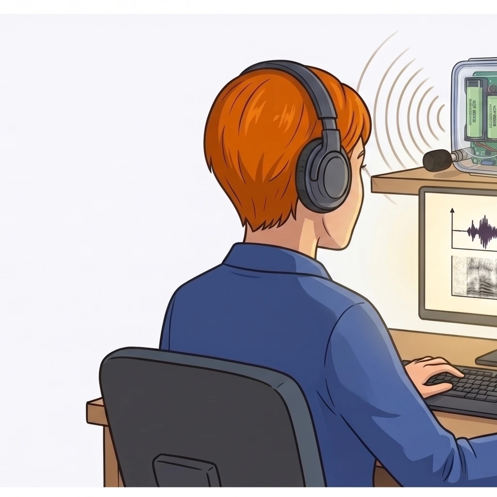

# Samuel Busson - doctorant écologue au CEREMA

<figure markdown="span" style="text-align: center; margin: 1.5rem 0;">
  { style="max-width: 240px; border-radius: 12px;" }
</figure>

> 👨‍🔬 « Sur le projet précédent, on a dû s'appuyer sur les collègues informaticiens pour avaler les données. Ça marche, mais c'est imbuvable à transmettre. Mes prochaines campagnes seront sur des PR Teensy, et je veux un outil propre qui va avec. »

## Identité

| | |
|---|---|
| **Affiliation** | [CEREMA](https://www.cerema.fr/) (équipe Climat & Territoires de demain, Département Territoire Ville et Bâtiment, Groupe Territoire), site d'Aix-en-Provence |
| **Statut** | Doctorant au CEREMA |
| **Sujet de thèse** | Effet de l'éclairage public LED sur l'activité acoustique des chiroptères, et en particulier influence de la visibilité des sources lumineuses sur l'activité des chauves-souris et des insectes volants |
| **Contact** | <samuel.busson@cerema.fr> |

## Positionnement

> 🎯 **Samuel est le commanditaire réel.** C'est lui qui exprime le besoin, et c'est sur sa connaissance du terrain et du pipeline que repose la pertinence de l'application.
>
> Samuel n'est pas naturaliste amateur : c'est un **chercheur** qui a vécu de l'intérieur le manque d'outillage de la communauté acoustique chiroptères. Son avis qualitatif sur l'application fait autorité.

## Ce qu'il a déjà fait (campagne précédente, autre projet)

Une précédente campagne expérimentale (liée à un autre projet que sa thèse en cours) s'appuie sur un **protocole BACIP** (*Before-After Control-Impact Paired*) déployé sur **13 secteurs de Seine-et-Marne**, chaque secteur comportant 3 sites (Dark / LED Neutre 3000K / LED Ambre 1800K). Quatre nuits d'enregistrement par site et par campagne, deux saisons (avant/après l'installation des nouveaux luminaires). Captation simultanée des trois sites avec des **AudioMoth**, identification automatique des espèces via **Tadarida**, validation manuelle des observations à fort enjeu, modèles linéaires généralisés mixtes pour l'analyse.

Premiers résultats publiés en 2025 :

- **34 759 contacts** chiroptères longue portée (Nyctalus, Eptesicus, Tadarida)
- **525 399 contacts** chiroptères moyenne portée (Pipistrellus, Miniopterus, Hypsugo)
- Conclusion partielle : **pas d'effet significatif du CCT** sur l'activité globale, en accord avec la littérature récente

Pour avaler ce volume de données, Samuel a **développé avec ses collègues informaticiens** des scripts R / Bash de pré-traitement, de renommage et de croisement avec les CSV Tadarida. Ces scripts marchent, mais sont impossibles à transmettre à un autre chercheur sans plusieurs jours d'onboarding. C'est précisément ce manque d'**outillage utilisable, partageable et durable** que ce produit vient combler.

## Ce qu'il s'apprête à faire (futur protocole)

Pour ses **futures campagnes**, Samuel a choisi le projet **Passive Recorder Teensy** ([PiBatRecorderProjects/TeensyRecorders](https://framagit.org/PiBatRecorderProjects/TeensyRecorders)) pour trois raisons :

- **Qualité** : sensibilité, dynamique audio et stabilité des paramètres d'acquisition supérieures à ce qu'il a pu obtenir avec ses précédents capteurs.
- **Ouverture** : firmware open-source, schémas électroniques publics, format de sortie documenté - condition *sine qua non* de la reproductibilité scientifique et de l'évolution à long terme du matériel.
- **Accessibilité** : coût modéré, assemblage à la portée d'un laboratoire ou d'une association naturaliste, communauté active autour de framagit.

L'écosystème **logiciel** autour du PR est en revanche encore rudimentaire : pas d'outil de validation des observations VigieChiro, pas d'IHM de suivi de campagne, pas de moyen propre d'exporter aux formats attendus. **C'est là que *VigieChiro Companion* intervient.**

## Compétences techniques

- **Maîtrise** : R, Python, Bash, Git, SQL, Linux, traitement du signal acoustique, modèles statistiques mixtes, GIS / QGIS.
- **Préfère éviter** : développer ses propres GUI (« je préfère un bon script à une mauvaise interface »).

## Ce qu'il attend de l'application

> ⚠️ Cette liste a été reconstituée à partir du profil de Samuel et de sa publication 2025.

- Un **format d'export propre, documenté, reproductible** : si on relance l'export, on doit obtenir le même fichier au bit près.
- L'**intégrité totale** des annotations : aucune action de l'application ne doit modifier ou écraser les validations sans consentement explicite.
- Pouvoir **annoter une session** avec un commentaire libre suffisamment long (méthodo, anomalie matérielle, conditions du site - dimming, météo, lune).
- Pouvoir **tagger ses sessions** par couple `site × condition` (`Site07_Controle`, `Site07_LED3000K`, `Site07_LED1800K`) pour retrouver les paires expérimentales en un coup d'œil.
- Que la base de données soit **lisible et requêtable** par-dessus l'application (la base SQLite peut être ouverte par un client externe pour les analyses R).
- **Pas d'auto-update**, pas de télémétrie, pas d'envoi de rapports d'erreur sans demander.

## Ce qui le décourage

- Les outils qui s'imposent comme **autorité unique** sur les données (« propriétaire » du fichier).
- Les changements de format silencieux entre versions.
- Les bases de données opaques où il ne peut pas faire un `SELECT` sans passer par l'IHM.
- Les modales bloquantes qui interrompent son flux de travail.

## Métriques de succès

- L'application permet de **scripter** une partie du flux (import en CLI, export en CLI) tout en utilisant l'IHM pour la validation manuelle.
- La base SQLite reste **interrogeable** depuis R / DBeaver sans que l'application ne s'en plaigne.
- Le format d'export est **stable et documenté** : reproductible à plusieurs mois d'écart.
- En usage, Samuel donne un avis qualitatif positif - prêt à recommander l'outil à ses collègues qui passeront sur PR Teensy.
