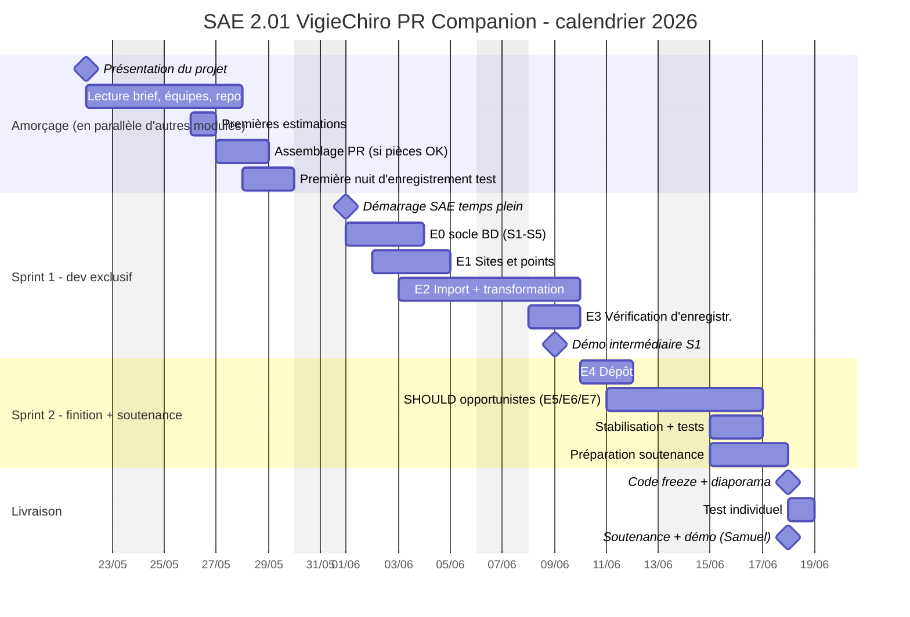

---
hide:
  - navigation
  - toc
---

# Gantt prospectif de la SAE 2.01 - vue plein écran

[← Retour à la planification](Planification.md)

## Lecture du Gantt

- **Section 1 - Amorçage** (22/05 → 31/05, en parallèle d'autres modules) : pas de développement intensif, juste la mise en place (lecture du brief, repo, équipes, estimations) et l'assemblage du PR de l'équipe si les pièces sont arrivées à temps.
- **Section 2 - Sprint 1** (01/06 → 09/06, dev exclusif) : la chaîne fil rouge MUST sur les fondations BD ([E0 socle](Story%20mapping/E0%20-%20Fondations%20de%20persistance.md), [E1](Story%20mapping/E1%20-%20Gérer%20ses%20sites%20et%20points%20de%20suivi.md), [E2](Story%20mapping/E2%20-%20Importer%20et%20transformer%20une%20nuit.md), [E3](Story%20mapping/E3%20-%20Vérifier%20la%20qualité%20d%27enregistrement.md)). [E2.S6](Story%20mapping/E2%20-%20Importer%20et%20transformer%20une%20nuit.md#e2s6) est le point dur critique à sécuriser dès le J1.
- **Section 3 - Sprint 2** (10/06 → 17/06, dev exclusif) : finition [E4](Story%20mapping/E4%20-%20Préparer%20et%20tracer%20le%20dépôt%20VigieChiro.md), SHOULD opportunistes choisies en fonction de la vélocité observée Sprint 1, stabilisation et préparation soutenance en parallèle.
- **Section 4 - Livraison** (18/06) : code freeze + diaporama le matin, test individuel l'après-midi, soutenance + démo devant Samuel Busson en clôture.

Les barres orange marquent les milestones (présentation, démarrage SAE, démo intermédiaire, code freeze, soutenance).

[← Retour à la planification](Planification.md)
