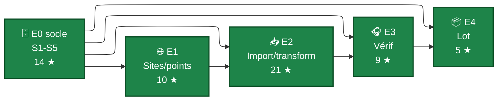

# Périmètre MVP

Le périmètre du **produit minimum viable** est l'arbitrage qui transforme les **50 stories** du [Story mapping](Story%20mapping/index.md) (≈ 130 ★) en un livrable réaliste pour le **calendrier de la SAE** : ~13 jours ouvrés de développement exclusif (cf. [Calendrier de travail](../Calendrier%20de%20travail.md)).

L'arbitrage est fait selon la méthode [MoSCoW](https://fr.wikipedia.org/wiki/M%C3%A9thode_MoSCoW) :

| Niveau | Sens | Conséquence |
|---|---|---|
| ✅ **MUST** | Sans cette story, le MVP ne tient pas debout. | À livrer en priorité absolue. |
| 🟠 **SHOULD** | Très souhaitable, ajoute beaucoup de valeur. | À livrer si la vélocité le permet, après les MUST. |
| ⚪ **COULD** | Confort, raffinement, idée intéressante. | À engager seulement si tout le reste est solide. |
| ⛔ **WON'T** | Explicitement exclu de cette version. | Ne pas y consacrer de temps. |

## Stratégie d'arbitrage

**Priorité absolue à la chaîne fil rouge** [P1](Parcours%20utilisateurs/P1%20-%20Déclarer%20un%20site%20de%20suivi.md) → [P2](Parcours%20utilisateurs/P2%20-%20Importer%20une%20nuit%20de%20capture.md) → [P3](Parcours%20utilisateurs/P3%20-%20Vérifier%20l%27enregistrement%20par%20échantillonnage.md) → [P4](Parcours%20utilisateurs/P4%20-%20Préparer%20un%20lot%20prêt%20à%20déposer.md). C'est le **scénario démo** (cf. [P0](Parcours%20utilisateurs/P0%20-%20Première%20nuit%20de%20Marie.md)) qui sera présenté en soutenance : si une équipe livre cette chaîne de bout-en-bout, le MVP est atteint, indépendamment de ce qui ne sera pas fait au-delà.

Concrètement, cela correspond aux **épopées [E1](Story%20mapping/E1%20-%20Gérer%20ses%20sites%20et%20points%20de%20suivi.md), [E2](Story%20mapping/E2%20-%20Importer%20et%20transformer%20une%20nuit.md), [E3](Story%20mapping/E3%20-%20Vérifier%20la%20qualité%20d%27enregistrement.md), [E4](Story%20mapping/E4%20-%20Préparer%20et%20tracer%20le%20dépôt%20VigieChiro.md)**, posées sur les **fondations [E0](Story%20mapping/E0%20-%20Fondations%20de%20persistance.md) socle** (schéma BD + DAO).

**Chaîne MUST critique** : 25 stories pour ~59 ★ au total. C'est la cible **incompressible** du MVP, à livrer en priorité absolue.

## La chaîne MUST critique - composition détaillée

### E0 socle (5 stories sur 8, ~14 ★)

Les fondations BD minimales pour que toutes les autres stories puissent s'appuyer :

- [E0.S1 - Initialiser le schéma SQLite et les DAO génériques](Story%20mapping/E0%20-%20Fondations%20de%20persistance.md#e0s1) ★★★★
- [E0.S2 - Persister les sites de suivi et points d'écoute](Story%20mapping/E0%20-%20Fondations%20de%20persistance.md#e0s2) ★★
- [E0.S3 - Persister les passages avec leurs statuts workflow](Story%20mapping/E0%20-%20Fondations%20de%20persistance.md#e0s3) ★★★
- [E0.S4 - Persister les sélections d'écoute et leurs séquences](Story%20mapping/E0%20-%20Fondations%20de%20persistance.md#e0s4) ★★
- [E0.S5 - Persister les observations Tadarida importées](Story%20mapping/E0%20-%20Fondations%20de%20persistance.md#e0s5) ★★★

E0.S6 (reprise d'import), E0.S7 (reprise de validation) et E0.S8 (migration de schéma) sont en SHOULD/COULD.

### E1 entier (5 stories, 10 ★)

Tout E1 est MUST : sans sites déclarés, rien n'est rattachable.

- [E1.S1 - Saisir un site avec son n° de carré](Story%20mapping/E1%20-%20Gérer%20ses%20sites%20et%20points%20de%20suivi.md#e1s1) ★★
- [E1.S2 - Ajouter / modifier / retirer des points d'écoute](Story%20mapping/E1%20-%20Gérer%20ses%20sites%20et%20points%20de%20suivi.md#e1s2) ★★
- [E1.S3 - Saisir GPS et descriptif d'un point d'écoute](Story%20mapping/E1%20-%20Gérer%20ses%20sites%20et%20points%20de%20suivi.md#e1s3) ★
- [E1.S4 - Vue des sites déclarés](Story%20mapping/E1%20-%20Gérer%20ses%20sites%20et%20points%20de%20suivi.md#e1s4) ★★★
- [E1.S5 - Créer un site à la volée depuis l'import](Story%20mapping/E1%20-%20Gérer%20ses%20sites%20et%20points%20de%20suivi.md#e1s5) ★★

### E2 cœur (7 stories sur 8, ~21 ★)

C'est l'épopée la plus dense et la plus à risque techniquement (lecture audio, copie 40 Go, transformation déterministe).

- [E2.S1 - Inspecter un dossier source en lecture seule](Story%20mapping/E2%20-%20Importer%20et%20transformer%20une%20nuit.md#e2s1) ★★★
- [E2.S2 - Rattacher la nuit à un site/point/année/passage](Story%20mapping/E2%20-%20Importer%20et%20transformer%20une%20nuit.md#e2s2) ★★★
- [E2.S3 - Extraire le rattachement depuis un dossier déjà préfixé](Story%20mapping/E2%20-%20Importer%20et%20transformer%20une%20nuit.md#e2s3) ★★★
- [E2.S4 - Copier de manière protégée les fichiers depuis la SD](Story%20mapping/E2%20-%20Importer%20et%20transformer%20une%20nuit.md#e2s4) ★★★★
- [E2.S5 - Renommer les fichiers copiés selon le préfixe Vigie-Chiro](Story%20mapping/E2%20-%20Importer%20et%20transformer%20une%20nuit.md#e2s5) ★★
- [E2.S6 - Transformer chaque enregistrement en séquences ralenties ×10](Story%20mapping/E2%20-%20Importer%20et%20transformer%20une%20nuit.md#e2s6) ★★★★★ ⚠ point dur
- [E2.S7 - Mémoriser l'association enregistreur ↔ site/point](Story%20mapping/E2%20-%20Importer%20et%20transformer%20une%20nuit.md#e2s7) ★

E2.S8 (modifier rétroactivement le rattachement) est en SHOULD.

### E3 cœur (5 stories sur 6, ~9 ★)

Le sound check avant dépôt.

- [E3.S1 - Générer une sélection d'écoute automatique](Story%20mapping/E3%20-%20Vérifier%20la%20qualité%20d%27enregistrement.md#e3s1) ★★
- [E3.S2 - Afficher la sélection en liste chronologique](Story%20mapping/E3%20-%20Vérifier%20la%20qualité%20d%27enregistrement.md#e3s2) ★★
- [E3.S3 - Lire une séquence d'écoute avec contrôles audio](Story%20mapping/E3%20-%20Vérifier%20la%20qualité%20d%27enregistrement.md#e3s3) ★★★
- [E3.S4 - Marquer les séquences écoutées et suivre l'avancement](Story%20mapping/E3%20-%20Vérifier%20la%20qualité%20d%27enregistrement.md#e3s4) ★
- [E3.S5 - Saisir le verdict global du passage et un commentaire](Story%20mapping/E3%20-%20Vérifier%20la%20qualité%20d%27enregistrement.md#e3s5) ★

E3.S6 (personnaliser la sélection) est en SHOULD.

### E4 cœur (3 stories sur 4, ~5 ★)

La préparation du lot et la traçabilité du dépôt.

- [E4.S1 - Vérifier la cohérence du passage avant préparation](Story%20mapping/E4%20-%20Préparer%20et%20tracer%20le%20dépôt%20VigieChiro.md#e4s1) ★★
- [E4.S2 - Voir le récapitulatif du lot et ouvrir le dossier](Story%20mapping/E4%20-%20Préparer%20et%20tracer%20le%20dépôt%20VigieChiro.md#e4s2) ★★
- [E4.S3 - Marquer le passage comme déposé](Story%20mapping/E4%20-%20Préparer%20et%20tracer%20le%20dépôt%20VigieChiro.md#e4s3) ★

E4.S4 (stepper de statut et chronologie) est en SHOULD.

## Cibles étirables (🟠 SHOULD)

À engager **après** que la chaîne MUST critique soit livrée et solide. Par ordre de priorité :

1. **[E7](Story%20mapping/E7%20-%20Valider%20les%20résultats%20Tadarida.md) — Valider les résultats Tadarida** (cible étirable principale). 6 stories SHOULD sur 7 (E7.S6 mode inventaire/activité = COULD), ~17 ★. C'est le **filet de sécurité** : si une équipe a fini le fil rouge en avance, elle attaque E7 pour ouvrir la chaîne de validation Tadarida.

2. **Stories de robustesse E0** : E0.S6 (reprise d'import interrompu, ★★★★) et E0.S7 (reprise de validation Tadarida en suspens, ★★★). Important pour la fiabilité long terme, mais ne bloquent pas une démo.

3. **Raffinements des épopées MUST** : E1.S5 reste MUST, mais E2.S8 (★★★), E3.S6 (★★★), E4.S4 (★★★) sont à intégrer si le cœur est stable.

4. **[E5](Story%20mapping/E5%20-%20Naviguer%20dans%20le%20volume%20multi-sites.md) - Naviguer multi-sites** stories de base : E5.S1 arborescence (★★★), E5.S2 vue tabulaire (★★★). Indispensables pour Karim/Samuel — devraient être MUST si la SAE était dimensionnée pour leur volume, mais SHOULD pour le MVP étudiant.

5. **[E6](Story%20mapping/E6%20-%20Diagnostiquer%20le%20matériel.md) - Diagnostic matériel** stories de base : E6.S1 graphes T°/H (★★★), E6.S2 batterie/anomalies (★★★). Utiles dès qu'on traite plusieurs nuits.

## Bonus (⚪ COULD)

À engager **uniquement** si tout ce qui précède est solide et qu'il reste vraiment de la vélocité. Listés par ordre d'intérêt décroissant pour la démo :

- **E6.S3** - Vérification astronomique (idée Samuel, ★★★) - effet « wow » pour la démo, pas de risque technique majeur.
- **E5.S3** - Filtres avancés multi-critères avec sauvegarde de vues (★★★★) - sur-mesure Samuel.
- **E6.S4** - Comparaison de diagnostics entre passages (★★) - productivité Karim.
- **E6.S5** - Export du diagnostic en CSV / PDF (★★) - audit / SAV.
- **E5.S4** - Actions de masse sur sélection (★★★) - productivité Samuel, mais risqué côté UX.
- **E5.S5** - Import groupé multi-dossiers (★★★) - confort.
- **E0.S8** - Migration de schéma de BD (★★) - exploitation long terme, hors urgence MVP.
- **E7.S6** - Mode inventaire vs activité de la validation Tadarida (★★) - raffinement Samuel.
- **[E8 entier](Story%20mapping/E8%20-%20Productivité%20avancée%20Tadarida.md)** - Productivité avancée Tadarida (regroupement multi-nuits + bibliothèque sons de référence, 7 ★ au total).

## Hors périmètre (⛔ WON'T pour cette version)

Explicitement **exclus** du périmètre de la SAE 2.01. Ne pas y consacrer de temps, même si la vélocité semble dégager de la marge :

- **Communication automatisée avec le portail Vigie-Chiro** (API). Le téléversement reste **manuel via navigateur** ([E4.S2](Story%20mapping/E4%20-%20Préparer%20et%20tracer%20le%20dépôt%20VigieChiro.md#e4s2)). Construire un client API est hors scope (auth, retries, gestion des erreurs réseau, etc.).
- **Multi-utilisateur** (comptes, droits d'accès partagés, sync entre postes). L'application est **mono-utilisateur** sur un poste.
- **Optimisations pour les volumes Samuel** (24 PR × 1000+ passages/saison). L'application doit fonctionner correctement à l'échelle de Marie et Karim ; supporter les volumes de Samuel sans dégradation est explicitement hors MVP.
- **Classification automatique propre** (re-faire Tadarida côté client). On consomme le CSV de classification, on n'en produit pas.
- **Édition collaborative** d'un même passage par plusieurs personnes en parallèle.

## Tableau récapitulatif des arbitrages

Vue exhaustive des 50 stories. Tri par épopée puis par n°.

| Story | Titre court | ★ | MoSCoW | Note d'arbitrage |
|---|---|--:|:--:|---|
| [E0.S1](Story%20mapping/E0%20-%20Fondations%20de%20persistance.md#e0s1) | Schéma SQLite + DAO génériques | ★★★★ | ✅ MUST | Socle sans lequel rien n'est livrable. |
| [E0.S2](Story%20mapping/E0%20-%20Fondations%20de%20persistance.md#e0s2) | Persister sites et points | ★★ | ✅ MUST | Sert E1 (MUST). |
| [E0.S3](Story%20mapping/E0%20-%20Fondations%20de%20persistance.md#e0s3) | Persister passages et workflow | ★★★ | ✅ MUST | Sert E2/E3/E4 (MUST). |
| [E0.S4](Story%20mapping/E0%20-%20Fondations%20de%20persistance.md#e0s4) | Persister sélections d'écoute | ★★ | ✅ MUST | Sert E3 (MUST). |
| [E0.S5](Story%20mapping/E0%20-%20Fondations%20de%20persistance.md#e0s5) | Persister observations Tadarida | ★★★ | ✅ MUST | Sert E7 (cible étirable principale). |
| [E0.S6](Story%20mapping/E0%20-%20Fondations%20de%20persistance.md#e0s6) | Reprendre un import interrompu | ★★★★ | 🟠 SHOULD | Robustesse — un import qui crash sans reprise reste corrigible à la main. |
| [E0.S7](Story%20mapping/E0%20-%20Fondations%20de%20persistance.md#e0s7) | Reprendre une validation en suspens | ★★★ | 🟠 SHOULD | Idem, lié à E7. |
| [E0.S8](Story%20mapping/E0%20-%20Fondations%20de%20persistance.md#e0s8) | Migration de schéma BD | ★★ | ⚪ COULD | Utile en exploitation long terme, pas pour le MVP. |
| [E1.S1](Story%20mapping/E1%20-%20Gérer%20ses%20sites%20et%20points%20de%20suivi.md#e1s1) | Saisir un site avec n° de carré | ★★ | ✅ MUST | Sans site, rien n'est rattachable. |
| [E1.S2](Story%20mapping/E1%20-%20Gérer%20ses%20sites%20et%20points%20de%20suivi.md#e1s2) | Gérer les points d'écoute | ★★ | ✅ MUST | Indispensable pour avoir des points cibles. |
| [E1.S3](Story%20mapping/E1%20-%20Gérer%20ses%20sites%20et%20points%20de%20suivi.md#e1s3) | Saisir GPS et descriptif | ★ | ✅ MUST | Léger, débloque E6.S3 si plus tard. |
| [E1.S4](Story%20mapping/E1%20-%20Gérer%20ses%20sites%20et%20points%20de%20suivi.md#e1s4) | Vue des sites déclarés | ★★★ | ✅ MUST | Écran d'accueil sans lequel l'app est aveugle. |
| [E1.S5](Story%20mapping/E1%20-%20Gérer%20ses%20sites%20et%20points%20de%20suivi.md#e1s5) | Créer un site à la volée depuis l'import | ★★ | ✅ MUST | Ergonomie de la 1re fois (Marie). |
| [E2.S1](Story%20mapping/E2%20-%20Importer%20et%20transformer%20une%20nuit.md#e2s1) | Inspecter un dossier source | ★★★ | ✅ MUST | Étape 2 de l'import. |
| [E2.S2](Story%20mapping/E2%20-%20Importer%20et%20transformer%20une%20nuit.md#e2s2) | Rattacher la nuit (sans préfixe) | ★★★ | ✅ MUST | Cas le plus courant. |
| [E2.S3](Story%20mapping/E2%20-%20Importer%20et%20transformer%20une%20nuit.md#e2s3) | Extraire rattachement (déjà préfixé) | ★★★ | ✅ MUST | Cas re-import / dossier ex-LupasRename. |
| [E2.S4](Story%20mapping/E2%20-%20Importer%20et%20transformer%20une%20nuit.md#e2s4) | Copier protégée depuis la SD | ★★★★ | ✅ MUST | R9 : sans cette story, on ne touche pas aux fichiers. |
| [E2.S5](Story%20mapping/E2%20-%20Importer%20et%20transformer%20une%20nuit.md#e2s5) | Renommer selon le préfixe | ★★ | ✅ MUST | R6/R7/R8 : conformité Vigie-Chiro. |
| [E2.S6](Story%20mapping/E2%20-%20Importer%20et%20transformer%20une%20nuit.md#e2s6) | Transformer en séquences ×10 + 5 s | ★★★★★ | ✅ MUST | **Point dur** technique - remplace Kaléidoscope. |
| [E2.S7](Story%20mapping/E2%20-%20Importer%20et%20transformer%20une%20nuit.md#e2s7) | Mémoriser enregistreur ↔ site/point | ★ | ✅ MUST | Léger, débloque l'ergonomie. |
| [E2.S8](Story%20mapping/E2%20-%20Importer%20et%20transformer%20une%20nuit.md#e2s8) | Modifier rétroactivement le rattachement | ★★★ | 🟠 SHOULD | Utile mais corrigeable par re-import à la main. |
| [E3.S1](Story%20mapping/E3%20-%20Vérifier%20la%20qualité%20d%27enregistrement.md#e3s1) | Générer la sélection automatique | ★★ | ✅ MUST | Sans sélection, pas de vérif. |
| [E3.S2](Story%20mapping/E3%20-%20Vérifier%20la%20qualité%20d%27enregistrement.md#e3s2) | Liste chronologique avec metadata | ★★ | ✅ MUST | Affichage de base. |
| [E3.S3](Story%20mapping/E3%20-%20Vérifier%20la%20qualité%20d%27enregistrement.md#e3s3) | Lire une séquence d'écoute | ★★★ | ✅ MUST | Player audio indispensable. |
| [E3.S4](Story%20mapping/E3%20-%20Vérifier%20la%20qualité%20d%27enregistrement.md#e3s4) | Marquer les séquences écoutées | ★ | ✅ MUST | Léger, ergonomie. |
| [E3.S5](Story%20mapping/E3%20-%20Vérifier%20la%20qualité%20d%27enregistrement.md#e3s5) | Saisir le verdict global | ★ | ✅ MUST | Cœur du parcours P3. |
| [E3.S6](Story%20mapping/E3%20-%20Vérifier%20la%20qualité%20d%27enregistrement.md#e3s6) | Personnaliser la sélection | ★★★ | 🟠 SHOULD | La sélection auto suffit pour le MVP. |
| [E4.S1](Story%20mapping/E4%20-%20Préparer%20et%20tracer%20le%20dépôt%20VigieChiro.md#e4s1) | Vérifier la cohérence avant lot | ★★ | ✅ MUST | Garde-fou avant dépôt. |
| [E4.S2](Story%20mapping/E4%20-%20Préparer%20et%20tracer%20le%20dépôt%20VigieChiro.md#e4s2) | Récapitulatif + ouvrir dossier | ★★ | ✅ MUST | Sans cette story, l'utilisateur ne sait pas où sont ses fichiers. |
| [E4.S3](Story%20mapping/E4%20-%20Préparer%20et%20tracer%20le%20dépôt%20VigieChiro.md#e4s3) | Marquer comme déposé | ★ | ✅ MUST | Léger, traçabilité. |
| [E4.S4](Story%20mapping/E4%20-%20Préparer%20et%20tracer%20le%20dépôt%20VigieChiro.md#e4s4) | Stepper de statut et chronologie | ★★★ | 🟠 SHOULD | Badge brut suffit pour MUST. |
| [E5.S1](Story%20mapping/E5%20-%20Naviguer%20dans%20le%20volume%20multi-sites.md#e5s1) | Vue arborescente des sites | ★★★ | 🟠 SHOULD | Vue plate de E1.S4 suffit pour le MVP mono-site. |
| [E5.S2](Story%20mapping/E5%20-%20Naviguer%20dans%20le%20volume%20multi-sites.md#e5s2) | Vue tabulaire des passages | ★★★ | 🟠 SHOULD | Critique pour Karim/Samuel mais hors MVP strict. |
| [E5.S3](Story%20mapping/E5%20-%20Naviguer%20dans%20le%20volume%20multi-sites.md#e5s3) | Filtres avancés multi-critères | ★★★★ | ⚪ COULD | Sur-mesure Samuel. |
| [E5.S4](Story%20mapping/E5%20-%20Naviguer%20dans%20le%20volume%20multi-sites.md#e5s4) | Actions de masse sur sélection | ★★★ | ⚪ COULD | Productivité Samuel, risqué UX. |
| [E5.S5](Story%20mapping/E5%20-%20Naviguer%20dans%20le%20volume%20multi-sites.md#e5s5) | Import groupé multi-dossiers | ★★★ | ⚪ COULD | 1 import à la fois suffit. |
| [E6.S1](Story%20mapping/E6%20-%20Diagnostiquer%20le%20matériel.md#e6s1) | Graphes T° / hygro | ★★★ | 🟠 SHOULD | Cœur du diagnostic, pas dans la chaîne fil rouge. |
| [E6.S2](Story%20mapping/E6%20-%20Diagnostiquer%20le%20matériel.md#e6s2) | Batterie + évènements anormaux | ★★★ | 🟠 SHOULD | Idem. |
| [E6.S3](Story%20mapping/E6%20-%20Diagnostiquer%20le%20matériel.md#e6s3) | Cohérence horaires astronomiques | ★★★ | ⚪ COULD | Idée Samuel, effet « wow » démo si fait. |
| [E6.S4](Story%20mapping/E6%20-%20Diagnostiquer%20le%20matériel.md#e6s4) | Comparer avec passage précédent | ★★ | ⚪ COULD | Productivité Karim. |
| [E6.S5](Story%20mapping/E6%20-%20Diagnostiquer%20le%20matériel.md#e6s5) | Exporter diagnostic CSV / PDF | ★★ | ⚪ COULD | Audit / SAV, non bloquant. |
| [E7.S1](Story%20mapping/E7%20-%20Valider%20les%20résultats%20Tadarida.md#e7s1) | Importer un CSV Tadarida | ★★ | 🟠 SHOULD | Entrée de la chaîne de validation. |
| [E7.S2](Story%20mapping/E7%20-%20Valider%20les%20résultats%20Tadarida.md#e7s2) | Vue de validation liste + détail | ★★★ | 🟠 SHOULD | Cœur de la validation Tadarida. |
| [E7.S3](Story%20mapping/E7%20-%20Valider%20les%20résultats%20Tadarida.md#e7s3) | Spectrogramme avec zoom | ★★★★★ | 🟠 SHOULD | **Brique technique majeure** - Samuel l'a priorisée. |
| [E7.S4](Story%20mapping/E7%20-%20Valider%20les%20résultats%20Tadarida.md#e7s4) | Valider ou corriger le taxon | ★★ | 🟠 SHOULD | Action centrale du parcours P7. |
| [E7.S5](Story%20mapping/E7%20-%20Valider%20les%20résultats%20Tadarida.md#e7s5) | Filtres multi-critères sur obs | ★★★ | 🟠 SHOULD | Utile dès quelques centaines d'obs. |
| [E7.S6](Story%20mapping/E7%20-%20Valider%20les%20résultats%20Tadarida.md#e7s6) | Mode inventaire vs activité | ★★ | ⚪ COULD | Mode activité par défaut suffit. |
| [E7.S7](Story%20mapping/E7%20-%20Valider%20les%20résultats%20Tadarida.md#e7s7) | Exporter Vu.csv | ★★ | 🟠 SHOULD | Sortie de la chaîne validation. |
| [E8.S1](Story%20mapping/E8%20-%20Productivité%20avancée%20Tadarida.md#e8s1) | Regrouper passages pour validation conjointe | ★★★★ | ⚪ COULD | Idée Samuel, complexe. |
| [E8.S2](Story%20mapping/E8%20-%20Productivité%20avancée%20Tadarida.md#e8s2) | Bibliothèque sons de référence | ★★★ | ⚪ COULD | Bonus pédagogique, Samuel-only. |

## Synthèse par épopée

| Épopée | Stories | ★ total | ✅ MUST | 🟠 SHOULD | ⚪ COULD |
|---|--:|--:|--:|--:|--:|
| E0 — Fondations | 8 | 23 | 5 stories / 14 ★ | 2 / 7 ★ | 1 / 2 ★ |
| E1 — Sites et points | 5 | 10 | **5 / 10 ★** | 0 | 0 |
| E2 — Import et transformation | 8 | 24 | 7 / 21 ★ | 1 / 3 ★ | 0 |
| E3 — Vérification d'enregistrement | 6 | 12 | 5 / 9 ★ | 1 / 3 ★ | 0 |
| E4 — Lot et dépôt | 4 | 8 | 3 / 5 ★ | 1 / 3 ★ | 0 |
| E5 — Multi-sites | 5 | 16 | 0 | 2 / 6 ★ | 3 / 10 ★ |
| E6 — Diagnostic matériel | 5 | 13 | 0 | 2 / 6 ★ | 3 / 7 ★ |
| E7 — Validation Tadarida | 7 | 19 | 0 | 6 / 17 ★ | 1 / 2 ★ |
| E8 — Productivité avancée | 2 | 7 | 0 | 0 | 2 / 7 ★ |
| **TOTAL** | **50** | **132** | **25 / 59 ★** | **15 / 45 ★** | **10 / 28 ★** |

**Lecture** : la chaîne MUST mobilise **25 stories** pour **~59 ★**, c'est le périmètre incompressible. Au-dessus, ~45 ★ de SHOULD et ~28 ★ de COULD constituent la matière pour la cible étirée selon la vélocité réelle de l'équipe.

## Risques principaux à surveiller

1. **E2.S6 (Transformation ×10 + chunks 5 s)** ★★★★★ - choix de la bibliothèque audio Java (`javax.sound.sampled`, TarsosDSP, JAVE2…). À sécuriser **dès le sprint 1** ; si cette story dérape, tout le fil rouge dérape.
2. **E7.S3 (Spectrogramme avec zoom)** ★★★★★ - en SHOULD mais Samuel l'a explicitement priorisée. À garder hors du chemin critique mais à amorcer dès qu'E2.S6 est verte.
3. **Volumétrie 40 Go** (E2.S4) ★★★★ - cas Samuel. Vérifier dès le 1er import test que l'IHM ne freeze pas, sinon revoir l'architecture threading.
4. **Reprise sur erreur** (E0.S6, E0.S7) - en SHOULD : si elles sont coupées, prévoir un message clair côté UX en cas de crash (« Ré-importez cette nuit, l'import précédent était incomplet »).

## Évolutions du périmètre

Ce périmètre n'est pas figé : les estimations en étoiles restent une **première lecture par l'équipe pédagogique**, elles ne reflètent ni vos compétences réelles ni les difficultés que vous allez rencontrer.

**Discutez-en avec l'équipe pédagogique** :

- **avant de commencer** à coder, pour valider que vous comprenez chaque story et pour discuter ensemble des estimations qui vous semblent fausses,
- **à mi-parcours**, quand vous avez assez de recul sur ce que vous arrivez à livrer en une journée de travail effective, pour réviser ce qui est encore atteignable,
- **à tout moment** où une story se révèle plus difficile que prévu, plus simple que prévu, ou inutile sur le terrain.

Le périmètre MUST défini ci-dessus représente la **cible idéale** vers laquelle tendre. C'est une cible **exigeante** au regard du temps disponible (~13 jours ouvrés de développement exclusif) et il est tout à fait **normal qu'une équipe n'arrive pas à la livrer entièrement**.

Ce qui compte en soutenance, ce n'est pas d'avoir tout fait, c'est :

- une **démo convaincante** sur la chaîne fil rouge P1 → P2 → P3 → P4, **même si certains écrans ne sont que des maquettes** (interface présente mais sans logique métier branchée derrière) ou si certaines étapes sont **simulées** (par exemple une transformation audio qui rejoue un fichier WAV pré-calculé au lieu de le générer à la volée),
- un **plan d'action explicite** sur ce qui n'est pas terminé : quelles stories il vous resterait à faire pour atteindre le MVP complet, dans quel ordre, avec quel effort estimé. Ce plan d'action montre que vous avez compris le besoin et que vous sauriez où aller avec plus de temps.

L'objectif est de **donner à voir une chaîne complète** de bout-en-bout, quitte à ce que certaines parties soient des maquettes ou simulées : une démo bout-en-bout, même partiellement « truquée », vaut mieux qu'une chaîne complète mais qui s'arrête à mi-parcours.
