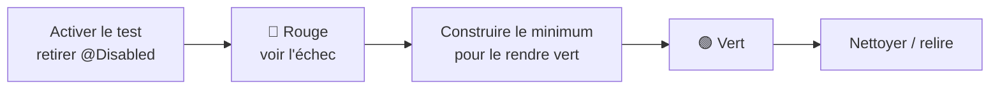

# Travail à faire

Cette page donne la **vue d'ensemble** de ce que vous avez à produire et de la **méthode** pour y
arriver. Le détail, tâche par tâche, vit dans les **issues de votre dépôt** (voir plus bas).

!!! info "Une SAE de développement d'IHM"
    L'analyse, la conception et le **socle technique** sont fournis (cf. [Analyse et conception](Analyse%20et%20conception/index.md)). Votre travail, c'est l'**interface graphique** (JavaFX / MVVM) de l'application, par-dessus des services et une base de données déjà implémentés et testés.

## Démarrer : récupérer votre dépôt d'équipe

Votre travail se fait dans un **dépôt d'équipe**, distribué via **GitHub Classroom**.

!!! abstract "Accepter le devoir (une seule fois par équipe)"
    1. Ouvrez le lien : [**Accepter la SAE VigieChiro sur GitHub Classroom**](https://classroom.github.com/a/eMEjP0tl).
    2. **Créez votre équipe** (si vous êtes le premier) ou **rejoignez** celle déjà créée par un binôme. Une seule équipe par groupe : ne recréez pas une équipe qui existe déjà.
    3. GitHub crée votre dépôt `vigiechiro-pr-companion-<votre-équipe>` et vous y donne accès.

    Au premier démarrage, le dépôt se remplit tout seul : **toutes les tâches** y arrivent sous forme d'**issues** et un **tableau de projet** (kanban) leur est associé (voir [plus bas](#suivre-votre-avancement-le-tableau-de-projet)).

## Ce qui est fourni vs ce que vous construisez

Votre dépôt est une application **qui démarre déjà**. Pour vous donner un **modèle complet à imiter**,
une feature entière est **livrée construite** : la gestion des **sites** (`M-Sites` + détail d'un
site). L'**accueil** (le « chrome » de l'application) aussi. Pour toutes les features, le **modèle**,
la couche d'accès aux données (**DAO**), les **services** métier et la **navigation** sont fournis.

Pour les **8 autres features**, vous écrivez l'IHM, soit **trois choses par écran** :

1. le **ViewModel** (`…ViewModel.java`) : propriétés observables et signatures fournies, vous écrivez
   le **corps** des méthodes ;
2. la **vue FXML** (`….fxml`) : aujourd'hui un *placeholder* « à construire », vous écrivez la vraie
   mise en page ;
3. le **controleur** (`…Controller.java`) : une coquille, vous reliez les `@FXML` au ViewModel.

## Les écrans à construire

| Feature | Écran | Parcours | Priorité |
|---|---|---|---|
| `sites` | [M-Sites](Analyse%20et%20conception/Maquettes/M-Sites.md) + [détail](Analyse%20et%20conception/Maquettes/M-Site-detail.md) | [P1](Analyse%20et%20conception/Parcours%20utilisateurs/P1%20-%20D%C3%A9clarer%20un%20site%20de%20suivi.md) | ✅ **Fourni** (référence à imiter) |
| `importation` | [M-Import](Analyse%20et%20conception/Maquettes/M-Import.md) (assistant) | [P2](Analyse%20et%20conception/Parcours%20utilisateurs/P2%20-%20Importer%20une%20nuit%20d%27enregistrement.md) | 🟥 MUST |
| `passage` | [M-Passage](Analyse%20et%20conception/Maquettes/M-Passage.md) (écran pivot) + modale | [pivot](Analyse%20et%20conception/Parcours%20utilisateurs/P0%20-%20Premi%C3%A8re%20nuit%20de%20Marie.md) | 🟥 MUST |
| `qualification` | [M-Qualification](Analyse%20et%20conception/Maquettes/M-Qualification.md) | [P3](Analyse%20et%20conception/Parcours%20utilisateurs/P3%20-%20V%C3%A9rifier%20l%27enregistrement%20par%20%C3%A9chantillonnage.md) | 🟥 MUST |
| `lot` | [M-Lot](Analyse%20et%20conception/Maquettes/M-Lot.md) | [P4](Analyse%20et%20conception/Parcours%20utilisateurs/P4%20-%20Pr%C3%A9parer%20un%20lot%20pr%C3%AAt%20%C3%A0%20d%C3%A9poser.md) | 🟥 MUST |
| `multisite` | [M-MultiSite](Analyse%20et%20conception/Maquettes/M-MultiSite.md) + modale | [P5](Analyse%20et%20conception/Parcours%20utilisateurs/P5%20-%20Naviguer%20dans%20plusieurs%20sites%20et%20passages.md) | 🟧 SHOULD |
| `diagnostic` | [M-Diagnostic](Analyse%20et%20conception/Maquettes/M-Diagnostic.md) | [P6](Analyse%20et%20conception/Parcours%20utilisateurs/P6%20-%20Diagnostiquer%20le%20mat%C3%A9riel.md) | 🟧 SHOULD |
| `validation` | [M-Vision-Tadarida](Analyse%20et%20conception/Maquettes/M-Vision-Tadarida.md) | [P7](Analyse%20et%20conception/Parcours%20utilisateurs/P7%20-%20Valider%20les%20r%C3%A9sultats%20Tadarida.md) | 🟧 SHOULD |
| `bibliotheque` | [M-Bibliotheque](Analyse%20et%20conception/Maquettes/M-Bibliotheque.md) | [P10](Analyse%20et%20conception/Parcours%20utilisateurs/P10%20-%20Exporter%20une%20biblioth%C3%A8que%20de%20sons%20de%20r%C3%A9f%C3%A9rence.md) | 🟩 COULD |

> Le **fil rouge** de la SAE (importer → vérifier → déposer → valider) repose sur les features MUST +
> l'écran pivot `passage`. Visez d'abord ce fil rouge complet, puis les SHOULD, puis les COULD.

## La méthode : TDD à petits pas, une tâche = un fichier

Chaque feature est livrée avec un **test d'acceptation désactivé** (`@Disabled`). Le test est votre
**cahier des charges exécutable** :

Le travail est **découpé en issues, une par fichier** : chaque issue ne demande de modifier **qu'un
seul fichier**. Vous les faites **dans l'ordre des numéros**. Pour chaque feature, une **issue
chapeau** donne la vue d'ensemble de l'écran, puis les issues « fichier » détaillent chaque étape
(ViewModel → vue → controleur).

!!! tip "Vos tâches sont déjà dans votre dépôt"
    Au premier démarrage, votre dépôt d'équipe reçoit automatiquement **toutes les tâches sous forme
    d'issues GitHub** (onglet *Issues*). **Commencez par l'issue « 🦇 Bienvenue »**, qui rappelle la
    méthode et l'ordre conseillé.

**Ordre conseillé** (du plus simple au plus complet) :
`diagnostic → lot → bibliotheque → validation → importation → qualification → multisite → passage`.
On garde `passage` (l'écran pivot) **pour la fin** : une fois construit, il relie tous les écrans et
le fil rouge complet passe au vert.

## Le workflow de livraison

Une tâche = une **branche** → une **Pull Request** → une **revue** par un binôme → un **merge** (CI
verte). Les conventions (Git Flow, Conventional Commits, revue obligatoire) sont détaillées dans les
[Consignes générales](Consignes%20générales.md#conventions-git-et-workflow).

!!! warning "Définition de « terminé » (Definition of Done)"
    Une tâche n'est **finie** que si : le test d'acceptation concerné est **vert**, la suite **ne
    régresse pas**, le code **compile** et **Spotless** est content, le **MVVM** est respecté (tests
    ArchUnit verts), et la modification est passée par une **PR relue**. Chaque issue rappelle ses
    critères d'acceptation et sa DoD.

## Suivre votre avancement : le tableau de projet

Votre dépôt est relié à un **tableau de projet GitHub** (onglet *Projects* du dépôt, ou la barre
latérale de votre équipe). Chaque tâche y est une **carte**, répartie en colonnes :

| Colonne | Signification |
|---|---|
| **Backlog** | tâche pas encore commencée |
| **Ready** | prête à être prise en charge (vous la déplacez ici quand vous décidez de l'attaquer) |
| **In progress** | en cours : une Pull Request référence l'issue |
| **In review** | la PR est prête, en attente de revue par un binôme |
| **Done** | terminée : PR mergée (ou issue fermée) |

!!! tip "Le tableau se met à jour tout seul"
    Vous n'avez quasiment rien à gérer à la main. Au fil de votre flux Git, les cartes se déplacent
    automatiquement :

    - vous ouvrez une **PR** qui référence l'issue (`Closes #12`) -> la carte passe en **In progress** ;
    - vous marquez la PR **prête pour revue** -> elle passe en **In review** ;
    - la PR est **mergée** -> elle passe en **Done**.

    Le seul geste manuel utile : déplacer une carte de **Backlog** vers **Ready** quand votre équipe
    planifie ce qu'elle attaque ensuite.

### Le tableau de bord de la promo (leaderboard)

Au-delà de votre propre tableau de projet, un **tableau de bord public** agrège l'avancement de
**toutes les équipes** : tests au vert (la *Definition of Done*), issues réalisées (MUST / SHOULD /
COULD), revues de code et statistiques par contributeur. C'est votre **leaderboard** : situez votre
équipe par rapport aux autres et suivez votre progression au fil des jours.

➡️ **[Ouvrir le tableau de bord](https://iutinfoaix-s201.github.io/tableau-de-bord/)**

## Les passes finales (à mener en fin de projet)

Au-delà des écrans, des **issues de vérification / passe finale** verrouillent la qualité :

- **Parcours de bout en bout (E2E)** : réactiver les tests qui traversent plusieurs écrans.
- **Objectifs qualité** : formatage (Spotless), *code smells* (PMD), couverture (JaCoCo), architecture
  (ArchUnit) — voir [Objectifs qualités](Objectifs%20qualités/index.md).
- **Vérification de l'application** : lancer l'appli et naviguer dans tous les écrans.
- **Accessibilité / ergonomie** (ISO 25010) : opérabilité clavier, affordance, retours d'action.
- **Documentation** : doc-comments, README d'équipe, galerie d'aperçus à jour.
- **Performances réelles** : mesurer sur machine IUT avec les bancs fournis et comparer aux cibles
  [O3](Objectifs%20qualités/Objectifs%20qualités/O3.md) / [O5](Objectifs%20qualités/Objectifs%20qualités/O5.md).

## Pour aller plus loin (optionnel)

Si votre équipe a terminé le travail obligatoire, des **propositions d'extension** (issues `e…`)
prolongent les features de bout en bout (ZIP de dépôt Tadarida, robustesse d'import, normalisation
sonore, optimisation mémoire…). Elles sont **facultatives** : choisissez selon l'envie et le temps.
