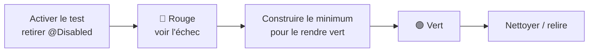

# Travail à faire

Cette page donne la **vue d'ensemble** de ce que vous avez à produire et de la **méthode** pour y
arriver. Le détail, tâche par tâche, vit dans les **issues de votre dépôt** (voir plus bas).

!!! info "Une SAE de développement d'IHM"
    L'analyse, la conception et le **socle technique** sont fournis (cf. [Analyse et conception](Analyse%20et%20conception/index.md)). Votre travail, c'est l'**interface graphique** (JavaFX / MVVM) de l'application, par-dessus des services et une base de données déjà implémentés et testés.

## Ce qui est fourni vs ce que vous construisez

Votre dépôt est une application **qui démarre déjà**. Pour vous donner un **modèle complet à imiter**,
une feature entière est **livrée construite** : la gestion des **sites** (`M-Sites` + détail d'un
site). L'**accueil** (le « chrome » de l'application) aussi. Pour toutes les features, le **modèle**,
la couche d'accès aux données (**DAO**), les **services** métier et la **navigation** sont fournis.

Pour les **8 autres features**, vous écrivez l'IHM, soit **trois choses par écran** :

1. le **ViewModel** (`…ViewModel.java`) : propriétés observables et signatures fournies, vous écrivez
   le **corps** des méthodes ;
2. la **vue FXML** (`….fxml`) : aujourd'hui un *placeholder* « à construire », vous écrivez la vraie
   mise en page ;
3. le **controleur** (`…Controller.java`) : une coquille, vous reliez les `@FXML` au ViewModel.

## Les écrans à construire

| Feature | Écran | Parcours | Priorité |
|---|---|---|---|
| `sites` | M-Sites + détail | [P1](Analyse%20et%20conception/Parcours%20utilisateurs/index.md) | ✅ **Fourni** (référence à imiter) |
| `importation` | M-Import (assistant) | P2 | 🟥 MUST |
| `passage` | M-Passage (écran pivot) + modale | pivot | 🟥 MUST |
| `qualification` | M-Qualification | P3 | 🟥 MUST |
| `lot` | M-Lot | P4 | 🟥 MUST |
| `multisite` | M-Multisite + modale | P5 | 🟧 SHOULD |
| `diagnostic` | M-Diagnostic | P6 | 🟧 SHOULD |
| `validation` | M-Vision-Tadarida | P7 | 🟧 SHOULD |
| `bibliotheque` | M-Bibliotheque | P10 | 🟩 COULD |

> Le **fil rouge** de la SAE (importer → vérifier → déposer → valider) repose sur les features MUST +
> l'écran pivot `passage`. Visez d'abord ce fil rouge complet, puis les SHOULD, puis les COULD.

## La méthode : TDD à petits pas, une tâche = un fichier

Chaque feature est livrée avec un **test d'acceptation désactivé** (`@Disabled`). Le test est votre
**cahier des charges exécutable** :

Le travail est **découpé en issues, une par fichier** : chaque issue ne demande de modifier **qu'un
seul fichier**. Vous les faites **dans l'ordre des numéros**. Pour chaque feature, une **issue
chapeau** donne la vue d'ensemble de l'écran, puis les issues « fichier » détaillent chaque étape
(ViewModel → vue → controleur).

!!! tip "Vos tâches sont déjà dans votre dépôt"
    Au premier démarrage, votre dépôt d'équipe reçoit automatiquement **toutes les tâches sous forme
    d'issues GitHub** (onglet *Issues*). **Commencez par l'issue « 🦇 Bienvenue »**, qui rappelle la
    méthode et l'ordre conseillé.

**Ordre conseillé** (du plus simple au plus complet) :
`diagnostic → lot → bibliotheque → validation → importation → qualification → multisite → passage`.
On garde `passage` (l'écran pivot) **pour la fin** : une fois construit, il relie tous les écrans et
le fil rouge complet passe au vert.

## Le workflow de livraison

Une tâche = une **branche** → une **Pull Request** → une **revue** par un binôme → un **merge** (CI
verte). Les conventions (Git Flow, Conventional Commits, revue obligatoire) sont détaillées dans les
[Consignes générales](Consignes%20générales.md#conventions-git-et-workflow).

!!! warning "Définition de « terminé » (Definition of Done)"
    Une tâche n'est **finie** que si : le test d'acceptation concerné est **vert**, la suite **ne
    régresse pas**, le code **compile** et **Spotless** est content, le **MVVM** est respecté (tests
    ArchUnit verts), et la modification est passée par une **PR relue**. Chaque issue rappelle ses
    critères d'acceptation et sa DoD.

## Les passes finales (à mener en fin de projet)

Au-delà des écrans, des **issues de vérification / passe finale** verrouillent la qualité :

- **Parcours de bout en bout (E2E)** : réactiver les tests qui traversent plusieurs écrans.
- **Objectifs qualité** : formatage (Spotless), *code smells* (PMD), couverture (JaCoCo), architecture
  (ArchUnit) — voir [Objectifs qualités](Objectifs%20qualités/index.md).
- **Vérification de l'application** : lancer l'appli et naviguer dans tous les écrans.
- **Accessibilité / ergonomie** (ISO 25010) : opérabilité clavier, affordance, retours d'action.
- **Documentation** : doc-comments, README d'équipe, galerie d'aperçus à jour.
- **Performances réelles** : mesurer sur machine IUT avec les bancs fournis et comparer aux cibles
  [O3](Objectifs%20qualités/Objectifs%20qualités/O3.md) / [O5](Objectifs%20qualités/Objectifs%20qualités/O5.md).

## Pour aller plus loin (optionnel)

Si votre équipe a terminé le travail obligatoire, des **propositions d'extension** (issues `e…`)
prolongent les features de bout en bout (ZIP de dépôt Tadarida, robustesse d'import, normalisation
sonore, optimisation mémoire…). Elles sont **facultatives** : choisissez selon l'envie et le temps.
