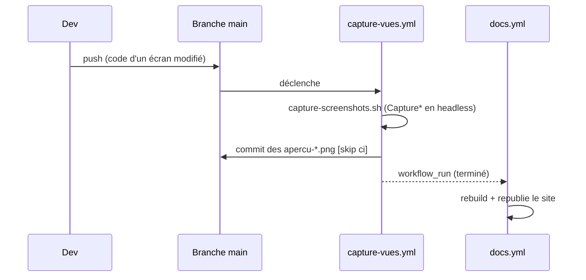

# Captures d'écran (harnais)

Les **aperçus PNG** (`.github/assets/apercu-*.png`) illustrent la documentation utilisateur. Ils sont
**régénérés depuis le code** à chaque évolution des écrans, pour ne **jamais se désynchroniser** de
l'application réelle. Tout est rendu **hors-écran** (Headless Platform JavaFX) : aucun display requis.

!!! tip "Une capture, ça se regarde"
    Un aperçu n'est pas qu'un livrable de doc : c'est le **seul endroit où l'on voit** ce qu'un test ne
    dit pas (texte tronqué, glyphe absent, style cassé). D'où la **passe de revue visuelle** en clôture
    de chantier, cf. [Cycle de vie d'un chantier](cycle-de-chantier.md#8-passe-de-revue-visuelle).

## Rendre une scène hors-écran : `ApercuFx`

[`ApercuFx`](https://github.com/echonuit/vigiechiro-pr-companion/blob/main/src/main/java/fr/univ_amu/iut/commun/outils/ApercuFx.java)
est la brique de base : elle attache une `Scene` à un `Stage` transitoire (montré brièvement pour une
passe de layout/CSS complète, p. ex. peupler une `TableView` virtualisée), capture via
`Scene.snapshot()`, écrit le PNG, puis referme le stage. Déterministe.

Pour les écrans à **écoute audio**, dont l'`AudioView` charge son WAV de façon **asynchrone**, on
utilise `ApercuFx.capturerApresPreparation(...)` : le `Stage` est montré **avant** une préparation
asynchrone, puis on `snapshot` **sans recréer de Stage** (la Headless Platform JavaFX 26 refuse un
`new Stage()` après une boucle d'évènements imbriquée). Couplée à
[`AttenteAudio`](https://github.com/echonuit/vigiechiro-pr-companion/blob/main/src/main/java/fr/univ_amu/iut/commun/outils/AttenteAudio.java)
(attend la fin du chargement) et
[`SonDemo`](https://github.com/echonuit/vigiechiro-pr-companion/blob/main/src/main/java/fr/univ_amu/iut/commun/outils/SonDemo.java)
(WAV de synthèse), elle produit un **spectrogramme réel** dans la capture.

## Un outil de capture par écran : `Capture*`

Chaque feature a un `outils/Capture<Feature>.java` exécutable comme **`main` autonome** : il seede une
base SQLite **jetable**, charge le FXML via une `controllerFactory` Guice, peuple l'écran, puis le rend
par `ApercuFx`. Souvent en **deux états** (vide / peuplé) pour montrer les cas pertinents.

!!! danger "Déterminisme = règle d'or"
    Les PNG sont **versionnés** : un rendu non déterministe salirait le dépôt à chaque CI. Signaux de
    synthèse (cf. `SonDemo`), pas d'horodatage réel, attente explicite des chargements asynchrones.

## La régénération en CI

[`capture-screenshots.sh`](https://github.com/echonuit/vigiechiro-pr-companion/blob/main/.github/assets/capture-screenshots.sh)
compile puis lance **chaque `Capture*` dans son propre JVM**, avec les drapeaux headless
(`-Dglass.platform=Headless -Dprism.order=sw -Djava.awt.headless=true`). Le workflow
[`capture-vues.yml`](https://github.com/echonuit/vigiechiro-pr-companion/blob/main/.github/workflows/capture-vues.yml)
l'exécute à chaque push sur `main` et **commite** les PNG mis à jour (via une PR auto-mergée, message
`[skip ci]`). Le workflow `docs.yml` **republie** ensuite le site (déclencheur `workflow_run`), pour
que les images en ligne suivent le code.

## Les garde-fous de présence

Deux scripts vérifient qu'aucune vue ne vit sans aperçu, et qu'aucune page ne pointe une image
absente (lancés en CI) :

| Garde | Vérifie |
|---|---|
| [`check-captures.sh`](https://github.com/echonuit/vigiechiro-pr-companion/blob/main/.github/assets/check-captures.sh) | Chaque vue FXML `src/main/**/view/*.fxml` est **déclarée** au `captures.manifest`, et chaque capture déclarée existe. *(Aucune vue livrée sans capture.)* |
| [`check-doc-images.sh`](https://github.com/echonuit/vigiechiro-pr-companion/blob/main/.github/assets/check-doc-images.sh) | Chaque capture **référencée par une page de doc** existe et est au manifeste. *(Aucune page ne pointe une image absente.)* |

Le [`captures.manifest`](https://github.com/echonuit/vigiechiro-pr-companion/blob/main/.github/assets/captures.manifest)
associe chaque vue FXML à ses aperçus.

## Le garde-fou de fidélité : un aperçu qui ment est refusé

Les garde-fous ci-dessus vérifient qu'une capture **existe**. Celui-ci vérifie qu'elle **ne ment
pas**. Il vit dans `ApercuFx`, au moment du rendu, et **interrompt** la chaîne : un aperçu déformé
n'est pas écrit.

L'application monte ses vues dans un `ScrollPane` permanent — ce qui déborde **défile**. La capture
rend une scène de taille fixe et n'a pas ce recours : ce qui déborde se **déforme**, de deux façons
que le message d'erreur distingue.

| Dans le message | Ce qui se passe | Remèdes |
|---|---|---|
| `manque N px` | La scène est trop **courte** : un libellé `wrapText` se rabat sur une ligne et s'ellipse | Augmenter la hauteur de cette scène |
| `tronque, manque N px` | Le contrôle est trop **étroit** pour son texte | Figer par `minWidth="-Infinity"`, élargir la colonne, ou assumer par `abregeable` |

**`minWidth="-Infinity"`** est le remède le plus fréquent. La largeur *minimale* d'un `Labeled`
autorise la troncature : une `HBox` en déficit rogne donc les libellés d'action plutôt que les
sélecteurs et champs de recherche qui les entourent. Le figer inverse cette priorité — le déficit se
reporte sur les voisins souples, qui se resserrent sans rien perdre de lisible.

L'attribut se pose **dans le FXML**, sur le nœud qui est enfant direct du conteneur qui rogne (donc
sur l'enveloppe `StackPane` quand le bouton en porte une). C'est un idiome répandu dans le dépôt,
notamment dans les modales.

!!! note "Pourquoi pas une classe CSS ?"
    On ne peut pas. `-fx-min-width: -Infinity` **parse sans erreur** mais donne `-1.0`, c'est-à-dire
    `USE_COMPUTED_SIZE` — exactement le comportement qu'on cherche à éviter — au lieu de
    `USE_PREF_SIZE`. Mesuré. L'attribut FXML est le seul moyen d'exprimer cette contrainte.

**`abregeable`** est une classe CSS **marqueur**, sans règle de style — ne pas la supprimer comme
CSS morte. Elle déclare, *dans la vue*, quel libellé porte le déficit : le figer partout ne fait pas
rentrer le contenu d'une barre, cela le fait déborder. La règle est de désigner un sélecteur ou une
métadonnée (qui se relisent ailleurs) plutôt qu'un libellé d'action (qui ne se relit nulle part). La
tolérance s'hérite jusqu'aux libellés internes des contrôles composés (`ComboBox`, `MenuButton`).

**Le contrôle ne connaît pas d'exception par composant.** Le sous-arbre d'`AudioView` a été exclu un
temps, parce que sa barre de transport tronquait et qu'aucun FXML d'ici n'y pouvait rien. Le défaut a
été corrigé en amont (audio-view#56, publié en 1.15.1) et l'exclusion retirée. Si un composant tiers
redevenait infixable, la même mesure s'imposerait — mais tant qu'une chaîne *peut* être verte, mieux
vaut la garder voyante : une régression amont se signale alors d'elle-même.

!!! warning "Le poste de développement sous-mesure"
    Les polices d'un poste et celles d'un runner de CI **ne mesurent pas le texte à l'identique** :
    l'écart va jusqu'à 6 px, soit l'ordre de grandeur des défauts eux-mêmes. Une chaîne verte en local
    peut être rouge en CI, et l'a été. Deux conséquences pratiques : une correction de dimension prend
    une **marge d'une dizaine de pixels** plutôt que le chiffre mesuré ; et pour inventorier, rendre le
    contrôle **non bloquant** le temps d'un seul passage de CI vaut mieux qu'une série d'allers-retours,
    puisqu'il s'arrête au premier écran fautif. Voir
    [ADR 0043](decisions/0043-la-mesure-fait-foi-en-ci.md) et
    [ADR 0042](decisions/0042-un-apercu-qui-ment-est-refuse.md).

### Capturer un dialogue : pré-enrouler les textes longs

Un dialogue se capture **hors `showAndWait`** — on veut l'image, pas la modale bloquante. Dans cet
état, **rien ne borne la largeur du contenu** d'un `DialogPane` : un libellé `wrapText` long y garde
sa largeur d'une ligne, déborde, et se fait couper par une ellipse. La mise en page ne le rattrape pas
— imposer la largeur du dialogue ne se propage pas à son contenu, et la hauteur d'un libellé
enroulable se calcule à sa largeur *préférée*, pas à sa largeur réelle (mesuré en #2243).

Le remède est **à la source** : pré-découper le texte aux espaces avant de rendre, sans en changer un
mot.

- **message texte** : `CaptureConfirmationsImport#enrouler(String)` ;
- **compte rendu structuré** : `CaptureConfirmationsImport#enrouler(CompteRendu)`, qui réenroule le
  fait de chaque constat, ses détails, le préambule et la conclusion.

!!! danger "Le garde-fou ne voit pas cette troncature-là"
    Le contrôle de fidélité ci-dessus **ne l'attrape pas** : sa mesure verticale retombe sur la même
    hauteur d'une ligne (l'écart vaut zéro), et sa mesure horizontale exclut par principe les libellés
    enroulables. Aucun contrôle géométrique ne referme ce trou de façon fiable — toute construction
    reproductible s'enroule correctement, ou déclenche déjà la mesure verticale (six essais instrumentés
    en #2265). **Une capture de dialogue vert ne prouve donc pas que son texte long est lisible** :
    l'ouvrir reste le seul contrôle, ce que fait la passe de revue visuelle.

## Ajouter une capture

La marche à suivre (nouvel écran) est dans
**[Ajouter une fonctionnalité §7](ajouter-une-fonctionnalite.md#7-ajouter-un-apercu-capture-decran)** :
écrire `CaptureMaFeature` sur le patron existant, l'ajouter à `capture-screenshots.sh`, et déclarer
l'aperçu au `captures.manifest`.

**La capture principale montre le cas nominal ; chaque état particulier a la sienne.** Une vue en a
souvent plusieurs (donnée absente, GPS non renseigné, alerte levée…). Le seed de la capture principale
doit produire l'état **ordinaire**, et chaque écart obtenir sa capture **dédiée**, avec sa section dans
la doc utilisateur. Sinon un état particulier s'installe **par accident** dans l'image de référence : le
Diagnostic illustrait sa page avec une nuit *hors nuit*, l'alerte y était visible sans être ni nommée ni
documentée, et un simple ajustement des horaires du seed l'aurait fait disparaître sans que personne ne
le voie (#2222). Un état montré **incidemment** est presque aussi fragile qu'un état montré nulle part.

!!! note "Exposées au site via un hook"
    Les PNG vivent dans `.github/assets/` ; le hook
    [`scripts/mkdocs_hooks.py`](https://github.com/echonuit/vigiechiro-pr-companion/blob/main/scripts/mkdocs_hooks.py)
    les expose sous `assets/captures/` au build du site utilisateur.
