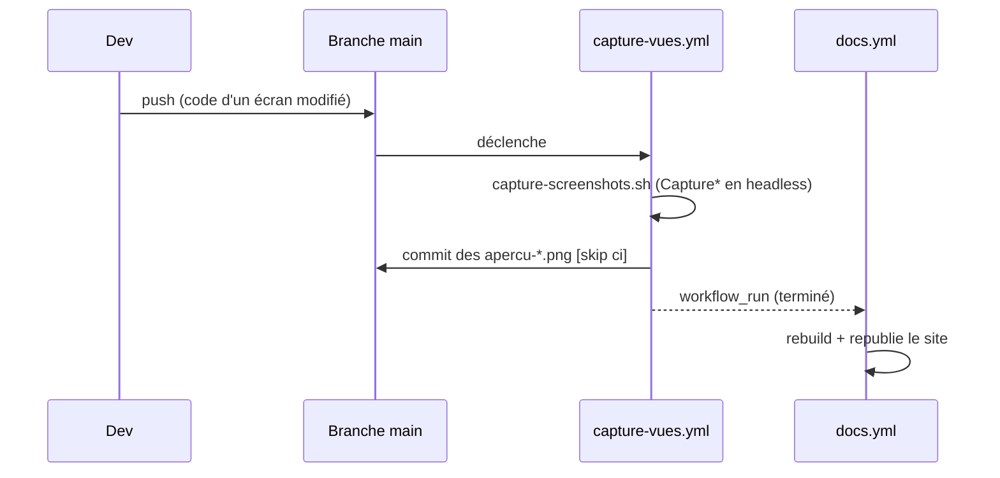

# Captures d'écran (harnais)

Les **aperçus PNG** (`.github/assets/apercu-*.png`) illustrent la documentation utilisateur. Ils sont
**régénérés depuis le code** à chaque évolution des écrans, pour ne **jamais se désynchroniser** de
l'application réelle. Tout est rendu **hors-écran** (Headless Platform JavaFX) : aucun display requis.

!!! tip "Une capture, ça se regarde"
    Un aperçu n'est pas qu'un livrable de doc : c'est le **seul endroit où l'on voit** ce qu'un test ne
    dit pas (texte tronqué, glyphe absent, style cassé). D'où la **passe de revue visuelle** en clôture
    de chantier, cf. [Cycle de vie d'un chantier](cycle-de-chantier.md#8-passe-de-revue-visuelle).

## Rendre une scène hors-écran : `ApercuFx`

[`ApercuFx`](https://github.com/IUTInfoAix-S201/vigiechiro-pr-companion/blob/main/src/main/java/fr/univ_amu/iut/commun/outils/ApercuFx.java)
est la brique de base : elle attache une `Scene` à un `Stage` transitoire (montré brièvement pour une
passe de layout/CSS complète, p. ex. peupler une `TableView` virtualisée), capture via
`Scene.snapshot()`, écrit le PNG, puis referme le stage. Déterministe.

Pour les écrans à **écoute audio**, dont l'`AudioView` charge son WAV de façon **asynchrone**, on
utilise `ApercuFx.capturerApresPreparation(...)` : le `Stage` est montré **avant** une préparation
asynchrone, puis on `snapshot` **sans recréer de Stage** (la Headless Platform JavaFX 26 refuse un
`new Stage()` après une boucle d'évènements imbriquée). Couplée à
[`AttenteAudio`](https://github.com/IUTInfoAix-S201/vigiechiro-pr-companion/blob/main/src/main/java/fr/univ_amu/iut/commun/outils/AttenteAudio.java)
(attend la fin du chargement) et
[`SonDemo`](https://github.com/IUTInfoAix-S201/vigiechiro-pr-companion/blob/main/src/main/java/fr/univ_amu/iut/commun/outils/SonDemo.java)
(WAV de synthèse), elle produit un **spectrogramme réel** dans la capture.

## Un outil de capture par écran : `Capture*`

Chaque feature a un `outils/Capture<Feature>.java` exécutable comme **`main` autonome** : il seede une
base SQLite **jetable**, charge le FXML via une `controllerFactory` Guice, peuple l'écran, puis le rend
par `ApercuFx`. Souvent en **deux états** (vide / peuplé) pour montrer les cas pertinents.

!!! danger "Déterminisme = règle d'or"
    Les PNG sont **versionnés** : un rendu non déterministe salirait le dépôt à chaque CI. Signaux de
    synthèse (cf. `SonDemo`), pas d'horodatage réel, attente explicite des chargements asynchrones.

## La régénération en CI

[`capture-screenshots.sh`](https://github.com/IUTInfoAix-S201/vigiechiro-pr-companion/blob/main/.github/assets/capture-screenshots.sh)
compile puis lance **chaque `Capture*` dans son propre JVM**, avec les drapeaux headless
(`-Dglass.platform=Headless -Dprism.order=sw -Djava.awt.headless=true`). Le workflow
[`capture-vues.yml`](https://github.com/IUTInfoAix-S201/vigiechiro-pr-companion/blob/main/.github/workflows/capture-vues.yml)
l'exécute à chaque push sur `main` et **commite** les PNG mis à jour (via une PR auto-mergée, message
`[skip ci]`). Le workflow `docs.yml` **republie** ensuite le site (déclencheur `workflow_run`), pour
que les images en ligne suivent le code.

## Les deux garde-fous

Deux scripts protègent la cohérence (lancés en CI) :

| Garde | Vérifie |
|---|---|
| [`check-captures.sh`](https://github.com/IUTInfoAix-S201/vigiechiro-pr-companion/blob/main/.github/assets/check-captures.sh) | Chaque vue FXML `src/main/**/view/*.fxml` est **déclarée** au `captures.manifest`, et chaque capture déclarée existe. *(Aucune vue livrée sans capture.)* |
| [`check-doc-images.sh`](https://github.com/IUTInfoAix-S201/vigiechiro-pr-companion/blob/main/.github/assets/check-doc-images.sh) | Chaque capture **référencée par une page de doc** existe et est au manifeste. *(Aucune page ne pointe une image absente.)* |

Le [`captures.manifest`](https://github.com/IUTInfoAix-S201/vigiechiro-pr-companion/blob/main/.github/assets/captures.manifest)
associe chaque vue FXML à ses aperçus.

## Ajouter une capture

La marche à suivre (nouvel écran) est dans
**[Ajouter une fonctionnalité §7](ajouter-une-fonctionnalite.md#7-ajouter-un-apercu-capture-decran)** :
écrire `CaptureMaFeature` sur le patron existant, l'ajouter à `capture-screenshots.sh`, et déclarer
l'aperçu au `captures.manifest`.

!!! note "Exposées au site via un hook"
    Les PNG vivent dans `.github/assets/` ; le hook
    [`scripts/mkdocs_hooks.py`](https://github.com/IUTInfoAix-S201/vigiechiro-pr-companion/blob/main/scripts/mkdocs_hooks.py)
    les expose sous `assets/captures/` au build du site utilisateur.
