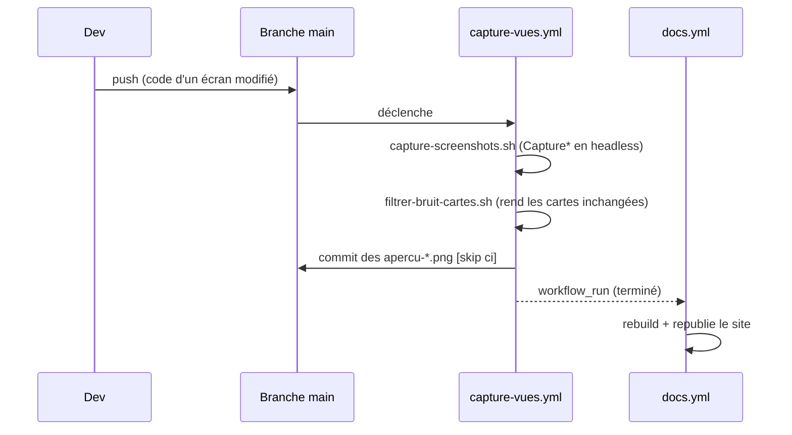

# Captures d'écran (harnais)

Les **aperçus PNG** (`.github/assets/apercu-*.png`) illustrent la documentation utilisateur. Ils sont
**régénérés depuis le code** à chaque évolution des écrans, pour ne **jamais se désynchroniser** de
l'application réelle. Tout est rendu **hors-écran** (Headless Platform JavaFX) : aucun display requis.

!!! tip "Une capture, ça se regarde"
    Un aperçu n'est pas qu'un livrable de doc : c'est le **seul endroit où l'on voit** ce qu'un test ne
    dit pas (texte tronqué, glyphe absent, style cassé). D'où la **passe de revue visuelle** en clôture
    de chantier, cf. [Cycle de vie d'un chantier](cycle-de-chantier.md#8-passe-de-revue-visuelle).

## Rendre une scène hors-écran : `ApercuFx`

[`ApercuFx`](https://github.com/echonuit/vigiechiro-pr-companion/blob/main/src/main/java/fr/univ_amu/iut/commun/outils/ApercuFx.java)
est la brique de base : elle attache une `Scene` à un `Stage` transitoire (montré brièvement pour une
passe de layout/CSS complète, p. ex. peupler une `TableView` virtualisée), capture via
`Scene.snapshot()`, écrit le PNG, puis referme le stage. Déterministe.

Pour les écrans à **écoute audio**, dont l'`AudioView` charge son WAV de façon **asynchrone**, on
utilise `ApercuFx.capturerApresPreparation(...)` : le `Stage` est montré **avant** une préparation
asynchrone, puis on `snapshot` **sans recréer de Stage** (la Headless Platform JavaFX 26 refuse un
`new Stage()` après une boucle d'évènements imbriquée). Couplée à
[`AttenteAudio`](https://github.com/echonuit/vigiechiro-pr-companion/blob/main/src/main/java/fr/univ_amu/iut/commun/outils/AttenteAudio.java)
(attend la fin du chargement) et
[`SonDemo`](https://github.com/echonuit/vigiechiro-pr-companion/blob/main/src/main/java/fr/univ_amu/iut/commun/outils/SonDemo.java)
(WAV de synthèse), elle produit un **spectrogramme réel** dans la capture.

## Un outil de capture par écran : `Capture*`

Chaque feature a un `outils/Capture<Feature>.java` exécutable comme **`main` autonome** : il seede une
base SQLite **jetable**, charge le FXML via une `controllerFactory` Guice, peuple l'écran, puis le rend
par `ApercuFx`. Souvent en **deux états** (vide / peuplé) pour montrer les cas pertinents.

!!! danger "Déterminisme = règle d'or"
    Les PNG sont **versionnés** : un rendu non déterministe salirait le dépôt à chaque CI. Signaux de
    synthèse (cf. `SonDemo`), pas d'horodatage réel, attente explicite des chargements asynchrones.

    La règle porte sur **ce que le produit rend**. Une entrée **extérieure** au dépôt n'y est pas
    soumise : voir l'exception des tuiles ci-dessous, qui est la seule.

    **Un aperçu pose ce qu'il ne peut pas reproduire**
    ([ADR 3483](decisions/3483-un-apercu-pose-ce-qu-il-ne-peut-pas-reproduire.md)). Une capture
    construit sa base, épingle son fuseau, impose sa locale : tout cela, elle le maîtrise. Le **temps
    qui passe**, non. Un état de progression se pose donc avec son écoulé,
    `progression.appliquer(point, Duration.ofMillis(2500))`, jamais avec la surcharge qui lit
    l'horloge - sinon c'est la vitesse de la machine qui écrit le chiffre affiché. Gardé par
    `ArchitectureTest#capture_pose_son_temps_ecoule`, qui refuse l'appel dans tout `..outils..`.

#### L'exception assumée : les tuiles OpenStreetMap

Les aperçus qui montrent une carte **varient d'un build à l'autre**, sans qu'aucun code ne change. Il
n'en existe plus de liste écrite : depuis #3439, chaque rendu **dépose** le rectangle de sa carte à
côté du PNG (`apercu-<nom>.png.carte`), et le filtre le lit aussitôt. Le compte se constate donc à
l'exécution - **19** zones au dernier relevé, quand la liste tenue à la main en déclarait **16**.

C'est mesuré, pas supposé - et le chiffre a été **revu à la hausse** en cartographiant les écarts entre
les **30** versions successives d'`apercu-analyse-carte` (2026-08-05, 435 paires) : médiane **1,22 %**,
maximum **2,51 %**. Le **0,34 %** annoncé auparavant venait d'un échantillon plus étroit et
sous-estimait l'amplitude réelle. Une tuile absente en ferait 9,5 % : il ne s'agit donc pas d'un
chargement incomplet, mais du **rendu servi par OpenStreetMap**, qui n'est pas identique à chaque
requête.

⚠️ Cette même matrice montre que les versions **n'errent pas au hasard** : 30 versions se réduisent à
**18 états distincts**, dont un revenant **7 fois** à des dates non consécutives. La variation est donc
**discrète**, ce qu'un bruit de rendu continu ne produirait jamais.

Aucune attente ne corrige cela, et ça a été vérifié : la condition de stabilité est satisfaite, et
porter la quiétude exigée de 0,75 s à 3 s ne change rien (#3068).

**Arbitrage : on garde la dépendance.** Ces captures valent parce qu'elles montrent une **vraie** carte,
au même titre que les autres montrent de vraies données depuis une base semée. Figer la source de tuiles
rendrait l'image plus stable et moins vraie. La variabilité résiduelle est minime et n'affecte aucun
élément produit par le dépôt.

Ce qui vient de **nous** reste donc strictement déterministe, et c'est là-dessus que la règle d'or
s'applique. Le corollaire pratique : sur un aperçu à carte, un diff **dans le rectangle** n'est pas un
signal - la revue s'y fait à l'œil. Partout ailleurs, y compris sur ces mêmes fichiers, la tolérance
est **zéro** et la comparaison se fait au `cmp` : voir
[Le bruit des cartes](#le-bruit-des-cartes-et-pourquoi-on-cesse-de-le-committer).

### L'injecteur se compose depuis la racine

Un outil compose **`RacineInjecteur.modules()`**, la liste que l'application elle-même assemble, et
s'adapte par `Modules.override(racine).with(…)` - jamais en énumérant un sous-ensemble de modules.

C'est une règle, pas une préférence, et elle est **gardée** : `CliquetInjecteurALaMainTest` fait rougir
la CI dès qu'un outil assemble sa propre liste. La raison est dans l'[ADR 3018](decisions/3018-un-outil-compose-depuis-la-racine.md) :
un injecteur amputé et une **fonctionnalité désactivée** produisent le même écran, puisque le contrôleur
masque sa surface exactement comme on le lui demande quand le flag est coupé. Une capture amputée n'a
donc pas l'air cassée - elle a l'air d'une capture d'un produit configuré autrement. Quatre écrans sont
partis dans la documentation sans leur ligne Campagne avant que ce soit vu.

Les surcharges légitimes sont celles qui rendent l'exécution **déterministe ou observable**
(`ModuleCaptureCommun.executeursSynchrones()`, horloge figée), et celle qui **est le sujet** de la
capture - par exemple un référentiel vide, quand l'aperçu montre précisément cet état.

!!! warning "Composer depuis la racine ne suffit pas si l'on bouchonne le service"
    Un outil peut très bien composer la totalité de l'application, puis substituer un service entier
    dont les lectures rendent des lignes écrites en dur : il compose tout et ne montre rien. Les deux
    aperçus de la Synthèse ont vécu ainsi, et affichaient **deux états que le produit ne peut pas
    produire** plus un contexte à trois affirmations contradictoires (#3018).

    Une capture **sème sa donnée** et laisse le produit calculer. Quand un état n'est pas atteignable
    autrement, la bonne réponse est souvent une **couture** côté production - faire d'une dépendance
    cachée un collaborateur - et non un bouchon côté outil.

## La régénération en CI

[`capture-screenshots.sh`](https://github.com/echonuit/vigiechiro-pr-companion/blob/main/.github/assets/capture-screenshots.sh)
compile puis lance **chaque `Capture*` dans son propre JVM**, avec les drapeaux headless
(`-Dglass.platform=Headless -Dprism.order=sw -Djava.awt.headless=true`). Le workflow
[`capture-vues.yml`](https://github.com/echonuit/vigiechiro-pr-companion/blob/main/.github/workflows/capture-vues.yml)
l'exécute à chaque push sur `main` et **commite** les PNG mis à jour (via une PR auto-mergée, message
`[skip ci]`). Le workflow `docs.yml` **republie** ensuite le site (déclencheur `workflow_run`), pour
que les images en ligne suivent le code.

```mermaid
sequenceDiagram
    participant Dev
    participant Main as Branche main
    participant CV as capture-vues.yml
    participant Docs as docs.yml
    Dev->>Main: push (code d'un écran modifié)
    Main->>CV: déclenche
    CV->>CV: capture-screenshots.sh (Capture* en headless)
    CV->>CV: filtrer-bruit-cartes.sh (rend les cartes inchangées)
    CV->>Main: commit des apercu-*.png [skip ci]
    CV-->>Docs: workflow_run (terminé)
    Docs->>Docs: rebuild + republie le site
```

### Le bruit des cartes, et pourquoi on cesse de le committer

Les aperçus qui portent un fond OpenStreetMap changent à **presque chaque exécution** sans qu'aucun
code n'ait bougé. Mesuré sur les 30 derniers commits d'aperçus : `apercu-analyse-carte.png` a changé
**28 fois**, `apercu-multisite-carte-pleine.png` **27**, les huit aperçus d'import **18**. L'écart est
sub-perceptible : deux versions consécutives ouvertes côte à côte sont indiscernables.

Trois coûts, dont le dernier est le seul qui compte vraiment : l'historique se remplit de commits qui
ne disent rien ; les PR d'aperçus **conflictent entre elles** en permanence (les PNG sont binaires,
git ne sait pas les fusionner) ; et le jour où une **vraie** régression touche une de ces images, elle
devient indiscernable du bruit.

[`filtrer-bruit-cartes.sh`](https://github.com/echonuit/vigiechiro-pr-companion/blob/main/.github/assets/filtrer-bruit-cartes.sh)
rend leur version committée aux aperçus de carte dont **seul le fond cartographique** a changé. Il ne
cherche pas à rendre les tuiles déterministes - elles sont une entrée **extérieure** au dépôt, et
l'ADR 3068 a tranché qu'on ne les figerait pas. Il cesse seulement de committer l'insignifiant.

### Un masque, et non plus un seuil

La première version comparait un **pourcentage de pixels** à un seuil de 4 %. Ce seuil n'a pas tenu à
la mesure : après #3375, le bruit de tuiles **seul** vaut jusqu'à **23,8 %** de l'image sur
`apercu-multisite-carte-pleine` et 9,7 % sur `apercu-multisite-edition`. Aucun pourcentage global ne
sépare le bruit du signal, puisque les deux vivent dans la même zone.

Ce que #3375 a rendu possible : **hors de la carte, la CI et un poste de développement rendent au
pixel près** - `apercu-accueil.png` sort identique au bit près, et sur `apercu-analyse-carte` les
bandes de texte tombent de 29 % et 37,9 % d'écart à **0,00 %**. La bonne question devient donc
« quelque chose a-t-il changé **hors** de la carte ? », à tolérance **zéro**.

C'est strictement mieux que le seuil : celui-ci faisait de ces fichiers un non-signal **entier** ; le
masque leur rend leur valeur de signal **partout sauf dans le rectangle de la carte**. Éprouvé : un
changement de 40x12 px hors carte, sur l'aperçu où la carte couvre 72,9 % de l'image, est **détecté**
(533 pixels) là où un seuil de 4 % ne l'aurait jamais vu.

Les rectangles sont **dérivés de la scène** au moment du rendu, plus recopiés à la main
([ADR 3439](decisions/3439-un-masque-se-derive-de-la-scene-il-ne-se-recopie-pas.md)). Une carte se
reconnaît à la classe de style `carte-sites`, `ZoneCarteApercu` en mesure les bornes pendant que la
scène est montée, et dépose un `apercu-<nom>.png.carte` que le filtre lit dans la foulée. Ces fichiers
ne sont **jamais committés** : produits et consommés dans la même exécution, les committer les ferait
vieillir, c'est-à-dire retomber dans le défaut qu'ils corrigent.

La liste tenue à la main s'était démodée dans les trois sens à la fois : elle oubliait des cartes
(16 déclarées pour 19 réelles), elle couvrait ce qui n'en était pas (**55 %** du masque de
`multisite-edition` tombait sur un tableau de données, comparé à rien), et elle avait servi à cacher
autre chose - une estimation de temps restant, corrigée depuis à sa source
([ADR 3483](decisions/3483-un-apercu-pose-ce-qu-il-ne-peut-pas-reproduire.md)).

⚠️ Ce que le masque ne voit pas : un changement **à l'intérieur** de la carte - un marqueur déplacé,
un carré recoloré. C'est l'arbitrage de l'ADR 3068, réduit au seul rectangle au lieu de toute l'image.

⚠️ `apercu-passage-rattachement.png` bougeait aussi sans porter de carte, et la cause est désormais
connue : **écrire sur disque entre le `snapshot` et la fermeture du stage** laisse passer une
validation de formulaire, ce qui change les captures **suivantes** du même outil - mesuré à
40 543 pixels. La mesure se fait pendant que la scène est montée, l'écriture après `RenduPng.ecrire`.

## Les garde-fous de présence

Deux scripts vérifient qu'aucune vue ne vit sans aperçu, et qu'aucune page ne pointe une image
absente (lancés en CI) :

| Garde | Vérifie |
|---|---|
| [`check-captures.sh`](https://github.com/echonuit/vigiechiro-pr-companion/blob/main/.github/assets/check-captures.sh) | Chaque vue FXML `src/main/**/view/*.fxml` est **déclarée** au `captures.manifest`, chaque capture déclarée existe, et chaque capture **écrite par un outil** est présentée dans la galerie. *(Aucune vue livrée sans capture, aucune capture que personne ne regarde.)* |
| [`check-doc-images.sh`](https://github.com/echonuit/vigiechiro-pr-companion/blob/main/.github/assets/check-doc-images.sh) | Chaque capture **référencée par une page de doc** existe et est au manifeste. *(Aucune page ne pointe une image absente.)* |

### Pourquoi la dernière règle lit le **code** et non le disque

Les PNG ne naissent pas dans la branche : le job `capturer` les produit sur `main`, **après** fusion.
Une règle qui part des fichiers présents sur le disque ne peut donc rien voir dans la pull request qui
ajoute une capture - le fichier n'existe pas encore, la PR passe au vert de bonne foi, et le manque
n'apparaît qu'une fois `main` **déjà rouge**.

Le coût n'est pas local à qui oublie : `lint` rougit sur `main`, donc **toutes** les PR ouvertes se
mettent à échouer, et le diagnostic part dans la mauvaise direction puisque la PR qui échoue n'a rien à
voir avec la capture manquante. C'est arrivé avec #3119, corrigé par #3126, puis fermé par #3129.

Ce qui **est** dans la branche, c'est le code de l'outil de capture. La règle y lit les noms de fichiers
écrits, en écartant les lignes de commentaire : celles-ci citent volontiers des captures **passées**
(une réplique reconstruite, remplacée depuis par un rendu réel), qui n'existent plus et n'ont rien à
faire en galerie. Les deux cas sont tenus par l'auto-test du script, positif et négatif.

Le [`captures.manifest`](https://github.com/echonuit/vigiechiro-pr-companion/blob/main/.github/assets/captures.manifest)
associe chaque vue FXML à ses aperçus.

## Le garde-fou de fidélité : un aperçu qui ment est refusé

Les garde-fous ci-dessus vérifient qu'une capture **existe**. Celui-ci vérifie qu'elle **ne ment
pas**. Il vit dans `ApercuFx`, au moment du rendu, et **interrompt** la chaîne : un aperçu déformé
n'est pas écrit.

L'application monte ses vues dans un `ScrollPane` permanent : ce qui déborde **défile**. La capture
rend une scène de taille fixe et n'a pas ce recours : ce qui déborde se **déforme**, de deux façons
que le message d'erreur distingue.

| Dans le message | Ce qui se passe | Remèdes |
|---|---|---|
| `manque N px` | La scène est trop **courte** : un libellé `wrapText` se rabat sur une ligne et s'ellipse | Augmenter la hauteur de cette scène |
| `tronque, manque N px` | Le contrôle est trop **étroit** pour son texte | Figer par `minWidth="-Infinity"`, élargir la colonne, ou assumer par `abregeable` |

**`minWidth="-Infinity"`** est le remède le plus fréquent. La largeur *minimale* d'un `Labeled`
autorise la troncature : une `HBox` en déficit rogne donc les libellés d'action plutôt que les
sélecteurs et champs de recherche qui les entourent. Le figer inverse cette priorité : le déficit se
reporte sur les voisins souples, qui se resserrent sans rien perdre de lisible.

L'attribut se pose **dans le FXML**, sur le nœud qui est enfant direct du conteneur qui rogne (donc
sur l'enveloppe `StackPane` quand le bouton en porte une). C'est un idiome répandu dans le dépôt,
notamment dans les modales.

!!! note "Pourquoi pas une classe CSS ?"
    On ne peut pas. `-fx-min-width: -Infinity` **parse sans erreur** mais donne `-1.0`, c'est-à-dire
    `USE_COMPUTED_SIZE` (exactement le comportement qu'on cherche à éviter) au lieu de
    `USE_PREF_SIZE`. Mesuré. L'attribut FXML est le seul moyen d'exprimer cette contrainte.

**`abregeable`** est une classe CSS **marqueur**, sans règle de style : ne pas la supprimer comme
CSS morte. Elle déclare, *dans la vue*, quel libellé porte le déficit : le figer partout ne fait pas
rentrer le contenu d'une barre, cela le fait déborder. La règle est de désigner un sélecteur ou une
métadonnée (qui se relisent ailleurs) plutôt qu'un libellé d'action (qui ne se relit nulle part). La
tolérance s'hérite jusqu'aux libellés internes des contrôles composés (`ComboBox`, `MenuButton`).

**Le contrôle ne connaît pas d'exception par composant.** Le sous-arbre d'`AudioView` a été exclu un
temps, parce que sa barre de transport tronquait et qu'aucun FXML d'ici n'y pouvait rien. Le défaut a
été corrigé en amont (audio-view#56, publié en 1.15.1) et l'exclusion retirée. Si un composant tiers
redevenait infixable, la même mesure s'imposerait : mais tant qu'une chaîne *peut* être verte, mieux
vaut la garder voyante : une régression amont se signale alors d'elle-même.

!!! warning "Le poste de développement sous-mesure"
    Les polices d'un poste et celles d'un runner de CI **ne mesurent pas le texte à l'identique** :
    l'écart va jusqu'à 6 px, soit l'ordre de grandeur des défauts eux-mêmes. Une chaîne verte en local
    peut être rouge en CI, et l'a été. Deux conséquences pratiques : une correction de dimension prend
    une **marge d'une dizaine de pixels** plutôt que le chiffre mesuré ; et pour inventorier, rendre le
    contrôle **non bloquant** le temps d'un seul passage de CI vaut mieux qu'une série d'allers-retours,
    puisqu'il s'arrête au premier écran fautif. Voir
    [ADR 0043](decisions/0043-la-mesure-fait-foi-en-ci.md) et
    [ADR 0042](decisions/0042-un-apercu-qui-ment-est-refuse.md).

### Capturer un dialogue : pré-enrouler les textes longs

Un dialogue se capture **hors `showAndWait`** : on veut l'image, pas la modale bloquante. Dans cet
état, **rien ne borne la largeur du contenu** d'un `DialogPane` : un libellé `wrapText` long y garde
sa largeur d'une ligne, déborde, et se fait couper par une ellipse. La mise en page ne le rattrape pas :
imposer la largeur du dialogue ne se propage pas à son contenu, et la hauteur d'un libellé
enroulable se calcule à sa largeur *préférée*, pas à sa largeur réelle (mesuré en #2243).

Le remède est **à la source** : pré-découper le texte aux espaces avant de rendre, sans en changer un
mot.

- **message texte** : `CaptureConfirmationsImport#enrouler(String)` ;
- **compte rendu structuré** : `CaptureConfirmationsImport#enrouler(CompteRendu)`, qui réenroule le
  fait de chaque constat, ses détails, le préambule et la conclusion.

!!! danger "Le garde-fou ne voit pas cette troncature-là"
    Le contrôle de fidélité ci-dessus **ne l'attrape pas** : sa mesure verticale retombe sur la même
    hauteur d'une ligne (l'écart vaut zéro), et sa mesure horizontale exclut par principe les libellés
    enroulables. Aucun contrôle géométrique ne referme ce trou de façon fiable : toute construction
    reproductible s'enroule correctement, ou déclenche déjà la mesure verticale (six essais instrumentés
    en #2265). **Une capture de dialogue vert ne prouve donc pas que son texte long est lisible** :
    l'ouvrir reste le seul contrôle, ce que fait la passe de revue visuelle.

## Ajouter une capture

La marche à suivre (nouvel écran) est dans
**[Ajouter une fonctionnalité §7](ajouter-une-fonctionnalite.md#7-ajouter-un-apercu-capture-decran)** :
écrire `CaptureMaFeature` sur le patron existant, l'ajouter à `capture-screenshots.sh`, et déclarer
l'aperçu au `captures.manifest`.

**La capture principale montre le cas nominal ; chaque état particulier a la sienne.** Une vue en a
souvent plusieurs (donnée absente, GPS non renseigné, alerte levée…). Le seed de la capture principale
doit produire l'état **ordinaire**, et chaque écart obtenir sa capture **dédiée**, avec sa section dans
la doc utilisateur. Sinon un état particulier s'installe **par accident** dans l'image de référence : le
Diagnostic illustrait sa page avec une nuit *hors nuit*, l'alerte y était visible sans être ni nommée ni
documentée, et un simple ajustement des horaires du seed l'aurait fait disparaître sans que personne ne
le voie (#2222). Un état montré **incidemment** est presque aussi fragile qu'un état montré nulle part.

!!! note "Exposées au site via un hook"
    Les PNG vivent dans `.github/assets/` ; le hook
    [`scripts/mkdocs_hooks.py`](https://github.com/echonuit/vigiechiro-pr-companion/blob/main/scripts/mkdocs_hooks.py)
    les expose sous `assets/captures/` au build du site utilisateur.
