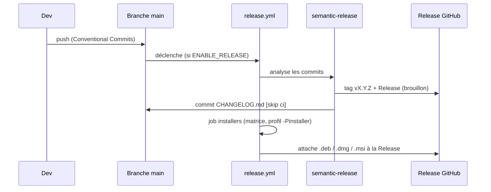

# CI/CD et release

Tout est automatisé par **GitHub Actions**. Cette page cartographie les workflows et le processus de
publication.

## Les workflows

| Workflow | Déclencheur | Rôle | Bloque la PR ? |
|---|---|---|---|
| [maven.yml](https://github.com/IUTInfoAix-S201/vigiechiro-pr-companion/blob/main/.github/workflows/maven.yml) | push `main` + PR | « Java CI » : `./mvnw -B verify` (compilation + tous les tests, ArchUnit inclus) | **Oui** |
| [lint.yml](https://github.com/IUTInfoAix-S201/vigiechiro-pr-companion/blob/main/.github/workflows/lint.yml) | push `main` + PR | « Quality gate » : `./mvnw -Pquality-gate verify` (PMD bloquant + seuils de couverture + Spotless) | **Oui** |
| [docs.yml](https://github.com/IUTInfoAix-S201/vigiechiro-pr-companion/blob/main/.github/workflows/docs.yml) | push/PR sur la doc | Construit les **deux** sites MkDocs (`--strict`) ; déploie Pages (dormant tant que `ENABLE_PAGES` ≠ true) | Build oui |
| [capture-vues.yml](https://github.com/IUTInfoAix-S201/vigiechiro-pr-companion/blob/main/.github/workflows/capture-vues.yml) | push `main` | Régénère les aperçus PNG (cf. [Captures](captures.md)) | — |
| [release.yml](https://github.com/IUTInfoAix-S201/vigiechiro-pr-companion/blob/main/.github/workflows/release.yml) | push `main` | Version + Release + installeurs natifs (dormant tant que `ENABLE_RELEASE` ≠ true) | — |
| [devcontainer-image.yml](https://github.com/IUTInfoAix-S201/vigiechiro-pr-companion/blob/main/.github/workflows/devcontainer-image.yml) | push `solution` | Build/push de l'image devcontainer | — |

!!! info "Workflows « dormants »"
    Pages et release ne s'activent que via des **variables de dépôt** (`ENABLE_PAGES`,
    `ENABLE_RELEASE` = `true`). Tant qu'elles sont absentes, ces étapes ne rougissent pas la CI.

## Le portail qualité (`-Pquality-gate`)

Le profil Maven `quality-gate` rend **bloquants** des contrôles tolérants par défaut :

- **PMD** : `failOnViolation=true` (sinon simple rapport) ;
- **JaCoCo** : le seuil de couverture devient bloquant.

Localement : `./mvnw -Pquality-gate verify` reproduit exactement la gate `lint.yml`. **Spotless**
(Palantir Java Format) formate via un *hook* pre-commit et est vérifié en CI.

## La release (semantic-release + jpackage)

À chaque push sur `main`, **[semantic-release](https://semantic-release.gitbook.io)** analyse les
**[Conventional Commits](https://www.conventionalcommits.org/fr/)** pour calculer la version, créer le
tag `vX.Y.Z` et la **Release GitHub** (en brouillon), et mettre à jour `CHANGELOG.md` (format
[Keep a Changelog](https://keepachangelog.com/fr/)). Puis une **matrice** construit les installeurs
natifs et les attache à la Release.



Les trois cibles :

| Runner | Installeur | Architecture |
|---|---|---|
| `ubuntu-latest` | `.deb` | x64 |
| `macos-latest` | `.dmg` | arm64 (Apple Silicon) |
| `windows-latest` | `.msi` | x64 |

Chaque installeur embarque son **runtime** (jpackage, profil `-Pinstaller`) : l'utilisateur final
**n'installe pas Java**. Construire un installeur localement :

```bash
./mvnw -Pinstaller -Djpackage.type=deb -DskipTests verify   # ou dmg / msi selon l'OS
```

!!! note "Le type de commit pilote la version"
    `fix:` → patch, `feat:` → minor, `BREAKING CHANGE` → major. Le `[skip ci]` du commit de CHANGELOG
    évite que la release se redéclenche en boucle. Détails de conventions :
    [CONTRIBUTING.md](https://github.com/IUTInfoAix-S201/vigiechiro-pr-companion/blob/main/CONTRIBUTING.md).
