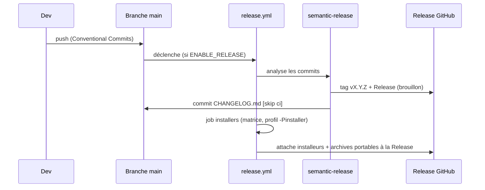

# CI/CD et release

Tout est automatisé par **GitHub Actions**. Cette page cartographie les workflows et le processus de
publication.

## Les workflows

| Workflow | Déclencheur | Rôle | Bloque la PR ? |
|---|---|---|---|
| [maven.yml](https://github.com/echonuit/vigiechiro-pr-companion/blob/main/.github/workflows/maven.yml) · job `build` | push `main` + PR | « Java CI » : `./mvnw -B verify -Djacoco.haltOnFailure=true` (compilation + tous les tests dont ArchUnit + **seuils de couverture JaCoCo bloquants**) | **Oui** |
| [maven.yml](https://github.com/echonuit/vigiechiro-pr-companion/blob/main/.github/workflows/maven.yml) · job `paquet` | push `main` + PR | Assemblage du fat-jar (`package -DskipTests`) puis smoke-test, **E2E CLI bats** et idempotence du packaging. **En parallèle** de `build` | **Oui** |
| [lint.yml](https://github.com/echonuit/vigiechiro-pr-companion/blob/main/.github/workflows/lint.yml) | push `main` + PR | « Quality gate » (statique) : `spotless:check` + complétude des captures + `./mvnw -Pquality-gate compile pmd:check` (**PMD bloquant**) | **Oui** |
| [docs.yml](https://github.com/echonuit/vigiechiro-pr-companion/blob/main/.github/workflows/docs.yml) | push/PR sur la doc | Construit les **deux** sites MkDocs (`--strict`) ; déploie Pages (dormant tant que `ENABLE_PAGES` ≠ true) | Build oui |
| [titre-pr.yml](https://github.com/echonuit/vigiechiro-pr-companion/blob/main/.github/workflows/titre-pr.yml) | PR (dont `edited`) | Le **titre de la PR** suit Conventional Commits (c'est lui que semantic-release lira, cf. ci-dessous) | Non - **informatif**, et volontairement (cf. ci-dessous) |
| [capture-vues.yml](https://github.com/echonuit/vigiechiro-pr-companion/blob/main/.github/workflows/capture-vues.yml) | push `main` | Régénère les aperçus PNG (cf. [Captures](captures.md)) | — |
| [release.yml](https://github.com/echonuit/vigiechiro-pr-companion/blob/main/.github/workflows/release.yml) | push `main` | Version + Release + installeurs natifs (dormant tant que `ENABLE_RELEASE` ≠ true) | — |
| [api-live.yml](https://github.com/echonuit/vigiechiro-pr-companion/blob/main/.github/workflows/api-live.yml) | hebdomadaire (lundi) + manuel | Contrat de l'API Vigie-Chiro, **en lecture seule** ; sépare « jeton mort » (warning) de « contrat cassé » (rouge) | — |
| [flatpak.yml](https://github.com/echonuit/vigiechiro-pr-companion/blob/main/.github/workflows/flatpak.yml) | release | Paquet Flatpak (cf. plus bas) | — |
| [winget.yml](https://github.com/echonuit/vigiechiro-pr-companion/blob/main/.github/workflows/winget.yml) | release | Soumission winget (inerte sans `WINGET_TOKEN`) | — |

!!! note "L'image devcontainer pré-buildée a été retirée"
    Un workflow `devcontainer-image.yml` publiait une image sur GHCR pour accélérer le démarrage des
    Codespaces. Il se déclenchait sur une branche `solution` **absente de ce dépôt** : il n'a jamais
    tourné et l'image n'a jamais existé, si bien que le conteneur ne pouvait plus se construire.
    Le `.devcontainer/` reconstruit désormais depuis son `Dockerfile` et ses features (#2388).

!!! info "Workflows « dormants »"
    Pages et release ne s'activent que via des **variables de dépôt** (`ENABLE_PAGES`,
    `ENABLE_RELEASE` = `true`). Tant qu'elles sont absentes, ces étapes ne rougissent pas la CI.

## Le portail qualité (`-Pquality-gate`)

Le profil Maven `quality-gate` rend **bloquants** des contrôles tolérants par défaut :

- **PMD** : `failOnViolation=true` (sinon simple rapport), exécuté par `lint.yml` (`compile pmd:check`) ;
- **JaCoCo** : le seuil de couverture devient bloquant, exécuté par `maven.yml`
  (`verify -Djacoco.haltOnFailure=true`). Les valeurs vivent dans le `pom.xml`, seule source.

Ces deux contrôles sont **répartis sur deux workflows** : `lint.yml` porte le **statique** (Spotless +
captures + PMD), `maven.yml` porte les **tests + couverture**. Localement :

- `./mvnw -Pquality-gate compile pmd:check` reproduit la gate PMD de `lint.yml` ;
- `./mvnw -Pquality-gate verify` reproduit le build complet **avec** la couverture bloquante (comme `maven.yml`).

**Spotless** (Palantir Java Format) formate via un *hook* pre-commit et est vérifié par `lint.yml` (`spotless:check`).

## Pourquoi `build` et `paquet` sont deux jobs

`maven.yml` portait auparavant quatre préoccupations à la file dans un seul job. Deux coûts en
découlaient. Le premier, mesuré : 449 s de tests, puis 148 s d'E2E bats, puis 9 s d'idempotence **en
série**, soit ~10 min avant le moindre verdict. Le second, plus gênant, était une **dépendance
fausse** : les étapes de packaging ne s'exécutaient qu'après le succès des tests, donc une suite rouge
**masquait** l'état du packaging, qu'on n'apprenait qu'au tour suivant.

Or ces étapes ne dépendent que de l'**assemblage** : `package -DskipTests` suffit (~20 s en local, et
les 21 tests bats passent sur ce seul artefact). D'où la séparation :

| Job | Ce dont il dépend | Ce qu'il prouve |
|---|---|---|
| `build` | la suite de tests | le comportement, et la couverture au seuil |
| `paquet` | l'assemblage du fat-jar | que le jar **démarre**, que la CLI répond, que le shade est idempotent |

Les deux tournent **en parallèle** et rendent leur verdict indépendamment : le chemin critique se
ramène au plus long des deux, et un packaging cassé rougit même quand les tests échouent.

!!! warning "Ce qui ne gagne rien à être optimisé"
    L'installation d'`apt`/`bats` coûte **9 s**, pas davantage : c'est vérifié. Les ~140 s du harnais
    sont les **21 tests eux-mêmes**, qui lancent chacun un JVM sur le fat-jar. Chercher un cache apt
    ici ne rapporte rien - l'hypothèse a été faite, mesurée, et démentie.

## La release (semantic-release + jpackage)

À chaque push sur `main`, **[semantic-release](https://semantic-release.gitbook.io)** analyse les
**[Conventional Commits](https://www.conventionalcommits.org/fr/)** pour calculer la version, créer le
tag `vX.Y.Z` et la **Release GitHub** (en brouillon), et mettre à jour `CHANGELOG.md` (format
[Keep a Changelog](https://keepachangelog.com/fr/)). Puis une **matrice** construit les installeurs
natifs et les attache à la Release.



Chaque runner produit **deux** artefacts, à partir du même profil `installer` :

| Runner | Installeur | Archive portable | Architecture |
|---|---|---|---|
| `ubuntu-latest` | `.deb` | `…-linux-x64-portable.tar.gz` | x64 |
| `macos-latest` | `.dmg` | `…-macos-arm64-portable.zip` | arm64 (Apple Silicon) |
| `windows-latest` | `.msi` | `…-windows-x64-portable.zip` | x64 |

### L'archive portable (#2107)

L'installeur demande des **droits d'administration**. C'est un obstacle pour qui veut simplement
essayer le produit, ou l'utiliser sur une machine qu'il n'administre pas - un poste de laboratoire, un
ordinateur prêté. L'archive portable est la **marche du bas** : on décompresse, on lance, rien ne
s'installe.

Elle vient du **même profil `installer`**, avec `-Djpackage.type=app-image` : jpackage produit alors
le dossier autonome (lanceur natif + runtime + fat-jar) au lieu de l'emballer dans un installeur.
Aucune configuration Maven supplémentaire n'a été nécessaire.

```bash
./mvnw -Pinstaller -Djpackage.type=app-image -DskipTests verify   # -> target/dist/VigieChiro/
```

Le **format d'archive** est choisi pour ce qu'il préserve, et ce n'est pas interchangeable :

- **`tar.gz`** (Linux) garde le **bit exécutable** du lanceur ;
- **`ditto`** (macOS) est le seul outil qui préserve un bundle `.app` intact - un `zip -r` casse ses
  liens symboliques et ses permissions, et l'application ne s'ouvre plus ;
- **`zip`** (Windows), où la notion de bit exécutable n'existe pas.

!!! warning "Le dossier est retiré après empaquetage"
    `gh release upload` échoue sur un répertoire. L'étape supprime donc `VigieChiro/` (ou
    `VigieChiro.app`) une fois l'archive faite, sans quoi le téléversement casse toute la publication.

### L'AppImage (#2107)

Sous Linux uniquement, la même app-image donne aussi une **AppImage** : un **fichier unique et
exécutable**, qu'on rend exécutable et qu'on lance, sans rien décompresser. C'est le complément de
l'archive portable pour qui préfère un fichier à un dossier, et le seul des deux formats à
**s'intégrer au menu des applications**, grâce à son `.desktop`.

Elle est construite par
[`.github/scripts/construit-appimage.sh`](https://github.com/echonuit/vigiechiro-pr-companion/blob/main/.github/scripts/construit-appimage.sh),
à partir de trois éléments versionnés dans `.github/appimage/` (le point d'entrée `AppRun`, le
`.desktop`, et l'icône reprise de celle que jpackage dépose dans `lib/`). Le script est **lançable à
la main**, ce qui permet de le vérifier sans passer par une release :

```bash
./mvnw -Pinstaller -Djpackage.type=app-image -DskipTests verify
./.github/scripts/construit-appimage.sh 2.20.0 x86_64      # -> target/dist/*.AppImage
```

L'étape est placée **avant** l'empaquetage de l'archive portable, qui supprime
`target/dist/VigieChiro` : les deux formats partent de la même app-image.

!!! danger "Deux pièges rencontrés à la construction, tous deux silencieux à la lecture"
    **Ne pas définir `SOURCE_DATE_EPOCH`.** L'idée d'un artefact reproductible est tentante, mais
    appimagetool passe déjà ses propres options de date à `mksquashfs`, qui refuse alors les deux
    ensemble : `SOURCE_DATE_EPOCH and command line options can't be used at the same time to set
    timestamp(s)`. Le script le neutralise s'il vient de l'environnement.

    **Une seule catégorie principale dans le `.desktop`.** `Categories=Science;Biology;Education;`
    en déclare deux (`Science` et `Education`), et l'application **apparaît deux fois** dans le menu.
    Seul `Science` est principal ici, `Biology` en étant une sous-catégorie.

`--appimage-extract-and-run` est passé à appimagetool parce que celui-ci est lui-même une AppImage :
il lui faut FUSE pour se monter, ce dont les conteneurs CI ne disposent pas toujours, avec un échec
obscur à la clé.

!!! danger "La dépendance invisible : `desktop-file-validate`"
    appimagetool valide le `.desktop` avec cet outil et **s'arrête** s'il ne le trouve pas. Il est
    fourni par le paquet **`desktop-file-utils`**, présent sur la plupart des postes de développement
    (les environnements de bureau le tirent) et **absent des runners GitHub**.

    C'est exactement le genre d'écart qu'une vérification locale ne peut pas voir : la construction
    passait ici et **a fait échouer la release v2.21.0**, laissant la Release en brouillon. Le
    workflow l'installe donc explicitement, et le script **contrôle sa présence** pour que l'échec
    nomme le paquet au lieu de renvoyer le message d'appimagetool, qui ne le dit pas.

    Leçon plus générale pour ce dépôt : un outil de build appelé **indirectement** par un autre outil
    est une dépendance qu'il faut déclarer, parce que rien ne la rend visible tant que le poste qui
    construit la possède.

### Les empreintes SHA-256 (#2107)

Les installeurs ne sont **pas signés**. Sans empreinte, un utilisateur n'a donc **aucun moyen** de
vérifier ce qu'il télécharge. Chaque artefact est accompagné d'un fichier `<nom>.sha256`, produit par
le job `installers` **juste avant le téléversement**.

!!! danger "Une empreinte atteste la source, pas ce que le canal en a fait"
    La première version calculait les empreintes sur les artefacts **re-téléchargés** depuis la
    Release, au motif que « le transfert se trouve ainsi couvert ». C'était **faux, et dangereux** :
    une corruption survenue au téléversement se serait retrouvée **certifiée conforme**, et
    l'utilisateur aurait vérifié un binaire abîmé **avec succès**.

    L'empreinte doit porter sur la **sortie de build**. Alors une corruption du canal fait échouer la
    vérification - ce qui est précisément le service attendu.

**Un fichier par artefact, et non une liste unique.** L'utilisateur télécharge **un** fichier : lui
demander de récupérer en plus une liste de sept empreintes dont six ne le concernent pas, puis d'y
filtrer sa ligne, est une friction que `sha256sum -c mon-fichier.sha256` supprime. Ce choix a de plus
retiré de la chaîne un aller-retour de plusieurs centaines de mégaoctets, et le piège de
l'auto-exclusion qu'imposait une liste (le fichier ne devait pas figurer dans sa propre liste).

!!! tip "macOS n'a pas `sha256sum`"
    L'étape bascule sur `shasum -a 256`, qui produit exactement le **même format** : un `.sha256`
    généré sous macOS se vérifie sous Linux, et réciproquement. C'est vérifié dans les deux sens.

**Ce qu'une empreinte prouve, et ce qu'elle ne prouve pas.** Elle atteste que le fichier est
**identique** à celui publié : elle détecte un téléchargement corrompu ou tronqué. Elle ne remplace
**pas** une signature - publiée au même endroit que les fichiers, elle n'atteste d'aucune identité.
La signature de code reste cadrée en #2112, où elle est suspendue à une décision de financement.

Chaque installeur embarque son **runtime** (jpackage, profil `-Pinstaller`) : l'utilisateur final
**n'installe pas Java**. Construire un installeur localement :

```bash
./mvnw -Pinstaller -Djpackage.type=deb -DskipTests verify   # ou dmg / msi selon l'OS
```

Le shade attache le fat-jar sous le **classifier `shaded`** (`vigiechiro-*-shaded.jar`, #1188) : l'artefact
principal `vigiechiro-*.jar` reste **mince**. jpackage empaquette donc le `-shaded`, et le packaging est
**idempotent** (le shade ne re-traite jamais sa propre sortie ; garde-fou d'idempotence dans `maven.yml`).

!!! note "Le type de commit pilote la version"
    `fix:` → patch, `feat:` → minor, `BREAKING CHANGE` → major. Le `[skip ci]` du commit de CHANGELOG
    évite que la release se redéclenche en boucle. Détails de conventions :
    [CONTRIBUTING.md](https://github.com/echonuit/vigiechiro-pr-companion/blob/main/CONTRIBUTING.md).

!!! danger "Ce que semantic-release lit réellement : le titre de la PR"
    Les PR sont fusionnées en **squash** (`squash_merge_commit_title = PR_TITLE`) : le **titre de la
    PR** devient le sujet du commit sur `main`, et les messages des commits de branche sont écartés à
    la fusion. C'est donc le titre qui pilote la version, et c'est lui que valide
    [titre-pr.yml](https://github.com/echonuit/vigiechiro-pr-companion/blob/main/.github/workflows/titre-pr.yml).

    **Pas d'espace avant le `:`** : `feat(scope): …` publie, `feat(scope) : …` ne publie rien. Cette
    seconde forme a arrêté la publication du 18 au 20 juillet 2026, en accumulant 58 commits
    releasables **sans faire rougir quoi que ce soit** - « aucun changement pertinent » est un verdict
    vert. `.releaserc.json` élargit désormais le `headerPattern` pour tolérer l'espace (sur le
    `commit-analyzer` **et** le `release-notes-generator`, faute de quoi les notes sortiraient vides),
    mais le garde-fou reste le contrôle du titre. Cf.
    [ADR 0040](decisions/0040-le-sujet-de-commit-est-une-syntaxe.md).

### Pourquoi `titre` informe au lieu de bloquer

Le contrôle a **été** rendu obligatoire (ruleset `titre-de-pr-conforme`), le temps d'une heure, et
cette heure a suffi à casser **deux** automatismes. Le retour en arrière est délibéré, et vaut d'être
expliqué : c'est exactement le genre de décision qu'on retente sans en connaître les raisons.

**Un check requis ne gouverne pas « les PR », il gouverne la branche** - donc *tout* ce qui y écrit.
Ce dépôt y écrit par deux chemins automatisés, et les deux se sont cassés :

| Chemin | Ce qui s'est passé |
|---|---|
| PR d'aperçus (`capture-vues.yml`) | `BLOCKED`, **aucun check rapporté** : GitHub ne déclenche aucun workflow pour un événement produit avec le `GITHUB_TOKEN` (garde-fou anti-récursion), donc `titre-pr.yml` ne s'exécute jamais - et un check requis muet bloque la fusion **pour toujours** |
| Push du CHANGELOG (`semantic-release`) | `GH013 … Required status check "titre" is expected` : un **push direct** est soumis aux mêmes règles, et un commit poussé n'a évidemment aucun check |

Le second a **arrêté la publication**, c'est-à-dire précisément ce que le chantier #2104 venait de
réparer. Trois releases ont échoué d'affilée avant que la règle ne soit retirée.

La dérogation qu'on attendrait est fermée : ajouter `github-actions` aux contournements d'un ruleset
**de dépôt** échoue en **422** (`Actor GitHub Actions integration must be part of the ruleset source
or owner organization`). Seul un ruleset **d'organisation** l'accepterait.

**La décision** : `titre` reste **informatif**. Il rougit sur un mauvais titre - c'est ainsi qu'il a
attrapé la PR #2122 le jour même - et cette information suffit. Le bénéfice du blocage était faible
(un seul mainteneur, qui dispose de toute façon du contournement administrateur) ; son coût a été
mesuré. Cf. [ADR 0041](decisions/0041-un-check-requis-gouverne-la-branche.md).

!!! note "Le check publié par le bot des captures est resté"
    [capture-vues.yml](https://github.com/echonuit/vigiechiro-pr-companion/blob/main/.github/workflows/capture-vues.yml)
    exécute lui-même la validation, avec le **même script**, et publie le résultat comme check run.
    Ce mécanisme est né du besoin de débloquer, mais il se justifie encore sans lui : sans ce
    passage, une PR d'aperçus ne serait validée par **rien du tout**. Il ne publie jamais un succès
    en dur - un garde-fou qui ne sait que réussir ne garde rien.

**Ce qu'il faut retenir pour la suite.** Avant de rendre un check obligatoire, inventorier **tous les
chemins d'écriture vers `main`**, pas seulement les PR humaines - et se demander pour chacun comment
le check y rapportera.

## Flatpak (#2111)

Le manifeste vit dans [`flatpak/`](https://github.com/echonuit/vigiechiro-pr-companion/tree/main/flatpak),
qui porte aussi le mode d'emploi de construction et de soumission. Trois points valent d'être connus
d'ici :

**Il extrait le `.deb` publié**, il ne construit pas depuis les sources. Les builds Flathub n'ont
**aucun réseau**, donc une résolution Maven y est impossible sans vendorer chaque dépendance
transitive. Même choix que Gluon Scene Builder, pour la même raison - et plus simple chez nous, le
fat-jar embarquant déjà JavaFX.

**Il consomme donc directement le travail de #2107** : le `.deb` **et son empreinte SHA-256** publiée
sont exactement ce que la source du manifeste demande.

**La montée de version est automatique** : `x-checker-data` fait ouvrir la PR de mise à jour par le
robot de Flathub. Publier une version ne demande aucun geste côté paquet.

!!! tip "Le `.desktop` de jpackage est invalide"
    jpackage écrit `Categories=Unknown`, valeur que `desktop-file-validate` refuse. Le manifeste la
    corrige au build - et c'est la **première** édition qu'il fait, car `desktop-file-edit` valide le
    fichier à chaque appel et échouerait avant d'y arriver. Le `.deb` installé normalement, lui, garde
    cette catégorie fautive.

## Dépendances

Les mises à jour sont proposées par **Dependabot**
([`.github/dependabot.yml`](https://github.com/echonuit/vigiechiro-pr-companion/blob/main/.github/dependabot.yml)),
**mensuellement**, pour `maven` et `github-actions`. **JavaFX (`org.openjfx:*`) est volontairement
exclu** de l'automatisation : ses bumps ont un impact fort (rendu, Headless Platform) et se décident à
la main.
