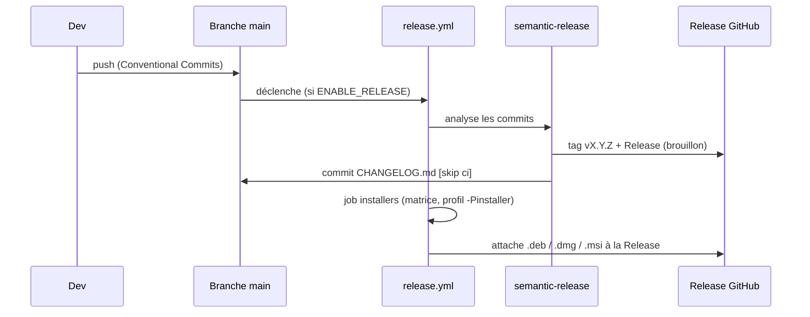

# CI/CD et release

Tout est automatisé par **GitHub Actions**. Cette page cartographie les workflows et le processus de
publication.

## Les workflows

| Workflow | Déclencheur | Rôle | Bloque la PR ? |
|---|---|---|---|
| [maven.yml](https://github.com/IUTInfoAix-S201/vigiechiro-pr-companion/blob/main/.github/workflows/maven.yml) · job `build` | push `main` + PR | « Java CI » : `./mvnw -B verify -Djacoco.haltOnFailure=true` (compilation + tous les tests dont ArchUnit + **seuils de couverture JaCoCo bloquants**) | **Oui** |
| [maven.yml](https://github.com/IUTInfoAix-S201/vigiechiro-pr-companion/blob/main/.github/workflows/maven.yml) · job `paquet` | push `main` + PR | Assemblage du fat-jar (`package -DskipTests`) puis smoke-test, **E2E CLI bats** et idempotence du packaging. **En parallèle** de `build` | **Oui** |
| [lint.yml](https://github.com/IUTInfoAix-S201/vigiechiro-pr-companion/blob/main/.github/workflows/lint.yml) | push `main` + PR | « Quality gate » (statique) : `spotless:check` + complétude des captures + `./mvnw -Pquality-gate compile pmd:check` (**PMD bloquant**) | **Oui** |
| [docs.yml](https://github.com/IUTInfoAix-S201/vigiechiro-pr-companion/blob/main/.github/workflows/docs.yml) | push/PR sur la doc | Construit les **deux** sites MkDocs (`--strict`) ; déploie Pages (dormant tant que `ENABLE_PAGES` ≠ true) | Build oui |
| [titre-pr.yml](https://github.com/IUTInfoAix-S201/vigiechiro-pr-companion/blob/main/.github/workflows/titre-pr.yml) | PR (dont `edited`) | Le **titre de la PR** suit Conventional Commits (c'est lui que semantic-release lira, cf. ci-dessous) | **Oui** |
| [capture-vues.yml](https://github.com/IUTInfoAix-S201/vigiechiro-pr-companion/blob/main/.github/workflows/capture-vues.yml) | push `main` | Régénère les aperçus PNG (cf. [Captures](captures.md)) | — |
| [release.yml](https://github.com/IUTInfoAix-S201/vigiechiro-pr-companion/blob/main/.github/workflows/release.yml) | push `main` | Version + Release + installeurs natifs (dormant tant que `ENABLE_RELEASE` ≠ true) | — |
| [devcontainer-image.yml](https://github.com/IUTInfoAix-S201/vigiechiro-pr-companion/blob/main/.github/workflows/devcontainer-image.yml) | push `solution` | Build/push de l'image devcontainer | — |

!!! info "Workflows « dormants »"
    Pages et release ne s'activent que via des **variables de dépôt** (`ENABLE_PAGES`,
    `ENABLE_RELEASE` = `true`). Tant qu'elles sont absentes, ces étapes ne rougissent pas la CI.

## Le portail qualité (`-Pquality-gate`)

Le profil Maven `quality-gate` rend **bloquants** des contrôles tolérants par défaut :

- **PMD** : `failOnViolation=true` (sinon simple rapport), exécuté par `lint.yml` (`compile pmd:check`) ;
- **JaCoCo** : le seuil de couverture devient bloquant, exécuté par `maven.yml`
  (`verify -Djacoco.haltOnFailure=true`, **85 % de lignes**).

Ces deux contrôles sont **répartis sur deux workflows** : `lint.yml` porte le **statique** (Spotless +
captures + PMD), `maven.yml` porte les **tests + couverture**. Localement :

- `./mvnw -Pquality-gate compile pmd:check` reproduit la gate PMD de `lint.yml` ;
- `./mvnw -Pquality-gate verify` reproduit le build complet **avec** la couverture bloquante (comme `maven.yml`).

**Spotless** (Palantir Java Format) formate via un *hook* pre-commit et est vérifié par `lint.yml` (`spotless:check`).

## Pourquoi `build` et `paquet` sont deux jobs

`maven.yml` portait auparavant quatre préoccupations à la file dans un seul job. Deux coûts en
découlaient. Le premier, mesuré : 449 s de tests, puis 148 s d'E2E bats, puis 9 s d'idempotence **en
série**, soit ~10 min avant le moindre verdict. Le second, plus gênant, était une **dépendance
fausse** : les étapes de packaging ne s'exécutaient qu'après le succès des tests, donc une suite rouge
**masquait** l'état du packaging, qu'on n'apprenait qu'au tour suivant.

Or ces étapes ne dépendent que de l'**assemblage** : `package -DskipTests` suffit (~20 s en local, et
les 21 tests bats passent sur ce seul artefact). D'où la séparation :

| Job | Ce dont il dépend | Ce qu'il prouve |
|---|---|---|
| `build` | la suite de tests | le comportement, et la couverture au seuil |
| `paquet` | l'assemblage du fat-jar | que le jar **démarre**, que la CLI répond, que le shade est idempotent |

Les deux tournent **en parallèle** et rendent leur verdict indépendamment : le chemin critique se
ramène au plus long des deux, et un packaging cassé rougit même quand les tests échouent.

!!! warning "Ce qui ne gagne rien à être optimisé"
    L'installation d'`apt`/`bats` coûte **9 s**, pas davantage : c'est vérifié. Les ~140 s du harnais
    sont les **21 tests eux-mêmes**, qui lancent chacun un JVM sur le fat-jar. Chercher un cache apt
    ici ne rapporte rien - l'hypothèse a été faite, mesurée, et démentie.

## La release (semantic-release + jpackage)

À chaque push sur `main`, **[semantic-release](https://semantic-release.gitbook.io)** analyse les
**[Conventional Commits](https://www.conventionalcommits.org/fr/)** pour calculer la version, créer le
tag `vX.Y.Z` et la **Release GitHub** (en brouillon), et mettre à jour `CHANGELOG.md` (format
[Keep a Changelog](https://keepachangelog.com/fr/)). Puis une **matrice** construit les installeurs
natifs et les attache à la Release.



Les trois cibles :

| Runner | Installeur | Architecture |
|---|---|---|
| `ubuntu-latest` | `.deb` | x64 |
| `macos-latest` | `.dmg` | arm64 (Apple Silicon) |
| `windows-latest` | `.msi` | x64 |

Chaque installeur embarque son **runtime** (jpackage, profil `-Pinstaller`) : l'utilisateur final
**n'installe pas Java**. Construire un installeur localement :

```bash
./mvnw -Pinstaller -Djpackage.type=deb -DskipTests verify   # ou dmg / msi selon l'OS
```

Le shade attache le fat-jar sous le **classifier `shaded`** (`vigiechiro-*-shaded.jar`, #1188) : l'artefact
principal `vigiechiro-*.jar` reste **mince**. jpackage empaquette donc le `-shaded`, et le packaging est
**idempotent** (le shade ne re-traite jamais sa propre sortie ; garde-fou d'idempotence dans `maven.yml`).

!!! note "Le type de commit pilote la version"
    `fix:` → patch, `feat:` → minor, `BREAKING CHANGE` → major. Le `[skip ci]` du commit de CHANGELOG
    évite que la release se redéclenche en boucle. Détails de conventions :
    [CONTRIBUTING.md](https://github.com/IUTInfoAix-S201/vigiechiro-pr-companion/blob/main/CONTRIBUTING.md).

!!! danger "Ce que semantic-release lit réellement : le titre de la PR"
    Les PR sont fusionnées en **squash** (`squash_merge_commit_title = PR_TITLE`) : le **titre de la
    PR** devient le sujet du commit sur `main`, et les messages des commits de branche sont écartés à
    la fusion. C'est donc le titre qui pilote la version, et c'est lui que valide
    [titre-pr.yml](https://github.com/IUTInfoAix-S201/vigiechiro-pr-companion/blob/main/.github/workflows/titre-pr.yml).

    **Pas d'espace avant le `:`** : `feat(scope): …` publie, `feat(scope) : …` ne publie rien. Cette
    seconde forme a arrêté la publication du 18 au 20 juillet 2026, en accumulant 58 commits
    releasables **sans faire rougir quoi que ce soit** - « aucun changement pertinent » est un verdict
    vert. `.releaserc.json` élargit désormais le `headerPattern` pour tolérer l'espace (sur le
    `commit-analyzer` **et** le `release-notes-generator`, faute de quoi les notes sortiraient vides),
    mais le garde-fou reste le contrôle du titre. Cf.
    [ADR 0040](decisions/0040-le-sujet-de-commit-est-une-syntaxe.md).

### Le cas des PR ouvertes par un bot

`titre` est un check **requis** (ruleset `titre-de-pr-conforme`). Or **GitHub ne déclenche aucun
workflow pour un événement produit avec le `GITHUB_TOKEN`** - c'est son garde-fou anti-récursion, sans
lequel une action pourrait se relancer indéfiniment. Une PR ouverte par le bot n'exécute donc **jamais**
`titre-pr.yml`, et un check requis qui ne rapporte rien **bloque la fusion pour toujours**. La PR
d'aperçus #2124 l'a vécu le jour même de la mise en place.

La dérogation qu'on attendrait est fermée : ajouter `github-actions` aux contournements du ruleset
échoue en **422** (`Actor GitHub Actions integration must be part of the ruleset source or owner
organization`) - l'application n'appartient ni à la source du ruleset ni à l'organisation.

[capture-vues.yml](https://github.com/IUTInfoAix-S201/vigiechiro-pr-companion/blob/main/.github/workflows/capture-vues.yml)
exécute donc **lui-même** la validation, avec le **même script**
(`.github/scripts/verifie-titre-pr.sh`), et publie le résultat comme **check run** nommé `titre`. Seul
le **transport** du résultat change ; le contrôle reste réel.

!!! tip "Pourquoi pas un `success` en dur"
    Ce serait plus court, et cela ferait croire à une vérification qui n'a pas eu lieu - un garde-fou
    qui ne sait que réussir ne garde rien. L'étape sait publier un `failure`, et c'est vérifié dans
    les deux sens. Effet de bord bienvenu : les PR d'aperçus sont désormais **validées**, alors
    qu'elles ne l'étaient pas du tout auparavant.

**Ce qu'il faut retenir pour la suite.** Tout nouveau check **requis** doit se demander comment il
rapportera sur les PR de bot. C'est le piège de ce dépôt : il en produit à chaque push sur `main`.

## Dépendances

Les mises à jour sont proposées par **Dependabot**
([`.github/dependabot.yml`](https://github.com/IUTInfoAix-S201/vigiechiro-pr-companion/blob/main/.github/dependabot.yml)),
**mensuellement**, pour `maven` et `github-actions`. **JavaFX (`org.openjfx:*`) est volontairement
exclu** de l'automatisation : ses bumps ont un impact fort (rendu, Headless Platform) et se décident à
la main.
