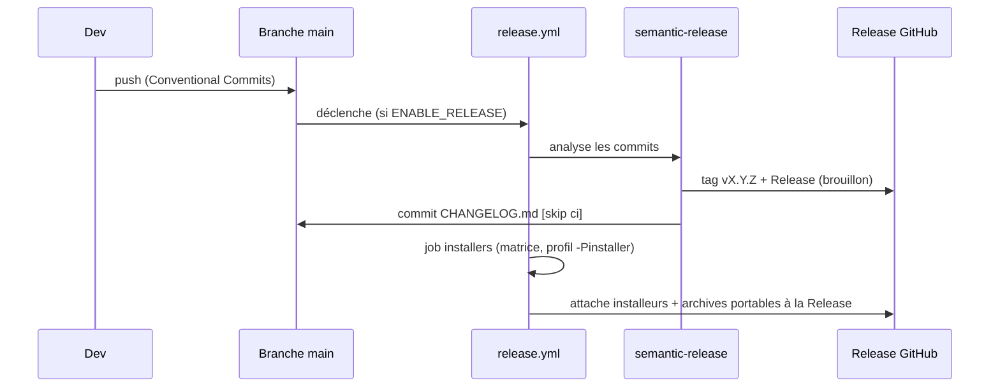

# CI/CD et release

Tout est automatisé par **GitHub Actions**. Cette page cartographie les <!--inv:workflows-ci-->14<!--/inv--> workflows et le processus de
publication.

## Les workflows

| Workflow | Déclencheur | Rôle | Bloque la PR ? |
|---|---|---|---|
| [maven.yml](https://github.com/echonuit/vigiechiro-pr-companion/blob/main/.github/workflows/maven.yml) · job `build` | push `main` + PR | « Java CI » : `./mvnw -B verify -Djacoco.haltOnFailure=true` (compilation + tous les tests dont ArchUnit + **seuils de couverture JaCoCo bloquants**) | **Oui** |
| [maven.yml](https://github.com/echonuit/vigiechiro-pr-companion/blob/main/.github/workflows/maven.yml) · job `paquet` | push `main` + PR | Assemblage du fat-jar (`package -DskipTests`) puis smoke-test, **E2E CLI bats** et idempotence du packaging. **En parallèle** de `build` | **Oui** |
| [lint.yml](https://github.com/echonuit/vigiechiro-pr-companion/blob/main/.github/workflows/lint.yml) | push `main` + PR | « Quality gate » (statique) : `spotless:check` + complétude des captures + `./mvnw -Pquality-gate compile pmd:check` (**PMD bloquant**) | **Oui** |
| [docs.yml](https://github.com/echonuit/vigiechiro-pr-companion/blob/main/.github/workflows/docs.yml) | push/PR sur la doc | Construit les **deux** sites MkDocs (`--strict`) ; déploie Pages (dormant tant que `ENABLE_PAGES` ≠ true) | Build oui |
| [titre-pr.yml](https://github.com/echonuit/vigiechiro-pr-companion/blob/main/.github/workflows/titre-pr.yml) | PR (dont `edited`) | Le **titre de la PR** suit Conventional Commits (c'est lui que semantic-release lira, cf. ci-dessous) | Non - **informatif**, et volontairement (cf. ci-dessous) |
| [capture-vues.yml](https://github.com/echonuit/vigiechiro-pr-companion/blob/main/.github/workflows/capture-vues.yml) | push `main` | Régénère les aperçus PNG (cf. [Captures](captures.md)) | — |
| [release.yml](https://github.com/echonuit/vigiechiro-pr-companion/blob/main/.github/workflows/release.yml) | push `main` | Version + Release + installeurs natifs (dormant tant que `ENABLE_RELEASE` ≠ true) | — |
| [api-live.yml](https://github.com/echonuit/vigiechiro-pr-companion/blob/main/.github/workflows/api-live.yml) | hebdomadaire (lundi) + manuel | Contrat de l'API Vigie-Chiro, **en lecture seule** ; sépare « jeton mort » (warning) de « contrat cassé » (rouge) | — |
| [adr-rapport.yml](https://github.com/echonuit/vigiechiro-pr-companion/blob/main/.github/workflows/adr-rapport.yml) | hebdomadaire + manuel | Rapport ADR (calibration des cliquets et des loupes) | — |
| [mutation-model.yml](https://github.com/echonuit/vigiechiro-pr-companion/blob/main/.github/workflows/mutation-model.yml) | quotidien (3 h UTC) + manuel | Mesure de mutation PIT sur **un paquet `model` par tour** (rotation sans état, cycle de 17 jours), **E2E et `commun.api` exclus** : bilan dans le résumé du job, rapport détaillé en artefact | — |
| [mutation-ihm.yml](https://github.com/echonuit/vigiechiro-pr-companion/blob/main/.github/workflows/mutation-ihm.yml) | quotidien (5 h UTC) + manuel | Mesure de mutation PIT sur les vues d'**une feature par tour** (rotation sans état, cycle de 15 jours), **E2E exclus** | — |
| [flatpak.yml](https://github.com/echonuit/vigiechiro-pr-companion/blob/main/.github/workflows/flatpak.yml) | release | Paquet Flatpak (cf. plus bas) | — |
| [winget.yml](https://github.com/echonuit/vigiechiro-pr-companion/blob/main/.github/workflows/winget.yml) | release | Soumission winget (inerte sans `WINGET_TOKEN`) | — |

!!! note "L'image devcontainer pré-buildée a été retirée"
    Un workflow `devcontainer-image.yml` publiait une image sur GHCR pour accélérer le démarrage des
    Codespaces. Il se déclenchait sur une branche `solution` **absente de ce dépôt** : il n'a jamais
    tourné et l'image n'a jamais existé, si bien que le conteneur ne pouvait plus se construire.
    Le `.devcontainer/` reconstruit désormais depuis son `Dockerfile` et ses features (#2388).

!!! info "Workflows « dormants »"
    Pages et release ne s'activent que via des **variables de dépôt** (`ENABLE_PAGES`,
    `ENABLE_RELEASE` = `true`). Tant qu'elles sont absentes, ces étapes ne rougissent pas la CI.

## Le portail qualité (`-Pquality-gate`)

Le profil Maven `quality-gate` rend **bloquants** des contrôles tolérants par défaut :

- **PMD** : `failOnViolation=true` (sinon simple rapport), exécuté par `lint.yml` (`compile pmd:check`) ;
- **JaCoCo** : le seuil de couverture devient bloquant, exécuté par `maven.yml`
  (`verify -Djacoco.haltOnFailure=true`). Les valeurs vivent dans le `pom.xml`, seule source.

Ces deux contrôles sont **répartis sur deux workflows** : `lint.yml` porte le **statique** (Spotless +
captures + PMD), `maven.yml` porte les **tests + couverture**. Localement :

- `./mvnw -Pquality-gate compile pmd:check` reproduit la gate PMD de `lint.yml` ;
- `./mvnw -Pquality-gate verify` reproduit le build complet **avec** la couverture bloquante (comme `maven.yml`).

**Spotless** (Palantir Java Format) formate via un *hook* pre-commit et est vérifié par `lint.yml` (`spotless:check`).

## Pourquoi `build` et `paquet` sont deux jobs

`maven.yml` portait auparavant quatre préoccupations à la file dans un seul job. Deux coûts en
découlaient. Le premier, mesuré : 449 s de tests, puis 148 s d'E2E bats, puis 9 s d'idempotence **en
série**, soit ~10 min avant le moindre verdict. Le second, plus gênant, était une **dépendance
fausse** : les étapes de packaging ne s'exécutaient qu'après le succès des tests, donc une suite rouge
**masquait** l'état du packaging, qu'on n'apprenait qu'au tour suivant.

Or ces étapes ne dépendent que de l'**assemblage** : `package -DskipTests` suffit (~20 s en local, et
les 21 tests bats passent sur ce seul artefact). D'où la séparation :

| Job | Ce dont il dépend | Ce qu'il prouve |
|---|---|---|
| `build` | la suite de tests | le comportement, et la couverture au seuil |
| `paquet` | l'assemblage du fat-jar | que le jar **démarre**, que la CLI répond, que le shade est idempotent |

Les deux tournent **en parallèle** et rendent leur verdict indépendamment : le chemin critique se
ramène au plus long des deux, et un packaging cassé rougit même quand les tests échouent.

!!! warning "Ce qui ne gagne rien à être optimisé"
    L'installation d'`apt`/`bats` coûte **9 s**, pas davantage : c'est vérifié. Les ~140 s du harnais
    sont les **21 tests eux-mêmes**, qui lancent chacun un JVM sur le fat-jar. Chercher un cache apt
    ici ne rapporte rien - l'hypothèse a été faite, mesurée, et démentie.

## La release (semantic-release + jpackage)

À chaque **train de publication** - le mercredi à 6 h UTC, ou sur déclenchement manuel (#2744) -
**[semantic-release](https://semantic-release.gitbook.io)** analyse les
**[Conventional Commits](https://www.conventionalcommits.org/fr/)** pour calculer la version, créer le
tag `vX.Y.Z` et la **Release GitHub** (en brouillon), et mettre à jour `CHANGELOG.md` (format
[Keep a Changelog](https://keepachangelog.com/fr/)). Puis une **matrice** construit les installeurs
natifs et les attache à la Release.


```mermaid
sequenceDiagram
    participant Dev
    participant Main as Branche main
    participant Rel as release.yml
    participant SR as semantic-release
    participant GH as Release GitHub
    Dev->>Main: push (Conventional Commits)
    Main->>Rel: déclenche (si ENABLE_RELEASE)
    Rel->>SR: analyse les commits
    SR->>GH: tag vX.Y.Z + Release (brouillon)
    SR->>Main: commit CHANGELOG.md [skip ci]
    Rel->>Rel: job installers (matrice, profil -Pinstaller)
    Rel->>GH: attache installeurs + archives portables à la Release
```

Chaque runner produit **deux** artefacts, à partir du même profil `installer` :

| Runner | Installeur | Archive portable | Architecture |
|---|---|---|---|
| `ubuntu-latest` | `.deb` | `…-linux-x64-portable.tar.gz` | x64 |
| `macos-latest` | `.dmg` | `…-macos-arm64-portable.zip` | arm64 (Apple Silicon) |
| `windows-latest` | `.msi` | `…-windows-x64-portable.zip` | x64 |

### L'archive portable (#2107)

L'installeur demande des **droits d'administration**. C'est un obstacle pour qui veut simplement
essayer le produit, ou l'utiliser sur une machine qu'il n'administre pas - un poste de laboratoire, un
ordinateur prêté. L'archive portable est la **marche du bas** : on décompresse, on lance, rien ne
s'installe.

Elle vient du **même profil `installer`**, avec `-Djpackage.type=app-image` : jpackage produit alors
le dossier autonome (lanceur natif + runtime + fat-jar) au lieu de l'emballer dans un installeur.
Aucune configuration Maven supplémentaire n'a été nécessaire.

```bash
./mvnw -Pinstaller -Djpackage.type=app-image -DskipTests verify   # -> target/dist/VigieChiro/
```

Le **format d'archive** est choisi pour ce qu'il préserve, et ce n'est pas interchangeable :

- **`tar.gz`** (Linux) garde le **bit exécutable** du lanceur ;
- **`ditto`** (macOS) est le seul outil qui préserve un bundle `.app` intact - un `zip -r` casse ses
  liens symboliques et ses permissions, et l'application ne s'ouvre plus ;
- **`zip`** (Windows), où la notion de bit exécutable n'existe pas.

!!! warning "Le dossier est retiré après empaquetage"
    `gh release upload` échoue sur un répertoire. L'étape supprime donc `VigieChiro/` (ou
    `VigieChiro.app`) une fois l'archive faite, sans quoi le téléversement casse toute la publication.

### L'AppImage (#2107)

Sous Linux uniquement, la même app-image donne aussi une **AppImage** : un **fichier unique et
exécutable**, qu'on rend exécutable et qu'on lance, sans rien décompresser. C'est le complément de
l'archive portable pour qui préfère un fichier à un dossier, et le seul des deux formats à
**s'intégrer au menu des applications**, grâce à son `.desktop`.

Elle est construite par
[`.github/scripts/construit-appimage.sh`](https://github.com/echonuit/vigiechiro-pr-companion/blob/main/.github/scripts/construit-appimage.sh),
à partir de trois éléments versionnés dans `.github/appimage/` (le point d'entrée `AppRun`, le
`.desktop`, et l'icône reprise de celle que jpackage dépose dans `lib/`). Le script est **lançable à
la main**, ce qui permet de le vérifier sans passer par une release :

```bash
./mvnw -Pinstaller -Djpackage.type=app-image -DskipTests verify
./.github/scripts/construit-appimage.sh 2.20.0 x86_64      # -> target/dist/*.AppImage
```

L'étape est placée **avant** l'empaquetage de l'archive portable, qui supprime
`target/dist/VigieChiro` : les deux formats partent de la même app-image.

!!! danger "Deux pièges rencontrés à la construction, tous deux silencieux à la lecture"
    **Ne pas définir `SOURCE_DATE_EPOCH`.** L'idée d'un artefact reproductible est tentante, mais
    appimagetool passe déjà ses propres options de date à `mksquashfs`, qui refuse alors les deux
    ensemble : `SOURCE_DATE_EPOCH and command line options can't be used at the same time to set
    timestamp(s)`. Le script le neutralise s'il vient de l'environnement.

    **Une seule catégorie principale dans le `.desktop`.** `Categories=Science;Biology;Education;`
    en déclare deux (`Science` et `Education`), et l'application **apparaît deux fois** dans le menu.
    Seul `Science` est principal ici, `Biology` en étant une sous-catégorie.

`--appimage-extract-and-run` est passé à appimagetool parce que celui-ci est lui-même une AppImage :
il lui faut FUSE pour se monter, ce dont les conteneurs CI ne disposent pas toujours, avec un échec
obscur à la clé.

!!! danger "La dépendance invisible : `desktop-file-validate`"
    appimagetool valide le `.desktop` avec cet outil et **s'arrête** s'il ne le trouve pas. Il est
    fourni par le paquet **`desktop-file-utils`**, présent sur la plupart des postes de développement
    (les environnements de bureau le tirent) et **absent des runners GitHub**.

    C'est exactement le genre d'écart qu'une vérification locale ne peut pas voir : la construction
    passait ici et **a fait échouer la release v2.21.0**, laissant la Release en brouillon. Le
    workflow l'installe donc explicitement, et le script **contrôle sa présence** pour que l'échec
    nomme le paquet au lieu de renvoyer le message d'appimagetool, qui ne le dit pas.

    Leçon plus générale pour ce dépôt : un outil de build appelé **indirectement** par un autre outil
    est une dépendance qu'il faut déclarer, parce que rien ne la rend visible tant que le poste qui
    construit la possède.

### Les empreintes SHA-256 (#2107)

Les installeurs ne sont **pas signés**. Sans empreinte, un utilisateur n'a donc **aucun moyen** de
vérifier ce qu'il télécharge. Chaque artefact est accompagné d'un fichier `<nom>.sha256`, produit par
le job `installers` **juste avant le téléversement**.

!!! danger "Une empreinte atteste la source, pas ce que le canal en a fait"
    La première version calculait les empreintes sur les artefacts **re-téléchargés** depuis la
    Release, au motif que « le transfert se trouve ainsi couvert ». C'était **faux, et dangereux** :
    une corruption survenue au téléversement se serait retrouvée **certifiée conforme**, et
    l'utilisateur aurait vérifié un binaire abîmé **avec succès**.

    L'empreinte doit porter sur la **sortie de build**. Alors une corruption du canal fait échouer la
    vérification - ce qui est précisément le service attendu.

**Un fichier par artefact, et non une liste unique.** L'utilisateur télécharge **un** fichier : lui
demander de récupérer en plus une liste de sept empreintes dont six ne le concernent pas, puis d'y
filtrer sa ligne, est une friction que `sha256sum -c mon-fichier.sha256` supprime. Ce choix a de plus
retiré de la chaîne un aller-retour de plusieurs centaines de mégaoctets, et le piège de
l'auto-exclusion qu'imposait une liste (le fichier ne devait pas figurer dans sa propre liste).

!!! tip "macOS n'a pas `sha256sum`"
    L'étape bascule sur `shasum -a 256`, qui produit exactement le **même format** : un `.sha256`
    généré sous macOS se vérifie sous Linux, et réciproquement. C'est vérifié dans les deux sens.

**Ce qu'une empreinte prouve, et ce qu'elle ne prouve pas.** Elle atteste que le fichier est
**identique** à celui publié : elle détecte un téléchargement corrompu ou tronqué. Elle ne remplace
**pas** une signature - publiée au même endroit que les fichiers, elle n'atteste d'aucune identité.
La signature de code reste cadrée en #2112, où elle est suspendue à une décision de financement.

Chaque installeur embarque son **runtime** (jpackage, profil `-Pinstaller`) : l'utilisateur final
**n'installe pas Java**. Construire un installeur localement :

```bash
./mvnw -Pinstaller -Djpackage.type=deb -DskipTests verify   # ou dmg / msi selon l'OS
```

Le shade attache le fat-jar sous le **classifier `shaded`** (`vigiechiro-*-shaded.jar`, #1188) : l'artefact
principal `vigiechiro-*.jar` reste **mince**. jpackage empaquette donc le `-shaded`, et le packaging est
**idempotent** (le shade ne re-traite jamais sa propre sortie ; garde-fou d'idempotence dans `maven.yml`).

!!! note "Le type de commit pilote la version"
    `fix:` → patch, `feat:` → minor, `BREAKING CHANGE` → major. Le `[skip ci]` du commit de CHANGELOG
    évite que la release se redéclenche en boucle. Détails de conventions :
    [CONTRIBUTING.md](https://github.com/echonuit/vigiechiro-pr-companion/blob/main/CONTRIBUTING.md).

!!! danger "Ce que semantic-release lit réellement : le titre de la PR"
    Les PR sont fusionnées en **squash** (`squash_merge_commit_title = PR_TITLE`) : le **titre de la
    PR** devient le sujet du commit sur `main`, et les messages des commits de branche sont écartés à
    la fusion. C'est donc le titre qui pilote la version, et c'est lui que valide
    [titre-pr.yml](https://github.com/echonuit/vigiechiro-pr-companion/blob/main/.github/workflows/titre-pr.yml).

    **Pas d'espace avant le `:`** : `feat(scope): …` publie, `feat(scope) : …` ne publie rien. Cette
    seconde forme a arrêté la publication du 18 au 20 juillet 2026, en accumulant 58 commits
    releasables **sans faire rougir quoi que ce soit** - « aucun changement pertinent » est un verdict
    vert. `.releaserc.json` élargit désormais le `headerPattern` pour tolérer l'espace (sur le
    `commit-analyzer` **et** le `release-notes-generator`, faute de quoi les notes sortiraient vides),
    mais le garde-fou reste le contrôle du titre. Cf.
    [ADR 0040](decisions/0040-le-sujet-de-commit-est-une-syntaxe.md).

### Pourquoi `titre` informe au lieu de bloquer

Le contrôle a **été** rendu obligatoire (ruleset `titre-de-pr-conforme`), le temps d'une heure, et
cette heure a suffi à casser **deux** automatismes. Le retour en arrière est délibéré, et vaut d'être
expliqué : c'est exactement le genre de décision qu'on retente sans en connaître les raisons.

**Un check requis ne gouverne pas « les PR », il gouverne la branche** - donc *tout* ce qui y écrit.
Ce dépôt y écrit par deux chemins automatisés, et les deux se sont cassés :

| Chemin | Ce qui s'est passé |
|---|---|
| PR d'aperçus (`capture-vues.yml`) | `BLOCKED`, **aucun check rapporté** : GitHub ne déclenche aucun workflow pour un événement produit avec le `GITHUB_TOKEN` (garde-fou anti-récursion), donc `titre-pr.yml` ne s'exécute jamais - et un check requis muet bloque la fusion **pour toujours** |
| Push du CHANGELOG (`semantic-release`) | `GH013 … Required status check "titre" is expected` : un **push direct** est soumis aux mêmes règles, et un commit poussé n'a évidemment aucun check |

Le second a **arrêté la publication**, c'est-à-dire précisément ce que le chantier #2104 venait de
réparer. Trois releases ont échoué d'affilée avant que la règle ne soit retirée.

La dérogation qu'on attendrait est fermée : ajouter `github-actions` aux contournements d'un ruleset
**de dépôt** échoue en **422** (`Actor GitHub Actions integration must be part of the ruleset source
or owner organization`). Seul un ruleset **d'organisation** l'accepterait.

**La décision** : `titre` reste **informatif**. Il rougit sur un mauvais titre - c'est ainsi qu'il a
attrapé la PR #2122 le jour même - et cette information suffit. Le bénéfice du blocage était faible
(un seul mainteneur, qui dispose de toute façon du contournement administrateur) ; son coût a été
mesuré. Cf. [ADR 0041](decisions/0041-un-check-requis-gouverne-la-branche.md).

!!! note "Le check publié par le bot des captures est resté"
    [capture-vues.yml](https://github.com/echonuit/vigiechiro-pr-companion/blob/main/.github/workflows/capture-vues.yml)
    exécute lui-même la validation, avec le **même script**, et publie le résultat comme check run.
    Ce mécanisme est né du besoin de débloquer, mais il se justifie encore sans lui : sans ce
    passage, une PR d'aperçus ne serait validée par **rien du tout**. Il ne publie jamais un succès
    en dur - un garde-fou qui ne sait que réussir ne garde rien.

**Ce qu'il faut retenir pour la suite.** Avant de rendre un check obligatoire, inventorier **tous les
chemins d'écriture vers `main`**, pas seulement les PR humaines - et se demander pour chacun comment
le check y rapportera.

## Flatpak (#2111)

Le manifeste vit dans [`flatpak/`](https://github.com/echonuit/vigiechiro-pr-companion/tree/main/flatpak),
qui porte aussi le mode d'emploi de construction et de soumission. Trois points valent d'être connus
d'ici :

**Il extrait le `.deb` publié**, il ne construit pas depuis les sources. Les builds Flathub n'ont
**aucun réseau**, donc une résolution Maven y est impossible sans vendorer chaque dépendance
transitive. Même choix que Gluon Scene Builder, pour la même raison - et plus simple chez nous, le
fat-jar embarquant déjà JavaFX.

**Il consomme donc directement le travail de #2107** : le `.deb` **et son empreinte SHA-256** publiée
sont exactement ce que la source du manifeste demande.

**La montée de version est automatique** : `x-checker-data` fait ouvrir la PR de mise à jour par le
robot de Flathub. Publier une version ne demande aucun geste côté paquet.

!!! tip "Le `.desktop` de jpackage est invalide"
    jpackage écrit `Categories=Unknown`, valeur que `desktop-file-validate` refuse. Le manifeste la
    corrige au build - et c'est la **première** édition qu'il fait, car `desktop-file-edit` valide le
    fichier à chaque appel et échouerait avant d'y arriver. Le `.deb` installé normalement, lui, garde
    cette catégorie fautive.

## Toute garde de CI porte sa propre preuve (#2947, #3293)

Une garde qui **accepte à tort ne rougit pas** : elle passe au vert, sur un dépôt propre, exactement
comme si elle faisait son travail. C'est le seul type de défaut qui se présente sous la forme d'un
succès - et c'est pourquoi chaque garde de ce dépôt répond à `--auto-test`.

| Garde | Ce qu'elle vérifie | Où elle tourne |
|---|---|---|
| `verifie-titre-pr.sh` | Conventional Commits, cadratin, élision sans apostrophe | `titre-pr.yml` |
| `verifie-epinglage.sh` | actions figées sur un SHA, aucune divergence de version | `lint.yml` |
| `verifie-jeton.sh` | aucun jeton VigieChiro en clair | `lint.yml` |
| `check-captures.sh` | chaque vue a une capture, chaque capture existe et est présentée | `lint.yml` |
| `check-capture-mains.sh` | chaque outil de capture est enregistré dans `MAINS` | `lint.yml` |
| `check-doc-images.sh` | chaque capture citée par la doc existe et est déclarée | `docs.yml` |
| `verifie-permissions.sh` | aucun plancher en écriture dans un workflow multi-jobs | `lint.yml` |
| `scripts/adr/verifie_scripts.py` | les scripts cités par les ADR | `lint.yml` |

**Le modèle vient de #2947** (`verifie-titre-pr.sh`) et il est le bon : le script **se réinvoque
lui-même** sur un cas connu, donc le cas de test et le chemin réel sont le même code **par
construction**. Les gardes qui balaient une arborescence l'appliquent en rendant leur racine
surchargeable par variable d'environnement, et en montant un bac jetable.

Deux exigences, apprises de ce qui a failli passer :

- **Des contrôles négatifs.** Une règle qui refuse tout est aussi inutile qu'une règle qui accepte
  tout. Chaque auto-test contient des cas qui doivent **rester verts** - un `.fxml` hors d'un dossier
  `view/`, un `Capture*` sans `main`, une capture que la doc ne cite pas.
- **Éprouver l'auto-test lui-même.** En neutralisant une règle, le cas correspondant doit rougir - et
  **lui seul**. Vécu pendant #3293 : une première tentative de neutralisation n'avait rien modifié, et
  le vert obtenu ne prouvait rien.

## Épinglage des actions et conteneurs (#2737)

Chaque `uses:` désigne un **contenu**, jamais un nom : une action est figée sur un **SHA de commit**,
un conteneur sur un **digest**.

```yaml
- uses: actions/checkout@3d3c42e5aac5ba805825da76410c181273ba90b1 # v7
- uses: docker://ghcr.io/flathub/flatpak-external-data-checker@sha256:58cbad60…
```

**Pourquoi, alors qu'un tag semble suffire.** Un tag est déplaçable. `actions/checkout@v7` peut être
repointé sur un autre commit sans que rien ne bouge chez nous : ce qui s'exécute dans nos workflows
changerait alors sans qu'aucun commit ne le dise. Un numéro plus précis n'y change rien - `@v5.6.0`
**ressemble** à une version figée, c'est un tag comme un autre.

C'est le prérequis du reste du lot : une attestation de provenance atteste d'un binaire produit par un
code qu'on ne saurait pas identifier, et un SBOM décrit une construction non reproductible.

**Le commentaire de version est obligatoire**, et la garde le vérifie : sans lui, plus personne ne sait
quelle version tourne, et une mise à jour Dependabot n'aurait rien de lisible à modifier.

**Épingler ne gèle rien.** Dependabot met à jour un SHA épinglé **et** son commentaire. On échange une
mise à jour invisible contre une mise à jour qui passe par une PR.

**La garde** : [`verifie-epinglage.sh`](https://github.com/echonuit/vigiechiro-pr-companion/blob/main/.github/scripts/verifie-epinglage.sh),
dans le job `lint`. Elle refuse toute référence non figée **et** tout SHA sans commentaire de version.
Sans elle, la prochaine action ajoutée le serait par tag et l'épinglage se déferait en silence - la
forme même du défaut corrigé. Pour résoudre un tag :

```bash
gh api repos/<proprietaire>/<action>/git/ref/tags/<tag> --jq .object.sha
# si l'objet est de type « tag » (tag annoté), déréférencer :
gh api repos/<proprietaire>/<action>/git/tags/<sha> --jq .object.sha
```

## La publication part à heure fixe (#2744)

`release.yml` ne se déclenche plus au push sur `main` mais **le mercredi à 6 h UTC**, plus
`workflow_dispatch` pour un correctif urgent.

**Pourquoi** : au push, le dépôt publiait 3 à 37 fois par jour - 497 tags, jusqu'à 31 dans la même
journée. Ces versions n'étaient pas vides (95 % de `feat` et `fix` sur les 120 dernières) mais
**atomisées** : une version = un changement, donc aucune validable par la recette (#1363) ni
descriptible. La cadence pesait par ailleurs sur une décision en aval : elle compte parmi les raisons du
déclenchement manuel de winget et Flathub - sans en être la principale, le paquet n'étant pas encore
accepté sur Flathub (#2191).

Détail et alternatives écartées : [ADR 2744](decisions/2744-la-publication-part-a-heure-fixe.md).

## Les artefacts publiés portent une attestation de provenance (#2742)

`actions/attest-build-provenance` s'applique à chaque artefact de `target/dist` (installeurs et
archives portables) et au SBOM, dans le job `installers`.

**Ce que ça ajoute aux SHA-256 déjà publiés** : l'empreinte prouve qu'un fichier est *identique à
celui publié*, elle ne dit rien de **qui** l'a produit - et elle est publiée au même endroit que le
fichier, donc sa confiance vaut celle qu'on accorde à la page du projet. L'attestation lie le binaire
à un **commit** et à une **exécution** de ce workflow, et se vérifie contre **Sigstore**, hors de notre
portée.

```bash
gh attestation verify <fichier> --repo echonuit/vigiechiro-pr-companion
```

**Elle est produite sur la sortie de build, avant tout téléversement**, pour la même raison que
l'empreinte : une corruption survenue au téléversement se retrouverait sinon *attestée*. Les `.sha256`
sont exclus - attester une empreinte de trois lignes n'apprend rien.

**Les deux droits ajoutés au job sont bornés** : `id-token: write` ne sert qu'à prouver à Sigstore qui
construit, `attestations: write` n'écrit que dans le magasin d'attestations du dépôt. Ni l'un ni
l'autre ne touche au code, aux issues ou aux pull requests - le moindre privilège de #2739 tient.

⚠️ **Elle ne remplace pas la signature des installeurs** (#2112, EPIC #2104) : la signature parle aux
systèmes d'exploitation (SmartScreen, Gatekeeper), l'attestation parle à qui veut auditer. Les deux
sont complémentaires, aucune ne rend l'autre inutile.

## L'inventaire des dépendances livrées, et sa surveillance (#2740)

Le fat-jar embarque toutes les dépendances résolues par Maven. Leur état de vulnérabilité n'était
vérifié nulle part : ni nous ni personne ne pouvait affirmer l'absence de CVE connue.

**Le SBOM** : `cyclonedx-maven-plugin` produit `target/sbom.json` (CycloneDX 1.6) à la phase `package`,
et il est **joint à chaque Release**, à côté des SHA-256, sous le nom `sbom-vX.Y.Z.json`.

Il décrit ce qui est **livré** : portées `compile` et `runtime`, jamais `test`. Y mettre JUnit, AssertJ
et Mockito ferait alerter un scanner sur des paquets qu'aucun utilisateur n'exécute. **25 composants**
au moment de la mise en place.

**La surveillance** : le workflow `securite-dependances.yml` reconstruit le SBOM et le scanne (grype),
à trois moments qui répondent à trois questions différentes :

| Déclenchement | La question |
|---|---|
| `schedule` (lundi 6 h UTC) | une vulnérabilité publiée cette nuit touche-t-elle du code que nous n'avons pas modifié ? |
| `pull_request` sur `pom.xml` | est-ce qu'on **introduit** une dépendance vulnérable ? |
| `workflow_dispatch` | vérification à la demande, avant une release |

Le seuil bloque à partir de **haute**, et ce choix tient à une mesure : le premier scan a rendu
**zéro** composant vulnérable. Au moment où l'inventaire est propre, être strict ne coûte rien - et
c'est le seul moment où on peut l'être sans avoir d'abord à trier une dette existante. Un seuil posé
au-dessus d'un lot d'alertes déjà présentes ne bloque jamais rien.

!!! note "Ce que le premier scan a trouvé, et comment il a été traité"
    Une seule dépendance en défaut : `com.google.guava:guava` **31.0.1-jre**, qui n'est pas une
    dépendance de ce projet - elle arrive par **Guice 7**. Deux avis, tous deux sur la création de
    fichiers temporaires et corrigés en 32.0.0 : GHSA-5mg8-w23w-74h3 (faible) et GHSA-7g45-4rm6-3mm3
    (modéré).

    **L'exposition réelle est nulle** : le code applicatif n'importe aucune classe Guava, donc
    n'appelle ni `com.google.common.io.Files.createTempDir` ni `FileBackedOutputStream`. Guava est
    quand même contrainte à `33.4.8-jre` dans le `dependencyManagement` : un inventaire qui signale ce
    qu'on ne corrige pas cesse d'être lu.

    ⚠️ **Le premier `grep` de vérification était faux** : `Files.createTempDir` correspond aussi au
    début de `Files.createTempDirectory`, celui du **JDK**, employé par les outils de capture. Il
    annonçait trois appels là où il n'y en avait aucun. La question « est-ce que ça nous concerne ? »
    se pose sur les **imports**, pas sur la ressemblance des noms.
## Analyse statique de sécurité, et détection de secrets (#2741)

Le dépôt est **public** depuis #169. `codeql.yml` cherche ce que ni PMD ni les tests ne cherchent :
des **chemins de données** - une entrée qui atteint une commande, un chemin de fichier, une requête -
plutôt que des règles de style ou de structure. Sur `main`, sur les PR, et **planifié** le lundi : les
requêtes CodeQL évoluent, une base de code inchangée peut devenir signalable sans qu'un commit l'ait
touchée.

Deux choix qui méritent d'être dits :

- **Le build est explicite**, pas `autobuild`. Ce projet a des exigences que la détection automatique
  ne devine pas (JDK 25, JavaFX 26 en dépendances Maven) - et un `autobuild` qui échoue rend une
  analyse **vide**, c'est-à-dire un vert qui ne veut rien dire.
- **Jeu de requêtes `security-extended`** : le dépôt refuse déjà les `@SuppressWarnings` pour taire un
  avertissement qualité ; le même esprit veut qu'on voie d'abord tout ce qui est signalable, quitte à
  trier ensuite. Trier veut dire **distinguer vrai positif et bruit**, jamais supprimer en masse.

### La détection de secrets : ce qui est actif, et ce qui ne peut pas l'être

| Réglage | État | Pourquoi |
|---|---|---|
| `secret_scanning` | ✅ activé | gratuit sur dépôt public |
| `secret_scanning_push_protection` | ✅ activé | gratuit sur dépôt public |
| `secret_scanning_non_provider_patterns` | ❌ indisponible | GitHub Advanced Security |
| `secret_scanning_validity_checks` | ❌ indisponible | GitHub Advanced Security |

⚠️ **L'API accepte d'activer les deux derniers et ne le fait pas** : elle rend `200` en les laissant à
`disabled`. Il faut **relire l'état** pour s'en apercevoir - un appel qui réussit n'est pas un réglage
qui s'applique. L'organisation est au plan `free`, où `advanced_security_enabled` vaut `false`.

`push_protection` **refuse un `git push`** contenant un secret reconnu. C'est son intérêt, et c'est
aussi ce qui surprend un contributeur au mauvais moment.

### Pourquoi une garde maison en plus (#2741)

Ce qui reste actif ne reconnaît que les **motifs de fournisseurs** : clés AWS, jetons GitHub, Stripe.
Or le secret que ce dépôt risque de laisser fuir est un **jeton VigieChiro**, lu dans
`localStorage['auth-session-token']` : une chaîne **opaque**, sans préfixe distinctif, qu'aucun
catalogue ne connaît. Ce qui l'attraperait - les motifs personnalisés - demande GHAS.

[`verifie-jeton.sh`](https://github.com/echonuit/vigiechiro-pr-companion/blob/main/.github/scripts/verifie-jeton.sh)
cherche donc le **contexte** et non la forme : le nom de la clé, une affectation, et une valeur
littérale d'au moins 12 caractères. Les quatre usages légitimes du dépôt passent par construction (le
marque-place `XXXX`, la variable d'environnement, le secret Actions, la propriété Maven vide).

Un détecteur générique par **entropie** aurait été le mauvais outil ici : ce dépôt contient des
empreintes SHA-256 en clair partout - manifestes de sauvegarde, fixtures de recette - et il aurait
hurlé sur chacune.

**La garde porte sa propre preuve** : `--autotest` fait passer neuf lignes connues - quatre fuites,
cinq usages légitimes - par le **même** motif que le balayage, et la CI lance les deux modes. Sans
cela, un motif relâché passerait au vert sur un dépôt propre sans que rien ne le dise. Éprouvé :
en portant le seuil de 12 à 40 caractères, l'autotest signale les quatre fuites non détectées.

⚠️ Elle lit le contenu **versionné** (`git grep`) : un fichier non suivi lui échappe. C'est le bon
périmètre pour une garde de CI - ce qui part chez tout le monde - mais ce n'est pas un filet local.

## Les droits de publication sont déclarés par job (#2739)

Le plancher du workflow de release est en **lecture seule** ; chaque job déclare ce qu'il lui faut de
plus.

| Job | Ce qu'il fait | Droits |
|---|---|---|
| `release` | tag, Release, commentaires sur les issues et PR que la version referme | `contents` + `issues` + `pull-requests` |
| `installers` | `gh release upload`, après compilation et **jpackage sur trois systèmes** | `contents` |
| `publish` | `gh release edit --draft=false` | `contents` |

**Ce qui n'allait pas** : un **seul** bloc `permissions` au niveau du workflow accordait les trois
droits en écriture aux trois jobs. La matrice d'installeurs - le job le plus exposé, qui compile et
empaquette - pouvait donc écrire des issues et des pull requests, ce dont elle n'a jamais eu l'usage.

Les trois autres workflows à droits d'écriture (`adr-rapport`, `capture-vues`, `flatpak`) sont
**mono-job** et utilisent réellement chacun des leurs : leur bloc au niveau workflow est déjà, de
fait, un bloc par job.

**Et rien ne le laisse se défaire** : `verifie-permissions.sh` (#3294) refuse un plancher en écriture
dans un workflow à **plusieurs jobs**, où les droits seraient accordés à tous. Elle ne fige pas la
liste attendue par job - #2742 a dû ajouter `id-token` et `attestations` pour les attestations, et une
liste figée aurait rougi sur un ajout voulu, puis se serait fait élargir machinalement. Un workflow
**mono-job** garde son plancher : plancher et job y désignent la même chose.

⚠️ **Ce que cela ne fait pas** : `semantic-release` s'exécute toujours dans un job en écriture. L'en
sortir suppose de réimplémenter en `git` + `gh` ce que font ses greffons d'écriture ; l'arbitrage,
rendu, est consigné sur #2739.

## L'outillage de publication est figé, et répété à blanc (#2738)

`semantic-release` et ses greffons vivent dans
[`.github/release/`](https://github.com/echonuit/vigiechiro-pr-companion/tree/main/.github/release),
avec **package.json + lockfile versionnés**, installés par `npm ci`.

**Ce qui n'allait pas.** Le job de publication faisait `npx --yes -p semantic-release@24 …` **au
moment de publier**, dans un job autorisé à écrire contenus, issues et PR. La résolution de versions
se faisait à chaque exécution : un greffon compromis entre deux runs se serait exécuté avec les droits
de publication sans qu'aucun diff du dépôt ne l'ait montré.

**Deux configurations, et la seconde dérive de la première.**

| Fichier | Greffons | Usage |
|---|---|---|
| `.releaserc.json` (racine) | les 5 | la publication, lancée **depuis la racine** |
| `.github/release/release.config.js` | les 2 de **calcul** | la répétition à blanc des PR |

La configuration d'analyse **importe** celle du dépôt et n'en garde que les greffons qui lisent : elle
ne recopie donc pas les `parserOpts` (ceux qui tolèrent « `fix(ci) : sujet` », espace avant les
deux-points). Une copie divergerait, et la version calculée en vérification ne serait plus celle que la
publication calculera.

**La répétition à blanc**, job `outillage-release` de `lint.yml`, à chaque PR : `npm ci`, une assertion
sur la dérivation de la configuration, puis `semantic-release --dry-run`. Elle existe parce que
**aucune CI de PR ne traverse `release.yml`** : il se déclenchait alors au push sur `main`, et depuis
#2744 il part au train du mercredi. Dans les deux cas, une erreur d'installation ou de configuration
ne se verrait qu'à la **prochaine release**.

Elle ne peut pas publier : `--dry-run` n'écrit rien, et la configuration d'analyse n'embarque **aucun**
greffon d'écriture.

⚠️ **Ce qu'elle prouve dépend du déclencheur** (#3345), et il faut le savoir avant de lire son vert :

| Déclencheur | Jusqu'où va `semantic-release` | Ce que le vert dit |
|---|---|---|
| `pull_request` | s'arrête sur « triggered by a pull request », **après** avoir chargé les greffons | l'outillage s'installe, les greffons se chargent |
| `push` sur `main` | va jusqu'à l'analyse de l'historique et au calcul de version | **le contrôle est réel** |

Le job déclare `contents: write` **pour lui seul**, alors qu'il n'écrit rien : `semantic-release`
vérifie qu'il *pourrait* pousser un tag dès `verifyConditions`, y compris en `--dry-run`. Sous le
plancher `contents: read` du workflow il échouait donc sur `main` par `EGITNOPERMISSION`, **sauf**
quand un checkout devenu obsolète le faisait sortir plus tôt : le vert signifiait alors « contrôle
sauté ». Ce cas de sortie anticipée subsiste les jours de fusion dense ; le `concurrency` du workflow
le borne sans le supprimer.

⚠️ **Le binaire se lance depuis la racine pour publier** (`./.github/release/node_modules/.bin/semantic-release`) :
c'est `.releaserc.json` qui fait alors foi. Lancé **depuis `.github/release/`**, c'est la configuration
d'analyse que cosmiconfig trouve en premier. Les deux ont été vérifiées en local, greffon par greffon.

## Dépendances

Les mises à jour sont proposées par **Dependabot**
([`.github/dependabot.yml`](https://github.com/echonuit/vigiechiro-pr-companion/blob/main/.github/dependabot.yml)),
**mensuellement**, pour `maven` et `github-actions`. **JavaFX (`org.openjfx:*`) est volontairement
exclu** de l'automatisation : ses bumps ont un impact fort (rendu, Headless Platform) et se décident à
la main.
