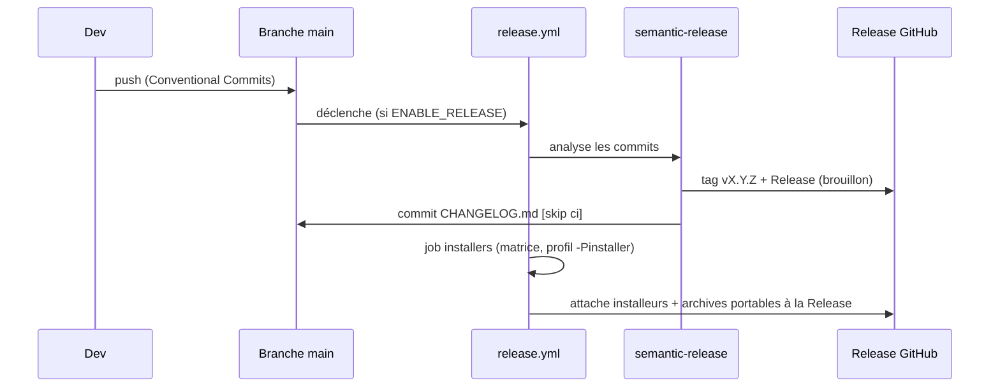

# CI/CD et release

Tout est automatisé par **GitHub Actions**. Cette page cartographie les <!--inv:workflows-ci-->20<!--/inv--> workflows et le processus de
publication.

## Les workflows

| Workflow | Déclencheur | Rôle | Bloque la PR ? |
|---|---|---|---|
| [maven.yml](https://github.com/echonuit/vigiechiro-pr-companion/blob/main/.github/workflows/maven.yml) · job `build` | push `main` + PR | « Java CI » : `./mvnw -B verify -Djacoco.haltOnFailure=true` (compilation + tous les tests dont ArchUnit + **seuils de couverture JaCoCo bloquants** + **hygiène des dépendances**, `dependency:analyze-only` avec `failOnWarning`) | **Oui** |
| [maven.yml](https://github.com/echonuit/vigiechiro-pr-companion/blob/main/.github/workflows/maven.yml) · job `paquet` | push `main` + PR | Assemblage du fat-jar (`package -DskipTests`), smoke-test, idempotence, app-image, puis **E2E CLI bats sur le lanceur empaqueté**. **En parallèle** de `build` | **Oui** |
| [maven.yml](https://github.com/echonuit/vigiechiro-pr-companion/blob/main/.github/workflows/maven.yml) · job `second-compilateur` | push `main` + PR | Recompile **tout** avec le compilateur **Eclipse** (`-Pecj`), sans les tests : ce que `javac` accepte, un autre compilateur conforme ne l'accepte pas forcément (cf. plus bas). **En parallèle** des deux autres | **Oui** |
| [maven.yml](https://github.com/echonuit/vigiechiro-pr-companion/blob/main/.github/workflows/maven.yml) · job `fuseau-alternatif` | push `main` + PR | Rejoue **toute** la suite sous `America/Cayenne` : *ce que le produit calcule pour une nuit ne dépend pas du fuseau de la machine* ([ADR 3450](decisions/3450-une-propriete-de-fuseau-se-tient-en-rejouant-pas-en-relisant.md)). `TZ` passe par l'**environnement**, hérité des forks surefire, et `FuseauDExecutionTest` vérifie depuis l'intérieur que la zone est bien appliquée | **Oui** |
| [maven.yml](https://github.com/echonuit/vigiechiro-pr-companion/blob/main/.github/workflows/maven.yml) · job `duree-du-portail` | push `main` + PR | Compare la **médiane** des 12 dernières exécutions réussies sur `main` à celle des 12 d'avant, et **avertit** au-delà de 20 % d'écart. Une CI riche se dégrade par accumulation, jamais d'un coup : chaque ajout coûte trente secondes que personne ne remarque. Deux **médianes**, et non une exécution contre un seuil : sur trente exécutions, deux durent le double des autres, et un butoir aurait rougi sans qu'aucune PR soit fautive (#3508) | Non - il avertit |
| [suite-sous-windows-et-macos.yml](https://github.com/echonuit/vigiechiro-pr-companion/blob/main/.github/workflows/suite-sous-windows-et-macos.yml) | **hebdomadaire (mardi 6 h UTC)** + manuel | Lance la suite **entière** sous Windows et macOS, et **conclut** : rouge dès le premier échec, TestFX compté à part. Manuel jusqu'à #3526, le temps de savoir ce que la suite y donnait - 11 échecs sous Windows au premier relevé, 0 sous macOS. Programmé la **veille** du train de publication, dont il est désormais la condition (cf. plus bas). En manuel il peut être **ciblé** sur quelques classes (#3754, 2 min contre 48) : un passage ciblé sert à instruire, jamais à prouver | **Oui** |
| [lint.yml](https://github.com/echonuit/vigiechiro-pr-companion/blob/main/.github/workflows/lint.yml) | push `main` + PR | « Quality gate » (statique) : `spotless:check` + complétude des captures + `test-compile pmd:pmd` qui **produit** le rapport, puis les **cliquets ADR** qui le jugent | **Oui** |
| [docs.yml](https://github.com/echonuit/vigiechiro-pr-companion/blob/main/.github/workflows/docs.yml) | push/PR sur la doc | Construit les **deux** sites MkDocs (`--strict`) ; déploie Pages (dormant tant que `ENABLE_PAGES` ≠ true) | Build oui |
| [titre-pr.yml](https://github.com/echonuit/vigiechiro-pr-companion/blob/main/.github/workflows/titre-pr.yml) | PR (dont `edited`) | Le **titre de la PR** suit Conventional Commits (c'est lui que semantic-release lira, cf. ci-dessous) | Non - **informatif**, et volontairement (cf. ci-dessous) |
| [corps-pr.yml](https://github.com/echonuit/vigiechiro-pr-companion/blob/main/.github/workflows/corps-pr.yml) | PR (dont `edited`) | Le **corps de la PR** passe la part mécanisable de la grille de prose : cadratin, apostrophe courbe, élision sans apostrophe. Ce corps n'est jamais commis, et c'est pourquoi aucun garde de fichiers ne l'atteignait ; il est pourtant publié dès qu'il part ([ADR 4453](decisions/4453-la-prose-publiee-sur-la-forge-releve-de-la-meme-grille.md)) | Non - **informatif**, comme le titre |
| [critere-de-fin.yml](https://github.com/echonuit/vigiechiro-pr-companion/blob/main/.github/workflows/critere-de-fin.yml) | issue (`opened`, `edited`, `reopened`) | Un **lot** ouvert sans dire comment on saura qu'il est fini reçoit un **rappel en commentaire**, une seule fois. Il rappelle et ne refuse pas : l'arbitrage de #4961 a écarté le rouge qui tombe sur qui n'a pas la main. La forge n'émet aucun évènement au rattachement d'une sous-issue, donc un lot rattaché après coup et jamais réédité lui échappe | Non - **il rappelle**, et ne peut faire rougir aucune demande |
| [capture-vues.yml](https://github.com/echonuit/vigiechiro-pr-companion/blob/main/.github/workflows/capture-vues.yml) | push `main` | Régénère les aperçus PNG (cf. [Captures](captures.md)) | — |
| [release.yml](https://github.com/echonuit/vigiechiro-pr-companion/blob/main/.github/workflows/release.yml) | **hebdomadaire (mercredi 6 h UTC)** + manuel | Version + Release + installeurs natifs (dormant tant que `ENABLE_RELEASE` ≠ true). Le **train de publication** depuis l'ADR 2744 - la ligne disait encore « push `main` » neuf jours après le changement. Ne part pas sans preuve fraîche des plateformes, sauf contournement écrit (cf. plus bas) | — |
| [api-live.yml](https://github.com/echonuit/vigiechiro-pr-companion/blob/main/.github/workflows/api-live.yml) | hebdomadaire (lundi) + manuel | Contrat de l'API Vigie-Chiro, **en lecture seule** ; sépare « jeton mort » (warning) de « contrat cassé » (rouge), et **rougit au bout de trois semaines sans vérification réelle** (cf. ci-dessous) | — |
| [codeql.yml](https://github.com/echonuit/vigiechiro-pr-companion/blob/main/.github/workflows/codeql.yml) | push `main` + PR + hebdomadaire (lundi 5 h UTC) | Analyse statique de sécurité **CodeQL** sur le code Java (cf. plus bas). Le `schedule` n'est pas décoratif : les requêtes CodeQL évoluent, donc **une base de code inchangée peut devenir signalable** sans qu'aucun commit l'ait touchée | **Oui** sur PR |
| [securite-dependances.yml](https://github.com/echonuit/vigiechiro-pr-companion/blob/main/.github/workflows/securite-dependances.yml) | hebdomadaire (lundi 6 h UTC) + PR sur `pom.xml` | Rapport de vulnérabilités des dépendances livrées (cf. plus bas). Le filtre de chemins inclut le workflow lui-même : une étape que **seul un `schedule` exerce** peut être fusionnée cassée, et ce chemin la fait tourner sur la PR qui la modifie | — |
| [adr-rapport.yml](https://github.com/echonuit/vigiechiro-pr-companion/blob/main/.github/workflows/adr-rapport.yml) | hebdomadaire + manuel | Rapport ADR (calibration des cliquets et des loupes) | — |
| [mutation-model.yml](https://github.com/echonuit/vigiechiro-pr-companion/blob/main/.github/workflows/mutation-model.yml) | quotidien (3 h UTC) + manuel | Mesure de mutation PIT sur **un paquet `model` par tour** (rotation sans état, cycle de 17 jours), **E2E et `commun.api` exclus** : bilan dans le résumé du job, rapport détaillé en artefact | — |
| [mutation-ihm.yml](https://github.com/echonuit/vigiechiro-pr-companion/blob/main/.github/workflows/mutation-ihm.yml) | quotidien (5 h UTC) + manuel | Mesure de mutation PIT sur les vues d'**une feature par tour** (rotation sans état, cycle de 15 jours), **E2E exclus** | — |
| [flatpak.yml](https://github.com/echonuit/vigiechiro-pr-companion/blob/main/.github/workflows/flatpak.yml) | **appelé par le train** (`workflow_call` depuis `release.yml`), ou manuel | Paquet Flatpak (cf. plus bas) | — |
| [winget.yml](https://github.com/echonuit/vigiechiro-pr-companion/blob/main/.github/workflows/winget.yml) | **manuel** (`workflow_dispatch`) | Soumission d'une version choisie à winget-pkgs (cf. plus bas) | — |
| [recette-filmee.yml](https://github.com/echonuit/vigiechiro-pr-companion/blob/main/.github/workflows/recette-filmee.yml) | **manuel** (`workflow_dispatch`) | Éprouve qu'un runner **pilote** un test filmé, et pas seulement qu'il l'exécute. Porte son **témoin** : sans gestionnaire de fenêtres, le lancement doit être refusé (cf. plus bas). Avec `publier_les_clips`, il verse le tournage complet sur `clips-recette` **et**, quand le train lui passe une version, une copie préfixée `bash-` sur le **tag** de cette version, qui lui ne bougera jamais (#4258) | — |
| [tournage-recette.yml](https://github.com/echonuit/vigiechiro-pr-companion/blob/main/.github/workflows/tournage-recette.yml) | **manuel** (`workflow_dispatch`) | Tourne les clips d'**une session**, sur la plateforme de son choix - `ubuntu`, `windows` ou `macos`, le banc en Java pur n'ayant besoin d'aucun écran. Répond à la limite que l'EPIC #4133 se donnait : « à 400 clips, ce serait des heures par passage ». La liste des classes est **dérivée** par `CorrespondanceRecetteTest`, jamais tenue à la main. Appelé **aussi par le train** (`workflow_call`), il verse alors ses clips préfixés `java-` sur le **tag** de la version, à côté de ceux du banc bash : c'est la transition qui se prépare, et le jour venu il n'y aura qu'un des deux appels à retirer (#4258). Il ne touche **jamais** à une pré-version roulante : `clips-java` est un instantané daté que la page de comparaison interroge. Depuis #4304 il porte un drapeau **`connecte`** : le tournage parle alors à la VRAIE plateforme, en lecture, avec un secret **propre au tournage** posé dans l'`env:` du seul pas qui filme. Sans le secret il **refuse de partir**, un écran hors ligne étant convaincant et muet sur son objet | — |
| [comparer-tournages.yml](https://github.com/echonuit/vigiechiro-pr-companion/blob/main/.github/workflows/comparer-tournages.yml) | **manuel** (`workflow_dispatch`) | Dit ce qui a changé entre **deux tournages** : présence du cas, image finale accolée, carte des différences, durée. Prend deux sources - un tag de version ou `clips-recette` - et **normalise les préfixes de banc**, sans quoi `bash-Truc.mp4` et `Truc.mp4` passeraient pour deux cas différents. À la demande et non committé : la comparaison « dernière version contre tournante » change dès que l'un des deux bouge (#4274) | — |

!!! note "L'image devcontainer pré-buildée a été retirée"
    Un workflow `devcontainer-image.yml` publiait une image sur GHCR pour accélérer le démarrage des
    Codespaces. Il se déclenchait sur une branche `solution` **absente de ce dépôt** : il n'a jamais
    tourné et l'image n'a jamais existé, si bien que le conteneur ne pouvait plus se construire.
    Le `.devcontainer/` reconstruit désormais depuis son `Dockerfile` et ses features (#2388).

!!! warning "Le vert du contrat API dit maintenant ce qu'il a vérifié"
    Un jeton VigieChiro vit **14 jours** face à un passage **hebdomadaire** : il expire donc
    régulièrement, et `api-live.yml` reste volontairement vert dans ce cas, avec un avertissement.
    Un rouge permanent ne signalerait plus rien.

    L'angle mort, mesuré en #2748 : ce vert-là ne distinguait pas « contrat vérifié » de « contrat
    **sauté** ». Deux passages verts d'affilée n'avaient rien vérifié, la dernière exécution réelle
    remontant à 16 jours. Personne ne l'avait vu, et c'est le point : il n'y avait rien à voir.

    Chaque passage se termine désormais par une **veille de fraîcheur**
    ([`veille_contrat_api.py`](https://github.com/echonuit/vigiechiro-pr-companion/blob/main/.github/scripts/veille_contrat_api.py)),
    dont le verdict s'affiche dans le **résumé du run**, vert compris :

    - sous **21 jours** (trois passages hebdomadaires manqués) : vert, avec la date de la dernière
      vérification réelle ;
    - au-delà : **rouge**. Tolérer une expiration reste juste ; ne plus jamais vérifier ne l'est pas.

    Elle ne **persiste rien** : l'historique des passages *est* la date recherchée, lue par
    `actions: read`. Un fichier commité, un artefact (90 jours) ou un cache (7 jours) deviendraient
    chacun une seconde chose à surveiller, dont la première panne serait, ici encore, un silence.

    Elle reconnaît un passage vérifié au **nom** de son étape (`Contrat API (lecture seule)`).
    Renommer cette étape sans reporter le nom dans `ETAPE_CONTRAT` casserait la détection : la veille
    refuse alors de conclure et dit que c'est **elle** qui est en cause, plutôt que d'annoncer un
    rassurant « jamais joué ». Son autotest tourne à chaque PR dans `lint.yml`, seul endroit où on la
    voit à l'œuvre entre deux lundis.

!!! info "Workflows « dormants »"
    Pages et release ne s'activent que via des **variables de dépôt** (`ENABLE_PAGES`,
    `ENABLE_RELEASE` = `true`). Tant qu'elles sont absentes, ces étapes ne rougissent pas la CI.

## Le portail qualité (`-Pquality-gate`)

Le profil Maven `quality-gate` rend **bloquants** des contrôles tolérants par défaut :

- **PMD** : `failOnViolation=true`, que `lint.yml` n'emploie **pas** - il lance `test-compile pmd:pmd`
  et laisse le verdict au cliquet de l'ADR 4617, qui tolère une marge là où `failOnViolation` refuse
  tout ;
- **JaCoCo** : le seuil de couverture devient bloquant, exécuté par `maven.yml`
  (`verify -Djacoco.haltOnFailure=true`). Les valeurs vivent dans le `pom.xml`, seule source.

Ces deux contrôles sont **répartis sur deux workflows** : `lint.yml` porte le **statique** (Spotless +
captures + PMD), `maven.yml` porte les **tests + couverture**. Localement :

- `./mvnw -B test-compile pmd:pmd` puis `python3 scripts/adr/4617-code-mort-et-zone-de-test.py`
  reproduit le portail de `lint.yml` ;
- `./mvnw -B verify -Djacoco.haltOnFailure=true` reproduit `maven.yml`, qui n'emploie **pas** le
  profil : la couverture y est bloquante, PMD non.

**Spotless** (Palantir Java Format) formate via un *hook* pre-commit et est vérifié par `lint.yml` (`spotless:check`).

## Pourquoi `build` et `paquet` sont deux jobs

`maven.yml` portait auparavant quatre préoccupations à la file dans un seul job. Deux coûts en
découlaient. Le premier, mesuré : 449 s de tests, puis 148 s d'E2E bats, puis 9 s d'idempotence **en
série**, soit ~10 min avant le moindre verdict. Le second, plus gênant, était une **dépendance
fausse** : les étapes de packaging ne s'exécutaient qu'après le succès des tests, donc une suite rouge
**masquait** l'état du packaging, qu'on n'apprenait qu'au tour suivant.

Or ces étapes ne dépendent pas de la suite de tests, mais de ce qu'on **emballe** : un
`package -DskipTests` (~20 s en local) puis l'app-image que le job construit déjà. D'où la séparation :

| Job | Ce dont il dépend | Ce qu'il prouve |
|---|---|---|
| `build` | la suite de tests | le comportement, et la couverture au seuil |
| `paquet` | l'assemblage, puis l'app-image | que le jar **démarre**, que la CLI répond **depuis le lanceur livré**, que le shade est idempotent |

Les <!--inv:tests-bats-->129<!--/inv--> tests bats visaient le fat-jar par `java -cp` jusqu'à #4071,
c'est-à-dire un chemin qu'**aucun utilisateur n'emprunte**. Ils visent désormais `bin/vigiechiro` de
l'app-image construite au-dessus, donc le runtime jlink réellement livré. Ils viennent pour cette
raison **après** le garde-fou app-image, et non plus juste après le `package` - sans que rien ne change
de job ni de coût, l'app-image étant déjà bâtie là. Le fat-jar, lui, reste éprouvé par le smoke-test
qui le lance et lit son usage.

Les deux tournent **en parallèle** et rendent leur verdict indépendamment : le chemin critique se
ramène au plus long des deux, et un packaging cassé rougit même quand les tests échouent.

!!! warning "Ce qui ne gagne rien à être optimisé"
    L'installation d'`apt`/`bats` coûte **9 s**, pas davantage : c'est vérifié. Le reste du harnais,
    ce sont **les tests eux-mêmes**, qui lancent chacun un processus complet. Chercher un cache apt
    ici ne rapporte rien - l'hypothèse a été faite, mesurée, et démentie.

## La release (semantic-release + jpackage)

À chaque **train de publication** - le mercredi à 6 h UTC, ou sur déclenchement manuel (#2744) -
**[semantic-release](https://semantic-release.gitbook.io)** analyse les
**[Conventional Commits](https://www.conventionalcommits.org/fr/)** pour calculer la version, créer le
tag `vX.Y.Z` et la **Release GitHub** (en brouillon), et mettre à jour `CHANGELOG.md` (format
[Keep a Changelog](https://keepachangelog.com/fr/)). Puis une **matrice** construit les installeurs
natifs et les attache à la Release.


```mermaid
sequenceDiagram
    participant Dev
    participant Main as Branche main
    participant Rel as release.yml
    participant SR as semantic-release
    participant GH as Release GitHub
    Dev->>Main: push (Conventional Commits)
    Main->>Rel: déclenche (si ENABLE_RELEASE)
    Rel->>SR: analyse les commits
    SR->>GH: tag vX.Y.Z + Release (brouillon)
    SR->>Main: commit CHANGELOG.md [skip ci]
    Rel->>Rel: job installers (matrice, profil -Pinstaller)
    Rel->>GH: attache installeurs + archives portables à la Release
```

Chaque runner produit **deux** artefacts, à partir du même profil `installer` :

| Runner | Installeur | Archive portable | Architecture |
|---|---|---|---|
| `ubuntu-latest` | `.deb` | `…-linux-x64-portable.tar.gz` | x64 |
| `macos-latest` | `.dmg` | `…-macos-arm64-portable.zip` | arm64 (Apple Silicon) |
| `windows-latest` | `.msi` | `…-windows-x64-portable.zip` | x64 |

### L'archive portable (#2107)

L'installeur demande des **droits d'administration**. C'est un obstacle pour qui veut simplement
essayer le produit, ou l'utiliser sur une machine qu'il n'administre pas - un poste de laboratoire, un
ordinateur prêté. L'archive portable est la **marche du bas** : on décompresse, on lance, rien ne
s'installe.

Elle vient du **même profil `installer`**, avec `-Djpackage.type=app-image` : jpackage produit alors
le dossier autonome (lanceur natif + runtime + fat-jar) au lieu de l'emballer dans un installeur.
Aucune configuration Maven supplémentaire n'a été nécessaire.

```bash
./mvnw -Pinstaller -Djpackage.type=app-image -DskipTests verify   # -> target/dist/VigieChiro/
```

Le **format d'archive** est choisi pour ce qu'il préserve, et ce n'est pas interchangeable :

- **`tar.gz`** (Linux) garde le **bit exécutable** du lanceur ;
- **`ditto`** (macOS) est le seul outil qui préserve un bundle `.app` intact - un `zip -r` casse ses
  liens symboliques et ses permissions, et l'application ne s'ouvre plus ;
- **`zip`** (Windows), où la notion de bit exécutable n'existe pas.

!!! warning "Le dossier est retiré après empaquetage"
    `gh release upload` échoue sur un répertoire. L'étape supprime donc `VigieChiro/` (ou
    `VigieChiro.app`) une fois l'archive faite, sans quoi le téléversement casse toute la publication.

### L'AppImage (#2107)

Sous Linux uniquement, la même app-image donne aussi une **AppImage** : un **fichier unique et
exécutable**, qu'on rend exécutable et qu'on lance, sans rien décompresser. C'est le complément de
l'archive portable pour qui préfère un fichier à un dossier, et le seul des deux formats à
**s'intégrer au menu des applications**, grâce à son `.desktop`.

Elle est construite par
[`.github/scripts/construit_appimage.py`](https://github.com/echonuit/vigiechiro-pr-companion/blob/main/.github/scripts/construit_appimage.py),
à partir de trois éléments versionnés dans `.github/appimage/` (le point d'entrée `AppRun`, le
`.desktop`, et l'icône reprise de celle que jpackage dépose dans `lib/`). Le script est **lançable à
la main**, ce qui permet de le vérifier sans passer par une release :

```bash
./mvnw -Pinstaller -Djpackage.type=app-image -DskipTests verify
python3 .github/scripts/construit_appimage.py 2.20.0 x86_64      # -> target/dist/*.AppImage
```

L'étape est placée **avant** l'empaquetage de l'archive portable, qui supprime
`target/dist/VigieChiro` : les deux formats partent de la même app-image.

!!! danger "Deux pièges rencontrés à la construction, tous deux silencieux à la lecture"
    **Ne pas définir `SOURCE_DATE_EPOCH`.** L'idée d'un artefact reproductible est tentante, mais
    appimagetool passe déjà ses propres options de date à `mksquashfs`, qui refuse alors les deux
    ensemble : `SOURCE_DATE_EPOCH and command line options can't be used at the same time to set
    timestamp(s)`. Le script le neutralise s'il vient de l'environnement.

    **Une seule catégorie principale dans le `.desktop`.** `Categories=Science;Biology;Education;`
    en déclare deux (`Science` et `Education`), et l'application **apparaît deux fois** dans le menu.
    Seul `Science` est principal ici, `Biology` en étant une sous-catégorie.

`--appimage-extract-and-run` est passé à appimagetool parce que celui-ci est lui-même une AppImage :
il lui faut FUSE pour se monter, ce dont les conteneurs CI ne disposent pas toujours, avec un échec
obscur à la clé.

!!! danger "La dépendance invisible : `desktop-file-validate`"
    appimagetool valide le `.desktop` avec cet outil et **s'arrête** s'il ne le trouve pas. Il est
    fourni par le paquet **`desktop-file-utils`**, présent sur la plupart des postes de développement
    (les environnements de bureau le tirent) et **absent des runners GitHub**.

    C'est exactement le genre d'écart qu'une vérification locale ne peut pas voir : la construction
    passait ici et **a fait échouer la release v2.21.0**, laissant la Release en brouillon. Le
    workflow l'installe donc explicitement, et le script **contrôle sa présence** pour que l'échec
    nomme le paquet au lieu de renvoyer le message d'appimagetool, qui ne le dit pas.

    Leçon plus générale pour ce dépôt : un outil de build appelé **indirectement** par un autre outil
    est une dépendance qu'il faut déclarer, parce que rien ne la rend visible tant que le poste qui
    construit la possède.

### Les emballages sont ouverts avant d'être publiés (#3617)

`maven.yml` prouve à chaque PR que l'**app-image** démarre (#2299, né de la v2.32.3). Personne
n'ouvrait les **enveloppes**. Or chacune a été choisie *pour ce qu'elle préserve*, ce qui est une
autre façon de dire que chacune a une façon connue de casser : `tar.gz` pour le **bit exécutable**,
`ditto` pour les liens d'un bundle `.app`, `appimagetool` qui a déjà fait échouer la v2.21.0.

Chaque emballage est donc **ré-ouvert et lancé** là où il est produit, par
[`verifie_demarrage_emballage.py`](https://github.com/echonuit/vigiechiro-pr-companion/blob/main/.github/scripts/verifie_demarrage_emballage.py) :

| Où | Ce qui est ouvert |
|---|---|
| `maven.yml`, chaque PR | l'app-image, puis un **aller-retour `tar.gz`** : on empaquette, on ré-extrait ailleurs, on relance |
| `release.yml`, runner Linux | l'archive portable `.tar.gz` et l'**AppImage** |
| `release.yml`, runner macOS | l'archive portable, extraite par `ditto` (bundle `.app`) |

**L'étape est placée avant le calcul des empreintes**, à dessein : un artefact qui ne démarre pas ne
doit être ni certifié, ni attesté, ni téléversé. Un emballage cassé **bloque la publication** au lieu
d'arriver chez l'utilisateur.

!!! warning "Ce qui n'est pas couvert, et pourquoi c'est dit"
    **L'archive portable Windows.** Le script est en bash, et le suivi d'un lanceur en sous-système
    graphique depuis Git Bash n'a pas pu être éprouvé : un faux échec y bloquerait une publication.
    Le `.msi`, lui, est installé **et lancé** par `winget.yml`.

    **Les installeurs `.deb` et `.dmg`**, qui demandent une installation et non une simple extraction.

!!! note "Pourquoi un script plutôt que des lignes dans le workflow"
    Parce que `release.yml` **n'est traversé par aucune PR**. Une étape écrite là peut être fusionnée
    cassée et ne se découvrir qu'au train suivant, en bloquant la publication - c'est le piège
    général des étapes que seul un déclencheur rare exerce. Sortie en script, la logique porte son
    `--auto-test` (joué à chaque PR par `lint.yml`) et `maven.yml` l'exerce **en vrai**.

### Les empreintes SHA-256 (#2107)

Les installeurs ne sont **pas signés**. Sans empreinte, un utilisateur n'a donc **aucun moyen** de
vérifier ce qu'il télécharge. Chaque artefact est accompagné d'un fichier `<nom>.sha256`, produit par
le job `installers` **juste avant le téléversement**.

!!! danger "Une empreinte atteste la source, pas ce que le canal en a fait"
    La première version calculait les empreintes sur les artefacts **re-téléchargés** depuis la
    Release, au motif que « le transfert se trouve ainsi couvert ». C'était **faux, et dangereux** :
    une corruption survenue au téléversement se serait retrouvée **certifiée conforme**, et
    l'utilisateur aurait vérifié un binaire abîmé **avec succès**.

    L'empreinte doit porter sur la **sortie de build**. Alors une corruption du canal fait échouer la
    vérification - ce qui est précisément le service attendu.

**Un fichier par artefact, et non une liste unique.** L'utilisateur télécharge **un** fichier : lui
demander de récupérer en plus une liste de sept empreintes dont six ne le concernent pas, puis d'y
filtrer sa ligne, est une friction que `sha256sum -c mon-fichier.sha256` supprime. Ce choix a de plus
retiré de la chaîne un aller-retour de plusieurs centaines de mégaoctets, et le piège de
l'auto-exclusion qu'imposait une liste (le fichier ne devait pas figurer dans sa propre liste).

!!! tip "macOS n'a pas `sha256sum`"
    L'étape bascule sur `shasum -a 256`, qui produit exactement le **même format** : un `.sha256`
    généré sous macOS se vérifie sous Linux, et réciproquement. C'est vérifié dans les deux sens.

**Ce qu'une empreinte prouve, et ce qu'elle ne prouve pas.** Elle atteste que le fichier est
**identique** à celui publié : elle détecte un téléchargement corrompu ou tronqué. Elle ne remplace
**pas** une signature - publiée au même endroit que les fichiers, elle n'atteste d'aucune identité.
La signature de code reste cadrée en #2112, où elle est suspendue à une décision de financement.

Chaque installeur embarque son **runtime** (jpackage, profil `-Pinstaller`) : l'utilisateur final
**n'installe pas Java**. Construire un installeur localement :

```bash
./mvnw -Pinstaller -Djpackage.type=deb -DskipTests verify   # ou dmg / msi selon l'OS
```

Le shade attache le fat-jar sous le **classifier `shaded`** (`vigiechiro-*-shaded.jar`, #1188) : l'artefact
principal `vigiechiro-*.jar` reste **mince**. jpackage empaquette donc le `-shaded`, et le packaging est
**idempotent** (le shade ne re-traite jamais sa propre sortie ; garde-fou d'idempotence dans `maven.yml`).

!!! note "Le type de commit pilote la version"
    `fix:` → patch, `feat:` → minor, `BREAKING CHANGE` → major. Le `[skip ci]` du commit de CHANGELOG
    évite que la release se redéclenche en boucle. Détails de conventions :
    [CONTRIBUTING.md](https://github.com/echonuit/vigiechiro-pr-companion/blob/main/CONTRIBUTING.md).

!!! danger "Ce que semantic-release lit réellement : le titre de la PR"
    Les PR sont fusionnées en **squash** (`squash_merge_commit_title = PR_TITLE`) : le **titre de la
    PR** devient le sujet du commit sur `main`, et les messages des commits de branche sont écartés à
    la fusion. C'est donc le titre qui pilote la version, et c'est lui que valide
    [titre-pr.yml](https://github.com/echonuit/vigiechiro-pr-companion/blob/main/.github/workflows/titre-pr.yml).

    **Pas d'espace avant le `:`** : `feat(scope): …` publie, `feat(scope) : …` ne publie rien. Cette
    seconde forme a arrêté la publication du 18 au 20 juillet 2026, en accumulant 58 commits
    releasables **sans faire rougir quoi que ce soit** - « aucun changement pertinent » est un verdict
    vert. `.releaserc.json` élargit désormais le `headerPattern` pour tolérer l'espace (sur le
    `commit-analyzer` **et** le `release-notes-generator`, faute de quoi les notes sortiraient vides),
    mais le garde-fou reste le contrôle du titre. Cf.
    [ADR 0040](decisions/0040-le-sujet-de-commit-est-une-syntaxe.md).

### Pourquoi `titre` informe au lieu de bloquer

Le contrôle a **été** rendu obligatoire (ruleset `titre-de-pr-conforme`), le temps d'une heure, et
cette heure a suffi à casser **deux** automatismes. Le retour en arrière est délibéré, et vaut d'être
expliqué : c'est exactement le genre de décision qu'on retente sans en connaître les raisons.

**Un check requis ne gouverne pas « les PR », il gouverne la branche** - donc *tout* ce qui y écrit.
Ce dépôt y écrit par deux chemins automatisés, et les deux se sont cassés :

| Chemin | Ce qui s'est passé |
|---|---|
| PR d'aperçus (`capture-vues.yml`) | `BLOCKED`, **aucun check rapporté** : GitHub ne déclenche aucun workflow pour un événement produit avec le `GITHUB_TOKEN` (garde-fou anti-récursion), donc `titre-pr.yml` ne s'exécute jamais - et un check requis muet bloque la fusion **pour toujours** |
| Push du CHANGELOG (`semantic-release`) | `GH013 … Required status check "titre" is expected` : un **push direct** est soumis aux mêmes règles, et un commit poussé n'a évidemment aucun check |

Le second a **arrêté la publication**, c'est-à-dire précisément ce que le chantier #2104 venait de
réparer. Trois releases ont échoué d'affilée avant que la règle ne soit retirée.

La dérogation qu'on attendrait est fermée : ajouter `github-actions` aux contournements d'un ruleset
**de dépôt** échoue en **422** (`Actor GitHub Actions integration must be part of the ruleset source
or owner organization`). Seul un ruleset **d'organisation** l'accepterait.

**La décision** : `titre` reste **informatif**. Il rougit sur un mauvais titre - c'est ainsi qu'il a
attrapé la PR #2122 le jour même - et cette information suffit. Le bénéfice du blocage était faible
(un seul mainteneur, qui dispose de toute façon du contournement administrateur) ; son coût a été
mesuré. Cf. [ADR 0041](decisions/0041-un-check-requis-gouverne-la-branche.md).

!!! note "Le check publié par le bot des captures est resté"
    [capture-vues.yml](https://github.com/echonuit/vigiechiro-pr-companion/blob/main/.github/workflows/capture-vues.yml)
    exécute lui-même la validation, avec le **même script**, et publie le résultat comme check run.
    Ce mécanisme est né du besoin de débloquer, mais il se justifie encore sans lui : sans ce
    passage, une PR d'aperçus ne serait validée par **rien du tout**. Il ne publie jamais un succès
    en dur - un garde-fou qui ne sait que réussir ne garde rien.

**Ce qu'il faut retenir pour la suite.** Avant de rendre un check obligatoire, inventorier **tous les
chemins d'écriture vers `main`**, pas seulement les PR humaines - et se demander pour chacun comment
le check y rapportera.

## Flatpak (#2111)

Le manifeste vit dans [`flatpak/`](https://github.com/echonuit/vigiechiro-pr-companion/tree/main/flatpak),
qui porte aussi le mode d'emploi de construction locale. Trois points valent d'être connus d'ici :

**Il extrait le `.deb` publié**, il ne construit pas depuis les sources. Les builds Flatpak n'ont
**aucun réseau**, donc une résolution Maven y est impossible sans vendorer chaque dépendance
transitive. Même choix que Gluon Scene Builder, pour la même raison - et plus simple chez nous, le
fat-jar embarquant déjà JavaFX.

**Il consomme donc directement le travail de #2107** : le `.deb` **et son empreinte SHA-256** publiée
sont exactement ce que la source du manifeste demande.

**La montée de version est automatique** : le bloc `x-checker-data` du manifeste est lu par
`flatpak-external-data-checker` directement dans `flatpak.yml`, qui propose la mise à jour une fois le
paquet reconstruit et démarré avec succès.

**Et le workflow part avec le train** (#4103) : `release.yml` l'appelle en `workflow_call` après avoir
retiré le brouillon de la Release. Publier une version ne demande donc aucun geste côté paquet, ce qui
n'était vrai qu'en théorie tant que le déclenchement restait manuel.

**C'est un `workflow_call`, et pas un `release: released`.** Ce dernier ne partirait jamais : la
Release est dé-brouillonnée avec le `GITHUB_TOKEN`, et GitHub ne déclenche aucun workflow sur un
événement produit par ce jeton. Un workflow appelé n'est pas un événement - il s'exécute dans le run de
l'appelant - donc l'obstacle ne s'y applique pas. C'est le premier `workflow_call` du dépôt.

**Le job dépend de `publish`, pas d'`installers`** : le checker interroge `releases/latest`, qui
ignore les brouillons. Téléverser les assets ne suffit pas ; il faut que la Release en soit sortie.

**Ce que le retard coûtait**, avant : le paquet publié pouvait rester plusieurs versions en arrière
sans que rien ne le dise. Mesuré le 2026-08-21 - manifeste sur le `.deb` 2.185.0 quand la 2.187.0 était
publiée, donc la ligne de commande de #4071 absente du paquet pendant que la documentation
l'annonçait.

!!! tip "Le `.desktop` de jpackage est invalide"
    jpackage écrit `Categories=Unknown`, valeur que `desktop-file-validate` refuse. Le manifeste la
    corrige au build - et c'est la **première** édition qu'il fait, car `desktop-file-edit` valide le
    fichier à chaque appel et échouerait avant d'y arriver. Le `.deb` installé normalement, lui, garde
    cette catégorie fautive.

### Dépôt Flatpak auto-hébergé (#2111)

`flatpak.yml` publie le paquet - construit et démarré par la même vérification - dans un dépôt Flatpak
que ce projet héberge lui-même. C'est le seul canal Flatpak du projet.

**En production depuis le 2026-08-15** : `https://flatpak.echonuit.fr/fr.echonuit.VigieChiroCompanion.flatpakrepo`
sert un dépôt **signé** (clé `1BA6A82DA9213B177B160E56CD450A9383707B17`), reconstruit à chaque train de
publication, et à la demande par le `workflow_dispatch` de `flatpak.yml`. Installation côté utilisateur documentée dans la
[documentation utilisateur](https://companion.echonuit.fr/prise-en-main/).

**Mécanisme** : la construction de `flatpak-builder` exporte vers `--repo`, en plus du `--install` local
qui sert au démarrage réel. C'est ce dépôt-là, déjà éprouvé par le pas qui le précède, qu'un
`.flatpakrepo` généré à la volée puis
[`peaceiris/actions-gh-pages`](https://github.com/peaceiris/actions-gh-pages) publient vers
`echonuit/flatpak` (branche `gh-pages`, domaine `flatpak.echonuit.fr`) - le même patron que
`companion`/`companion-dev`/`brief` dans [docs.yml](https://github.com/echonuit/vigiechiro-pr-companion/blob/main/.github/workflows/docs.yml).
`flatpak.yml` ne tourne que sur `workflow_dispatch` : fusionner un correctif ne republie rien, il faut un
run manuel pour le prouver.

Les deux pas de publication (repo ostree + `.flatpakrepo`) restent gardés par la variable
`ENABLE_FLATPAK_REPO` et le secret `FLATPAK_DEPLOY_TOKEN` (PAT `contents: write` sur `echonuit/flatpak`
seul) : absents, ils s'effacent en `::notice::` plutôt que de rougir - mais les deux sont posés et actifs
en production.

**Signature GPG** : la clé (ed25519, générée hors CI le 2026-08-15) est câblée en deux parties -
`FLATPAK_GPG_KEY_ID` et la clé publique `FLATPAK_GPG_PUBLIC_KEY_B64` vivent en clair dans `flatpak.yml`
(non sensibles : c'est la partie publique). La partie **privée** n'existe nulle part dans ce dépôt ni
dans une conversation - uniquement dans le secret `FLATPAK_GPG_KEY` (armored, encodé en base64, sortie
de `gpg --export-secret-key --armor <ID> | base64 -w0`), posé et actif. Tant que ce secret est absent,
`garde-flatpak-signature` retombe en silence sur le comportement non signé (`NoGpgVerify=true`,
`flatpak-builder` sans `--gpg-sign`) - même patron d'inertie que la publication elle-même. Une fois posé,
la construction signe l'export (`--gpg-sign`/`--gpg-homedir`) et le `.flatpakrepo` généré embarque
`GPGKey=` au lieu de `NoGpgVerify=true`.

**Deux pannes ont retardé le premier run réel, toutes deux corrigées avant la mise en production** :

- `base64 -d` plantait sous `set -euo pipefail` à cause d'un artefact non-base64 en fin de secret
  `FLATPAK_GPG_KEY`, alors que l'import GPG lui-même avait déjà réussi sur les données reçues. Corrigé
  avec `base64 -d -i` (`--ignore-garbage`).
- `flatpak-builder --gpg-sign` ouvrait un pinentry interactif pour déverrouiller la clé importée, et
  plantait avec `Pinentry: Inappropriate ioctl for device` faute de terminal de contrôle sur le runner.
  La clé de signature CI doit rester **sans passphrase** : sa protection vient du contrôle d'accès au
  secret GitHub, pas d'un second secret interactif qu'aucune étape ne pourrait fournir. `gpg-agent.conf`/
  `gpg.conf` configurent quand même `pinentry-mode loopback` avant l'import, en garde-fou si une future
  clé en portait une par erreur.

## winget (#2213)

Le paquet **`Echonuit.VigieChiroCompanion`** est servi par winget depuis le **2026-08-10**
([winget-pkgs#405848](https://github.com/microsoft/winget-pkgs/pull/405848), version 2.34.2). Son
identité est figée à vie : `Scope: user` (installation dans `%LOCALAPPDATA%`, **sans UAC**) et un
`UpgradeCode` constant, tous deux décidés avant la première soumission ([ADR 0045](decisions/0045-l-upgradecode-windows-est-une-constante-d-identite.md),
[ADR 0047](decisions/0047-l-identite-de-distribution-est-le-projet-echonuit.md)).

### Publier une version sur winget

Ce n'est **pas** automatique, et c'est délibéré (mêmes raisons que Flatpak : un dépôt communautaire à
modération humaine face à un dépôt qui publiait 3 à 37 fois par jour). On pousse les versions qui
apportent quelque chose à l'utilisateur :

```bash
gh workflow run winget.yml -f tag=v2.184.0     # vide = la dernière publiée
```

Le workflow fait trois choses avant de soumettre, et la deuxième est celle qui compte :

1. **Il recalcule l'empreinte du MSI** et la compare au `.sha256` publié. Soumettre un manifeste qui
   décrit un fichier différent de celui servi ferait échouer la validation de winget **après coup, et
   chez eux**.
2. **Il installe le MSI puis le LANCE**, 45 secondes, sur un runner Windows, et relit le journal que
   l'application écrit. C'est le contrôle qui manquait à la v2.32.3 : paquet installable, validé par
   le pipeline de Microsoft, **incapable de démarrer**. Leur validation ne lance pas l'application.
3. **Il soumet** via `winget-releaser`, qui ouvre la PR depuis le fork `echonuit/winget-pkgs`.

`max-versions-to-keep: 5` : le dépôt communautaire n'a pas vocation à archiver notre historique.

!!! warning "Le fork doit être à jour avant un dispatch"
    Le fork `echonuit/winget-pkgs` prend du retard entre deux soumissions, espacées de plusieurs
    semaines par construction. Au 2026-08-11 il était **7969 commits en retard**, donc antérieur à la
    fusion de notre propre manifeste.

    ```bash
    gh repo sync echonuit/winget-pkgs --source microsoft/winget-pkgs
    ```

    Ce n'est pas une précaution de principe : les versions récentes de `winget-releaser` lancent
    `komac sync-fork` **avant** la mise à jour, ce que la nôtre (épinglée sur `v2`, un commit de
    **novembre 2024**) ne fait pas.

!!! warning "La garde du secret rougit, et c'est un changement"
    `winget.yml` sortait **en vert** quand `WINGET_TOKEN` manquait. Ce choix était juste tant qu'il se
    déclenchait sur `release: released` : rougir à chaque publication aurait été du bruit sur un canal
    qu'on savait inerte.

    Il a cessé de l'être quand le workflow est passé en `workflow_dispatch` **seul**. Un dispatch est
    un geste délibéré : on le lance parce qu'on veut soumettre. Un vert qui n'a rien soumis annonce
    une publication qui n'a pas eu lieu, et c'est le seul type de défaut qui se présente sous la
    forme d'un succès.

    Mesuré en ouvrant #2213 : le secret était **absent**, et le workflow n'avait **jamais** été
    exécuté depuis sa fusion. Le premier dispatch aurait rendu un vert sans rien publier.

!!! danger "« does not exist in microsoft/winget-pkgs » accuse le mauvais coupable"
    Message rendu par komac au premier dispatch réel, alors que le paquet **y était** depuis la
    veille. Il ne veut pas dire ce qu'il dit.

    Komac résout le paquet avec le jeton qu'on lui donne. Un jeton qu'il ne peut pas employer rend une
    réponse **vide**, et une réponse vide se lit chez lui comme « le paquet n'existe pas ». Le
    coupable désigné est donc le paquet, quand la cause est le jeton.

    Ce qu'il faut savoir avant d'y passer du temps, parce que chaque essai coûte un runner Windows et
    une installation de MSI :

    - le paquet, le chemin, le fork et komac se vérifient **en local**, en quelques secondes :
      `GITHUB_TOKEN=$(gh auth token) komac list-versions Echonuit.VigieChiroCompanion` ;
    - un jeton **valide mais copié avec un retour à la ligne** produit exactement ce symptôme : il
      s'authentifie quand on le teste à la main, et l'en-tête `Authorization` qu'il forme dans la CI
      est invalide. D'où `printf '%s'` et non `echo` pour le poser.

    `verifie_secret_winget.py --verifie-l-acces` rend maintenant ce diagnostic **au début du
    workflow**, en nommant la cause.

!!! danger "La cause réelle, et elle n'était dans aucune de ces listes : 8 jours de durée de vie"
    Ce qu'a fini par dire l'API, une fois la sonde réparée pour ne plus avaler sa réponse :

    ```
    The 'Microsoft Open Source' enterprise forbids access via a personal access tokens (classic)
    if the token's lifetime is greater than 8 days.  (HTTP 403)
    ```

    **403, pas 404.** Le jeton était du bon type, au bon scope, valide et sans espace parasite. Seule
    sa **durée de vie** le disqualifiait, par une politique de l'entreprise qui héberge `winget-pkgs`.

    Trois enseignements, et le troisième est le plus cher payé :

    1. **`WINGET_TOKEN` se refait avant chaque soumission**, avec une expiration de 8 jours au plus.
       C'est documenté dans [Reprendre le dépôt](reprendre-le-depot.md).
    2. **Un message d'erreur d'outil tiers n'est pas un diagnostic.** komac disait « le paquet
       n'existe pas » là où l'API disait « votre jeton vit trop longtemps ».
    3. **Une sonde qui avale la réponse de l'API fabrique de faux diagnostics.** La première version
       du contrôle d'accès faisait `2>/dev/null` : elle a conclu, avec aplomb, que le jeton n'avait
       pas les droits de lecture. C'était faux, et rien dans son verdict ne permettait de le voir. Un
       dispositif qui conclut sans montrer sa preuve appartient à la même famille que ceux que la
       section « Toute garde de CI porte sa propre preuve » combat - il se trouve seulement qu'ici,
       c'est la garde elle-même qui en était atteinte.

## Ce que les ateliers exigent, relevé plutôt que recopié (#4340)

Un secret absent ne fait pas rougir un atelier : il fait **sauter** l'étape qui en dépend, en gris.
Une variable absente est pire, parce qu'elle éteint un job entier : `ENABLE_RELEASE`, `ENABLE_PAGES`
et `ENABLE_FLATPAK_REPO` sont des interrupteurs. Dans les deux cas, une pastille verte couvre ce qui
n'a pas eu lieu, et la section winget ci-dessus en raconte un cas mesuré.

```bash
python3 scripts/methode/releve-des-secrets.py            # le relevé, lu dans .github/workflows/
python3 scripts/methode/releve-des-secrets.py --compare  # et l'écart avec ce que le dépôt porte
```

`--compare` rend 1 quand un nom exigé n'est pas posé. Il signale aussi ce qui est posé sans être
demandé, ce qui n'est pas une faute mais mérite une question.

Une liste de secrets recopiée dans une page vieillit au premier atelier ajouté, et son
vieillissement est silencieux. Celle-ci est lue dans les ateliers à chaque exécution.

**Ce n'est pas un garde, et il n'a donc pas d'`--auto-test`.** Il relève et confronte ; il ne refuse
rien, et `verifie_inventaires_ci.py` ne l'attend pas au tableau des gardes. En faire un garde
bloquant est une question ouverte : au 2026-08-24 le relevé et le dépôt concordent, 6 secrets et
3 variables, donc rien à refuser aujourd'hui.

## Toute garde de CI porte sa propre preuve (#2947, #3293)

Une garde qui **accepte à tort ne rougit pas** : elle passe au vert, sur un dépôt propre, exactement
comme si elle faisait son travail. C'est le seul type de défaut qui se présente sous la forme d'un
succès - et c'est pourquoi chaque garde de ce dépôt répond à `--auto-test`.

| Garde | Ce qu'elle vérifie | Où elle tourne |
|---|---|---|
| `verifie_titre_pr.py` | Conventional Commits, cadratin, élision sans apostrophe | `titre-pr.yml` |
| `verifie_corps_pr.py` | cadratin, apostrophe courbe, élision sans apostrophe, et fermeture écrite en français (« Ferme #N ») dans le corps d'une PR | `corps-pr.yml` (autotest : `lint.yml`) |
| `4472-commentaire-en-corps.py` | les blocs de `//` qui débordent dans un corps de méthode, population que le cliquet 4359 ne voit pas | `lint.yml` (cliquets ADR, autotest dédié) |
| `loupe-4472-densite-de-commentaire.py` | la densité de commentaire par classe et par méthode ; signale, ne bloque pas | `adr-rapport.yml` |
| `loupe-4992-lots-sans-critere.py` | les lots ouverts qui ne disent pas dans leur corps comment on saura qu'ils sont finis, sur les chantiers ouverts depuis le 2026-08-29. Elle signale, ne bloque pas, et ne juge pas la **qualité** d'un critère. Elle prend l'**union** des deux définitions d'un EPIC, le label et le titre, rater un chantier revenant à ne pas poser la question. Elle lit la forge, et sans `gh` authentifié elle sort en 2 plutôt que de rendre un rapport vide (ADR 4992) | `adr-rapport.yml`, et à la main (autotest : `lint.yml`) |
| `loupe-4712-lots-multi-pr.py` | les lots de chaque EPIC ouvert, mis sous les yeux pour que la question du sous-chantier se pose ; elle ne tranche pas, le nombre de PR qu'un lot portera étant un jugement. Elle lit la forge, et sans `gh` authentifié elle sort en 2 plutôt que de rendre un rapport vide (ADR 4712). **Muette au rapport hebdomadaire jusqu'à #4992**, faute d'un jeton sur l'étape qui le publie | `adr-rapport.yml`, à la main au découpage d'un chantier et à la passe 9 d'une clôture (autotest : `lint.yml`) |
| `4974-attente-reinventee.py` | les méthodes **privées** dont le corps appelle `WaitForAsyncUtils.waitFor` : une attente réinventée là où `Attente` dit ce qu'elle attendait. Il lit les **corps**, jamais les noms, parce qu'un garde qui lit un nom se contourne en renommant : #4847 en avait compté 13 sous le nom `attendre`, la mesure sans les noms en trouvait 22. Il vaut **2** et non 0, les deux boucles de reprise `doubleClicVersPassage` disant déjà ce qu'elles attendaient (ADR 4974) | `lint.yml` (cliquets ADR, autotest dédié) |
| `5068-clic-sur-reference-tenue.py` | les `clickOn` dont le **premier** argument est un nœud déjà résolu : la scène peut être nulle au moment du clic. Il borne les sites **exposés**, pas les défauts, et c'est un cliquet de dette assumée (#4696 fermée sur une mesure de 1/1234). Trois formes écartées, chacune ayant fait surcompter : sélecteur littéral, constante `String`, citation en commentaire (ADR 5068) | `lint.yml` (cliquets ADR, autotest dédié) |
| `4468-javadoc-non-relue.py` | les fichiers Java dont la javadoc n'a jamais été relue, ou l'a été puis réécrite : l'empreinte du manifeste `scripts/methode/relus.txt` en fait foi | `lint.yml` (cliquets ADR, autotest dédié) |
| `scripts/methode/contrats-des-gardes.py` | le contrat de chaque garde - geste, ADR, population, seuil, verdict - et les écarts entre deux arbres, appariés par le geste et non par le nom de fichier. **Hors CI** : il lit deux arbres, et l'autre n'existe pas sur le runner (ADR 4636) | à la main, à l'ouverture d'un lot de portage |
| `scripts/methode/temoins-de-methode-non-decoratifs.py` | qu'aucun `--auto-test` de garde de méthode ne reste vert quand le garde perd sa détection - l'article A2 rendu mécanique pour `scripts/methode/`, comme `verifie_temoins_non_decoratifs.py` le fait pour `scripts/adr/`. La neutralisation s'**insère** avant le point d'entrée et non en fin de fichier, et la fonction d'auto-test en est épargnée. **Refuse**, en sortant 1, quand un garde n'a pas de point d'entrée où insérer la neutralisation : il le nommait en sortant 0, et six gardes sur quinze sont restés sans preuve sous une CI verte jusqu'à #4788 | `lint.yml` (autotest dédié) |
| `scripts/methode/tests-cites-existent.py` | que chaque `-Dtest=Classe#methode` cité par une page de méthode, une compétence ou un atelier nomme une classe et une méthode qui **existent** : sinon la commande rend `BUILD SUCCESS` sur zéro test. Les gabarits de prose sont écartés par une règle dérivée - une citation finit par `Test` - et non par une liste d'exceptions | `lint.yml` (autotest dédié) |
| `scripts/methode/verifie-dependances-declarees.py` | qu'aucun import hors stdlib ne vive sans être déclaré dans `pyproject.toml`, sur les deux arbres de gardes **et** sur le Python enfoui dans les heredocs des gardes shell. Neuf d'entre eux portaient `import yaml` sans que rien ne déclare PyYAML : ils ne marchaient qu'en s'appuyant sur l'image du runner. Un import écrit en **corps de fonction** est paresseux par construction et reste hors champ, ce qui laisse `scripts/graphify/rebuild.py` tourner en CI sans installer graphify | `lint.yml` (autotest dédié) |
| `scripts/methode/passes-citees-existent.py` | qu'une citation de passe de clôture désigne une passe qui **existe** : les bornes sont dérivées des titres `### N.` du cycle, jamais écrites en dur. Mesuré en #4518 : une citation remise à l'ancienne numérotation laissait verts trente tests et les deux gardes de méthode. **Ne voit pas** une citation valide mais fausse, dont le numéro existe et dont le sens a glissé : son en-tête le dit et un cas d'auto-test l'éprouve (#4844) |
| `scripts/methode/etapes-sans-renvoi-aval.py` | qu'aucune **étape numérotée** des six compétences du cycle ne délègue vers une compétence située plus loin - la prose, elle, reste libre de nommer la suite. Il **refuse** quand il ne trouve pas de liste d'étapes, parce que les six ne la titrent pas pareil et qu'un motif calé sur un seul titre en sauterait deux (ADR A3) | `lint.yml` (autotest dédié) |
| `scripts/methode/releve-les-planchers.py` | relève chaque plancher à la mesure que son garde rend - il ne recopie aucun chiffre - aux **trois** endroits où un seuil s'écrit : l'en-tête `floor:`, la balise du corps de l'ADR, celle du journal. Il remplace le contenu de la balise en préservant le séparateur qu'il y trouve, l'espace insécable comprise. **Hors CI** : il écrit, et un garde ne répare pas ce qu'il surveille (ADR 4395) | à la main, quand un plancher dit « à relever » |
| `scripts/methode/releve-les-bancs-instables.py` | combien de fois chaque banc a rougi, sur combien de tirages. Il ne lit **pas** les verdicts courants : une relance **écrase** l'échec précédent, si bien que sur 21 jours aucun commit n'apparaissait vu vert et rouge alors que 52 runs avaient été relancés. Il lit les **tentatives**, un run à deux tentatives finissant vert ayant échoué puis réussi sur le même commit. Et il retient l'**ordre** des échecs : le premier tombé est un suspect, ceux qui suivent sont ce qu'une cascade a emporté. Sans cette séparation il nommait 739 tests, soit 76 % des classes JavaFX du dépôt, et y figurer n'apprenait rien ; avec elle, 21 (#4811). **Hors CI** : il lit la forge et télécharge les journaux de tentative, cinq minutes sur trois semaines (#4806) | à la main, quand un chantier a besoin d'un taux plutôt que d'observations (autotest : `lint.yml`) |
| `scripts/methode/compte-les-reliquats.py` | ce que la suite laisse dans le dossier temporaire, en **différentiel** : un relevé avant, un après, et la différence. Compter le total ferait rougir le reliquat de la veille, et le garde serait désarmé en une semaine. Il **refuse** de conclure si le relevé d'avant manque. Ne peut pas être un test, la propriété ne s'observant qu'une fois tous les forks rendus (ADR 4859) | deux pas encadrant la suite dans `maven.yml` (autotest : `lint.yml`) |
| `scripts/methode/couverture-relecture.py` | le compteur qui ÉCRIT le manifeste de relecture : il refuse un chemin hors des deux arbres Java, et nomme les entrées qui ne désignent plus aucun fichier | `lint.yml` (autotest dédié) |
| `scripts/methode/couverture-openspec.py` | ce que la spécification vivante couvre du produit : les capacités spécifiées, leurs exigences, et les paquets qui n'en portent aucune. Ses grandeurs sont des **repères** et jamais un total, faute d'un dénominateur que le dépôt ne tranche pas. Elle ne juge pas ; ce qui refuse est le cliquet d'ADR 4922 | `lint.yml` (auto-test seul) |
| `scripts/methode/verifie-specs-valides.py` | que les **specs principales** d'OpenSpec valident, par l'outil épinglé. Il **refuse** sur un corpus vide plutôt que de conclure : l'outil sort en 0 en écrivant « No items found to validate », et un garde qui l'appellerait nu serait muet en ayant l'air sain. Il ne valide pas les changements **actifs**, légitimement incomplets pendant leur écriture | `lint.yml` |
| `4475-stage-non-dimensionne.py` | un test TestFX qui pose une scène dimensionnée sans faire suivre son stage, alors que le stage primaire est partagé dans un fork | `lint.yml` (cliquets ADR) |
| `4476-javadoc-raconte-son-extraction.py` | une javadoc qui nomme dans la même phrase le verbe d'extraction et l'outil d'analyse qui l'a exigée | `lint.yml` (cliquets ADR) |
| `4477-longueur-des-adr.py` | une ADR qui raconte plus que sa décision et l'incident qui l'a produite | `lint.yml` (cliquets ADR) |
| `verifie_javadoc_sans_doublon.py` | deux lignes de javadoc identiques et consécutives, ou un bloc recopié sur le membre suivant : une coupe ratée, jamais une intention | `lint.yml` |
| `verifie_encart_de_revision.py` | une ADR dépassée le dit sous son titre, et l'encart n'annonce que ce que son en-tête déclare | `lint.yml` |
| `verifie_taille_des_cibles.py` | une cible cliquable déclarée fait au moins 24 x 24 px (WCAG 2.5.8, niveau AA) | `lint.yml` |
| `verifie_lien_javadoc_formatable.py` | une ligne `///` de plus de 120 caractères portant un lien markdown à texte espacé : le formateur la casserait en perdant le préfixe | `lint.yml` |
| `verifie_temoins_non_decoratifs.py` | aucun témoin de `verifie_scripts.py` n'est décoratif : chaque garde perd sa détection, la suite doit rougir (article A2 rendu mécanique). La mutation porte sur un **arbre jetable** depuis #4700 - `scripts/` copié, le reste lié - donc l'interrompre ne peut plus laisser un garde neutralisé dans le dépôt | `lint.yml` |
| `verifie_verdicts_declares.py` | qu'aucun appel de `rapporte`, `rapporte_plancher` ou `loupe` ne rende `lus=?` : un compte non déclaré rend le zéro du garde indiscernable de « n'a rien balayé », et le refus sur population vide ne le protège alors pas (ADR 5015). Les exceptions se **nomment** avec leur raison plutôt que de se compter : un cliquet à N se satisferait de convertir un garde et d'en ajouter un autre muet. La liaison de chaque nom est résolue par `ast`, un homonyme défini localement n'étant pas le verdict de `_commun` | `lint.yml` |
| `verifie_contrats_tiennent.py` | qu'un contrat DÉCLARÉ ne contredise pas ce que le garde FAIT : `imprime_contrat` refusait un contrat incomplet, rien ne le confrontait au réel (ADR 4636). La règle n'est pas l'égalité mais l'absence de contradiction, parce que le vocabulaire diffère (`RACINES` vaut `PRODUCTION + TESTS`) et que le contrat sait souvent PLUS que l'inférence. Sa population se dérive de la **déclaration** et non d'une mention, par `ast` depuis #5144 : un grep sur `--contrat` comptait les fichiers qui en PARLENT. Elle compte **68** porteurs, dont le dernier garde shell, nommé à part parce qu'aucun AST Python ne le lit. Chaque contrat est obtenu en **lançant** le garde, jamais en lisant son source | `lint.yml` |
| `verifie_contrat_obligatoire.py` | qu'un point d'entrée de `scripts/adr` **ou de `scripts/methode`** DÉCLARE ce qu'il est (ADR 4636). Ils sont **67**, et la population s'est élargie en #5157 ; rien n'empêchait le suivant d'arriver sans le sien, et un corpus complet se reperd sans bruit - un garde neuf copié sur un voisin emporte le bloc de verdict et pas la déclaration. C'est un **invariant**, pas un cliquet : il n'y a pas de marge à relever, et l'échappatoire est une liste d'exceptions **nommées**, vide à la livraison. Il ne juge pas le CONTENU du contrat, que `verifie_contrats_tiennent.py` confronte déjà | `lint.yml` |
| `5188-corpus-shell.py` | ce qui reste en shell, et que la cible des deux langages condamne (ADR 5188). Un **cliquet à <!--inv:cliquet-corpus-shell-->3<!--/inv-->**, polarité descendante : il n'empêche pas qu'un script grossisse, il empêche la seule chose qui rendrait la cible inatteignable, **qu'on en ajoute**. Le script toléré, `lance-test-filme.sh`, est **compté** et non retiré : une tolérance est un délai, et le retirer ferait croire à une dispense. Sa population est ce que `git ls-files` suit, le même angle mort que les autres cliquets plutôt qu'un angle mort différent ici | `lint.yml` |
| `loupe-5175-population-non-nommee.py` | un garde qui **parcourt** un chemin que sa population déclarée ne **nomme** pas (ADR 5175). Une **loupe** : elle rend `0`. Quatre des cinq écarts mesurés sont des déclarations plus précises que le chemin, pas des populations fausses, et un garde qui refuserait crierait sur du juste. Elle ne lance rien : les contrats se lisent par `ast`, second recours de l'ADR 5102, plutôt que de doubler les 68 sous-processus de `verifie_contrats_tiennent.py` pour un dispositif qui ne juge pas | `lint.yml` |
| `verifie_corpus_declare.py` | le corpus d'un garde s'importe du fonds commun `scripts/_commun/` et ne se recopie pas ; le fonds s'exclut par son **dossier** depuis #5216, non par un nom de fichier : c'est ce refus qui permet à la liste des gardes à deux arbres de se dériver au lieu de s'énumérer (ADR 4586) | `lint.yml` |
| `rapport.py` | chaque garde tourne dans SON dépôt, et non dans le répertoire de l'appelant : sans `cwd`, cinq cliquets sur dix-huit rendaient une autre valeur depuis ailleurs, et `resserre_cliquets.py` ramenait quatre `ratchet:` à zéro dans les vraies ADR en annonçant un succès (issue #4781) | `lint.yml` |
| `verifie_epinglage.py` | actions figées sur un SHA, aucune divergence de version | `lint.yml` |
| `verifie_jeton.py` | aucun jeton VigieChiro en clair | `lint.yml` |
| `check_captures.py` | chaque vue a une capture, chaque capture existe et est présentée | `lint.yml` |
| `check_capture_mains.py` | chaque outil de capture est enregistré dans `MAINS` | `lint.yml` |
| `check_doc_images.py` | chaque capture citée par la doc existe et est déclarée | `docs.yml` |
| `check_doc_videos.py` | chaque parcours filmé cité par la doc existe, a son scénario au banc, et son chemin **résout dans le site construit** | `docs.yml` |
| `filme-un-parcours.sh` | le banc de documentation : lancement, geste visé par libellé **avec balayage annoncé**, carte, montage et plages accélérées, index converti, et l'**exigence de résultat** de chaque parcours ([ADR 4013](decisions/4013-un-banc-qui-filme-eprouve-son-resultat.md)) | `lint.yml` (job `banc-filme`) |
| `verifie_permissions.py` | aucun plancher en écriture dans un workflow multi-jobs | `lint.yml` |
| `verifie_chemins_ascii.py` | aucun chemin **suivi** ne porte de caractère non-ASCII. `git ls-files` et `git diff --name-only` les échappent par défaut, ce qui les rend invisibles à tout outillage qui teste ensuite l'existence du fichier, **en silence** : une passe du graphe a ainsi écarté 50 fichiers de `brief/` et pris 6 renommages pour 56 suppressions ([ADR 5089](decisions/5089-un-chemin-suivi-ne-porte-que-de-l-ascii.md)). Tolérance zéro, les 101 chemins fautifs ayant été renommés dans le même lot. Il ne dit rien de la casse ni des espaces, que `core.quotePath` n'échappe pas | `lint.yml` |
| `verifie_portee_des_secrets.py` | aucun secret `VIGIECHIRO_*` dans l'`env:` d'un **job** ni d'un workflow : la forme juste est l'`env:` d'un **pas**. Posé plus haut, il est offert à toute la suite de tests, que `ConnexionModule` pointe alors sur la production. Aucun rôle de la plateforme ne peut le rattraper - `Lecteur` est déclaré et aucune route ne l'accepte (#4303). **Second contrôle** : aucun appel de workflow ne transmet le trousseau entier par héritage. Une déclaration nominale côté appelé n achète rien tant que l appelant hérite, et `release.yml` le faisait pour trois appels dont un qui exécute les tests du produit (#4349) | `lint.yml` |
| `revoque_jeton.py` | le jeton d un tournage connecté est rendu inutilisable en fin de run (`POST /logout`), et la règle qui compte est que **`404` et `401` valent succès** : le but n est pas « le serveur a répondu 200 » mais « ce jeton ne sert plus à personne ». Il ne fait jamais rougir le run, l incertitude sort en avertissement (#4305) | `tournage-recette.yml` (autotest : `lint.yml`) |
| `verifie_jeton_vivant.py` | le jeton du tournage connecté est-il encore **valide**, et non seulement présent. Le tournage révoque le sien en fin de run sans retirer le secret : après un tournage il a l air parfaitement valide et ne vaut plus rien, et le scénario rougissait à trois pas de sa cause, sur un run qui finissait vert (#4328). Il rend **trois** verdicts et non deux, parce que « la plateforme ne répond pas » n appelle pas le même geste que « le jeton est mort ». C est la table de `revoque_jeton.py` lue à l ENVERS : ici `401` est un refus | `tournage-recette.yml` (autotest : `lint.yml`) |
| `interroge_le_jeton.py` | un appel a la plateforme et son code HTTP, rien d autre. Les TROIS appelants le partagent - le controle du jeton, sa revocation, et le pas « Jeton valide ? » d `api-live.yml` - parce que la ligne recopiee est ce qui a mis le defaut du « HTTP 000000 » aux trois endroits (#4328). **Il ne juge pas**, et un cas le garde : les trois lectures d un `401` different, dont deux s opposent, et le `run:` d `api-live` tourne sous `bash -e` (#4385) | `api-live.yml`, `tournage-recette.yml` (autotest : `lint.yml`) |
| `verifie_forme_du_jeton.py` | les TEXTES d un tournage - `tournage.log`, l index - avant qu ils ne partent en artefact. Un jeton Vigie-Chiro fait exactement 32 caractères de `[A-Z0-9]` (mesuré dans `auth.py`), et on exige au moins une lettre hors de `A-F` pour ne pas confondre avec une empreinte hexadécimale. Il tourne AVANT l envoi, parce qu un artefact de dépôt public se télécharge sans authentification, et l envoi en dépend. Il NE COUVRE PAS l image, et il le DIT dans son compte rendu : un garde muet sur sa portée est un faux vert avec des étapes en plus (#4327) | `tournage-recette.yml` (autotest : `lint.yml`) |
| `verifie_decisions_du_tournage_connecte.py` | trois décisions du tournage connecté qui vivaient dans du YAML que rien ne gardait (#4331) : `comparer-tournages.yml` REFUSE la source `clips-connectes`, `publier-connecte` dépend de `filmer` et porte une fonction d état, et le contrôle du jeton vient AVANT le pas qui filme. Le refus n est pas relu mais LANCÉ - il vit dans un `run:`, donc du shell - et le verdict se prend sur le MESSAGE, pas sur le code de sortie. Son auto-test fabrique trois copies cassées, une par décision | `lint.yml` (autotest : `lint.yml`) |
| `cas_manquants_du_tournage.py` | **lesquels** des cas attendus le tournage n'a pas rendus, et non pas combien. L'oracle comparait deux nombres, « 111 cas sur 116 », sans dire quoi corriger ; et son attendu incluait les cas des scénarios `recette-connectee`, exclus du build sans jeton, si bien qu'un tournage non connecté ne pouvait pas l'atteindre et que le train a cessé de verser ses clips Java pendant cinq jours (#5012). Un index illisible le fait **refuser**, jamais conclure | `tournage-recette.yml` (autotest : `lint.yml`) |
| `verdict_du_tournage.py` | ce qu'un tournage a vraiment donné : combien de cas ont **rougi**, lu dans les rapports **XML** de surefire et jamais dans les `.txt`, qui mentent sur les `@Nested`. Le tournage tourne sous `failure.ignore` - on veut les clips d'un cas qui rougit -, si bien qu'un scénario rouge laissait le job vert et son clip se versait sans marque (#4351). Il **rapporte**, il ne juge pas | `tournage-recette.yml` (autotest : `lint.yml`) |
| `verifie_butoirs.py` | tout job porte un `timeout-minutes` : sans butoir, GitHub laisse courir six heures ([ADR 4028](decisions/4028-tout-job-de-ci-porte-un-butoir.md)) | `lint.yml` |
| `installer-paquets.sh` | la porte d'installation : elle écarte ce qui est déjà présent, borne et reprend, et câble le cache des `.deb` ([ADR 4034](decisions/4034-les-paquets-passent-par-une-porte.md)) | `lint.yml` (ses cas) et les cinq workflows qui installent |
| `verifie_apt.py` | aucun workflow n'appelle `apt-get` en direct, **le cache est branché** (un par job, la variable sur chaque installation), et les paquets à **post-installation** - `fonts-*`, `flatpak*`, `ffmpeg` - ne passent PAS par le cache de fichiers ([ADR 4034](decisions/4034-les-paquets-passent-par-une-porte.md)) | `lint.yml` |
| `verifie_conditions_booleennes.py` | une entrée `type: boolean` n'est jamais comparée à une **chaîne** dans un `if:` : `== 'true'` vaut toujours faux, `!= 'true'` toujours vrai, et le témoin « sans gestionnaire de fenêtres » installait donc quand même openbox | `lint.yml` |
| `verifie_conditions_de_job.py` | la condition d'un job appuyé sur un `needs` porte une **fonction d'état** : sans elle, GitHub l'enveloppe en `success() && (...)` sur tout le graphe amont, et le saut d'un ancêtre la rend inévaluable. La 2.186.0 a eu son tag et sa Release, puis aucun installeur, sur un run vert ([ADR 4079](decisions/4079-une-condition-de-job-nomme-l-etat-qu-elle-attend.md)) | `lint.yml` |
| `clips_orphelins.py` | désigne les clips de la pré-version roulante que le **dernier tournage n'a pas produits**, et **refuse un dossier de tournage vide** : `--clobber` ne retire rien, donc un cas renommé laissait son clip en ligne, montrant un comportement disparu | `recette-filmee.yml` (autotest : `lint.yml`) |
| `verifie_renvois_workflows.py` | chaque `workflow_run` vise le `name:` d'un workflow existant | `lint.yml` |
| `verifie_secret_winget.py` | `WINGET_TOKEN` est posé, propre, et **utilisable** avant qu'une soumission ne parte | `winget.yml` (autotest : `lint.yml`) |
| `verifie_demarrage_emballage.py` | un emballage de distribution, une fois **ouvert**, démarre et ne lève aucune erreur de chargement | `maven.yml` et `release.yml` (autotest : `lint.yml`) |
| `veille_plateformes.py` | la suite a été éprouvée sous Windows et macOS il y a moins de 10 jours, par un passage **programmé** | `release.yml` (autotest : `lint.yml`) |
| `trie_les_echecs_de_plateforme.py` | ce que la suite donne sur une plateforme, TestFX à part, et si le passage est bien **allé au bout** : un job coupé par `timeout-minutes` rendait le même tableau sous le titre « toutes les classes de test », 618 sur 758, sans un échec et avec un code 0 (#4544) | `suite-sous-windows-et-macos.yml` (autotest : `lint.yml`) |
| `veille_contrat_api.py` | le contrat d'API a **réellement** tourné il y a moins de trois semaines | `api-live.yml` (autotest : `lint.yml`) |
| `verifie_fraicheur_actions.py` | un épinglage **cohérent** peut être **périmé** : il date les SHA épinglés | `securite-dependances.yml` et `winget.yml` (autotest : `lint.yml`) |
| `verifie_affichage_flatpak.py` | le Flatpak déclare ce qu'il faut pour démarrer **sur un bureau Wayland** | `flatpak.yml` (autotest : `lint.yml`) |
| `mesure_duree_portail.py` | l'**allongement** du portail qualité, médiane contre médiane | `maven.yml` - il **avertit**, il ne bloque pas (autotest : `lint.yml`) |
| `verifie_cloture_consignee.py` | un EPIC clos **sans trace de clôture**. Le dépôt écrit à trois endroits que tout chantier se clôt par quatorze passes, et rien ne le vérifiait : 43 sur 64 n'en portaient aucune. La cause n'était pas l'inattention - la compétence `clore-un-chantier` ne mentionnait nulle part le modèle à coller, et qui la suivait à la lettre ne laissait donc aucune trace ([ADR 4659](decisions/4659-une-cloture-sans-trace-ne-se-distingue-pas-d-une-cloture-absente.md)). **Cliquet** à 42, qui ne peut que descendre : les anciennes sont assumées, une de plus rougit. Il **refuse** si la forge ne répond pas | `lint.yml` - bloquant (autotest : `lint.yml`, hors ligne) |
| `verifie_specification_consignee.py` | une clôture qui n'a pas répondu à la **passe 10**, celle de l'archivage OpenSpec. Cliquet de **déficit** et non fraction de couverture : la question « combien de capacités sur combien » n'a pas de dénominateur, le dépôt en offrant cinq incompatibles. Il reconnaît la ligne à son **contenu** et non à son numéro, #4840 ayant renuméroté le cycle. Un EPIC clos sans AUCUNE trace ne lui appartient pas : c'est le cliquet voisin de #4659 qui monte alors | `lint.yml` |

!!! warning "Un troisième cliquet de forge se décide avant d'être fini (#4954)"
    Les deux ci-dessus partagent **59 lignes** : lire un cliquet dans un en-tête d'ADR, interroger la
    forge en refusant si `gh` manque, descendre le seuil quand le dépôt en porte moins, et le banc
    `joue` avec son injection hors ligne.

    L'extraction a été **écartée en connaissance de cause** : une bibliothèque partagée entre deux
    gardes de CI crée un mode de défaillance commun, et muter une fonction partagée éprouve la
    bibliothèque plutôt que le garde. Leurs prémisses ont d'ailleurs divergé depuis (#4948), et la
    part commune est tombée de 65 % et 54 % à **55 % et 48 %**.

    **Mais deux instances ne font pas un patron, et trois si.** Si vous écrivez un troisième cliquet
    qui interroge la forge, la copie devient une dette qui se paie trois fois : rouvrez #4954 et
    tranchez **avant** de le finir, pas après.

| `lance-test-filme.sh` | un runner **pilote** un test filmé, et refuse de le lancer sans gestionnaire de fenêtres | `recette-filmee.yml` - workflow **manuel** |
| `filtrer_bruit_cartes.py` | rend leur version committée aux aperçus de carte dont **seul le fond** a changé | `capture-vues.yml` |
| `compare_apercus.py` | montre, sur une PR, les écrans qu'elle change : avant/après accolés, part de pixels, et le **dit** quand aucun ne change | `capture-vues.yml` (autotest : `lint.yml`) |
| `compare_tournages.py` | montre ce qui a changé entre **deux tournages** : présence du cas, image finale accolée, carte des différences, durée. Le chiffre **trie**, la carte **localise** ; une mesure impossible se compte au lieu de passer pour « rien n'a changé » | `comparer-tournages.yml` (autotest : `lint.yml`) |
| `verifie_chantier_de_l_issue.py` | l'issue que la demande de fusion **ferme** appartient à un chantier, **et son corps dit le même que la forge** : rattacher demande deux gestes, et le garde ne lisait que le second jusqu'à #5210. La marque se reconnaît sur une **ligne à elle seule**, forme mesurée sur 35 issues sur 35 quand « en tête de corps » n'en rendait que 15 : une prose qui cite la forme n'en porte pas une. Porté du bash au Python par #5210, le cliquet du corpus shell passant de 50 à 49 - sa première descente. Son `parent` n'est ni absent, ni le sas des suites #4562, d'où rien ne se traite. Il ne juge que cette issue-là, jamais le dépôt entier | `corps-pr.yml` (autotest : `lint.yml`) |
| `rappelle_le_critere_de_fin.py` | un **lot** dit dans son corps comment on saura qu'il est fini. Une LOUPE : elle rend un texte à poster, ne refuse rien, et ne juge pas la **qualité** du critère. Elle reconnaît un lot par son `parent` ou par la marque « Fait partie de #N », le sas #4562 exclu | `critere-de-fin.yml` (autotest : `lint.yml`) |
| `concordances-du-cycle.py` | les quatre concordances qui relient commandes, tableau des passes et compétences : une commande ouvre une compétence qui existe, le tableau en nomme une qui existe, la `description` annonce la passe que le tableau attribue, aucune compétence n'est orpheline. Il ne vérifie pas qu'une compétence **dise vrai** | `lint.yml` |
| `releve-des-secrets.py` | ce que les ateliers **exigent** du dépôt en secrets et en variables, et l'écart avec ce qu'il porte (`--compare`). Il RELÈVE, il ne refuse pas : son auto-test pose son propre corpus d'ateliers plutôt que de lire `.github/workflows/`, sinon sa réponse suivrait le dépôt au lieu de le prouver. **Aucun atelier ne le lance** : il se joue à la main quand on ajoute un secret | aucun (autotest : `lint.yml`) |
| `convertit-adr-okf.py` | la conversion d'une ADR du format à puces vers l'en-tête OKF. Un **générateur** : sans `--ecrit` il rend un aperçu. Son auto-test garde le défaut que sa propre javadoc nomme, une version qui n'avait retenu que la dernière tranche du corps et amputait 172 ADR sans que l'aperçu tronqué ne le montre. **Aucun atelier ne le lance** : la conversion est faite | aucun (autotest : `lint.yml`) |
| `verifie_inventaires_ci.py` | les trois inventaires que la CI tient **sur elle-même** concordent avec la réalité | `lint.yml` |
| `verifie_noms_d_etapes.py` | aucun nom d'étape ou de job ne perd de texte à l'analyse YAML (un `#` non cité ouvre un commentaire) | `lint.yml` |
| `verifie_verdict_avant_fusion.py` | une pull request ne se fusionne pas tant que son commit de tête n'a pas un verdict **complet** : ni zéro run, ni un run rapide conclu pendant que les gardes bloquants courent encore. #4560 a été fusionnée à 17:13:02Z avec zéro run sur `909aeafa8` : les sept qu'elle a fini par avoir sont nés à 17:15, deux minutes trop tard, et `main` en est resté rouge sur un garde bloquant. Il ne juge **pas la couleur** - passer outre un rouge visible reste le choix assumé par l'[ADR 0041](decisions/0041-un-check-requis-gouverne-la-branche.md) -, seulement l'absence de couleur, qu'elle n'avait pas prévue (#4571) | **à la main** avant de fusionner (autotest : `lint.yml`) |
| `scripts/adr/verifie_scripts.py` | chaque détecteur ADR voit sa violation témoin et ignore la même en commentaire, et **aucun détecteur n'est sans cas** | `lint.yml` |
| `scripts/adr/4359-javadoc-narratif.py` | la prose de javadoc ne remonte pas au-delà de son cliquet : un bloc de plus de huit lignes raconte là où le contrat suffirait, et les étiquettes de contrat ne comptent pas comme de la prose ([ADR 4359](decisions/4359-une-javadoc-contracte-elle-ne-raconte-pas.md)) | `lint.yml` |
| `scripts/adr/4359-blocs-relus.py` | le registre des blocs de javadoc **relus et gardés volontairement** ne porte aucune entrée périmée. L'empreinte porte sur le TEXTE du bloc : une édition l'invalide, ce qui force une nouvelle lecture au lieu de la présumer. Il **ne fait pas baisser le cliquet** - il mémorise une revue, il ne desserre pas une dette ([ADR 4359](decisions/4359-une-javadoc-contracte-elle-ne-raconte-pas.md)) | `lint.yml` |
| `scripts/adr/4617-code-mort-et-zone-de-test.py` | ce que le portail trouve, **un cliquet par zone** et le pire des deux verdicts : la production est à **zéro**, ce qui se lit comme un refus ([ADR 4682](decisions/4682-le-portail-compte-chaque-zone-a-part.md)), la zone de test à **40** ([ADR 4617](decisions/4617-le-portail-voit-les-tests-et-le-code-mort.md)). Un compteur unique laisserait une régression d'un côté se payer par un gain de l'autre. Il lit le rapport de PMD et non les sources, refuse quand ce rapport manque plutôt que de rendre zéro, et écarte les littéraux dupliqués de la seule zone de test, où les répéter est le geste juste | `lint.yml` |
| `scripts/adr/4395-renvois-en-javadoc.py` | le nombre de renvois `#N` portés par la javadoc de production **ne descend pas**. C'est un PLANCHER et non un cliquet : sa polarité est inversée, descendre est la perte. Il existe parce que la résorption de la javadoc coupe la prose où vivent ces citations, et qu'un renvoi perdu ne casse rien - il cesse d'ouvrir. Plancher à 3 111, article A30 | `lint.yml` |
| `scripts/graphify/pont_ressources.py` | l'index de classe Java préfère la **classe** à la page `X.java`, et le compte des commandes CLI couvertes reste borné par le nombre de commandes | `lint.yml` |
| `scripts/graphify/rebuild.py` | `GRAPH_REPORT.md` annonce le corpus réel, et non un corpus vide suivi d'un verdict qui le contredit | `lint.yml` |
| `scripts/adr/verifie_okf.py` | chaque ADR porte un en-tête typé, se rattache à un article de la constitution, et gage le niveau de vérification qu'elle déclare : une « humaine » qui nomme un applicateur n'en est pas une, et le corpus ne descend pas sous son plancher | `lint.yml` |
| `scripts/methode/matrice-constitution.py` | la matrice de [la constitution](constitution.md) concorde avec les en-têtes des ADR, et **nomme les articles que rien ne tient** : c'est la liste des gardes qui restent à écrire | `lint.yml` |
| `scripts/methode/matrice-ergonomie.py` | la matrice de [l'annexe des heuristiques](ergonomie/heuristiques.md) concorde avec les en-têtes, et **nomme les heuristiques que rien ne sert** | `lint.yml` |
| `scripts/methode/mesure-registre.py` | aucun connecteur lourd n'ouvre une phrase : c'est le **motif d'écartement** que [le registre éditorial](registre-editorial.md) invoque pour ne pas en faire une règle, et il se retournerait en silence | `lint.yml` |
| `scripts/mkdocs/bandeau_adr.py` | le bandeau d'une page d'ADR porte statut, article, chantier et vérification, se pose **sous** le titre, et **arrête la construction** sur un article que la constitution ne déclare pas | `lint.yml` |
| `scripts/methode/synchronise-adaptateurs.py` | `.claude/skills/` est une copie à jour de `.agents/skills/` : une compétence corrigée à la source ne laisse pas un agent lire l'ancienne version. Il regarde dans les **deux sens** : ce qui manque à la copie, et ce qu'elle porte **en trop**. Un dossier sans source est un orphelin, que tout renommage laissait derrière lui pendant que le garde annonçait « adaptateurs à jour » ; mesuré sur les cinq renommages de #4565. En écriture il est supprimé et **nommé**, en `--verifie` il fait rougir (#4593) | `lint.yml` |
| `scripts/methode/verifie-version-openspec.py` | la version d'OpenSpec **résolue par le lockfile** vaut le `generatedBy` que les douze fichiers de l'outil déclarent, et le manifeste l'épingle **exactement** : un intervalle laisserait le prochain `npm install` déplacer la version sans qu'aucun diff du manifeste ne le montre. Il lit le lockfile plutôt que d'appeler `openspec --version`, parce que c'est la version du dépôt qui fait foi et non celle du poste (#4512). Il refuse **par entrée de corpus** et non sur le total : un chemin disparu laisse les autres rendre des fichiers, et un refus sur le total resterait vert en n'ayant lu qu'une partie de ce qu'il annonce (#4566) | `lint.yml` |
| `scripts/methode/verifie-adoption-openspec.py` | les six compétences OpenSpec **adoptées** par #4515 portent toujours les deux marqueurs que l'amont ne peut pas produire, `langue: fr` et `origine:`, dans les deux arbres. `openspec update --force` les rend à l'anglais amont : mesuré au foyer isolé, le marqueur retombe de 12/12 à 0/12 et le garde rougit, alors que la même commande **sans** `--force` ne réécrit rien et le laisse vert. Il refuse **par entrée de corpus** et non sur le total, pour qu'un arbre disparu ne le laisse pas vert sur la moitié de sa portée (#4516) | `lint.yml` |
| `scripts/methode/verifie-renvois-competences.py` | tout renvoi barre-oblique cité par une compétence, `/realiser` comme `/opsx:continue`, désigne une commande qui **existe** sous `.claude/commands/`, **ou** la compétence déclare le flux optionnel et donne le repli. C'est une autre famille que le garde des sous-commandes : celui-ci lit les commandes du **client**, l'autre les invocations de la **ligne de commande**, et rien ne reliait un `/nom` cité à l'existence de son fichier. Son motif a été éprouvé avant d'être cru, deux lectures fausses corrigées : les quatre `/realiser <autre>` que l'apostrophe fermante manquait, et `/tmp` qui se présentait comme une commande absente et reste exempté **nominativement** (#4564) | `lint.yml` |
| `scripts/methode/verifie-controle-du-titre.py` | `CONTRIBUTING.md` et les deux copies de la compétence `clore-une-issue` nomment `verifie_titre_pr.py`, et ce script **refuse encore** l'espace avant les deux-points. Le dépôt pratique deux conventions à un caractère d'écart, et c'est la plus écrite qui est fausse en PR : 62 des 100 derniers titres d'issue portent l'espace, les 100 dernières PR fusionnées sont à zéro. Le défaut n'entre pas au commit, les quatre PR rouges du 2026-08-26 partant toutes d'une branche aux sujets conformes, mais à la frappe du titre. Le garde relance le script cité sur un titre fautif **et** sur un titre conforme : une méthode qui nommerait une commande devenue permissive vaut moins que rien (#4598) | `lint.yml` |
| `scripts/methode/verifie-sous-commandes-openspec.py` | les **invocations** citées dans les douze fichiers d'OpenSpec existent dans l'outil épinglé, à **deux niveaux** : un garde qui ne lirait que le premier mot déclarerait `openspec new` valide et laisserait passer `openspec new frobnicate`. Il compare à l'outil épinglé et jamais à celui du `PATH`, qui peut être d'une autre version. Il est **vert sur le corpus d'aujourd'hui**, donc tout son poids porte sur son auto-test, dont le premier cas est un témoin vert et le dernier rejoue le faux positif de l'en-tête YAML (#4514). Il refuse **par entrée de corpus** et non sur le total : un chemin disparu laisse les autres rendre des fichiers, et un refus sur le total resterait vert en n'ayant lu qu'une partie de ce qu'il annonce (#4566) | `lint.yml`, job `outillage-release` |

### Et un analyseur les lit tous (#4108)

Ces gardes sont elles-mêmes du shell, et le dépôt en compte **50 scripts** hors `node_modules`. Le
job `lint` les passe tous à `shellcheck`.

Ce chiffre a été **42** et l'est resté dans cette page pendant huit jours : il était juste le
2026-08-25, quand #4393 l'a écrit, et le corpus a grossi sans que la phrase suive. Le relevé
ci-dessous existe pour que la prochaine dérive se voie.

Les **réglages** vivent dans `.shellcheckrc`, à la racine, et non dans le YAML : un contributeur qui
lance `shellcheck son-script.sh` doit voir ce que voit la CI. Un réglage caché dans un workflow
ferait diverger les deux, et c'est le local qui mentirait, puisque c'est lui qu'on consulte avant de
pousser.

**Une règle est exclue, `SC2016`** (« les expressions ne s'expansent pas dans des guillemets
simples ») : 104 occurrences sur environ 130, toutes portant sur un `$` volontairement littéral -
programmes `awk`, filtres `drawtext` de ffmpeg, extraits de workflow dans les auto-tests. Une règle
qui rougit cent fois sur du code juste apprend à ne plus lire la sortie ([ADR 3479](decisions/3479-toute-table-n-a-pas-vocation-a-etre-exploree.md)).

**Le seuil est `-S info`, et non `warning`.** Au seuil warning, un `rm -f $fichiers` non quoté passe
au vert : c'est un `SC2086`, classé « info », et c'est exactement la remarque qui a trouvé un vrai
défaut dans `clips-orphelins.sh` (#4106). Un seuil qui laisse passer le défaut fondateur ne garde
rien. Le seuil est un drapeau et non un réglage parce que `severity=` **n'est pas lu** depuis
`.shellcheckrc` - vérifié.

**La parité porte sur les réglages, pas sur la version.** Mesuré en branchant ce pas : le runner
a signalé un `SC2015` que shellcheck 0.11.0 ne signale plus en local. C'est donc la CI qui fait foi,
et un poste plus récent peut être plus **permissif** - l'inverse du sens rassurant. Vérifier
`shellcheck --version` avant de conclure d'un vert local.

**Ce qui reste dehors**, nommé plutôt que tu : **trois notes de style**, deux `SC2001` (un `sed`
là où une expansion suffirait, mais où l'expansion serait moins lisible) et un `SC2129` (des
redirections successives dans une fixture d'auto-test). Un lancement à la main les montre ; la CI ne
les impose pas.

**Cinq neutralisations locales**, chacune avec sa raison écrite sur place, et aucune globale :
deux `SC2064`/`SC2046` où l'expansion immédiate et le découpage sont le **remède** et non le défaut
(le `trap` du banc de recette, le trajet du pointeur du banc de documentation), un `SC2020` où le
doublon de `\n` est voulu, et deux `SC2094` où shellcheck croit voir une écriture qui vit dans une
autre fonction. **Les quatre premières auraient cassé un mécanisme qui marche si on les avait
« corrigées ».**

**Le modèle vient de #2947** (`verifie_titre_pr.py`) et il est le bon : le script **se réinvoque
lui-même** sur un cas connu, donc le cas de test et le chemin réel sont le même code **par
construction**. Les gardes qui balaient une arborescence l'appliquent en rendant leur racine
surchargeable par variable d'environnement, et en montant un bac jetable.

Deux exigences, apprises de ce qui a failli passer :

- **Des contrôles négatifs.** Une règle qui refuse tout est aussi inutile qu'une règle qui accepte
  tout. Chaque auto-test contient des cas qui doivent **rester verts** - un `.fxml` hors d'un dossier
  `view/`, un `Capture*` sans `main`, une capture que la doc ne cite pas.
- **Éprouver l'auto-test lui-même.** En neutralisant une règle, le cas correspondant doit rougir - et
  **lui seul**. Vécu pendant #3293 : une première tentative de neutralisation n'avait rien modifié, et
  le vert obtenu ne prouvait rien.

### Ce qui reste en shell, et où chacun descend (#5187)

Le dépôt vise **deux langages** : Java pour la production et son outillage, Python pour l'outillage
du projet. Les scripts shell se convertissent donc, et **ils ne reçoivent pas de contrat** : le
format `--contrat` est éprouvé en shell depuis #5009, mais y étendre le corpus serait investir dans
ce qui doit disparaître. Ce relevé mesure et borne ; il ne convertit rien.

**Chaque chiffre est obtenu en lançant quelque chose.** Aucun ne vient d'un motif sur le source, et
c'est la seule façon de répondre à la question posée : ce qu'un script **répond**, pas ce à quoi il
ressemble.

#### La population

| | |
|---|---:|
| fichiers `.sh` versionnés | **50** |
| vus par le `find` du job `lint` | **50** |
| écart entre les deux, dans les deux sens | **0** |

Les deux ensembles sont identiques, comparés par `comm` dans les deux directions. Il n'y a donc
qu'une population, pas deux qui se confondraient.

#### Ce que chacun répond

Un script est un **garde** s'il distingue `--auto-test` d'un drapeau quelconque. La question ne se
lit pas dans le source sans retomber sur la ressemblance ; elle se mesure **par contraste**, en
comparant sa sortie sous `--auto-test` à sa sortie sous `--zzz-drapeau-inexistant`.

| catégorie | n | ce qui la définit |
|---|---:|---|
| **gardes** | **45** | distinguent le drapeau, et leur auto-test sort en **0**, tous les 45 |
| **outils** | **5** | rendent la même chose avec les deux drapeaux : ils ne le voient pas |

Les cinq outils sont `capture_screenshots.py`, `construit_appimage.py`, `mesure_pixels.py`,
`porte_sur_le_contrat_de_fichiers.py` et `icone/genere_icones.py`.

**Le contrôle négatif est `construit_appimage.py`** : un workflow le lance, il sort en `1`, et il
n'est pas compté comme garde parce qu'il rend exactement la même chose sous les deux drapeaux. Être
lancé par la CI et échouer ne fait pas un garde ; distinguer le drapeau, si.

**Une mesure a dû être écartée, et c'est instructif.** `capture_screenshots.py` paraissait distinguer
le drapeau. Le contrôle de non-déterminisme le dément : **deux appels sous le MÊME drapeau diffèrent
déjà**, parce que la question déclenche une compilation Maven puis un rendu JavaFX que le délai
d'attente coupe à un endroit variable. Un contraste ne conclut que sur un script déterministe, et
celui-ci ne l'est pas. Il est rangé parmi les outils.

#### Les cinquante, un par un

Un compte dit combien il reste ; il ne dit pas **quoi convertir**. Le dépôt nomme ses exceptions
plutôt que de les compter, et une population qui doit disparaître se nomme pour la même raison : la
liste est le plan de travail des chantiers de conversion.

<div class="enrouleur" markdown>

| script | ce qu'il est | la CI l'atteint | destination |
|---|---|:---:|---|
| `.github/assets/capture_screenshots.py` | outil | oui | conversion |
| `.github/assets/check_capture_mains.py` | garde | oui | conversion |
| `.github/assets/check_captures.py` | garde | oui | conversion |
| `.github/assets/check_doc_images.py` | garde | oui | conversion |
| `.github/assets/check_doc_videos.py` | garde | oui | conversion |
| `.github/assets/compare_apercus.py` | garde | oui | conversion |
| `.github/assets/compare_tournages.py` | garde | oui | conversion |
| `.github/assets/filtrer_bruit_cartes.py` | garde | oui | conversion |
| `.github/assets/mesure_pixels.py` | outil | oui | conversion |
| `.github/scripts/cas_manquants_du_tournage.py` | garde | oui | conversion |
| `.github/scripts/clips_orphelins.py` | garde | oui | conversion |
| `.github/scripts/construit_appimage.py` | outil | oui | conversion |
| `.github/scripts/installer-paquets.sh` | garde | oui | conversion |
| `.github/scripts/interroge_le_jeton.py` | garde | oui | conversion |
| `.github/scripts/lance-test-filme.sh` | garde | oui | **après condition** : banc Java validé |
| `.github/scripts/mesure_duree_portail.py` | garde | oui | conversion |
| `.github/scripts/porte_sur_le_contrat_de_fichiers.py` | outil | oui | conversion |
| `.github/scripts/rappelle_le_critere_de_fin.py` | garde | oui | conversion |
| `.github/scripts/revoque_jeton.py` | garde | oui | conversion |
| `.github/scripts/trie_les_echecs_de_plateforme.py` | garde | oui | conversion |
| `.github/scripts/veille_contrat_api.py` | garde | oui | conversion |
| `.github/scripts/veille_plateformes.py` | garde | oui | conversion |
| `.github/scripts/verdict_du_tournage.py` | garde | oui | conversion |
| `.github/scripts/verifie_affichage_flatpak.py` | garde | oui | conversion |
| `.github/scripts/verifie_apt.py` | garde | oui | conversion |
| `.github/scripts/verifie_butoirs.py` | garde | oui | conversion |
| `.github/scripts/verifie_chemins_ascii.py` | garde | oui | conversion |
| `.github/scripts/verifie_cloture_consignee.py` | garde | oui | conversion |
| `.github/scripts/verifie_conditions_booleennes.py` | garde | oui | conversion |
| `.github/scripts/verifie_conditions_de_job.py` | garde | oui | conversion |
| `.github/scripts/verifie_corps_pr.py` | garde | oui | conversion |
| `.github/scripts/verifie_decisions_du_tournage_connecte.py` | garde | oui | conversion |
| `.github/scripts/verifie_demarrage_emballage.py` | garde | oui | conversion |
| `.github/scripts/verifie_epinglage.py` | garde | oui | conversion |
| `.github/scripts/verifie_forme_du_jeton.py` | garde | oui | conversion |
| `.github/scripts/verifie_fraicheur_actions.py` | garde | oui | conversion |
| `.github/scripts/verifie_inventaires_ci.py` | garde | oui | conversion |
| `.github/scripts/verifie_jeton_vivant.py` | garde | oui | conversion |
| `.github/scripts/verifie_jeton.py` | garde | oui | conversion |
| `.github/scripts/verifie_noms_d_etapes.py` | garde | oui | conversion |
| `.github/scripts/verifie_permissions.py` | garde | oui | conversion |
| `.github/scripts/verifie_portee_des_secrets.py` | garde | oui | conversion |
| `.github/scripts/verifie_renvois_workflows.py` | garde | oui | conversion |
| `.github/scripts/verifie_secret_winget.py` | garde | oui | conversion |
| `.github/scripts/verifie_specification_consignee.py` | garde | oui | conversion |
| `.github/scripts/verifie_titre_pr.py` | garde | oui | conversion |
| `.github/scripts/verifie_verdict_avant_fusion.py` | garde | oui | conversion |
| `icone/genere_icones.py` | outil | **non** | conversion |
| `scripts/doc-video/filme-un-parcours.sh` | garde | oui | conversion |

</div>

La colonne **ce qu'il est** vient du contraste mesuré, pas d'une lecture du source. La colonne **la
CI l'atteint** est transitive : un script lancé par un garde est exécuté par la CI aussi sûrement
qu'un script cité dans un `run:`.


#### Ce que la CI atteint

| | |
|---|---:|
| atteints depuis un workflow, **transitivement** | **49** |
| orphelins | **1** |

L'unique orphelin est `icone/genere_icones.py`, lancé à la main quand l'icône change.

La transitivité n'est pas un raffinement : mesurée sur les seuls workflows, la réponse était « 5 non
lancés ». Quatre d'entre eux sont en réalité appelés par un autre script ou par l'outillage Python,
et un script lancé par un garde est exécuté par la CI aussi sûrement qu'un script cité dans un `run:`.

#### Où chacun descend

**Les cinquante disparaissent.** Bash n'a pas d'état stable dans ce dépôt, et une tolérance est un
**délai daté, jamais une exemption** (ADR 5188).

| destination | n | ce qui la décide |
|---|---:|---|
| conversion, sans condition | **49** | la cible des deux langages |
| conversion **après une condition écrite** | **1** | `lance-test-filme.sh`, 1 295 lignes d'orchestration, tolérées **tant que le banc Java n'est pas définitivement validé**. La condition est écrite pour qu'on sache la lever, et sa levée déclenche la conversion |

Le **langage d'arrivée** de chacun se choisit au moment de sa conversion, entre Java et Python selon
ce qu'il outille. Ce n'est pas un arbitrage laissé ouvert sur le fond : rien ne reste en shell. Les
cinq outils qui ne sont pas des gardes ne font pas exception ; ils n'ont simplement pas la même
urgence, n'étant tenus par aucun auto-test.

#### Deux limites de ce relevé, déclarées

**L'inventaire de la CI compte les gardes shell par une recherche textuelle.**
`verifie_inventaires_ci.py` retire les lignes de commentaire puis cherche la chaîne `--auto-test`,
là où sa moitié Python fait un vrai contrôle par `ast` en excluant les docstrings depuis #5032.
Confronté à la mesure par contraste, **il tombait juste : 45 des deux côtés, les mêmes 45** - une
mesure prise avant les conversions de #5210, #5219, #5221, #5229, #5231, #5233 et #5236, qui ont
ramené la moitié shell à **6**, contre **91** du côté Python. Le lot des outils, lui, n'y change rien :
aucun des quatre ne dispatchait `--auto-test`, donc aucun n'était compté.
La confrontation n'a pas été refaite depuis, et ce qui est déclaré ici est la **fragilité de la
règle**, pas la fraîcheur du chiffre : elle est fragile par construction, et c'est un risque écrit
plutôt que corrigé au passage.

**Ses motifs ne balaient pas `icone/`.** Le dossier n'y figure pas, donc un auto-test qui y
apparaîtrait serait invisible de l'inventaire. Sans conséquence aujourd'hui, `genere_icones.py` ne
mentionnant `--auto-test` nulle part. C'est la cécité à un dossier que ce même garde décrit à propos
de #4013, et elle a survécu à sa propre description.


## Un rouge se classe avant de se rejouer (#4187)

Un rouge de CI se rejouait à l'aveugle, et le geste passait pour raisonnable : on avait tous vu la
suite repartir verte sans qu'une ligne ait changé. Sur 21 jours, **55 passages sur 1 233 ont été
rejoués à la main**, soit 4,5 %, et personne ne savait ce que ce chiffre recouvrait.

Le relevé le dit maintenant :

```bash
python3 scripts/methode/releve-les-bancs-instables.py --classe --jours 21
```

| À qui le rouge appartient | Part | La conduite |
|---|---:|---|
| **DÉPÔT**, un ou deux bancs qui vacillent | 56 % | Ne pas rejouer. Ouvrir ou nourrir l'issue du banc |
| **CASCADE**, annulé parce qu'une autre étape avait déjà rougi | 19 % | Ne pas rejouer. Lire l'étape qui a rougi la première |
| **FORGE**, artefact ou action indisponible | 11 % | Rejouer, une fois |
| **RUNNER**, JVM effondrée, couche graphique absente, ou **cause qui la traverse** | 9 % | Rejouer, une fois, et le consigner |
| **INDÉTERMINÉ**, aucune cause reconnue | 5 % | Lire le journal. Ne pas rejouer sans l'avoir lu |

**Un rouge sur cinq seulement vaut un rejeu.** Les quatre autres reviennent au tirage suivant, chez
quelqu'un d'autre, sur une demande qui n'a rien à voir. C'est le coût réel du geste réflexe : il ne
supprime pas le rouge, il le déplace et en efface la trace, puisque la tentative rejouée écrase le
verdict de la précédente dans ce que la forge montre.

**La cascade existe à deux niveaux, et un seul était modélisé.** Le relevé distinguait déjà, entre
tests, celui qui tombe en tête de ceux qu'il emporte. Le même phénomène joue entre **jobs** : 11 des
57 tentatives rouges ne portent aucun test tombé, seulement un « The operation was canceled » qui dit
qu'une étape voisine avait déjà échoué. Chercher la cause dans le job annulé ne mène nulle part.

**Ce qui compte est la fin du journal, pas le journal.** Un premier classement lisait le texte entier
et rangeait 20 tentatives sur 20 sous « un garde a refusé », parce qu'un garde **vert** imprime aussi
le mot « REFUSE » en expliquant ce qu'il aurait refusé. De même, `java.net.ConnectException` apparaît
348 fois dans des journaux parfaitement sains : c'est une coupure réseau qu'un test **provoque
exprès**. Ce qui a fait échouer se lit autour de la dernière ligne d'erreur, et nulle part ailleurs.

**Ce n'est pas le volume qui décide, c'est la COUCHE (#5036).** Le classement tenait « runner » sur
deux signes : couche native absente, ou plus de cinquante tests tombés. Un défaut de rendu qui
n'emporte **qu'un** test lui échappait donc. Il lit désormais la **cause profonde** - celle que
`Caused by:` porte dans le bloc surefire - et regarde si elle traverse la couche graphique :
`com.sun.glass`, `com.sun.prism`, `com.sun.javafx.tk`, et le moteur de texte `com.sun.javafx.text`
que #4823 a fait ajouter. Cinq formulations plus séduisantes ont été réfutées sur des journaux réels ;
la plus instructive est que **61 % des piles d'une suite verte** sont entièrement étrangères, si bien
qu'« une pile étrangère » ne distingue rien.

**Quand un rouge de runner cesse d'en être un.** Deux fois de suite sur la même semaine, avec la même
signature, ce n'est plus le runner : c'est une dépendance du dépôt à quelque chose que l'image ne
garantit pas. Les deux tentatives à couche graphique absente relevées sur 21 jours sont sous ce
seuil, et restent donc classées runner.

## Épinglage des actions et conteneurs (#2737)

Chaque `uses:` désigne un **contenu**, jamais un nom : une action est figée sur un **SHA de commit**,
un conteneur sur un **digest**.

```yaml
- uses: actions/checkout@3d3c42e5aac5ba805825da76410c181273ba90b1 # v7
- uses: docker://ghcr.io/flathub/flatpak-external-data-checker@sha256:58cbad60…
```

**Pourquoi, alors qu'un tag semble suffire.** Un tag est déplaçable. `actions/checkout@v7` peut être
repointé sur un autre commit sans que rien ne bouge chez nous : ce qui s'exécute dans nos workflows
changerait alors sans qu'aucun commit ne le dise. Un numéro plus précis n'y change rien - `@v5.6.0`
**ressemble** à une version figée, c'est un tag comme un autre.

C'est le prérequis du reste du lot : une attestation de provenance atteste d'un binaire produit par un
code qu'on ne saurait pas identifier, et un SBOM décrit une construction non reproductible.

**Le commentaire de version est obligatoire**, et la garde le vérifie : sans lui, plus personne ne sait
quelle version tourne, et une mise à jour Dependabot n'aurait rien de lisible à modifier.

**Épingler ne gèle rien.** Dependabot met à jour un SHA épinglé **et** son commentaire. On échange une
mise à jour invisible contre une mise à jour qui passe par une PR.

**La garde** : [`verifie_epinglage.py`](https://github.com/echonuit/vigiechiro-pr-companion/blob/main/.github/scripts/verifie_epinglage.py),
dans le job `lint`. Elle refuse toute référence non figée **et** tout SHA sans commentaire de version.
Sans elle, la prochaine action ajoutée le serait par tag et l'épinglage se déferait en silence - la
forme même du défaut corrigé. Pour résoudre un tag :

```bash
gh api repos/<proprietaire>/<action>/git/ref/tags/<tag> --jq .object.sha
# si l'objet est de type « tag » (tag annoté), déréférencer :
gh api repos/<proprietaire>/<action>/git/tags/<sha> --jq .object.sha
```

## La publication part à heure fixe (#2744)

`release.yml` ne se déclenche plus au push sur `main` mais **le mercredi à 6 h UTC**, plus
`workflow_dispatch` pour un correctif urgent.

**Pourquoi** : au push, le dépôt publiait 3 à 37 fois par jour - 497 tags, jusqu'à 31 dans la même
journée. Ces versions n'étaient pas vides (95 % de `feat` et `fix` sur les 120 dernières) mais
**atomisées** : une version = un changement, donc aucune validable par la recette (#1363) ni
descriptible. La cadence pesait par ailleurs sur une décision en aval : elle compte parmi les raisons du
déclenchement manuel de winget, sans en être la principale.

Détail et alternatives écartées : [ADR 2744](decisions/2744-la-publication-part-a-heure-fixe.md).

### Le train ne part pas sans preuve des plateformes (#3526)

Le produit est livré en installeurs **Windows**, macOS et Linux. Jusqu'à #3526, rien dans la chaîne
n'avait jamais exécuté la suite ailleurs que sous Linux : le train publiait un `.msi` sur la foi d'un
vert obtenu sur un runner Ubuntu. Le premier passage sous Windows a rendu **11 échecs**, dont un vrai
défaut produit (la couleur ANSI de la CLI, #3738) et un verrou de fichier que POSIX ne pouvait pas
révéler (#3693) - un dépôt qui aurait été publié tel quel.

La suite tourne donc le **mardi**, veille du train, et le train en fait sa condition : le job
`preuve-des-plateformes` interroge l'historique du workflow et refuse de publier si la dernière
preuve remonte à plus de **10 jours** (un passage hebdomadaire manqué, plus la marge d'un `schedule`
retardé).

**Seuls les passages complets comptent.** Depuis #3754 un passage peut être **ciblé** sur quelques
classes, et l'API des runs ne dit pas quelles entrées ont été passées à un `workflow_dispatch` : le
compter certifierait la suite entière sur la preuve de deux classes. Cette distinction n'est pas
théorique - au moment d'écrire ces lignes, l'historique du dépôt contenait deux passages `success`,
dont l'un portait les onze échecs (le tri ne concluait pas encore) et l'autre ne couvrait que trois
classes. Sans le filtre, la veille aurait certifié la fraîcheur sur l'un ou l'autre.

Le workflow porte donc son périmètre dans le **titre du run** (`run-name:`), que la veille lit :
`[complet]` ou `[ciblé]`. Filtrer sur le seul **déclencheur** aurait été plus simple, et laissait le
train **sans issue de secours** : un mardi rouge sur une instabilité aurait bloqué la publication
jusqu'au mardi suivant, aucun passage manuel ne pouvant produire de preuve. Un passage complet lancé à
la main vaut donc preuve ; c'est le passage ciblé qui n'en est pas une.

### Et une voie de secours, motivée par écrit (#3561)

Poser cette condition contredisait deux décisions, et la clôture du lot 3 l'a relevé :

- l'**ADR 0041** pose la règle qu'on avait sautée - « avant de rendre un check obligatoire, inventorier
  tous les chemins d'écriture vers `main` [...] un chemin sans réponse est un **blocage permanent** ».
  L'inventaire tient en deux lignes : le train du mercredi, et le `workflow_dispatch`. La seconde était
  vide ;
- l'**ADR 2744** décide pourtant en toutes lettres : « **Pourquoi `workflow_dispatch` reste** : un
  correctif urgent n'attend pas le train ».

Ce qui a tranché n'est pas le retard - un passage complet lancé à la main coûte ~50 min - mais qu'un
**test instable sans rapport** (#3773) aurait retenu un correctif de sécurité.

Le `workflow_dispatch` de `release.yml` porte donc une entrée **`raison_du_contournement`**, vide par
défaut. Renseignée, elle saute la garde, et la raison part **dans le titre du run** - donc dans
l'historique des exécutions, pas seulement dans le log d'un job - puis dans son résumé. En dessous de
**20 caractères**, elle est refusée : un contournement dont la trace est « x » n'en laisse pas.

Deux pièges, écrits sur place dans le workflow parce qu'ils se reproduisent :

- tester `inputs.raison_du_contournement == ''` **seul** aurait désarmé la garde sur le `schedule` :
  `inputs` y est **null**, et une expression GitHub coule deux types différents en nombre, donc
  `null == ''` y est **vrai**. La garde se serait sautée toute seule le mercredi, c'est-à-dire
  exactement les jours où elle sert. La condition teste d'abord le **déclencheur** ;
- `needs` sur un job **sauté** saute le dépendant par défaut. Sans `!cancelled()` et un test explicite
  sur `.result != 'failure'`, le contournement aurait **empêché** la publication au lieu de la
  permettre.

Comme `ETAPE_CONTRAT` un cran plus haut, la détection repose sur un **nom**. Si aucun run examiné
ne porte de marqueur, la veille refuse en disant que c'est **elle** qui est en cause - et distingue
les deux causes : des exécutions toutes antérieures à la pose du marqueur (qui se résout seule), ou un
`run-name:` renommé sans report.

Comme [`veille_contrat_api.py`](https://github.com/echonuit/vigiechiro-pr-companion/blob/main/.github/scripts/veille_contrat_api.py),
[`veille_plateformes.py`](https://github.com/echonuit/vigiechiro-pr-companion/blob/main/.github/scripts/veille_plateformes.py)
**ne persiste rien** : l'historique des exécutions *est* la date cherchée. Elle refuse explicitement
dans trois cas où un dispositif naïf rendrait un « 0 jour » rassurant : historique **vide** (la
question n'a pas été posée), aucune exécution programmée réussie (preuve **absente**, pas périmée),
date **illisible**. Son autotest tourne à chaque PR dans `lint.yml`.

Une différence avec la veille du contrat d'API, et elle compte : là-bas un `failure` **prouve** que
le contrat a été exercé ; ici le job de plateformes **conclut**, donc un `failure` est l'inverse d'une
preuve. Le compter rendrait la veille verte au moment précis où la suite est cassée.

## Les artefacts publiés portent une attestation de provenance (#2742)

`actions/attest-build-provenance` s'applique à chaque artefact de `target/dist` (installeurs et
archives portables) et au SBOM, dans le job `installers`.

**Ce que ça ajoute aux SHA-256 déjà publiés** : l'empreinte prouve qu'un fichier est *identique à
celui publié*, elle ne dit rien de **qui** l'a produit - et elle est publiée au même endroit que le
fichier, donc sa confiance vaut celle qu'on accorde à la page du projet. L'attestation lie le binaire
à un **commit** et à une **exécution** de ce workflow, et se vérifie contre **Sigstore**, hors de notre
portée.

```bash
gh attestation verify <fichier> --repo echonuit/vigiechiro-pr-companion
```

**Elle est produite sur la sortie de build, avant tout téléversement**, pour la même raison que
l'empreinte : une corruption survenue au téléversement se retrouverait sinon *attestée*. Les `.sha256`
sont exclus - attester une empreinte de trois lignes n'apprend rien.

**Les deux droits ajoutés au job sont bornés** : `id-token: write` ne sert qu'à prouver à Sigstore qui
construit, `attestations: write` n'écrit que dans le magasin d'attestations du dépôt. Ni l'un ni
l'autre ne touche au code, aux issues ou aux pull requests - le moindre privilège de #2739 tient.

**Elle ne remplace pas la signature des installeurs** (#2112, EPIC #2104) : la signature parle aux
systèmes d'exploitation (SmartScreen, Gatekeeper), l'attestation parle à qui veut auditer. Les deux
sont complémentaires, aucune ne rend l'autre inutile.

## L'inventaire des dépendances livrées, et sa surveillance (#2740)

Le fat-jar embarque toutes les dépendances résolues par Maven. Leur état de vulnérabilité n'était
vérifié nulle part : ni nous ni personne ne pouvait affirmer l'absence de CVE connue.

**Le SBOM** : `cyclonedx-maven-plugin` produit `target/sbom.json` (CycloneDX 1.6) à la phase `package`,
et il est **joint à chaque Release**, à côté des SHA-256, sous le nom `sbom-vX.Y.Z.json`.

Il décrit ce qui est **livré** : portées `compile` et `runtime`, jamais `test`. Y mettre JUnit, AssertJ
et Mockito ferait alerter un scanner sur des paquets qu'aucun utilisateur n'exécute. **25 composants**
au moment de la mise en place.

**La surveillance** : le workflow `securite-dependances.yml` reconstruit le SBOM et le scanne (grype),
à trois moments qui répondent à trois questions différentes :

| Déclenchement | La question |
|---|---|
| `schedule` (lundi 6 h UTC) | une vulnérabilité publiée cette nuit touche-t-elle du code que nous n'avons pas modifié ? |
| `pull_request` sur `pom.xml` | est-ce qu'on **introduit** une dépendance vulnérable ? |
| `workflow_dispatch` | vérification à la demande, avant une release |

Le seuil bloque à partir de **haute**, et ce choix tient à une mesure : le premier scan a rendu
**zéro** composant vulnérable. Au moment où l'inventaire est propre, être strict ne coûte rien - et
c'est le seul moment où on peut l'être sans avoir d'abord à trier une dette existante. Un seuil posé
au-dessus d'un lot d'alertes déjà présentes ne bloque jamais rien.

!!! note "Ce que le premier scan a trouvé, et comment il a été traité"
    Une seule dépendance en défaut : `com.google.guava:guava` **31.0.1-jre**, qui n'est pas une
    dépendance de ce projet - elle arrive par **Guice 7**. Deux avis, tous deux sur la création de
    fichiers temporaires et corrigés en 32.0.0 : GHSA-5mg8-w23w-74h3 (faible) et GHSA-7g45-4rm6-3mm3
    (modéré).

    **L'exposition réelle est nulle** : le code applicatif n'importe aucune classe Guava, donc
    n'appelle ni `com.google.common.io.Files.createTempDir` ni `FileBackedOutputStream`. Guava est
    quand même contrainte à `33.4.8-jre` dans le `dependencyManagement` : un inventaire qui signale ce
    qu'on ne corrige pas cesse d'être lu.

    **Le premier `grep` de vérification était faux** : `Files.createTempDir` correspond aussi au
    début de `Files.createTempDirectory`, celui du **JDK**, employé par les outils de capture. Il
    annonçait trois appels là où il n'y en avait aucun. La question « est-ce que ça nous concerne ? »
    se pose sur les **imports**, pas sur la ressemblance des noms.

### La seconde chaîne d'approvisionnement : celle qui construit (#3382)

Le SBOM répond de ce que le fat-jar **embarque**. Restaient les **actions GitHub** qui le fabriquent,
le signent et le publient - un autre approvisionnement, aussi capable de vieillir, et que rien ne
regardait.

`verifie_epinglage.py` garde leur **cohérence** : tout figé par SHA, aucune divergence entre deux
emplacements. C'est une propriété du dépôt, vraie indéfiniment, **y compris quand l'amont a pris une
majeure d'avance**. Un SHA figé reste figé.

Mesuré au 2026-08-06 : `actions/attest-build-provenance` était épinglée sur **v3.0.0** (août 2025)
quand l'amont en était à **v4.1.1** (juin 2026) - sur l'action qui **signe la provenance des binaires
livrés**. Huit autres actions étaient à jour. Rien n'avait rougi, et Dependabot, actif et proposant
d'autres montées la semaine même, ne l'avait **jamais** proposée, pour une raison qui reste inconnue :
les deux hypothèses examinées (le SHA porte deux tags ; `release.yml` serait ignoré) ont toutes deux
été réfutées.

D'où un second job dans `securite-dependances.yml`, hebdomadaire, qui **mesure** l'écart au lieu de
compter sur le mécanisme censé le combler :

| Écart constaté | Verdict |
|---|---|
| même version | rien à dire |
| retard dans la même majeure | **avertissement**, non bloquant |
| retard d'une **majeure entière** | **rouge** |
| version indéterminée après trois tentatives | **rouge** |
| commit épinglé **180 jours** plus vieux que le HEAD amont | **avertissement**, non bloquant |
| commit épinglé **365 jours** plus vieux que le HEAD amont | **rouge** |

#### Un tag qui ne bouge jamais rendait cette mesure aveugle (#2213)

Les quatre premières lignes comparent des **tags**. Elles ne peuvent donc rien voir quand l'amont n'en
publie plus.

Mesuré le 2026-08-11 : `vedantmgoyal9/winget-releaser` ne porte qu'un tag `v2`, posé sur un commit de
**novembre 2024**, alors que sa branche par défaut vivait toujours (juillet 2026). Tag épinglé = tag
amont = `v2` : **aucun écart**, verdict « à jour », et **vingt et un mois** de retard réel sur l'action
qui soumet nos paquets Windows. Le coût n'était pas théorique : `release-notes-url` y était
silencieusement ignoré, et `komac sync-fork` en était absent.

D'où la mesure d'**âge**, qui ne dépend d'aucun tag : la date du commit épinglé face à celle du HEAD
amont. Elle mesure **notre** retard, pas le rythme de publication de l'amont - une action dormante
reste à zéro jour, puisque son HEAD ne bouge pas non plus.

Les seuils sont **calibrés sur une mesure**, pas choisis : au moment de la pose, le pire écart du dépôt
était de **143 jours** (`anchore/scan-action`). La garde est donc muette sur l'état sain du jour, et le
cas qui lui avait échappé (608 jours) est rouge.

**Un épinglage hors tag reste licite**, et c'est ce que winget-releaser exige désormais : le
commentaire dit alors l'intention (`# main @ 2026-07-28`). La garde distingue trois cas, parce que
confondre les deux derniers reviendrait à se rassurer :

| Le SHA ne porte aucun tag, et le commentaire… | Lecture |
|---|---|
| annonce une version (`# v7`) | le tag a été **déplacé ou supprimé** en amont : **rouge** |
| annonce autre chose (`# main @ …`) | épinglage hors tag **assumé** : seul l'âge juge |
| est **absent** | on ne peut pas trancher, donc on ne tranche pas au rassurant : **rouge** |

L'asymétrie est délibérée. L'amont publie pour des raisons qui ne nous regardent pas : un rouge à
chaque release amont s'apprendrait à ignorer aussi vite qu'un garde muet. Une majeure de retard, elle,
n'est pas du bruit de fond - c'est le cas qui a échappé à tout le monde pendant six mois.

**Trois tentatives, parce que l'API bafouille.** Vu en écrivant le garde : un appel qui rend la
liste attendue, rejoué à l'identique, revient vide. Sans reprise, ce hoquet se lirait « version
indéterminée », donc rouge. Un échec qui **persiste** reste rouge, et c'est voulu : un SHA qui ne porte
plus aucun tag est en soi une nouvelle - le tag a été déplacé ou supprimé en amont.

L'autotest, lui, est **hors ligne** et tourne dans `lint.yml` à chaque PR : c'est le seul contrôle qui
voit ce garde entre deux lundis.

## Deux compilateurs, pas un (#3366)

`javac` n'est pas la norme du langage, c'en est **une** mise en oeuvre. #3228 l'a coûté cher : une
lambda visant `com.google.inject.Provider` - une interface à méthode unique, mais **non annotée**
`@FunctionalInterface` - que `javac` accepte et qu'**ecj refuse**. Le défaut ne se manifeste pas à la
compilation Maven, mais quand l'IDE écrit ses classes en erreur dans le **même** `target/classes`, et
que le `./mvnw test` suivant échoue **à l'exécution**, sur des tests sans rapport, avec un message qui
ne nomme jamais la cause. Une occurrence a produit 133 erreurs.

Le job `second-compilateur` recompile donc **tout** avec ecj (`./mvnw -Pecj clean test-compile`), sans
les tests ni la couverture : seule la compilation est rejouée, par un autre compilateur conforme.

### Ce que la mesure a donné, avant de décider

L'issue demandait de mesurer plutôt que de croire. Sur le dépôt tel qu'il était :

| | |
|---|---|
| Divergences **réelles** trouvées | **4** |
| dont manquées par le balayage textuel de #3228 | **2** |
| Avertissements ecj | **1293** |
| Erreurs après correction | **0** |

Deux familles, et la seconde n'avait pas de nom :

- **lambda visant un `Provider`** : deux occurrences dans `CapturePassage`, que le balayage textuel de
  #3228 n'avait pas vues. Corrigées en classe anonyme - et **pas** avec `Providers.of`, qui évaluerait
  dans `configure()` alors que le fournisseur n'a de sens qu'à l'injection ;
- **capture de générique sur `map(...).toList()`** : `Stream<Map<String, capture-of ?>>` que `javac`
  assigne à `List<Map<String, ?>>` et qu'ecj refuse. Deux occurrences, corrigées par un **témoin de
  type explicite** (`.<Map<String, ?>>map(...)`).

C'est l'argument décisif contre l'alternative étroite qui avait été envisagée, une garde textuelle sur
la forme connue : **le balayage textuel avait déjà tourné, et il en avait manqué deux**. Une garde ne
voit que ce qu'on lui a appris ; un compilateur voit ce qu'il refuse.

### Les 1293 avertissements, et pourquoi on ne bloque pas dessus

Ce ne sont pas des défauts. Un job qui rougirait dessus serait désactivé en trois semaines, et on
serait revenu au point de départ en ayant payé le trajet. **Seules les erreurs bloquent.**

### `module-info.java` est exclu de cette passe, et c'est un renoncement assumé

Sous `plexus-compiler-eclipse`, ecj ne résout ni les modules automatiques (`com.google.gson`,
`info.picocli`) ni `org.xerial.sqlitejdbc`, et rendait **six erreurs qui ne disent rien du code** -
`useModulePath=false` n'y change rien. Le profil exclut donc `module-info.java` et compile sur le
classpath. `javac` vérifie le module à chaque build : ce second avis n'a pas à le refaire.

### Le contrôle qui empêche ce job de mentir

Une faute dans le profil ferait retomber la compilation sur **javac**, et le job resterait **vert** en
n'ayant rien comparé. L'étape exige donc de voir **deux** passes `Compiling with eclipse` dans le
journal - une pour les sources, une pour les tests - et échoue sinon en le disant. Vérifié dans les
deux sens : 2 avec `-Pecj`, **0** sans.

## Analyse statique de sécurité, et détection de secrets (#2741)

Le dépôt est **public** depuis #169. `codeql.yml` cherche ce que ni PMD ni les tests ne cherchent :
des **chemins de données** - une entrée qui atteint une commande, un chemin de fichier, une requête -
plutôt que des règles de style ou de structure. Sur `main`, sur les PR, et **planifié** le lundi : les
requêtes CodeQL évoluent, une base de code inchangée peut devenir signalable sans qu'un commit l'ait
touchée.

Deux choix qui méritent d'être dits :

- **Le build est explicite**, pas `autobuild`. Ce projet a des exigences que la détection automatique
  ne devine pas (JDK 25, JavaFX 26 en dépendances Maven) - et un `autobuild` qui échoue rend une
  analyse **vide**, c'est-à-dire un vert qui ne veut rien dire.
- **Jeu de requêtes `security-extended`** : le dépôt refuse déjà les `@SuppressWarnings` pour taire un
  avertissement qualité ; le même esprit veut qu'on voie d'abord tout ce qui est signalable, quitte à
  trier ensuite. Trier veut dire **distinguer vrai positif et bruit**, jamais supprimer en masse.

### La détection de secrets : ce qui est actif, et ce qui ne peut pas l'être

| Réglage | État | Pourquoi |
|---|---|---|
| `secret_scanning` | ✅ activé | gratuit sur dépôt public |
| `secret_scanning_push_protection` | ✅ activé | gratuit sur dépôt public |
| `secret_scanning_non_provider_patterns` | ❌ indisponible | GitHub Advanced Security |
| `secret_scanning_validity_checks` | ❌ indisponible | GitHub Advanced Security |

**L'API accepte d'activer les deux derniers et ne le fait pas** : elle rend `200` en les laissant à
`disabled`. Il faut **relire l'état** pour s'en apercevoir - un appel qui réussit n'est pas un réglage
qui s'applique. L'organisation est au plan `free`, où `advanced_security_enabled` vaut `false`.

`push_protection` **refuse un `git push`** contenant un secret reconnu. C'est son intérêt, et c'est
aussi ce qui surprend un contributeur au mauvais moment.

### Pourquoi une garde maison en plus (#2741)

Ce qui reste actif ne reconnaît que les **motifs de fournisseurs** : clés AWS, jetons GitHub, Stripe.
Or le secret que ce dépôt risque de laisser fuir est un **jeton VigieChiro**, lu dans
`localStorage['auth-session-token']` : une chaîne **opaque**, sans préfixe distinctif, qu'aucun
catalogue ne connaît. Ce qui l'attraperait - les motifs personnalisés - demande GHAS.

[`verifie_jeton.py`](https://github.com/echonuit/vigiechiro-pr-companion/blob/main/.github/scripts/verifie_jeton.py)
cherche donc le **contexte** et non la forme : le nom de la clé, une affectation, et une valeur
littérale d'au moins 12 caractères. Les quatre usages légitimes du dépôt passent par construction (le
marque-place `XXXX`, la variable d'environnement, le secret Actions, la propriété Maven vide).

Un détecteur générique par **entropie** aurait été le mauvais outil ici : ce dépôt contient des
empreintes SHA-256 en clair partout - manifestes de sauvegarde, fixtures de recette - et il aurait
hurlé sur chacune.

**La garde porte sa propre preuve** : `--autotest` fait passer neuf lignes connues - quatre fuites,
cinq usages légitimes - par le **même** motif que le balayage, et la CI lance les deux modes. Sans
cela, un motif relâché passerait au vert sur un dépôt propre sans que rien ne le dise. Éprouvé :
en portant le seuil de 12 à 40 caractères, l'autotest signale les quatre fuites non détectées.

Elle lit le contenu **versionné** (`git grep`) : un fichier non suivi lui échappe. C'est le bon
périmètre pour une garde de CI - ce qui part chez tout le monde - mais ce n'est pas un filet local.

## Les droits de publication sont déclarés par job (#2739)

Le plancher du workflow de release est en **lecture seule** ; chaque job déclare ce qu'il lui faut de
plus.

| Job | Ce qu'il fait | Droits |
|---|---|---|
| `release` | tag, Release, commentaires sur les issues et PR que la version referme | `contents` + `issues` + `pull-requests` |
| `installers` | `gh release upload`, après compilation et **jpackage sur trois systèmes** | `contents` |
| `publish` | `gh release edit --draft=false` | `contents` |

**Ce qui n'allait pas** : un **seul** bloc `permissions` au niveau du workflow accordait les trois
droits en écriture aux trois jobs. La matrice d'installeurs - le job le plus exposé, qui compile et
empaquette - pouvait donc écrire des issues et des pull requests, ce dont elle n'a jamais eu l'usage.

Les trois autres workflows à droits d'écriture (`adr-rapport`, `capture-vues`, `flatpak`) sont
**mono-job** et utilisent réellement chacun des leurs : leur bloc au niveau workflow est déjà, de
fait, un bloc par job.

**Et rien ne le laisse se défaire** : `verifie_permissions.py` (#3294) refuse un plancher en écriture
dans un workflow à **plusieurs jobs**, où les droits seraient accordés à tous. Elle ne fige pas la
liste attendue par job - #2742 a dû ajouter `id-token` et `attestations` pour les attestations, et une
liste figée aurait rougi sur un ajout voulu, puis se serait fait élargir machinalement. Un workflow
**mono-job** garde son plancher : plancher et job y désignent la même chose.

**Ce que cela ne fait pas** : `semantic-release` s'exécute toujours dans un job en écriture. L'en
sortir suppose de réimplémenter en `git` + `gh` ce que font ses greffons d'écriture ; l'arbitrage,
rendu, est consigné sur #2739.

## L'outillage de publication est figé, et répété à blanc (#2738)

`semantic-release` et ses greffons vivent dans
[`.github/release/`](https://github.com/echonuit/vigiechiro-pr-companion/tree/main/.github/release),
avec **package.json + lockfile versionnés**, installés par `npm ci`.

**Ce qui n'allait pas.** Le job de publication faisait `npx --yes -p semantic-release@24 …` **au
moment de publier**, dans un job autorisé à écrire contenus, issues et PR. La résolution de versions
se faisait à chaque exécution : un greffon compromis entre deux runs se serait exécuté avec les droits
de publication sans qu'aucun diff du dépôt ne l'ait montré.

**Deux configurations, et la seconde dérive de la première.**

| Fichier | Greffons | Usage |
|---|---|---|
| `.releaserc.json` (racine) | les 5 | la publication, lancée **depuis la racine** |
| `.github/release/release.config.js` | les 2 de **calcul** | la répétition à blanc des PR |

La configuration d'analyse **importe** celle du dépôt et n'en garde que les greffons qui lisent : elle
ne recopie donc pas les `parserOpts` (ceux qui tolèrent « `fix(ci) : sujet` », espace avant les
deux-points). Une copie divergerait, et la version calculée en vérification ne serait plus celle que la
publication calculera.

**La répétition à blanc**, job `outillage-release` de `lint.yml`, à chaque PR : `npm ci`, une assertion
sur la dérivation de la configuration, puis `semantic-release --dry-run`. Elle existe parce que
**aucune CI de PR ne traverse `release.yml`** : il se déclenchait alors au push sur `main`, et depuis
#2744 il part au train du mercredi. Dans les deux cas, une erreur d'installation ou de configuration
ne se verrait qu'à la **prochaine release**.

Elle ne peut pas publier : `--dry-run` n'écrit rien, et la configuration d'analyse n'embarque **aucun**
greffon d'écriture.

**Ce qu'elle prouve dépend du déclencheur** (#3345), et il faut le savoir avant de lire son vert :

| Déclencheur | Jusqu'où va `semantic-release` | Ce que le vert dit |
|---|---|---|
| `pull_request` | s'arrête sur « triggered by a pull request », **après** avoir chargé les greffons | l'outillage s'installe, les greffons se chargent |
| `push` sur `main` | va jusqu'à l'analyse de l'historique et au calcul de version | **le contrôle est réel** |

Le job déclare `contents: write` **pour lui seul**, alors qu'il n'écrit rien : `semantic-release`
vérifie qu'il *pourrait* pousser un tag dès `verifyConditions`, y compris en `--dry-run`. Sous le
plancher `contents: read` du workflow il échouait donc sur `main` par `EGITNOPERMISSION`, **sauf**
quand un checkout devenu obsolète le faisait sortir plus tôt : le vert signifiait alors « contrôle
sauté ». Ce cas de sortie anticipée subsiste les jours de fusion dense ; le `concurrency` du workflow
le borne sans le supprimer.

**Le binaire se lance depuis la racine pour publier** (`./.github/release/node_modules/.bin/semantic-release`) :
c'est `.releaserc.json` qui fait alors foi. Lancé **depuis `.github/release/`**, c'est la configuration
d'analyse que cosmiconfig trouve en premier. Les deux ont été vérifiées en local, greffon par greffon.

### Ce que le lockfile ne figeait pas : Node (#3264)

Les deux workflows qui installent cet outillage demandent `node-version: "24"`, et non `lts/*`. Un
lockfile fige l'arbre ; `lts/*` laissait flotter le **runtime qui l'exécute**. Au prochain passage de
majeure LTS, le job de publication aurait changé de Node **sans PR ni relecture** - exactement ce que
#2738 cherchait à empêcher pour les paquets, laissé ouvert pour l'interpréteur.

L'occasion l'a rendu concret : `semantic-release@25` exige `^22.14.0 || >= 24.10.0`. Avec `lts/*`, la
satisfaction de cette contrainte dépendait de ce que le runner avait en cache ce jour-là.

### L'arbre de publication et ses alertes

Le passage en `semantic-release@25` (#3264) ramène `npm audit` de **18 paquets vulnérables (15
hautes)** à **7 (2 hautes)**. Il **réduit sans résoudre** : les deux hautes restantes vivent dans le
`npm` que `semantic-release` embarque, et `npm audit fix` le dit lui-même (`is a bundled dependency of
npm@… · It cannot be fixed automatically`). Aucune version de `semantic-release` ne les corrige : il
faut que `npm` publie, et que `semantic-release` reprenne.

**Un compte d'alertes Dependabot n'est pas une mesure d'exposition.** GitHub **auto-écarte** les
avis de portée `development`, ce qu'est tout cet arbre : au 2026-08-04, quatre avis
(`brace-expansion` ×3, `picomatch`) l'ont été sans que le compte affiché bouge. Pour cet arbre, c'est
`npm audit` qui fait foi.

### Le train ne commente pas les issues, et c'est le train qui l'impose

`@semantic-release/github` commente par défaut chaque issue et PR incluse dans une version. Le premier
départ du train, déclenché à la main le 2026-08-06 sur **104 commits**, est tombé exactement là :

```
TypeError: Cannot destructure property 'repository' of '(intermediate value)' as it is undefined.
    at @semantic-release/github/lib/success.js:81
```

La cause n'est pas un bogue de circonstance, c'est une **conséquence structurelle de l'ADR 2744**. Le
greffon découpe les commits en lots de **100** et construit, pour chaque lot, une requête GraphQL avec
**un champ par commit**, chacun demandant `associatedPullRequests(first: 100)` - soit **10 000 nœuds**
dans une seule requête. GitHub la refuse, renvoie `data: null`, et le greffon déstructure `repository`
sur `undefined`.

Tant que la publication partait **à chaque fusion**, un lot comptait quelques commits. Depuis qu'elle
part **une fois par semaine**, il en compte une centaine : l'échec se serait reproduit **chaque
mercredi**, à 6 h UTC, sans personne pour le voir.

`successCommentCondition: false` supprime l'appel. Le commentaire perdu n'était de toute façon pas
souhaitable ici : il aurait notifié une centaine d'issues à chaque train.

**Ce que cet échec laisse derrière lui** est le vrai enseignement : le tag `v2.184.0` avait été
créé et la Release déposée en brouillon **avant** l'étape qui a échoué. Le job `release` étant rouge,
`installers` et `publish` ont été **sautés** - donc ni binaires attachés, ni brouillon levé. Une
version peut donc exister à moitié. C'est ce qu'il faut regarder d'abord quand un train échoue :
`gh release list` avant `gh run view`.

## Un runner qui exécute n'est pas un runner qui pilote (#3710)

`recette-filmee.yml` répond à une seule question, et elle n'est pas celle que le verdict de Maven
donne : **le runner pilote-t-il vraiment l'interface ?**

Un lancement filmé tient à cinq conditions (cf. `lance-test-filme.sh`), dont deux dépendent de la
**machine** : un gestionnaire de fenêtres doit tourner sur le `DISPLAY` visé, et `WAYLAND_DISPLAY`
doit être absent.

Sans gestionnaire de fenêtres, le pointeur ne bouge pas - **même pour `xdotool`** - et pourtant
les tests s'exécutent sans erreur. Ils passent ou échouent pour de mauvaises raisons. Pire,
certains passent **avec un robot mort** : un test qui affirme qu'une valeur reste inchangée est
vrai si l'on ne clique nulle part.

### Le témoin, qui est ce que ce workflow apporte vraiment

L'entrée `sans_gestionnaire_de_fenetres` **n'installe pas** le gestionnaire, et **inverse le
verdict** :
dans ce mode, un lancement réussi devient un **échec** du workflow, puisqu'il prouverait que la
vérification du pointeur ne garde rien.

### Le gestionnaire choisi n'est pas neutre : openbox, et non matchbox (#3788)

`matchbox-window-manager` **maximise tout** ce qu'il affiche - c'est son parti pris, il est fait pour
de petits écrans. Le banc en a menti deux fois avant qu'on le voie :

- les tests de croissance de fenêtre (`Modales.suivreLaCroissance`, #1534) **ne pouvaient pas**
  passer en fenêtré : une fenêtre déjà maximisée ne grandit pas. On a d'abord soupçonné le code ;
- surtout, les clips de #3774 montraient la modale de connexion sur 1280 × 900, contenu tassé en
  haut. Or ces clips servent à faire **juger** des cas perceptifs par un humain : sur une mise en
  page qui n'est pas celle qu'on livre, qui juge, juge autre chose.

`openbox` honore les dimensions demandées par la fenêtre. Le banc montre alors l'application telle
qu'elle est livrée, ce qui est la condition pour qu'un regard porté sur un clip vaille quelque chose.

Ce qui fait foi n'est donc pas la présence du gestionnaire mais `verifier_pointeur`, qui teste le
**comportement** : un gestionnaire installé mais inopérant passerait un contrôle de présence, pas
celui-là.

La vidéo est conservée en artefact **14 jours** : elle se revoit un temps, puis s'efface, et rien
ne part dans git.

### Ce que la séance écrit à côté du film : les repères (#3774)

Un film d'un bloc ne sert à personne pour trancher un cas : personne ne regardera trente minutes.
La séance dépose donc, à côté de la vidéo, un **journal de repères**
(`target/recette-filmee/reperes.tsv`) qui dit **quand** chaque cas s'est joué.

```text
# repères de séance (#3774) : epoch_ms	borne	test	cas
1786725329321	debut	ConnexionViewModelTest.injoignable_conserve_le_jeton	S1-07
1786725329581	fin	ConnexionViewModelTest.injoignable_conserve_le_jeton	S1-07
```

Les instants sont des **millisecondes depuis l'époque**, la même grandeur que `date +%s%3N` : c'est
ce qui permet au montage de les ramener à des positions dans la vidéo.

**Tous** les tests sont encadrés, y compris ceux qui ne citent aucun cas - leur colonne de cas est
alors vide. Ce n'était pas le cas d'abord, et la première séance filmée réelle a montré pourquoi il
le faut : le contrôle du montage vérifie que ce qui apparaît à l'écran tombe dans une plage connue,
et un test non annoté qui ouvre une fenêtre lui semblait hors sujet. C'est l'**index**, et non ce
journal, qui ne retient que les cas.

Deux propriétés vont ensemble, et seul le profil `recette-filmee` les pose :
`recette.autodetection` charge l'extension, `recette.reperes` lui dit où écrire. Un `mvn test`
ordinaire ne voit ni l'une ni l'autre, ne charge donc rien et n'écrit rien. `CablageDesReperesTest`
garde ce câblage, parce qu'il casserait **en silence** : une extension que le moteur n'appelle pas
produit un journal vide, et un journal vide ressemble à une séance où aucun test ne cite de cas.

C'est aussi pourquoi le journal part dans l'artefact avec le film : depuis la CI, c'est le seul
moyen de constater que l'extension a bien été chargée. Le film, lui, sortirait pareil.

### Le montage : un clip par test, un index par cas (#3774)

L'artefact contient `clips/`, un extrait par test cité, et son `index.md`, qui se lit **par cas**.
Un cas couvert par plusieurs tests a plusieurs lignes ; le clip, lui, est taillé sur le **test**,
parce que c'est ce que la JVM sait borner.

**L'index ne donne aucune position dans le film livré**, et c'est volontaire : ce film est
écourté par luminance, si bien qu'une position calculée sur le brut y serait fausse. Le clip est le
point d'entrée, pas un horodatage.

**`t0` se mesure, il ne se suppose pas.** Le journal consigne des instants d'horloge, la vidéo se
compte depuis son début, et l'instant de l'image 0 n'est pas celui où l'on a lancé `ffmpeg` : il
s'initialise, et cette latence varie. On la rend sans objet en prenant l'heure au moment où l'on
demande l'arrêt, puis en retranchant la durée du fichier obtenu.

**Le contrôle porte sur la couverture, pas sur la clarté des clips.** Exiger qu'un clip soit clair
ferait rougir un test de ViewModel, qui cite des cas et n'ouvre légitimement aucune fenêtre. Ce qui
est exigé : les images où quelque chose est à l'écran doivent tomber **dans** les plages calculées.
Un `t0` faux les fait toutes tomber à côté.

Les plages sont celles de **tous** les tests, pas seulement des tests cités. La première séance
réelle a refusé un alignement correct pour cette raison : `ConnexionModaleViewTest` compte dix tests
dont trois annotés, et les sept autres ouvrent aussi des fenêtres - le contrôle jugeait hors sujet
les cinq sixièmes de ce qu'il voyait, et annonçait 16 %. C'était le même travers que celui qu'il
évitait par ailleurs : un garde qui crie sur du bon travail.

| Sur le film fabriqué de l'auto-test | Couverture |
|---|---|
| repères justes | 1,00 |
| repères décalés de 3 s | 0,00 |
| geste appartenant à un test non cité | 1,00 |

Un montage refusé **ne laisse aucun clip** et fait échouer le lancement, même quand les tests sont
verts - c'est justement le cas où personne n'irait vérifier.

### La tournage complet : tout ce qui cite un cas, en une séance (#3835)

```bash
.github/scripts/lance-test-filme.sh --planche
```

Le montage taille déjà un clip par **test** et indexe par **cas**. Passer les seize classes citantes
à un même `-Dtest=A,B,C` rend donc, d'un coup, un index qui les couvre toutes : il n'y a rien à
fusionner, là où seize séances auraient donné seize artefacts et une comptabilité à tenir de tête.

**La liste se dérive, elle ne se tient pas à la main.** Un `grep` sur `@CasDeRecette` ramène deux
faux positifs sur dix-huit : l'annotation elle-même, dont la documentation contient un exemple, et
les fixtures qui imitent un test sans rien couvrir. C'est `CorrespondanceRecetteTest` qui dépose la
liste sous `target/recette/classes-citantes.txt`, parce qu'il balaie les annotations **compilées** et
honore `@FixtureDeRecette`. Une liste tenue à la main dériverait comme la prose dérivait avant #3728.

Deux refus, pour que le vide ne passe pas pour un résultat :

- la liste **retirée avant d'être réécrite**, en deux gestes distincts : le fichier survit d'un
  lancement à l'autre, si bien qu'une dérivation qui cesserait de tourner laisserait la liste d'hier
  en place et son garde resterait vert dessus ;
- une liste absente ou vide fait **refuser** la séance, plutôt que de filmer un écran noir et de
  rendre un index sans ligne - ce qui ressemble trait pour trait à une recette qui ne couvre rien.

À quoi elle sert : le garde de #3728 vérifie qu'un identifiant cité **existe**, jamais que le test
**fait ce que le cas décrit**. Le tournage complet rend cette relecture possible en regardant, plutôt qu'en
relisant seize classes.

**Mais tous les cas ne s'auditent pas en regardant**, et l'index le dit ligne par ligne. Un
ViewModel cite des cas et n'ouvre aucune fenêtre : son clip est noir, et c'est le résultat **juste**.
Cocher « vu » dessus serait un mensonge - un mensonge que le tournage complet aurait encouragé si elle avait
proposé la même case à tout le monde.

| Colonne « Comment l'auditer » | Ce que ça veut dire |
|---|---|
| **en regardant** | quelque chose a paru à l'écran pendant ce test, le clip le montre |
| **en lisant le test** | rien n'a paru : l'audit est une lecture de code, le clip n'y ajoute rien |

La frontière est « **aucune** image utile », et non un seuil réglé à la main : soit quelque chose a
paru, soit rien. Un nombre choisi aurait rangé un cas du mauvais côté sans qu'on le sache.

```bash
gh workflow run recette-filmee.yml                                  # le passage normal
gh workflow run recette-filmee.yml -f sans_gestionnaire_de_fenetres=true   # le témoin
```

## Dépendances

Les mises à jour sont proposées par **Dependabot**
([`.github/dependabot.yml`](https://github.com/echonuit/vigiechiro-pr-companion/blob/main/.github/dependabot.yml)),
**mensuellement**, pour `maven`, `github-actions` et l'outillage de publication (`npm`, dans
`/.github/release`). **JavaFX (`org.openjfx:*`) est volontairement exclu** de l'automatisation : ses
bumps ont un impact fort (rendu, Headless Platform) et se décident à la main.
