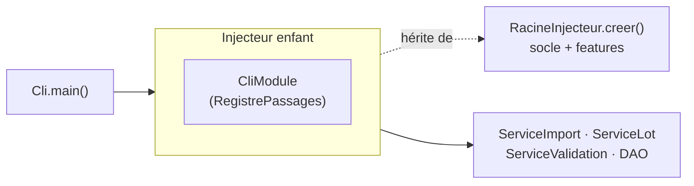

# Interface en ligne de commande (CLI)

À côté de l'IHM JavaFX, VigieChiro expose un **point d'entrée sans interface graphique** :
[`fr.univ_amu.iut.cli.Cli`](https://github.com/IUTInfoAix-S201/vigiechiro-pr-companion/blob/main/src/main/java/fr/univ_amu/iut/cli/Cli.java).
Il répond au besoin de **scriptabilité** (parcours A10 : enchaîner des imports/exports sans clics,
pour les utilisateurs avancés). La CLI **n'a pas de logique propre** : elle orchestre les **services
métier existants** (`ServiceImport`, `ServiceLot`, `ServiceValidation`, DAO multi-features).

!!! abstract "Principe : réutiliser, pas réimplémenter"
    La CLI et l'IHM sont **deux façades** sur le même cœur métier. Tout ce que fait la ligne de
    commande, l'application graphique le fait aussi, *via les mêmes services*. C'est l'intérêt d'avoir
    isolé le métier des vues (cf. [Architecture](architecture.md)) : on peut lui greffer une seconde
    surface sans le dupliquer.

## Comment elle s'assemble (injecteur enfant)

La CLI a besoin de **tout le graphe applicatif** (socle + features) **plus** quelques aides de lecture
qui lui sont propres. Plutôt que de modifier la composition racine, elle crée un **injecteur enfant** :

```java
RacineInjecteur.creer().createChildInjector(new CliModule());
```

L'enfant **hérite** de tous les bindings du socle et des features (dont les services et DAO), et y
**ajoute** les aides CLI sans rien retirer ni remplacer. C'est le patron *injecteur enfant* de Guice,
détaillé dans [Injection (Guice)](injection.md).



[`CliModule`](https://github.com/IUTInfoAix-S201/vigiechiro-pr-companion/blob/main/src/main/java/fr/univ_amu/iut/cli/di/CliModule.java)
n'apporte qu'une chose :
[`RegistrePassages`](https://github.com/IUTInfoAix-S201/vigiechiro-pr-companion/blob/main/src/main/java/fr/univ_amu/iut/cli/model/RegistrePassages.java),
une **lecture transverse** qui croise les DAO de `passage` et `sites` pour reconstituer le contexte
« carré / point » de chaque passage. La dépendance va `cli → <feature>.model.dao` (jamais vers une
`view`/`viewmodel`) : c'est l'unique entorse autorisée par la règle ArchUnit assouplie, et `cli` reste
un **puits** (aucune feature ne dépend de lui), donc le graphe reste acyclique.

## Les sous-commandes

| Commande | Options | Parcours | Service |
|---|---|---|---|
| `creer-site` | `--carre <n> [--nom ..] [--protocole ..] [--commentaire ..]` | A10 | `ServiceSites.creerSite` |
| `ajouter-point` | `--site <id> --code <c> [--lat ..] [--lon ..] [--description ..]` | A10 | `ServiceSites.ajouterPoint` |
| `lister-sites` | `[--json]` | A10 | `ServiceSites` (lecture) |
| `lister-passages` | `[--json]` | P5 | `RegistrePassages` (lecture) |
| `statut-passage` | `--passage <id> [--json]` | M-Passage | `ServicePassage.detailPassage` + `ResultatsIdentificationDao` (lecture) |
| `importer` | `--source <dir> --point <id> [--annee N] [--passage N]` | P2 | `ServiceImport` |
| `importer-tadarida` | `--passage <id> --csv <fichier> [--remplacer]` | P6 | `ServiceValidation.importer` / `reimporter` |
| `qualifier` | `--passage <id> --verdict <ok\|douteux\|a-jeter> [--commentaire ..]` | R13 | `ServicePassage.poserVerdict` |
| `exporter-lot` | `--passage <id>` | P4 | `ServiceLot` |
| `deposer` | `--passage <id>` | P8 | `ServiceLot.preparerLot` + `marquerDepose` (marquage **manuel**) |
| `synchroniser-vigiechiro` | `[--token <jeton>]` | #1181 | rejoue les `RapprochementVigieChiro` (taxons, sites/points) après un `GET /moi` de contrôle ; `0` ssi connecté |
| `deposer-vigiechiro` | `--passage <id> [--token <jeton>] [--archives\|--wav]` | #1043 | `DepotVigieChiro.deposer` (moteur **reprenable** #982, téléversement **parallèle** #984). Défaut = `ServiceLot.fichiersDepotParDefaut`, **le même choix que M-Lot** : ZIP si présentes, sinon invite à les générer (étape 2), sinon repli WAV. `--archives`/`--wav` forcent l'un ou l'autre |
| `lancer-traitement-vigiechiro` | `--passage <id> [--token <jeton>] [--forcer]` | #984, #1261, #1265 | `DepotVigieChiro.lancerTraitement` (`POST /participations/{id}/compute`) — équivalent du bouton « Lancer la participation ». `0` **dès lors que le traitement est en route** (accepté **ou** déjà en cours : la commande est idempotente), `1` sinon. Une nuit **déjà analysée n'est pas relancée** : le serveur détruirait ses observations pour les recalculer, sans pouvoir les régénérer (audio absent d'un dépôt en archives, #1244) — `--forcer` lève cette garde, typiquement après un échec |
| `etat-traitement-vigiechiro` | `--passage <id> [--token <jeton>]` | #1265 | `SuiviTraitement.relever` (lecture seule : `GET /participations/{id}` → bloc `traitement`, et **mise à jour du cache local** #1262). Codes **faits pour un script** : `0` terminé, `3` planifié/en cours/nouvel essai, `2` en échec, `4` jamais lancé, `1` erreur technique |
| `reinitialiser-depot` | `--passage <id>` | #984 | `ServiceLot.reinitialiserDepot` (efface le plan `depot_unite`, retour « Prêt à déposer » ; **local**, archives ZIP et lien de participation conservés) — équivalent du bouton « Réinitialiser le dépôt » |
| `verifier-depot-vigiechiro` | `--passage <id> [--token <jeton>]` | #1132 | `VerificationDepot.verifier` (lecture seule : journal de traitement + titres des `donnees` vs plan `depot_unite` ; `0` ssi tout est retrouvé) |
| `importer-vigiechiro` | `--passage <id> [--remplacer] [--participation <objectid>] [--token <jeton>]` | #1181 | `ImportVigieChiro.importer` (résultats Tadarida depuis l'API, sans CSV ; `--participation` = rattachement préalable) |
| `publier-corrections-vigiechiro` | `--passage <id> [--token <jeton>]` | #723 | `PublicationCorrections.publier` (un PATCH par observation publiable : taxon + certitude + ancrage ; idempotente, code 1 si refus) |
| `archiver` | `--passage <id> [--confirmer]` | #1300 | `ServiceArchivagePassage.archiver` : libère le disque d'une nuit **déposée** (séquences + bruts), après avoir **capturé les empreintes**. Sans `--confirmer`, annonce ce qui serait supprimé et sort en `2` : la suppression est irréversible, elle ne se fait pas par inadvertance |
| `reactiver` | `--passage <id> --source <dir> [--json]` | #1302 | `ServiceReactivationPassage.reactiver` : rebranche les fichiers retrouvés, **fichier par fichier**, via la [cascade de preuves](patterns.md#cascade-de-preuves-verification-graduee-refuser-plutot-que-se-tromper). Non destructive et **idempotente**. `0` si l'audio redevient complet, `1` s'il reste partiel (les écarts sont énumérés) |
| `reconstruire-passage` | `[--participation <objectid>] [--json]` | #1305 | `ServiceReconstructionPassages` : sans argument, **liste** les participations VigieChiro sans équivalent local (nuits déposées depuis un autre poste, ou avant l'application) ; avec `--participation`, en **reconstruit** une en passage archivé (séquences recréées + observations rapatriées). Les **lacunes** sont imprimées avec le rapport |
| `retro-empreintes` | *(aucune option)* | #1299 | `BackfillEmpreintes` : pose les empreintes manquantes sur **toutes** les nuits importées avant V23. Rejouable sans risque (ne touche que ce qui manque) |
| `exporter-vu` | `--passage <id> --sortie <fichier>` | P7 | `ServiceValidation` |
| `exporter-observations` | `--passage <id> --sortie <fichier>` | #149 | `ProjectionsAudioDao.lignesAudioDuPassage` + `ExportObservationsCsv` |
| `--help` / `-h`, `--version` / `-V`, ou aucun argument | — | — | — |

### Socle : registre de commandes picocli (#614)

Le CLI repose sur **[picocli](https://picocli.info) 4.7.7** : chaque commande est une classe annotée
`@Command` de `cli.commande` (`ListerPassages`, `Importer`, `ExporterLot`, `ExporterVu`) déclarant son nom,
ses `@Option` (types convertis automatiquement) et son aide. La **commande racine**
[`CommandeRacine`](https://github.com/IUTInfoAix-S201/vigiechiro-pr-companion/blob/main/src/main/java/fr/univ_amu/iut/cli/commande/CommandeRacine.java)
liste les sous-commandes ; l'**aide, l'usage et la liste des commandes sont générés** par picocli (plus de
texte d'aide maintenu à la main). Les commandes restent des **façades** : aucune logique propre, elles
appellent les services.

- **Instanciation par Guice** :
  [`FabriqueGuice`](https://github.com/IUTInfoAix-S201/vigiechiro-pr-companion/blob/main/src/main/java/fr/univ_amu/iut/cli/FabriqueGuice.java)
  (une `IFactory` picocli) fait **construire chaque commande par l'injecteur**, pour que ses services
  `@Inject` soient fournis ; picocli renseigne ensuite les champs `@Option`. Le module étant un
  `open module`, aucun `opens ... to info.picocli` n'est nécessaire.
- **Migration** : `Cli.executer` migre la base (idempotent) **avant** d'exécuter une sous-commande (pas
  pour l'aide seule), via une `IExecutionStrategy`.
- **Sortie `--json`** : convention uniforme pour les commandes de lecture (scriptabilité), sérialisée par
  [`FormatJson`](https://github.com/IUTInfoAix-S201/vigiechiro-pr-companion/blob/main/src/main/java/fr/univ_amu/iut/cli/FormatJson.java)
  (écrivain JSON minimal, sans dépendance supplémentaire).
- **Erreurs** : les erreurs de parsing (commande inconnue, argument requis manquant) sont reformulées en
  français et sortent en code `2` ; une
  [`ErreurUsage`](https://github.com/IUTInfoAix-S201/vigiechiro-pr-companion/blob/main/src/main/java/fr/univ_amu/iut/cli/model/ErreurUsage.java)
  levée dans la logique (ex. point introuvable) sort aussi en `2` ; toute autre exception métier en `1`
  (message seul, jamais la trace).

### Workspace surchargeable

Comme l'IHM, la CLI travaille dans un **workspace** (qui contient la base `vigiechiro.db`). L'option
globale `--workspace <dir>` est consommée par `main()` **avant** de bâtir l'injecteur (elle positionne
la propriété système `vigiechiro.workspace`, lue par `CommunModule`). Sans elle, le workspace par
défaut est `<Documents>/VigieChiro-Companion`.

### Codes de sortie

| Code | Signification |
|---|---|
| `0` | succès |
| `1` | échec d'exécution (règle métier refusée, accès aux données, E/S) |
| `2` | mauvaise invocation (commande inconnue, argument requis manquant ou mal formé) |

`deposer-vigiechiro` étend la convention : `0` **seulement si le dépôt est complet** ; `1` si des
fichiers restent à reprendre (relancer la même commande ne re-téléverse que les manquants). Le jeton
vient de `--token`, sinon de la variable d'environnement `VIGIECHIRO_TOKEN`, sinon de la **connexion
enregistrée** dans l'application (préférer la variable d'environnement : `--token` laisse le jeton dans
l'historique du shell).

Ces codes rendent le **cycle de dépôt complet scriptable** (#984). Le dépôt **ne déclenche pas** le
traitement serveur : il faut l'appeler explicitement.

```bash
export VIGIECHIRO_TOKEN=…
vigiechiro deposer-vigiechiro --passage 9 \
  && vigiechiro lancer-traitement-vigiechiro --passage 9 \
  && vigiechiro verifier-depot-vigiechiro --passage 9   # après le calcul serveur
```

Le calcul serveur dure des dizaines de minutes (Tadarida tourne sur une ferme de calcul distante).
L'application ne **surveille** jamais la plateforme d'elle-même — le site officiel ne le fait pas
davantage — mais un script, lui, peut l'interroger à son rythme. C'est le rôle des codes de retour
d'`etat-traitement-vigiechiro`, le `3` signifiant « patiente » :

```bash
# attendre la fin du calcul, puis importer les observations
until vigiechiro etat-traitement-vigiechiro --passage 9; [ $? -ne 3 ]; do sleep 300; done
vigiechiro importer-vigiechiro --passage 9
```

En cas de dépôt à refaire de zéro (unités marquées déposées à tort), `reinitialiser-depot --passage 9`
efface le plan local et ramène le passage à « Prêt à déposer » — les archives et la participation sont
conservées, le dépôt suivant re-téléverse tout.

`executer(...)` **ne fait pas** `System.exit` (il *renvoie* le code) : c'est ce qui le rend testable.
Seul `main()` traduit le code en `System.exit`. La base est **migrée au démarrage** (idempotent) avant
toute commande, donc une première invocation crée le schéma si besoin.

## Lancer la CLI

Il n'y a pas encore de lanceur empaqueté : on l'exécute via `exec-maven-plugin` (même mécanique que le
[banc de performance](performance.md)), avec le **JDK 25 standard** (comme la CI) :

```bash
export JAVA_HOME=~/.sdkman/candidates/java/25.0.2-open
./mvnw -q -DskipTests compile
./mvnw -q org.codehaus.mojo:exec-maven-plugin:exec \
  -Dexec.executable="$JAVA_HOME/bin/java" -Dexec.classpathScope=runtime \
  -Dexec.args="-cp %classpath fr.univ_amu.iut.cli.Cli --workspace /tmp/vigiechiro-cli lister-passages"
```

`Cli.main(String[])` existe et reste le point d'entrée naturel pour un futur lanceur natif (jpackage).

## Tests

La CLI est couverte par
[`CliTest`](https://github.com/IUTInfoAix-S201/vigiechiro-pr-companion/blob/main/src/test/java/fr/univ_amu/iut/cli/CliTest.java)
(dispatch, codes de sortie, aide),
[`CliImportTest`](https://github.com/IUTInfoAix-S201/vigiechiro-pr-companion/blob/main/src/test/java/fr/univ_amu/iut/cli/CliImportTest.java)
et
[`CliExportVuTest`](https://github.com/IUTInfoAix-S201/vigiechiro-pr-companion/blob/main/src/test/java/fr/univ_amu/iut/cli/CliExportVuTest.java).
Ils positionnent `vigiechiro.workspace` sur un `@TempDir` et capturent les flux `sortie`/`erreur` :
aucun JavaFX, donc des tests **rapides et déterministes**.
