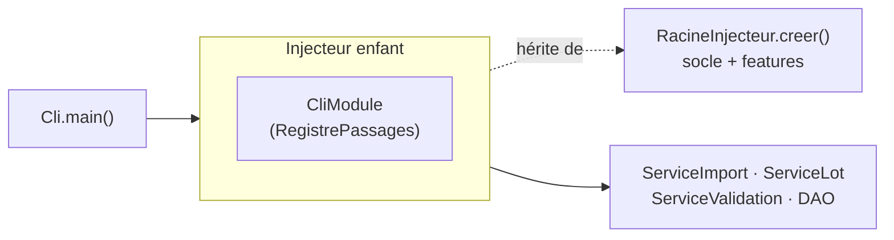

# Interface en ligne de commande (CLI)

À côté de l'IHM JavaFX, VigieChiro Companion expose un **point d'entrée sans interface graphique** :
[`fr.univ_amu.iut.cli.Cli`](https://github.com/echonuit/vigiechiro-pr-companion/blob/main/src/main/java/fr/univ_amu/iut/cli/Cli.java).
Il répond au besoin de **scriptabilité** (parcours A10 : enchaîner des imports/exports sans clics,
pour les utilisateurs avancés). La CLI **n'a pas de logique propre** : elle orchestre les **services
métier existants** (`ServiceImport`, `ServiceLot`, `ServiceValidation`, DAO multi-features).

!!! abstract "Principe : réutiliser, pas réimplémenter"
    La CLI et l'IHM sont **deux façades** sur le même cœur métier. Tout ce que fait la ligne de
    commande, l'application graphique le fait aussi, *via les mêmes services*. C'est l'intérêt d'avoir
    isolé le métier des vues (cf. [Architecture](architecture.md)) : on peut lui greffer une seconde
    surface sans le dupliquer.

## Comment elle s'assemble (injecteur enfant)

La CLI a besoin de **tout le graphe applicatif** (socle + features) **plus** quelques aides de lecture
qui lui sont propres. Plutôt que de modifier la composition racine, elle crée un **injecteur enfant** :

```java
RacineInjecteur.creer().createChildInjector(new CliModule());
```

L'enfant **hérite** de tous les bindings du socle et des features (dont les services et DAO), et y
**ajoute** les aides CLI sans rien retirer ni remplacer. C'est le patron *injecteur enfant* de Guice,
détaillé dans [Injection (Guice)](injection.md).



[`CliModule`](https://github.com/echonuit/vigiechiro-pr-companion/blob/main/src/main/java/fr/univ_amu/iut/cli/di/CliModule.java)
n'apporte qu'une chose :
[`RegistrePassages`](https://github.com/echonuit/vigiechiro-pr-companion/blob/main/src/main/java/fr/univ_amu/iut/cli/model/RegistrePassages.java),
une **lecture transverse** qui croise les DAO de `passage` et `sites` pour reconstituer le contexte
« carré / point » de chaque passage. La dépendance va `cli → <feature>.model.dao` (jamais vers une
`view`/`viewmodel`) : c'est l'unique entorse autorisée par la règle ArchUnit assouplie, et `cli` reste
un **puits** (aucune feature ne dépend de lui), donc le graphe reste acyclique.

## Les sous-commandes

!!! note "Ce tableau est tenu par un test"
    `DocumentationAJourTest` confronte ce tableau aux sous-commandes **réellement câblées** dans
    l'annotation `@Command` de `CommandeRacine` : ajouter une commande sans lui écrire sa ligne **fait
    rougir la CI** (#1458). Le tableau a compté jusqu'à **22 commandes sur 29** avant qu'on s'en aperçoive.

| Commande | Options | Parcours | Service |
|---|---|---|---|
| `creer-site` | `--carre <n> [--nom ..] [--protocole ..] [--commentaire ..]` | A10 | `ServiceSites.creerSite` |
| `ajouter-point` | `--site <id> --code <c> [--lat ..] [--lon ..] [--description ..]` | A10 | `ServiceSites.ajouterPoint` |
| `lister-sites` | `[--json]` | A10 | `ServiceSites` (lecture) |
| `lister-passages` | `[--json]` | P5 | `RegistrePassages` (lecture) |
| `statut-passage` | `--passage <id> [--json]` | M-Passage, #1878 | `ServicePassage.detailPassage` + `ResultatsIdentificationDao` + `ServiceConditionsPassage.heuresProuvees` (lecture). La ligne « Nuit » dit l'**origine** de ses heures - `[attestées par les enregistrements]` ou `[déclarées, modifiables]` -, et le JSON porte `heuresProuvees` : un script sait ainsi **avant** d'essayer si `metadonnees-passage --heure-debut` sera refusé, au lieu de l'apprendre en échouant |
| `verifier-maj` | *(aucune option)* | #2109 | `VerificateurMiseAJour` (lecture seule, réseau) : indique si une version plus récente est publiée. Pendant CLI de l'annonce au démarrage de l'IHM. **Trois codes de sortie**, parce qu'un script ne pilote pas « à jour » et « je n'ai pas pu savoir » de la même façon : `0` à jour, `10` mise à jour disponible, `1` vérification impossible (hors ligne, ou version locale inconnue car lancée hors d'un artefact publié). Se tait dès qu'un doute existe plutôt que d'annoncer à tort ; désactivable avec la feature `maj` |
| `diagnostiquer` | `--passage <id> [--json] [--csv <serie\|anomalies>]` | P6, #1672 | `ServiceDiagnostic.diagnostiquer` (lecture seule) : bilan matériel d'une nuit (climat R20, T° début nuit, cohérence horaire #548, GPS du point, anomalies/évènements R19). Parité CLI de M-Diagnostic. `--csv` exporte série ou anomalies via `ExportDiagnostic` (P6-CA6) |
| `importer` | `--source <dir> --point <id> [--annee N] [--passage N] [--conserver-originaux \| --sans-originaux] [--ecraser]` | P2 | `ServiceImport`. Le mode de conservation suit le **réglage** `import.conserver-originaux` (par défaut : **pas de copie**) ; les deux options le forcent pour un import ponctuel et s'excluent. Auparavant la commande conservait **en dur**, quel que soit le réglage (#2064). La sortie rapporte aussi le **doublon de nuit** et les **anomalies du journal** : l'écran les montre depuis #2044, la commande les taisait (#2004). **Collision de numéro** (#2278) : la perte est chiffrée (séquences, validations Tadarida) et, **sans `--ecraser`, rien n'est importé** — sortie `2`. Avec, `ServiceImport.ecraserEtImporter` sauvegarde d'abord, puis remplace la nuit existante |
| `importer-tadarida` | `--passage <id> --csv <fichier> [--remplacer]` | P6 | `ServiceValidation.importer` / `reimporter` |
| `qualifier` | `--passage <id> --verdict <ok\|utilisable\|inexploitable> [--commentaire ..]` | R13 | `ServicePassage.poserVerdict` (alias `douteux`/`a-jeter` rétro-compatibles) |
| `qualifier-fichier` | `--passage <id> --sequence <id> --verdict <bon\|mauvais\|inexploitable>` | #1512 | Verdict **par fichier** d'une séquence de la sélection d'écoute ; recalcule le verdict final proposé. Parité CLI de M-Qualification |
| `lister-selection` | `--passage <id> [--json]` | #1512 | Sélection d'écoute d'un passage : **verdict par fichier** de chaque séquence + **verdict final proposé** (dérivé). Parité CLI de M-Qualification, lecture seule |
| `pre-check` | `--passage <id> [--json]` | #1512 | **Pré-check consultatif** d'une nuit (3 feux : couverture horaire, nombre de fichiers, renommage) + résumé des anomalies. Parité CLI de M-Qualification, lecture seule, jamais bloquant (R13) |
| `constituer-selection` | `--passage <id> [--methode <reparti\|aleatoire\|manuel>] [--taille <n>]` | R12 | (Re)constitue la sélection d'écoute (échantillon à écouter). Remplace la sélection existante et **efface** ses verdicts. Parité CLI de « Personnaliser… » / « Régénérer » |
| `exporter-lot` | `--passage <id>` | P4 | `ServiceLot` |
| `deposer` | `--passage <id>` | P8 | `ServiceLot.preparerLot` + `marquerDepose` (marquage **manuel**) |
| `recuperer-vigiechiro` | `[--token <jeton>]` | #1181, #1866 | rejoue les `RapprochementVigieChiro` (taxons, sites/points) après un `GET /moi` de contrôle ; `0` ssi connecté. Le geste ne fait que **recevoir**, d'où le verbe ([ADR 0022](decisions/0022-le-verbe-dit-le-sens-de-l-echange.md)) ; **alias** `synchroniser-vigiechiro`, conservé pour les scripts |
| `deposer-vigiechiro` | `--passage <id> [--token <jeton>] [--archives\|--wav]` | #1043 | `DepotVigieChiro.deposer` (moteur **reprenable** #982, téléversement **parallèle** #984). Défaut = `ServiceLot.fichiersDepotParDefaut`, **le même choix que M-Lot** : ZIP si présentes, sinon invite à les générer (étape 2), sinon repli WAV. `--archives`/`--wav` forcent l'un ou l'autre |
| `lancer-traitement-vigiechiro` | `--passage <id> [--token <jeton>] [--forcer]` | #984, #1261, #1265 | `DepotVigieChiro.lancerTraitement` (`POST /participations/{id}/compute`) — équivalent du bouton « Lancer la participation ». `0` **dès lors que le traitement est en route** (accepté **ou** déjà en cours : la commande est idempotente), `1` sinon. Une nuit **déjà analysée n'est pas relancée** : le serveur détruirait ses observations pour les recalculer, sans pouvoir les régénérer (audio absent d'un dépôt en archives, #1244) — `--forcer` lève cette garde, typiquement après un échec |
| `etat-traitement-vigiechiro` | `--passage <id> [--token <jeton>]` | #1265 | `SuiviTraitement.relever` (lecture seule : `GET /participations/{id}` → bloc `traitement`, et **mise à jour du cache local** #1262). Codes **faits pour un script** : `0` terminé, `3` planifié/en cours/nouvel essai, `2` en échec, `4` jamais lancé, `1` erreur technique |
| `reinitialiser-depot` | `--passage <id>` | #984 | `ServiceLot.reinitialiserDepot` (efface le plan `depot_unite`, retour « Prêt à déposer » ; **local**, archives ZIP et lien de participation conservés) — équivalent du bouton « Réinitialiser le dépôt » |
| `supprimer-passage` | `--passage <id> [--confirmer]` | #2278 | `ServicePassage.supprimer` — équivalent du bouton « Supprimer » de la fiche passage. **Destructif** : chiffre d'abord la perte (séquences, validations Tadarida menacées) puis, **sans `--confirmer`, ne touche à rien et sort en `2`**. Un passage **déposé** ou introuvable est refusé par le métier (code `1`). La cascade s'arrête à la base : les fichiers de la nuit restent sur le disque |
| `verifier-depot-vigiechiro` | `--passage <id> [--token <jeton>]` | #1132 | `VerificationDepot.verifier` (lecture seule : journal de traitement + titres des `donnees` vs plan `depot_unite` ; `0` ssi tout est retrouvé) |
| `importer-vigiechiro` | `--passage <id> [--remplacer] [--participation <objectid>] [--token <jeton>]` | #1181, #1838 | `ImportVigieChiro.importerRapide` (résultats Tadarida depuis l'API ; `--participation` = rattachement préalable). Au **premier import**, prend le **CSV d'observations** d'un coup (#1565) quand la plateforme l'expose, avec **repli** sur la pagination `donnees`. Avec `--remplacer`, reste sur les `donnees` : un ré-import va chercher ce qui a changé côté serveur (avis du validateur, fils), que le CSV effacerait. Le CSV ne porte ni ancrage ni fils de discussion : la **publication** les acquiert ensemble quand elle en a besoin ([ADR 0019](decisions/0019-ancrage-acquis-quand-il-sert.md)) |
| `publier-corrections-vigiechiro` | `--passage <id> [--token <jeton>]` | #723, #1838 | `PublicationCorrections.publier` (un PATCH par observation publiable : taxon + certitude + ancrage ; idempotente, code 1 si refus). **Acquiert d'abord l'ancrage qui manque** (#1838) quand la nuit est rattachée à une participation : une nuit importée par CSV (#1565) n'en porte pas, ses corrections seraient sinon toutes écartées. Le rapatriement peut durer ; son avancement va sur la **sortie d'erreur**, la sortie standard restant réservée au bilan. Une nuit déjà ancrée n'en paie pas le coût |
| `reactiver` | `--passage <id> --source <dir> [--referencer] [--json]` | #1302, #1406, #1571, #2255 | `ServiceReactivationPassage.reactiver` : rebranche les fichiers retrouvés, **fichier par fichier**, via la [cascade de preuves](patterns.md#cascade-de-preuves-verification-graduee-refuser-plutot-que-se-tromper). Le dossier est **reconnu**, pas déclaré : s'il ne contient que les **bruts**, les séquences sont **régénérées** (transformation déterministe) puis vérifiées comme n'importe quel candidat — la voie empruntée est dite (champ `voie` en JSON). Non destructive et **idempotente**. `0` si l'audio redevient complet, `1` s'il reste partiel (les écarts sont énumérés). Sur un passage **reconstruit** (observations sans ancrage), acquiert en plus l'**ancrage plateforme** par ré-import des `donnees` (#1571) pour rendre les corrections publiables — **le seul cas où `reactiver` touche le réseau**. Avec **`--referencer`** (#2255), **rien n'est copié** : la base pointe les fichiers là où ils vivent (NAS, disque externe, dossier de travail). La nuit devient muette si ce support n'est plus joignable et redevient écoutable quand il revient, l'identité étant revérifiée (#2254). Les tranches **régénérées** depuis les bruts restent copiées : elles sont produites par l'application, pas par l'utilisateur |
| `reconstruire-passage` | `[--participation <objectid>] [--json]` | #1305, #1565 | `ServiceReconstructionPassages` : sans argument, **liste** les participations VigieChiro sans équivalent local (nuits déposées depuis un autre poste, ou avant l'application) ; avec `--participation`, en **reconstruit** une en passage archivé (séquences recréées + observations rapatriées). La reconstruction bascule sur le **CSV d'observations** téléchargé d'un coup (#1565, quasi instantanée), avec **repli** sur la pagination `donnees` si le CSV n'est pas exposé. Les **lacunes** sont imprimées avec le rapport |
| `metadonnees-passage` | `(--passage <id> \| --tout) [--recuperer] [--envoyer] [--enregistreur <serie>] [--heure-debut <HH:mm> --heure-fin <HH:mm>] [--confirmer] [--json]` | #1861 | Parité CLI de la modale « Modifier le passage » : `--recuperer` rapatrie météo/micro/n° de série depuis la participation, `--envoyer` réécrit les métadonnées locales dessus (les heures y sont **réalignées sur les enregistrements**, #1878), `--enregistreur` et les heures écrivent en local sans réseau. **`--tout` est le rattrapage de saison** : sans lui, les correctifs #1814/#1828/#1844 ne réparent que la nuit sur laquelle on repasse. Comme il écrit sur la plateforme, il exige `--confirmer` ; sans, il **énumère ce qu'il ferait**. Best-effort par nuit, compte rendu nuit par nuit, code `1` s'il reste des nuits ignorées |
| `retro-empreintes` | *(aucune option)* | #1299 | `BackfillEmpreintes` : pose les empreintes manquantes sur **toutes** les nuits importées avant V23. Rejouable sans risque (ne touche que ce qui manque) |
| `exporter-vu` | `--passage <id> --sortie <fichier>` | P7 | `ServiceValidation` |
| `exporter-observations` | `--passage <id> --sortie <fichier>` | #149 | `ProjectionsAudioDao.lignesAudioDuPassage` + `ExportObservationsCsv` |
| `audit-coherence` | `[--passage <id>] [--json] [--online] [--token <jeton>]` | #1133, #1254, #1347 | `ServiceAuditCoherence` : confronte **disque, base et serveur**. Sans `--passage`, audite tout le workspace ; avec, une seule nuit (utile après l'avoir réparée). `--online` ajoute les constats qui demandent le réseau (dépôts, points). `0` ssi aucun constat d'erreur |
| `sauvegarder` | `[--complet] [--dossier <dir>]` | #148, #1346 | `ServiceSauvegarde` : instantané cohérent de la base (`VACUUM INTO`). `--complet` emporte **aussi l'audio** (dossiers de session) — c'est la **seule sauvegarde qui protège vraiment**, la plateforme ne rendant pas l'audio d'un dépôt en archives. Le bilan **dit ce qui n'a pas pu être copié** (carte SD non montée) et sort en `2` : une sauvegarde qu'on croit complète et qui ne l'est pas vaut moins que pas de sauvegarde |
| `restaurer` | `--sauvegarde <chemin> [--complet] --confirmer` | #148, #1346 | `ServiceSauvegarde.restaurer` / `restaurerComplet` : remet la base (et, avec `--complet`, les dossiers de session). **Écrase l'état local** : `--confirmer` est obligatoire. La base courante est mise de côté (`vigiechiro.db.avant-restauration`) |
| `reset-guide` | `[--json] [--executer --confirmer [--accepter-perte] [--sauvegarde <dir>]]` | #1151, #1419 | Sans `--executer` : **lecture seule** — ce que deviendrait l'audio de chaque nuit si l'on repartait d'une base neuve (disque / serveur / **perdu**), code `2` dès qu'une nuit est en « perdu », pour qu'un script puisse refuser d'enchaîner. Avec `--executer` : `ServiceReset` mène la procédure (sauvegarde complète → base neuve → repeuplement depuis VigieChiro → audit final). Il **refuse de démarrer** si la perte n'est pas acceptée, **ou si VigieChiro ne répond pas** — une base neuve qu'on ne peut pas repeupler est une destruction sèche. Dans les deux cas, la base reste **intacte** |
| `lister-observations` | `--passage <id> [--statut ..] [--taxon ..] [--douteux] [--reference] [--certitude ..] [--json]` | #1311 | **La surface de découverte de la revue.** Liste les observations d'un passage avec leur **identifiant**, l'avis de Tadarida, le vôtre, celui du validateur, le statut et les drapeaux. Sans elle, les gestes de revue (et `discussion`) sont aveugles : rien ne donnait les identifiants. Ses filtres sont **exactement** ceux des gestes (`SelectionObservations` partagé) : ce qu'elle montre est ce qu'ils toucheraient |
| `valider-observations` | `(--observation <ids> \| --passage <id> [filtres] [--confirmer])` | R15, #1311 | **Accepte la proposition de Tadarida**, en lot atomique (mode **Activité** : traite exactement les lignes visées ; le mode *Inventaire*, qui **propage** à d'autres lignes, reste à l'écran - propager dans un script toucherait des lignes que l'utilisateur ne voit pas) |
| `corriger-observations` | `--taxon <code> (--observation <ids> \| --passage <id> [filtres] [--confirmer])` | R16, #1311 | **Retient un autre taxon**, en lot atomique. Le taxon doit exister au référentiel : un code inconnu arrête tout **avant** la moindre écriture |
| `marquer-douteux` | `[--retirer] (--observation <ids> \| --passage <id> [filtres] [--confirmer])` | #160, #1311 | Lève (ou baisse) le drapeau **« douteuse »**. Ce drapeau ne dit **rien** du taxon : il dit « je ne sais pas », une **troisième** réponse qui n'est ni valider ni corriger. Réversible |
| `marquer-reference` | `[--retirer] (--observation <ids> \| --passage <id> [filtres] [--confirmer])` | P10, #1311 | Verse (ou retire) les observations dans la **bibliothèque de sons de référence** - la source `References` de l'écran, et la matière de son export |
| `poser-certitude` | `(--certitude <SUR\|PROBABLE\|POSSIBLE> \| --effacer) (--observation <ids> \| --passage <id> [filtres] [--confirmer])` | #1139, #1311 | Déclare la **certitude observateur**. Il faut **choisir explicitement** : elle ne se déduit **ni** de la probabilité Tadarida **ni** d'une validation, et reste **vide par défaut**. C'est un jugement, que la plateforme exigera avec le taxon (#723) et qu'un naturaliste lira comme la parole de l'observateur |
| `discussion` | `--observation <id> [--message <texte> --confirmer]` | #1417, #1418 | Le **fil d'échange avec le validateur** du MNHN. Sans `--message`, le **lit** (le fil vient de la base, rafraîchi à chaque import). Avec, **y répond** — ⚠️ **écriture définitive** : le serveur ajoute par `$push` et n'offre aucune route de suppression. `--confirmer` est donc obligatoire, et le message n'est écrit localement **qu'après** que le serveur l'a accepté |
| `emplacements` | `[--definir-travail <dir>] [--definir-base <dir>] [--reinitialiser] [--json]` | #1038 | Parité CLI de l'onglet « Emplacements » ([ADR 1038](decisions/1038-la-configuration-d-amorcage-vit-hors-de-la-base.md)) : `ServiceEmplacements`. Sans option, **affiche** où vivent le dossier de travail et la base (et leurs défauts). `--definir-*` **sonde** chaque dossier (un fichier ou un dossier non inscriptible est refusé, code `1`) puis **écrit** le choix ; `--reinitialiser` l'efface. Ne déplace **rien** : change le pointeur lu au prochain démarrage, pas les données - une base pointée vers un dossier vide démarre neuve. `--reinitialiser` et `--definir-*` sont exclusifs |
| `--help` / `-h`, `--version` / `-V`, ou aucun argument | — | — | — |

### Socle : registre de commandes picocli (#614)

Le CLI repose sur **[picocli](https://picocli.info) 4.7.7** : chaque commande est une classe annotée
`@Command` de `cli.commande` (`ListerPassages`, `Importer`, `ExporterLot`, `ExporterVu`) déclarant son nom,
ses `@Option` (types convertis automatiquement) et son aide. La **commande racine**
[`CommandeRacine`](https://github.com/echonuit/vigiechiro-pr-companion/blob/main/src/main/java/fr/univ_amu/iut/cli/commande/CommandeRacine.java)
liste les sous-commandes ; l'**aide, l'usage et la liste des commandes sont générés** par picocli (plus de
texte d'aide maintenu à la main). Les commandes restent des **façades** : aucune logique propre, elles
appellent les services.

- **Instanciation par Guice** :
  [`FabriqueGuice`](https://github.com/echonuit/vigiechiro-pr-companion/blob/main/src/main/java/fr/univ_amu/iut/cli/FabriqueGuice.java)
  (une `IFactory` picocli) fait **construire chaque commande par l'injecteur**, pour que ses services
  `@Inject` soient fournis ; picocli renseigne ensuite les champs `@Option`. Le module étant un
  `open module`, aucun `opens ... to info.picocli` n'est nécessaire.
- **Migration** : `Cli.executer` migre la base (idempotent) **avant** d'exécuter une sous-commande (pas
  pour l'aide seule), via une `IExecutionStrategy`.
- **Sortie `--json`** : convention uniforme pour les commandes de lecture (scriptabilité), sérialisée par
  [`FormatJson`](https://github.com/echonuit/vigiechiro-pr-companion/blob/main/src/main/java/fr/univ_amu/iut/cli/FormatJson.java)
  (écrivain JSON minimal, sans dépendance supplémentaire).
- **Erreurs** : les erreurs de parsing (commande inconnue, argument requis manquant) sont reformulées en
  français et sortent en code `2` ; une
  [`ErreurUsage`](https://github.com/echonuit/vigiechiro-pr-companion/blob/main/src/main/java/fr/univ_amu/iut/cli/model/ErreurUsage.java)
  levée dans la logique (ex. point introuvable) sort aussi en `2` ; toute autre exception métier en `1`
  (message seul, jamais la trace).

### Workspace surchargeable

Comme l'IHM, la CLI travaille dans un **workspace** (qui contient la base `vigiechiro.db`). L'option
globale `--workspace <dir>` est consommée par `main()` **avant** de bâtir l'injecteur (elle positionne
la propriété système `vigiechiro.workspace`, lue par `CommunModule`). Sans elle, le workspace par
défaut est `<Documents>/VigieChiro-Companion`.

### Codes de sortie

| Code | Signification |
|---|---|
| `0` | succès |
| `1` | échec d'exécution (règle métier refusée, accès aux données, E/S) |
| `2` | mauvaise invocation (commande inconnue, argument requis manquant ou mal formé) **ou refus d'agir** |

**`2` dit aussi « j'ai refusé, je n'ai rien fait ».** Les commandes **destructives** exigent un drapeau
explicite (`--confirmer`, `--ecraser`) : sans lui, elles **chiffrent la perte** et sortent en `2` sans
rien toucher. C'est volontairement **distinct de `1`** — après un `1`, l'état est incertain ; après un
`2`, il est **intact**, et un script peut s'arrêter sans avoir à vérifier quoi que ce soit. Le message
de refus part sur **stderr**, pour ne pas se mêler au compte rendu.

Suivent cette règle : `supprimer-passage`, `importer --ecraser`, `restaurer`, `reset-guide --executer`,
`discussion`, `sauvegarder` (incomplète). `restaurer` rendait `1` sur stdout jusqu'à #2294 — la
convention n'était écrite nulle part, et c'est ainsi qu'elle a dérivé.

`deposer-vigiechiro` étend la convention : `0` **seulement si le dépôt est complet** ; `1` si des
fichiers restent à reprendre (relancer la même commande ne re-téléverse que les manquants). Le jeton
vient de `--token`, sinon de la variable d'environnement `VIGIECHIRO_TOKEN`, sinon de la **connexion
enregistrée** dans l'application (préférer la variable d'environnement : `--token` laisse le jeton dans
l'historique du shell).

Ces codes rendent le **cycle de dépôt complet scriptable** (#984). Le dépôt **ne déclenche pas** le
traitement serveur : il faut l'appeler explicitement.

```bash
export VIGIECHIRO_TOKEN=…
vigiechiro deposer-vigiechiro --passage 9 \
  && vigiechiro lancer-traitement-vigiechiro --passage 9 \
  && vigiechiro verifier-depot-vigiechiro --passage 9   # après le calcul serveur
```

Le calcul serveur dure des dizaines de minutes (Tadarida tourne sur une ferme de calcul distante).
L'application ne **surveille** jamais la plateforme d'elle-même — le site officiel ne le fait pas
davantage — mais un script, lui, peut l'interroger à son rythme. C'est le rôle des codes de retour
d'`etat-traitement-vigiechiro`, le `3` signifiant « patiente » :

```bash
# attendre la fin du calcul, puis importer les observations
until vigiechiro etat-traitement-vigiechiro --passage 9; [ $? -ne 3 ]; do sleep 300; done
vigiechiro importer-vigiechiro --passage 9
```

En cas de dépôt à refaire de zéro (unités marquées déposées à tort), `reinitialiser-depot --passage 9`
efface le plan local et ramène le passage à « Prêt à déposer » — les archives et la participation sont
conservées, le dépôt suivant re-téléverse tout.

`executer(...)` **ne fait pas** `System.exit` (il *renvoie* le code) : c'est ce qui le rend testable.
Seul `main()` traduit le code en `System.exit`. La base est **migrée au démarrage** (idempotent) avant
toute commande, donc une première invocation crée le schéma si besoin.

## Désigner les observations d'un geste de revue (#1311)

C'était la **vraie difficulté** de la parité : l'écran raisonne par **sélection dans une table**, la ligne
de commande **n'a pas de table**. Les gestes de revue offrent donc **deux** manières de désigner, exclusives
et obligatoires (on ne pose pas un geste sans dire sur quoi), portées par la classe **partagée**
`CiblesRevue` :

```bash
# 1. Chirurgical : sur des lignes qu'on a LUES.
./vigiechiro lister-observations --passage 3 --statut NON_TOUCHEE
./vigiechiro valider-observations --observation 12,13,14

# 2. Scripté : sur un sous-ensemble DÉCRIT, avec les MÊMES filtres que lister-observations.
./vigiechiro corriger-observations --taxon Pippip --passage 3 --taxon-tadarida Pipkuh
```

**La garantie** : c'est le **même** `SelectionObservations` qui choisit pour lister et pour agir. Ce que
`lister-observations --passage 3 --statut NON_TOUCHEE` **montre** est **exactement** ce que
`valider-observations --passage 3 --statut NON_TOUCHEE` **touche**. On regarde, puis on agit - et c'est
mécanique, pas promis.

!!! warning "Viser un passage sans filtre exige `--confirmer`"
    `--passage 3` **seul**, c'est **toutes** les observations du passage - des centaines. Un filtre oublié
    dans un script transforme « corrige ces trois lignes » en « corrige la nuit entière », et **rien** dans
    la commande ne distinguerait l'un de l'autre. Ce cas exige donc `--confirmer`.

    Et une sélection qui ne retient **rien** **lève**, au lieu de répondre « 0 observation traitée » : un
    geste qui ne touche rien est presque toujours une **erreur de filtre**.

Les filtres booléens (`--douteux`, `--reference`) sont **ternaires** : posés, ils ne gardent que les lignes
concernées ; **absents**, ils laissent passer **les deux** - ils ne veulent **pas** dire « seulement les
non-douteuses ».

## Lancer la CLI

Il n'y a pas encore de lanceur empaqueté : on l'exécute via `exec-maven-plugin` (même mécanique que le
[banc de performance](performance.md)), avec le **JDK 25 standard** (comme la CI) :

```bash
export JAVA_HOME=~/.sdkman/candidates/java/25.0.2-open
./mvnw -q -DskipTests compile
./mvnw -q org.codehaus.mojo:exec-maven-plugin:exec \
  -Dexec.executable="$JAVA_HOME/bin/java" -Dexec.classpathScope=runtime \
  -Dexec.args="-cp %classpath fr.univ_amu.iut.cli.Cli --workspace /tmp/vigiechiro-cli lister-passages"
```

`Cli.main(String[])` existe et reste le point d'entrée naturel pour un futur lanceur natif (jpackage).

## Tests

La CLI est couverte par
[`CliTest`](https://github.com/echonuit/vigiechiro-pr-companion/blob/main/src/test/java/fr/univ_amu/iut/cli/CliTest.java)
(dispatch, codes de sortie, aide),
[`CliImportTest`](https://github.com/echonuit/vigiechiro-pr-companion/blob/main/src/test/java/fr/univ_amu/iut/cli/CliImportTest.java)
et
[`CliExportVuTest`](https://github.com/echonuit/vigiechiro-pr-companion/blob/main/src/test/java/fr/univ_amu/iut/cli/CliExportVuTest.java).
Ils positionnent `vigiechiro.workspace` sur un `@TempDir` et capturent les flux `sortie`/`erreur` :
aucun JavaFX, donc des tests **rapides et déterministes**.
