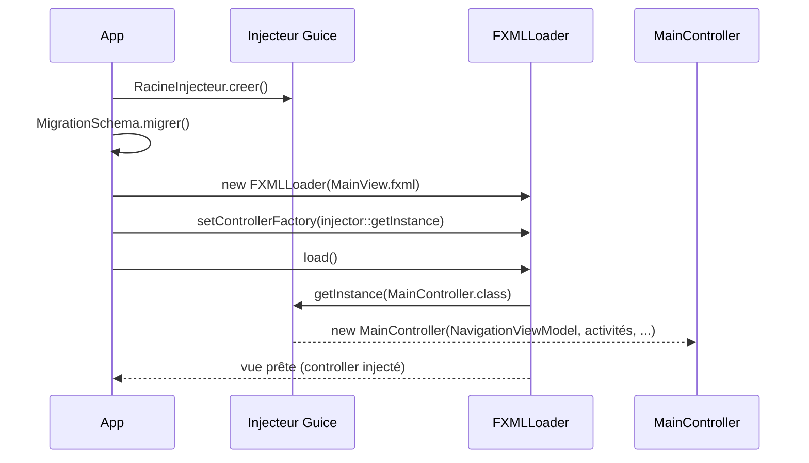

# Injection (Guice)

Toutes les dépendances sont câblées par **Guice 7** : services, DAO, ViewModels et même les
**controllers FXML**. Aucun `new` métier dispersé dans le code.

## La racine de composition

[`RacineInjecteur`](https://github.com/IUTInfoAix-S201/vigiechiro-pr-companion/blob/main/src/main/java/fr/univ_amu/iut/commun/di/RacineInjecteur.java)
est le **seul** endroit qui connaît la liste des modules : le socle (`CommunModule` +
`PersistenceModule`) et les **10 modules de feature**. Chaque feature publie ses DAO/services via son
propre module ; la racine se contente de les **installer**.

```java
public static Injector creer() {
    return Guice.createInjector(
        new CommunModule(), new PersistenceModule(),
        new SitesModule(), new PassageModule(), new QualificationModule(),
        new ValidationModule(), new MultisiteModule(), new ImportationModule(),
        new LotModule(), new DiagnosticModule(), new BibliothequeModule(),
        new RechercheModule());
}
```

!!! note "Pourquoi `commun.di` dépend des features"
    Une racine de composition **connaît tout le monde** : c'est son rôle. Le test ArchUnit
    `features_sans_cycle` **exclut** explicitement `commun/di/` de la détection de cycles (sinon
    `commun ↔ sites` apparaîtrait comme un faux cycle).

!!! info "La CLI utilise un injecteur enfant"
    La feature `cli` ne s'installe pas dans la racine : elle crée un **injecteur enfant**
    (`RacineInjecteur.creer().createChildInjector(new CliModule())`). L'enfant hérite de tout le
    graphe et y ajoute ses aides : voir [Interface en ligne de commande (CLI)](cli.md).

## Ce que publie un module de feature

Un module hérite d'`AbstractModule`. Sur le patron de
[`PassageModule`](https://github.com/IUTInfoAix-S201/vigiechiro-pr-companion/blob/main/src/main/java/fr/univ_amu/iut/passage/di/PassageModule.java) :

```java
public class PassageModule extends AbstractModule {
    @Override protected void configure() {
        // contrat de navigation socle -> implémentation de cette feature
        bind(OuvrirPassage.class).to(NavigationPassage.class);
        // contribution à l'accueil (multibinding)
        Multibinder.newSetBinder(binder(), IndicateurAccueil.class)
                   .addBinding().to(IndicateurPassages.class);
    }
    @Provides @Singleton PassageDao passageDao(SourceDeDonnees s) { return new PassageDao(s); }
    // ... autres @Provides ...
}
```

Trois mécanismes à retenir :

- **`@Provides @Singleton`** assemble les DAO à partir de la `SourceDeDonnees` (singleton du socle).
  Les DAO eux-mêmes restent **sans annotation d'injection** : la couche `model.dao` ignore Guice
  (objectif réutilisation O6).
- **`bind(Contrat).to(Impl)`** branche un **contrat de navigation** `Ouvrir*` du socle sur
  l'implémentation de la feature (cf. [Navigation](navigation.md#ouvrir-une-autre-feature-sans-en-dependre)).
- **`Multibinder`** laisse une feature **contribuer** à un ensemble que le socle agrège : les
  `ActiviteAccueil` (cartes de l'accueil) et les `IndicateurAccueil` (compteurs du tableau de bord).
  Le `MainController` injecte le `Set<ActiviteAccueil>` complet sans connaître les features.

## Des controllers FXML injectés

C'est la clé du câblage Vue↔ViewModel.
[`App`](https://github.com/IUTInfoAix-S201/vigiechiro-pr-companion/blob/main/src/main/java/fr/univ_amu/iut/App.java)
pose une **`controllerFactory`** sur le `FXMLLoader` : chaque controller est alors **instancié par
Guice** (injection par constructeur), donc reçoit ses ViewModels/services.



Toute classe de navigation (`Navigation*`) réutilise ce patron : `loader.setControllerFactory(injector::getInstance)`
avant `loader.load()`, pour que le controller de l'écran ouvert soit injecté lui aussi.

## Valeurs transverses : bindings nommés

Certaines valeurs partagées sont fournies par **binding nommé**. Exemple :
`@Named("idUtilisateurCourant")` (application mono-utilisateur : le premier utilisateur en base).
Un VM/service la reçoit par `@Inject ... @Named("idUtilisateurCourant") String idUtilisateur`.

---

Pour assembler une feature complète de bout en bout, voir
**[Ajouter une fonctionnalité](ajouter-une-fonctionnalite.md)**.
