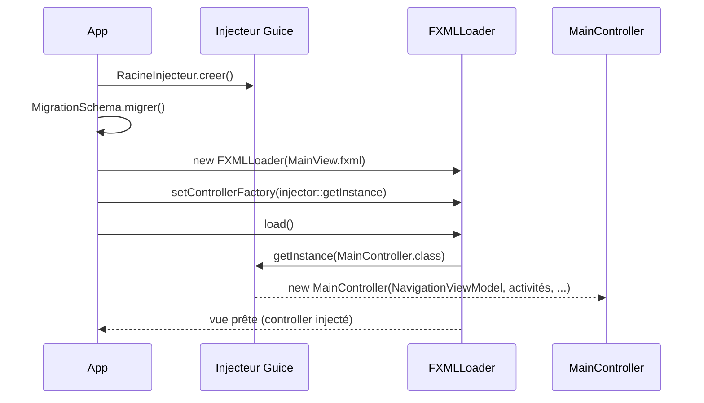

# Injection (Guice)

Toutes les dépendances sont câblées par **Guice 7** : services, DAO, ViewModels et même les
**controllers FXML**. Aucun `new` métier dispersé dans le code.

## La racine de composition

[`RacineInjecteur`](https://github.com/IUTInfoAix-S201/vigiechiro-pr-companion/blob/main/src/main/java/fr/univ_amu/iut/commun/di/RacineInjecteur.java)
assemble le graphe : le **socle** (`CommunModule` + `PersistenceModule`), installé **explicitement**,
et les **modules de feature**, **auto-découverts** via `ServiceLoader<`[`ModuleDeFeature`](https://github.com/IUTInfoAix-S201/vigiechiro-pr-companion/blob/main/src/main/java/fr/univ_amu/iut/commun/di/ModuleDeFeature.java)`>`.

```java
public static List<Module> modules() {
    List<Module> modules = new ArrayList<>();
    modules.add(new CommunModule());          // socle : toujours explicite
    modules.add(new PersistenceModule());
    Predicate<ModuleDeFeature> actif = Fonctionnalites.filtreActives(); // feature-flags
    ServiceLoader.load(ModuleDeFeature.class)  // features : découvertes
            .stream().map(ServiceLoader.Provider::get)
            .filter(actif)                      // features désactivées écartées
            .sorted(Comparator.comparing(m -> m.getClass().getName())) // ordre déterministe
            .forEach(modules::add);
    return List.copyOf(modules);
}
```

**Ajouter une feature ne touche donc plus la racine** : il suffit d'un `XxxModule extends
ModuleDeFeature` **déclaré comme service**. Deux déclarations, gardées synchronisées par
`DecouverteModulesTest` (qui lit le `module-info.class` pour les comparer) :

- **classpath** (tests surefire `useModulePath=false`, fat-jar/Launcher) :
  `src/main/resources/META-INF/services/fr.univ_amu.iut.commun.di.ModuleDeFeature` ;
- **module-path** (`javafx:run`) : `uses` + `provides … with …` dans `module-info.java`.

L'ordre d'installation n'a **aucun effet fonctionnel** (les `Set` des points d'extension sont retriés
par `ordre()` côté chrome, `OptionalBinder.setBinding` l'emporte quel que soit l'ordre) ; le tri par
nom de classe garantit seulement la **reproductibilité**. Une feature peut être **désactivée**
(feature-flag) : voir [Feature-flags](#feature-flags) ci-dessous.

!!! note "Pourquoi `commun.di` peut dépendre des features"
    Une racine de composition **connaît tout le monde** : c'est son rôle. Le test ArchUnit
    `features_sans_cycle` **exclut** explicitement `commun/di/` de la détection de cycles. Depuis
    l'auto-découverte, `RacineInjecteur` n'importe d'ailleurs plus aucun module de feature.

!!! info "La CLI utilise un injecteur enfant"
    La feature `cli` ne s'installe pas dans la racine : elle crée un **injecteur enfant**
    (`RacineInjecteur.creer().createChildInjector(new CliModule())`). L'enfant hérite de tout le
    graphe et y ajoute ses aides : voir [Interface en ligne de commande (CLI)](cli.md).

## Feature-flags

Chaque `ModuleDeFeature` déclare son **identité** via `fonctionnalite()` :
[`Fonctionnalite`](https://github.com/IUTInfoAix-S201/vigiechiro-pr-companion/blob/main/src/main/java/fr/univ_amu/iut/commun/di/Fonctionnalite.java)`(id, libellé, `[`Categorie`](https://github.com/IUTInfoAix-S201/vigiechiro-pr-companion/blob/main/src/main/java/fr/univ_amu/iut/commun/di/Categorie.java)`)`.
La **catégorie** décide de la **désactivabilité** :

| Catégorie | Désactivable ? | Défaut | Pour… |
|---|---|---|---|
| `COEUR` | non (garde-fou) | active | feature socle, ou **feuille load-bearing** (une autre feature/écran en dépend) |
| `OPTIONNELLE` | oui | active | feature autonome, activée par défaut |
| `EXPERIMENTALE` | oui | **inactive** | feature en cours de dev, mergée derrière un flag OFF |

Le registre [`Fonctionnalites`](https://github.com/IUTInfoAix-S201/vigiechiro-pr-companion/blob/main/src/main/java/fr/univ_amu/iut/commun/di/Fonctionnalites.java)
résout l'état actif de chaque feature, consulté par `RacineInjecteur.modules()` **à la composition**
(donc **au démarrage** : changer un flag prend effet au prochain lancement). Précédence, de la plus
forte à la plus faible :

1. **propriété système** `-Dvigiechiro.features.<id>=on|off` (override CI/dev) ;
2. **alias rétro-compatible** `-Dvigiechiro.features.desactivees=<NomClasseSimple>,…` ;
3. **flag persisté** `feature.<id>.active` dans `app_setting`, lu en **pré-bootstrap** (avant
   l'injecteur, sans créer de base, tolérant à une base absente) et posé par l'onglet
   **« Fonctionnalités »** de l'écran Réglages ;
4. **défaut** de la catégorie.

!!! warning "Garde-fou : une feature COEUR ne se désactive pas"
    Le registre **ignore** toute tentative de couper une feature `COEUR` (par flag ou alias) : la
    retirer casserait l'injecteur (dépendance EAGER) ou un écran (contrat `Ouvrir*` consommé).
    `DecouverteModulesTest` vérifie que désactiver toute feuille **exposée** laisse l'injecteur
    constructible.

Sont `OPTIONNELLE` (désactivables) : `import-vigiechiro` (aucun `Ouvrir*`, `OptionalBinder` vide dès
l'origine) **et** les 6 feuilles autrefois couplées au runtime dont le contrat `Ouvrir*` a été
**neutralisé** (`OptionalBinder` vide côté consommateur + `setBinding` côté feuille, le consommateur
masquant son point d'entrée si absent) : `diagnostic`, `lot`, `qualification`, `importation`, `analyse`,
`recherche` (#1087). Le reste demeure `COEUR` : `sites`, `passage`, `validation`, `audio`,
`bibliotheque`, `multisite`, `connexion`, `synchronisation-participation`, `depot-vigiechiro`
(dépendances EAGER ; cf. [Ajouter une fonctionnalité](ajouter-une-fonctionnalite.md)).

## Ce que publie un module de feature

Un module de feature hérite de [`ModuleDeFeature`](https://github.com/IUTInfoAix-S201/vigiechiro-pr-companion/blob/main/src/main/java/fr/univ_amu/iut/commun/di/ModuleDeFeature.java)
(lui-même un `AbstractModule`), qui ajoute un petit **DSL de contribution** masquant le boilerplate des
`Multibinder`. Sur le patron de
[`PassageModule`](https://github.com/IUTInfoAix-S201/vigiechiro-pr-companion/blob/main/src/main/java/fr/univ_amu/iut/passage/di/PassageModule.java) :

```java
public class PassageModule extends ModuleDeFeature {
    @Override protected void configure() {
        bind(OuvrirPassage.class).to(NavigationPassage.class); // contrat socle -> impl feature
        indicateur(IndicateurPassages.class);                  // contribution à l'accueil (DSL)
    }
    @Provides @Singleton PassageDao passageDao(SourceDeDonnees s) { return new PassageDao(s); }
    // ... autres @Provides ...
}
```

Mécanismes à retenir :

- **`@Provides @Singleton`** assemble les DAO à partir de la `SourceDeDonnees` (singleton du socle).
  Les DAO eux-mêmes restent **sans annotation d'injection** : la couche `model.dao` ignore Guice
  (objectif réutilisation O6).
- **`bind(Contrat).to(Impl)`** branche un **contrat de navigation** `Ouvrir*` du socle sur
  l'implémentation de la feature (cf. [Navigation](navigation.md#ouvrir-une-autre-feature-sans-en-dependre)).
- **Le DSL de `ModuleDeFeature`** (`activite(...)`, `indicateur(...)`, `ongletReglages(...)`,
  `actionMenu(...)`) laisse une feature **contribuer** aux quatre points d'extension que le socle
  agrège **sans connaître les contributeurs** :

  | Helper | Point d'extension | Le socle en fait… |
  |---|---|---|
  | `activite(X)` | `ActiviteAccueil` | une carte sur l'accueil |
  | `indicateur(X)` | `IndicateurAccueil` | un compteur du tableau de bord |
  | `ongletReglages(X)` | `OngletReglages` | un onglet de l'écran Réglages |
  | `actionMenu(X)` | `ActionMenu` | une entrée du menu ☰ |

  Chaque helper encapsule un `Multibinder.newSetBinder(binder(), …).addBinding().to(X)`. Les points
  non couverts (ex. `RapprochementVigieChiro`, un `OptionalBinder`) restent exprimés directement.

## Des controllers FXML injectés

C'est la clé du câblage Vue↔ViewModel.
[`App`](https://github.com/IUTInfoAix-S201/vigiechiro-pr-companion/blob/main/src/main/java/fr/univ_amu/iut/App.java)
pose une **`controllerFactory`** sur le `FXMLLoader` : chaque controller est alors **instancié par
Guice** (injection par constructeur), donc reçoit ses ViewModels/services.



Toute classe de navigation (`Navigation*`) réutilise ce patron : `loader.setControllerFactory(injector::getInstance)`
avant `loader.load()`, pour que le controller de l'écran ouvert soit injecté lui aussi.

## Valeurs transverses : bindings nommés

Certaines valeurs partagées sont fournies par **binding nommé**. Exemple :
`@Named("idUtilisateurCourant")` (application mono-utilisateur : le premier utilisateur en base).
Un VM/service la reçoit par `@Inject ... @Named("idUtilisateurCourant") String idUtilisateur`.

## Défaut d'injection surchargeable (`@ImplementedBy`)

Un contrat du socle peut porter une **implémentation par défaut** via `@ImplementedBy(Defaut.class)`
posé sur l'interface : l'injecteur l'utilise **tant qu'aucun module ne lie explicitement** ce contrat.
La racine de composition **surcharge** ce défaut pour la production, tandis que les tests isolés
récupèrent le défaut **sans configuration**. Le motif garde les tests **déterministes et sans réseau** :
le défaut est neutre, l'application branche la variante réelle.

Exemple, la fonctionnalité « Fiche de l'espèce » (#844) :

| Contrat (`commun`) | Défaut `@ImplementedBy` (tests) | Surcharge production (`CommunModule`) |
|---|---|---|
| `SourceUniverselle` | `LienGbif` | `SourceUniversellePreferee` (préférence GBIF / Wikipédia) |
| `ResolveurFiche` | `ResolveurFicheIdentite` (aucun réseau) | `ResolveurFicheGbif` (résout la clé via l'API GBIF) |
| `ExecuteurFiche` | `ExecuteurFicheSynchrone` (déterministe) | `ExecuteurFicheAsynchrone` (hors fil JavaFX + `Platform.runLater`) |
| `ExecuteurTache` (#793) | `ExecuteurTacheSynchrone` (déterministe) | `ExecuteurTacheAsynchrone` (thread virtuel + `Platform.runLater`) |

Une **surcharge explicite** (`bind(...).to(...)` ou `@Provides`) l'emporte toujours sur le défaut. Les
tests E2E l'exploitent via `Modules.override(RacineInjecteur.modules()).with(...)` pour injecter un faux
ciblé (ex. un `OuvreurDeLien` qui enregistre l'URL au lieu d'ouvrir un navigateur), sans dupliquer la
liste des modules. Les **outils de capture** font de même avec `ModuleCaptureCommun` : les exécuteurs
y sont **synchrones**, sinon l'aperçu montre le voile d'occupation à la place du contenu (#1278).

---

Pour assembler une feature complète de bout en bout, voir
**[Ajouter une fonctionnalité](ajouter-une-fonctionnalite.md)**.
