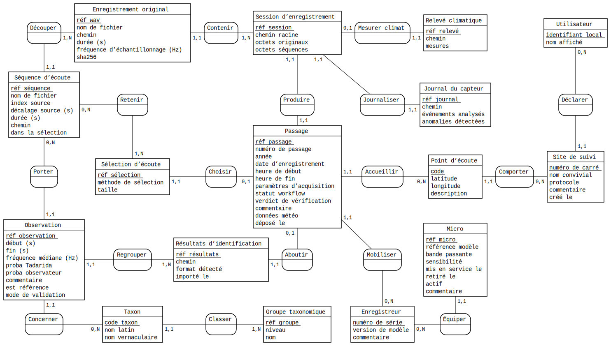
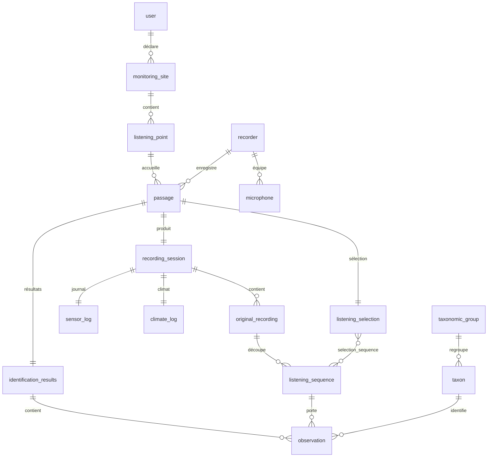

# Modèle de données & domaine

Le domaine s'organise autour d'une **nuit de capture**. Cette page relie le **modèle conceptuel**
d'origine (le brief) à son **implémentation** (entités-`record` + tables SQLite).

!!! abstract "La source conceptuelle : le brief"
    Le **[modèle conceptuel du brief](https://brief.echonuit.fr/Analyse%20et%20conception/Mod%C3%A8le%20conceptuel/)**
    définit les 15 entités (C1–C15), leurs **cardinalités** et les **règles métier**, avec un
    diagramme de classes. Les **noms y sont ceux de l'IHM** (langage utilisateur). Cette page-ci montre
    comment ces concepts deviennent des records Java et des tables SQL.

## Le modèle conceptuel (MCD Merise)

Un **utilisateur** déclare des **sites de suivi**, chacun avec des **points d'écoute**. Sur un point,
il réalise des **passages** (une nuit). Un passage est la **racine d'agrégat** : il possède une
**session d'enregistrement** (les enregistrements originaux copiés de la carte SD, les séquences
d'écoute ralenties ×10, le journal du capteur, le relevé climatique), une **sélection d'écoute** pour
la vérification, et — après dépôt — des **résultats d'identification** Tadarida (les **observations**,
classées par **taxon**).

C'est cet agrégat qui avance dans le [workflow à états](patterns.md#machine-a-etats-moteurworkflowpassage)
`Importé → … → Déposé`.

Au **niveau conceptuel**, on raisonne avec le **MCD Merise** (la notation enseignée en France) :
**entités** (identifiant souligné), **associations** porteuses d'un verbe, et **cardinalités
`(min,max)`** sur chaque patte. Les clés étrangères n'y figurent pas : elles sont *portées par les
associations*.

<figure markdown="span">
  { width="100%" }
  <figcaption>MCD Merise de la « nuit de capture ». Source <a href="assets/nuit-de-capture.mcd"><code>nuit-de-capture.mcd</code></a>, rendu avec <a href="https://www.mocodo.net/">Mocodo</a> (voir <a href="#regenerer-le-mcd-mocodo">Régénérer le MCD</a>).</figcaption>
</figure>

!!! note "MCD conceptuel ≠ schéma physique"
    Ce MCD décrit le **domaine**, indépendamment du stockage. Sa traduction relationnelle (le
    **schéma physique** ci-dessous) ajoute les clés primaires techniques, les clés étrangères, et
    transforme l'association N:N **Retenir** (Sélection ↔ Séquence) en **table de jonction**
    (`selection_sequence`).

## Le schéma physique (SQLite)

Le **schéma physique** est plus proche de la machine. On le donne en notation **pattes-de-corbeille**
(IE / *crow's foot*, celle de Mermaid) : relations binaires, clés étrangères explicites. C'est la
traduction du MCD ci-dessus. **19 tables à l'origine**, créées par
[`V01__schema.sql`](https://github.com/echonuit/vigiechiro-pr-companion/blob/main/src/main/resources/db/migration/V01__schema.sql) ;
le schéma courant en compte **28** après les migrations ultérieures (`V02`→`V30`),
clés étrangères **`ON DELETE CASCADE`** (supprimer un passage emporte sa session, ses séquences, ses
observations…).



## Correspondance concept → record → table

Le métier est modélisé en **`record` immuables** (cf.
[Objets-valeurs](patterns.md#objets-valeurs-records-immuables)) ; les DAO les lisent/écrivent dans les
tables. Les noms suivent trois registres : **IHM/brief** (français), **record** (français sans
accents), **SQL** (anglais).

| Brief | Record | Table |
|---|---|---|
| C1 · Utilisateur | `Utilisateur` | `user` |
| C2 · Site de suivi | `Site` | `monitoring_site` |
| C3 · Point d'écoute | `PointDEcoute` | `listening_point` |
| C4 · Enregistreur | `Enregistreur` | `recorder` |
| C4bis · Micro | *(microphone)* | `microphone` |
| C5 · Passage | `Passage` | `passage` |
| C6 · Session d'enregistrement | `SessionDEnregistrement` | `recording_session` |
| C7 · Enregistrement original | `EnregistrementOriginal` | `original_recording` |
| C8 · Séquence d'écoute | `SequenceDEcoute` | `listening_sequence` |
| C9 · Journal du capteur | `JournalDuCapteur` | `sensor_log` |
| C10 · Relevé climatique | `ReleveClimatique` | `climate_log` |
| C11 · Sélection d'écoute | `SelectionDEcoute` | `listening_selection` (+ `selection_sequence`, N:N) |
| C12 · Résultats d'identification | `ResultatsIdentification` | `identification_results` |
| C13 · Observation | `Observation` | `observation` |
| C14 · Taxon | `Taxon` | `taxon` |
| C15 · Groupe taxonomique | `GroupeTaxonomique` | `taxonomic_group` |

S'ajoutent des tables techniques : `saved_view` (vues sauvegardées de M-Multisite) et `schema_version`
(suivi des [migrations](persistance.md#les-migrations-de-schema)).

!!! note "Ancrage plateforme et certitude observateur (V21, #1139)"
    Depuis `V21__observation_ancrage_certitude.sql`, la table `observation` porte trois colonnes
    nullable issues du contrat d'écriture VigieChiro (#1203) :

    - **`vigiechiro_data_id`** + **`vigiechiro_obs_index`** : l'**ancrage plateforme** d'une
      observation importée de VigieChiro, c'est-à-dire le `_id` Eve de sa donnée (le WAV côté
      serveur) et son **indice brut** dans le tableau `observations` de cette donnée : la cible
      exacte de `PATCH /donnees/{id}/observations/{index}` (une observation n'a pas d'`_id` propre).
      L'ancrage vient **frais du serveur à chaque import** et n'est jamais préservé d'un jeu à
      l'autre (un re-compute régénère les `donnees`, donc les `_id`) ; `NULL` hors import VigieChiro.
    - **`observer_certainty`** : la **certitude déclarée manuellement** par l'observateur à la revue
      (`SUR | PROBABLE | POSSIBLE`, énumération `Certitude`, jetons exacts du serveur).
      **Vide par défaut**, jamais préremplie ni dérivée de `prob_observer` (qui reste la confiance
      numérique Tadarida recopiée à la validation, héritage du format `_Vu`). C'est une décision
      humaine : elle est **préservée** au réimport (`PreservationValidations`), et elle sera exigée
      (avec le taxon) pour pousser une correction vers la plateforme (#723).

!!! note "Empreintes et archivage (V23 à V25, EPIC #1297)"
    Trois migrations rendent possible le passage **archivé** : consultable sans son audio, et
    réactivable si les fichiers d'origine reparaissent.

    - **`V23__empreintes_fichiers.sql`** : `listening_sequence` gagne `size_bytes` + `fingerprint`,
      `original_recording` gagne `size_bytes`. L'empreinte est un **SHA-256 des 64 premiers Kio**
      (`Empreintes.empreinteCourte`), pas du fichier entier : 113 µs par fichier, soit ~0,5 s pour
      une nuit de 4806 séquences, contre plusieurs minutes pour une empreinte complète - et elle
      suffit à distinguer deux WAV différents, dont les en-têtes et les premières trames diffèrent.
      Elle est posée **à l'import** (`TransformationAudio`) ; les nuits déjà importées se rattrapent
      avec `retro-empreintes` (`BackfillEmpreintes`).
    - **`V24__archivage_passage.sql`** : `recording_session.archived_at`. **Colonne vestigiale** : le
      geste d'archivage a été retiré ([ADR 0048](decisions/0048-l-utilisateur-possede-ses-fichiers-l-app-observe.md)),
      plus personne ne l'écrit ni ne la lit. La disponibilité de l'audio s'**observe** sur le disque
      (`DisponibiliteAudio`, cf. [patterns](patterns.md#etat-observe-un-statut-distant-nest-pas-un-statut-du-domaine)).
      Son retrait effectif est une migration à venir.
    - **`V25__purge_originaux_declaree.sql`** : `recording_session.originals_purged_at`, également
      **vestigiale**. Le geste de purge a été retiré et l'audit ne contrôle plus les bruts : ce sont
      des copies **optionnelles** de ré-analyse
      ([ADR 0036](decisions/0036-la-copie-des-bruts-est-une-option.md)), absentes de la plupart des
      nuits, donc leur absence est l'état normal.

    Ces deux marqueurs répondaient à la même question : *pourquoi* l'audio manque. La réponse ne
    change plus rien - **l'utilisateur possède ses fichiers**, leur absence n'est jamais une
    corruption. Ils ne sont plus ni écrits ni lus ; leur retrait effectif est une migration à venir.

!!! note "Validation d'expert (V26, EPIC #1154)"
    **`V26__validation_expert.sql`** fait entrer en base le **troisième avis** — et la discussion qui
    l'entoure.

    VigieChiro distingue trois avis sur une même détection : Tadarida **propose** (`taxon_tadarida`),
    l'observateur **corrige** (`taxon_observer`), le validateur du MNHN **tranche**. Le troisième arrivait
    déjà du serveur à **chaque** import, dans la même charge utile, et le parseur le jetait. L'application
    présentait donc la correction de l'observateur comme le dernier mot, alors qu'un expert avait pu la
    réviser sans qu'on le voie jamais.

    - `observation.taxon_validator` (FK → `taxon.code`) + `observation.validator_certainty`. Le code
      hors référentiel est **auto-enregistré en souche** à l'import, comme celui de l'observateur : sans
      souche, la clé étrangère ramènerait le code à `NULL` et l'application **tairait l'avis qui fait
      autorité**.
    - `observation_message` : le **fil de discussion** (1-N, cascade sur `observation`). `rank_in_thread`
      fige l'ordre du serveur — l'ajout s'y faisant par `$push`, cet ordre **est** l'ordre chronologique,
      plus fiable qu'un tri sur des dates que le serveur ne garantit pas toutes.
      `author_platform_id` est un **objectid**, jamais un nom.

    **Reflet, pas saisie.** Ces colonnes sont **rafraîchies à chaque import** : le serveur refuse (403)
    qu'un jeton d'`Observateur` pose un avis de validateur. Au réimport, la correction de l'observateur
    est donc **préservée** (c'est une saisie humaine locale) tandis que l'avis du validateur et le fil sont
    **rafraîchis** (si l'expert a changé d'avis, c'est **le sien** qui doit s'afficher, pas la copie qu'on
    en gardait). Deux natures différentes, deux règles différentes.

## Transformation audio : de l'original brut aux séquences d'écoute (R10/R11)

Un **enregistrement original** (`original_recording`) est un ultrason mono 16 bits échantillonné très
vite (**384 kHz**), donc **inaudible**. L'import le transforme en **séquences d'écoute**
(`listening_sequence`) que l'humain peut écouter et que Tadarida a analysées. Le point dur est
[`TransformationAudio`](https://github.com/echonuit/vigiechiro-pr-companion/blob/main/src/main/java/fr/univ_amu/iut/importation/model/TransformationAudio.java) ;
l'**ordre des opérations reproduit fidèlement la chaîne Vigie-Chiro/Tadarida** (condition pour que
l'`observations.csv`, produit sur les mêmes séquences, se raccroche à l'audio) :

1. **Découper à 5 s réelles** — au **rythme source** (`5 × frequenceSource` trames), et **non** au rythme
   de sortie. Une séquence porte donc 5 s de l'enregistrement d'origine (la dernière peut être plus
   courte). Nombre de séquences pour une durée `D` : `ceil(D / 5)`.
2. **Expanser ×10** — en **réinterprétant** le rythme d'échantillonnage (`frequenceSortie = source / 10`,
   ex. 38 400 Hz) : **aucun échantillon n'est recalculé**, les mêmes octets PCM sont conservés. Une
   séquence de 5 s réelles devient **50 s à l'écoute**, dans la bande audible.

!!! warning "Piège corrigé"
    Découper *après* l'expansion et au rythme de **sortie** donnait des séquences de **0,5 s réelles**
    (10× trop courtes), désalignées des temps de l'`observations.csv` — qui sont en **secondes réelles
    dans une séquence de 5 s**. On découpe donc bien à 5 s **au rythme source**.

!!! note "Unité des durées : secondes **réelles**"
    Les colonnes `duration_s` (`original_recording` **et** `listening_sequence`) et `source_offset_s`
    sont en **secondes réelles d'acquisition** (≈ 5 s pour une séquence). La durée d'**écoute** du WAV
    expansé vaut ×10 (≈ 50 s) : c'est `audio-view` qui l'obtient en rejouant au rythme de sortie, on ne
    la stocke pas. De même, les bornes `observation.debut_s`/`fin_s` (temps Tadarida) sont en secondes
    réelles dans la séquence de 5 s.

    **Réparation `V20__duree_reelle_sequences.sql` (#1051)** : `listening_sequence.duration_s` était
    persisté **×10** (division par la fréquence de sortie au lieu de la fréquence d'acquisition dans
    `TransformationAudio`). Le fix code écrit désormais la durée réelle ; la migration V20 divise par 10
    les valeurs existantes (`WHERE duration_s IS NOT NULL`, `original_recording` intact).

**Nommage horodaté (clé de jointure).** Chaque séquence porte l'**heure réelle de son début** :
l'horodatage de l'original (`_AAAAMMJJ_HHMMSS`) **décalé** de `index × 5 s`, suivi d'un `_000`
systématique — et non un index `_000`, `_001`… Exemple : `…_20260422_225849.wav` →
`…_225849_000`, `…_225854_000`, `…_225859_000`… C'est exactement le nom que porte l'`observations.csv`,
et `ServiceValidation` **relie une observation à sa séquence par ce nom** (sans extension).

**Collisions.** Des enregistrements peuvent se **chevaucher sur la grille de 5 s** : la séquence de
queue d'un long (ex. `…_225332` de 10 s → séquence `…_225342_000`) tombe sur l'heure de début d'un
enregistrement plus récent (`…_225342`, dont la tête vise aussi `…_225342_000`).
[`ReconciliationNoms`](https://github.com/echonuit/vigiechiro-pr-companion/blob/main/src/main/java/fr/univ_amu/iut/importation/model/ReconciliationNoms.java)
tranche de façon **déterministe** : le **plus ancien enregistrement garde le `_000`** (c'est ce que
référence l'`observations.csv`), le perdant passe en **`_001`** (disponible à l'écoute, sans
observation associée — **aucune donnée perdue**). Comme le découpage est parallèle
([`DecoupageParallele`](https://github.com/echonuit/vigiechiro-pr-companion/blob/main/src/main/java/fr/univ_amu/iut/importation/model/DecoupageParallele.java)),
chaque original écrit d'abord dans un **dossier temporaire propre**, puis les noms définitifs sont
attribués en une passe séquentielle qui déplace les fichiers vers `transformes/`.

**Déterminisme (R11).** Mêmes octets en entrée ⇒ mêmes octets en sortie : découpage positionnel, PCM
copié sans altération, en-tête canonique fixe. Relancer l'import (reprise, session réutilisée par
quadruplet) réécrit des fichiers **identiques au bit près**.

## Énumérations du domaine

Plutôt que des codes magiques, les états sont des **énums** dans `commun.model` :
[`StatutWorkflow`](https://github.com/echonuit/vigiechiro-pr-companion/blob/main/src/main/java/fr/univ_amu/iut/commun/model/StatutWorkflow.java)
(`IMPORTE → … → DEPOSE`), `Verdict` (OK / Douteux / À jeter), `MethodeSelection`, `Protocole`,
`ModeValidation`. Chacune porte un **libellé** d'affichage, et les transitions de statut sont gardées
par [`MoteurWorkflowPassage`](patterns.md#machine-a-etats-moteurworkflowpassage).

## Régénérer le MCD (Mocodo)

Le MCD est **versionné comme source** ([`nuit-de-capture.mcd`](assets/nuit-de-capture.mcd), 16 entités
+ 17 associations) et rendu avec [Mocodo](https://www.mocodo.net/), l'outil de référence pour le MCD
Merise. Après modification de la source, régénérez le SVG :

```bash
pip install mocodo                       # une fois
cd dev-docs/assets
mocodo -i nuit-de-capture.mcd -t arrange:wide=8 --colors ocean   # agencement auto + dessin SVG
```

`arrange:wide=8` agence les boîtes sur ~8 colonnes (essayez `wide=6`/`7` pour un autre format) et
`--colors ocean` applique la palette (cohérente avec le thème indigo du site ; `mocodo --help` liste
les palettes). Mocodo
sait aussi dériver le schéma relationnel (`-t mld`/`-t sql`) à partir de la **même** source : c'est
exactement le passage *conceptuel → physique* décrit sur cette page.

---

Le **mécanisme** d'accès à ces tables (DAO, migrations, transactions) est décrit dans
**[Persistance](persistance.md)**.
