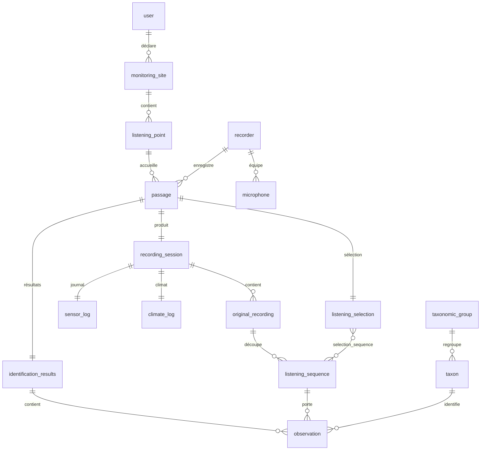

# Modèle de données & domaine

Le domaine s'organise autour d'une **nuit de capture**. Cette page relie le **modèle conceptuel**
d'origine (le brief) à son **implémentation** (entités-`record` + tables SQLite).

!!! abstract "La source conceptuelle : le brief"
    Le **[modèle conceptuel du brief](https://iutinfoaix-s201.github.io/brief/Analyse%20et%20conception/Mod%C3%A8le%20conceptuel/)**
    définit les 15 entités (C1–C15), leurs **cardinalités** et les **règles métier**, avec un
    diagramme de classes. Les **noms y sont ceux de l'IHM** (langage utilisateur). Cette page-ci montre
    comment ces concepts deviennent des records Java et des tables SQL.

## L'agrégat « nuit de capture »

Un **utilisateur** déclare des **sites de suivi**, chacun avec des **points d'écoute**. Sur un point,
il réalise des **passages** (une nuit). Un passage est la **racine d'agrégat** : il possède une
**session d'enregistrement** (les enregistrements originaux copiés de la carte SD, les séquences
d'écoute ralenties ×10, le journal du capteur, le relevé climatique), une **sélection d'écoute** pour
la vérification, et — après dépôt — des **résultats d'identification** Tadarida (les **observations**,
classées par **taxon**).

C'est cet agrégat qui avance dans le [workflow à états](patterns.md#machine-a-etats-moteurworkflowpassage)
`Importé → … → Déposé`.

## Le schéma physique (SQLite)

19 tables, créées par
[`V01__schema.sql`](https://github.com/IUTInfoAix-S201/vigiechiro-pr-companion/blob/main/src/main/resources/db/migration/V01__schema.sql),
clés étrangères **`ON DELETE CASCADE`** (supprimer un passage emporte sa session, ses séquences, ses
observations…).

## Correspondance concept → record → table

Le métier est modélisé en **`record` immuables** (cf.
[Objets-valeurs](patterns.md#objets-valeurs-records-immuables)) ; les DAO les lisent/écrivent dans les
tables. Les noms suivent trois registres : **IHM/brief** (français), **record** (français sans
accents), **SQL** (anglais).

| Brief | Record | Table |
|---|---|---|
| C1 · Utilisateur | `Utilisateur` | `user` |
| C2 · Site de suivi | `Site` | `monitoring_site` |
| C3 · Point d'écoute | `PointDEcoute` | `listening_point` |
| C4 · Enregistreur | `Enregistreur` | `recorder` |
| C4bis · Micro | *(microphone)* | `microphone` |
| C5 · Passage | `Passage` | `passage` |
| C6 · Session d'enregistrement | `SessionDEnregistrement` | `recording_session` |
| C7 · Enregistrement original | `EnregistrementOriginal` | `original_recording` |
| C8 · Séquence d'écoute | `SequenceDEcoute` | `listening_sequence` |
| C9 · Journal du capteur | `JournalDuCapteur` | `sensor_log` |
| C10 · Relevé climatique | `ReleveClimatique` | `climate_log` |
| C11 · Sélection d'écoute | `SelectionDEcoute` | `listening_selection` (+ `selection_sequence`, N:N) |
| C12 · Résultats d'identification | `ResultatsIdentification` | `identification_results` |
| C13 · Observation | `Observation` | `observation` |
| C14 · Taxon | `Taxon` | `taxon` |
| C15 · Groupe taxonomique | `GroupeTaxonomique` | `taxonomic_group` |

S'ajoutent des tables techniques : `saved_view` (vues sauvegardées de M-Multisite) et `schema_version`
(suivi des [migrations](persistance.md#les-migrations-de-schema)).

## Énumérations du domaine

Plutôt que des codes magiques, les états sont des **énums** dans `commun.model` :
[`StatutWorkflow`](https://github.com/IUTInfoAix-S201/vigiechiro-pr-companion/blob/main/src/main/java/fr/univ_amu/iut/commun/model/StatutWorkflow.java)
(`IMPORTE → … → DEPOSE`), `Verdict` (OK / Douteux / À jeter), `MethodeSelection`, `Protocole`,
`ModeValidation`. Chacune porte un **libellé** d'affichage, et les transitions de statut sont gardées
par [`MoteurWorkflowPassage`](patterns.md#machine-a-etats-moteurworkflowpassage).

---

Le **mécanisme** d'accès à ces tables (DAO, migrations, transactions) est décrit dans
**[Persistance](persistance.md)**.
