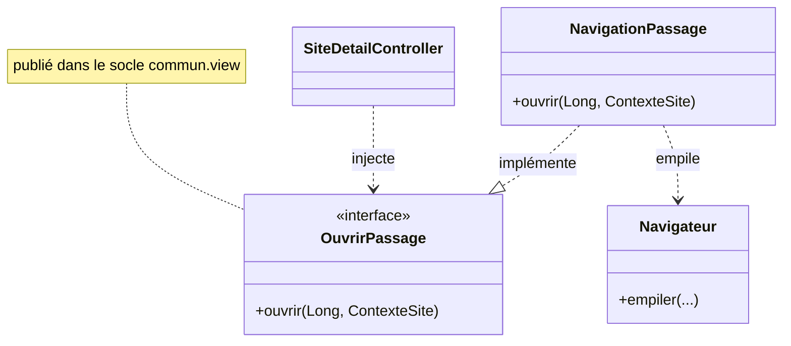

# Navigation et chrome

Le **chrome** (la fenêtre : barre de navigation, zone centrale, pied) est porté par le socle
[`commun.view`](https://github.com/echonuit/vigiechiro-pr-companion/tree/main/src/main/java/fr/univ_amu/iut/commun/view).
Les **fonctionnalités** n'ont pas de fenêtre à elles : elles publient un écran dans la **zone
centrale** via le [`Navigateur`](https://github.com/echonuit/vigiechiro-pr-companion/blob/main/src/main/java/fr/univ_amu/iut/commun/view/Navigateur.java).

## Le chrome (`MainView` + `MainController`)

`MainView.fxml` est un `BorderPane` :

- **haut** : titre, bouton ← Retour, fil d'Ariane ;
- **centre** : un **`ScrollPane` permanent** dont le `MainController` échange le **contenu** à chaque
  navigation (barre verticale dès que l'écran dépasse la hauteur ; la nav et le pied restent fixes) ;
- **bas** : **barre de statut à 3 zones** (gauche = contexte · centre = résumé de l'écran · droite =
  compteurs/état vivant), alimentée par `NavigationViewModel.zonesStatut` (cf. `ResumeStatut`
  ci-dessous). Elle est **masquée** tant qu'aucune zone n'a de contenu.

Le [`MainController`](https://github.com/echonuit/vigiechiro-pr-companion/blob/main/src/main/java/fr/univ_amu/iut/commun/view/MainController.java)
lie le centre à la `vueCentraleProperty()` du `Navigateur`, reconstruit le fil d'Ariane à chaque
changement d'historique, et pose les raccourcis (Alt+Gauche pour revenir, Alt+Début pour l'accueil). Les changements
d'écran arrivent en léger fondu.

## Toute fenêtre passe par `Habillage`

Une fenêtre de l'application ne se construit **jamais** par `new Scene(...)` : elle se demande à
[`Habillage`](https://github.com/echonuit/vigiechiro-pr-companion/blob/main/src/main/java/fr/univ_amu/iut/commun/view/Habillage.java).

```java
modale.setScene(Habillage.scene(vue));            // une modale
primaryStage.setScene(Habillage.scene(racine));   // la fenêtre principale
Habillage.poser(sceneDejaConstruite);             // une scène qu'on n'a pas fabriquée
```

Il pose ce que **toute** fenêtre du produit porte : la police embarquée et le **trio** du chrome -
`palette.css`, `base.css`, `design.css` - dans cet ordre.

Les trois vont ensemble et chacune dépend de la précédente : `base.css` consomme les couleurs de
`palette.css`, et `design.css` reprend l'une et l'autre pour les composants partagés (badges,
cartes-sections, bouton primaire). En poser deux sur trois donne une fenêtre qui **paraît** habillée.

Sans lui, la règle tenait par la vigilance, et elle a lâché : `base.css` était déclarée à la main dans
**deux** FXML sur des dizaines, si bien que **dix fenêtres sur onze** - toutes les modales - rendaient
avec la police par défaut de JavaFX, différente de celle de la fenêtre qui les portait et différente
d'une machine à l'autre ([ADR 3374](decisions/3374-une-fenetre-porte-son-habillage-ou-elle-n-est-pas-le-produit.md)).

Les **outils de capture** empruntent le même chemin. Un aperçu montre donc l'écran tel que
l'utilisateur le voit **par construction**, et non parce qu'on y a pensé.

!!! warning "Deux pièges, dont un silencieux"
    **L'ordre compte.** `base.css` consomme `-couleur-fond`, défini par `palette.css`. Posée à un autre
    **niveau** que la palette, la couleur ne se résout pas : JavaFX **avale la règle** en journalisant un
    `ClassCastException`, et la fenêtre s'ouvre sans son fond sans que rien n'échoue. `Habillage` insère
    donc `base.css` juste après `palette.css`, dans la liste où celle-ci vit.

    **Un caractère non couvert par la police part en repli** vers une police du système, et deux
    machines ne replient pas sur la même. `PoliceCouvreLIhmTest` refuse tout caractère affiché que la
    fonte embarquée ne porte pas ([ADR 3389](decisions/3389-ce-que-l-application-affiche-tient-dans-la-police-embarquee.md)).

`ScenesHabilleesTest` verrouille l'invariant : un `new Scene(...)` hors de `Habillage` fait échouer la
construction, en nommant le fichier fautif.

## Le `Navigateur` : une pile d'écrans vivants

Le `Navigateur` (singleton Guice) tient un **historique** (pile d'`EtapeNavigation`, base = Accueil)
dont le **sommet** alimente la zone centrale. Les écrans restent **vivants** dans la pile : revenir
ré-affiche l'instance précédente, **état préservé**.

| Méthode | Effet |
|---|---|
| `ouvrirRacine(vue, id, libellé, controleur)` | Réinitialise l'historique à `[Accueil, écran]` (entrée depuis une carte d'accueil). |
| `empiler(vue, id, libellé, controleur)` | Drill-down : empile un écran. **Anti-ré-entrance** : si l'`id` est déjà présent, on dépile jusqu'à lui et on le remplace. |
| `revenir()` | ← Retour : dépile d'un cran. |
| `revenirAIndex(i)` | Remonte à l'ancêtre `i` (clic d'un segment du fil). |
| `afficherAccueil()` | Dépile tout (retour à l'accueil global). |

!!! note "Le fil d'Ariane est hybride"
    Le **← Retour** suit l'**historique** réel ; le **fil d'Ariane** suit l'**emplacement
    hiérarchique** que l'écran déclare (cf. `EmplacementNavigation` ci-dessous), sinon il retombe sur
    l'historique.

## Les contrats optionnels d'un écran

[`EtapeNavigation`](https://github.com/echonuit/vigiechiro-pr-companion/blob/main/src/main/java/fr/univ_amu/iut/commun/view/EtapeNavigation.java)
mémorise le `controller` de l'écran et en dérive, par `instanceof`, des **contrats optionnels** que le
`Navigateur` honore :

| Contrat (`commun.view`) | Quand l'implémenter | Effet |
|---|---|---|
| [`GardeQuitter`](https://github.com/echonuit/vigiechiro-pr-companion/blob/main/src/main/java/fr/univ_amu/iut/commun/view/GardeQuitter.java) | L'écran a une **saisie non enregistrée** | Demande confirmation avant de quitter |
| [`EmplacementNavigation`](https://github.com/echonuit/vigiechiro-pr-companion/blob/main/src/main/java/fr/univ_amu/iut/commun/view/EmplacementNavigation.java) | L'écran a une **place hiérarchique** (ex. `Mes sites › Carré N › Passage`) | Alimente le fil d'Ariane (segments cliquables) |
| [`RafraichirAuRetour`](https://github.com/echonuit/vigiechiro-pr-companion/blob/main/src/main/java/fr/univ_amu/iut/commun/view/RafraichirAuRetour.java) | L'écran affiche des données qu'une **sous-activité peut modifier** | Recharge ses données quand on y **revient** |
| [`AuDepartEcran`](https://github.com/echonuit/vigiechiro-pr-companion/blob/main/src/main/java/fr/univ_amu/iut/commun/view/AuDepartEcran.java) | L'écran tient une **ressource à rendre** : un fichier temporaire, un verrou | Appelé quand l'écran **quitte l'historique** |
| [`SuitLaRevision`](https://github.com/echonuit/vigiechiro-pr-companion/blob/main/src/main/java/fr/univ_amu/iut/commun/view/SuitLaRevision.java) | L'écran affiche un **inventaire** qu'un import, une synchro ou une restauration peut changer **sous les yeux** de l'utilisateur | Le `Navigateur` l'abonne à la révision tant qu'il est dans l'historique, et **rend** l'abonnement à sa sortie |
| [`ResumeStatut`](https://github.com/echonuit/vigiechiro-pr-companion/blob/main/src/main/java/fr/univ_amu/iut/commun/view/ResumeStatut.java) | L'écran a une **info vivante** à afficher en pied (compteurs, avancement) | Alimente les **3 zones de la barre de statut** |

!!! example "Pourquoi `RafraichirAuRetour` existe"
    M-Passage ouvre M-Qualification ; un verdict y fait avancer le statut. Sans contrat, revenir
    ré-afficherait le passage **périmé** (instance vivante). En l'implémentant, le `Navigateur` le
    recharge au retour. Cinq écrans le déclarent : Ma saison, Espèces & observations, Carte &
    passages, la fiche site et M-Passage.

!!! warning "Il ne couvre que la moitié de la question"
    `RafraichirAuRetour` répond à « une sous-activité a travaillé pendant que j'étais masqué ». Il ne
    dit **rien** de ce qui survient pendant qu'on regarde : une synchronisation lancée depuis le menu
    ☰, un import, une restauration. C'est le rôle de `SuitLaRevision` et du
    [signal de mutation](patterns.md#le-signal-de-mutation-tu-ecris-tu-signales).

    Les deux **coexistent** parce qu'ils ne couvrent pas les mêmes écritures : le retour voit les
    `update` (un verdict, un dépôt), la révision voit les `insert` / `delete`. Les cinq écrans
    d'inventaire déclarent donc les deux.

!!! note "Le cycle de l'abonnement appartient au `Navigateur`, pas à l'écran"
    Un écran qui déclare `SuitLaRevision` fournit **une méthode** et rien d'autre : ni champ, ni
    `ChangeListener`, ni `RevisionDonnees` dans son constructeur. C'est le `Navigateur` qui abonne
    l'étape à son entrée dans l'historique et qui **rend** l'abonnement à sa sortie, exactement là où
    il appelle déjà `auDepartEcran()`.

    Le repère est la **vue**, pas l'étape : `actualiserLibelleCourant` remplace une étape par sa
    jumelle relibellée sans que l'écran ait bougé. La pose est donc idempotente, et le retrait ne se
    déclenche que si plus aucune étape ne porte cette vue.

### Convention de la barre de statut (`ResumeStatut`)

La barre de statut du chrome se lit en **3 zones**, alimentées par le `ResumeStatut` de l'écran au
sommet ([`ZonesStatut`](https://github.com/echonuit/vigiechiro-pr-companion/blob/main/src/main/java/fr/univ_amu/iut/commun/viewmodel/ZonesStatut.java),
value object) :

| Zone | Rôle | Exemple |
|---|---|---|
| **gauche** | contexte de l'écran (optionnel) | `Carré 640380 · A1` |
| **centre** | résumé de l'écran | `60 observation(s)` |
| **droite** | compteurs / état vivant | `12 / 60 revues` |

Le `Navigateur` **superpose** les zones de l'écran sur un défaut (`NavigationViewModel.ZONES_DEFAUT`,
aujourd'hui **vide**) : une zone laissée vide par l'écran garde le défaut. Un écran n'a donc besoin de
renseigner **que les zones qui le concernent**. Quand **toutes** les zones sont vides (écran sans
résumé), le chrome **masque** la barre : pas de bandeau sans information. La propagation (bind/unbind)
est centralisée dans `Navigateur.synchroniser()` : aucun nettoyage par écran n'est requis. Les **barres
d'action internes** à un écran (ex. les replis carte/tableau de M-Multisite) sont un pattern distinct et
ne transitent pas par ce contrat.

## Ouvrir une autre feature sans en dépendre

C'est le point clé du **découplage inter-feature** : une feature ne doit pas dépendre du `view`/`viewmodel`
d'une autre (règle ArchUnit `pas_de_dependance_inter_feature_vers_la_vue`). Le patron `Ouvrir*` résout
ça par **inversion de dépendance** : le contrat vit dans le socle, l'appelant et l'implémenteur en
dépendent tous deux (jamais l'un de l'autre).



1. Le **socle** publie l'interface `OuvrirPassage` dans `commun.view`.
2. La feature `passage` l'**implémente** dans `NavigationPassage` (charge le FXML via la
   `controllerFactory` Guice, appelle `controleur.ouvrirSur(...)`, puis `navigateur.empiler(...)`).
3. `PassageModule` la **binde** : `bind(OuvrirPassage.class).to(NavigationPassage.class);`.
4. `sites` **injecte** `OuvrirPassage` et appelle `ouvrir(...)` : sans jamais voir `passage.view`.

Contrats existants (**<!--inv:ouvrir-->12<!--/inv-->**, la liste de référence : `commun/view/Ouvrir*.java`) : `OuvrirActivite`,
`OuvrirAnalyse`, `OuvrirAudio`, `OuvrirDiagnostic`, `OuvrirImportation`, `OuvrirLot`, `OuvrirMultisite`,
`OuvrirPassage`, `OuvrirSite`, `OuvrirValidation`, `OuvrirVerification`.

## Cartes d'accueil et compteurs

L'accueil agrège ce que **chaque feature publie** au conteneur (multibinding Guice, cf.
[Injection](injection.md)) : une `ActiviteAccueil` (la carte cliquable) et, le cas échéant, un
`IndicateurAccueil` (un compteur du tableau de bord). Le `MainController` peuple les cartes
automatiquement : pour qu'un nouvel écran apparaisse à l'accueil, il suffit de publier son
`ActiviteAccueil`.

**Les compteurs suivent la donnée, pas la navigation** (#1376). Ils étaient recalculés à
l'initialisation puis à chaque retour sur l'accueil, si bien qu'une synchronisation déroulée
*par-dessus* l'accueil ne se voyait qu'après un aller-retour. Depuis, `AccueilViewModel` recalcule sa
liste observable à chaque **révision des données** (`JournalMutations` / `RevisionDonnees`, cf.
[Patterns](patterns.md#le-signal-de-mutation-tu-ecris-tu-signales)), et le chrome ne fait plus que la
restituer. Le contrat `IndicateurAccueil` vit en `commun.viewmodel` : cinq accesseurs de types
primitifs, aucune classe JavaFX, et désormais un ViewModel parmi ses lecteurs.

---

Pour câbler tout cela à l'injection, voir **[Injection (Guice)](injection.md)**.
