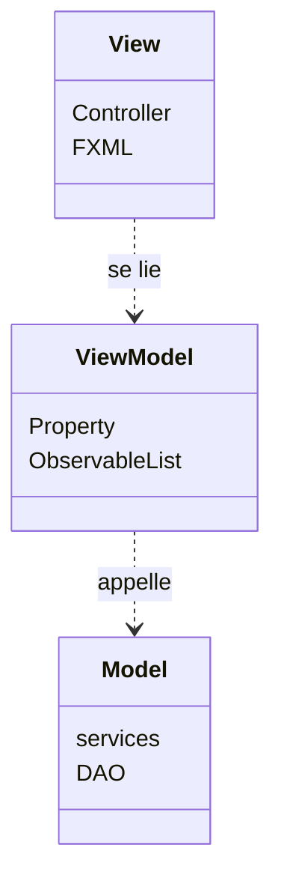
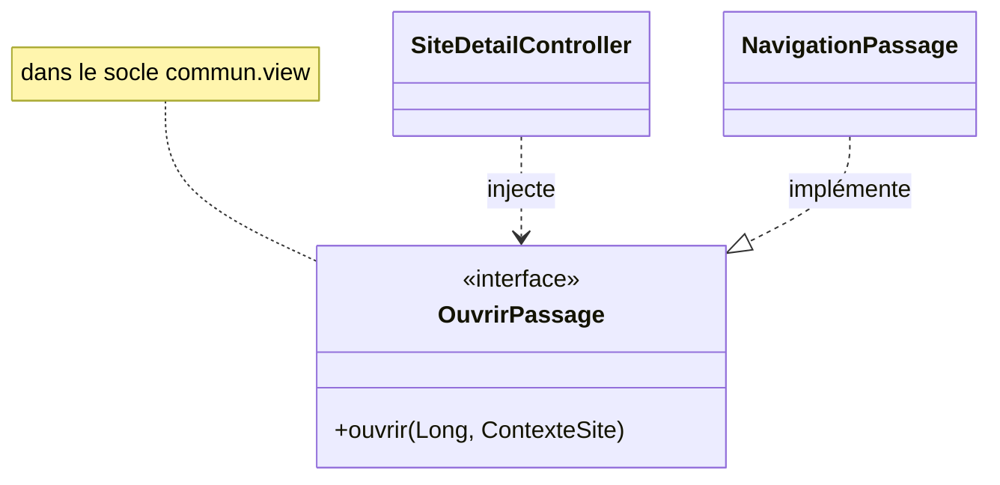
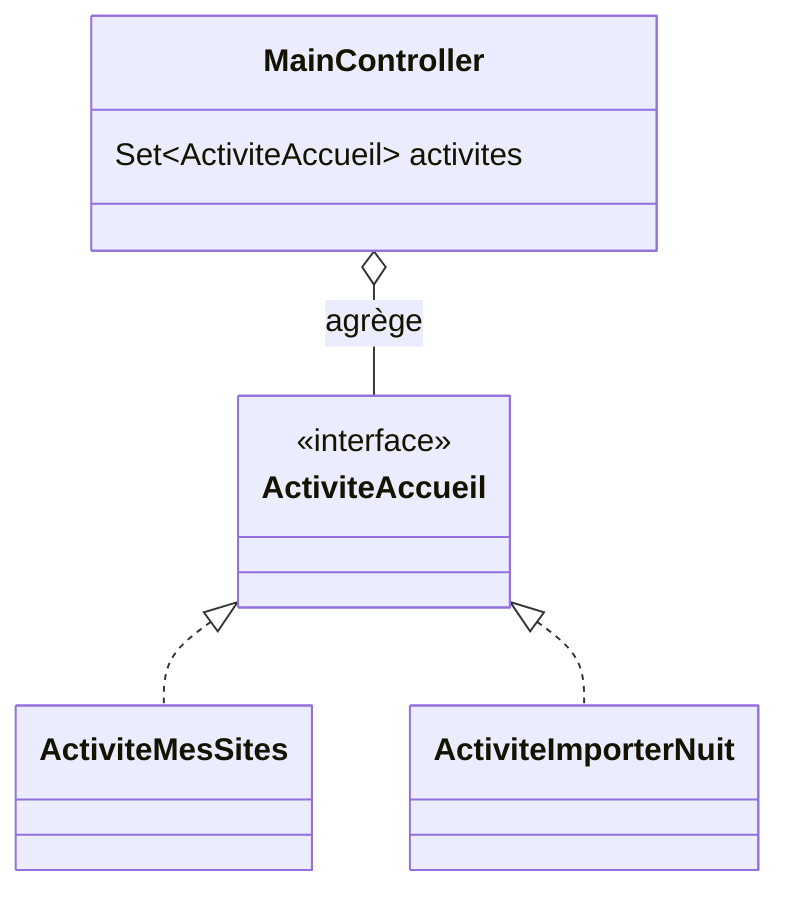
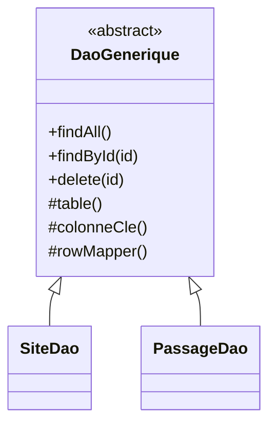
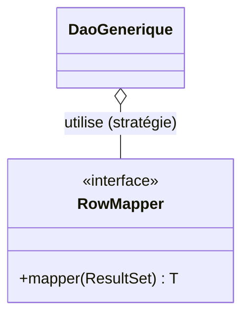
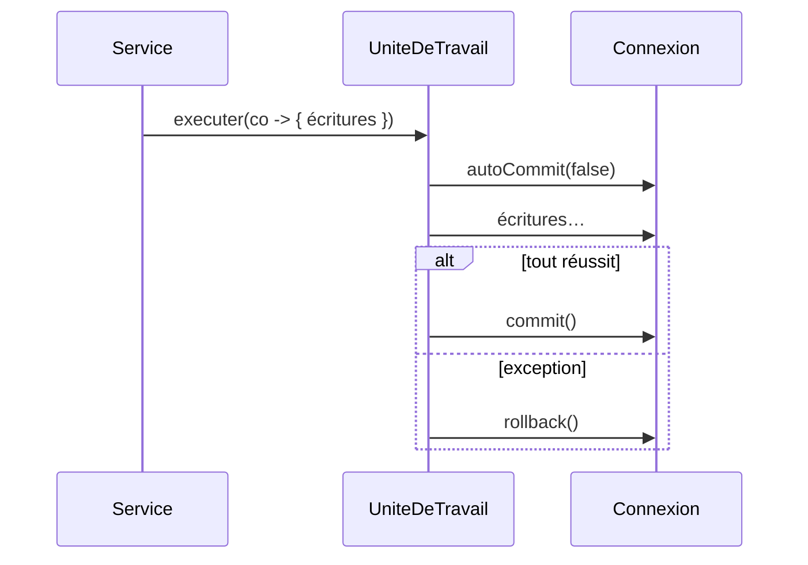
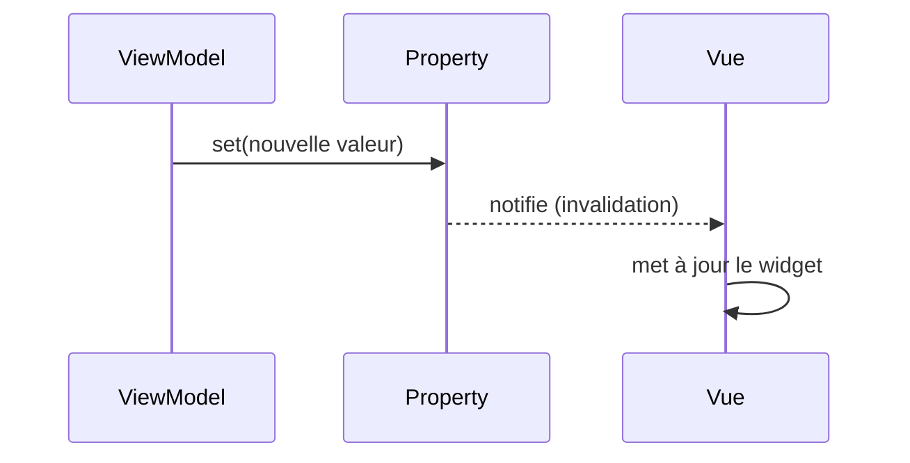
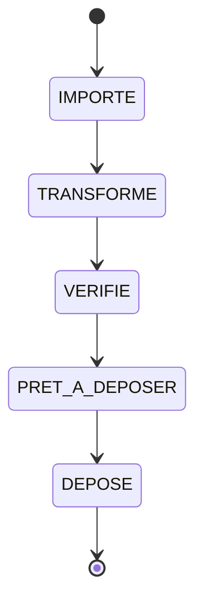

# Patterns et principes

L'architecture (cf. [Architecture](architecture.md)) applique des **patrons de conception** connus,
chacun choisi pour une raison précise et pour faire respecter les principes **SOLID** ainsi que
d'autres principes transverses (loi de Déméter, YAGNI, KISS, DRY… détaillés en fin de page,
[Au-delà de SOLID](#au-dela-de-solid)).

Chaque patron est présenté ainsi : **le problème** qu'il résout, **la solution**, **comment il est
utilisé ici** (avec, selon les cas, un extrait et un lien vers le code), un **diagramme** quand il
clarifie la structure ou le flux, et les **principes** qu'il sert.

!!! abstract "Rappel SOLID"
    **S**RP responsabilité unique · **O**CP ouvert/fermé · **L**SP substitution de Liskov ·
    **I**SP ségrégation des interfaces · **D**IP inversion des dépendances.

---

## MVVM (Model-View-ViewModel)

**Le problème.** Mélanger affichage, logique de présentation et règles métier dans les controllers
rend le code **intestable** (il faut une fenêtre) et **non réutilisable** (tout est lié à JavaFX).

**La solution.** Trois couches : le `model` (métier pur), le `viewmodel` (état **observable** +
logique de présentation), la `view` (FXML + controller) qui **observe** le viewmodel par *data
binding*. Le flux de dépendances va de la vue vers le modèle, jamais l'inverse.

**Dans VigieChiro.** Chaque feature suit ce découpage. La vue ne fait que **lier** des contrôles à des
propriétés ; elle ne calcule rien et ne touche pas la base.



**Principes.** **SRP** (une responsabilité par couche), **DIP** (la vue dépend d'abstractions
observables, pas de logique concrète). Frontières **garanties par ArchUnit** (`viewmodel_sans_javafx_ui`,
`view_sans_jdbc`).

---

## Objets-valeurs (records immuables)

**Le problème.** Des entités **mutables** (avec setters) se prêtent aux états incohérents, au partage
accidentel d'une instance et aux bugs d'égalité (comparaison par référence).

**La solution.** Modéliser le domaine en **`record` immuables** : champs finaux, égalité **par
valeur**, aucun setter. Pour « modifier », on **crée** une nouvelle instance.

**Dans VigieChiro.** Le domaine est quasi entièrement en records (**≈ 70** : `Passage`, `Site`,
`SequenceDEcoute`, `Observation`…). Les DAO **construisent** ces records ligne par ligne via un
`RowMapper`, et les ViewModels les exposent dans des `ObservableList`.

**Principes.** Immuabilité (sûreté en lecture, raisonnement local) et **SRP** (l'entité ne porte que
ses données). Socle naturel du DAO et du `RowMapper`.

---

## État observé (un statut distant n'est pas un statut du domaine)

**Le problème.** Un système distant expose un état (l'avancement d'un calcul, le verrouillage d'un
site…). La tentation est de l'ajouter à l'énumération de statuts qu'on possède déjà : un seul enum, un
seul stepper, tout le monde est content. Sauf que cet état **ne nous appartient pas**. Il change sans
nous prévenir, il n'est pas forcément **monotone**, et le jour où il recule, notre statut ment.

**La solution.** Le garder **distinct** : une énumération à part, alimentée par lecture, jamais par une
transition locale. Le statut du domaine continue de dire ce que **nous** avons fait ; l'état observé
dit ce que **l'autre** en a fait. Et comme une lecture réseau coûte cher, on **persiste le dernier
relevé** avec sa date : l'écran affiche alors un souvenir, en le disant.

**Dans VigieChiro.** `EtatTraitement` (EPIC #1259) suit l'analyse Tadarida côté serveur (`PLANIFIE →
EN_COURS → FINI/ERREUR/RETRY`) **sans** étendre `StatutWorkflow` : une relance ramène `FINI` à
`PLANIFIE`, si bien qu'un statut local « Traité » deviendrait faux. `DEPOSE` reste terminal (« ma part
est faite »). Le dernier relevé est mis en cache (`participation_traitement`), et `SuiviTraitement` est
le **point de relevé unique** : il interroge **et** mémorise. Même partition que `StatutPlateforme`
(sites).

**Le disque est un autre système que nous ne possédons pas** (EPIC #1297). Les fichiers audio d'un
passage peuvent disparaître sans nous : purge volontaire, disque externe débranché, dossier déplacé.
« Archivé » n'est donc **pas** une valeur de `StatutWorkflow` mais un **constat** :
`DisponibiliteAudio` (`COMPLETE` / `PARTIELLE` / `ABSENTE`), produit par `ServiceDisponibiliteAudio` en
regardant le disque (un `Files.list` par dossier, pas un `exists` par fichier), mis en cache et
invalidé aux gestes qui le changent. Toute l'IHM se règle **là-dessus** : l'écoute se voile, l'audit
informe au lieu de crier, la réactivation s'offre.

Un geste **déclaré** est autre chose qu'un état **observé**, et les deux coexistent :
`recording_session.archived_at` et `originals_purged_at` disent « l'utilisateur a demandé ça, tel
jour » ; c'est ce qui permet à l'audit de distinguer *purgé exprès* (INFO) de *corrompu* (ERREUR),
alors que le disque, lui, rend le même verdict dans les deux cas : « absent ». **Le marqueur explique,
l'observation décide.**

**Principes.** SSOT (la source de vérité reste distante : on ne la copie pas, on la **date**),
**honnêteté de l'IHM** (« dernier état connu le… » plutôt qu'une fraîcheur feinte) et **KISS** (pas de
sondage : on relit à l'ouverture, à la demande, ou après une action).

---

## Cascade de preuves (vérification graduée, refuser plutôt que se tromper)

**Le problème.** Rebrancher des fichiers retrouvés sur un passage archivé demande de répondre à : « ce
WAV est-il **bien** celui-là ? ». Le nom ne prouve rien (deux nuits d'un même carré portent des noms
voisins ; un fichier peut être renommé, tronqué, ré-encodé). Une empreinte cryptographique prouve tout,
mais **n'existe pas** pour les passages antérieurs, ni pour un passage reconstruit depuis la plateforme
(#1305) : exiger la preuve forte, c'est exclure exactement les cas où l'on en aurait le plus besoin. Et
la faute à ne pas commettre est claire : **rebrancher silencieusement le mauvais audio** sur des
observations, ce qui fabrique une donnée fausse et indétectable.

**La solution.** Une **cascade** de preuves de force décroissante, où chaque niveau tranche s'il le
peut et passe la main sinon, et où le doute non levé est un **refus**, jamais un « probablement bon » :

1. **empreinte** (SHA-256 des 64 premiers Kio, `Empreintes.empreinteCourte`) : identité certaine, quand
   elle a été capturée ;
2. **structure** : la durée réelle lue dans l'en-tête WAV confrontée à celle qu'on a enregistrée
   (tolérance 0,15 s), et la taille en octets ;
3. **acoustique** (`AnalyseAcoustique`, filtre de Goertzel) : les **cris des observations** rapatriées
   sont-ils réellement présents, aux fréquences et aux instants annoncés ? C'est la preuve qui reste
   quand aucune autre n'existe, et c'est la plus parlante : elle valide l'audio **contre les données
   qu'on s'apprête à y rebrancher**.

Le verdict est un type scellé (`VerdictIdentite` = `Acceptee(NiveauConfiance, preuves)` /
`Refusee(motif)`) : l'appelant ne peut pas confondre « accepté avec certitude » et « accepté sur faisceau
d'indices », et le **niveau de confiance minimal** atteint remonte jusqu'au rapport, donc jusqu'à
l'utilisateur.

**Dans VigieChiro** (#1309, consommé par #1302 et #1305). `VerificationIdentiteAudio` porte la cascade ;
`ServiceReactivationPassage` ne copie **que** les fichiers acceptés, laisse les divergents de côté et les
**énumère** ; un passage sans empreinte reste donc réactivable, mais par la preuve acoustique, pas par la
confiance dans un nom.

**Corollaire : un fichier *reconstruit* est un candidat comme un autre** (#1406). Quand l'utilisateur n'a
gardé que ses **bruts**, les séquences sont **régénérées** (la transformation est déterministe, R11) puis
soumises à la **même** cascade. Si le code de transformation n'a pas changé, l'empreinte de la tranche
régénérée est celle capturée avant l'archivage → **CERTITUDE** ; s'il a changé, la cascade descend d'un
cran au lieu d'accorder une confiance aveugle. C'est le point à retenir : **la reproductibilité est une
preuve, pas un prérequis** - on ne se dispense jamais de vérifier au motif qu'on a fabriqué le fichier
soi-même. Et un **brut refusé ne régénère rien** : recalculer à partir d'un fichier dont l'identité n'est
pas établie, c'est fabriquer du faux.

**Principes.** Fail-safe (ne pas pouvoir prouver = ne pas faire), **honnêteté** (dire *avec quelle
force* on a conclu), et refus de la fausse alternative « preuve parfaite ou rien ».

---

## Issue d'appel triée (le transport ne parle plus par silence)

**Le problème.** Un client HTTP qui « dégrade proprement » convertit tout échec en `Optional.empty()`
ou liste vide. C'est le bon réflexe pour **un seul** cas : « je ne suis pas connecté » (l'application
vit hors ligne). Pour les autres, c'est une perte d'information catastrophique : un `422` devient une
collection vide (l'import mort et muet de #1277, 4806 observations invisibles), un délai réseau
devient « aucun résultat », et une panne au milieu d'une pagination rend un **préfixe silencieux**
pire que le vide. L'appelant ne peut ni informer l'utilisateur, ni décider correctement.

**La solution.** Un type scellé qui rend l'issue **exhaustive à la compilation** :
`ReponseApi<T>` = `Succes(valeur)` / `NonConnecte` / `Injoignable(cause)` / `Refuse(statut, corps)`.
Un `switch` qui oublie une branche ne compile pas — la famille de bugs #1277, c'est « un cas auquel
personne n'a pensé ». Le comportement commun vit dans les variantes par **override** (`enOptionnel`,
`transformer`, `lireAvec`, `puis`, `echec`), jamais par `switch (this)`. Là où le silence reste le
comportement **voulu**, c'est l'appelant qui le choisit, explicitement : `enOptionnel()`.

**Dans VigieChiro** (#1284). `TransportVigieChiro` émet et trie ; `ClientVigieChiro` nomme les
endpoints ; `PaginationEve` est **tout-ou-rien** (l'issue de la page fautive, jamais un préfixe).
Conséquences : la modale de connexion distingue « jeton refusé (401) » de « plateforme injoignable » ;
l'import et le suivi du traitement disent pourquoi ; la **garde anti-purge** des rapprocheurs est
inchangée mais sa cause remonte au bandeau ; la garde anti-relance du dépôt devient **fail-safe** (état
illisible sans `--forcer` = pas de lancement) ; la vérification d'un dépôt hors ligne lève
« vérification impossible » au lieu d'un faux « tout manquant ». Le **contrat live** verrouille
`max_results=1000 → Refuse(422)` : la sonde qui aurait rendu #1277 bruyante par construction.

**Principes.** Honnêteté (une panne n'est pas une donnée), **exhaustivité par le compilateur** plutôt
que par la relecture, fail-safe (ne pas pouvoir prouver qu'une action destructrice est sûre = ne pas
la faire), et un **vocabulaire unique** des messages d'échec (`ReponseApi.echec()`).

---

## Package-by-feature (tranches verticales)

**Le problème.** Une organisation **par couche** (`controllers/`, `services/`, `dao/`…) éparpille une
même fonctionnalité dans tout le projet : pour modifier un écran, on touche partout.

**La solution.** Regrouper le code **par fonctionnalité** : `sites/`, `passage/`… chacun contenant ses
4 couches. Une feature devient une **tranche verticale** autonome.

**Dans VigieChiro.** Les 10 features sont des paquets autonomes ; le socle `commun/` porte le partagé
(chrome, persistance, DI). On ouvre, modifie ou supprime une feature sans naviguer ailleurs.

**Principes.** **Forte cohésion / faible couplage** ; **OCP** à l'échelle du produit (ajouter une
feature ≈ ajouter un paquet, sans toucher aux autres — garanti par
`pas_de_dependance_inter_feature_vers_la_vue`).

---

## Injection de dépendances + Composition Root

**Le problème.** Si chaque objet **crée** ses dépendances (`new ServiceX()`), le graphe est figé,
impossible à substituer en test, et le câblage est dispersé partout.

**La solution.** Les objets **reçoivent** leurs dépendances (constructeur), et **un seul** endroit, la
*Composition Root*, assemble le graphe complet.

**Dans VigieChiro.** [`RacineInjecteur`](https://github.com/IUTInfoAix-S201/vigiechiro-pr-companion/blob/main/src/main/java/fr/univ_amu/iut/commun/di/RacineInjecteur.java)
installe le socle + les 10 modules de feature (Guice). Même les controllers FXML sont injectés (cf.
*Factory* plus bas). En test, on substitue une base jetable sans changer le code de production.

```java
public static Injector creer() {
    return Guice.createInjector(
        new CommunModule(), new PersistenceModule(),
        new SitesModule(), new PassageModule(), /* … */ new RechercheModule());
}
```

Détails et diagramme de séquence : [Injection (Guice)](injection.md).

**Principes.** **DIP** (on dépend d'abstractions, le câblage est externalisé) et **IoC** (« ne nous
appelez pas, nous vous appellerons » : le conteneur instancie).

---

## Singleton (géré par le conteneur)

**Le problème.** Certaines ressources doivent être **uniques** dans toute l'application : une seule
base, un seul service de navigation. Les multiplier créerait des incohérences (deux connexions, deux
historiques).

**La solution.** Plutôt que le Singleton « maison » (constructeur privé + champ statique, difficile à
tester et à substituer), on **délègue l'unicité au conteneur** : `@Singleton` Guice.

**Dans VigieChiro.** `SourceDeDonnees`, `Navigateur`, les `Navigation*` et la **plupart des providers
de DAO et de services** des features sont `@Singleton` (~70 bindings) : une seule instance par
injecteur, mais **toujours injectée** (donc remplaçable en test).

**Principes.** Évite l'**état statique global** tout en restant **testable** : l'unicité est une
décision de **câblage**, pas une contrainte gravée dans la classe.

---

## Separated Interface (contrats `Ouvrir*`)

**Le problème.** Si `sites` appelait directement `passage.view.NavigationPassage`, les features
seraient **couplées** entre elles — impossible de les faire évoluer indépendamment (et la règle
ArchUnit l'interdit).

**La solution.** Publier une **interface dans le socle**, l'implémenter dans la feature cible :
l'appelant dépend de l'**abstraction**, jamais de l'implémentation. La dépendance est **inversée**.

**Dans VigieChiro.** [`OuvrirPassage`](https://github.com/IUTInfoAix-S201/vigiechiro-pr-companion/blob/main/src/main/java/fr/univ_amu/iut/commun/view/OuvrirPassage.java)
(socle) est implémenté par
[`NavigationPassage`](https://github.com/IUTInfoAix-S201/vigiechiro-pr-companion/blob/main/src/main/java/fr/univ_amu/iut/passage/view/NavigationPassage.java)
(feature `passage`) et **bindé** par `PassageModule`. `sites` injecte `OuvrirPassage`.



**Principes.** **DIP** (les deux features dépendent du contrat, pas l'une de l'autre) et **OCP**
(brancher une nouvelle implémentation sans modifier l'appelant). Tous les contrats : `OuvrirSite`,
`OuvrirPassage`, `OuvrirVerification`, `OuvrirImportation`, `OuvrirLot`, `OuvrirValidation`,
`OuvrirDiagnostic`. Voir aussi [Navigation](navigation.md#ouvrir-une-autre-feature-sans-en-dependre).

---

## Facade (`Navigation*`)

**Le problème.** Ouvrir un écran demande plusieurs gestes : charger le FXML, brancher la
`controllerFactory`, ouvrir le controller sur son contexte, empiler dans le `Navigateur`. Répétés tels
quels chez chaque appelant, ils seraient verbeux et fragiles.

**La solution.** Une **façade** par feature expose une opération **simple** (`ouvrir(...)`) qui
orchestre ces gestes en interne.

**Dans VigieChiro.** [`NavigationPassage`](https://github.com/IUTInfoAix-S201/vigiechiro-pr-companion/blob/main/src/main/java/fr/univ_amu/iut/passage/view/NavigationPassage.java)
(et ses homologues `Navigation*`) implémente le contrat `Ouvrir*` en **cachant** le `FXMLLoader` et le
`Navigateur` : l'appelant ne voit qu'`ouvrir(idPassage, contexte)`. Le `Navigateur` lui-même est une
façade sur la zone centrale du chrome + l'historique.

**Principes.** **SRP** (la mécanique d'ouverture est encapsulée) et **faible couplage** (l'appelant
ignore FXML / Navigateur).

---

## Plugin / Extension (Multibinder)

**Le problème.** L'accueil affiche une carte pour **certaines** features (et un compteur de tableau de
bord pour d'autres). Si le `MainController` connaissait chacune, ajouter une contribution l'obligerait
à **se modifier** à chaque fois.

**La solution.** Le socle déclare un `Set<T>` que **les features intéressées alimentent** (multibinding
Guice), sans que le socle connaisse les contributeurs. Il injecte l'ensemble et l'agrège.

**Dans VigieChiro.** Quatre points d'extension suivent ce patron, chacun avec un helper du DSL
[`ModuleDeFeature`](injection.md#ce-que-publie-un-module-de-feature) : `ActiviteAccueil` (carte
d'accueil, `activite(...)`), `IndicateurAccueil` (compteur, `indicateur(...)`), `OngletReglages`
(onglet de l'écran Réglages, `ongletReglages(...)`) et `ActionMenu` (entrée du menu ☰, `actionMenu(...)`).
Le contrat est **agnostique de JavaFX** (dans `commun/view`), la feature ne fournit que des données
(un descripteur, un libellé…), et c'est le socle (`MainController`, `EcranReglagesController`,
`ConstructeurMenuOutils`) qui construit les widgets. Exemple : une bascule de menu déclare une
`BooleanProperty` liée à `ReglagesReactifs` ; le socle en fait une `CheckMenuItem`.



**Principes.** **OCP** par excellence : le chrome est **fermé à la modification** mais **ouvert à
l'extension** (une nouvelle carte = un nouveau binding, zéro ligne touchée dans le socle).

**Feature = plugin.** Le patron va jusqu'au bout : les modules de feature sont eux-mêmes
**auto-découverts** par `RacineInjecteur` (`ServiceLoader<ModuleDeFeature>`, cf.
[Injection](injection.md#la-racine-de-composition)). Une feature complète (DAO, services, carte,
compteur, réglages, entrée de menu) s'ajoute donc **sans toucher une seule ligne du socle ni de la
racine de composition** — juste un `XxxModule extends ModuleDeFeature` déclaré comme service.

---

## Interfaces de rôle fines (ISP)

**Le problème.** Une grosse interface « écran » avec *garde de sortie + fil d'Ariane + rafraîchissement
+ …* forcerait **chaque** écran à tout implémenter, même ce qu'il n'utilise pas.

**La solution.** De petites interfaces **optionnelles**, à responsabilité unique, qu'un écran
implémente **seulement si** la capacité le concerne. Le `Navigateur` les détecte par `instanceof`.

**Dans VigieChiro.**

| Interface (1 rôle) | Implémentée par les écrans qui… |
|---|---|
| [`GardeQuitter`](https://github.com/IUTInfoAix-S201/vigiechiro-pr-companion/blob/main/src/main/java/fr/univ_amu/iut/commun/view/GardeQuitter.java) | ont une **saisie non enregistrée** |
| [`EmplacementNavigation`](https://github.com/IUTInfoAix-S201/vigiechiro-pr-companion/blob/main/src/main/java/fr/univ_amu/iut/commun/view/EmplacementNavigation.java) | ont une **place hiérarchique** (fil d'Ariane) |
| [`RafraichirAuRetour`](https://github.com/IUTInfoAix-S201/vigiechiro-pr-companion/blob/main/src/main/java/fr/univ_amu/iut/commun/view/RafraichirAuRetour.java) | affichent des **données mutables** |

Un écran lecture seule n'implémente **aucune** des trois.

**Principes.** **ISP** (aucun écran n'est forcé d'implémenter ce qu'il n'utilise pas) et **OCP** (le
Navigateur honore de nouvelles capacités sans connaître les écrans).

---

## DAO (Data Access Object)

**Le problème.** Du SQL `PreparedStatement` mélangé à la logique métier ou à l'IHM est impossible à
tester, à réutiliser, et viole la séparation des couches.

**La solution.** Isoler l'accès aux données derrière des objets dédiés ; le reste du code ignore JDBC
et dialogue avec des **services**.

**Dans VigieChiro.** Chaque entité a son DAO dans `*/model/dao/`. La règle ArchUnit `view_sans_jdbc`
**interdit** à l'IHM de toucher `model.dao` ou `java.sql`.

**Principes.** **SRP** (la persistance est une responsabilité à part) et **DIP** (le métier dépend
d'abstractions de données, pas de l'API JDBC).

---

## Template Method (`DaoGenerique`)

**Le problème.** Tous les DAO réécriraient la même mécanique : ouvrir une connexion, exécuter, itérer
le `ResultSet`, fermer. Beaucoup de **duplication**.

**La solution.** Une classe de base fixe le **squelette** de l'algorithme (`findAll`, `findById`,
`delete`) et **délègue** les détails variables à des méthodes que les sous-classes remplissent.

**Dans VigieChiro.** [`DaoGenerique<T, ID>`](https://github.com/IUTInfoAix-S201/vigiechiro-pr-companion/blob/main/src/main/java/fr/univ_amu/iut/commun/persistence/DaoGenerique.java)
fournit les opérations communes ; un DAO concret donne seulement `table()`, `colonneCle()` et son
`RowMapper`.



**Principes.** **DRY** (la boucle `ResultSet` n'existe qu'une fois), **OCP** (un nouveau DAO **étend**
sans modifier la base) et **LSP** (tout `DaoGenerique` concret est substituable à l'abstraction).

---

## Strategy (`RowMapper`, génération de sélection)

**Le problème.** Une partie d'un algorithme **varie** (comment lire une ligne ? comment choisir des
séquences ?) alors que le reste est stable. Un `if/else` géant serait fragile et fermé.

**La solution.** Encapsuler la partie variable derrière une **abstraction interchangeable**, injectée
ou passée au client.

**Dans VigieChiro.** Deux usages :

- [`RowMapper<T>`](https://github.com/IUTInfoAix-S201/vigiechiro-pr-companion/blob/main/src/main/java/fr/univ_amu/iut/commun/persistence/RowMapper.java)
  (`@FunctionalInterface`) : « transformer **une** ligne en entité » varie par DAO (souvent une
  lambda) ; l'itération reste dans `DaoGenerique`.

  ```java
  @FunctionalInterface
  public interface RowMapper<T> { T mapper(ResultSet rs) throws SQLException; }
  ```

- [`GenerateurSelection`](https://github.com/IUTInfoAix-S201/vigiechiro-pr-companion/blob/main/src/main/java/fr/univ_amu/iut/qualification/model/GenerateurSelection.java) :
  `selectionner(sequences, methode, taille)` choisit un sous-ensemble selon la `MethodeSelection`
  (répartition temporelle vs aléatoire vs manuel) — une **règle pure**, sans base ni IHM.



**Principes.** **OCP** (ajouter une stratégie sans modifier l'appelant), **SRP** (chaque stratégie est
une règle isolée, **testable sans persistance ni IHM** — objectif réutilisation O6).

---

## Table de suivi par unité (socle `commun`)

**Le problème.** Trois opérations longues (génération d'archives #820, import par fichier #947, dépôt
VigieChiro #983) doivent montrer l'avancement **de chaque unité de travail** (état coloré + barre),
alimenté depuis des fils d'arrière-plan, parfois dans le désordre (travail parallèle).

**La solution.** Un socle en trois couches, spécialisé par feature :

- `commun.viewmodel` : `EtatUnite` (en attente / en cours / terminée / échec), `LigneSuivi` (ligne
  observable extensible), `SuiviLignes<L>` (pilote générique, ciblage par numéro, tolérant aux
  événements inconnus ou dans le désordre) ;
- `commun.view` : `TableSuivi` (colonnes `#` / spécifiques / Progression, rangées colorées
  `.ligne-suivi.etat-…` dans `design.css`) + `CelluleProgressionUnite` (barre vive ou icône + libellé,
  raison d'échec en infobulle) ;
- côté feature : une interface d'événements métier (`SuiviArchives`, `SuiviFichiers`, `SuiviDepot`,
  chacune avec sa variante `inerte()`), un **relais** qui rejoue chaque événement sur le fil JavaFX
  (`Platform.runLater`), et une spécialisation `SuiviLignesXxx extends SuiviLignes<LigneXxx>` qui
  traduit les événements en mutations observables.

**La règle.** Toute nouvelle opération longue « par unité » réutilise ce socle : définir l'interface
d'événements (+ `inerte()`), la ligne et le pilote spécialisés, le relais fil JavaFX — jamais une
table ad hoc.

## Occupation d'un écran pendant un traitement long (socle `commun`)

**Le problème.** Un traitement lourd (agrégats, inspection de dossier, appel réseau) exécuté
**synchrone sur le fil JavaFX** fige l'IHM sans feedback ; un `setCursor(WAIT)` n'y suffit pas, fil
bloqué. Le patron correct (thread virtuel → travail → `Platform.runLater`) était recopié écran par
écran, avec le piège récurrent des mutations hors fil JavaFX (« clic figé »).

**La solution.** Deux briques de `commun.view`, à composer :

- `ExecuteurTache` (interface `@ImplementedBy` synchrone) : `executer(Supplier travail, Consumer
  succès, Consumer échec)` exécute le travail **hors du fil JavaFX** puis applique résultat/erreur
  **sur** le fil JavaFX. `ExecuteurTacheAsynchrone` (thread virtuel + `runLater`) en production ;
  `ExecuteurTacheSynchrone` (défaut) rend les tests déterministes. Sœur d'`ExecuteurFiche`.
- `IndicateurOccupation` : superpose sur un `StackPane` hôte un voile + roue + libellé « … en
  cours » (`enCoursProperty`, styles `.occupation-*` dans `design.css`), et pilote un `ExecuteurTache`
  via `occuper(libellé, travail, succès, échec)`. Le voile capte les clics le temps du traitement.
- `OccupationChrome` (#1215) : la déclinaison **chrome entier** pour les traitements du menu « ☰ »
  qui ne concernent aucun écran (sauvegarde / restauration de la base, purge des originaux) : voile
  sur la racine de la fenêtre, et **opération critique (#906) posée le temps du travail** (fermer
  l'application en pleine copie déclenche l'avertissement du socle). Installée par le
  `MainController`, consommée par injection dans les `ActionMenu`.

**Opérations longues « riches » (#1252).** Pour les traitements qui diffusent leur avancement ou
s'annulent, le socle étend `ExecuteurTache` sans toucher aux écrans déjà migrés :

- **progression déterminée** : `relaisProgression(application)` fabrique le `Consumer<Progression>` à
  passer au service ; chaque point revient sur le fil JavaFX (immédiat en test). Pour tout autre
  événement de suivi (table par unité, cf. section précédente), `surFilJavaFx()` fournit l'`Executor`
  du fil JavaFX - les relais de suivi n'ont plus à recopier `Platform.runLater` ;
- **annulation coopérative** : le **jeton appartient à l'appelant** (`commun.model.JetonAnnulation`,
  câblé sur le bouton « Annuler » de l'écran). Deux styles au choix du travail : `leverSiAnnule()`
  lève `OperationAnnuleeException`, que la surcharge `executer(travail, succès, annule, échec)`
  conclut par le callback `annule` (jamais par `échec`) ; ou bien le moteur lit `estAnnule()` /
  `jeton::estAnnule` et **rend un bilan partiel honnête** par le chemin de succès (patron du dépôt
  #1044 : jamais d'unité fantôme, la reprise ne renvoie que le manquant). Jamais d'interruption
  brutale de thread ;
- **désactivation d'un bouton pendant la tâche** : pas d'API dédiée, un binding suffit -
  `bouton.disableProperty().bind(occupation.enCoursProperty())` (patron posé par #1254 sur M-Audit).
  Plus jamais de `setDisable(true/false)` posé à la main autour de l'appel.

**Testabilité de l'annulation en synchrone.** L'exécuteur synchrone n'empêche pas de tester
l'annulation : le jeton appartenant à l'appelant, le test l'**annule avant de déclencher**
l'opération et vérifie l'arrêt propre au premier point de contrôle (callback `annule`, ni succès ni
échec) - c'est le contrat coopératif qui est testé, la simultanéité réelle relevant de l'E2E.

**La règle.** Toute opération longue d'un écran passe par `IndicateurOccupation` (l'échec est routé
vers le filet d'erreurs de l'écran, #795) — jamais un `Thread.ofVirtual()` + `runLater` recopié à la
main, y compris pour la progression et l'annulation (surcharges ci-dessus). Le déport écran par
écran (EPIC #793 puis reliquat #1316) est **terminé** : plus aucun `Thread.ofVirtual` ne vit hors du
socle, tout nouvel écran naît avec ce patron.

**Piège capture (#1278).** Les outils de capture doivent lier les exécuteurs **synchrones**
(`ModuleCaptureCommun`) : `ApercuFx` snapshotte immédiatement, l'asynchrone de production capturerait
le voile « Chargement… » à la place du contenu. Le garde-fou `CablageInjecteursCaptureTest` casse la
CI si un injecteur de capture résout un exécuteur asynchrone.

## Les dialogues d'une action sont des ports (socle `commun`)

**Le problème.** Un `showAndWait()` **fige** un test TestFX headless (piège connu depuis #798). Toute
action qui ouvre un dialogue est donc, littéralement, **impossible à cliquer dans un test** : le test
s'arrête sur la ligne du dialogue et n'en revient jamais. La conséquence a mis longtemps à être
nommée (#1405) :

> On ne testait que le **grisage** des boutons. Jamais leur **effet**.

Et cela portait précisément sur les gestes qu'on veut couvrir : purger les originaux de toutes les
nuits, restaurer la base, supprimer un passage et sa nuit, réimporter par-dessus les validations de
l'observateur. Tous irréversibles, tous non testés.

**La solution.** Rendre **remplaçable** chaque forme de dialogue. Trois familles à ce jour, bâties sur
le même triplet - un **contrat neutre**, une **implémentation réelle**, un **porteur injectable** :

| port | ce qu'il demande | implémentation réelle | double en test |
|---|---|---|---|
| `Confirmateur` (#1013) | le **oui/non** | `ConfirmationNavigation` | répond ce qu'on lui dit |
| `Notificateur` (#1404) | le **compte rendu** | `NotificationDialogue` | **capture** ce qui a été dit |
| `SelecteurFichier` (#1425) | la **désignation** d'un fichier / dossier | `SelecteurFichierJavaFx` | répond un chemin, **ou rien** (annulé) |

Chaque **écran** détient **une** instance de chaque porteur (`ConfirmateurModifiable`,
`NotificateurModifiable`, `SelecteurFichierModifiable`), champ `final`, exposée à ses tests par un
accesseur package-private. Ses **collaborateurs** (actions extraites, cartes, helpers) **reçoivent**
ces porteurs : ils n'en fabriquent pas.

```java
// Écran : un champ final par porteur, un accesseur par porteur.
private final ConfirmateurModifiable confirmateur = new ConfirmateurModifiable();
private final NotificateurModifiable notificateur = new NotificateurModifiable();

if (!confirmateur.confirmer("Supprimer ce site et ses points d'écoute ?")) {
    return;
}
viewModel.supprimerSite();
notificateur.notifier(NiveauNotification.INFORMATION, "Site supprimé", "…");

// Test de vue : le geste devient cliquable, et vérifiable JUSQU'À SON EFFET.
controleur.confirmateur().definir(message -> true);
controleur.notificateur().definir((niveau, entete, message) -> annonces.add(entete));
robot.interact(() -> robot.lookup("#boutonSupprimer").queryButton().fire());
assertThat(sitesEnBase()).isEmpty();   // pas « un mock a été appelé » : la ligne a disparu
```

**La règle.** Jamais de `new Alert(...)`, de `FileChooser` ni de `DirectoryChooser` dans un contrôleur
ou une action. Et surtout, la formulation générale - c'est elle qui compte, pas la liste des ports :

> Une action ne devient testable que si **tous** ses dialogues sont remplaçables. Il suffit d'en
> **oublier un** pour que le geste reste hors de portée.

C'est ce qui avait échappé jusqu'à #1425 : le `Confirmateur` et le `Notificateur` ne suffisaient pas à
rendre la sauvegarde testable, parce qu'elle **commence** par un sélecteur natif. Le test s'arrêtait à
la première ligne. Deux ports sur trois, c'est zéro geste testable.

Deux pièges corollaires, tous deux rencontrés :

- **Un porteur que rien n'expose est mort-né.** `CartesPointsSite` fabriquait son propre
  `ConfirmateurModifiable` sans accesseur : le patron était là, mais aucun test ne pouvait le
  remplacer. Un porteur se **partage depuis l'écran**, il ne se recrée pas.
- **Une surcharge « production / test » est un troisième idiome pour le même besoin.** `audio` avait
  `lancer(…)` qui fabriquait le vrai dialogue et `lancer(…, Confirmateur)` pour les tests. Un écran,
  une paire de porteurs, partagée.

**Ce qui n'est pas encore porté** (cf. #1431) : les `Dialog<T>` de **saisie** (formulaires rendant une
valeur : créer un site, choisir une participation) et le **choix à trois branches** (Enregistrer /
Abandonner / Annuler). Ils demandent une décision de conception, pas un port de plus par réflexe.

**Le contre-exemple à connaître.** Un refus **prévenu par l'affordance** n'a pas de notification à
tester - il n'arrive jamais. Sur M-Site-detail, « Supprimer » est grisé quand un point porte des
passages (#789), et **JavaFX n'émet aucune action sur un bouton désactivé** (`Button.fire()` est un
no-op). Le `catch` du refus métier reste comme garde défensive, mais c'est le **grisage** que le test
doit vérifier : *on ne prévient pas après coup ce qu'on a déjà empêché.*

## Écrans de données : densité, badge, filtres (socle design partagé)

**Le problème.** Les onze écrans sont nés à des moments différents, sans référentiel de design commun :
tables plus ou moins denses, statuts tantôt en texte coloré tantôt en pastille, chaque feature
recopiant son CSS. Le chantier #686 a unifié la **famille « écrans de données »** (audio, multisite,
analyse, fiche site, qualification) sur un socle `commun/view`.

**La solution.** Trois briques réutilisables, plus une feuille de style chargée par tous les écrans :

- `commun.view.TableDonnees` : `uniformiser(table)` (et `uniformiserNavigable` pour une table qui
  répond au clavier) applique la classe CSS `table-donnees` (hauteur de ligne, padding, en-tête
  uniques). **Un appel unique** dans le contrôleur garantit la densité partagée ;
- `commun.view.ColonneBadge` : `cellule(Function<S, String> classe)` fabrique une cellule **pastille**
  dont la couleur est **dérivée de la donnée de la ligne** (jamais stockée). Les surcharges
  `classe(StatutWorkflow)` / `classe(Verdict)` couvrent les types de `commun.model` ;
- `commun.view.design.css` : jetons sémantiques (`-badge-succes/avertissement/danger/info/neutre-*`) et
  classes `.badge-*`, **chargée par tous les FXML** (plus de CSS de statut recopié par feature).

**Le piège d'architecture (mapping feature → classe CSS).** `ColonneBadge` vit dans `commun`, qui **ne
doit dépendre d'aucune feature** (règle `ArchitectureTest.features_sans_cycle`). Le socle ne connaît donc
que les enums de `commun.model`. Pour un statut **propre à une feature** (`Fraicheur` côté sites,
`StatutObservation` côté validation…), le mapping statut → classe CSS reste **côté feature**, et l'on
passe cette fonction au générique `cellule(Function)` :

```java
// sites : la vue mappe son enum
colStatut.setCellFactory(c -> ColonneBadge.cellule(LignePassage::statutClasseCss));
// audio : FormatLigneAudio.classeBadgeStatut(StatutObservation) -> "badge-observation-…"
col.statut().setCellFactory(c ->
    ColonneBadge.cellule(ligne -> FormatLigneAudio.classeBadgeStatut(ligne.statut())));
```

Les classes CSS correspondantes (`.badge-observation-*`, `.badge-frais/tiede/froid`) vivent quand même
dans `design.css` : ce ne sont que des **chaînes**, aucune dépendance de code de `commun` vers la feature.

**La règle.** Une nouvelle table de données réutilise `TableDonnees.uniformiser` + `ColonneBadge` ;
jamais une densité ni une pastille ad hoc. Un statut de `commun.model` passe par `ColonneBadge.classe` ;
un statut de feature reçoit un `classeBadge`/`classeCss` **côté feature** (jamais une surcharge dans
`commun`, sous peine de cycle).

## Unit of Work (`UniteDeTravail`)

**Le problème.** Par défaut, chaque écriture DAO s'auto-commit. Mais « créer un passage **et** sa
session » doit être **atomique** : si la 2ᵉ échoue, la 1ʳᵉ ne doit pas rester en base.

**La solution.** Regrouper les écritures dans **une transaction** : tout réussit (commit), ou tout est
annulé (rollback).

**Dans VigieChiro.** [`UniteDeTravail`](https://github.com/IUTInfoAix-S201/vigiechiro-pr-companion/blob/main/src/main/java/fr/univ_amu/iut/commun/persistence/UniteDeTravail.java)
exécute un bloc sur **une seule connexion** :

```java
uniteDeTravail.executer(connexion -> {
    // plusieurs écritures... une exception => rollback
});
```



**Principes.** **SRP** (la gestion transactionnelle est isolée des DAO) ; garantit l'**intégrité** O7.

---

## Observer (propriétés et *binding* JavaFX)

**Le problème.** Comment garder l'IHM **synchronisée** avec l'état sans que le modèle « pousse » vers
des widgets qu'il ne devrait pas connaître ?

**La solution.** Le sujet (une `Property` / `ObservableList`) **notifie** ses observateurs au
changement ; la vue **s'abonne** par *binding*. Le sujet ignore qui l'observe.

**Dans VigieChiro.** Le viewmodel expose des propriétés ; la vue s'y lie. Quand l'état change, l'IHM se
met à jour **toute seule** : la vue *observe*, elle ne *tire* pas. C'est le moteur de MVVM.



**Principes.** **Faible couplage** View↔ViewModel et **DIP** (la vue dépend d'abstractions
observables, pas de logique).

!!! note "API fluente (le « builder » le plus proche)"
    Les liaisons s'écrivent souvent avec l'**API fluente** de JavaFX :
    `Bindings.when(cond).then(a).otherwise(b)`, `Bindings.createStringBinding(...)`. C'est un
    *builder* conditionnel **fourni par la bibliothèque** — pas un patron Builder que nous
    implémentons. Le projet n'a d'ailleurs **pas de Builder maison** : les entités sont des `record`
    immuables (cf. *Objets-valeurs*), qui rendraient un builder superflu.

---

## Factory (`controllerFactory`)

**Le problème.** Par défaut, `FXMLLoader` crée les controllers avec `new` (constructeur vide) : ils ne
peuvent **pas** recevoir de dépendances injectées.

**La solution.** Fournir au loader une **fabrique** qui délègue la création à Guice.

**Dans VigieChiro.** `loader.setControllerFactory(injector::getInstance)` : chaque controller est
instancié **par le conteneur**, donc reçoit ses ViewModels/services par constructeur (cf.
[`App`](https://github.com/IUTInfoAix-S201/vigiechiro-pr-companion/blob/main/src/main/java/fr/univ_amu/iut/App.java)).
Diagramme de séquence du bootstrap : [Injection](injection.md#des-controllers-fxml-injectes).

**Principes.** **DIP** (le controller ne construit pas ses dépendances) et **IoC**.

---

## Machine à états (`MoteurWorkflowPassage`)

**Le problème.** Le statut d'un passage (`Importé → … → Déposé`) doit avancer **dans l'ordre** : on ne
doit ni sauter une étape (importer puis déposer) ni revenir en arrière. Disséminer ces règles dans les
services serait fragile.

**La solution.** Centraliser les **transitions autorisées** dans un objet dédié : depuis un état, une
seule cible permise (le successeur immédiat).

**Dans VigieChiro.** [`MoteurWorkflowPassage`](https://github.com/IUTInfoAix-S201/vigiechiro-pr-companion/blob/main/src/main/java/fr/univ_amu/iut/passage/model/MoteurWorkflowPassage.java)
porte l'ordre et expose `suivant(...)` / `estTransitionAutorisee(...)` / `exigerTransitionAutorisee(...)`.
La logique est **isolée** de l'énum
[`StatutWorkflow`](https://github.com/IUTInfoAix-S201/vigiechiro-pr-companion/blob/main/src/main/java/fr/univ_amu/iut/commun/model/StatutWorkflow.java)
(simple porteur de libellés).



**Principes.** **SRP** (les règles de transition ne polluent ni l'énum ni les services) et un **point
de vérité unique** pour l'avancement d'une nuit.

---

## Synthèse : où vit chaque principe SOLID

| Principe | Incarné surtout par |
|---|---|
| **S**RP | MVVM (couches), DAO, `UniteDeTravail`, `MoteurWorkflowPassage`, Facade, objets-valeurs |
| **O**CP | Contrats `Ouvrir*`, Multibinder d'accueil, Template Method, Strategy |
| **L**SP | Sous-types de `DaoGenerique` substituables |
| **I**SP | Interfaces de rôle fines (`GardeQuitter`, `RafraichirAuRetour`, `EmplacementNavigation`) |
| **D**IP | Injection + Composition Root, contrats `Ouvrir*`, *binding* observable, Factory |

## Au-delà de SOLID

SOLID n'est pas seul : l'architecture respecte aussi plusieurs principes transverses, eux aussi
visibles dans le code.

### Loi de Déméter (« ne parle qu'à tes amis proches »)

Un objet ne devrait appeler que les méthodes de **lui-même**, de ses **paramètres**, de ce qu'il
**crée** et de ses **champs directs** — pas de chaîne `a.getB().getC().faire()`.

**Ici.** La vue se lie à `vm.titreProperty()` (un collaborateur **direct**), jamais à
`vm.modele().site().nom()`. Les contrats `Ouvrir*` reçoivent un `ContexteSite` / `ContextePassage`
(données **passées en paramètre**) plutôt que de fouiller dans l'écran appelant. Et `view_sans_jdbc`
interdit à la vue de « traverser » les couches jusqu'à la base.

### YAGNI (« vous n'en aurez pas besoin »)

Ne pas construire de **généricité spéculative**.

**Ici.** Pas d'ORM (des DAO `PreparedStatement` directs) ; le workflow est une simple `List` ordonnée
(`suivant()` = `index + 1`), pas un moteur d'états générique ; `DaoGenerique` n'offre que les
opérations **réellement** communes (lecture/suppression), les `insert`/`update` n'étant écrits que là
où on en a besoin ; l'application étant mono-utilisateur, `idUtilisateurCourant` est simplement le
premier utilisateur (aucune machinerie d'authentification construite « au cas où »).

### KISS (« reste simple »)

**Ici.** SQLite fichier (pas de serveur), tests headless **en mémoire** (pas de `xvfb`), capture par
`Scene.snapshot()` (pas d'orchestration lourde).

### DRY (« ne te répète pas »)

**Ici.** `DaoGenerique` (Template Method) et `RowMapper` (Strategy) factorisent la boucle `ResultSet`
écrite **une seule fois** ; les sections communes de doc renvoient à une source unique.

### Tell, Don't Ask

Demander à un objet d'**agir**, plutôt que de lire son état pour décider à sa place.

**Ici.** `MoteurWorkflowPassage.exigerTransitionAutorisee(actuel, cible)` **vérifie et lève** si la
transition est interdite, au lieu d'exposer l'ordre pour que chaque appelant le re-teste.

### Composition plutôt qu'héritage

**Ici.** Le chrome **compose** des capacités via de petites interfaces optionnelles (ISP) détectées à
l'exécution, et l'injection **compose** le graphe d'objets — au lieu d'une hiérarchie de classes
profonde. (`DaoGenerique` reste un héritage **assumé**, limité au Template Method.)

### Convention plutôt que configuration

**Ici.** Les `.fxml`/`.css` à côté de leur controller, les paquets de test en **miroir** de la
production, le `captures.manifest`, les noms `Capture*` / `Navigation*` / `*Module` : autant de
conventions qui évitent de la configuration.

### Fail-fast

**Ici.** `exigerTransitionAutorisee` lève **tôt** ; `Objects.requireNonNull(...)` garde les
constructeurs ; `DataAccessException` remonte une erreur SQL sans la masquer.
