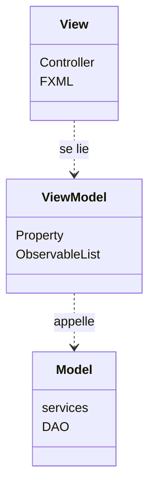
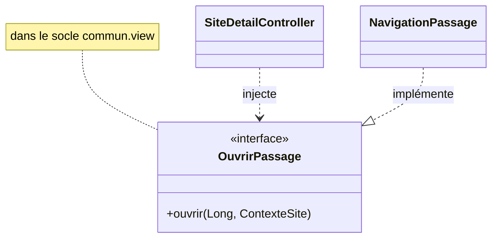
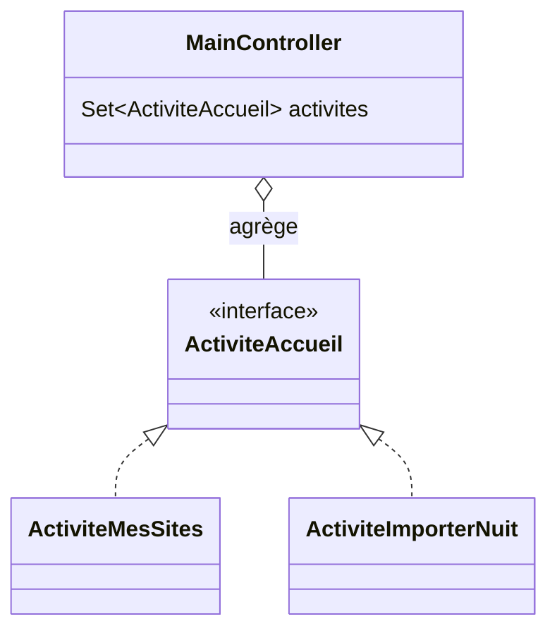
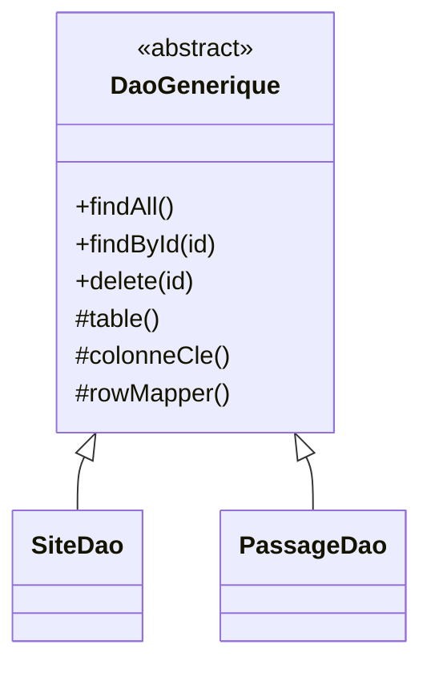
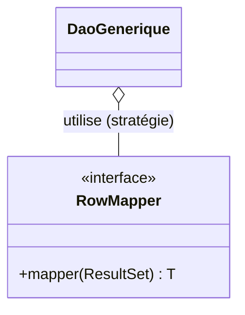
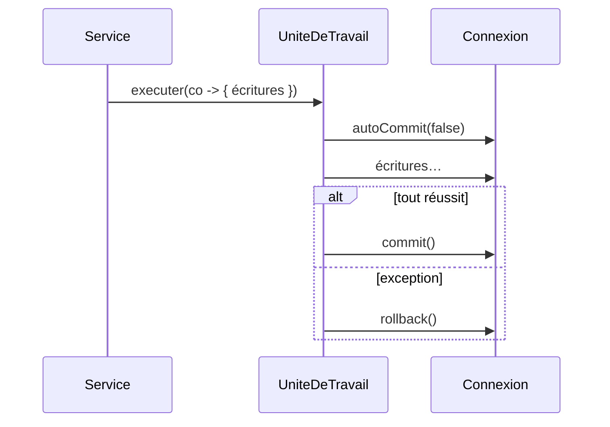
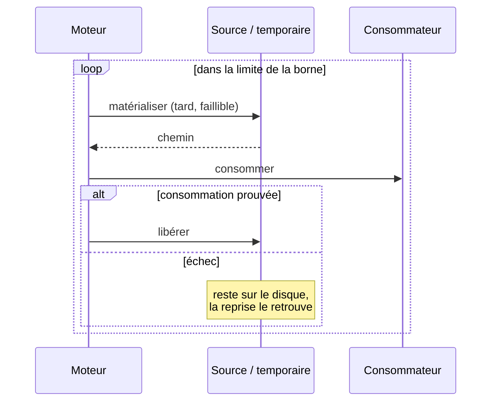
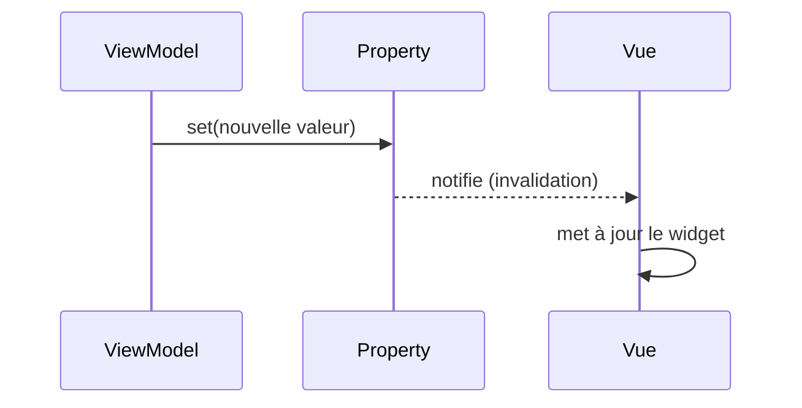
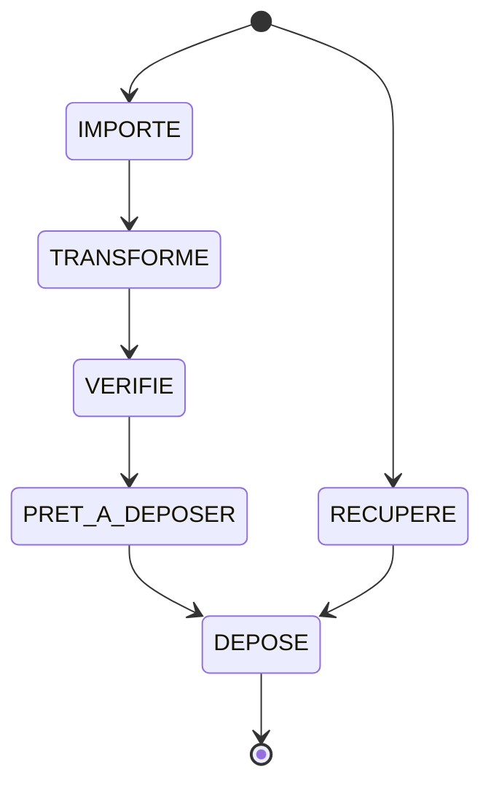

# Patterns et principes

L'architecture (cf. [Architecture](architecture.md)) applique des **patrons de conception** connus,
chacun choisi pour une raison précise et pour faire respecter les principes **SOLID** ainsi que
d'autres principes transverses (loi de Déméter, YAGNI, KISS, DRY… détaillés en fin de page,
[Au-delà de SOLID](#au-dela-de-solid)).

Chaque patron est présenté ainsi : **le problème** qu'il résout, **la solution**, **comment il est
utilisé ici** (avec, selon les cas, un extrait et un lien vers le code), un **diagramme** quand il
clarifie la structure ou le flux, et les **principes** qu'il sert.

!!! abstract "Rappel SOLID"
    **S**RP responsabilité unique · **O**CP ouvert/fermé · **L**SP substitution de Liskov ·
    **I**SP ségrégation des interfaces · **D**IP inversion des dépendances.

---

## MVVM (Model-View-ViewModel)

**Le problème.** Mélanger affichage, logique de présentation et règles métier dans les controllers
rend le code **intestable** (il faut une fenêtre) et **non réutilisable** (tout est lié à JavaFX).

**La solution.** Trois couches : le `model` (métier pur), le `viewmodel` (état **observable** +
logique de présentation), la `view` (FXML + controller) qui **observe** le viewmodel par *data
binding*. Le flux de dépendances va de la vue vers le modèle, jamais l'inverse.

**Dans cette application.** Chaque feature suit ce découpage. La vue ne fait que **lier** des contrôles à des
propriétés ; elle ne calcule rien et ne touche pas la base.


```mermaid
classDiagram
    class View {
        Controller
        FXML
    }
    class ViewModel {
        Property
        ObservableList
    }
    class Model {
        services
        DAO
    }
    View ..> ViewModel : se lie
    ViewModel ..> Model : appelle
```

**Principes.** **SRP** (une responsabilité par couche), **DIP** (la vue dépend d'abstractions
observables, pas de logique concrète). Frontières **garanties par ArchUnit** (`viewmodel_sans_javafx_ui`,
`view_sans_jdbc`).

---

## Objets-valeurs (records immuables)

**Le problème.** Des entités **mutables** (avec setters) se prêtent aux états incohérents, au partage
accidentel d'une instance et aux bugs d'égalité (comparaison par référence).

**La solution.** Modéliser le domaine en **`record` immuables** : champs finaux, égalité **par
valeur**, aucun setter. Pour « modifier », on **crée** une nouvelle instance.

**Dans cette application.** Le domaine est quasi entièrement en records (**plus de 250** : `Passage`, `Site`,
`SequenceDEcoute`, `Observation`…). Les DAO **construisent** ces records ligne par ligne via un
`RowMapper`, et les ViewModels les exposent dans des `ObservableList`.

**Principes.** Immuabilité (sûreté en lecture, raisonnement local) et **SRP** (l'entité ne porte que
ses données). Socle naturel du DAO et du `RowMapper`.

---

## État observé (un statut distant n'est pas un statut du domaine)

**Le problème.** Un système distant expose un état (l'avancement d'un calcul, le verrouillage d'un
site…). La tentation est de l'ajouter à l'énumération de statuts qu'on possède déjà : un seul enum, un
seul stepper, tout le monde est content. Sauf que cet état **ne nous appartient pas**. Il change sans
nous prévenir, il n'est pas forcément **monotone**, et le jour où il recule, notre statut ment.

**La solution.** Le garder **distinct** : une énumération à part, alimentée par lecture, jamais par une
transition locale. Le statut du domaine continue de dire ce que **nous** avons fait ; l'état observé
dit ce que **l'autre** en a fait. Et comme une lecture réseau coûte cher, on **persiste le dernier
relevé** avec sa date : l'écran affiche alors un souvenir, en le disant.

**Dans cette application.** `EtatTraitement` (EPIC #1259) suit l'analyse Tadarida côté serveur (`PLANIFIE →
EN_COURS → FINI/ERREUR/RETRY`) **sans** étendre `StatutWorkflow` : une relance ramène `FINI` à
`PLANIFIE`, si bien qu'un statut local « Traité » deviendrait faux. `DEPOSE` reste terminal (« ma part
est faite »). Le dernier relevé est mis en cache (`participation_traitement`), et `SuiviTraitement` est
le **point de relevé unique** : il interroge **et** mémorise. Même partition que `StatutPlateforme`
(sites).

**Le disque est un autre système que nous ne possédons pas** (EPIC #1297). Les fichiers audio d'un
passage peuvent disparaître sans nous : purge volontaire, disque externe débranché, dossier déplacé.
« Archivé » n'est donc **pas** une valeur de `StatutWorkflow` mais un **constat** :
`DisponibiliteAudio` (`COMPLETE` / `PARTIELLE` / `ABSENTE`), produit par `ServiceDisponibiliteAudio` en
regardant le disque (un `Files.list` par dossier, pas un `exists` par fichier), mis en cache et
invalidé aux gestes qui le changent. Toute l'IHM se règle **là-dessus** : l'écoute se voile, l'audit
informe au lieu de crier, la réactivation s'offre.

Un geste **déclaré** est autre chose qu'un état **observé**. Le projet est passé des premiers au
second : l'audio absent ne se **déclare** plus, il s'**observe**
([ADR 0048](decisions/0048-l-utilisateur-possede-ses-fichiers-l-app-observe.md)) - l'utilisateur
possède ses fichiers, et son absence n'est jamais une corruption.

Ce basculement a rendu les marqueurs inutiles l'un après l'autre. `archived_at` a disparu du code ;
`originals_purged_at` ne gouverne plus l'audit, qui ne contrôle **plus du tout** les bruts : ce sont
des copies **optionnelles** de ré-analyse ([ADR 0036](decisions/0036-la-copie-des-bruts-est-une-option.md)),
absentes de la plupart des nuits, donc leur absence est l'état normal - et un état normal reste
silencieux. Il n'y avait plus rien à distinguer : le disque et la base disent la même chose. Les deux
colonnes devenues mortes (`archived_at`, `originals_purged_at`) ont depuis été **retirées du schéma**
(`V31`, #2429).

**Principes.** SSOT (la source de vérité reste distante : on ne la copie pas, on la **date**),
**honnêteté de l'IHM** (« dernier état connu le… » plutôt qu'une fraîcheur feinte) et **KISS** (pas de
sondage : on relit à l'ouverture, à la demande, ou après une action).

---

## Cascade de preuves (vérification graduée, refuser plutôt que se tromper)

**Le problème.** Rebrancher des fichiers retrouvés sur un passage archivé demande de répondre à : « ce
WAV est-il **bien** celui-là ? ». Le nom ne prouve rien (deux nuits d'un même carré portent des noms
voisins ; un fichier peut être renommé, tronqué, ré-encodé). Une empreinte cryptographique prouve tout,
mais **n'existe pas** pour les passages antérieurs, ni pour un passage reconstruit depuis la plateforme
(#1305) : exiger la preuve forte, c'est exclure exactement les cas où l'on en aurait le plus besoin. Et
la faute à ne pas commettre est claire : **rebrancher silencieusement le mauvais audio** sur des
observations, ce qui fabrique une donnée fausse et indétectable.

**La solution.** Une **cascade** de preuves de force décroissante, où chaque niveau tranche s'il le
peut et passe la main sinon, et où le doute non levé est un **refus**, jamais un « probablement bon » :

1. **empreinte** (SHA-256 des 64 premiers Kio, `Empreintes.empreinteCourte`) : identité certaine, quand
   elle a été capturée ;
2. **structure** : la durée réelle lue dans l'en-tête WAV confrontée à celle qu'on a enregistrée
   (tolérance 0,15 s), et la taille en octets ;
3. **acoustique** (`AnalyseAcoustique`, filtre de Goertzel) : les **cris des observations** rapatriées
   sont-ils réellement présents, aux fréquences et aux instants annoncés ? C'est la preuve qui reste
   quand aucune autre n'existe, et c'est la plus parlante : elle valide l'audio **contre les données
   qu'on s'apprête à y rebrancher**.

Le verdict est un type scellé (`VerdictIdentite` = `Acceptee(NiveauConfiance, preuves)` /
`Refusee(motif)`) : l'appelant ne peut pas confondre « accepté avec certitude » et « accepté sur faisceau
d'indices », et le **niveau de confiance minimal** atteint remonte jusqu'au rapport, donc jusqu'à
l'utilisateur.

**Dans cette application** (#1309, consommé par #1302 et #1305). `VerificationIdentiteAudio` porte la cascade ;
`ServiceReactivationPassage` ne copie **que** les fichiers acceptés, laisse les divergents de côté et les
**énumère** ; un passage sans empreinte reste donc réactivable, mais par la preuve acoustique, pas par la
confiance dans un nom.

**Corollaire : un fichier *reconstruit* est un candidat comme un autre** (#1406). Quand l'utilisateur n'a
gardé que ses **bruts**, les séquences sont **régénérées** (la transformation est déterministe, R11) puis
soumises à la **même** cascade. Si le code de transformation n'a pas changé, l'empreinte de la tranche
régénérée est celle capturée avant l'archivage → **CERTITUDE** ; s'il a changé, la cascade descend d'un
cran au lieu d'accorder une confiance aveugle. C'est le point à retenir : **la reproductibilité est une
preuve, pas un prérequis** - on ne se dispense jamais de vérifier au motif qu'on a fabriqué le fichier
soi-même. Et un **brut refusé ne régénère rien** : recalculer à partir d'un fichier dont l'identité n'est
pas établie, c'est fabriquer du faux.

**Cas limite : le passage *reconstruit* (EPIC #1653).** Un passage reconstruit depuis la plateforme
(#1305) n'a **jamais eu** d'empreinte : ni sur ses originaux (un placeholder `…-reconstruit.wav` tient
lieu d'inventaire, sans fréquence d'acquisition), ni sur ses séquences. La cascade y tomberait donc
directement sur l'acoustique - qui produit des **faux négatifs** sur des cris réels faibles. Mais l'audio
régénéré est, par construction, un **extrait verbatim** du brut **désigné par l'utilisateur** (la
transformation copie le PCM sans rééchantillonnage, prouvé octet à octet) : son identité tient à la
**régénération elle-même**, pas à une empreinte qu'on n'a pas. L'**hydratation** (`HydratationDepuisBruts`,
#1650/#1682) l'accepte donc sur preuve **structurelle** (nom + durée, `FORTE`), et la concordance
acoustique y devient un **indice non bloquant** (`IndiceAcoustique`), jamais un veto. La chaîne :
`InventaireBrutsSource` (#1649, lit la Fe du **log** et énumère les bruts) → régénération → rebranchement
structurel → `AdoptionOriginauxReconstruits` (#1651, remplace le placeholder par les vrais originaux,
déclarés « purgés » puisque connus mais non stockés localement). Détail : `AnalyseAcoustique` mesure
désormais l'énergie **de pointe** sur une courte fenêtre glissée dans celle de l'observation (#1687) - la
moyenne sur **toute** la fenêtre diluait un cri de quelques ms noyé dans plusieurs secondes, d'où des faux
négatifs qui rendaient l'hydratation d'un vrai passage inopérante avant correction. Le *pourquoi* de ces
deux choix est consigné en [ADR 0001](decisions/0001-reactivation-passage-reconstruit-identite-structurelle.md)
(identité structurelle) et [ADR 0002](decisions/0002-detection-acoustique-energie-de-pointe.md) (énergie de pointe).

**Cas limite : la nuit *récupérée* et pas encore hydratée (EPIC #2554).** Une nuit rapatriée par la
synchro n'a ni audio **ni séquences** : il n'y a donc rien à confronter au dossier désigné, et la cascade
n'a pas de prise. C'est un état distinct du passage reconstruit, qui a ses séquences mais pas ses fichiers.
La réactivation le reconnaît et **va d'abord chercher les observations** (phase 0, `HydratationSquelette`,
#2555) : ce sont elles qui apportent les **noms** et l'**horodatage** sur lesquels la cascade reconnaît
ensuite les fichiers de *cette* nuit dans une carte qui en contient plusieurs. La suite est le chemin
ci-dessus, inchangé.

Deux points de conception s'y rattachent, consignés en
[ADR 2554](decisions/2554-la-synchro-amene-chaque-nuit-a-un-niveau-de-completude.md) : l'hydratation se
fait **en place** (un écran est ouvert sur cet identifiant, et un squelette porte peut-être des saisies
manuelles que la plateforme ignore), là où la reconstruction remplace la nuit ; et la source diffère selon
l'appelant : le repli sur la pagination `donnees` est justifié sur **une** nuit désignée, jamais sur le
balayage de compte de la synchro.

**Principes.** Fail-safe (ne pas pouvoir prouver = ne pas faire), **honnêteté** (dire *avec quelle
force* on a conclu), et refus de la fausse alternative « preuve parfaite ou rien ».

---

## Issue d'appel triée (le transport ne parle plus par silence)

**Le problème.** Un client HTTP qui « dégrade proprement » convertit tout échec en `Optional.empty()`
ou liste vide. C'est le bon réflexe pour **un seul** cas : « je ne suis pas connecté » (l'application
vit hors ligne). Pour les autres, c'est une perte d'information catastrophique : un `422` devient une
collection vide (l'import mort et muet de #1277, 4806 observations invisibles), un délai réseau
devient « aucun résultat », et une panne au milieu d'une pagination rend un **préfixe silencieux**
pire que le vide. L'appelant ne peut ni informer l'utilisateur, ni décider correctement.

**La solution.** Un type scellé qui rend l'issue **exhaustive à la compilation** :
`ReponseApi<T>` = `Succes(valeur)` / `NonConnecte` / `Injoignable(cause)` / `Refuse(statut, corps)`.
Un `switch` qui oublie une branche ne compile pas : la famille de bugs #1277, c'est « un cas auquel
personne n'a pensé ». Le comportement commun vit dans les variantes par **override** (`enOptionnel`,
`transformer`, `lireAvec`, `puis`, `echec`), jamais par `switch (this)`. Là où le silence reste le
comportement **voulu**, c'est l'appelant qui le choisit, explicitement : `enOptionnel()`.

**Dans cette application** (#1284). `TransportVigieChiro` émet et trie ; `ClientVigieChiro` nomme les
endpoints ; `PaginationEve` est **tout-ou-rien** (l'issue de la page fautive - ou de son garde-fou atteint,
#3046 - jamais un préfixe).
Conséquences : la modale de connexion distingue « jeton refusé (401) » de « plateforme injoignable » ;
l'import et le suivi du traitement disent pourquoi ; la **garde anti-purge** des rapprocheurs est
inchangée mais sa cause remonte au bandeau ; la garde anti-relance du dépôt devient **fail-safe** (état
illisible sans `--forcer` = pas de lancement) ; la vérification d'un dépôt hors ligne lève
« vérification impossible » au lieu d'un faux « tout manquant ». Le **contrat live** verrouille
`max_results=1000 → Refuse(422)` : la sonde qui aurait rendu #1277 bruyante par construction.

**Principes.** Honnêteté (une panne n'est pas une donnée), **exhaustivité par le compilateur** plutôt
que par la relecture, fail-safe (ne pas pouvoir prouver qu'une action destructrice est sûre = ne pas
la faire), et un **vocabulaire unique** des messages d'échec (`ReponseApi.echec()`).

---

## Le verdict porte son message (résultat scellé, message par variante)

**Le problème.** Une opération à plusieurs issues renvoie souvent un rapport « à trous » :
`(boolean succes, String motif, Rapport rapport)`, dont l'appelant doit deviner quels champs sont
renseignés dans quel cas. Chaque appelant re-tricote alors le même `if` : et chaque **surface** (IHM,
CLI) invente sa propre phrase pour dire la même chose. Les deux finissent par diverger.

**La solution.** Un type **scellé** dont chaque variante porte **ce qui la caractérise**, et **sait le
dire**. Le message n'est pas dans l'appelant : il est dans le verdict.

```java
public sealed interface ResultatReset {
    int codeSortie();     // 0 fait · 2 refusé (distinct de 1, l'échec d'exécution)
    String enClair();     // ce qu'il faut dire à l'utilisateur

    record Refuse(String motif, BilanRecuperabilite bilan) implements ResultatReset { … }
    record Fait(BilanSauvegarde sauvegarde, Path filet, int passagesReconstruits,
                RapportAudit audit, List<String> aRetablir) implements ResultatReset { … }
}
```

L'IHM **affiche** `enClair()`, la CLI **affiche** `enClair()` et sort sur `codeSortie()`. Aucune des deux
ne traduit un état en phrase : la parité CLI ↔ IHM est **structurelle**, pas maintenue à la main.

**Dans cette application.** `VerdictCarre` (#733 : `Concorde` / `Diverge` / `HorsGrille` / `Indisponible`, dont
le message **vide** exprime le silence hors ligne) et `ResultatReset` (#1419). Même famille que
[l'issue d'appel triée](#issue-dappel-triee-le-transport-ne-parle-plus-par-silence), appliquée aux
**opérations locales** plutôt qu'au transport : exhaustivité par le compilateur, comportement par
**override** et jamais par `switch (this)`.

---

## Refuser avant de détruire (l'ordre des garde-fous est la garantie)

**Le problème.** Une opération destructrice qui vérifie ses conditions **au fil de l'eau** laisse, au
premier obstacle, un état **à moitié détruit** : le pire des deux mondes. Et l'utilisateur, lui, ne
distingue plus « ça a refusé » de « ça a planté en route ».

**La solution.** Tous les refus **avant** la première écriture, et un refus qui **le dit** : *rien n'a été
modifié*. L'ordre des étapes n'est pas une commodité de lecture, c'est **la garantie**.

Le reset guidé (#1419) en est le cas d'école :

1. **dire ce qu'on perdrait** : une nuit dont l'audio n'est ni sur le disque ni sur le serveur est perdue
   pour de bon ; sans acceptation **explicite**, on s'arrête là ;
2. **vérifier que la plateforme répond**, la base neuve se **repeuple depuis le serveur** : le détruire
   alors qu'il est injoignable laisserait un workspace **vide**. Aucune sauvegarde ne rendrait ça
   acceptable, et c'est le garde-fou décisif ;
3. **sauvegarder** ; 4. **base neuve** ; 5. **repeupler** ; 6. **auditer**.

Le pendant, pour une écriture **irréversible** : **le serveur d'abord, la base ensuite** (#1418). Le
message n'est écrit localement qu'**après** que le serveur l'a accepté. L'inverse laisserait, au moindre
refus, un message que l'observateur **croirait envoyé** et que le validateur ne verrait **jamais**.

**Corollaires.**

- Une **confirmation nomme ce qu'on perd** : elle énumère les nuits, ou cite le texte qui va partir. Un
  « êtes-vous sûr ? » générique n'est **pas un consentement** : on ne consent qu'à ce qu'on a lu. C'est ce
  message-là que le test vérifie, pas le fait qu'un dialogue s'ouvre.
- Une **écriture définitive mérite d'être désactivable**. `discuter-validateur` (#1418) est une
  fonctionnalité à part de la lecture du fil : couper l'écriture laisse la lecture intacte. Lire est sans
  conséquence ; écrire ne se retire pas.
- Un **refus a son propre code de sortie** (`2`), distinct du succès (`0`) et de l'échec d'exécution
  (`1`) : un script peut ainsi refuser d'enchaîner.

---

## Un invariant, deux politiques de surface (l'unification d'un geste, #1656)

Quand un même geste métier vit sur **plusieurs surfaces** (IHM, CLI) et se met à diverger, on ne le
recopie pas : on remonte la **règle de fond** à un seul endroit (le service), et chaque surface n'en
porte qu'une **présentation mince**.

Le chantier « importer les observations d'un passage » (#1656) est le cas d'école : la même décision
« un seul jeu par passage » était réimplémentée **cinq fois**, dont deux qui plantaient sur la contrainte
`UNIQUE`. Après unification :

- **la règle** vit une seule fois, dans le **noyau de service** (`NoyauImportObservations`) : hors
  remplacement, refuser **avant l'INSERT** (cf. « Refuser avant de détruire ») ;
- **la surface IHM** la rend par une **question** (`DecisionRemplacementJeu` : détecter → confirmer →
  remplacer | abandonner), partagée par les fronts de « Sons & validation » ;
- **la surface CLI** la rend par un **refus d'usage** (`GardeJeuExistant`, code `2`, « relancez avec
  `--remplacer` »), partagé par les commandes d'import.

Le test à se poser est celui de la **sur-unification** : fondre les deux présentations en une seule
serait une erreur (un dialogue interactif et un code de sortie ne sont pas le même objet). Le bon
découpage : **une règle, deux adaptateurs**. Une capacité présente d'un seul côté (ou rendue
différemment de chaque côté) est une dette invisible ; la règle centralisée est la garantie qu'elles ne
redivergeront pas.

---

## Package-by-feature (tranches verticales)

**Le problème.** Une organisation **par couche** (`controllers/`, `services/`, `dao/`…) éparpille une
même fonctionnalité dans tout le projet : pour modifier un écran, on touche partout.

**La solution.** Regrouper le code **par fonctionnalité** : `sites/`, `passage/`… chacun contenant ses
4 couches. Une feature devient une **tranche verticale** autonome.

**Dans cette application.** Les <!--inv:features-->16<!--/inv--> features sont des paquets autonomes ; le socle `commun/` porte le partagé
(chrome, persistance, DI). On ouvre, modifie ou supprime une feature sans naviguer ailleurs.

**Principes.** **Forte cohésion / faible couplage** ; **OCP** à l'échelle du produit (ajouter une
feature ≈ ajouter un paquet, sans toucher aux autres : garanti par
`pas_de_dependance_inter_feature_vers_la_vue`).

---

## Injection de dépendances + Composition Root

**Le problème.** Si chaque objet **crée** ses dépendances (`new ServiceX()`), le graphe est figé,
impossible à substituer en test, et le câblage est dispersé partout.

**La solution.** Les objets **reçoivent** leurs dépendances (constructeur), et **un seul** endroit, la
*Composition Root*, assemble le graphe complet.

**Dans cette application.** [`RacineInjecteur`](https://github.com/echonuit/vigiechiro-pr-companion/blob/main/src/main/java/fr/univ_amu/iut/commun/di/RacineInjecteur.java)
installe un **socle explicite** (`CommunModule`, `PersistenceModule`) puis **auto-découvre** les
modules de feature via `ServiceLoader<ModuleDeFeature>`, en ne gardant que ceux dont la fonctionnalité
est active. Ajouter une feature ne modifie donc **pas** ce fichier (cf. [Injection](injection.md)).
Même les controllers FXML sont injectés (cf. *Factory* plus bas). En test, on substitue une base
jetable via `Modules.override(RacineInjecteur.modules())`, sans changer le code de production.

```java
public static List<Module> modules() {
    List<Module> modules = new ArrayList<>();
    modules.add(new CommunModule());        // socle : toujours explicite
    modules.add(new PersistenceModule());
    // features : auto-découvertes, filtrées par les feature-flags
    ServiceLoader.load(ModuleDeFeature.class).stream()
        .map(ServiceLoader.Provider::get)
        .filter(Fonctionnalites.filtreActives())
        .forEach(modules::add);
    return modules;
}
```

Détails et diagramme de séquence : [Injection (Guice)](injection.md).

**Principes.** **DIP** (on dépend d'abstractions, le câblage est externalisé) et **IoC** (« ne nous
appelez pas, nous vous appellerons » : le conteneur instancie).

---

## Singleton (géré par le conteneur)

**Le problème.** Certaines ressources doivent être **uniques** dans toute l'application : une seule
base, un seul service de navigation. Les multiplier créerait des incohérences (deux connexions, deux
historiques).

**La solution.** Plutôt que le Singleton « maison » (constructeur privé + champ statique, difficile à
tester et à substituer), on **délègue l'unicité au conteneur** : `@Singleton` Guice.

**Dans cette application.** `SourceDeDonnees`, `Navigateur`, les `Navigation*` et la **plupart des providers
de DAO et de services** des features sont `@Singleton` (plus de 130 déclarations) : une seule instance par
injecteur, mais **toujours injectée** (donc remplaçable en test).

**Principes.** Évite l'**état statique global** tout en restant **testable** : l'unicité est une
décision de **câblage**, pas une contrainte gravée dans la classe.

---

## Separated Interface (contrats `Ouvrir*`)

**Le problème.** Si `sites` appelait directement `passage.view.NavigationPassage`, les features
seraient **couplées** entre elles : impossible de les faire évoluer indépendamment (et la règle
ArchUnit l'interdit).

**La solution.** Publier une **interface dans le socle**, l'implémenter dans la feature cible :
l'appelant dépend de l'**abstraction**, jamais de l'implémentation. La dépendance est **inversée**.

**Dans cette application.** [`OuvrirPassage`](https://github.com/echonuit/vigiechiro-pr-companion/blob/main/src/main/java/fr/univ_amu/iut/commun/view/OuvrirPassage.java)
(socle) est implémenté par
[`NavigationPassage`](https://github.com/echonuit/vigiechiro-pr-companion/blob/main/src/main/java/fr/univ_amu/iut/passage/view/NavigationPassage.java)
(feature `passage`) et **bindé** par `PassageModule`. `sites` injecte `OuvrirPassage`.


```mermaid
classDiagram
    class OuvrirPassage {
        <<interface>>
        +ouvrir(Long, ContexteSite)
    }
    class NavigationPassage
    SiteDetailController ..> OuvrirPassage : injecte
    NavigationPassage ..|> OuvrirPassage : implémente
    note for OuvrirPassage "dans le socle commun.view"
```

**Principes.** **DIP** (les deux features dépendent du contrat, pas l'une de l'autre) et **OCP**
(brancher une nouvelle implémentation sans modifier l'appelant). La **liste de référence** des contrats
`Ouvrir*` (**10**) est maintenue à un seul endroit : [Navigation](navigation.md#ouvrir-une-autre-feature-sans-en-dependre).

---

## Facade (`Navigation*`)

**Le problème.** Ouvrir un écran demande plusieurs gestes : charger le FXML, brancher la
`controllerFactory`, ouvrir le controller sur son contexte, empiler dans le `Navigateur`. Répétés tels
quels chez chaque appelant, ils seraient verbeux et fragiles.

**La solution.** Une **façade** par feature expose une opération **simple** (`ouvrir(...)`) qui
orchestre ces gestes en interne.

**Dans cette application.** [`NavigationPassage`](https://github.com/echonuit/vigiechiro-pr-companion/blob/main/src/main/java/fr/univ_amu/iut/passage/view/NavigationPassage.java)
(et ses homologues `Navigation*`) implémente le contrat `Ouvrir*` en **cachant** le `FXMLLoader` et le
`Navigateur` : l'appelant ne voit qu'`ouvrir(idPassage, contexte)`. Le `Navigateur` lui-même est une
façade sur la zone centrale du chrome + l'historique.

**Principes.** **SRP** (la mécanique d'ouverture est encapsulée) et **faible couplage** (l'appelant
ignore FXML / Navigateur).

---

## Plugin / Extension (Multibinder)

**Le problème.** L'accueil affiche une carte pour **certaines** features (et un compteur de tableau de
bord pour d'autres). Si le `MainController` connaissait chacune, ajouter une contribution l'obligerait
à **se modifier** à chaque fois.

**La solution.** Le socle déclare un `Set<T>` que **les features intéressées alimentent** (multibinding
Guice), sans que le socle connaisse les contributeurs. Il injecte l'ensemble et l'agrège.

**Dans cette application.** Quatre points d'extension suivent ce patron, chacun avec un helper du DSL
[`ModuleDeFeature`](injection.md#ce-que-publie-un-module-de-feature) : `ActiviteAccueil` (carte
d'accueil, `activite(...)`), `IndicateurAccueil` (compteur, `indicateur(...)`), `OngletReglages`
(onglet de l'écran Réglages, `ongletReglages(...)`) et `ActionMenu` (entrée du menu principal (☰), `actionMenu(...)`).
Le contrat est **agnostique de JavaFX** (dans `commun/view`), la feature ne fournit que des données
(un descripteur, un libellé…), et c'est le socle (`MainController`, `EcranReglagesController`,
`ConstructeurMenuOutils`) qui construit les widgets. Exemple : une bascule de menu déclare une
`BooleanProperty` liée à `ReglagesReactifs` ; le socle en fait une `CheckMenuItem`.


```mermaid
classDiagram
    class MainController {
        Set~ActiviteAccueil~ activites
    }
    class ActiviteAccueil {
        <<interface>>
    }
    MainController o-- ActiviteAccueil : agrège
    ActiviteAccueil <|.. ActiviteMesSites
    ActiviteAccueil <|.. ActiviteImporterNuit
```

**Principes.** **OCP** par excellence : le chrome est **fermé à la modification** mais **ouvert à
l'extension** (une nouvelle carte = un nouveau binding, zéro ligne touchée dans le socle).

**Feature = plugin.** Le patron va jusqu'au bout : les modules de feature sont eux-mêmes
**auto-découverts** par `RacineInjecteur` (`ServiceLoader<ModuleDeFeature>`, cf.
[Injection](injection.md#la-racine-de-composition)). Une feature complète (DAO, services, carte,
compteur, réglages, entrée de menu) s'ajoute donc **sans toucher une seule ligne du socle ni de la
racine de composition** : juste un `XxxModule extends ModuleDeFeature` déclaré comme service.

---

## Interfaces de rôle fines (ISP)

**Le problème.** Une grosse interface « écran » avec *garde de sortie + fil d'Ariane + rafraîchissement
+ …* forcerait **chaque** écran à tout implémenter, même ce qu'il n'utilise pas.

**La solution.** De petites interfaces **optionnelles**, à responsabilité unique, qu'un écran
implémente **seulement si** la capacité le concerne. Le `Navigateur` les détecte par `instanceof`.

**Dans cette application.**

| Interface (1 rôle) | Implémentée par les écrans qui… |
|---|---|
| [`GardeQuitter`](https://github.com/echonuit/vigiechiro-pr-companion/blob/main/src/main/java/fr/univ_amu/iut/commun/view/GardeQuitter.java) | ont une **saisie non enregistrée** |
| [`EmplacementNavigation`](https://github.com/echonuit/vigiechiro-pr-companion/blob/main/src/main/java/fr/univ_amu/iut/commun/view/EmplacementNavigation.java) | ont une **place hiérarchique** (fil d'Ariane) |
| [`RafraichirAuRetour`](https://github.com/echonuit/vigiechiro-pr-companion/blob/main/src/main/java/fr/univ_amu/iut/commun/view/RafraichirAuRetour.java) | affichent des **données mutables** |

Un écran lecture seule n'implémente **aucune** des trois.

**Principes.** **ISP** (aucun écran n'est forcé d'implémenter ce qu'il n'utilise pas) et **OCP** (le
Navigateur honore de nouvelles capacités sans connaître les écrans).

---

## DAO (Data Access Object)

**Le problème.** Du SQL `PreparedStatement` mélangé à la logique métier ou à l'IHM est impossible à
tester, à réutiliser, et viole la séparation des couches.

**La solution.** Isoler l'accès aux données derrière des objets dédiés ; le reste du code ignore JDBC
et dialogue avec des **services**.

**Dans cette application.** Chaque entité a son DAO dans `*/model/dao/`. La règle ArchUnit `view_sans_jdbc`
**interdit** à l'IHM de toucher `model.dao` ou `java.sql`.

**Principes.** **SRP** (la persistance est une responsabilité à part) et **DIP** (le métier dépend
d'abstractions de données, pas de l'API JDBC).

---

## Template Method (`DaoGenerique`)

**Le problème.** Tous les DAO réécriraient la même mécanique : ouvrir une connexion, exécuter, itérer
le `ResultSet`, fermer. Beaucoup de **duplication**.

**La solution.** Une classe de base fixe le **squelette** de l'algorithme (`findAll`, `findById`,
`delete`) et **délègue** les détails variables à des méthodes que les sous-classes remplissent.

**Dans cette application.** [`DaoGenerique<T, ID>`](https://github.com/echonuit/vigiechiro-pr-companion/blob/main/src/main/java/fr/univ_amu/iut/commun/persistence/DaoGenerique.java)
fournit les opérations communes ; un DAO concret donne seulement `table()`, `colonneCle()` et son
`RowMapper`.


```mermaid
classDiagram
    class DaoGenerique {
        <<abstract>>
        +findAll()
        +findById(id)
        +delete(id)
        #table()
        #colonneCle()
        #rowMapper()
    }
    class SiteDao
    class PassageDao
    DaoGenerique <|-- SiteDao
    DaoGenerique <|-- PassageDao
```

**Principes.** **DRY** (la boucle `ResultSet` n'existe qu'une fois), **OCP** (un nouveau DAO **étend**
sans modifier la base) et **LSP** (tout `DaoGenerique` concret est substituable à l'abstraction).

---

## Table latérale de présence (un fait booléen hors du record)

**Le problème.** Attacher un **fait booléen** à une entité centrale : « ce passage est opportuniste »,
« ce carré appartient à un tiers », « ce passage a un relevé de micro ». Le réflexe est d'ajouter une
colonne, donc une composante au record ; mais `Passage` est construit en **plus d'une centaine
d'endroits** (`main` et `test` confondus) et `Site` en **plus de quatre-vingts**. À ce volume, une
composante de plus propage un diff mécanique partout et ajoute un paramètre de même type qu'un voisin,
échangeable en silence (cf. l'EPIC arité #2483). Les mesures datées sont dans l'ADR ci-dessous ; on ne
les fige pas ici, où rien ne les garderait à jour.

**La solution.** Une table dont la **clé primaire est la clé étrangère** vers l'entité : la présence de
la ligne porte le fait, son absence porte le cas courant.

```sql
CREATE TABLE passage_opportuniste (
  passage_id INTEGER PRIMARY KEY REFERENCES passage(id) ON DELETE CASCADE
);
```

Le DAO étend `DaoGenerique<Long, Long>` (l'entité **est** la clé, seul le fait d'exister compte) et
expose une API d'intention plutôt que le CRUD : `marquer` / `demarquer` / `definir(id, bool)` /
`estX(id)`, plus un **`tousLesIds()`** de lecture groupée. `insert`/`update` du contrat `Dao` n'ont
rien à écrire et délèguent au marquage idempotent (`ON CONFLICT DO NOTHING`).

**La règle.** Le `tousLesIds()` n'est pas un confort : dès qu'un service balaie plusieurs entités
(R4 sur les voisins d'un point, décompte du solde), il lit **une fois** l'ensemble marqué au lieu de
faire une requête par ligne. C'est la contrepartie du pattern : la lecture n'arrive plus « gratuitement »
avec l'entité, il faut la prévoir.

**Quand ne pas l'employer.** Pour une entité construite en quelques endroits, la colonne reste plus
simple et plus lisible. Le critère est le **volume de sites de construction** croisé avec la
**proportion de lignes concernées** : un fait vrai pour la majorité des lignes ne gagne rien à sortir
du record. Voir l'[ADR 2525](decisions/2525-un-fait-booleen-d-une-entite-centrale-vit-dans-une-table-laterale.md).

**Occurrences.** V10 `passage_equipment` (matériel du micro), V34 `passage_opportuniste`, V35
`site_tiers`, V36 `taxon_prioritaire` (espèces à enjeu de conservation, #2353).

La dernière ajoute une raison que les trois autres n'avaient pas : sa liste vient d'une **source
externe datée** (le Plan National d'Actions Chiroptères 2016-2025) et **sera remplacée** quand le
plan le sera. Une table latérale se remplace d'un `DELETE` suivi d'un `INSERT`, sans toucher au
référentiel taxonomique qu'elle annote. Voir l'[ADR 2353](decisions/2353-l-enjeu-de-conservation-est-celui-que-le-plan-national-designe.md).

---

## Strategy (`RowMapper`, génération de sélection)

**Le problème.** Une partie d'un algorithme **varie** (comment lire une ligne ? comment choisir des
séquences ?) alors que le reste est stable. Un `if/else` géant serait fragile et fermé.

**La solution.** Encapsuler la partie variable derrière une **abstraction interchangeable**, injectée
ou passée au client.

**Dans cette application.** Deux usages :

- [`RowMapper<T>`](https://github.com/echonuit/vigiechiro-pr-companion/blob/main/src/main/java/fr/univ_amu/iut/commun/persistence/RowMapper.java)
  (`@FunctionalInterface`) : « transformer **une** ligne en entité » varie par DAO (souvent une
  lambda) ; l'itération reste dans `DaoGenerique`.

  ```java
  @FunctionalInterface
  public interface RowMapper<T> { T mapper(ResultSet rs) throws SQLException; }
  ```

- [`GenerateurSelection`](https://github.com/echonuit/vigiechiro-pr-companion/blob/main/src/main/java/fr/univ_amu/iut/qualification/model/GenerateurSelection.java) :
  `selectionner(sequences, methode, taille)` choisit un sous-ensemble selon la `MethodeSelection`
  (répartition temporelle vs aléatoire vs manuel) : une **règle pure**, sans base ni IHM.


```mermaid
classDiagram
    class RowMapper {
        <<interface>>
        +mapper(ResultSet) T
    }
    class DaoGenerique
    DaoGenerique o-- RowMapper : utilise (stratégie)
```

**Principes.** **OCP** (ajouter une stratégie sans modifier l'appelant), **SRP** (chaque stratégie est
une règle isolée, **testable sans persistance ni IHM** : objectif réutilisation O6).

---

## Table de suivi par unité (socle `commun`)

**Le problème.** Trois opérations longues (génération d'archives #820, import par fichier #947, dépôt
VigieChiro #983) doivent montrer l'avancement **de chaque unité de travail** (état coloré + barre),
alimenté depuis des fils d'arrière-plan, parfois dans le désordre (travail parallèle).

**La solution.** Un socle en trois couches, spécialisé par feature :

- `commun.viewmodel` : `EtatUnite` (en attente / en cours / terminée / échec), `LigneSuivi` (ligne
  observable extensible), `SuiviLignes<L>` (pilote générique, ciblage par numéro, tolérant aux
  événements inconnus ou dans le désordre) ;
- `commun.view` : `TableSuivi` (colonnes `#` / spécifiques / Progression, rangées colorées
  `.ligne-suivi.etat-…` dans `design.css`) + `CelluleProgressionUnite` (barre vive ou icône + libellé,
  raison d'échec en infobulle) ;
- côté feature : une interface d'événements métier (`SuiviArchives`, `SuiviFichiers`, `SuiviDepot`,
  chacune avec sa variante `inerte()`), un **relais** qui rejoue chaque événement sur le fil JavaFX
  (`Platform.runLater`), et une spécialisation `SuiviLignesXxx extends SuiviLignes<LigneXxx>` qui
  traduit les événements en mutations observables.

**La règle.** Toute nouvelle opération longue « par unité » réutilise ce socle : définir l'interface
d'événements (+ `inerte()`), la ligne et le pilote spécialisés, le relais fil JavaFX : jamais une
table ad hoc.

## Écrivain ZIP généraliste (socle `commun`)

**Le problème.** Deux emballeurs ZIP coexistaient : `CompacteurDepot` (sémantique dépôt : nommage
`-N.zip`, plafond 700 Mo, découpage) et le besoin d'archives quelconques (export « observations +
sons » #2792, et tout export futur). Recopier la boucle `putNextEntry`/`Files.copy` disperserait les
mêmes exigences : mémoire bornée, annulation, pas d'archive partielle.

**La solution.** `commun.model.EcrivainZip` (#2792), statique et sans JavaFX : `ecrire(destination,
entrées texte, entrées fichier, progression, jeton)` renvoie la taille écrite. Deux natures d'entrées
(`EntreeTexte` pour un contenu déjà en mémoire - un CSV -, `EntreeFichier` copiée **en flux**), le
[JetonAnnulation](#occupation-dun-ecran-pendant-un-traitement-long-socle-commun) vérifié avant chaque
entrée, **pendant** la copie de chacune (cf. ci-dessous) et une dernière fois avant de conclure, la
progression émise entrée par entrée (« Archive : X / N · nom »), et l'archive **partielle supprimée**
sur échec comme sur annulation (patron `ExtracteurZip`, en miroir).

**La règle.** Toute nouvelle archive « assemblée » (un manifeste + des fichiers) passe par
`EcrivainZip` ; `CompacteurDepot` reste l'emballeur **du dépôt** (son nommage et son découpage sont un
contrat de la plateforme, pas une variante d'options). La structure d'archive de l'export des sons
(sous-dossier par session) est actée par l'ADR 2792.

## Une copie longue s'interrompt en cours de route (socle `commun`)

**Le problème.** Un jeton d'annulation consulté **entre deux unités de travail** ne protège que si les
unités sont courtes. Deux boucles vérifiaient le jeton consciencieusement avant chaque entrée d'une
archive, puis recopiaient l'entrée **d'un trait** (`transferTo` à la décompression, `Files.copy` à
l'écriture). Sur une entrée de plusieurs gigaoctets - un cas ordinaire pour une nuit de terrain - le
bouton « Annuler » restait sans effet pendant toute la durée de la copie, et la barre de progression
figée sur le même « X / N fichiers ». Le trou était le même dans les deux sens, et corriger un seul
côté aurait laissé l'autre en arrière (#2733).

**La solution.** `commun.model.CopieInterruptible.copier(source, destination, jeton, surPalier)`
recopie **bloc par bloc** (64 Kio) : le jeton est consulté entre deux blocs, et les octets cumulés sont
notifiés tous les 4 Mio. La mémoire reste bornée comme avant (#104) : c'est le même flux, avec un
tampon explicite. Le palier compte **dans les deux sens** : assez rapproché pour donner signe de vie,
assez espacé pour ne pas inonder l'appelant, qui marshale chaque notification vers le fil JavaFX (une
tranche de nuit ordinaire n'atteint jamais le palier et ne coûte donc aucune notification de plus).

Elle ne ferme ni la source ni la destination : les deux appelants écrivent dans un flux d'archive
qu'ils continuent d'alimenter. Et elle laisse la destination **en l'état** sur annulation : le
nettoyage appartient à qui a commencé (temporaire d'extraction, archive partielle), et tous deux le
faisaient déjà.

**La règle.** Toute recopie dont la durée dépend de la taille d'un fichier utilisateur passe par
`CopieInterruptible` : un `transferTo` ou un `Files.copy` dans une opération annulable est un bouton
« Annuler » qui ment. Le corollaire vaut pour la progression : un compteur « X / N unités » ne suffit
pas quand **une** unité peut durer des minutes.

**Trois adoptions, trouvées l'une après l'autre.** La décompression (#2733), l'écriture d'archive - son
jumeau, trouvé le jour même parce que la doc affirmait que les deux se suivaient « en miroir » - puis
la **copie d'un enregistrement** à l'import (#3221), repérée par la passe d'harmonisation du lot
#2722. La troisième était la plus discrète et la plus fréquentée : une nuit s'importe bien plus souvent
qu'elle ne s'archive.

**Et le corollaire qu'on oublie : ce qui *vérifie* doit s'interrompre aussi.** La copie protégée relit
sa destination pour en comparer l'empreinte (garantie R9). Lire 5 Go pour un SHA-256 prend aussi
longtemps que les copier : rendre la copie annulable sans rendre sa vérification annulable ne réglerait
qu'à moitié - le bouton répondrait, puis l'application resterait sourde. D'où
`Empreintes.sha256Hex(fichier, jeton)`.

Au passage, la copie protégée est passée de **trois lectures complètes à deux** :
`Empreintes.enComptantLEmpreinte` calcule l'empreinte de la source **pendant** la copie, au lieu de la
demander à sa propre lecture. La relecture de la destination, elle, reste : comparer les octets qu'on
vient d'écrire à eux-mêmes ne prouverait rien, alors que les relire du disque constate un disque plein
ou une écriture tronquée.

## Un fichier s'écrit d'un seul coup (socle `commun`)

**Le problème, deux fois.** Un `writeString` interrompu laisse un fichier **tronqué**, et son lecteur
en tire une conclusion fausse : un `connexion.json` coupé se lit « non connecté » (une déconnexion
inexpliquée plutôt qu'une erreur), un manifeste de sauvegarde coupé fait **refuser** une sauvegarde par
ailleurs intacte.

Et pour un **secret**, écrire puis restreindre les permissions laisse en plus une **fenêtre** : entre
les deux appels, le fichier existe avec celles de l'umask, souvent `644`. Elle se rouvre à **chaque
création** du fichier - donc à chaque reconnexion, puisque se déconnecter le supprime (#2735).

**La solution.** `commun.model.EcritureAtomique` écrit dans un temporaire du **même dossier**, puis le
déplace sur la cible par un `ATOMIC_MOVE` : un lecteur voit l'ancien contenu ou le nouveau, **jamais un
fichier tronqué**. Deux points d'entrée, et le choix dit ce qu'on écrit :

- `ecrire(cible, contenu)` pour ce qui n'est pas un secret - le manifeste de sauvegarde, un export ;
- `ecrireSecret(cible, contenu)` pour un secret : le temporaire est **créé d'emblée** restreint au
  propriétaire, donc le secret n'existe à aucun instant dans un fichier plus permissif que lui.

⚠️ **Sur les JDK actuels, les deux donnent le même fichier**, et c'est mesuré : `Files.createTempFile`
sans attribut crée déjà `rw-------`. Ce qui les distingue est la **garantie**, pas le résultat observé -
`ecrireSecret` l'exige et la garderait si le JDK changeait son défaut. C'est aussi pourquoi PIT ne peut
pas distinguer les deux chemins : équivalence par construction, pas couverture manquante.

**La règle, et son garde.** Toute écriture d'un secret sur disque passe par `ecrireSecret`.
`SecretsEcritsProtegesTest` l'exige en lisant le **source** : les classes porteuses de secret ne
doivent contenir aucun `Files.write*` ni `newOutputStream`. Ce garde est structurel **par nécessité** -
la fenêtre est un état *intermédiaire*, et après coup les deux façons d'écrire laissent exactement le
même fichier à `600`. Aucun test d'état final ne les distingue ; sans le garde, un retour en arrière
ne ferait rougir personne.

Pour l'**atomicité seule**, il n'y a pas de garde équivalent, et c'est proportionné : un manifeste
tronqué se fait refuser par la restauration, qui le valide déjà (#2726). Le défaut se voit ; celui d'un
secret ne se voit pas.

**Deux exports de sons, un seul comportement.** L'export « observations + sons » (#2793) et l'export
de la **bibliothèque de sons de référence** (P10) passent tous deux par cet écrivain, derrière la même
modale annulable et le même bilan chiffré. Le second écrivait auparavant dans un **dossier**, de façon
**synchrone**, en **ignorant** les fichiers absents : trois écarts qu'aucun test ne signalait, parce
que rien n'obligeait deux gestes jumeaux à se ressembler. C'est le sens de l'harmonisation menée à la
clôture de l'EPIC #2790 : le patron n'existe que si le second usage l'adopte.

## Critère de filtre sur liste (socle `commun.view`)

**Le problème.** Chaque écran à barre de filtres « à la Notion » (#470/#537) écrivait son éditeur de
puce en liste déroulante à choix unique. Une puce à valeur unique ne sait dire ni « ces trois
carrés », ni « tout sauf les chiroptères » (#2615) ; et le critère « Lieu » de la vue audio (#2794)
confronte la même liste de valeurs cochées à **plusieurs champs** d'une ligne (commune, carré, point).

**La solution.** `CritereListe`, fabrique de `CritereFiltre` sur une dimension textuelle, en trois
variantes : `simple` (liste déroulante, une valeur), `multiple` (cases à cocher, appartenance),
`multipleParmi` (cases à cocher, la ligne portant **plusieurs valeurs candidates** passe dès que
l'une est cochée - nom distinct, une surcharge de `multiple` aurait le même effacement). Sémantique
partagée : **rien de coché n'écarte rien** (une puce fraîchement posée ne vide pas la vue), les
valeurs offertes sont **celles réellement présentes**, calculées à l'ouverture de la puce, et l'état
se mémorise/rejoue par les vues sauvegardées sans travail spécifique (`DescripteurCritere#valeurs`
est déjà une liste).

**La règle.** Un nouveau critère sur dimension textuelle passe par `CritereListe` ; un éditeur écrit
à la main ne se justifie que pour un type d'éditeur nouveau (curseur, plage horaire).

### Les quatre briques ajoutées par le chantier #3092

Le socle a gagné quatre composants partagés. Les recopier serait exactement la duplication que ce
chantier a supprimée.

| Brique | Ce qu'elle porte |
|---|---|
| `ClesCriteres` | les **clés partagées** entre écrans, et le concept de chacune |
| `LibellesCriteres` | comment un critère **se nomme à l'écran**, à partir de sa clé |
| `CritereBooleen` | la puce **sans éditeur**, dont la seule présence filtre |
| `CritereLieu` | le critère géographique, **dimensions en paramètre** |
| `ValeursPresentes` | les valeurs **distinctes, non nulles et triées** d'une dimension |

**Trois niveaux géographiques, pas quatre** ([ADR 3157](decisions/3157-un-carre-a-un-identifiant-et-une-etiquette.md)) :
la commune, le carré et le point. Ce qui ressemblait à une quatrième dimension, le « site », est le
**nom convivial du carré** - `monitoring_site` porte les deux colonnes sur la même ligne - et les deux
tiennent dans une seule entrée, « 640380 · Vallon ». `CritereLieu.carres` et `CritereLieu.points`
écrivent cette règle une fois pour les quatre écrans ; l'écriture partagée vit en
`commun.model.LieuQualifie`, la **ligne de commande** devant la lire aussi (`FiltresLieu`), et un modèle
ne pouvant pas dépendre d'une vue.

**Une dimension qui change d'écriture déclare de quel côté** ([ADR 3158](decisions/3158-une-valeur-memorisee-se-rattrape-par-dimension.md)).
Une vue mémorise le **texte** coché : requalifier une entrée le rend introuvable. Le socle demande donc
au critère ce que la valeur désigne, plutôt que de comparer des chaînes qu'il ne sait pas interpréter.
Le piège, s'il fallait le refaire : chercher un segment **n'importe où** ne rattrape jamais un carré,
puisque le point est qualifié par lui.

**Clés et libellés sont deux préoccupations distinctes**, et volontairement séparés.
`ClesCriteres` est un **contrat** : une clé y est le nom sous lequel une vue mémorisée se sérialise
(`vue_sauvegardee`), donc la changer rendrait caduques les vues enregistrées. Une clé propre à un seul
écran n'y a pas sa place. `LibellesCriteres` est de la **présentation**, et doit couvrir **toutes** les
clés : un écran qui rend compte d'un critère qu'il n'offre pas nomme précisément celles qu'il ne
connaît pas.

⚠️ Un catalogue ne réécrit **jamais** une clé partagée en littéral : `ClesCriteresTest` le refuse. Sans
cette garde, un cinquième écran nommerait « lieux » ce que quatre autres nomment « lieu », ou deux
écrans nommeraient deux concepts « statut » - ce qui était arrivé.

**Renommer une clé** sans casser les vues déjà enregistrées passe par `CritereFiltre.nomsHerites()`
(défaut vide) : le critère déclare les noms qu'il a portés, et `critereParNom` les accepte. Aucune
migration de base. Ce n'est **pas** un fourre-tout : n'y mettre que des noms réellement portés, sinon
le compte rendu de restauration deviendrait muet sur de vraies clés inconnues.

### Les domaines sont cascadés

Depuis #3095, la liste de valeurs d'une puce se calcule sur les lignes que les **autres** critères
laissent passer, via `Filtres.saufLui(cle)`, et se recalcule **à l'ouverture** du menu.

⚠️ **Le piège** : passer la `FilteredList` de l'écran fait s'auto-effondrer la puce. Cette liste est
déjà filtrée par **tous** les critères, y compris celui qu'on peuple : une fois « Aix » coché, le menu
n'offrirait plus qu'« Aix », et l'on ne pourrait jamais cocher une seconde commune. Un critère à
domaine consomme donc `saufLui`, jamais la liste affichée.

Une valeur cochée devenue impossible **reste cochée et visible**, marquée `valeur-hors-jeu`. La retirer
relâcherait le filtre en silence, et l'écran montrerait plus que ce qu'il annonce.

Les dimensions d'un critère se classent en trois familles, et le classement se justifie en commentaire
à côté du câblage : **facette** (cascade), **sélecteur** (ne cascade pas, sous peine de retirer du menu
ce vers quoi on veut naviguer), **énumération fixe** (sans objet). Le raisonnement complet est dans
l'[ADR 3095](decisions/3095-un-domaine-se-calcule-sans-son-propre-critere.md).

### Une restauration rend toujours compte

`GestionnaireFiltres.restaurer` rend un `ResteDeRestauration` : les **valeurs** qu'aucun critère n'a su
replacer, et les **critères** absents du catalogue. Les deux causes sont distinguées parce qu'elles
n'appellent pas la même réaction - une valeur disparue tient aux données, un critère absent à l'écran.

Il existe **trois** chemins de restauration, et tous trois doivent lire ce retour : les vues
sauvegardées, le transport d'un écran à l'autre (#476) et la mémoire de session (#484). En ignorer un
laisse l'écran filtrer moins large qu'annoncé, sans rien dire.

!!! tip "Avant de filtrer, décider si la table s'explore"
    Une nouvelle `TableView` ne reçoit pas la barre de filtres par défaut, et pas non plus par
    imitation de l'écran d'à côté. L'[ADR 3479](decisions/3479-toute-table-n-a-pas-vocation-a-etre-exploree.md)
    distingue trois natures - **exploratoire**, **analytique bornée**, **opérationnelle ou
    transitoire** - et seule la première reçoit le contrat complet. Équiper une table de suivi
    d'import ajoute un catalogue de critères devant une liste qu'on regarde défiler.

### Les filtres de `model` : deux rôles, une convention de nom

Des classes `Filtres*` vivent en `model`, hors du socle de vue. L'audit d'harmonisation de la clôture
de #3092 en a compté six et a montré qu'elles ne relèvent pas de trois idiomes, comme leur forme le
laissait croire, mais de **deux rôles**, et que seul leur **nommage** divergeait. Elles sont huit
aujourd'hui : le compte bouge, les deux rôles tiennent.

| Rôle | Forme | Classes | Consommé par |
|---|---|---|---|
| **Prédicat composable** | objet chaînable + `accepte(ligne)` | `FiltresMultisite` | un service **et** un catalogue d'écran |
| **Application à une liste** | `parX(List, critère) → List` | `FiltresActivite`, `FiltresRevue`, `FiltresLieu`, `FiltresProbabilite`, `FiltresSaison` | la **ligne de commande** |

La différence est légitime et se garde : un écran a besoin d'un `Predicate` à poser dans son
`Filtres<T>`, une commande a besoin d'une liste déjà réduite. Les convertir toutes à une seule forme
ferait porter à l'une le coût de l'autre.

**Ce qui, lui, ne se justifiait pas**, et a été aligné : deux classes portaient un nom **singulier** et
une méthode `appliquer` là où les autres portent un pluriel et un verbe qui dit **sur quoi** l'on
filtre. `FiltreLieu.appliquer` est devenu `FiltresLieu.parLieu`, `FiltreProbabilite.appliquer` est
devenu `FiltresProbabilite.parSeuilMinimal`. Un nom qui dit son critère se lit sans ouvrir la classe.

**Une règle lue des deux côtés s'écrit dans `model`.** `FiltresLieu` et `FiltresSaison` sont lues par
la ligne de commande **et** par un catalogue d'écran ; un catalogue de `view` qui garderait sa propre
copie finirait par diverger - c'est arrivé le jour même où #3219 a ajouté la recherche par nom de carré
à « Ma saison ».

⚠️ La comparaison de texte insensible à la casse et aux accents vit dans
`commun.model.NormalisationTexte.contient`, et nulle part ailleurs. Six catalogues en avaient
re-déclaré une copie privée identique - dont deux écrites par ce chantier même. La méthode partagée
**normalise elle-même** l'aiguille et refuse une aiguille **vide**, là où les copies laissaient tout
passer.

### La mémoire de session sépare les filtres du tri

`MemoireFiltres` (#3098) retient l'état d'un écran d'une visite à l'autre, en **deux mémoires
distinctes** :

- `installer(ecran, ancrage, gestionnaireFiltres, compteRendu)` retient les **filtres**, un jeu par
  écran. L'`ancrage` est n'importe quel nœud : il sert d'horloge de sortie, pas de contenu ;
- `memoriserTri(ecran, table)` retient le **tri**, repéré par le `fx:id` de la table. Un écran en
  appelle autant que de tables, un écran sans table n'en appelle aucune.

**Pourquoi deux.** La première version en supposait une seule, un tri par écran. La réalité mesurée :
« Sons & validation » a une table, « Carte & passages » une, « Espèces & observations » **trois**, et
« Activité de la nuit » **aucune** - c'est un graphe. Une mémoire unique aurait confondu les trois
tables de l'analyse et réclamé une table à un écran qui n'en a pas.

⚠️ La restauration des filtres **rend compte** de ce qu'elle n'a pas su replacer : c'est le chemin le
plus discret des trois, puisque personne n'a rien demandé
([ADR 3093](decisions/3093-une-restauration-rend-compte-de-deux-causes.md)).

### « Tout effacer » est un geste, pas un bouton

Les cinq écrans à barre nomment ce geste **de la même façon** et lui font faire **la même chose** :
retirer les filtres, effacer le tri de la table, et **oublier** ce que la mémoire de session
s'apprêtait à remettre. Sans le troisième volet, les filtres qu'on vient d'effacer reviennent à la
réouverture, et le bouton paraît n'avoir pas pris.

Un écran sans table (« Activité de la nuit ») n'efface évidemment pas de tri, et son `accessibleText`
le dit : « Effacer tous les filtres », sans « et le tri ».

⚠️ « Carte & passages » a porté le libellé « Réinitialiser » jusqu'à la clôture de #3092 - le geste y
était pourtant déjà identique. C'est l'écran **d'origine** du geste, resté sous l'ancien nom quand il
s'est généralisé : un cas d'école de divergence par ancienneté, qu'aucun test ne signale.

### Les filtres existent aussi en ligne de commande

Un critère d'écran qui répond à une question métier a son équivalent en ligne de commande, à la même
sémantique ([ADR 0014](decisions/0014-parite-cli-ihm.md)). L'état à la clôture des **suites** de #3092,
mesuré sur le **binaire** (`<commande> --help`) et non sur les sources - les options d'une commande
peuvent vivre dans un `@Mixin`, qu'un relevé par `grep` sur la classe ne voit pas :

| Écran | Commande jumelle | Parité |
|---|---|---|
| Sons & validation | `lister-observations` | 11 / 11 |
| Activité de la nuit | `exporter-activite` | 5 / 5 |
| Audit de cohérence | `audit-coherence` | 3 / 3 |
| Ma saison | `solde-saison` | 4 / 4 |
| Carte & passages | `lister-passages` | 7 / 7 |
| Espèces & observations | `lister-especes`, `lister-carres` | 5 / 5 |

Les six écrans sont à parité. Les deux dernières lignes valaient **0 / 7** et **sans jumelle** à la
clôture de #3092 : une dette **antérieure** au chantier, rendue visible en confrontant les inventaires
complets plutôt que des exemples, et soldée par ses suites (#3269).

Une réserve, que le tableau ne montre pas : le critère **Lieu** a trois dimensions à l'écran (commune,
carré, point) et **deux** en ligne de commande, un code de point seul désignant autant de lieux qu'il y
a de carrés. Écart assumé, porté par la clôture de #3151.

⚠️ **Lire l'inventaire dans les deux sens.** La question habituelle - *chaque critère de l'écran a-t-il
son option ?* - rate par construction l'asymétrie inverse. C'est ainsi qu'on a trouvé
`lister-observations --certitude`, qui filtrait sans que l'écran offre la puce correspondante (#3336,
livrée : Sons & validation passe de 10 à 11 critères). Rien ne dit que ce soit la dernière.

Quand la règle est la même des deux côtés, elle s'écrit **une fois** dans `model` : `FiltresLieu` pour le
lieu, `FiltresSaison` pour la recherche et le « reste à faire ». Un catalogue de `view` qui garderait sa
propre copie finirait par diverger - c'est arrivé le jour même où #3219 a ajouté la recherche par nom de
carré.

### Poser le socle sur un cinquième écran (#3100)

L'« Audit de cohérence » a rejoint les quatre tables exploratoires. Le travail utile a été d'**installer
la barre**, pas d'inventer quoi que ce soit : `FiltresVuesAudit` reprend trait pour trait le découpage de
`FiltresVuesAudio` et de `FiltresVuesActivite` (nœuds du FXML regroupés en objet-paramètre, gestionnaire
de filtres, vues, mémoire de session). Trois points valent d'être notés, parce qu'ils se reposeront au
sixième écran :

- **Ses clés restent chez lui.** `gravite`, `categorie` et `passage` ne sont partagées avec aucun autre
  écran : elles vivent dans `CriteresAudit`, pas dans `ClesCriteres`, dont le contrat ne porte que les
  clés réellement communes. ⚠️ `categorie` n'a **rien à voir** avec le `groupe` taxonomique des autres
  écrans - c'est précisément la collision que `ClesCriteres` existe pour empêcher.
- **Un écran doit pouvoir rendre compte avant de recevoir des filtres.** Celui-ci n'avait aucun bandeau
  de retour. Le lui ajouter n'était pas de la décoration : sans lui, la mémoire de session aurait remis
  des filtres amputés **en silence**. Un écran qu'on branche sur le socle gagne son `BandeauRetour` en
  même temps que sa barre, jamais après.
- **Une valeur mémorisée y survit moins bien qu'ailleurs.** Relancer l'audit renouvelle les constats :
  les passages offerts changent d'une visite à l'autre. Ce qui est l'exception sur les autres écrans est
  ici la règle, et c'est ce qui rend le compte rendu (#3093) indispensable plutôt que confortable.

**Aucune vue par défaut**, contrairement aux quatre autres. Une vue « Bloquants seulement » se dessine
sur une distribution de gravités réelle, que la base de démonstration ne produit pas encore (#3169) : la
proposer sans l'avoir vue à l'œuvre serait deviner ce que l'observateur regarde en premier.

## Occupation d'un écran pendant un traitement long (socle `commun`)

**Le problème.** Un traitement lourd (agrégats, inspection de dossier, appel réseau) exécuté
**synchrone sur le fil JavaFX** fige l'IHM sans feedback ; un `setCursor(WAIT)` n'y suffit pas, fil
bloqué. Le patron correct (thread virtuel → travail → `Platform.runLater`) était recopié écran par
écran, avec le piège récurrent des mutations hors fil JavaFX (« clic figé »).

**La solution.** Deux briques de `commun.view`, à composer :

- `ExecuteurTache` (interface `@ImplementedBy` synchrone) : `executer(Supplier travail, Consumer
  succès, Consumer échec)` exécute le travail **hors du fil JavaFX** puis applique résultat/erreur
  **sur** le fil JavaFX. `ExecuteurTacheAsynchrone` (thread virtuel + `runLater`) en production ;
  `ExecuteurTacheSynchrone` (défaut) rend les tests déterministes. Sœur d'`ExecuteurFiche`.
- `IndicateurOccupation` : superpose sur un `StackPane` hôte un voile + roue + libellé « … en
  cours » (`enCoursProperty`, styles `.occupation-*` dans `design.css`), et pilote un `ExecuteurTache`
  via `occuper(libellé, travail, succès, échec)`. Le voile capte les clics le temps du traitement.
- `OccupationChrome` (#1215) : la déclinaison **chrome entier** pour les traitements du menu « ☰ »
  qui ne concernent aucun écran (sauvegarde / restauration de la base, purge des originaux) : voile
  sur la racine de la fenêtre, et **opération critique (#906) posée le temps du travail** (fermer
  l'application en pleine copie déclenche l'avertissement du socle). Installée par le
  `MainController`, consommée par injection dans les `ActionMenu`.
- `SuiviProgression` (#1597, #2642) / port `SuiviOperation` (#1622) : la déclinaison **à barre de
  progression annulable**, pour les opérations **longues** dont l'utilisateur veut voir l'avancement et
  pouvoir renoncer (reconstruction, réactivation avec ancrage, import des observations, connexion). Là où
  `IndicateurOccupation` pose un voile opaque (« ça travaille »), elle **dit où on en est** (barre
  déterminée + libellé d'étape + ETA) et **laisse annuler** (bouton « Annuler » câblé sur le jeton).

  **Deux présentations, un seul socle.** `SuiviProgression` porte le contenu et l'orchestration ; ses
  sous-classes ne diffèrent que par l'endroit où le contenu paraît. `DialogueProgression` ouvre une
  **fenêtre** ; `PanneauProgression` **greffe** le contenu dans une zone fournie par l'appelant. Le choix
  appartient à l'appelant, parce que lui seul sait d'où il part : un geste lancé **depuis une modale**
  prend le panneau, sinon l'utilisateur voit deux fenêtres pour un seul geste, alors que l'écran
  d'origine a déjà la zone où il lui parle. Un geste lancé d'une barre d'outils prend la fenêtre. Quand
  le panneau est en place, l'appelant grise ce qui n'a plus de sens - la saisie en cours, et le bouton
  « Fermer », qui laisserait sinon le travail orphelin.

  Elle
  pilote le même `ExecuteurTache` (progression + annulation ci-dessous). Le port `SuiviOperation` rend le
  geste **testable sans fenêtre** : un double **synchrone** exécute le travail sans ouvrir de `Stage`, si
  bien que le déclenchement s'éprouve **hors du fil JavaFX**.

**Opérations longues « riches » (#1252).** Pour les traitements qui diffusent leur avancement ou
s'annulent, le socle étend `ExecuteurTache` sans toucher aux écrans déjà migrés :

- **progression déterminée** : `relaisProgression(application)` fabrique le `Consumer<Progression>` à
  passer au service ; chaque point revient sur le fil JavaFX (immédiat en test). Pour tout autre
  événement de suivi (table par unité, cf. section précédente), `surFilJavaFx()` fournit l'`Executor`
  du fil JavaFX - les relais de suivi n'ont plus à recopier `Platform.runLater` ;
- **annulation coopérative** : le **jeton appartient à l'appelant** (`commun.model.JetonAnnulation`,
  câblé sur le bouton « Annuler » de l'écran). Deux styles au choix du travail : `leverSiAnnule()`
  lève `OperationAnnuleeException`, que la surcharge `executer(travail, succès, annule, échec)`
  conclut par le callback `annule` (jamais par `échec`) ; ou bien le moteur lit `estAnnule()` /
  `jeton::estAnnule` et **rend un bilan partiel honnête** par le chemin de succès (patron du dépôt
  #1044 : jamais d'unité fantôme, la reprise ne renvoie que le manquant). Jamais d'interruption
  brutale de thread ;
- **désactivation d'un bouton pendant la tâche** : pas d'API dédiée, un binding suffit -
  `bouton.disableProperty().bind(occupation.enCoursProperty())` (patron posé par #1254 sur M-Audit).
  Plus jamais de `setDisable(true/false)` posé à la main autour de l'appel.

**Testabilité de l'annulation en synchrone.** L'exécuteur synchrone n'empêche pas de tester
l'annulation : le jeton appartenant à l'appelant, le test l'**annule avant de déclencher**
l'opération et vérifie l'arrêt propre au premier point de contrôle (callback `annule`, ni succès ni
échec) - c'est le contrat coopératif qui est testé, la simultanéité réelle relevant de l'E2E.

**La règle.** Toute opération longue d'un écran passe par le socle : `IndicateurOccupation` (voile) pour
les traitements brefs, `SuiviProgression` (fenêtre ou panneau intégré) quand l'avancement mérite d'être
montré et l'opération annulée : l'échec étant routé vers le filet d'erreurs de l'écran (#795), jamais un
`Thread.ofVirtual()` + `runLater` recopié à la main, y compris pour la progression et l'annulation
(surcharges ci-dessus). Le déport écran par
écran (EPIC #793 puis reliquat #1316) est **terminé** : plus aucun `Thread.ofVirtual` ne vit hors du
socle, tout nouvel écran naît avec ce patron.

**Piège capture (#1278).** Les outils de capture doivent lier les exécuteurs **synchrones**
(`ModuleCaptureCommun`) : `ApercuFx` snapshotte immédiatement, l'asynchrone de production capturerait
le voile « Chargement… » à la place du contenu. Le garde-fou `CablageInjecteursCaptureTest` casse la
CI si un injecteur de capture résout un exécuteur asynchrone.

## Une modale de progression : suivre son contenu, et ne jamais se taire (socle `commun`)

**Le problème.** Une modale est dimensionnée **à son ouverture**, sur le contenu visible à cet instant.
Tout ce qui paraît ensuite - une seconde barre de phase, un compte rendu de fin, un bandeau - agrandit la
mise en page sans agrandir la fenêtre : le bas passe sous la ligne de flottaison. Chaque modale s'en était
tirée pour son seul cas connu, si bien que la réactivation poussait toujours ses **boutons** hors de la
fenêtre dès que la barre d'ancrage paraissait (#1931).

**La solution.** `Modales.suivreLaCroissance(racine, revelations…)` prend la racine et les propriétés dont
un changement fait paraître du contenu ; la fenêtre s'ajuste à chacune. À poser à côté de
`Modales.fermerParEchap`, qui répond à la même histoire (un comportement transverse que chaque modale
réinventait).

⚠️ **Ajuster, oui ; figer, non.** L'implémentation appelle `sizeToScene()` et **rien d'autre**. Une version
qui gardait `max(taille avant, taille après)` pour « ne jamais rétrécir » a fait passer le `Stage` en
dimensionnement **explicite** : il cesse alors définitivement de s'ajuster à ses scènes suivantes. Sans
effet pour une modale que l'on jette après usage - mais le `Stage` du harnais TestFX est **partagé par
toutes les classes de test d'un même fork**, et il est resté figé à 600 px pour toutes les suivantes, dont
les noeuds tombaient « hors de la fenêtre » très loin de la cause (#1940).

**Les phases sont des blocs.** Quand une opération enchaîne plusieurs phases, chacune est un bloc : son nom
(`.nom-de-phase`) et son message sur une ligne, sa barre sur **toute la largeur** en dessous. Le nom, la
barre et le message sur une même ligne ont deux défauts : le message dispute sa largeur à la barre, si bien
que la phase au message le plus long se retrouve avec la barre la plus **courte** - or empiler deux barres,
c'est demander à l'oeil de les comparer ; et le nom redit le début du message au prix de la place prise à la
barre (#1935, #1946).

**Et la modale ne se tait jamais.** Un intervalle où le travail continue sans qu'aucune barre ne bouge est
un défaut au même titre qu'une barre figée à 100 % : nommer chaque étape, et **poser le libellé avant** le
geste qu'il annonce, jamais après. Raison d'être et cas vécu : [ADR 0027](decisions/0027-une-attente-porte-toujours-un-nom.md).

## Les dialogues d'une action sont des ports (socle `commun`)

**Le problème.** Un `showAndWait()` **fige** un test TestFX headless (piège connu depuis #798). Toute
action qui ouvre un dialogue est donc, littéralement, **impossible à cliquer dans un test** : le test
s'arrête sur la ligne du dialogue et n'en revient jamais. La conséquence a mis longtemps à être
nommée (#1405) :

> On ne testait que le **grisage** des boutons. Jamais leur **effet**.

Et cela portait précisément sur les gestes qu'on veut couvrir : restaurer la base, supprimer un
passage et sa nuit, réimporter par-dessus les validations de l'observateur. Tous irréversibles, tous
non testés.

**La solution.** Rendre **remplaçable** chaque forme de dialogue. **Quatre** familles, bâties sur le même
triplet - un **contrat neutre**, une **implémentation réelle**, un **porteur injectable** :

| port | ce qu'il demande | implémentation réelle | double en test |
|---|---|---|---|
| `Confirmateur` (#1013) | le **oui/non** | `ConfirmationNavigation` | répond ce qu'on lui dit |
| `Notificateur` (#1404) | le **compte rendu** | `NotificationDialogue` | **capture** ce qui a été dit |
| `SelecteurFichier` (#1425) | la **désignation** d'un fichier / dossier | `SelecteurFichierJavaFx` | répond un chemin, **ou rien** (annulé) |
| `DemandeurDeChoix<T>` (#1431) | le **choix** parmi plusieurs options | `ChoixDansListe` **ou** `ChoixParBoutons` | répond une option, **ou rien** (renoncé) |

Chaque **écran** détient **une** instance de chaque porteur qu'il utilise, champ `final`, exposée à ses
tests par un accesseur package-private. Ses **collaborateurs** (actions extraites, cartes, helpers)
**reçoivent** ces porteurs : ils n'en fabriquent pas. Quand un écran en accumule plusieurs, ils forment
une unité qu'on peut extraire (`DialoguesAudio` en porte trois).

### « Annuler » n'est pas une option : c'est un renoncement

Le dernier port est né d'un dialogue qui semblait **inclassable** : « Enregistrer / Abandonner /
**Annuler** », à la sortie du mode édition de la carte. Trois boutons, donc trois issues - et aucun
contrat existant pour ça. Il aurait fallu inventer un port « à trois branches », taillé pour **un seul
écran**.

C'était une erreur de lecture :

> **« Annuler » n'est pas une troisième décision. C'est le refus de décider.** On reste en édition, rien
> n'est enregistré, rien n'est perdu.

Le dialogue n'a donc pas trois issues : il en a **deux**, plus la possibilité de **renoncer** - ce qui se
lit `Optional.empty()`, exactement comme un sélecteur de fichier qu'on ferme. Un seul contrat suffit, et
il sert **aussi** au choix d'une participation VigieChiro parmi une liste.

Corollaire à retenir : **renoncer n'est pas abandonner**. Les deux ferment le dialogue ; **un seul
détruit** le travail de l'utilisateur. Un test doit les distinguer.

**La présentation, elle, reste à l'appelant** - car elle n'est légitimement pas la même :

- `ChoixDansListe` quand les options sont des **données** (on ignore combien de participations le compte
  contiendra) ;
- `ChoixParBoutons` quand ce sont des **décisions** (enregistrer / abandonner) : deux décisions se lisent
  d'un coup d'œil, une liste déroulante y serait un **recul**.

### Un formulaire n'est pas un dialogue : c'est une vue

Face aux `Dialog<T>` de saisie (créer un site, personnaliser une sélection d'écoute), la tentation était
d'ajouter un cinquième port, générique, rendant `Optional<T>`. **Il ne fallait pas** : l'application avait
déjà le bon patron, et il était testé.

> Un formulaire est une **vue** : FXML + controller + ViewModel + une entrée `ouvrirModale*` sur la façade
> de navigation.

Cinq modales le suivent (`ModalePoint`, `ModaleSite`, `RattachementModale`, `ReconstructionModale`,
`ModaleSelection`), toutes couvertes par un test TestFX. Les `Dialog<T>` bâtis à la main étaient les
**intrus**, et ils cumulaient **trois** défauts liés :

1. le **geste** était injouable (`showAndWait`) ;
2. la **validation** vivait dans la vue, donc n'était pas testable non plus (elle devient un binding
   observable du ViewModel, vérifiable **sans IHM**) ;
3. leur **capture de documentation** était une **réplique** reconstruite à la main (`CaptureDialogues`),
   faute de `.fxml` - et elle **avait dérivé** : elle affichait un protocole « Point fixe » là où la vraie
   valeur est « PointFixeStandard ». La doc mentait, et rien ne pouvait le signaler.

Le refus métier y gagne aussi : il s'affiche **dans** la modale, à côté du champ fautif, **sans perdre la
saisie** - là où l'alerte d'après coup obligeait à tout ressaisir.

```java
// Écran : un champ final par porteur, un accesseur par porteur.
private final ConfirmateurModifiable confirmateur = new ConfirmateurModifiable();
private final NotificateurModifiable notificateur = new NotificateurModifiable();

if (!confirmateur.confirmer("Supprimer ce site et ses points d'écoute ?")) {
    return;
}
viewModel.supprimerSite();
notificateur.notifier(NiveauNotification.INFORMATION, "Site supprimé", "…");

// Test de vue : le geste devient cliquable, et vérifiable JUSQU'À SON EFFET.
controleur.confirmateur().definir(message -> true);
controleur.notificateur().definir((niveau, entete, message) -> annonces.add(entete));
robot.interact(() -> robot.lookup("#boutonSupprimer").queryButton().fire());
assertThat(sitesEnBase()).isEmpty();   // pas « un mock a été appelé » : la ligne a disparu
```

**La règle.** Jamais de `new Alert(...)`, de `FileChooser` ni de `DirectoryChooser` dans un contrôleur
ou une action. Et surtout, la formulation générale - c'est elle qui compte, pas la liste des ports :

> Une action ne devient testable que si **tous** ses dialogues sont remplaçables. Il suffit d'en
> **oublier un** pour que le geste reste hors de portée.

C'est ce qui avait échappé jusqu'à #1425 : le `Confirmateur` et le `Notificateur` ne suffisaient pas à
rendre la sauvegarde testable, parce qu'elle **commence** par un sélecteur natif. Le test s'arrêtait à
la première ligne. Deux ports sur trois, c'est zéro geste testable.

Deux pièges corollaires, tous deux rencontrés :

- **Un porteur que rien n'expose est mort-né.** `CartesPointsSite` fabriquait son propre
  `ConfirmateurModifiable` sans accesseur : le patron était là, mais aucun test ne pouvait le
  remplacer. Un porteur se **partage depuis l'écran**, il ne se recrée pas.
- **Une surcharge « production / test » est un troisième idiome pour le même besoin.** `audio` avait
  `lancer(…)` qui fabriquait le vrai dialogue et `lancer(…, Confirmateur)` pour les tests. Un écran,
  une paire de porteurs, partagée.

- **Un port qu'on croit manquant peut être un port déjà là.** `GestionnaireVues` semblait bloqué par son
  `TextInputDialog` ; il reçoit en fait son demandeur de nom **par constructeur** depuis toujours, et onze
  tests s'en servent avec un stub. Vérifier avant d'abstraire.

**Ce qui reste en dur** (et c'est légitime) : les **implémentations** des ports elles-mêmes
(`ConfirmationNavigation`, `NotificationDialogue`, `SelecteurFichierJavaFx`, `ChoixDansListe`,
`ChoixParBoutons`), et le **filet global** d'`App.java` (exceptions non capturées, #795) - le seul endroit
où le dialogue **est** la fonction.

**Le contre-exemple à connaître.** Un refus **prévenu par l'affordance** n'a pas de notification à
tester - il n'arrive jamais. Sur M-Site-detail, « Supprimer » est grisé quand un point porte des
passages (#789), et **JavaFX n'émet aucune action sur un bouton désactivé** (`Button.fire()` est un
no-op). Le `catch` du refus métier reste comme garde défensive, mais c'est le **grisage** que le test
doit vérifier : *on ne prévient pas après coup ce qu'on a déjà empêché.*

**Et ce qu'aucun test ne verra jamais.** Trois défauts de ce chantier n'ont été trouvés qu'en **regardant
une capture** : un libellé tronqué, un emoji qui ne se rend pas (#700), une réplique de dialogue qui avait
**dérivé du vrai écran**. Un geste testé n'est pas un écran regardé - [rendez la capture, et ouvrez-la](captures.md).

## Action groupée (`ActionGroupee`, socle `commun`)

**Le problème.** Rentrer de terrain avec six cartes SD, c'est six fois la même suite de gestes. Écrire un
« mode lot » qui saurait téléverser produit une **seconde** implémentation du dépôt, dont une seule est
maintenue.

**La solution.** Un moteur **aveugle** et des actions **fines**. `MoteurTraitementGroupe` ne connaît aucun
métier : il applique une `ActionGroupee` à une liste de `CiblePassage` et rend une `IssueTraitement` par
passage. Chaque action porte trois choses, et rien de plus :

| Ce que porte une `ActionGroupee` | Ce que cela sert |
|---|---|
| `libelle()` | l'entrée de menu, le titre du suivi, l'en-tête du compte rendu |
| `motifNonEligible(cible)` | l'**annonce préalable** : ce qui sera écarté, et pourquoi, avant de partir |
| `executer(cible, jeton)` | le geste lui-même, celui de la nuit unique |

L'éligibilité est **locale et peu coûteuse** : elle est consultée sur **toute** la sélection avant le
premier geste, et vingt allers-retours réseau pour afficher une annonce seraient un défaut. Ce qui exige
le réseau ressort donc en **échec avec son motif**, pas en écart.

**Comment on en ajoute une.** Implémenter `ActionGroupee` dans la feature qui possède le geste, la lier
par `OptionalBinder` sous son nom (`action.<geste>`), et l'entrée de menu apparaît. Feature désactivée,
l'entrée **disparaît** au lieu de rester grisée sans recours ([ADR 0003](decisions/0003-feature-plugin-desactivable-ports-optionnels.md)) :
c'est le patron déjà suivi par « Compléter une nuit récupérée » et « Relever l'état des analyses ». Le
consommateur (`MultisiteModule`) déclare les optionnels vides, chaque feature propriétaire pose le sien.

**Ce que le moteur garantit, et qu'on ne réécrit pas.** Il est **séquentiel** : le plafond de parallélisme
reste celui d'un passage. Il consulte le jeton **entre** deux passages, si bien que chaque nuit est soit
avant, soit après, jamais entre les deux. Un échec **n'arrête pas** le lot. Et il ne **formate** pas les
motifs d'échec : il applique la rédaction que la surface lui donne
([ADR 2635](decisions/2635-un-refus-dit-ce-qui-manque-la-surface-dit-quoi-faire.md)). Le raisonnement
complet et les alternatives écartées sont dans
l'[ADR 2357](decisions/2357-un-traitement-en-lot-compose-des-gestes-unitaires.md).

**Deux surfaces, un seul moteur.** L'écran orchestre avec les trois ports de dialogue ci-dessus
(`Confirmateur` pour annoncer, `SuiviOperation` pour exécuter, `Notificateur` pour rendre compte) ; la
commande `traiter-passages` réutilise les mêmes actions. Ce que la ligne de commande apporte n'est pas la
boucle, un terminal sachant boucler, mais **l'écran d'éligibilité**, que rien d'autre n'expose.

## Écrans de données : densité, badge, filtres (socle design partagé)

**Le problème.** Les onze écrans sont nés à des moments différents, sans référentiel de design commun :
tables plus ou moins denses, statuts tantôt en texte coloré tantôt en pastille, chaque feature
recopiant son CSS. Le chantier #686 a unifié la **famille « écrans de données »** (audio, multisite,
analyse, fiche site, qualification) sur un socle `commun/view`.

**La solution.** Trois briques réutilisables, plus une feuille de style chargée par tous les écrans :

- `commun.view.TableDonnees` : `uniformiser(table)` (et `uniformiserNavigable` pour une table qui
  répond au clavier) applique la classe CSS `table-donnees` (hauteur de ligne, padding, en-tête
  uniques). **Un appel unique** dans le contrôleur garantit la densité partagée ;
- `commun.view.ColonneBadge` : `cellule(Function<S, String> classe)` fabrique une cellule **pastille**
  dont la couleur est **dérivée de la donnée de la ligne** (jamais stockée). Les surcharges
  `classe(StatutWorkflow)` / `classe(Verdict)` couvrent les types de `commun.model` ;
- `commun.view.design.css` : jetons sémantiques (`-badge-succes/avertissement/danger/info/neutre-*`) et
  classes `.badge-*`, **chargée par tous les FXML** (plus de CSS de statut recopié par feature).

**Le piège d'architecture (mapping feature → classe CSS).** `ColonneBadge` vit dans `commun`, qui **ne
doit dépendre d'aucune feature** (règle `ArchitectureTest.features_sans_cycle`). Le socle ne connaît donc
que les enums de `commun.model`. Pour un statut **propre à une feature** (`Fraicheur` côté sites,
`StatutObservation` côté validation…), le mapping statut → classe CSS reste **côté feature**, et l'on
passe cette fonction au générique `cellule(Function)` :

```java
// sites : la vue mappe son enum
colStatut.setCellFactory(c -> ColonneBadge.cellule(LignePassage::statutClasseCss));
// audio : FormatLigneAudio.classeBadgeStatut(StatutObservation) -> "badge-observation-…"
col.statut().setCellFactory(c ->
    ColonneBadge.cellule(ligne -> FormatLigneAudio.classeBadgeStatut(ligne.statut())));
```

Les classes CSS correspondantes (`.badge-observation-*`, `.badge-frais/tiede/froid`) vivent quand même
dans `design.css` : ce ne sont que des **chaînes**, aucune dépendance de code de `commun` vers la feature.

**La règle.** Une nouvelle table de données réutilise `TableDonnees.uniformiser` + `ColonneBadge` ;
jamais une densité ni une pastille ad hoc. Un statut de `commun.model` passe par `ColonneBadge.classe` ;
un statut de feature reçoit un `classeBadge`/`classeCss` **côté feature** (jamais une surcharge dans
`commun`, sous peine de cycle).

### Ajouter une colonne : la question précède la donnée

Avant de poser une colonne, la question n'est pas « la donnée est-elle disponible ? » mais **« a-t-elle
un sens sur cette ligne-là ? »** ([ADR 2861](decisions/2861-une-donnee-de-point-ne-se-montre-pas-sur-une-ligne-agregee.md)).

Une donnée du **point** (sa commune, ses coordonnées, son enregistreur) ne s'affiche que sur une table
dont **une ligne porte un point**. Sur une table qui **agrège** - la table des carrés, celle des espèces
- la cellule devrait choisir parmi plusieurs valeurs, et un carré de 2 km chevauchant deux communes la
ferait mentir d'autant plus discrètement qu'elle aurait l'air juste.

Le critère se vérifie mécaniquement : **prendre la valeur de la première ligne du groupe donne-t-il la
même chose que prendre celle de n'importe quelle autre ?** `AgregationAnalyse` pose ainsi le **nom du
site** sur une ligne de la table des carrés, en lisant la première observation - licite, puisque le
groupe *est* un carré. La commune, elle, varie à l'intérieur d'un carré.

Deux corollaires, appris en posant la même colonne sur trois tables :

- **la marque d'absence est locale.** Une valeur non résolue est un état normal, et ce qui s'affiche
  alors suit la convention de *sa* table (cellule vide ici, tiret là) plutôt qu'une règle imposée aux
  trois : ces tables ne se lisent pas côte à côte, et uniformiser aurait demandé de toucher des colonnes
  hors périmètre ;
- **le contexte se masque quand il devient constant.** Sur un écran dont la source peut cibler un seul
  passage (`ColonnesAudio.adapterAuContexte`), les colonnes qui décrivent ce passage disparaissent :
  elles porteraient la même valeur sur toutes les lignes. Une colonne ajoutée à ce groupe doit y être
  inscrite, sans quoi elle reste seule à s'afficher là où ses voisines s'effacent.

## Confronter deux lectures d'une même donnée

Quand une donnée se **dérive de deux sources** qui peuvent se contredire, l'écart mérite d'être montré :
il est invisible sinon. C'est le rôle de l'**audit de cohérence**, et le patron se répète
([ADR 3168](decisions/3168-un-audit-qui-ne-peut-pas-trancher-montre-sans-juger.md), premier cas : le
département d'un point, lu par son carré et par sa commune).

**Une classe par confrontation**, collaboratrice de `ServiceAuditCoherence` comme `BalayageDisque` et
`AuditEnLigne`, branchée dans `auditerTout()`. Une catégorie s'ajoute à `CategorieConstat` et rejoint
d'elle-même les puces de filtre, construites sur `values()`.

Trois règles, apprises sur le premier cas :

- **la sévérité est un contrat de sortie, pas une couleur.** `audit-coherence` rend `1` dès qu'un constat
  est en erreur. Un écart dont le cas **normal** est d'exister doit donc être `INFO`, sinon la commande
  échoue sur une base saine et les scripts qui l'appellent cassent ;
- **montrer n'est pas trier.** Si l'audit ne dispose pas de quoi départager l'écart légitime du suspect,
  il émet le même constat pour les deux et le dit. Un tri approximatif serait pire que pas de tri : il
  ferait croire les faux positifs déjà écartés, et les vrais cesseraient d'être lus ;
- **s'abstenir plutôt qu'affirmer.** Deux écritures qu'on ne sait pas comparer ne divergent pas. Un carré
  corse porte `20` là où l'INSEE écrit `2A`/`2B` : comparer les chaînes telles quelles ferait de chaque
  point corse une divergence. `RegionsFrancaises.memeDepartement` n'affirme que les écarts qu'elle sait
  **démontrer**.

**Où le constat vit.** Sur la **portée de ce qu'il décrit**, pas sur celle de ce qui l'a déclenché. Un
écart de topologie (un point, un carré) sort de l'audit **global** ; l'audit ciblé d'une nuit
(`auditerPassage`) le répéterait à chaque passage du même point sans rien apprendre.

## Icônes d'IHM : un pictogramme se pose, il ne s'écrit pas

**Le problème.** Les libellés portaient leurs pictogrammes **en toutes lettres** dans le `text` des
FXML : `♻ Réactivation`, `☰`, `📤 Exporter…`. Un caractère dépend des **polices installées** sur la
machine : selon le système il tombe en rectangle vide, en noir et blanc, ou en emoji couleur pleine
taille qui déséquilibre la ligne. Il ne se **teinte** pas non plus avec le texte, donc il ne peut
suivre aucun état. #700 avait posé la règle ; l'usage littéral était revenu, jusqu'à **35 glyphes sur
17 vues** au moment de #1933.

Le rendu est correct sur la machine qui écrit le code. C'est précisément pourquoi le défaut ne se
signale pas tout seul : il se voit sur les **aperçus régénérés en CI**, où plusieurs pictogrammes du
produit ne s'affichent pas du tout.

**La solution.** Un [`FontIcon`](https://kordamp.org/ikonli/) (pack FontAwesome 5) dans le `<graphic>`
du nœud, et le texte reste du texte :

```xml
<Label text="Reconstruire un passage manquant" styleClass="titre-page">
  <graphic><FontIcon iconLiteral="fas-cloud" styleClass="titre-page-icone"/></graphic>
</Label>
```

**Où passe la frontière.** Ce qui **désigne une action ou un objet** est une icône ; ce qui **vit dans
une phrase** reste un caractère. Mécaniquement, par bloc Unicode : les flèches (U+2190-U+21FF) et les
opérateurs mathématiques (U+2200-U+22FF) sont de la typographie (`A → B`, `≥ 1 mois`), tout le reste
est un pictogramme. Un signe typographique **seul** sur un nœud retombe du côté icône : c'est un
bouton à icône qui n'a pas dit son nom. Le raisonnement complet est dans
[ADR 0035](decisions/0035-un-pictogramme-est-une-icone-pas-un-caractere.md).

**Trois pièges.**

- **`-fx-text-fill` ne colore pas un `FontIcon`** : c'est `-fx-icon-color`. En convertissant un
  caractère en icône dans un contrôle déjà stylé, la **taille** est conservée (une `FontIcon` suit le
  `-fx-font-size` hérité, au même titre que `-fx-icon-size`), mais la **couleur retombe au noir**. La
  substitution compile, les tests passent, et l'icône est noire au milieu d'un contrôle gris ardoise.
  Mesures et garde-fou dans
  [ADR 0035](decisions/0035-un-pictogramme-est-une-icone-pas-un-caractere.md).
- **Une icône se réévalue comme son libellé.** Une entrée de menu dont le texte change d'état (« Se
  connecter… » / « Vigie-Chiro : pseudo ») doit changer d'icône avec lui. `ConstructeurMenuOutils`
  réévalue les deux à chaque `setOnShowing`, en réutilisant le `FontIcon` en place.
- **Un `promptText` est une chaîne**, il n'accueille pas de nœud. Une loupe dans un champ de recherche
  se pose **à côté** du champ, ou pas du tout.

**La règle.** Aucun pictogramme littéral dans un FXML : `PictogrammesFxmlTest` échoue dessus. La
**CLI** est hors sujet : une console ne rend pas de `FontIcon`, `⚠` y est le seul moyen d'écrire un
avertissement. Les libellés bâtis **en Java** (#1564) ont été repris depuis : les glyphes de
**sévérité** par #2036 puis #2188/#2221, qui les font dériver du type plutôt que de les écrire.

**Un pictogramme d'état n'est pas une sévérité, mais il se pose pareil.** La colonne « Écouté » de la
qualification rendait `ecoutee() ? "✓" : "○"`, deux pictogrammes dans une chaîne, qui ne disent
pourtant aucune sévérité (ce ✓ veut dire « écouté », pas « succès »). `MarqueurEcoute` les **pose** par
un `cellFactory`, comme la colonne badge de verdict : la **forme** distingue les deux états (un `CHECK`
plein, un cercle creux), la couleur reste neutre. Choisir un glyphe **différent** de celui de la
sévérité est délibéré : réutiliser `CHECK_CIRCLE` aurait fait lire « succès » là où on dit « fait »
(#2237).

## Actions de ligne d'une table : double-clic et menu contextuel (socle `commun`)

**Le problème.** Les neuf tables de l'application ont grandi séparément, et leurs gestes avaient
divergé. Le **menu contextuel** se réduisait partout à « Colonnes… », sauf la table des espèces de
l'Inventaire qui y ajoutait « Fiche de l'espèce » ; trois tables (dépôt du Lot, Audit, Importation)
n'avaient **aucun** menu. Le **double-clic** ouvrait selon l'écran l'écoute, le passage, ou rien. La
même action s'atteignait par deux gestes différents d'un écran à l'autre, et les actions de ligne
vivaient en boutons ou dans le ☰, jamais sous le curseur. Le chantier #1792 a unifié tout cela.

**La solution.** Quatre briques de `commun/view`, composables avec le `GestionnaireColonnes` existant :

- `DoubleClicLigne.installer(table, action)` : pose une `rowFactory` qui déclenche `action` au
  double-clic **sur une ligne remplie**. Le même geste installe aussi la sélection au **clic droit**,
  qui cible la ligne survolée **sans casser une sélection multiple** en cours ;
- `MenuLigne.item(libelle, table, action)` : un `MenuItem` lié à la sélection, désactivé quand elle est
  vide ;
- `MenuCopier.creer(table, Entree...)` : le sous-menu « Copier ▸ », chaque `Entree(libelle, valeur)`
  extrayant une chaîne de la ligne, déposée dans le presse-papier système (`PressePapier`) ;
- `ActionVigieChiroPassage.item(table, idPassage)` : ouvre la page de la participation du passage de la
  ligne, désactivé avec son motif quand le passage n'est pas lié à la plateforme.

Les items se passent en varargs à `GestionnaireColonnes.installerClicDroit` /
`installer` / `installerEtPersister`, **seul propriétaire des menus contextuels** de production : il les
compose et referme toujours la liste par « Colonnes… ».

**La grammaire du menu, stable d'un écran à l'autre.** L'ordre porte du sens ; on ne le réarrange pas
au gré des écrans :

```
Action principale de la ligne     (miroir du double-clic)
Actions secondaires               (Vigie-Chiro, auditer…)
──────────
Validation ▸                      (sous-menu, si l'écran valide)
Copier ▸
──────────
Colonnes…                         (toujours en dernier)
```

**Le double-clic est le miroir de l'action principale**, jamais une action qu'on ne trouve nulle part
ailleurs : il n'a aucune affordance propre, donc tout ce qu'il déclenche doit rester atteignable par un
chemin visible.

**Le piège (un geste sans état ne peut pas être muet).** Un `MenuItem` montre son état **avant** le
clic : indisponible, il se grise et porte le motif dans son libellé (#789). Un double-clic n'a rien à
montrer avant le geste, donc son silence ne se distingue pas d'une panne - c'est exactement ce qui a
été remonté de l'usage réel (#1834, #1837). Une action ouverte au double-clic doit donc **rendre
compte** quand elle n'aboutit pas : `ActionFicheEspece.ouvrir` rend un booléen, et
`ouvrirOuSignaler(espece, siAucuneFiche)` route le motif vers le canal de l'écran. Voir
[ADR 0021](decisions/0021-double-clic-miroir-qui-rend-compte.md).

**Le véhicule du motif.** `commun.viewmodel.RetourOperation` (texte + `commun.model.Severite`) et
`commun.view.BandeauRetour.installer(...)` rendent ce retour dans un bandeau **non modal** -
véhicule **par défaut** de tout compte rendu, le modal étant réservé à l'irréversible
([ADR 0023](decisions/0023-rendre-compte-bandeau-par-defaut-modal-si-irreversible.md)) :
un double-clic est un geste courant et souvent accidentel, une boîte modale y serait pire que le
silence. Le style vit dans `design.css` sous `.bandeau-retour`, que tous les écrans chargent déjà.

**La règle.** Une nouvelle table de données pose `DoubleClicLigne.installer` sur son action principale,
compose son menu par le `GestionnaireColonnes` dans l'ordre ci-dessus, et donne à toute action ouverte
au double-clic un moyen de dire pourquoi elle n'a rien fait.

## Rendre compte d'une opération

**Le problème.** « Message » est un mot commode qui recouvre trois choses différentes, et un écran qui
les mélange finit par mentir. L'EPIC #1870 a migré onze écrans et en a trouvé les trois formes.

**Les trois natures, et leur véhicule.**

| Nature | Ce que c'est | Véhicule | Se ferme ? |
|---|---|---|---|
| **État** | ce qui *est* (« Passage déposé le… », « Cohérence : corrigez les contrôles ») | libellé permanent, adossé à ce qu'il décrit | non |
| **Retour d'opération** | ce qui *vient de se passer*, en **une phrase bornée** | `RetourOperation` + `BandeauRetour` ou `LibelleRetour` | oui |
| **Compte rendu textuel** | ce qui *vient de se passer*, de manière **extensible** : des constats, leurs détails | `CompteRendu` + `VueCompteRendu`, dans sa propre zone | non, il se remplace |
| **Compte rendu chiffré** | ce qui *vient de se passer* d'une **opération lourde**, en **proportions** | `CompteRenduChiffre` + `PanneauCompteRendu`, dans sa propre zone | non, il se remplace |
| **Travail en cours** | ce qui *se passe* | barre de progression, `IndicateurOccupation`, barre de statut | sans objet |

⚠ **Le mot « compte rendu » a changé de sens** avec l'[ADR 0031](decisions/0031-un-retour-n-est-pas-un-compte-rendu.md). Il désignait ici ce qui s'appelle désormais **retour d'opération**. Le critère qui les sépare n'est pas la longueur actuelle mais l'**extensibilité** : un message qui concatène une partie variable est déjà un compte rendu, et un compte rendu n'a **jamais** sa place dans un bandeau - l'y loger revient à le tronquer.

**Comment choisir.** Si ce qu'il y a à dire peut grandir - une liste de refus, de fichiers, de passages -
c'est un compte rendu. Si c'est une phrase dont la forme est connue d'avance, c'est un retour.

**Et d'où vient le texte ?** Le critère précédent regarde ce qu'on dit ; celui-ci regarde **qui l'a
écrit**, et il est indépendant.

Un retour est **borné** par définition - c'est ce qui le sépare d'un compte rendu. Mais rien ne borne
un message d'exception venu du pilote SQLite ou d'une réponse serveur, et le bandeau **ne tronque
pas** : son libellé porte `wrapText`, donc un long message enroule et fait grandir le bandeau. Mesuré :
379 caractères le portent de 56 à 106 px, 625 à 186 px.

La règle est donc : **ce qui vient d'ailleurs se borne à sa porte d'entrée**, qui est aussi le seul
endroit où on peut l'enrichir. `RetourOperation.erreur(Throwable)` ajoute le geste attendu (ADR 2635)
puis borne ; `erreur(String)` laisse passer entier, parce que nous l'avons écrit.

⚠ **Passer `refus.getMessage()` contourne les deux.** C'est ce que faisaient dix-sept appels, dont
quatorze perdaient au passage le « où le régler ». `MessageExterneBorneTest` refuse désormais cette
forme, en lisant le source. Voir [ADR 2802](decisions/2802-un-texte-qu-on-n-a-pas-ecrit-se-borne-a-son-entree.md).

Un état et un compte rendu ne partagent **jamais** de propriété, et un compte rendu ne se **déduit**
jamais d'un statut : le même statut est atteint en agissant *et* en ouvrant un écran déjà dans cet
état, et seul le premier mérite d'être rapporté. Voir
[ADR 0028](decisions/0028-un-etat-n-est-pas-un-compte-rendu.md).

**Les sévérités.** Elles vivent dans `commun.model.Severite` - le **modèle**, pas la vue : un constat
d'audit qualifie sa gravité sans rien savoir de l'affichage ([ADR 0038](decisions/0038-l-echelle-de-severite-a-quatre-niveaux.md), amendée par #2159).

`SUCCES` quand l'opération a abouti. `ERREUR` quand elle a échoué ou a été refusée par un service.
`AVERTISSEMENT` quand elle a **abouti** mais que quelque chose mérite l'attention : une nuit déjà
importée qu'on réimporte quand même, un dossier mélangeant deux enregistreurs. `INFO` pour tout le
reste, et ce « reste » est plus large qu'il n'y paraît :

- un **guidage** : l'utilisateur a quelque chose à faire, rien n'est cassé (« saisissez des nombres ») ;
- une **absence d'objet** : « rien à relever », « traitement déjà lancé » - rien n'a raté ;
- un **résultat partiel** : relevé incomplet, dépôt interrompu. Annoncer un succès mentirait sur ce
  qui est acquis, annoncer une erreur nierait ce qui est passé.

**La sévérité ne s'écrit jamais dans le texte.** Le constructeur compact de `RetourOperation` refuse un
message ouvrant par `⚠ ✓ ✗`. La vue la rend **deux fois** - couleur et icône - depuis la valeur, par
`IconesSeverite`, table unique partagée par le bandeau, le compte rendu et le libellé inline. Un glyphe
dans la chaîne la dirait une troisième fois sans garantie d'accord ([ADR 0035](decisions/0035-un-pictogramme-est-une-icone-pas-un-caractere.md) point 5).

**Une confirmation transporte une structure, pas une chaîne.** Le port `Confirmateur` accepte un
`CompteRendu` autant qu'un `String` (`confirmer(CompteRendu)`, #2060) : la modale de confirmation rend
alors la structure de `VueCompteRendu` - un `Label` par détail, le retrait porté par le CSS - au lieu
d'aplatir une liste à puces dans une chaîne. Une puce aplatie perd son alignement dès qu'une ligne
dépasse la largeur du dialogue ; la structure ne le peut pas. Seule l'implémentation qui **rend** le
dialogue (`ConfirmationNavigation`) surcharge la méthode ; les stubs de test se contentent du repli
textuel par défaut.

**L'exception : les surfaces qui n'ont que du texte.** Un pictogramme se rend en icône *là où un
composant le rend*. Là où il n'y a que du texte - la **CLI** ([ADR 0035](decisions/0035-un-pictogramme-est-une-icone-pas-un-caractere.md)
point 6), une **info-bulle** dont l'avertissement ouvre une ligne interne (`Tooltip` n'accepte qu'un
`graphic`, en tête), un message imposé à un port en `String` - le glyphe littéral reste, et c'est
**assumé** (#2036). Le signe distinctif : aucun `Label` ni `FontIcon` ne peut s'y poser. Ce n'est pas un
oubli, c'est la limite de la surface ; on l'écrit à l'endroit du glyphe pour que le prochain lecteur ne
le « corrige » pas.

**Une barre de statut est neutre.** Elle dit *où l'on en est*, pas si c'est bien ou mal : ses phrases
s'écrivent sans marqueur, et ce qui doit alerter passe par un bandeau ou un encart
([ADR 0039](decisions/0039-une-barre-de-statut-est-neutre.md)).

**Le patron `Messages<Ecran>`.** Quand un écran porte un état **et** un compte rendu, les deux vivent
dans une petite classe dédiée plutôt que dans le ViewModel : `MessagesAudio`, `MessagesLot`,
`MessagesRattachement`. Elle expose les propriétés en lecture et des méthodes qui **nomment la
sévérité** (`succes`, `info`, `erreur`, `effacer`). Le ViewModel garde sa responsabilité d'orchestrer,
et le plafond `GodClass` du portail qualité s'en trouve mieux.

**Un collaborateur qui n'émet que des échecs** peut rester agnostique et recevoir un `Consumer<String>`,
la sévérité se décidant au point de jonction. **Un collaborateur qui émet plusieurs natures** reçoit la
messagerie et choisit lui-même : la lui faire deviner ailleurs reviendrait à réinterpréter ses messages
d'après leur texte.

**Le patron du flux exposé.** Quand un **enchaînement complet** (préparation, travail hors fil,
restitutions par issue) pèse sur le ViewModel, il déménage dans un collaborateur que le VM construit
et **expose par un accesseur** : `MultisiteViewModel.positionsEnAttente()` (la file du drag carte),
`AudioViewModel.exports()` (`FluxExportsAudio`, #2793/#2794 : exports CSV et « observations +
sons »). La vue pilote le collaborateur, qui parle au service et restitue par la messagerie du VM ;
le VM garde l'orchestration d'écran, et le plafond `GodClass` cesse d'interdire les gestes riches.

**Le piège à connaître.** Un message de garde placé derrière un contrôle **grisé sur la même condition**
n'est jamais lu par personne. Cinq cas de ce genre existent dans l'application (#1970) : la garde et le
`disableProperty().bind(…)` testent le même prédicat. Aucun test ne le signale - c'est en essayant de
**produire une capture** du message qu'on s'en aperçoit.

### Une opération lourde rend ses comptes en proportions

**Le problème.** Un import brasse plusieurs gigaoctets, un dépôt pousse des centaines de mégaoctets. À
la fin, l'utilisateur pose trois questions, dont **aucune n'appelle une liste** : est-ce que ça s'est
bien passé, qu'est-ce que ça m'a coûté, qu'est-ce que je fais maintenant. Une énumération de constats y
répond en obligeant à lire, et lire ne donne pas les proportions.

**Le composant.** `PanneauCompteRendu` (`commun.view`) rend un `CompteRenduChiffre`
(`commun.viewmodel`) : un verdict chiffré en pastille, la **ventilation** d'un ensemble en barre
empilée, des **volumes comparés** à échelle commune, ce qui **reste vrai**, et l'**action suivante** en
pied. Il est présentationnel pur et n'appartient à aucune feature.

**Comment une feature s'y branche.** Elle **traduit** ce qu'elle a déjà produit, elle ne recalcule rien :

| Feature | Bilan déjà produit | Traduction |
|---|---|---|
| import | `RapportImport` + `VolumesImport` | `CompteRenduChiffreImport` |
| réactivation | `RapportReactivation` | `CompteRenduChiffreReactivation` |
| publication des corrections | `BilanPublication` | `CompteRenduChiffrePublication` |

**Ce que le type garantit, et qu'il ne faut donc pas re-vérifier à la main** ([ADR 2358](decisions/2358-un-compte-rendu-chiffre-tient-ses-regles-par-le-type.md)) :

- la **largeur** d'un segment est *liée* à sa fraction : aucun endroit où poser une largeur à la main,
  donc aucun endroit où l'échelle puisse mentir ;
- une **ventilation non exhaustive est refusée à la construction**, en nommant le reliquat. Un « autres »
  silencieux masquerait exactement ce qu'on cherche ;
- les **barres de volume partagent l'échelle** de la plus grande : « lu » ne remplit pas toute la largeur
  quand « écrit » vaut davantage.

**Trois pièges rencontrés, à ne pas refaire.**

1. **La teinte `SECONDAIRE` porte le vert de `RETENU`** : elle sert la seconde part d'un couple de même
   nature (bruts + séquences se lisent comme un tout). L'employer dans une ventilation où chaque part a
   un sens distinct fait lire un écart comme une réussite.
2. **Chaque mention porte sa sévérité.** Un triangle d'alerte devant « L'audio est de nouveau complet »
   apprend à ne plus regarder les alertes.
3. **La bande vit dans des largeurs très différentes** (900 px sous l'écran d'import, ~560 px dans une
   modale) : les libellés s'enroulent, la légende **reflue**, et ce qui assume de s'abréger le déclare
   par `abregeable`. C'est le garde-fou anti-troncature des captures qui l'a imposé : deux fois, dont
   une en intégration continue seulement, ses métriques de police différant de neuf pixels par entrée.

**Quand ne PAS l'employer.** Un bilan qui n'a rien à ventiler garde le compte rendu textuel : un passage
*reconstruit* n'a pas subi de réactivation, et une barre « 0 sur 30 » y ferait croire à une tentative qui
a échoué. Et là où une **commande en ligne** rend le même bilan, le textuel reste : un terminal ne
dessine pas de barres.

## Unit of Work (`UniteDeTravail`)

**Le problème.** Par défaut, chaque écriture DAO s'auto-commit. Mais « créer un passage **et** sa
session » doit être **atomique** : si la 2ᵉ échoue, la 1ʳᵉ ne doit pas rester en base.

**La solution.** Regrouper les écritures dans **une transaction** : tout réussit (commit), ou tout est
annulé (rollback).

**Dans cette application.** [`UniteDeTravail`](https://github.com/echonuit/vigiechiro-pr-companion/blob/main/src/main/java/fr/univ_amu/iut/commun/persistence/UniteDeTravail.java)
exécute un bloc sur **une seule connexion** :

```java
uniteDeTravail.executer(connexion -> {
    // plusieurs écritures... une exception => rollback
});
```


```mermaid
sequenceDiagram
    participant S as Service
    participant U as UniteDeTravail
    participant DB as Connexion
    S->>U: executer(co -> { écritures })
    U->>DB: autoCommit(false)
    U->>DB: écritures…
    alt tout réussit
        U->>DB: commit()
    else exception
        U->>DB: rollback()
    end
```

**Principes.** **SRP** (la gestion transactionnelle est isolée des DAO) ; garantit l'**intégrité** O7.

!!! note "Quand une seule transaction est impossible : compensation"
    `UniteDeTravail` regroupe des écritures **sur une même connexion**. Mais certaines opérations
    franchissent une frontière qui ouvre sa **propre** transaction - typiquement la reconstruction d'un
    passage (#1522), dont l'import des observations passe par un port qui gère sa transaction à lui (et
    SQLite n'a qu'un seul écrivain). Une transaction unique est alors infaisable. On garde malgré tout la
    règle « mieux vaut ne rien créer que créer à moitié » par **compensation** (*saga*) : si une étape
    échoue, on **défait** ce qui précède - ici via les clés étrangères `ON DELETE CASCADE` (supprimer le
    passage emporte sa session, ses séquences, ses observations, cf.
    [Modèle de données](modele-de-donnees.md)). Le résultat visible est celui d'une transaction : tout,
    ou rien.

---

## Matérialiser tard, consommer, libérer aussitôt

**Le problème.** Certaines étapes ont besoin de fichiers qui **n'existent pas encore** : les tranches
régénérées d'un brut, les archives ZIP d'un dépôt. Tout produire d'abord, tout consommer ensuite est la
lecture naturelle - et c'est celle qui fait exploser le disque, précisément sur les nuits volumineuses
que ces opérations visent. Régénérer une nuit entière pour libérer de la place commencerait par doubler
l'occupation qu'on cherchait à réduire.

**La solution.** Ne matérialiser qu'**au moment de consommer**, et libérer **dès que la consommation
est acquise**. Le pic n'est plus la somme des ressources produites, mais le nombre de ressources
vivantes à un instant donné - un nombre que l'on **borne explicitement**.

La libération n'est donc pas de l'hygiène : **c'est elle qui borne le pic**. C'est ce qui distingue ce
patron d'un simple `try`/`finally` de nettoyage.

**Dans cette application.** Le patron est écrit quatre fois, dans trois features :

| Où | Matérialise | Libère | Ce qui borne le pic |
|---|---|---|---|
| [`DecoupageParallele`](https://github.com/echonuit/vigiechiro-pr-companion/blob/main/src/main/java/fr/univ_amu/iut/importation/model/DecoupageParallele.java) | un sous-dossier `.tmp-decoupage/<i>` par original | après le nommage définitif | le `Semaphore` de la campagne |
| [`ReactivationDepuisBruts`](https://github.com/echonuit/vigiechiro-pr-companion/blob/main/src/main/java/fr/univ_amu/iut/passage/model/ReactivationDepuisBruts.java) | `DossierTemporaire.creer("vc-regen-…")` | en `finally`, après rebranchement | **un brut à la fois** |
| [`HydratationDepuisBruts`](https://github.com/echonuit/vigiechiro-pr-companion/blob/main/src/main/java/fr/univ_amu/iut/passage/model/HydratationDepuisBruts.java) | un temporaire par brut, sur un fil d'`ExecutionParallele` | en `finally` | le `Semaphore` d'`ExecutionParallele` |
| [`SourceArchivesRegenerables`](https://github.com/echonuit/vigiechiro-pr-companion/blob/main/src/main/java/fr/univ_amu/iut/lot/model/SourceArchivesRegenerables.java) | une archive ZIP à la résolution | après le commit `DEPOSE` | la fenêtre 2, relayée par `parallelismeMax()` |


```mermaid
sequenceDiagram
    participant M as Moteur
    participant S as Source / temporaire
    participant C as Consommateur
    loop dans la limite de la borne
        M->>S: matérialiser (tard, faillible)
        S-->>M: chemin
        M->>C: consommer
        alt consommation prouvée
            M->>S: libérer
        else échec
            Note over S: reste sur le disque,<br/>la reprise le retrouve
        end
    end
```

**La libération suit la preuve, jamais la tentative.** Dans le dépôt, `source.liberer` est appelé
*après* le commit qui marque l'unité `DEPOSE`, jamais avant : une coupure entre les deux laisserait une
unité ni en ligne ni sur le disque. La reprise la régénérerait, mais on aurait perdu la preuve de
l'envoi.

**Principes.** **SRP** (qui produit la ressource sait la libérer) ; borne le pic disque, objectif O3.

!!! note "Deux politiques d'échec de libération, et c'est voulu"
    Trois des quatre occurrences **avalent** l'échec de libération : ne pas avoir pu rendre de la place
    n'est pas une raison de faire échouer une opération par ailleurs réussie. Le reliquat sera repris
    par « Libérer l'espace disque ». C'est le contrat que portent
    [`DossierTemporaire.supprimer`](https://github.com/echonuit/vigiechiro-pr-companion/blob/main/src/main/java/fr/univ_amu/iut/passage/model/DossierTemporaire.java)
    (« efface **au mieux** ») et `SourceDepot.liberer`, formulé deux fois de façon indépendante.

    `DecoupageParallele` **échoue dur**, et c'est la bonne asymétrie : son temporaire n'est pas un
    reliquat mais une **étape du pipeline**. Le nommage définitif lit ce dossier
    ([ADR 0026](decisions/0026-le-nommage-des-tranches-est-une-etape-du-pipeline.md)) ; un temporaire
    survivant fausserait la découpe suivante au lieu de simplement occuper de la place.

    La règle : **avaler si la ressource n'est qu'un coût, échouer si elle porte du sens.**

!!! warning "Ce qui n'est pas ce patron : la ressource de session"
    `ImportationViewModel` extrait aussi un ZIP dans un temporaire, mais celui-ci est un **champ** qui
    survit à plusieurs interactions, se libère sur des **transitions d'écran** et non à la fin d'une
    consommation, et s'accompagne d'un filet anti-fuite balayant les résidus au démarrage.

    C'est une **ressource de session**, gouvernée par le cycle de vie d'un écran. Lui appliquer ce
    patron-ci la libérerait sous les pieds de l'utilisateur. Un patron sans frontière se fait invoquer
    à tort.

Trois ADR décidaient déjà ce patron, chacune pour sa feature et sans se citer :
[0026](decisions/0026-le-nommage-des-tranches-est-une-etape-du-pipeline.md) (temporaire vidé après
chaque brut), [0032](decisions/0032-le-plan-precede-l-ecriture.md) (résolution tardive et faillible,
`liberer` no-op par défaut), [0033](decisions/0033-la-fenetre-borne-le-disque.md) (fenêtre bornée, la
libération suit la preuve). Cette section est ce qui les relie.

---

## Observer (propriétés et *binding* JavaFX)

**Le problème.** Comment garder l'IHM **synchronisée** avec l'état sans que le modèle « pousse » vers
des widgets qu'il ne devrait pas connaître ?

**La solution.** Le sujet (une `Property` / `ObservableList`) **notifie** ses observateurs au
changement ; la vue **s'abonne** par *binding*. Le sujet ignore qui l'observe.

**Dans cette application.** Le viewmodel expose des propriétés ; la vue s'y lie. Quand l'état change, l'IHM se
met à jour **toute seule** : la vue *observe*, elle ne *tire* pas. C'est le moteur de MVVM.


```mermaid
sequenceDiagram
    participant VM as ViewModel
    participant P as Property
    participant V as Vue
    VM->>P: set(nouvelle valeur)
    P-->>V: notifie (invalidation)
    V->>V: met à jour le widget
```

**Principes.** **Faible couplage** View↔ViewModel et **DIP** (la vue dépend d'abstractions
observables, pas de logique).

### Le signal de mutation : « tu écris, tu signales »

**Le problème.** Un binding observe une `Property`. Il ne sait pas observer **SQLite**. Tant qu'une
écriture en base ne laisse aucune trace observable, un écran ne peut se rafraîchir qu'en se rappelant
lui-même, typiquement au retour de navigation - et il rate donc tout ce qui survient pendant qu'il est
affiché.

**La solution.** Un **port** que l'écriture appelle, et un **compteur observable** que l'écran lit.

| Pièce | Où | Rôle |
|---|---|---|
| `JournalMutations` | `commun.model` | le port, sans JavaFX (`model` ne peut pas en dépendre) |
| `RevisionDonnees` | `commun.viewmodel` | `ReadOnlyLongProperty` incrémentée à chaque signal |

**La règle d'appel tient en trois mots : tu écris, tu signales.** Après validation, jamais avant. Elle
a d'abord été énoncée autrement - *une fois par opération métier* - et cette version-là n'a pas tenu :
`RapprochementSites` crée les sites **en boucle** en appelant le même service qu'un ajout manuel, et ce
service ne peut pas savoir s'il sert un geste ou une synchronisation de deux cent cinquante. La
frontière d'une opération métier n'est **pas visible depuis l'endroit qui écrit**.

**La rafale se règle donc chez le lecteur** : `RevisionDonnees` ne poste pas de nouvelle avancée tant
que la précédente n'est pas appliquée. Deux cent cinquante signaux, un réveil. Un endroit, sous test,
au lieu d'une vigilance dans chaque appelant. Voir
[ADR 3537](decisions/3537-un-signal-se-pose-a-l-ecriture.md).

⚠️ **Ce qui émet, et ce qui n'émet pas.** Seules les mutations **structurelles** : celles qui peuvent
changer l'inventaire affiché (sites, points, passages, observations). Une validation, un verdict, une
disposition de colonnes ne changent aucun de ces nombres, et les annoncer ferait relire quatre
`COUNT(*)` pour un affichage identique.

⚠️ **Un `grep` ne suffit pas à trouver les écritures.** Deux inventaires successifs en ont manqué :
`CreationPassageArchive` nomme son DAO sur une ligne et appelle `insert` sur la suivante ;
`MoteurImport` écrit le passage en **SQL brut**, hors de `PassageDao`. C'est le même constat que
l'[ADR 3498](decisions/3498-la-declaration-porte-sur-les-lectrices.md) fait sur les commandes CLI :
ni le nom, ni le service appelé, ni l'analyse d'appels ne tranchent, et ils se trompent **dans les deux
sens**.

**Principes.** **DIP** (le service dépend d'un port, pas de JavaFX) et **Observer** (l'émetteur ignore
ses lecteurs).

---

!!! note "API fluente (le « builder » le plus proche)"
    Les liaisons s'écrivent souvent avec l'**API fluente** de JavaFX :
    `Bindings.when(cond).then(a).otherwise(b)`, `Bindings.createStringBinding(...)`. C'est un
    *builder* conditionnel **fourni par la bibliothèque** : pas un patron Builder que nous
    implémentons. Le projet n'a d'ailleurs **pas de Builder maison** : les entités sont des `record`
    immuables (cf. *Objets-valeurs*), qui rendraient un builder superflu.

---

## Factory (`controllerFactory`)

**Le problème.** Par défaut, `FXMLLoader` crée les controllers avec `new` (constructeur vide) : ils ne
peuvent **pas** recevoir de dépendances injectées.

**La solution.** Fournir au loader une **fabrique** qui délègue la création à Guice.

**Dans cette application.** `loader.setControllerFactory(injector::getInstance)` : chaque controller est
instancié **par le conteneur**, donc reçoit ses ViewModels/services par constructeur (cf.
[`App`](https://github.com/echonuit/vigiechiro-pr-companion/blob/main/src/main/java/fr/univ_amu/iut/App.java)).
Diagramme de séquence du bootstrap : [Injection](injection.md#des-controllers-fxml-injectes).

**Principes.** **DIP** (le controller ne construit pas ses dépendances) et **IoC**.

---

## Machine à états (`MoteurWorkflowPassage`)

**Le problème.** Le statut d'un passage (`Importé → … → Déposé`) doit avancer **dans l'ordre** : on ne
doit ni sauter une étape (importer puis déposer) ni revenir en arrière. Disséminer ces règles dans les
services serait fragile.

**La solution.** Centraliser les **transitions autorisées** dans un objet dédié : depuis un état, une
seule cible permise (le successeur immédiat).

**Dans cette application.** [`MoteurWorkflowPassage`](https://github.com/echonuit/vigiechiro-pr-companion/blob/main/src/main/java/fr/univ_amu/iut/passage/model/MoteurWorkflowPassage.java)
porte l'ordre et expose `suivant(...)` / `estTransitionAutorisee(...)` / `exigerTransitionAutorisee(...)`.
La logique est **isolée** de l'énum
[`StatutWorkflow`](https://github.com/echonuit/vigiechiro-pr-companion/blob/main/src/main/java/fr/univ_amu/iut/commun/model/StatutWorkflow.java)
(simple porteur de libellés).


```mermaid
stateDiagram-v2
    [*] --> IMPORTE
    IMPORTE --> TRANSFORME
    TRANSFORME --> VERIFIE
    VERIFIE --> PRET_A_DEPOSER
    PRET_A_DEPOSER --> DEPOSE
    DEPOSE --> [*]
    [*] --> RECUPERE
    RECUPERE --> DEPOSE
```

**Une entrée hors file** (#2581). `RECUPERE` est le statut d'une nuit **rapatriée** de Vigie-Chiro : elle
n'a franchi aucune des étapes ci-dessus, elle est arrivée par une autre porte. Elle est donc **hors de
`ORDRE`**, et le moteur lui accorde une seule transition : `RECUPERE → DEPOSE`, quand la réactivation lui
rend son audio. `suivant(RECUPERE)` est **vide** : sa suite dépend d'un événement, pas d'une place dans la
file. Voir [ADR 2581](decisions/2581-un-etat-qui-decide-de-l-affichage-se-declare.md).

⚠️ **Le rang de tri n'est pas l'`ordinal()`.** `RECUPERE` est déclaré **en dernier** dans l'énum, pour ne
pas décaler les comparaisons existantes (« au moins vérifié »). Trier sur `ordinal()` le rangerait donc
après « Déposé », par pur effet de bord de ce choix : `StatutWorkflow.rangDeProgression()` existe pour ça.

**Principes.** **SRP** (les règles de transition ne polluent ni l'énum ni les services) et un **point
de vérité unique** pour l'avancement d'une nuit.

---

## Synthèse : où vit chaque principe SOLID

| Principe | Incarné surtout par |
|---|---|
| **S**RP | MVVM (couches), DAO, `UniteDeTravail`, `MoteurWorkflowPassage`, Facade, objets-valeurs |
| **O**CP | Contrats `Ouvrir*`, Multibinder d'accueil, Template Method, Strategy |
| **L**SP | Sous-types de `DaoGenerique` substituables |
| **I**SP | Interfaces de rôle fines (`GardeQuitter`, `RafraichirAuRetour`, `EmplacementNavigation`) |
| **D**IP | Injection + Composition Root, contrats `Ouvrir*`, *binding* observable, Factory |

## Au-delà de SOLID

SOLID n'est pas seul : l'architecture respecte aussi plusieurs principes transverses, eux aussi
visibles dans le code.

### Loi de Déméter (« ne parle qu'à tes amis proches »)

Un objet ne devrait appeler que les méthodes de **lui-même**, de ses **paramètres**, de ce qu'il
**crée** et de ses **champs directs** : pas de chaîne `a.getB().getC().faire()`.

**Ici.** La vue se lie à `vm.titreProperty()` (un collaborateur **direct**), jamais à
`vm.modele().site().nom()`. Les contrats `Ouvrir*` reçoivent un `ContexteSite` / `ContextePassage`
(données **passées en paramètre**) plutôt que de fouiller dans l'écran appelant. Et `view_sans_jdbc`
interdit à la vue de « traverser » les couches jusqu'à la base.

### YAGNI (« vous n'en aurez pas besoin »)

Ne pas construire de **généricité spéculative**.

**Ici.** Pas d'ORM (des DAO `PreparedStatement` directs) ; le workflow est une simple `List` ordonnée
(`suivant()` = `index + 1`), pas un moteur d'états générique ; `DaoGenerique` n'offre que les
opérations **réellement** communes (lecture/suppression), les `insert`/`update` n'étant écrits que là
où on en a besoin ; l'application étant mono-utilisateur, `idUtilisateurCourant` est simplement le
premier utilisateur (aucune machinerie d'authentification construite « au cas où »).

### KISS (« reste simple »)

**Ici.** SQLite fichier (pas de serveur), tests headless **en mémoire** (pas de `xvfb`), capture par
`Scene.snapshot()` (pas d'orchestration lourde).

### DRY (« ne te répète pas »)

**Ici.** `DaoGenerique` (Template Method) et `RowMapper` (Strategy) factorisent la boucle `ResultSet`
écrite **une seule fois** ; les sections communes de doc renvoient à une source unique.

### Tell, Don't Ask

Demander à un objet d'**agir**, plutôt que de lire son état pour décider à sa place.

**Ici.** `MoteurWorkflowPassage.exigerTransitionAutorisee(actuel, cible)` **vérifie et lève** si la
transition est interdite, au lieu d'exposer l'ordre pour que chaque appelant le re-teste.

### Composition plutôt qu'héritage

**Ici.** Le chrome **compose** des capacités via de petites interfaces optionnelles (ISP) détectées à
l'exécution, et l'injection **compose** le graphe d'objets : au lieu d'une hiérarchie de classes
profonde. (`DaoGenerique` reste un héritage **assumé**, limité au Template Method.)

### Convention plutôt que configuration

**Ici.** Les `.fxml`/`.css` à côté de leur controller, les paquets de test en **miroir** de la
production, le `captures.manifest`, les noms `Capture*` / `Navigation*` / `*Module` : autant de
conventions qui évitent de la configuration.

### Fail-fast

**Ici.** `exigerTransitionAutorisee` lève **tôt** ; `Objects.requireNonNull(...)` garde les
constructeurs ; `DataAccessException` remonte une erreur SQL sans la masquer.
