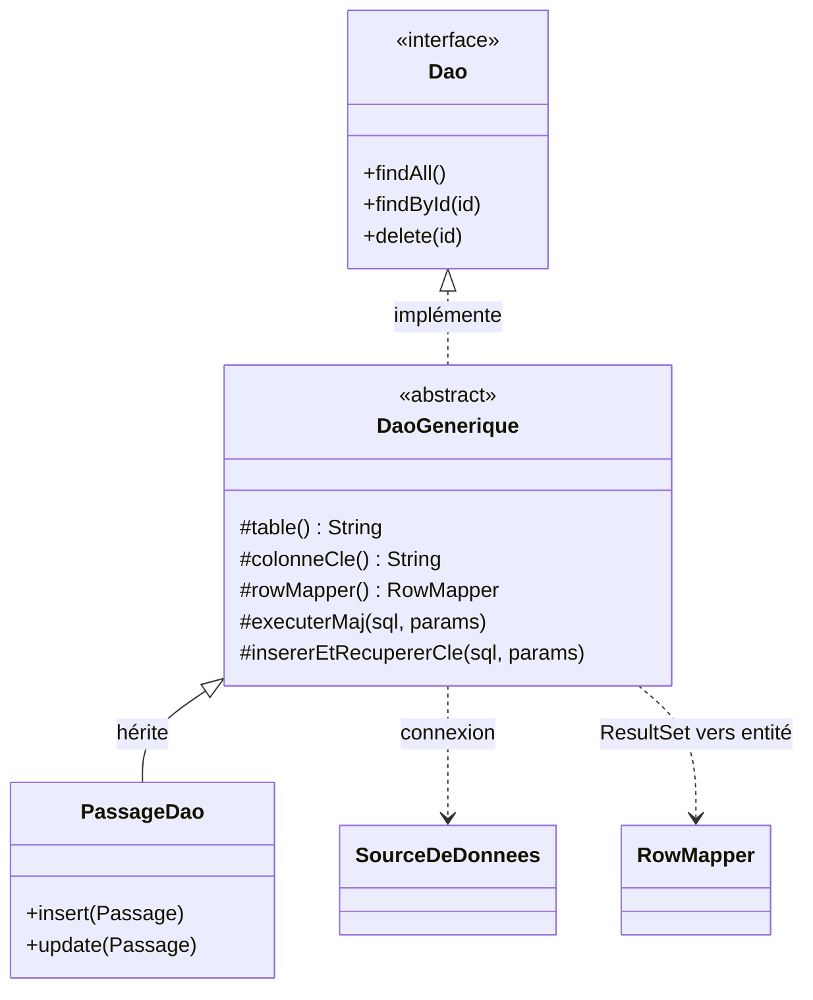

# Persistance

La persistance est **locale** : une base **SQLite** fichier, sans serveur. La couche vit dans
[`commun.persistence`](https://github.com/echonuit/vigiechiro-pr-companion/tree/main/src/main/java/fr/univ_amu/iut/commun/persistence)
(infra technique) ; le **SQL métier** de chaque entité vit dans les `*/model/dao/` de sa feature.

!!! abstract "Cette page = le *mécanisme*, pas le *modèle*"
    Pour **quelles données** sont stockées (entités, 19 tables, MCD du brief, correspondance
    concept → record → table), voir [Modèle de données et domaine](modele-de-donnees.md). Cette
    page-ci décrit **comment** on y accède : source de données, migrations, DAO, transactions.

!!! warning "Frontière"
    `commun.persistence` et tous les `..model.dao..` **ignorent JavaFX** (tests
    `persistance_sans_javafx` et `view_sans_jdbc`). La couche données est réutilisable et testable
    seule.

## La source de données

[`SourceDeDonnees`](https://github.com/echonuit/vigiechiro-pr-companion/blob/main/src/main/java/fr/univ_amu/iut/commun/persistence/SourceDeDonnees.java)
est l'**unique** classe qui connaît l'URL JDBC (`jdbc:sqlite:<workspace>/vigiechiro.db`). Bindée en
**singleton** Guice, elle fournit des `Connection` ; DAO, unité de travail et migration la reçoivent
et ignorent tout du driver.

!!! note "Intégrité référentielle activée explicitement"
    SQLite n'applique les clés étrangères que si on le demande. Chaque connexion active
    `PRAGMA foreign_keys = ON` (objectif qualité O7). En test, le `Workspace` pointe un `@TempDir` :
    base **jetable** par test.

## Les migrations de schéma

[`MigrationSchema`](https://github.com/echonuit/vigiechiro-pr-companion/blob/main/src/main/java/fr/univ_amu/iut/commun/persistence/MigrationSchema.java)
applique des scripts **versionnés**
[`src/main/resources/db/migration/V0x__*.sql`](https://github.com/echonuit/vigiechiro-pr-companion/tree/main/src/main/resources/db/migration)
et trace les versions dans une table `schema_version`. C'est **idempotent** : à la réouverture d'une
base existante, les versions déjà présentes sont ignorées (« base présente → réutilisée »).

Les trois premières migrations posent l'essentiel : `V01__schema.sql` (le schéma initial),
`V02__seed_taxons.sql` (données de référence), `V03__perf_indexes.sql` (index). Les suivantes le font
**évoluer**, migration après migration. Le dossier
[`db/migration/`](https://github.com/echonuit/vigiechiro-pr-companion/tree/main/src/main/resources/db/migration)
en fait foi : il en contient aujourd'hui bien plus que trois.

!!! tip "Ajouter une migration"
    1. Créez `db/migration/Vnn__description.sql`, où `nn` est le **numéro qui suit la dernière
       migration présente** dans le dossier - **surtout pas** `V04`, le compteur est déjà bien plus
       haut.
    2. **Ajoutez son nom au tableau `MIGRATIONS`** de `MigrationSchema` - **l'ordre fait foi**.

    `App` appelle `MigrationSchema.migrer()` au démarrage ; les tests le font sur leur base jetable.

## Remplacer la base sous une application vivante

Trois gestes remplacent le fichier de base **à chaud** : la **restauration** (`ServiceSauvegarde.restaurer`,
#148), la **restauration complète** (#1346) et la **base neuve** (`BaseNeuve.repartirDeZero`, #1419).

Ce n'est pas un pari. La [source de données](#la-source-de-donnees) **n'a aucun pool** : chaque opération
ouvre puis ferme sa connexion, et `SourceDeDonnees` ne retient qu'une URL JDBC. Il n'y a donc aucune
connexion longue à fermer — la prochaine ouvrira simplement le fichier neuf.

Trois précautions, les mêmes pour les trois gestes :

- un **filet** est posé avant d'écraser (`vigiechiro.db.avant-restauration`, `…avant-reset`) : le geste
  reste réversible ;
- les **journaux SQLite** (`-wal`, `-shm`, `-journal`) sont **purgés** : un journal périmé rejouerait
  l'ancienne base par-dessus la neuve ;
- la **migration est rejouée** : la base obtenue est utilisable telle quelle, quel que soit l'âge de ce
  qu'on vient d'y mettre.

!!! warning "Ce que la base ne sait pas, c'est l'IHM qui doit le porter"
    Une application graphique **déjà ouverte** garde en mémoire des écrans peuplés par l'**ancienne** base :
    ils afficheraient des fantômes. Le socle ne connaît pas d'IHM — c'est à l'appelant d'exiger un
    redémarrage (ce que fait le reset : il ferme l'application après coup).

    Le piège est plus subtil qu'il n'y paraît, et il a été trouvé par un test E2E : `idUtilisateurCourant`
    est un **singleton Guice déjà résolu**. Après une base neuve, l'utilisateur local avait disparu de la
    table, mais les rapprocheurs tenaient toujours son identifiant : tout ce qu'ils recréaient (sites,
    points) pointait sur un **propriétaire disparu**. Clé étrangère morte, échec **avalé** par le contrat
    best-effort, workspace muet. `ServiceReset` **préserve donc l'observateur** à travers le reset : c'est
    la même personne qui repart d'une base neuve.

## Le patron DAO

Pas d'ORM : des **DAO** en `PreparedStatement`. La base technique
[`DaoGenerique<T, ID>`](https://github.com/echonuit/vigiechiro-pr-companion/blob/main/src/main/java/fr/univ_amu/iut/commun/persistence/DaoGenerique.java)
offre `findAll` / `findById` / `delete` **gratuitement** dès qu'un DAO concret fournit son `table()`,
sa `colonneCle()` et son `RowMapper`. Seules les écritures dépendant des colonnes
(`insert` / `update`) restent à écrire, via les helpers `executerMaj(...)` et
`insererEtRecupererCle(...)`.

Depuis #1193, la mécanique de **lecture** (connexion, liaison des paramètres, itération du
`ResultSet` vers un `RowMapper`) vit dans
[`ProjectionGenerique`](https://github.com/echonuit/vigiechiro-pr-companion/blob/main/src/main/java/fr/univ_amu/iut/commun/persistence/ProjectionGenerique.java),
dont hérite `DaoGenerique`. Les **DAO de projection** en lecture seule (`ProjectionsAnalyseDao`,
`ProjectionsAudioDao` sur la table `observation`) étendent directement cette base : une projection
transverse ne porte ni table propre ni écriture, le contrat CRUD `Dao` ne s'applique pas à elle.
Les fragments SQL partagés entre DAO d'une même table (jointures de contexte, statut dérivé,
alias) sont factorisés dans une classe paquet-privée (`FragmentsSqlObservation`).



(Les classes sont génériques : `Dao<T, ID>`, `DaoGenerique<T, ID>`, `RowMapper<T>`.)

Le [`RowMapper<T>`](https://github.com/echonuit/vigiechiro-pr-companion/blob/main/src/main/java/fr/univ_amu/iut/commun/persistence/RowMapper.java)
transforme une ligne de `ResultSet` en entité (un `record` immuable).

## Transactions

Par défaut, chaque appel DAO **s'auto-commit**. Quand plusieurs écritures doivent réussir ou échouer
**ensemble** (ex. créer un passage *et* sa session), on les regroupe dans une
[`UniteDeTravail`](https://github.com/echonuit/vigiechiro-pr-companion/blob/main/src/main/java/fr/univ_amu/iut/commun/persistence/UniteDeTravail.java) :

```java
uniteDeTravail.executer(connexion -> {
    // plusieurs écritures sur la MÊME connexion...
}); // commit si tout passe, rollback sinon
```

Une exception dans le bloc déclenche un **rollback** : la base reste cohérente (objectif intégrité /
résilience O7). Les erreurs SQL sont remontées en
[`DataAccessException`](https://github.com/echonuit/vigiechiro-pr-companion/blob/main/src/main/java/fr/univ_amu/iut/commun/persistence/DataAccessException.java)
(non vérifiée).

---

Les DAO et services sont assemblés par Guice : voir **[Injection (Guice)](injection.md)**.
