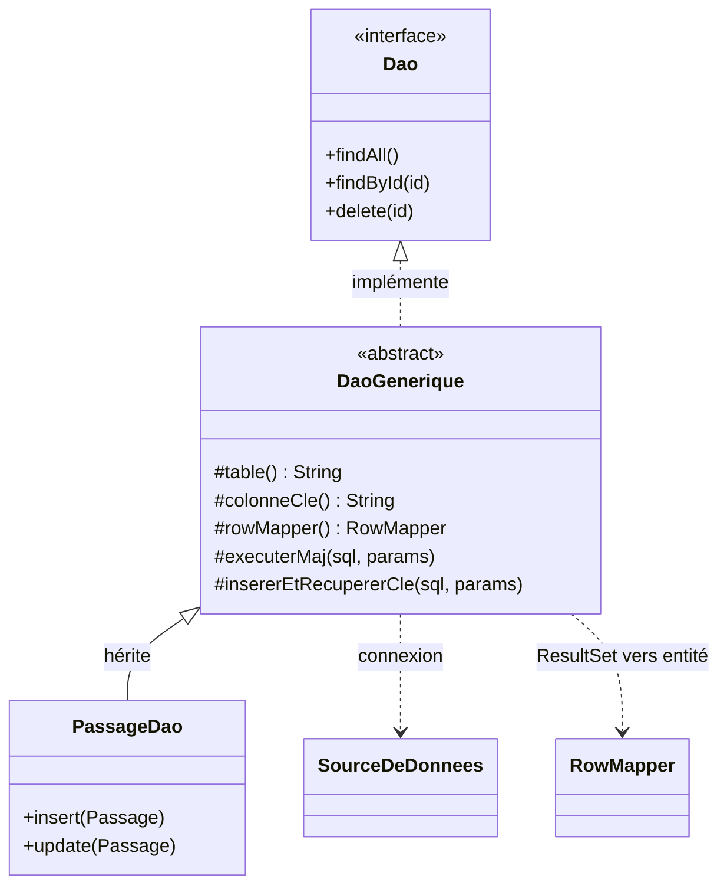

# Persistance

La persistance est **locale** : une base **SQLite** fichier, sans serveur. La couche vit dans
[`commun.persistence`](https://github.com/echonuit/vigiechiro-pr-companion/tree/main/src/main/java/fr/univ_amu/iut/commun/persistence)
(infra technique) ; le **SQL métier** de chaque entité vit dans les `*/model/dao/` de sa feature.

!!! abstract "Cette page = le *mécanisme*, pas le *modèle*"
    Pour **quelles données** sont stockées (entités, tables, MCD du brief, correspondance
    concept → record → table), voir [Modèle de données et domaine](modele-de-donnees.md). Cette
    page-ci décrit **comment** on y accède : source de données, migrations, DAO, transactions.

!!! warning "Frontière"
    `commun.persistence` et tous les `..model.dao..` **ignorent JavaFX** (tests
    `persistance_sans_javafx` et `view_sans_jdbc`). La couche données est réutilisable et testable
    seule.

## La source de données

[`SourceDeDonnees`](https://github.com/echonuit/vigiechiro-pr-companion/blob/main/src/main/java/fr/univ_amu/iut/commun/persistence/SourceDeDonnees.java)
est l'**unique** classe qui connaît l'URL JDBC (`jdbc:sqlite:` + `Workspace.cheminBaseDeDonnees()`,
soit `<workspace>/vigiechiro.db` **par défaut**, ou l'emplacement choisi dans l'onglet « Emplacements »,
cf. [ADR 1038](decisions/1038-la-configuration-d-amorcage-vit-hors-de-la-base.md)). Bindée en
**singleton** Guice, elle fournit des `Connection` ; DAO, unité de travail et migration la reçoivent
et ignorent tout du driver.

!!! note "Intégrité référentielle activée explicitement"
    SQLite n'applique les clés étrangères que si on le demande. Chaque connexion active
    `PRAGMA foreign_keys = ON` (objectif qualité O7). En test, le `Workspace` pointe un `@TempDir` :
    base **jetable** par test.

## Les migrations de schéma

[`MigrationSchema`](https://github.com/echonuit/vigiechiro-pr-companion/blob/main/src/main/java/fr/univ_amu/iut/commun/persistence/MigrationSchema.java)
applique des scripts **versionnés**
[`src/main/resources/db/migration/V0x__*.sql`](https://github.com/echonuit/vigiechiro-pr-companion/tree/main/src/main/resources/db/migration)
et trace les versions dans une table `schema_version`. C'est **idempotent** : à la réouverture d'une
base existante, les versions déjà présentes sont ignorées (« base présente → réutilisée »).

Les trois premières migrations posent l'essentiel : `V01__schema.sql` (le schéma initial),
`V02__seed_taxons.sql` (données de référence), `V03__perf_indexes.sql` (index). Les suivantes le font
**évoluer**, migration après migration. Le dossier
[`db/migration/`](https://github.com/echonuit/vigiechiro-pr-companion/tree/main/src/main/resources/db/migration)
en fait foi : il en contient aujourd'hui bien plus que trois (<!--inv:migrations-->42<!--/inv--> à ce jour).

!!! tip "Ajouter une migration"
    1. Créez `db/migration/Vnn__description.sql`, où `nn` est le **numéro qui suit la dernière
       migration présente** dans le dossier - **surtout pas** `V04`, le compteur est déjà bien plus
       haut.
    2. **Ajoutez son nom au tableau `MIGRATIONS`** de `MigrationSchema` - **l'ordre fait foi**.
    3. **N'y mettez ni `PRAGMA`, ni `VACUUM`, ni `BEGIN`/`COMMIT` explicite** : le script s'exécute
       dans une transaction (voir ci-dessous), et ces trois-là n'y survivent pas. Un `PRAGMA` y est
       silencieusement sans effet, ce qui est le pire des trois. Une migration qui en aurait
       réellement besoin doit d'abord changer `MigrationSchema.appliquer`.
    4. **Une fois poussée, elle ne se modifie plus.** Elle est appliquée chez d'autres, et ne se
       rejouera pas chez eux. Ce qu'il faut corriger se corrige dans une migration **suivante** ; une
       retouche du script déjà publié fait refuser le démarrage (voir ci-dessous).

    `App` migre **avant de composer l'injecteur** (`Amorcage.migrerPuisComposer()`) : les drapeaux de
    fonctionnalités sont ainsi lus dans une base à jour, ce qui a fermé le piège dormant #2187
    ([ADR 1038](decisions/1038-la-configuration-d-amorcage-vit-hors-de-la-base.md)). La CLI migre de
    même avant de composer, mais **seulement si la base existe déjà** (une aide ne doit créer aucun
    fichier). Les tests migrent sur leur base jetable.

### Une migration passe entière, ou pas du tout

Chaque script et l'inscription de sa version dans `schema_version` sont portés par **une seule
transaction** (`MigrationSchema.appliquer`, via l'[unité de travail](#transactions)). Une coupure au
milieu d'un script ne laisse donc **rien** derrière elle : ni table à moitié créée, ni colonne
ajoutée sans sa version.

Cette garantie n'est pas un confort, c'est ce qui permet de **relancer**. Les scripts ne sont pas
idempotents pris un par un (`V01` ne pose aucun `IF NOT EXISTS`, `V26` enchaîne deux `ADD COLUMN`) :
si une panne en laissait la moitié appliquée, le lancement suivant rejouerait le script depuis le
début et buterait sur la première instruction déjà passée. L'application ne redémarrerait plus, sans
qu'aucun message ne dise pourquoi (#2728).

Le message d'échec, lui, **situe** la panne : le fichier, le rang de l'instruction et son début. Un
« no such column » de SQLite laisserait sinon relire tout le script pour trouver où.

### Un filet avant chaque montée de version

Une migration est le seul moment où l'application **transforme la base sans que l'utilisateur l'ait
demandé** : il ouvre l'application après une mise à jour, et le schéma change. Avant d'appliquer la
première migration en attente, la base est donc mise à l'abri dans
`<workspace>/sauvegardes/vigiechiro-avant-migration-V<nn>.db`, là où la restauration propose de
chercher (#2729).

L'atomicité de la section précédente protège d'une **panne** ; le filet protège aussi d'une migration
qui **réussit** en faisant autre chose que prévu, ce qu'aucune transaction ne rattrape.

Deux cas où il n'y a rien à faire : aucune migration en attente (le lancement ordinaire n'accumule
pas de copies), et une base qui ne portait encore aucune version. Ce second cas est la **création**
de la base, pas sa montée de version.

Si le filet ne peut pas être posé (dossier inaccessible, disque plein), **la migration n'a pas
lieu** : avancer sans lui reviendrait à ne le promettre que quand il ne sert à rien.

L'instantané est produit par `InstantaneBase` (`VACUUM INTO`), que partagent les trois usages :
sauvegarde de routine, sauvegarde complète et filet. Il vit à part de `ServiceSauvegarde` parce que
le migrateur en a besoin et que le service, lui, appelle déjà le migrateur.

### Un script publié ne se modifie plus

Une migration appliquée **ne se rejoue jamais** : sa version est inscrite, le migrateur passe. Donc
si on modifie son script après coup (rebase, correction bien intentionnée), les bases qui l'ont subi
dans sa première version et celles qui naissent avec la seconde **divergent en silence**, et rien
dans le schéma ne dit laquelle on a sous les yeux.

Chaque migration laisse donc son **empreinte SHA-256** dans `schema_version`, écrite dans la
transaction qui l'applique. Au démarrage, avant d'appliquer quoi que ce soit, une empreinte qui ne
correspond plus à son script est un **refus explicite** qui nomme le fichier et dit quoi faire
(#2729).

L'empreinte porte sur les **instructions**, pas sur le texte du fichier : corriger une faute dans un
commentaire ou changer les fins de ligne ne change rien à ce que la base reçoit, et faire échouer un
démarrage pour cela serait un refus faux. Un refus faux use plus vite la confiance qu'une alerte
manquée.

!!! warning "Ce que l'empreinte ne peut pas faire"
    Les migrations appliquées **avant** sa mise en place n'en ont aucune. Elles sont **étalonnées**
    au premier lancement, sur le contenu actuel des scripts : l'empreinte fige le présent, elle ne
    juge pas le passé. Si un script avait déjà été modifié sur une base existante, l'étalonnage
    enregistrera la version modifiée et personne ne le saura. C'est irrattrapable (rien n'a gardé
    trace de ce qui avait été appliqué) et c'est écrit ici plutôt que tu, parce qu'une garantie qu'on
    croit plus large qu'elle n'est vaut moins que pas de garantie du tout.

## Remplacer la base sous une application vivante

Trois gestes remplacent le fichier de base **à chaud** : la **restauration** (`ServiceSauvegarde.restaurer`,
#148), la **restauration complète** (#1346) et la **base neuve** (`BaseNeuve.repartirDeZero`, #1419).

Ce n'est pas un pari. La [source de données](#la-source-de-donnees) **n'a aucun pool** : chaque opération
ouvre puis ferme sa connexion, et `SourceDeDonnees` ne retient qu'une URL JDBC. Il n'y a donc aucune
connexion longue à fermer : la prochaine ouvrira simplement le fichier neuf.

Trois précautions, les mêmes pour les trois gestes :

- un **filet** est posé avant d'écraser (`vigiechiro.db.avant-restauration`, `…avant-reset`) : le geste
  reste réversible ;
- les **journaux SQLite** (`-wal`, `-shm`, `-journal`) sont **purgés** : un journal périmé rejouerait
  l'ancienne base par-dessus la neuve ;
- la **migration est rejouée** : la base obtenue est utilisable telle quelle, quel que soit l'âge de ce
  qu'on vient d'y mettre.

!!! warning "Ce que la base ne sait pas, c'est l'IHM qui doit le porter"
    Une application graphique **déjà ouverte** garde en mémoire des écrans peuplés par l'**ancienne** base :
    ils afficheraient des fantômes. Le socle ne connaît pas d'IHM : c'est à l'appelant d'exiger un
    redémarrage (ce que fait le reset : il ferme l'application après coup).

    Le piège est plus subtil qu'il n'y paraît, et il a été trouvé par un test E2E : `idUtilisateurCourant`
    est un **singleton Guice déjà résolu**. Après une base neuve, l'utilisateur local avait disparu de la
    table, mais les rapprocheurs tenaient toujours son identifiant : tout ce qu'ils recréaient (sites,
    points) pointait sur un **propriétaire disparu**. Clé étrangère morte, échec **avalé** par le contrat
    best-effort, workspace muet. `ServiceReset` **préserve donc l'observateur** à travers le reset : c'est
    la même personne qui repart d'une base neuve.

## Une sauvegarde complète sait d'où venaient les dossiers

La **sauvegarde complète** (`ServiceSauvegarde.sauvegarderComplet`, #1346) emporte la base **et** les
dossiers de son, un par `recording_session.root_path` distinct. Elle écrit à sa racine un
**manifeste** versionné, `manifeste.json` (#2726) :

```json
{
  "version": 1,
  "racines": [
    {
      "identifiant": "Nuit-01-3f2a1b7c",
      "cheminOrigine": "/mnt/disque-a/Nuit-01",
      "fichiers": 2431,
      "octets": 3407872512,
      "empreinte": "9c1e…"
    }
  ]
}
```

Il répond à deux défauts qui se tenaient ensemble :

- **la destination d'une copie était le dernier segment du chemin.** `/mnt/disque-a/Nuit-01` et
  `/mnt/disque-b/Nuit-01` visaient donc `sessions/Nuit-01` tous les deux, et la copie récursive
  écrasant en `REPLACE_EXISTING`, la seconde nuit effaçait la première **sans un mot**. Le dossier
  s'appelle maintenant `<dernier segment>-<condensé du chemin complet>` : lisible, et unique par
  construction ;
- **rien ne conservait le chemin d'origine.** Une restauration ne pouvait donc ni remettre les
  dossiers où ils étaient, ni corriger les `root_path` de la base : la promesse « la restauration
  remet la base et les dossiers de son » ne tenait que si l'on restaurait sur la machine d'origine.
  C'est le sujet de #2727, que ce manifeste rend possible.

L'`empreinte` porte sur l'**inventaire** (`chemin relatif` + `taille` de chaque fichier, trié, en
SHA-256), pas sur le contenu des fichiers : elle attrape un fichier manquant, un fichier en trop, un
renommage et une troncature, sans lire un octet d'audio. Hacher plusieurs gigaoctets doublerait le
temps de la sauvegarde **et** celui de la restauration pour n'attraper en plus que la corruption
silencieuse à taille égale, et le socle a déjà mieux pour ce cas-là : `original_recording.sha256`
vit en base.

!!! warning "Absent et illisible ne sont pas le même cas"
    Une sauvegarde **antérieure** à ce format n'a pas de manifeste : c'est normal, la restauration
    retombe sur ce qu'elle savait faire (dossiers remis à la racine du workspace, sous leur nom de
    dossier). Un manifeste **présent mais abîmé**, en revanche, est un **refus explicite** : le
    traiter comme absent ferait silencieusement moins bien que promis, sur la seule sauvegarde dont
    on ait la preuve qu'elle a un problème.

    C'est précisément pourquoi il s'écrit **d'un seul coup** (`EcritureAtomique`, généralisé à la
    clôture du lot #2722) : une interruption pendant son écriture le laissait tronqué, et ce refus
    explicite tombait alors sur une sauvegarde par ailleurs **intacte**. Un lecteur voit désormais
    l'ancien manifeste ou le nouveau, jamais un JSON coupé.

## Une sauvegarde ne porte son nom qu'une fois complète

Elle vérifie **d'abord** la place : la base plus les racines de session accessibles, confrontées à
l'espace libre de la destination. Un manque est un refus **chiffré**, avant la première copie - même
geste que l'import, le lot et la restauration, que la sauvegarde était seule à ne pas faire (#3572).

Elle se construit ensuite sous un nom de **chantier** (`en-chantier-vigiechiro-sauvegarde-complete-…`)
et n'est **renommée** qu'après l'écriture du manifeste.

Le renommage ferme ce qu'un nettoyage à l'échec ne fermerait pas : une coupure de courant ou un
`kill -9` ne laissent tourner aucun code. Sans lui, un dossier interrompu portait le nom d'une
sauvegarde complète, `InventaireSauvegardes` le listait comme telle - il classe sur le **préfixe** du
nom - et le restaurer empruntait `replacerSansManifeste`, le chemin d'avant #2726 : dossiers déversés à
la racine, chemins non corrigés. **L'absence de manifeste voulait dire deux choses opposées** : « cette
sauvegarde est ancienne » et « cette sauvegarde est tronquée ».

Le marqueur est en **tête** du nom, et pas en suffixe, pour cette raison exacte.

### Un échec de dépôt dit s'il vaut la peine d'être retenté

Le transport distingue déjà un incident rejouable d'un refus définitif : `ReponseApi.estReessayable()`,
dont `PolitiqueReessai` se sert pour renoncer tout de suite sur un `4xx`. Depuis `V39__echec_definitif.sql`
(#3469), le **plan** le retient aussi : `depot_unite.echec_definitif` porte ce que l'appel savait.

**Une colonne, et non un statut `refuse` à côté de `echec`.** Le réflexe serait le statut, et il serait
dangereux : `DepotUniteDao.restantes()` rend « tout sauf `depose` », et `toutesDeposees()` vaut
« `restantes()` est vide ». Retirer les unités refusées de `restantes()` ferait donc basculer le passage
en **Déposé** alors qu'il manque des sons. Avec une colonne, la mécanique de reprise ne bouge pas : c'est
l'**offre** de reprise qui change.

`mettreAJour` **efface** ce caractère définitif, `marquerEchec` le pose : une unité finalement déposée
après un refus ne doit plus être annoncée irrécupérable.

### Le garde refuse aussi quand il n'a pas pu tout voir

Le garde pèse les racines de session avec `ArborescenceFichiers.peser`, qui rend **ce qu'elle a lu et
ce qu'elle n'a pas pu ouvrir**. Si la liste des illisibles n'est pas vide, il refuse **avant** de
comparer à la place libre, en nommant le dossier et sa cause système.

Le refus tombe avant la comparaison, pas après : annoncer « il manque N Go » sur une mesure
incomplète enverrait l'utilisateur libérer de l'espace pour un problème de **droits**.

La même pesée sert `InventaireSauvegardes`, qui **ignore** les illisibles et affiche ce qu'il sait :
un affichage n'a pas à se briser parce qu'un dossier a résisté. Un geste, deux besoins, et c'est
l'appelant qui tranche - comme `supprimerRecursivement` et `effacerAuMieux`
([ADR 3627](decisions/3627-une-mesure-dit-ce-qu-elle-n-a-pas-pu-lire.md), [ADR 3574](decisions/3574-un-effacement-dit-son-contrat-dans-son-nom.md)).

Le parcours est une **file explicite** et non `Files.walk` : `walk` lève sur le premier dossier
interdit et interrompt tout, alors qu'on veut mesurer le reste et rapporter ce qui a résisté.

### Partout ailleurs, qui parcourt rattrape ce que le parcours lève

`Files.walk` reste employé ailleurs, et il y a un piège que neuf sites du dépôt ont partagé : il
n'annonce **pas** son échec de parcours en `IOException`, il l'enveloppe dans une
`UncheckedIOException` levée **pendant l'itération**. Elle n'hérite pas d'`IOException` : le `catch`
voisin ne la voit pas, et une méthode qui déclare `throws IOException` la laisse sortir d'un autre
type. Le rattrapage écrit ne rattrape donc rien du cas pour lequel il a été écrit.

Trois gestes, selon le contrat du site - et c'est bien le contrat qui décide, pas une règle unique :

| Le site promet | Le geste |
|---|---|
| de ne **jamais lever** (`effacerAuMieux`) | rapporter le dossier illisible dans sa liste |
| une mesure **d'affichage** (`ArborescenceFichiers.octets`) | compter ce qui a pu être lu |
| `throws IOException` (`copier`, `InventaireDossier`, `BasculeRacines`…) | ramener la cause au type annoncé |

`ParcoursDeDossierTest` tient le cliquet : tout fichier appelant `Files.walk` doit rattraper
l'`UncheckedIOException`. Interdire `walk` au profit d'un helper unique a été **écarté** - ces sites
ont des contrats opposés, et un seul nom pour des comportements contraires est précisément ce que
l'ADR 3574 a démêlé (#3632).

## Une restauration complète est vérifiée, puis basculée

`ServiceSauvegarde.restaurerComplet` s'appuie sur le manifeste pour tenir la promesse en entier
(#2727), dans cet ordre :

1. **vérifier** chaque dossier de la sauvegarde contre l'inventaire du manifeste ;
2. **restaurer la base** (avec son filet `vigiechiro.db.avant-restauration`) ;
3. **étaler** les dossiers à côté de leur destination, sous un suffixe `.en-cours`, puis les
   **basculer** par un renommage (#3514) ;
4. **réécrire les chemins persistés** en une transaction.

!!! danger "`root_path` n'est pas le seul chemin en base"
    Chaque original, chaque séquence d'écoute, le journal du capteur, le relevé climatique et le CSV
    Tadarida portent leur chemin **absolu** : six tables au total (`ReecritureRacineSession`, dont
    l'inventaire a été confronté aux colonnes `*_path` des 38 migrations). Ne réécrire que la racine
    donne une base qui **paraît** corrigée et une application qui ne retrouve plus un seul fichier.

    Ce piège n'est pas théorique : c'est l'état dans lequel cette fonctionnalité a d'abord été
    écrite. Les tests Java relisaient `root_path` et concluaient au succès ; l'E2E `bats` qui restaure
    sur une autre machine puis demande `reset-guide` a répondu **PERDU**. Un test qui vérifie ce qu'on
    a écrit ne remplace pas un test qui demande à l'application si elle s'y retrouve.

    L'inventaire de ces tables vit à **un seul endroit**, `TablesAChemin` (#3133). Il était écrit deux
    fois, ici et dans `RattachementDao.reprefixerChemins`, qui applique la même règle pour renommer
    une session rattachée : la septième table aurait été ajoutée à un endroit sur deux. Le socle ne
    peut pas dépendre d'une feature, mais une feature dépend du socle, et cet inventaire est de la
    connaissance de **schéma**.

    Ce que chacun **fait** de chaque table lui reste propre : le socle réenracine, la feature
    réenracine **et** renomme les noms logiques.

    `TablesACheminTest` confronte cette liste aux colonnes de chemin déclarées par les 38 migrations.
    C'est le second filet, et il attrape autre chose que la déduplication : une **migration** qui
    ajoute une colonne de chemin à une table de plus, et que personne ne pense à inscrire.

L'ordre est le point important : une seule discordance à l'étape 1 annule tout **avant que rien
n'ait été touché**. La vérification passait auparavant après la bascule, ce qui revenait à découvrir
le problème une fois la base remplacée.

### Ce que l'étalement coûte, et pourquoi il n'est pas toujours possible

L'étalement ramène la fenêtre d'une **copie complète** - des minutes, des gigaoctets - à une **suite
de renommages**. Il se paie en place : la copie coexiste avec l'original jusqu'à la bascule.

C'est exactement ce que l'[ADR 2727](decisions/2727-une-restauration-verifie-en-place-et-replace-ou-cest-possible.md)
avait refusé, en chiffrant le cas ordinaire (« restaurer 40 Go par-dessus ses propres 40 Go
demanderait 80 Go libres ») et en concluant qu'« un dispositif de sûreté qui empêche l'usage normal
n'est pas un dispositif de sûreté ». Le reproche reste juste ; ce qui change, c'est qu'on n'est plus
obligé de choisir une fois pour toutes. Le régime est décidé **par la place réellement libre**
(#3563), sans toucher au disque : le manifeste porte les octets de chaque racine.

| Place libre là où les nuits atterrissent | Régime | Ce qu'une panne laisserait |
|---|---|---|
| ≥ ce que pèsent toutes les nuits qui y vont | tout étaler, tout vérifier, puis tout basculer | des temporaires, et l'état d'avant |
| ≥ la plus grosse d'entre elles | une nuit à la fois | les premières en place, pas les dernières - **et le compte rendu le dit** |
| en dessous | refus **chiffré** : combien il manque, et où | rien |

Le besoin est compté **par dossier d'accueil**, et non en un total unique : une nuit dont le disque
externe est rebranché y retourne, les autres vont dans le dossier de travail. Un total unique
confronté à la seule place du dossier de travail se tromperait **dans le sens dangereux**.

En régime dégradé, **dès la première bascule, « rien n'a été touché » cesse d'être vrai**. Un refus
survenu ensuite est donc requalifié en incident : le laisser passer pour un refus donnerait à un
script un code qui promet un état intact au-dessus d'un état partiel.

Où revient un dossier : **à son emplacement d'origine s'il existe encore et qu'il est inscriptible**,
sinon dans le workspace, sous son nom d'origine. Le critère est que le dossier existe, et non que son
parent soit créable : `/mnt/disque-a` est un point de montage **vide** quand le disque n'est pas
branché, et le juger « créable » y déverserait des gigaoctets sur le disque système, que le montage
du vrai disque masquerait ensuite.

Dans les deux cas `root_path` désigne l'endroit réel, ce qui est toute la correction : la base
restaurée ne pointe plus vers des dossiers absents.

!!! warning "Ce que la restauration dit, et pourquoi elle le dit"
    `BilanRestauration` porte ce qui a changé de place et ce que la sauvegarde ne contenait pas (une
    nuit dont la racine était inaccessible au moment de la copie, #1346). Les deux surfaces
    l'affichent. Un geste qui déplace des gigaoctets et corrige la base ne peut pas se contenter de
    « restauré » : l'utilisateur ne saurait ni où sont ses nuits, ni laquelle manque.

    Conséquence assumée du critère ci-dessus : restaurer une nuit qu'on vient de **supprimer** la
    remet dans le workspace et non à sa place, puisque sa place n'existe plus. Le compte rendu le
    dit, et la base pointe vers l'endroit réel.

## Un seul processus écrit dans un dossier de travail

`VerrouWorkspace` pose un **verrou de fichier système** sur `<workspace>/.verrou` (#2731). Le PID et
l'horodatage y sont écrits pour le **message**, jamais pour la décision : c'est le système qui
tranche, et c'est lui qui **relâche** le verrou quand le processus meurt, de sorte qu'un plantage ne
condamne pas le dossier de travail.

Qui le prend, et pour combien de temps :

| Qui | Portée |
|---|---|
| l'application graphique | toute la durée de son exécution : c'est elle l'occupante |
| la migration | seulement si elle a **réellement** quelque chose à appliquer |
| **toute commande CLI**, sauf celles déclarées `LectureSeule` | toute la durée de la commande (#3498) |
| la restauration (simple et complète), la remise à zéro | le temps de l'opération |
| les commandes de lecture | jamais - c'est le sens de la déclaration `LectureSeule` |

Qui est lectrice ne se recopie pas ici : la liste vit dans le code, portée par l'interface marqueur, et
`ClassementLectureEcritureTest` exige que **chaque** commande soit classée. Voir
[CLI](cli.md#le-dossier-de-travail-est-reserve-pendant-lecriture-3498).

La nuance sur la migration est délibérée : une commande de lecture lancée pendant que l'IHM tourne ne
migre rien, et la faire échouer sur un verrou lui coûterait plus que la protection ne lui rapporte.

Un processus qui détient déjà le verrou **ne se bloque pas lui-même** : une restauration lancée
depuis l'IHM réutilise le verrou de l'IHM, et sa fin ne le relâche pas.

Le choix du mécanisme et celui de **refuser** la seconde instance plutôt que de la basculer en
lecture seule sont motivés dans l'[ADR 2731](decisions/2731-un-seul-processus-par-workspace.md), qui
dit aussi ce que le verrou **ne** protège pas.

## Le patron DAO

Pas d'ORM : des **DAO** en `PreparedStatement`. La base technique
[`DaoGenerique<T, ID>`](https://github.com/echonuit/vigiechiro-pr-companion/blob/main/src/main/java/fr/univ_amu/iut/commun/persistence/DaoGenerique.java)
offre `findAll` / `findById` / `delete` **gratuitement** dès qu'un DAO concret fournit son `table()`,
sa `colonneCle()` et son `RowMapper`. Seules les écritures dépendant des colonnes
(`insert` / `update`) restent à écrire, via les helpers `executerMaj(...)` et
`insererEtRecupererCle(...)`.

Depuis #1193, la mécanique de **lecture** (connexion, liaison des paramètres, itération du
`ResultSet` vers un `RowMapper`) vit dans
[`ProjectionGenerique`](https://github.com/echonuit/vigiechiro-pr-companion/blob/main/src/main/java/fr/univ_amu/iut/commun/persistence/ProjectionGenerique.java),
dont hérite `DaoGenerique`. Les **DAO de projection** en lecture seule (`ProjectionsAnalyseDao`,
`ProjectionsAudioDao` sur la table `observation`) étendent directement cette base : une projection
transverse ne porte ni table propre ni écriture, le contrat CRUD `Dao` ne s'applique pas à elle.
Les fragments SQL partagés entre DAO d'une même table (jointures de contexte, statut dérivé,
alias) sont factorisés dans une classe paquet-privée (`FragmentsSqlObservation`).


```mermaid
classDiagram
    class Dao {
        <<interface>>
        +findAll()
        +findById(id)
        +delete(id)
    }
    class DaoGenerique {
        <<abstract>>
        #table() String
        #colonneCle() String
        #rowMapper() RowMapper
        #executerMaj(sql, params)
        #insererEtRecupererCle(sql, params)
    }
    class PassageDao {
        +insert(Passage)
        +update(Passage)
    }
    Dao <|.. DaoGenerique : implémente
    DaoGenerique <|-- PassageDao : hérite
    DaoGenerique ..> SourceDeDonnees : connexion
    DaoGenerique ..> RowMapper : ResultSet vers entité
```

(Les classes sont génériques : `Dao<T, ID>`, `DaoGenerique<T, ID>`, `RowMapper<T>`.)

Le [`RowMapper<T>`](https://github.com/echonuit/vigiechiro-pr-companion/blob/main/src/main/java/fr/univ_amu/iut/commun/persistence/RowMapper.java)
transforme une ligne de `ResultSet` en entité (un `record` immuable).

## Transactions

Par défaut, chaque appel DAO **s'auto-commit**. Quand plusieurs écritures doivent réussir ou échouer
**ensemble** (ex. créer un passage *et* sa session), on les regroupe dans une
[`UniteDeTravail`](https://github.com/echonuit/vigiechiro-pr-companion/blob/main/src/main/java/fr/univ_amu/iut/commun/persistence/UniteDeTravail.java) :

```java
uniteDeTravail.executer(connexion -> {
    // plusieurs écritures sur la MÊME connexion...
}); // commit si tout passe, rollback sinon
```

Une exception dans le bloc déclenche un **rollback** : la base reste cohérente (objectif intégrité /
résilience O7). Les erreurs SQL sont remontées en
[`DataAccessException`](https://github.com/echonuit/vigiechiro-pr-companion/blob/main/src/main/java/fr/univ_amu/iut/commun/persistence/DataAccessException.java)
(non vérifiée).

Une `SQLException` nue, qui arrive du pilote sans contexte, est **située** par l'unité de travail.
En revanche, un bloc qui lève lui-même une `DataAccessException` la voit **propagée telle quelle** :
elle nomme déjà ce qui a échoué et dans quel état la base se retrouve, et la réemballer mettrait un
« Transaction annulée » générique devant le message qui renseigne. Le rollback a lieu dans les deux
cas.

### Une panne et un refus ne se disent pas avec le même mot

La couche persistance connaît **deux** situations que rien ne permet de confondre du point de vue de
l'appelant, et elle les distingue par le type (#3146) :

| Type | Ce qui s'est passé | Code de sortie CLI |
|---|---|---|
| `DataAccessException` | une **panne** en cours d'écriture : l'état est incertain, la pile est l'information utile | `1` |
| `RefusAvantEcriture` | un **refus** émis avant d'avoir écrit : le fichier désigné n'est pas une base, elle vient d'une version plus récente, le dossier de travail est occupé | `2` |

Le nom du second porte l'invariant qui justifie le code 2 : **rien n'a été écrit**. La convention
elle-même vient de #2294 : `2` dit « j'ai refusé, l'état local est intact », `1` dit « j'ai échoué en
route ». Un script qui enchaîne ne peut agir que s'il sait lequel des deux s'est produit.

!!! note "Pourquoi pas `RegleMetierException`, que la CLI classe déjà en refus"
    Sa documentation dit qu'elle se distingue « de `DataAccessException`, qui enveloppe une panne
    technique de persistance ». Réutiliser l'une pour l'autre brouillerait les deux notions : il
    manquait un **troisième** mot, pas un synonyme.

La même vérification peut être un refus **ou** une panne selon **quand** elle a lieu. Confronter
un dossier à son inventaire avant toute écriture est un refus ; l'y confronter après l'avoir copié
est un incident. `RestaurationComplete.Moment` porte cette distinction plutôt que de la laisser au
hasard d'un site de levée.

---

Les DAO et services sont assemblés par Guice : voir **[Injection (Guice)](injection.md)**.
