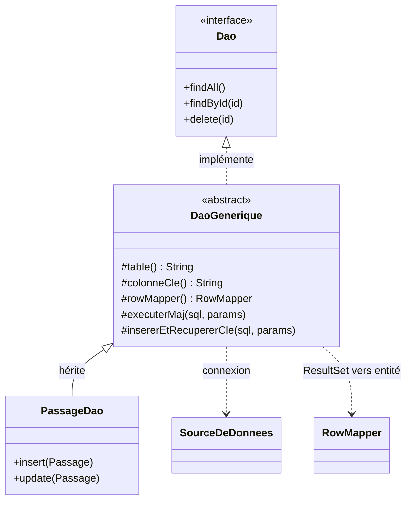

# Persistance

La persistance est **locale** : une base **SQLite** fichier, sans serveur. La couche vit dans
[`commun.persistence`](https://github.com/echonuit/vigiechiro-pr-companion/tree/main/src/main/java/fr/univ_amu/iut/commun/persistence)
(infra technique) ; le **SQL métier** de chaque entité vit dans les `*/model/dao/` de sa feature.

!!! abstract "Cette page = le *mécanisme*, pas le *modèle*"
    Pour **quelles données** sont stockées (entités, tables, MCD du brief, correspondance
    concept → record → table), voir [Modèle de données et domaine](modele-de-donnees.md). Cette
    page-ci décrit **comment** on y accède : source de données, migrations, DAO, transactions.

!!! warning "Frontière"
    `commun.persistence` et tous les `..model.dao..` **ignorent JavaFX** (tests
    `persistance_sans_javafx` et `view_sans_jdbc`). La couche données est réutilisable et testable
    seule.

## La source de données

[`SourceDeDonnees`](https://github.com/echonuit/vigiechiro-pr-companion/blob/main/src/main/java/fr/univ_amu/iut/commun/persistence/SourceDeDonnees.java)
est l'**unique** classe qui connaît l'URL JDBC (`jdbc:sqlite:` + `Workspace.cheminBaseDeDonnees()`,
soit `<workspace>/vigiechiro.db` **par défaut**, ou l'emplacement choisi dans l'onglet « Emplacements »,
cf. [ADR 1038](decisions/1038-la-configuration-d-amorcage-vit-hors-de-la-base.md)). Bindée en
**singleton** Guice, elle fournit des `Connection` ; DAO, unité de travail et migration la reçoivent
et ignorent tout du driver.

!!! note "Intégrité référentielle activée explicitement"
    SQLite n'applique les clés étrangères que si on le demande. Chaque connexion active
    `PRAGMA foreign_keys = ON` (objectif qualité O7). En test, le `Workspace` pointe un `@TempDir` :
    base **jetable** par test.

## Les migrations de schéma

[`MigrationSchema`](https://github.com/echonuit/vigiechiro-pr-companion/blob/main/src/main/java/fr/univ_amu/iut/commun/persistence/MigrationSchema.java)
applique des scripts **versionnés**
[`src/main/resources/db/migration/V0x__*.sql`](https://github.com/echonuit/vigiechiro-pr-companion/tree/main/src/main/resources/db/migration)
et trace les versions dans une table `schema_version`. C'est **idempotent** : à la réouverture d'une
base existante, les versions déjà présentes sont ignorées (« base présente → réutilisée »).

Les trois premières migrations posent l'essentiel : `V01__schema.sql` (le schéma initial),
`V02__seed_taxons.sql` (données de référence), `V03__perf_indexes.sql` (index). Les suivantes le font
**évoluer**, migration après migration. Le dossier
[`db/migration/`](https://github.com/echonuit/vigiechiro-pr-companion/tree/main/src/main/resources/db/migration)
en fait foi : il en contient aujourd'hui bien plus que trois (<!--inv:migrations-->38<!--/inv--> à ce jour).

!!! tip "Ajouter une migration"
    1. Créez `db/migration/Vnn__description.sql`, où `nn` est le **numéro qui suit la dernière
       migration présente** dans le dossier - **surtout pas** `V04`, le compteur est déjà bien plus
       haut.
    2. **Ajoutez son nom au tableau `MIGRATIONS`** de `MigrationSchema` - **l'ordre fait foi**.
    3. **N'y mettez ni `PRAGMA`, ni `VACUUM`, ni `BEGIN`/`COMMIT` explicite** : le script s'exécute
       dans une transaction (voir ci-dessous), et ces trois-là n'y survivent pas. Un `PRAGMA` y est
       silencieusement sans effet, ce qui est le pire des trois. Une migration qui en aurait
       réellement besoin doit d'abord changer `MigrationSchema.appliquer`.
    4. **Une fois poussée, elle ne se modifie plus.** Elle est appliquée chez d'autres, et ne se
       rejouera pas chez eux. Ce qu'il faut corriger se corrige dans une migration **suivante** ; une
       retouche du script déjà publié fait refuser le démarrage (voir ci-dessous).

    `App` migre **avant de composer l'injecteur** (`Amorcage.migrerPuisComposer()`) : les drapeaux de
    fonctionnalités sont ainsi lus dans une base à jour, ce qui a fermé le piège dormant #2187
    ([ADR 1038](decisions/1038-la-configuration-d-amorcage-vit-hors-de-la-base.md)). La CLI migre de
    même avant de composer, mais **seulement si la base existe déjà** (une aide ne doit créer aucun
    fichier). Les tests migrent sur leur base jetable.

### Une migration passe entière, ou pas du tout

Chaque script et l'inscription de sa version dans `schema_version` sont portés par **une seule
transaction** (`MigrationSchema.appliquer`, via l'[unité de travail](#transactions)). Une coupure au
milieu d'un script ne laisse donc **rien** derrière elle : ni table à moitié créée, ni colonne
ajoutée sans sa version.

Cette garantie n'est pas un confort, c'est ce qui permet de **relancer**. Les scripts ne sont pas
idempotents pris un par un (`V01` ne pose aucun `IF NOT EXISTS`, `V26` enchaîne deux `ADD COLUMN`) :
si une panne en laissait la moitié appliquée, le lancement suivant rejouerait le script depuis le
début et buterait sur la première instruction déjà passée. L'application ne redémarrerait plus, sans
qu'aucun message ne dise pourquoi (#2728).

Le message d'échec, lui, **situe** la panne : le fichier, le rang de l'instruction et son début. Un
« no such column » de SQLite laisserait sinon relire tout le script pour trouver où.

### Un filet avant chaque montée de version

Une migration est le seul moment où l'application **transforme la base sans que l'utilisateur l'ait
demandé** : il ouvre l'application après une mise à jour, et le schéma change. Avant d'appliquer la
première migration en attente, la base est donc mise à l'abri dans
`<workspace>/sauvegardes/vigiechiro-avant-migration-V<nn>.db`, là où la restauration propose de
chercher (#2729).

L'atomicité de la section précédente protège d'une **panne** ; le filet protège aussi d'une migration
qui **réussit** en faisant autre chose que prévu, ce qu'aucune transaction ne rattrape.

Deux cas où il n'y a rien à faire : aucune migration en attente (le lancement ordinaire n'accumule
pas de copies), et une base qui ne portait encore aucune version. Ce second cas est la **création**
de la base, pas sa montée de version.

Si le filet ne peut pas être posé (dossier inaccessible, disque plein), **la migration n'a pas
lieu** : avancer sans lui reviendrait à ne le promettre que quand il ne sert à rien.

L'instantané est produit par `InstantaneBase` (`VACUUM INTO`), que partagent les trois usages :
sauvegarde de routine, sauvegarde complète et filet. Il vit à part de `ServiceSauvegarde` parce que
le migrateur en a besoin et que le service, lui, appelle déjà le migrateur.

### Un script publié ne se modifie plus

Une migration appliquée **ne se rejoue jamais** : sa version est inscrite, le migrateur passe. Donc
si on modifie son script après coup (rebase, correction bien intentionnée), les bases qui l'ont subi
dans sa première version et celles qui naissent avec la seconde **divergent en silence**, et rien
dans le schéma ne dit laquelle on a sous les yeux.

Chaque migration laisse donc son **empreinte SHA-256** dans `schema_version`, écrite dans la
transaction qui l'applique. Au démarrage, avant d'appliquer quoi que ce soit, une empreinte qui ne
correspond plus à son script est un **refus explicite** qui nomme le fichier et dit quoi faire
(#2729).

L'empreinte porte sur les **instructions**, pas sur le texte du fichier : corriger une faute dans un
commentaire ou changer les fins de ligne ne change rien à ce que la base reçoit, et faire échouer un
démarrage pour cela serait un refus faux. Un refus faux use plus vite la confiance qu'une alerte
manquée.

!!! warning "Ce que l'empreinte ne peut pas faire"
    Les migrations appliquées **avant** sa mise en place n'en ont aucune. Elles sont **étalonnées**
    au premier lancement, sur le contenu actuel des scripts : l'empreinte fige le présent, elle ne
    juge pas le passé. Si un script avait déjà été modifié sur une base existante, l'étalonnage
    enregistrera la version modifiée et personne ne le saura. C'est irrattrapable (rien n'a gardé
    trace de ce qui avait été appliqué) et c'est écrit ici plutôt que tu, parce qu'une garantie qu'on
    croit plus large qu'elle n'est vaut moins que pas de garantie du tout.

## Remplacer la base sous une application vivante

Trois gestes remplacent le fichier de base **à chaud** : la **restauration** (`ServiceSauvegarde.restaurer`,
#148), la **restauration complète** (#1346) et la **base neuve** (`BaseNeuve.repartirDeZero`, #1419).

Ce n'est pas un pari. La [source de données](#la-source-de-donnees) **n'a aucun pool** : chaque opération
ouvre puis ferme sa connexion, et `SourceDeDonnees` ne retient qu'une URL JDBC. Il n'y a donc aucune
connexion longue à fermer : la prochaine ouvrira simplement le fichier neuf.

Trois précautions, les mêmes pour les trois gestes :

- un **filet** est posé avant d'écraser (`vigiechiro.db.avant-restauration`, `…avant-reset`) : le geste
  reste réversible ;
- les **journaux SQLite** (`-wal`, `-shm`, `-journal`) sont **purgés** : un journal périmé rejouerait
  l'ancienne base par-dessus la neuve ;
- la **migration est rejouée** : la base obtenue est utilisable telle quelle, quel que soit l'âge de ce
  qu'on vient d'y mettre.

!!! warning "Ce que la base ne sait pas, c'est l'IHM qui doit le porter"
    Une application graphique **déjà ouverte** garde en mémoire des écrans peuplés par l'**ancienne** base :
    ils afficheraient des fantômes. Le socle ne connaît pas d'IHM : c'est à l'appelant d'exiger un
    redémarrage (ce que fait le reset : il ferme l'application après coup).

    Le piège est plus subtil qu'il n'y paraît, et il a été trouvé par un test E2E : `idUtilisateurCourant`
    est un **singleton Guice déjà résolu**. Après une base neuve, l'utilisateur local avait disparu de la
    table, mais les rapprocheurs tenaient toujours son identifiant : tout ce qu'ils recréaient (sites,
    points) pointait sur un **propriétaire disparu**. Clé étrangère morte, échec **avalé** par le contrat
    best-effort, workspace muet. `ServiceReset` **préserve donc l'observateur** à travers le reset : c'est
    la même personne qui repart d'une base neuve.

## Le patron DAO

Pas d'ORM : des **DAO** en `PreparedStatement`. La base technique
[`DaoGenerique<T, ID>`](https://github.com/echonuit/vigiechiro-pr-companion/blob/main/src/main/java/fr/univ_amu/iut/commun/persistence/DaoGenerique.java)
offre `findAll` / `findById` / `delete` **gratuitement** dès qu'un DAO concret fournit son `table()`,
sa `colonneCle()` et son `RowMapper`. Seules les écritures dépendant des colonnes
(`insert` / `update`) restent à écrire, via les helpers `executerMaj(...)` et
`insererEtRecupererCle(...)`.

Depuis #1193, la mécanique de **lecture** (connexion, liaison des paramètres, itération du
`ResultSet` vers un `RowMapper`) vit dans
[`ProjectionGenerique`](https://github.com/echonuit/vigiechiro-pr-companion/blob/main/src/main/java/fr/univ_amu/iut/commun/persistence/ProjectionGenerique.java),
dont hérite `DaoGenerique`. Les **DAO de projection** en lecture seule (`ProjectionsAnalyseDao`,
`ProjectionsAudioDao` sur la table `observation`) étendent directement cette base : une projection
transverse ne porte ni table propre ni écriture, le contrat CRUD `Dao` ne s'applique pas à elle.
Les fragments SQL partagés entre DAO d'une même table (jointures de contexte, statut dérivé,
alias) sont factorisés dans une classe paquet-privée (`FragmentsSqlObservation`).


```mermaid
classDiagram
    class Dao {
        <<interface>>
        +findAll()
        +findById(id)
        +delete(id)
    }
    class DaoGenerique {
        <<abstract>>
        #table() String
        #colonneCle() String
        #rowMapper() RowMapper
        #executerMaj(sql, params)
        #insererEtRecupererCle(sql, params)
    }
    class PassageDao {
        +insert(Passage)
        +update(Passage)
    }
    Dao <|.. DaoGenerique : implémente
    DaoGenerique <|-- PassageDao : hérite
    DaoGenerique ..> SourceDeDonnees : connexion
    DaoGenerique ..> RowMapper : ResultSet vers entité
```

(Les classes sont génériques : `Dao<T, ID>`, `DaoGenerique<T, ID>`, `RowMapper<T>`.)

Le [`RowMapper<T>`](https://github.com/echonuit/vigiechiro-pr-companion/blob/main/src/main/java/fr/univ_amu/iut/commun/persistence/RowMapper.java)
transforme une ligne de `ResultSet` en entité (un `record` immuable).

## Transactions

Par défaut, chaque appel DAO **s'auto-commit**. Quand plusieurs écritures doivent réussir ou échouer
**ensemble** (ex. créer un passage *et* sa session), on les regroupe dans une
[`UniteDeTravail`](https://github.com/echonuit/vigiechiro-pr-companion/blob/main/src/main/java/fr/univ_amu/iut/commun/persistence/UniteDeTravail.java) :

```java
uniteDeTravail.executer(connexion -> {
    // plusieurs écritures sur la MÊME connexion...
}); // commit si tout passe, rollback sinon
```

Une exception dans le bloc déclenche un **rollback** : la base reste cohérente (objectif intégrité /
résilience O7). Les erreurs SQL sont remontées en
[`DataAccessException`](https://github.com/echonuit/vigiechiro-pr-companion/blob/main/src/main/java/fr/univ_amu/iut/commun/persistence/DataAccessException.java)
(non vérifiée).

Une `SQLException` nue, qui arrive du pilote sans contexte, est **située** par l'unité de travail.
En revanche, un bloc qui lève lui-même une `DataAccessException` la voit **propagée telle quelle** :
elle nomme déjà ce qui a échoué et dans quel état la base se retrouve, et la réemballer mettrait un
« Transaction annulée » générique devant le message qui renseigne. Le rollback a lieu dans les deux
cas.

---

Les DAO et services sont assemblés par Guice : voir **[Injection (Guice)](injection.md)**.
