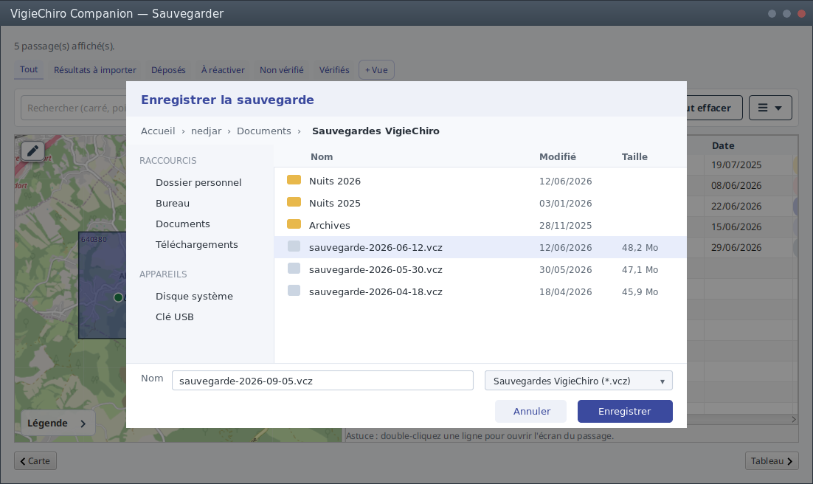
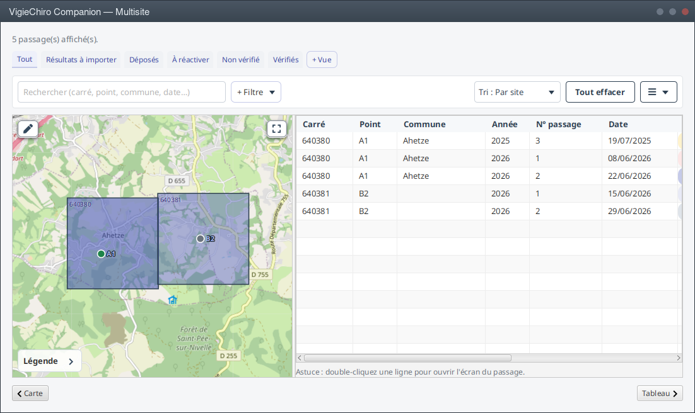

# Le banc Java peut-il aussi filmer la documentation ?

Prolonge [Filmer la recette depuis le graphe de scène](film-depuis-le-graphe-de-scene.md), qui a
produit le banc Java, et dont la dernière ligne pose sans le savoir la question de cette page.

Le dépôt porte **deux** bancs filmés. Celui de la recette, `lance-test-filme.sh` (1 295 lignes),
que l'[ADR 5188](../decisions/5188-bash-disparait-une-tolerance-est-un-delai.md) tolère « tant que le
banc Java n'est pas définitivement validé ». Et celui de la documentation,
`scripts/doc-video/filme-un-parcours.sh` (2 065 lignes), qui n'a aucune tolérance écrite et qui est
le dernier lot du chantier #5235.

La question s'est posée à l'ouverture de ce lot : convertir 2 065 lignes de shell en Python, ou
demander d'abord si ce banc doit exister.

## Les deux raisons d'être qui l'ont tenu à l'écart

Elles ont été énoncées de mémoire, et cette page existe pour les mesurer.

**Il filme une fenêtre complète.** Le banc Java photographie le graphe de scène, et
`CameraDeScene` assume ce renversement dans son en-tête : « plus de Xvfb, plus d'openbox, plus de
xdotool ». Le corollaire est qu'il n'y a plus de fenêtre non plus, puisqu'il n'y a plus de
gestionnaire pour en dessiner une.

**Il montre les dialogues natifs.** Le spike d'origine le nommait déjà comme sa seconde limite
assumée, en ajoutant : « cette limite ne coûte rien **ici**, puisque TestFX ne sait pas les piloter
non plus ». Elle ne coûtait rien pour la recette. Elle coûte tout pour la documentation, où le
dialogue est précisément ce qu'on veut montrer.

## Ce que la mesure a trouvé, obstacle par obstacle

### Les dialogues : le problème est déjà résolu, pour une autre raison

L'application canalise ses trois familles de dialogues derrière des porteurs **injectables** :

| porteur | fichiers qui l'emploient | implémentations |
|---|---:|---:|
| `SelecteurFichier` | 29 | 3 |
| `Confirmateur` | 41 | 2 |
| `Notificateur` | 32 | 2 |

La raison est écrite dans `SelecteurFichier` : un `showAndWait()` natif **fige un test TestFX
headless**, et cela vaut du `FileChooser` comme de l'`Alert`. Les tests injectent donc déjà des
doubles, **47 fois** dans `src/test`.

Le banc de documentation n'a donc pas besoin d'un dialogue **natif**. Il a besoin d'un double qui
s'**affiche dans la scène** au lieu de se taire. La couture existe, elle est éprouvée, et elle est
employée quotidiennement pour une raison qui n'a rien à voir avec le film.

#### À quoi ressemble un double visible, et pourquoi c'est la vraie question

La première version de cette page s'arrêtait ici, en renvoyant la question à la conception. C'était
une échappatoire : un obstacle avait son prototype, l'autre n'avait qu'un argument. Le voici.

Le geste se lit : quelqu'un qui regarde le film comprend qu'il choisit où enregistrer. Mais **ce
n'est pas le sélecteur du système**. C'est une modale de l'application, dans son style, parce qu'un
double visible ne peut être que cela : un nœud du graphe de scène.

!!! warning "Cette image est un dessin, et sa qualité ne mesure rien"

    Elle a été composée à la main, et ses trois premières versions portaient des défauts qui étaient
    ceux du dessin - une colonne mal remplie, une ligne en double, une barre latérale qui descendait
    sous les boutons - et non ceux de l'approche. Les trois ont été trouvés en REGARDANT l'image, et
    aucun par la personne qui la dessinait. Un
    double réel serait un composant JavaFX assemblé de `TreeView`, `TableView`, `TextField` et
    `ComboBox`, stylé par la feuille de l'application, et il rendrait mieux que ce qu'une main
    compose dans ImageMagick.

    Ce que ce spike peut honnêtement affirmer se réduit donc à trois faits : **la couture existe**,
    **les composants existent**, et **le dépôt sait déjà capturer ses modales**. Le rendu réel se
    mesure en écrivant vingt lignes de JavaFX, pas en les dessinant. Juger l'approche sur cette
    image reviendrait à juger mon habileté au dessin, ce qui n'est la question de personne.

Un lecteur sous Windows, macOS ou GNOME verra donc, en faisant le geste lui-même, une boîte tout
autre - arborescence, raccourcis, barre de chemin, boutons à une autre place.

**Cette asymétrie n'est pas la même que celle du cadre.** Une décoration dessinée simule ce qui
*entoure* l'application, et l'utilisateur ne la confondra pas avec la sienne : il sait qu'il regarde
une capture. Un sélecteur de fichiers simulé, lui, montre un dialogue **du système** qui n'est celui
de personne, au moment précis où la documentation explique un geste que le lecteur va refaire.

**Tranché à l'écriture de cette page** : un sélecteur qui se comprend suffit. Les sélecteurs de
fichiers diffèrent déjà d'une plateforme à l'autre, et un lecteur qui voit « choisir un dossier »
avec une liste et deux boutons a compris le geste qu'il devra faire. La documentation montre une
étape, elle ne promet pas une pixel-parité avec le bureau de chacun.

Les deux autres réponses envisagées sont écartées, et il vaut la peine de dire pourquoi. **Couper le
passage par le sélecteur** ferait un film qui saute l'étape la plus déroutante pour un débutant.
**Garder un banc qui voit le bureau** pour la poignée de parcours concernés conserverait deux bancs,
c'est-à-dire exactement ce que la convergence cherche à retirer.

### La fenêtre : douze lignes de dessin, sur un chemin qui existe

`CartonDeTitre` dessine déjà un `BufferedImage` en AWT et le pousse dans le **même encodeur** que les
images de scène, au même format. Dessiner un cadre autour d'une image de scène est le même geste sur
le même chemin.

Le prototype ci-dessous a été composé sur une capture réelle de l'application, `apercu-multisite.png`,
1100 × 620. La scène n'est ni redimensionnée ni retouchée : elle est **posée** dans un cadre de
1102 × 656.

Aucune dépendance nouvelle. Ni Xvfb, ni gestionnaire de fenêtres.

### L'objection tirée de l'ADR 3788, et pourquoi elle ne tient pas

Une décoration dessinée montre une fenêtre qui n'existe pas. Cela ressemble au défaut que
l'[ADR 3788](../decisions/3788-un-banc-qui-maximise-tout-ne-montre-pas-ce-qu-on-livre.md) a corrigé,
et c'est l'objection que ce spike s'est faite à lui-même avant de la relire.

Elle ne tient pas. Le mensonge de `matchbox` portait sur la **mise en page** : la modale de connexion
était rendue en 1280 × 900 au lieu de sa taille réelle, « contenu tassé en haut et grand vide en
dessous », et l'ADR conclut que « sur une mise en page qui n'est pas celle qu'on livre, qui juge, juge
autre chose ».

Une décoration dessinée **autour** d'une scène rendue à sa taille réelle ne déplace rien de ce qu'un
humain juge. Ce qui est simulé est le cadre, pas le contenu.

### Une décoration neutre n'existe pas, et ce n'est pas un obstacle

Le prototype place ses trois pastilles à droite. C'est déjà un choix : macOS les met à gauche. Un film
tourné sur trois plateformes montrerait donc soit trois décorations, soit une qui n'est celle de
personne.

**Tranché à l'ouverture de ce spike** : ce qui compte est d'**avoir** une décoration, pas laquelle.
Le lecteur de la documentation a besoin de savoir qu'il regarde une fenêtre d'application ; il n'a
pas besoin que ce soit la sienne.

## Ce que ce spike n'a PAS mesuré

Trois choses, et elles décident du coût plutôt que de la faisabilité.

**Ce que les huit parcours de documentation font que le banc Java ne sait pas faire.** Le banc bash
porte une carte (`preparer_la_carte`, `monter_la_carte`, `demonter_la_carte`), un montage à plages
accélérées (`plages_a_accelerer`, `filtre_de_montage`) et un index (`ecrire_index`). Trois de ces
quatre ont un équivalent Java - `Encodeur`, `IndexDesCas` - ; **la carte n'en a pas**.

**Le coût réel d'un parcours porté**, mesuré et non estimé. Un seul parcours converti dirait ce que
les huit coûtent.

**Ce que deviennent les deux ADR** qui nomment `lance-test-filme.sh` comme leur vérification, la
[3774](../decisions/3774-le-clip-se-taille-sur-le-test.md) et la
[3788](../decisions/3788-un-banc-qui-maximise-tout-ne-montre-pas-ce-qu-on-livre.md). La page
[Comparer les deux bancs](../recette/comparer-les-deux-bancs.md) le pose déjà pour la recette ; la
convergence l'élargit sans le changer.

## Ce que ce spike établit

**Les deux raisons d'être du banc de documentation sont solubles TECHNIQUEMENT côté Java**, l'une par
un dispositif que le dépôt emploie tous les jours, l'autre par douze lignes de dessin sur un chemin
existant.

**Et les deux sont acceptables**, la question d'auteur ayant été tranchée en écrivant cette page :
une décoration quelconque suffit pourvu qu'il y en ait une, et un sélecteur qui se comprend suffit
même s'il n'est celui d'aucune plateforme.

Ce qui reste vrai de l'ADR 3788 est respecté dans les deux cas : ce qui est simulé **entoure** ou
**illustre**, jamais ne remplace ce qu'un humain doit juger. La mise en page de l'application, elle,
n'est jamais touchée.

Cela ne dit pas qu'il faut converger. Cela dit que le lot D ne doit **pas** être ouvert comme une
conversion de 2 065 lignes vers Python avant que la question de la convergence soit tranchée : ce
serait investir dans un corpus dont on ignore s'il est condamné, ce que le chantier #5215 avait
justement évité en refusant de bâtir un banc de mutation pour les gardes bash.

## Ce qu'il coûterait de se tromper

**Convertir puis converger** : 2 065 lignes portées en Python, confrontées mode par mode, puis
jetées. Le coût de la confrontation est le plus élevé du chantier, et il serait entièrement perdu.

**Converger puis découvrir que la carte ne passe pas** : les huit parcours restent en shell, et le
cliquet de l'ADR 5188 ne descend pas. On aura appris ce que le banc Java ne sait pas faire, ce qui
est une mesure et non une perte.

Le second risque est le moins cher. C'est l'argument pour mesurer la carte **avant** de décider.
