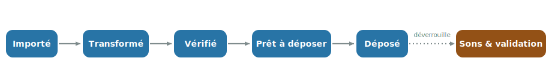

# Parcours métier

Le traitement d'une nuit de capture suit toujours le même fil : de la **carte SD** jusqu'au
**dépôt** sur la plateforme Vigie-Chiro, puis, quelques jours plus tard, la **validation des
espèces** identifiées. Cette page déroule ce parcours étape par étape.

  

| Étape | Ce que vous faites | Écran |
|---|---|---|
| **Importer** | Copier la carte SD, renommer et transformer les enregistrements | Importation |
| **Vérifier** | Contrôler la qualité (pré-check + écoute) et poser un verdict | Qualification |
| **Déposer** | Préparer le dépôt, générer les archives, les téléverser sur Vigie-Chiro, lancer la participation | Préparer le dépôt |
| **Valider** | Relire les espèces identifiées par Tadarida | Validation |

## L'écran Passage, votre pivot

Pour une nuit donnée, l'écran **Passage** est le point de pilotage : il affiche le **statut** de la
nuit, un résumé, et des cartes « avancer » vers l'étape suivante (une seule est mise en avant : la
prochaine action recommandée).

Le statut progresse ainsi :

  

Une fois la nuit **déposée**, la carte « Sons & validation » se déverrouille :

!!! warning "Le dépôt précède la validation"
    La **validation des espèces** (Tadarida) n'est accessible qu'une fois le **passage déposé** :
    Vigie-Chiro ne renvoie les résultats d'identification que **24 à 48 h après le dépôt**.
    L'application verrouille donc cette étape tant que le passage n'est pas au statut « Déposé ».
    L'ordre est bien **Vérifier, puis Déposer, puis Valider**.

## Importer la nuit

Branchez la carte SD, puis ouvrez **Importer une nuit**. L'assistant se remplit en trois temps :

1. **Dossier source** : désignez le dossier de la carte SD (ou une copie déjà sur disque).
2. **Inspection** : en lecture seule, l'application détecte le journal du capteur, le relevé
   climatique et les enregistrements WAV, et annonce ce qu'elle va renommer. **Aucun fichier de la
   carte n'est modifié.**
3. **Rattachement** : indiquez le site, le point d'écoute, l'année et le numéro de passage ;
   un aperçu montre le préfixe qui sera appliqué aux fichiers.

Un clic sur **Importer cette nuit** copie les fichiers (sans toucher aux originaux), les renomme
avec le préfixe `CarXXXXXX-AAAA-PassN-YY-`, puis les **transforme** en séquences d'écoute de 5 s
ralenties dix fois (les ultrasons deviennent audibles).

## Vérifier la qualité

Sur l'écran **Qualification**, vous contrôlez que la nuit est exploitable, à deux niveaux :

- un **pré-check synthétique** (couverture horaire, nombre de fichiers, cohérence du renommage) ;
- un **contrôle par écoute** sur une sélection automatique de 10 à 30 séquences réparties sur la
  nuit, via la vue audio (sonogramme et spectrogramme).

Vous posez ensuite un **verdict global** : OK, Utilisable ou Inexploitable. Cet écran se pilote
efficacement au clavier (voir [Raccourcis clavier](../raccourcis-clavier.md)).

## Déposer le passage

Sur l'écran **Préparer le dépôt**, le dépôt se fait en quatre temps :

1. **Préparer le dépôt** : l'application contrôle la cohérence du passage (préfixes, complétude).
2. **Générer les archives** : les séquences sont regroupées en archives ZIP prêtes à partir.
3. **Téléverser sur Vigie-Chiro** : si l'application est connectée, elle dépose les archives
   elle-même (plusieurs en parallèle, avec une reprise en cas de coupure). Sinon, repli : « Ouvrir le
   dossier » et dépôt **manuel** depuis votre navigateur.
4. **Lancer la participation** : demande à la plateforme de **traiter** ce que vous venez de déposer
   (décompression puis identification Tadarida). Après un dépôt manuel, ce bouton est un simple
   **« Marquer déposé »**.

!!! warning "Déposer ≠ faire traiter"
    Téléverser les fichiers ne déclenche **pas** le calcul : sans « Lancer la participation », la
    participation reste vide côté plateforme et aucun résultat n'arrivera. Détail sur la page
    [Préparer le dépôt](../ecrans/lot.md).

## Valider les espèces

**24 à 48 h après le dépôt**, Vigie-Chiro renvoie un fichier de résultats **Tadarida** (les espèces
détectées dans chaque séquence, avec leur probabilité). L'écran **Validation** vous permet alors de
relire ces résultats, séquence par séquence, et de **confirmer ou corriger** les identifications.

Cette étape est accessible une fois le passage déposé (voir l'avertissement plus haut).

## Pour aller plus loin

- [Référence par écran](../ecrans/index.md) : le détail de chaque écran et de ses états.
- [Raccourcis clavier](../raccourcis-clavier.md) : piloter l'application sans la souris.
